# Ansible Tower 自动化实践 (1) —— Red Hat Ansible Tower 架构与部署配置

## 文档说明

- OS 版本：CentOS Linux release 7.4.1708 (Core)
- Ansible 版本：`2.9.3`
- Ansible Tower 版本：`3.6.3`
- 该文档中 Red Hat Ansible Tower 简称为 `Ansible Tower`
- 👉 该示例仅使用单节点部署 Ansible Tower，并未使用 `Ansible Tower HA Cluster`。

> 关于 Ansible Tower HA Cluster 的部署可参见文末参考链接。

## 文档目录

- [系统环境说明](#系统环境说明)
- [Ansible Tower 概述](#ansible-tower-概述)
- [Ansible Tower 的部署架构](#ansible-tower-的部署架构)
- [Ansible Tower 安装要求](#ansible-tower-安装要求)
- [Ansible Tower 安装部署与验证](#ansible-tower-安装部署与验证)
- [Ansible Tower 常见故障排查](#ansible-tower-常见故障排查)
- [参考链接](#参考链接)

## 系统环境说明

- 节点硬件资源与角色：2 CPU、4G RAM、40G Disk
- 用户说明：`admin`（sudo）为 Ansible Tower 管理员与系统管理员
- Ansible 版本：ansible 2.9.3
- Ansible Tower 版本：ansible-tower-3.6.3-1.el7at.x86_64

## Ansible Tower 概述

- Ansible 的优点在于它是去中心化的工具，可以直接通过 ssh 管理远程主机，实现无 `Agent` 的部署（ssh + python 环境已经原生集成在 Linux 中）。
- 💥 Ansible 的缺点也在于其去中心化的特点，本身不支持高可用和分布式架构，无法实现 `Server-Proxy-Client` 的架构，在比较复杂或者多区域的网络区域中，无法实现统一的集中式管理（如多个 ansible 管理端的配置同步），也没有前端 `UI`，对 ansible 的技能要求比较高。
- Red Hat 为 Ansible 提供了一个 `Web UI`，即 `Ansible Tower`，使用它可以免费管理 `10` 台以内的主机。
- Ansible Tower 是 `Django` Web 应用，可在 Linux 服务器上作为企业内自托管方案运行，架设于企业的现有 Ansible 基础架构之上。
  
  <center>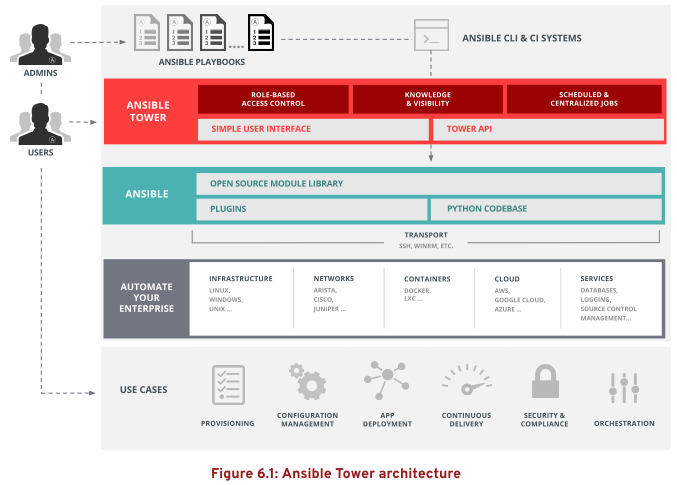</center>

- 用户通过 Ansible Tower 的 `Web UI` 或 `RESTful API` 与其底层 Ansible 基础架构交互。
  - Web UI 是图形界面，通过执行对 Ansible Tower RESTful API 的调用来执行操作。
  - 🚀 RESTful API 对于考虑将 Ansible 与现有软件工具和流程集成的用户至关重要。
- Ansible Tower 也支持 `Cluster` 集群方式，集群中的每个节点上都需要安装 `ansible` 和 `ansible tower`，通过修改配置文件来实现多个 Ansible Tower 组成一个或者多个集群。
- Ansible Tower 是目前唯一（除自研发方式外）能够实现底层 Ansible 高可用、水平扩展的解决方案。
- Ansible Tower 将其数据存储在 `PostgreSQL` 数据库中，同时使用 `RabbitMQ` 消息队列。
- 💥 Ansible Tower <= 3.0 版本还依赖于 `MongoDB` 数据库。
- 此依赖项后来已被移除，数据现在只存储在 PostgreSQL 数据库中。
- Ansible Tower 的功能比较简单，集群配置逻辑需通过配置文件实现，没有一个前端维护的界面，因此每次重新配置逻辑都需要在更新配置文件后重跑 Ansible Tower 的 setup 文件。​​​​

> 👉 Ansible Tower 的上游社区（upstream）开源项目为 [ansible/awx 项目](https://github.com/ansible/awx)

## Ansible Tower 的部署架构

- 具有集成式数据库的单一节点：
  Ansible Tower 组件、Web 前端、RESTful API 后端和 PostgreSQL 数据库全部部署于单一节点上。
- 具有远程数据库的单一节点：
  Tower Web UI 和 RESTful API 后端安装在单一节点上，而 PostgreSQL 数据库安装在同一网络中的另一个节点上。
  - 👉 方案 1：
    远程数据库托管在 Ansible Tower 管理范围外现有 PostgreSQL 实例的服务器上。
  - 👉 方案 2：
    使 Ansible Tower 安装程序在远程服务器上创建 PostgreSQL 实例，然后为它填充Ansible Tower 数据库。
- 🚀 高可用集群：
  - 较旧版本的 Ansible Tower 提供一种主动-被动式冗余架构，其包含一个主动节点和一个或多个被动节点。
  - 自 Ansible Tower 3.1 起，该架构现已被具有多个主动 Ansible Tower 节点的主动-主动式高可用集群取代。
  - 集群中的每一节点托管 Ansible Tower Web UI 和 RESTful API 后端，可以接收和处理请求。
  - 在这种集群架构中，PostgreSQL 数据库可托管于远程服务器上。
  - 远程服务器可以驻留包含 Ansible Tower 管理范围外的现有 PostgreSQL 数据库，或者具有安装程序所创建的、由 Ansible Tower 管理的 PostgreSQL 数据库。
  - 🤘 Ansible Tower 若配置为高可用集群，至少需要三个节点，并且是奇数个。
  - Ansible Tower 高可用架构示意：

    <center>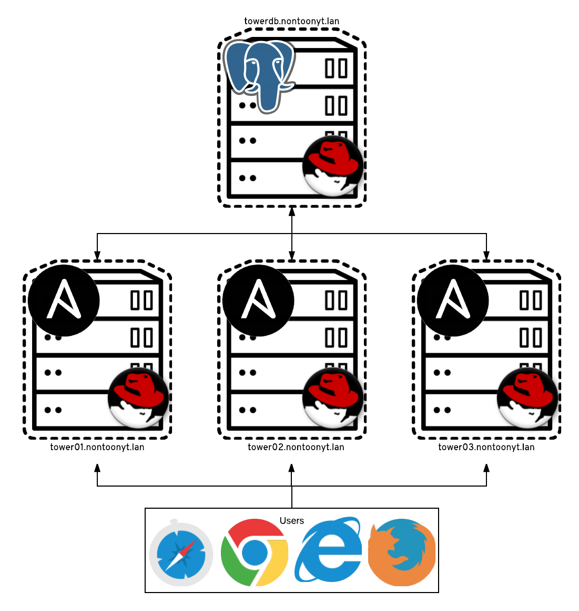</center>

    <center>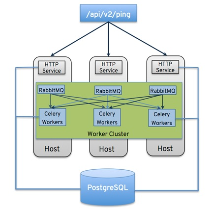</center>

    - 如上所示，三个 Ansible Tower 节点组成的集群共享一个 `PostgreSQL` 数据库。
    - 当然也可以给数据库做高可用，如 `hot standby/streaming replication` 或者 `warm standby/log shipping` 方式，具体方法可参考 PostgreSQL 相关技术文档。
    - 每个节点上都有 `RabbitMQ`，RabbitMQ 可以连接所有的 ansible tower 节点，并做任务下发的负载均衡。
    - 一个任务下发到某个 ansible tower 节点上，任务执行过程中，如果节点出现故障，任务需要重新提交，在其他 ansible tower 节点上执行。
- ✨ 带有远程数据库的 `OpenShift Pod`：
  - 该架构中，Ansible Tower 的运作方式是作为基于容器的集群在 `OpenShift` 上运行。
  - 该集群在 `OpenShift pod` 上运行，其中包含用于运行 Ansible Tower 组件的四个容器。
  - OpenShift 添加或删除 pod，以向上和向下扩展 Ansible Tower。
  - 该架构的安装过程与其他架构的安装过程有所不同。
  
  > 若要将 Ansible Tower 部署为 OpenShift 集群的一个 pod，则集群对每个 pod 将需要 `6 GB` 的内存和 `3` 个 CPU 核心。

## Ansible Tower 安装要求

- Ansible Tower 可以安装在 64 位 `x86_64` 版本的 `RHEL` 和 `CentOS` 上，并受支持。
- 内存要求：
  - Ansible Tower 主机上至少需要 `4 GB` RAM
  - 实际内存要求取决于 Ansible Tower 预计要并行配置的主机数最大值
  - 这由作业模板或系统配置中的 `forks` 配置参数管理
  - Red Hat 建议为每个额外的 fork 提供 `100 MB` 内存，并将 `2 GB` 用于 Tower 服务。
- 磁盘存储：
  - 至少需要 `20 GB` 的硬盘空间，并且该空间中的 `10 GB` 必须提供给 `/var` 目录。
- Ansible 引擎：
  - Ansible Tower 的安装通过执行运行 Ansible Playbook 的 `shell` 脚本进行。
  - 当前安装过程会自动尝试安装 Ansible 引擎及其依赖项（若其不存在）。
  - 若要使 Ansible Tower 正常运行，应使用软件包管理器（如 yum）安装 Ansible 引擎的最新稳定版。
  - 安装过程最好由 Ansible Tower 安装程序执行。
- SELinux：
  - Ansible Tower 支持 `targeted SELinux` 策略，它可以设置为强制模式、许可或禁用。
  - 其他 SELinux 策略不受支持。
- License 要求：
  - 首次安装并登陆 Ansible Tower 时需要提供 `License`。
- 👉 Ansible Tower 安装程序：
  - Ansible Tower 提供两种不同的安装软件包：
    - 联网安装方法：
      - 标准 `setup Ansible Tower` 安装程序 [下载地址](https://releases.ansible.com/ansible-tower/setup/)
      - Ansible Tower 最新版本 [下载地址](https://releases.ansible.com/ansible-tower/setup/ansible-tower-setup-latest.tar.gz)

      > 👉 此存档较小，需联网从不同的软件包源下载 Ansible Tower 软件包。

    - 离线安装方法：
      - 适用于 `RHEL 8` 的捆绑式（bundle）[安装程序](https://releases.ansible.com/ansible-tower/setup-bundle/ansible-tower-setup-bundle-latest.el8.tar.gz)
      - 此存档含有适用于 RHEL 8 的 Ansible Tower 的 RPM 软件包初始集合，可在没有联网的系统上安装。
      - 这些系统可能需要从可以访问的来源获取 RHEL 8 频道的软件包。
      - 高安全环境中的管理员可能倾向于限制对在线软件包存储库的访问。
      - `RHEL 7` 捆绑式安装程序也被提供。

## Ansible Tower 安装部署与验证

- 安装 Ansible 与配置 SSH 登录：
  
  ```bash
  $ yum install -y ansible
  # 安装 Ansible
  
  $ cd /root/.ssh && ssh-keygen -t rsa
  $ ssh-copy-id root@localhost
  # 配置 root 用户使用 SSH 免密码实现本地登录
  ```
  
  - Ansible Tower 使用 `Ansible Playbook` 的方式进行部署，因此需预先安装 `Ansible`。
  - Ansible Tower 配置过程使用的 inventory 默认 `localhost` 方式登录。
  - 💥 Ansible Tower 部署必须使用 `root` 用户运行 playbook，否则部署过程报错！
- 安装 Ansible Tower：此处使用联网安装方法
  
  ```bash
  $ wget https://releases.ansible.com/ansible-tower/setup/ansible-tower-setup-3.6.3-1.tar.gz
  # 下载 Ansible Tower 配置软件包，其中包含 inventory 清单文件与 playbook。
  
  $ tar -zxvf ansible-tower-setup-3.6.3-1.tar.gz
  # 解压 Ansible Tower 配置软件包
  
  $ cd ansible-tower-setup-3.6.3-1
  $ vim inventory
  # 修改 Ansible Tower 部署的主机清单
  ```
  
  该 inventory 清单文件如下所示：

  <center>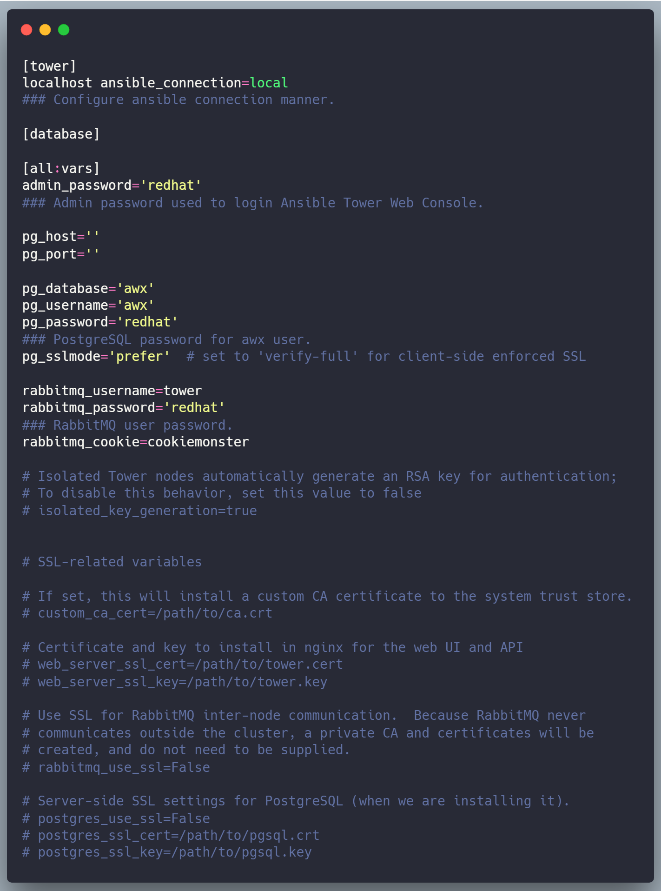</center>
  
  ```bash
  $ ./setup.sh
  # 运行 Ansible Tower 部署配置脚本
  # 配置部署过程需执行 15 分钟左右
  ```
  
  <center>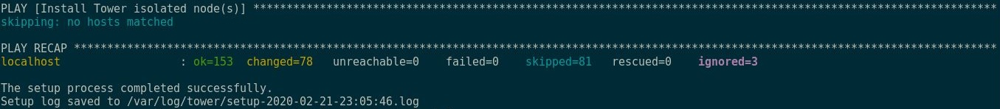</center>
  
  - 该脚本创建 Ansible Tower 安装所需的 yum 源。
  - 💥 安装过程中若相关软件包或依赖安装失败，需将 yum 源中的 `gpgcheck` 与 `gppkey` 全部禁用，并且启用 `ansible-tower.repo`。
  
  ```bash
  $ netstat -tunlp
  # 查看 Ansible Tower 服务组件的监听端口（Nginx、RabbitMQ、PostgreSQL、Postfix）
  ```
  
  <center>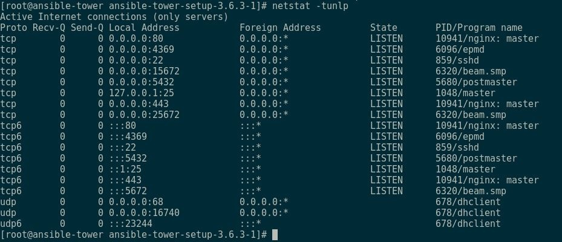</center>

- 登录 Ansible Tower：
  - Ansible Tower 使用 `Nginx` 监听前端 Web 请求，登录 URL 访问。

    <center>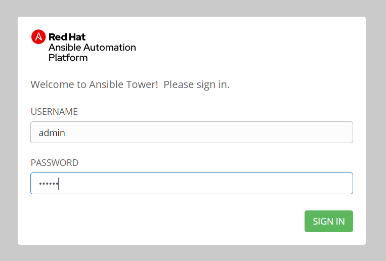</center>
  
  - 首次登录 Ansible Tower 需要验证 `License`。

    <center>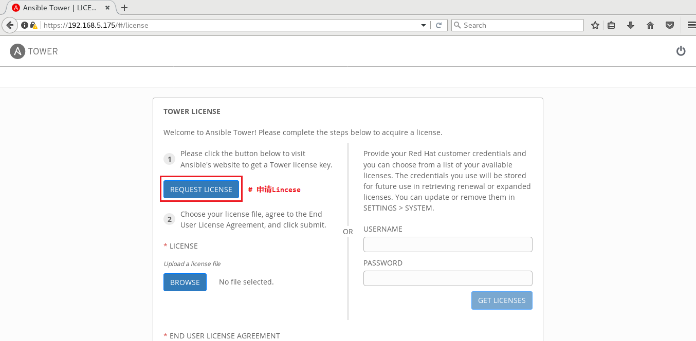</center>

    - 登录 Ansible Tower 必须导入 License 才能使用。
    - 可通过点击 `REQUEST LICENSE` 申请 License，或通过反编译 Python 程序破解 License。
    - 申请 License 后，将向注册邮箱发送邮件，其中包含 License。

      <center>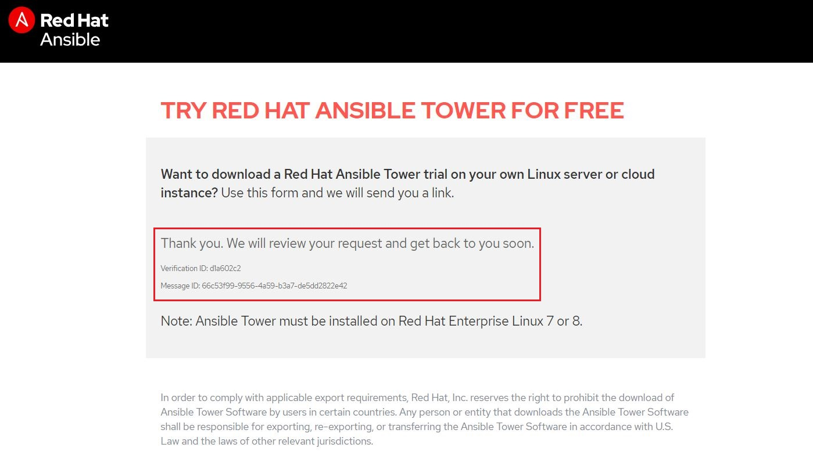</center>

    > 🤘 该示例使用反编译的方式破解 License。
  
  - 反编译 Python 程序：

    ```bash
    $ cd /var/lib/awx/venv/awx/lib/python3.6/site-packages/tower_license/
    # 切换至 tower license 目录
    $ tree -F .
    ```

    <center>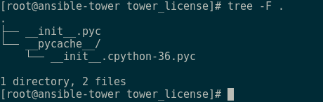</center>

    ```bash
    $ pip install uncompyle
    # 使用 pip 安装 Python 反编译模块
    
    $ cp -avr __init__.pyc __pycache__/ ~
    # 备份原 tower license 的 Python 程序
    
    $ cp ~/__init__.pyc .
    $ uncompyle6 __init__.pyc > __init__.py
    # 反编译 Python 程序为源代码，并修改该源代码。
    
    $ vim __init__.py
    # 在第 77 行 _check_cloudforms_subscription() 函数下添加 "return true" 语句以
    # 允许无 License 访问。
    ```

    <center>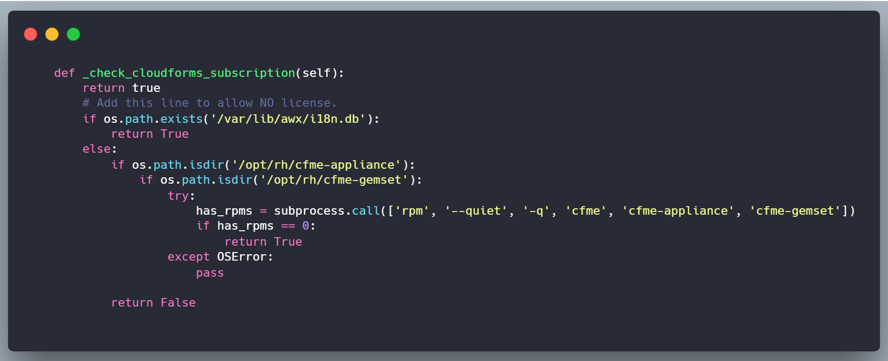</center>

    ```bash
    $ python -m py_compile __init__.py
    $ python -O -m py_compile __init__.py
    # 重新编译更改的 __init__.py 脚本，生成 .pyc 与 .pyo 程序。
    
    ┌─[root][tower][.../site-packages/tower_license]
    └─➞ pwd
    /var/lib/awx/venv/awx/lib/python3.6/site-packages/tower_license
    ┌─[root][tower][.../site-packages/tower_license]
    └─➞ ls -lh
    total 24K
    -rw-r--r--. 1 root root 9.0K Feb 23  2020 __init__.pyc
    -rw-r--r--. 1 root root 9.0K Feb 23  2020 __init__.pyo 
    
    $ ansible-tower-service restart
    # 重启 Ansible Tower 各服务组件，并登陆 URL 验证。
    ```
  
  - 重新登录 Ansible Tower 则无需 License，部署完成。

    <center>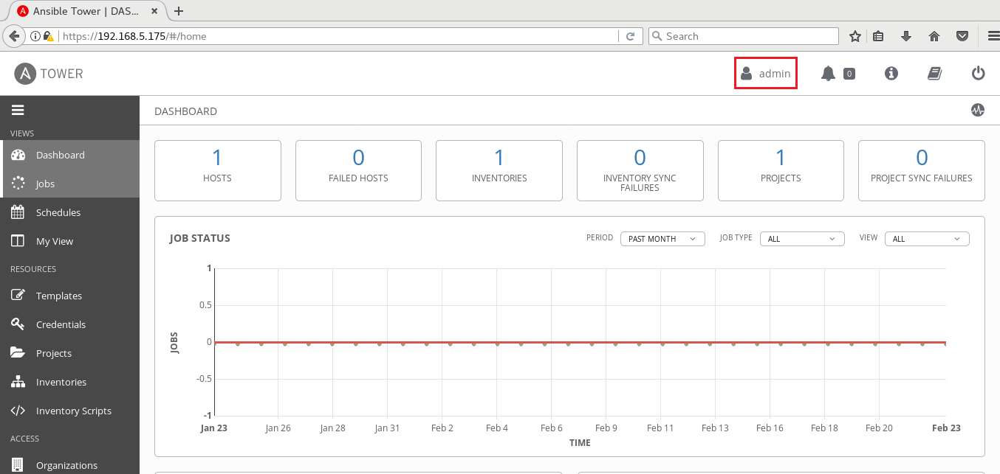</center>

## Ansible Tower 常见故障排查

- 示例 1：
  - 故障问题：
    使用 `SCM TYPE` 为 `Manual` 类型时，无法在 Ansible Tower 节点的 `/var/lib/awx/projects/` 目录中搜索到相应的项目目录，而导致 playbook 无法找到以及作业执行失败。
  - 解决方法：
    更改相应项目目录的所有者与所属组都为 `awx`，在 Ansible Tower 中再次刷新查看即可。

    <center>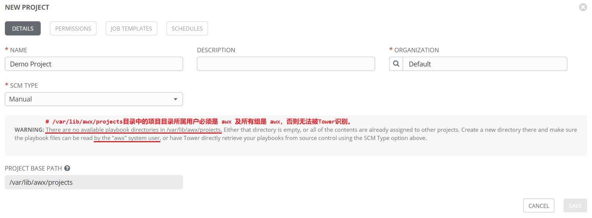</center>

### 参考链接

- [Ansible Tower 的容量规划与高可用设计](https://blog.51cto.com/u_15061931/2569102)
- [Building a highly available Ansible Tower cluster](https://100things.wzzrd.com/2017/03/13/Building-a-highly-available-Ansible-Tower-cluster.html)
- [Ansible Tower 中无法同步项目 playbook 的问题](https://docs.ansible.com/ansible-tower/2.3.0/html/quickstart/create_project.html)
