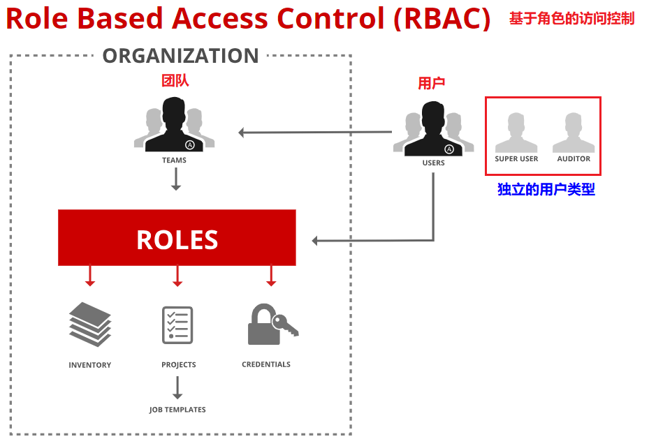
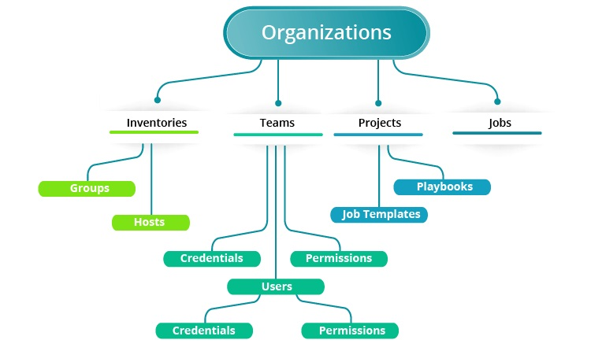

# Ansible Tower 自动化实践 (2) —— 使用用户和团队管理访问权限（1）

## 文档目录

- 创建与管理 Ansible Tower 用户
- 使用团队高效地管理用户

## 创建与管理 Ansible Tower 用户

- 基于角色的访问控制（`RBAC`）：
  - 使用统一 Ansible Tower 创建的不同用户需要具有不同的访问级别。
    - 有些用户可能只需要针对预先配置的清单运行现有的作业模板（job template）。
    - 其他用户需要能够修改特定的清单、作业模板和 playbook。
    - 还有一些用户可能需要访问权限，更改 Ansible Tower 安装中的任何内容。
  - 👉 Ansible Tower 内置管理用户 `admin`，拥有对整个 Ansible Tower 配置的超级用户访问权限。
  - 向用户分配角色（role），授予权限，以定义谁可以查看、更改或删除 Ansible Tower 中的资源对象（resource object）。
  - 角色通过基于角色的访问控制（RBAC）进行管理。
  - 可以通过将角色赋予团队来集中管理角色。
  - 👉 团队（team）是用户的集合。
  - 👉 团队中的所有用户都继承团队的角色。
  - 角色决定了用户和团队是否可以查看、使用、更改或删除清单和项目等对象（`CRUD` 权限）。

    

- Ansible Tower 组织：
  - Ansible Tower 组织（organization）：团队、项目、清单的逻辑集合

    

  
  - 🤘 所有用户都必须属于某一组织。
  - 实施 Ansible Tower 的一个好处是能够在企业内跨部门或职能边界共享 Ansible 角色和 playbook。
  - Ansible Tower 使不同的用户和组可以更加轻松地使用现有的角色和 playbook。
  - 对于非常大的部署，将大量用户、团队、项目和清单分类到整个组织下非常有用。
  - 通过使用组织，可以将用户和团队配置为仅使用预期 Ansible Tower 资源。
  - 👉 Ansible Tower 默认创建了 `Default` 组织。
