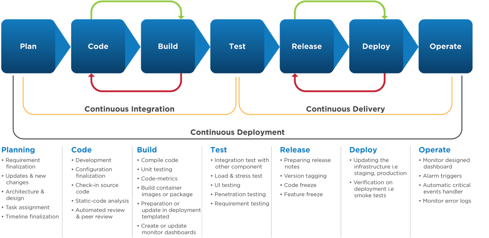
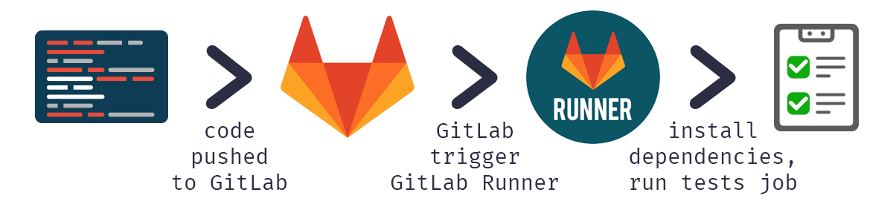
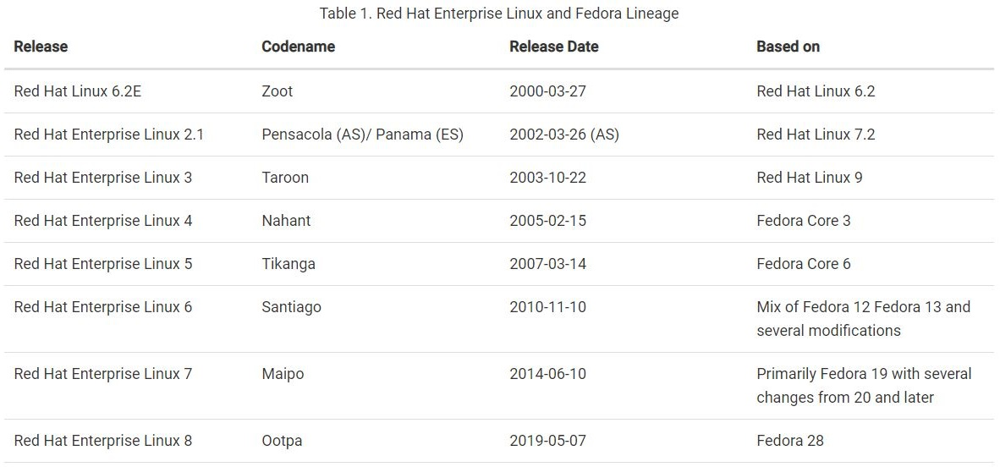
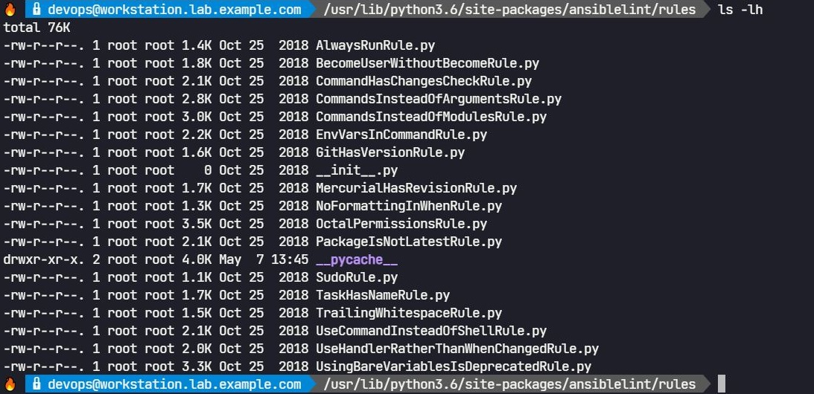
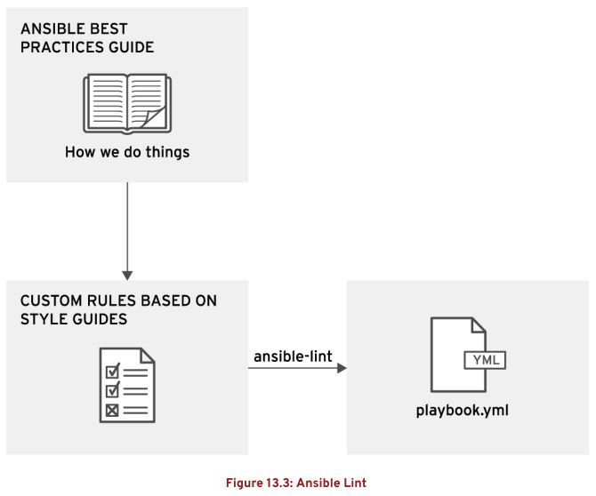

# Ansible Tower 自动化实践 (7) —— 使用 Ansible Tower 创建简单的 CI/CD 管道

## 文档目录

- 将 CI/CD 与 Ansible Tower 集成

## 将 CI/CD 与 Ansible Tower 集成

- 持续集成（`continuous integration, CI`）：
  - 持续集成使用自动化将各个开发⼈员的贡献集成到共享代码存储库的 `DevOps` 实践。
  - 持续交付（`continuous delivery, CD`）的重点是通过将过程结合在⼀起，更快、更频繁地执行进程。
  - 这种做法鼓励更频繁地提交少量更改，而不是以较低的频率提交大量更改。
  - 自动化的过程在整个作业中分组在一起，形成一个 CI/CD 管道（`CI/CD pipeline`）。
  - CI/CD 管道定义作业的执行顺序。
  - 👉 CI/CD 管道中的作业的部分示例可能包括：
    - 语法检查（`syntax checking`）以确保代码不包含任何防止代码编译的语法错误。
    - `Lint`（运行程序分析代码）以检测代码可能得到的改进。
    - 调用必要的步骤来构建代码，以生成可部署的组件。
    - 部署代码并将其发布到服务器。
    - 1️⃣ 烟雾测试（`smoke testing`）：采用粗略的有限测试形式，以确保最重要的功能有效。
    - 2️⃣ 单元测试（`unit testing`）：以验证单个代码单元（功能）是否按预期工作。
    - 3️⃣ 集成测试（`integration testing`）：以验证单个代码单元（功能）是否按预期一起工作。
    - 4️⃣ 回归测试（`regression testing`）：以验证新的或最近修改的代码不会对现有功能（函数）产生负面影响。

    <center></center>
  
  - CI/CD 管道具有很多优点：
    - 在提交代码后对其操作状态进⾏快速反馈。
    - 在签入代码时，对代码的端到端测试是⾃动化的，可加快代码开发人员之间的反馈循环。
    - 促进来自不同开发人员的代码的集成。
    - 更好地了解开发人员在代码上的协作。
    - 开发人员和测试人员能够进⼀步缩短反馈循环。
  - 使用 CI/CD 管道的前提：
    - 对分布式版本控制服务（`SCM`）的访问权限
    - 对代码的测试
    - 对 CI/CD 服务的访问权限，以运行测试。
- 使用 GitLab 构建 CI/CD 管道：
  - 在 CI/CD 管道中，GitLab 使用运行程序（`runner`）在管道内运行作业。
  - runner 提供执行管道的环境。
  - runner 可以特定于项目，也可以在所有项目之间共享。
  - runner 执行程序（`executor`）用于作业内执行命令。
  - executor 可以为：
    - 容器（container）
    - 虚拟机（virtual machine）
    - 本地 shell（作业在 GitLab 主机的 shell 中执行）
    - SSH 连接到其他主机以执行作业
  - 理想情况下，runner 会独立于任何已连接的系统执行管道中定义的代码。

    <center></center>
  
  - GitLab CI/CD 工作流程详细示意：

    <center></center>

- 🤘 CI/CD 与红帽 Ansible Tower：
  - 使用与红帽 `Ansible Tower` 集成的 `CI/CD` 管道，在每次提交到 Ansible Playbook 项目时执行自动化的例程。
  - 典型的自动化例程的执行步骤示例：
    - 从 `dev` 分支中调取最新版本的 playbook。
    - 执行语法检查以确保代码的健全，并执行 `lint` 以确保符合一组最佳实践规则。
    - 将 playbook 从 dev 分支同步到 Ansible Tower 中的项目。
    - 使用 dev 分支中的代码，针对 Ansible Tower 中的 `Dev` 清单执行作业模板。
    - 以 Dev 清单中主机的单元测试形式验证关键组件的功能。
    - 将 dev 分支合并（merge）到 `master` 分支。
    - 将 playbook 从 master 分支同步到 Ansible Tower 中的项目。
    - 使用 master 分支中的代码，针对 Ansible Tower 中的 `Prod` 清单执行作业模板。
    - 以 Prod 清单中主机的单元测试形式验证关键组件的功能。
    - 发送通知，告知开发人员作业的状态。
  - 此管道可自动执行本来必须手动执行的过程。
  - 通过自动化，开发人员可以专注于使用其选择的工具创建和编辑 playbook。
  - 开发人员可以简单地提交其工作，了解 CI 管道的自动化已与红帽 Ansible Tower 集成。
- Ansible Lint：
  - `Ansible Lint` 是一种命令行工具，可用于检测可能改进的错误、缺陷、可疑代码构造和样式错误。
  - Ansible Galaxy 项目用于 lint 和计算贡献到 Galaxy 中心的内容的质量得分。
  
  > 💥 注意：
  >
  > 1. 该 ansible-lint 命令当前未附带红帽 Ansible 自动化或受到红帽的正式⽀持，但由  Ansible 社区在上游开发。
  >
  > 2. 此命令包含在适用于 RHEL 7 的 EPEL 和当前版本的 Fedora 中，有关 RHEL 与 Fedora 版本间的对比可参考 [Fedora and Red Hat Enterprise Linux](https://docs.fedoraproject.org/en-US/quick-docs/fedora-and-red-hat-enterprise-linux/) 与 [Fedora 和红帽企业 Linux 有什么区别？](https://www.redhat.com/zh/topics/linux/fedora-vs-red-hat-enterprise-linux)，如下所示：
  >
  > <center></center>
  >
  > 3. 有关在其他操作系统上安装的说明，请访 [Ansible Lint 文档](https://docs.ansible.com/ansible-lint/)。
  
  - Ansible Lint 以 Python 模块的形式使用 `${PYTHON_PATH}/site-packages/ansiblelint/rules/` 中的规则，可以按原样使用，或者根据自己的需求编辑。

    <center></center>
  
  - 与 `ansible-playbook --syntax-check` 命令相比，ansible-lint 命令更能验证 playbook 的健全性，因此，在使用 ansible-lint 命令时无需使用 ansible-playbook --syntax-check。
  - ✅ 最佳实践：许多团队或组织具有自身的编码风格，因此可自行编写 ansible-lint 对应的 Python 模块以实现自定义的编码风格检查，样式的一致性可提高 playbook 的可读性，也可提高 playbook 运行故障时的排查效率。

    <center></center>

    ```bash
    $ ansible-lint --help
    Usage: ansible-lint [options] playbook.yml [playbook2 ...]
    
    Options:
      --version             show program's version number and exit
      -h, --help            show this help message and exit
      -L                    list all the rules
      -q                    quieter, although not silent output
      -p                    parseable output in the format of pep8
      -r RULESDIR           specify one or more rules directories using one or
                            more -r arguments. Any -r flags override the default
                            rules in /usr/lib/python3.6/site-
                            packages/ansiblelint/rules, unless -R is also used.
      -R                    Use default rules in /usr/lib/python3.6/site-
                            packages/ansiblelint/rules in addition to any extra
                            rules directories specified with -r. There is no need
                            to specify this if no -r flags are used
      -t TAGS               only check rules whose id/tags match these values
      -T                    list all the tags
      -v                    Increase verbosity level
      -x SKIP_LIST          only check rules whose id/tags do not match these
                            values
      --nocolor             disable colored output
      --force-color         Try force colored output (relying on ansible's code)
      --exclude=EXCLUDE_PATHS
                            path to directories or files to skip. This option is
                            repeatable.
      -c C                  Specify configuration file to use.  Defaults to
                            ".ansible-lint"
    ```

    ```bash
    $ ansible-lint -R /path/to/customized/rules/ <playbook_name>.yml
    # 使用 ansible-lint 默认规则与自定义规则检测 playbook 的代码合规性
    $ ansible-lint -r /path/to/customized/rules/ <playbook_name>.yml
    # 使用自定义规则（覆盖 ansible-line 默认规则）检测 playbook 的代码合规性
    $ ansible-lint -L
    # 查看默认的所有的 playbook 代码合规性
    ```
