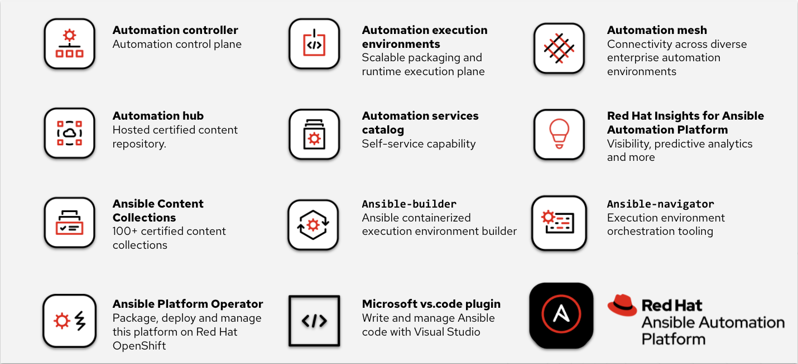
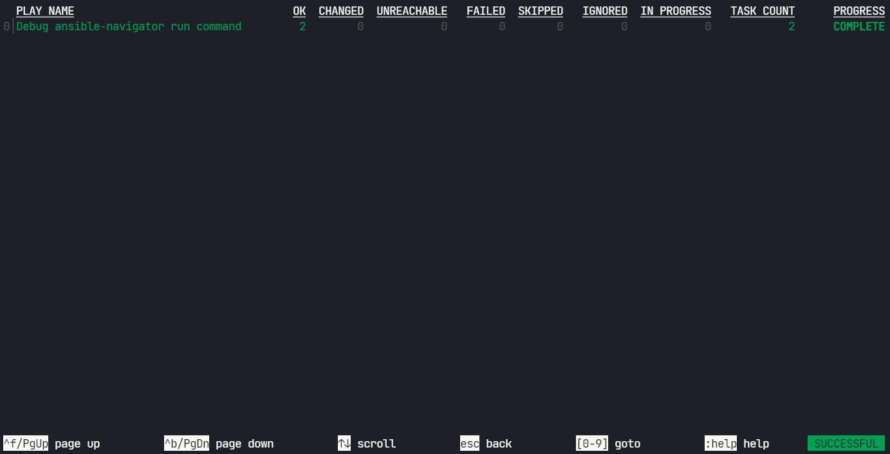
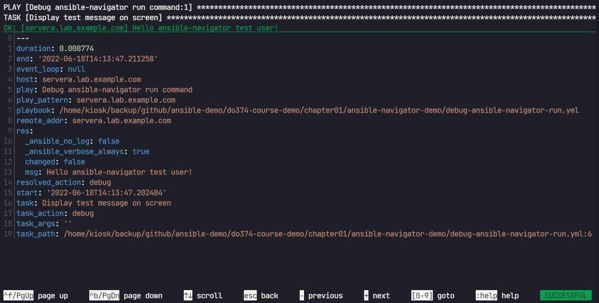
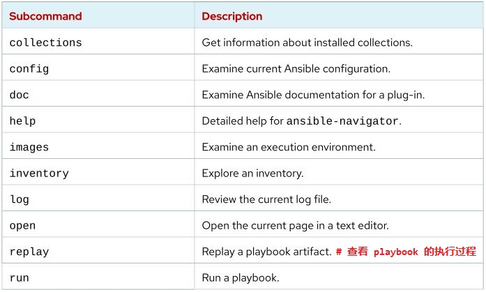
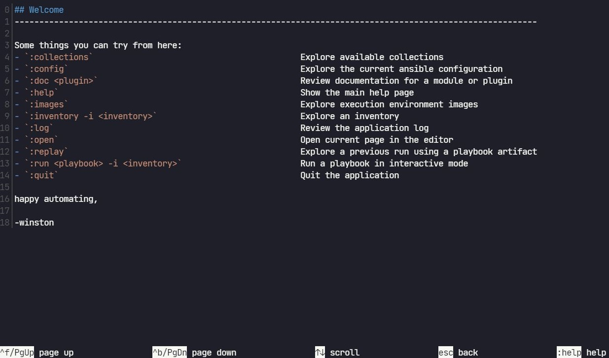
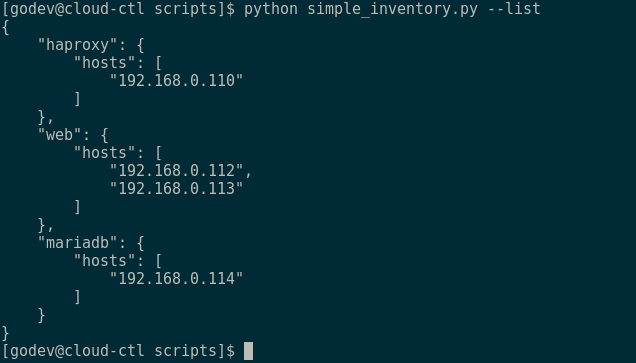

## Ansible 自动化进阶实践 (6) —— 使用 Ansible 自动化平台 2.0 开发 Playbook

### 文档目录：

- Ansible 自动化平台 2.0 简介

- 使用自动化内容导航器运行 Playbook

- 使用 Git 管理 Ansible 项目资料

- 实施推荐的 Ansible 做法

### Ansible 自动化平台 2.0 简介：

- Ansible 自动化平台 2.0 组件：
  
  - `Ansible Core`：
    
    - 提供了运行 Ansible Playbook 的基本功能。
    
    - 👉 提供了自动化代码所需的关键功能，如循环、条件和其他 Ansible 命令，还提供了驱动自动化所需的框架和基本命令行工具。
    
    - Ansible 自动化平台 2.0 提供了 `Ansible Core 2.11`，其位于 `ansible-core` RPM 软件包内。
  
  - `Ansible Content Collections`（Ansible 内容集合）：
    
    - 使用 Ansible 模块时的一些挑战，如用户有时希望使用比 Ansible 特定版本中附带模块版本更早或更⾼的模块。
    
    - 👉 Ansible 内容集合：
      
      - 由上游开发人员将大多数模块重新整理的资源集合。
      
      - 这些资源集合相关的模块（module）、角色（role）和插件（plug-in）构成，由同一组开发人员提供支持。
    
    - Ansible Core 本身仅限于由 `ansible.buildin` Ansible 内容集合提供的一小组模块，该集合始终是 Ansible Core 的⼀部分。
    
    - 👉 用户可以根据自身需求灵活地选择不同版本（`different versions`）的集合或不同系列（`different sets`）的集合，它也让开发人员能够独立于 Ansible 本⾝的节奏更新他们的模块。
    
    - Red Hat 及其合作伙伴通过 Ansible 自动化平台为特定资源集（即 Red Hat Ansible 认证内容集）提供官方支持。
  
  - 🚀 `Automation Content Navigator`（自动化内容导航器）：
    
    - 👉 自动化内容导航器（`ansible-navigator`）：
      
      - 由 Ansible 自动化平台 2.0 提供的新的顶级工具，可使用其来开发和测试 `Ansible Playbook`。
      
      - 此工具取代并扩展了多个较旧命令行工具的功能，包括 ansible-playbook、ansible-inventory 和 ansible-config 等。
    
    - 此外，通过在容器中运行 playbook，将运行 Ansible 的控制节点与运行它的自动化执行环境分隔开来，因此，可更轻松地为自动化代码提供完整的工作环境，以部署到生产环境中。
  
  - `Automation Execution Environments`（自动化执行环境）：
    
    - 👉 自动化执行环境：
      
      - 是一种容器镜像（`container image`），其包含 Ansible Core、Ansible 内容集合，以及运行 playbook 所需的任何 Python 库、可执行文件或其他依赖项。
      
      - 使用 ansible-navigator 运行 playbook 时，可选择用于运行该 playbook 的自动化执行环境。
    
    - 当代码工作时，可向自动化控制器（以前称为 `Red Hat Ansible Tower`）提供 playbook 和自动化执行环境，并且清楚⾃动化控制器具有正确运行 playbook 所需的一切。
    
    - 自动化执行环境的另一个优点：
      
      - ✨ 使用它们来运行 Ansible 的早期版本。
      
      - Red Hat 还⽀持提供 `Ansible 2.9` 的自动化执行环境，以便与早期版本兼容。
      
      - 也可使用 Ansible 自动化平台 2.0 提供的新工具 `ansible-builder` 来自行创建自定义执行环境（容器镜像）。
      
      
  
  - `Automation Controller`（自动化控制器）：
    
    - 自动化控制器以前称为 `Red Hat Ansible Tower`，是 Ansible 自动化的⼀个组件，提供中央控制点来运行企业自动化代码，其提供了 `Web UI` 和 `REST API`，可⽤于配置、运行和评估自动化作业。
    
    - 在 Red Hat Ansible Tower 中，系统既是控制节点，也是自动化执行环境。
    
    > 💥 当前版本中 Red Hat Ansible Tower 即作为控制节点，也作为受管主机用以实现自动化执行环境。
    
    - 若在 Ansible Tower 上的自动化执行环境中，自动化代码需要与默认提供的系统不同的 Python 依赖项，必须手动设置单独的 Python 虚拟环境（或 `venv`）供自动化代码使用，不仅管理和分发难度高，还需要更新运行 Ansible Tower 的系统，而且扩展性也不尽人意。
    
    - 新的自动化控制器设计通过将控制节点（提供 Web UI 和 API）与自动化执行环境（容器中运行）分离来攻克该难题。
    
    - 可从容器镜像仓库部署基于容器的自动化执行环境，只需在 Web UI 中更改配置，即可将其替换为特定的 Ansible Playbook。
    
    - 按照计划，Ansible 自动化平台未来版本中的自动化控制器将能够在远程节点上运行自动化执行环境，并使用称为自动化网格（automation mesh）的新功能通过网络与它们通信。
  
  - `Ansible Automation Hub`（Ansible 自动化中心）：
    
    - 提供一种管理和分发自动化内容的⽅式。
    
    - 可通过 `console.redhat.com` 上的公共服务访问 Red Hat Ansible 认证内容集合，将这些内容集合下载下来与 ansible-galaxy（用于 ansible-navigator）和自动化控制器一起使用。
    
    - 还可设置私有自动化中心（`private automation hub`），用以创建自定义的 Ansible 内容集合。
    
    - 私有自动化中心还提供容器镜像仓库，可实现分发自动化执行环境。
    
    - 这为⾃动化控制器和组织的 Ansible 开发人员提供一个集中位置，来获取自动化内容。
  
  - `Hosted Services`（托管服务）：
    
    - `console.redhat.com`：托管 Ansible 自动化中心
    
    - `Red Hat Insights for Red Hat Ansible Automation Platform`：红帽 Ansible 自动化平台的红帽智能分析
    
    - `Automation Services Catalog`：自动化服务目录

- Red Hat Ansible Automation Platform 2.0 组件与架构：
  
  
  
  
  
  使用 Ansible 自动化平台 2.0 开发 Playbook：
  
  - 由于不需要使用虚拟环境或在自动化控制器上安装模块及其依赖项，自动化控制器自动化内容导航器均支持自动化执行环境，这简化了从开发 playbook 过渡到在生产中运行 playbook 的过程。
  
  - 只要自动化控制器自动化内容导航器可以访问相同的⾃动化执⾏环境，您的 playbook 从开发过渡到⽣产应该⼏乎是顺畅⽆阻的。

### 使用自动化内容导航器运行 Playbook：

- 自动化内容导航器（ansible-navigator）简介：
  
  - `ansible-navigator` 将以前由 `ansible-playbook`、`ansible-inventory`、`ansible-config` 和 `ansible-doc` 提供的功能组合到一个顶级界面中。
  
  - ansible-navigator 的工作模式：
    
    - 1️⃣ 基于文本的用户界面（`text-based user interface`）提供新的交互模式。
    
    - 2️⃣ 使用 `--mode stdout`（或 -m stdout）选项运行，以早期工具使用的原始格式来提供输出。
      
      ```bash
      $ ansible-navigator run <playbook_name>.yml -m stdout \
        [--execution-environment-image|--eei] <execution_environment_image>
      # 使用指定的自动化执行环境（容器镜像）在其中运行 ansible-playbook，并将任务推送至
      # 指定的受管主机。 
      # --execution-environment-image 或 --eei 选项指定自动化执行环境容器镜像
      ```
      
      > 💥 注意：若未以其他方式指定自动化执行环境，ansible-navigator 将以 `registry.redhat.io/ansible-automation-platform-20-early-access/ee-supported-rhel8:2.0.0` 作为默认的自动化执行环境。
      
      以上默认的自动化执行环境可使用如下命令拉取：
      
      ```bash
      $ podman login registry.redhat.io
      # 使用 Red Hat 订阅账号登录容器镜像仓库
      $ podman pull registry.redhat.io/ansible-automation-platform-20-early-access/ee-supported-rhel8:2.0.0 
      # 拉取默认的自动化执行环境（容器镜像）
      ```
    
    - ansible-navigator run 命令可使用 `--pull-policy` 选项或 `--pp` 选项指定自动化执行环境镜像的拉取策略：
      
      - `always`：始终拉取镜像
      
      - `never`：从不拉取镜像
      
      - `tag`：若镜像标签为 latest 或在本地尚未存在（默认）则拉取镜像
      
      - `missing`：仅在本地尚不存在时拉取镜像
    
    - 若未使用 -m stdout 选项，将进入基于文本交互界面，实时显示 playbook 的运行的输出概要信息，用户可在该界面中在 playbook 结束运行后查看更为详细的执行过程。
      
      
      
      以上界面中输入 `:0` 可进入指定 play 的运行界面，如下所示：
      
      
      
      以上界面中输入 `:1` 可进入指定 task 的运行界面，如下所示：
      
      
      
      👉 文本交互界面的最下方显示了操作该界面的方法。
  
  - 通过自动化执行环境提高可移植性：
    
    - Ansible 自动化平台 2.0 支持自动化执行环境。
    
    - 🤘 自动化执行环境是一种容器镜像，其中包含 Ansible 内容集合、其软件依赖项，以及可运行 playbook 并与 Ansible 交互的最小 Ansible 引擎。
    
    - ansible-navigator 和自动化控制器（以前称为 `Red Hat Ansible Tower`）都使用自动化执行环境，在一个统一的 Ansible 环境中简化自动化代码的开发、测试和部署。
    
    - Red Hat 提供了多种受支持的自动化执行环境，由稍有差异的 Ansible 部署组成，也可创建自定义的自动化执行环境。
    
    - 通过自动化执行环境，可在自动化控制器上创建多个 Python 虚拟环境。
    
    - 由于 Red Hat Ansible Tower 需要多个 Python 虚拟环境以支持 Ansible、模块、Python 库和其他软件依赖项的不同组合，借助自动化执行环境，可避免在自动化控制器上创建多个 Python 虚拟环境。
    
    - ✅ Ansible 自动化平台 2.0 使用多个自动化执行环境，而不是多个 Python 虚拟环境，开发人员可以在自定义执行环境中创建定制的环境，使用 ansible-navigator 对其进行测试，并将其作为容器镜像分发到自动化控制器。
    
    - 若使用 ansible-navigator 运行 playbook，并且不指定特定的自动化执行环境， ansible-navigator 将自动尝试从 `registry.redhat.io` 调取默认的自动化执行环境（若本地不存在）。
    
    - 对于 Ansible 自动化平台 2.0，此默认环境包括 `Ansible Core 2.11` 和一组标准的 Ansible 内容集合。

- 安装自动化内容导航器：
  
  - 👉 ansible-navigator 只需安装于控制节点，受管节点上无需安装。
  
  - 安装由 Red Hat 提供的 ansible-navigator 需要使用订阅账号。
    
    ```bash
    $ sudo subscription-manager register
      Registering to: subscription.rhsm.redhat.com:443/subscription
      Username: <username>
      Password: <password>
      The system has been registered with ID: 0e6f20c0-17c2-45c3-8447-feff7c489787
      The registered system name is: foundation0
    # 将主机注册至 Red Hat 注册服务器
    $ sudo subscription-manager repos \
      --enable ansible-automation-platform-2.0-early-access-for-rhel-8-x86_64-rpms
    # 启用上述订阅仓库以安装 ansible-navigator
    $ sudo yum install -y ansible-navigator 
    ```
  
  - 🚀 若使用上游社区提供的 ansible-navigator，可使用 [GitHub](https://github.com/ansible/ansible-navigator) 中提供的方法进行安装，如下所示：
    
    ```bash
    $ sudo pip3 install 'ansible-navigator'
    # 使用 pip3 安装 ansible-navigator
    $ ansible-navigator --version
      ansible-navigator 1.1.0
    ```

- 配置受管主机的身份验证：
  
  - 自动化内容导航器需要能够登录受管主机并获得受管主机的超级用户特权。
  
  - 实现方法如下所示：
    
    - 准备基于 SSH 密钥的身份验证： 
      
      - 在控制节点的指定项目目录中创建 `./ansible.cfg` 配置文件，并且定义远程受管主机的用户 `remote_user`。
      
      - 为运行 ansible-navigator 命令的用户使用 ssh-keygen 生成 SSH 密钥对。
      
      - 将生成的用户 SSH 公钥注入至远程受管主机 remote_user 的 `~/.ssh/authorized_keys` 文件中。
      
      - 为 remote_user 在远程受管主机上配置 `sudo` 免密提权。
    
    - 为自动化执行环境提供 SSH 私钥：
      
      - 💥 ansible-navigator 无法使自动化执行环境识别控制节点上运行用户 `~/.ssh` 目录中的 SSH 私钥。
      
      - 在运行 ansible-navigator 时，控制节点上执行如下命令，可自动将 SSH 私钥提供给自动化执行环境：
        
        ```bash
        $ eval $(ssh-agent)
        # 启用 ssh-agent 进程
        $ ssh-add ~/.ssh/<private_key_name>_rsa
        # 将执行 ansible-navigator 的用户的 SSH 私钥添加至 ssh-agent 代理中
        ```

- 运行自动化内容导航器：
  
  - ansible-navigator 命令的子命令：
    
    🤘 可在命令行上直接执行 ansible-navigator 命令或进入交互界面使用 `:` 启用以下子命令。
    
    
    
    
    
    - 运行 Playbook：
      
      可使用 `ansible-navigator run` 命令或进入交互界面运行 `:run` 子命令，以使用自动化内容导航器来运行 playbook。
    
    - ✨ 检查以前 Playbook 的运行：
      
      - 自动化内容导航器的新功能：显示之前 playbook 的运行输出
      
      - 默认已启用 playbook 构件（artifact），`ansible-navigator run` 命令将生成 playbook 构件文件。
      
      - 👉 playbook 构件文件也称为重播文件（replay file）。
      
      - playbook 构件文件的名称格式：
        
        `<playbook_name>-artifact-2022-06-25T13:54:18.304147+00:00.json` 
        
        其名称由 playbook 名称、日期与时间、UTC 记录的时间组成
      
      - 可使用 playbook 构件文件查看 playbook 的执行过程：
        
        ```bash
        $ ansible-navigator replay debug-ansible-navigator-run-artifact-2022-06-25T13:54:18.304147+00:00.json
          PLAY NAME                                  OK  CHANGED  UNREACHABLE   FAILED  SKIPPED   IGNORED   IN PROGRESS   TASK COUNT      PROGRESS
        0│Debug ansible-navigator run command         2        0            0        0        0         0             0            2      COMPLETE
        ...
        # 进入交互界面以查看指定 playbook 构件文件所保存的 playbook 执行过程
        ```
      
      - playbook 构件文件可保存、重命名或删除，以方便后续排错使用。
    
    - 阅读文档：
      
      - 自动化内容导航器提供对插件文档的访问，包括模块、查找与回调插件等，与 ansible-doc 非常相似。
      
      - ansible-navigator 不支持 `--list` 或 `-l` 选项，必须明确指定插件名称，但可使用如下方法列举默认支持的所有模块：
        
        ```bash
        $ ansible-navigator doc -l -m stdout \
          --eei registry.redhat.io/ansible-automation-platform-20-early-access/ee-supported-rhel8:latest
        ```
      
      - 可直接运行如下命令获取相关模块的使用方法：
        
        ```bash
        $ ansible-navigator doc ansible.posix.firewalld
        # 查看 ansible.posix.firewalld 模块的使用方法
        $ ansible-navigator doc ansible.builtin.copy
        # 查看 ansible.builtin.copy 模块的使用方法
        ```
    
    - 获得帮助：
      
      - ansible-navigator 的 `--help` 选项以获得帮助。
        
        - 以上命令并不总是显示所有选项，如运行 `ansible-navigator run --help` 将显示如下信息：
          
          ```bash
          Note: 'ansible-navigator run' additionally supports the same parameters as the
          'ansible-playbook' command. For more information about these, try 'ansible-
          navigator run --help-playbook --mode stdout'
          # 只显示部分的帮助信息
          
          $ ansible-navigator run --help-playbook --mode stdout \
            --eei quay.io/ansible/ansible-navigator-demo-ee:0.6.0
          # 查看完整的帮助信息 
          ```
      
      - 进入交互界面运行 `:help` 子命令以获得帮助。

- 🏷 安装 ansible-navigator：
  
  安装 ansible-navigator 前请确保可正确安装 Podman（直接 yum 或 dnf 方式安装）。
  
  ansible-navigator 的两种安装方式：
  
  - 使用订阅账号从 RedHat 的 `RHAAP2.2` 软件源安装：
    
    ```bash
    $ sudo subscription-manager register --username <username>
      Password: ********  # 输入登录密码
    # 使用订阅账号登录订阅注册服务器
    $ sudo subscription-manager list --available | less
    # 查看当前的订阅账号可用的产品信息，查找 Red Hat Ansible Automation Platform
    # 所对应的 Pool ID。
    $ sudo subscription-manager attach --pool <pool_id>
    # 附加对应的 Pool ID
    # 该命令将所有可用的软件源写入 /etc/yum.repos.d/redhat.repo 文件中
    $ sudo subscription-manager repos --list
    # 查看当前可用的软件源（可选步骤）
    $ sudo subscription-manager repos \
      --enable ansible-automation-platform-2.2-for-rhel-9-x86_64-rpms
    # 启用 RHAAP2.2 软件源
    $ sudo dnf install -y ansible-navigator
    # 安装 ansible-navigator
    ```
  
  - [社区版 ansible-navigator 安装](https://ansible-navigator.readthedocs.io/installation/#install-ansible-navigator)：
    
    ```bash
    $ sudo dnf install python3-pip -y
    $ python3 -m pip install ansible-navigator --user
    $ echo 'export PATH=$HOME/.local/bin:$PATH' >> ~/.bashrc
    $ source ~/.bashrc
    $ ansible-navigator --version
    ```

### 使用 Git 管理 Ansible 项目资料：

- 该小节的内容请参考 [Git 基础进阶与场景实践](https://github.com/Alberthua-Perl/tech-docs/blob/master/DevOps%20%E6%8A%80%E6%9C%AF%E6%A0%88/Git%20%E5%9F%BA%E7%A1%80%E8%BF%9B%E9%98%B6%E4%B8%8E%E5%9C%BA%E6%99%AF%E5%AE%9E%E8%B7%B5.md)。

### 实施推荐的 Ansible 做法：

- 保持简单：
  
  - Ansible 的一大优势是简洁性。
  
  - 如果使 playbook 保持简单，就能更加轻松地使用、修改和理解它们。
  
  - 保持 playbooks 的可读性：
    
    - YAML 不属于编程语言，而是标记型语言。
    
    - 它非常适合表述一系列任务或项目，或者一组键值对。
    
    - 若难以在 Ansible Playbook 中表述一些复杂的控制结构或条件，可考虑通过另一种方式解决问题。
    
    - 可通过模板和 Jinja2 过滤器处理变量中的数据，这可能更适用于解决问题。
    
    - 使用原生的 `key: value` YAML 语法，而不使用如下的 "折叠"（`key=value`）语法：
      
      ```yaml
        - name: Postfix is installed and updated
          yum: name=postfix state=latest
          notify: restart_postfix
        - name: Postfix is running
          service: name=postfix state=started
      ```
  
  - 使用现有模块：
    
    - 编写新 playbook 时，从基本 playbook 开始，并尽可能使用静态 inventory。
    
    - 在构建设计时，使用 debug 模块。
    
    - 酌情使用 Ansible 中包含的特殊用途模块，而不是 command、shell、raw 或其他类似的模块。
    
    - 许多模块具有一个默认的 state 或其他变量控制其用途。
    
    - 但应该明确指定所需的 state，这样，可轻松地阅读 playbook，防止模块的默认行为在Ansible 的后续版本中发生更改。
    
    - 👉 遵循标准样式：
      
      - 编写 Ansible 项目时，应考虑一个需要遵循的标准 "样式"：
        
        - 缩进多少空格、如何使用垂直空白
        
        - 如何命名任务、play、角色和变量
        
        - 应对什么进行注释、如何注释
      
      - 遵循同一的标准有助于提⾼可维护性和可读性。

- 井然有序：
  
  - 👉 遵循变量命名约定：
    
    - 变量命名非常重要，因为 Ansible 具有相对扁平的命名空间。
    
    - 使用描述性变量。
    
    - 在角色中，使用角色名称为角色变量加上前缀是好做法。
      
      如角色命名为 myapp，那么变量名称开头为 `myapp_`。
    
    - 变量名称应阐明内容。
      
      如 apache_max_keepalive 等名称可以解释相关的一个或多个值的含义。
    
    - 为角色和组变量加上变量所属角色或组的名称作为其前缀。
      
      如 apache_port_number 比 port_number 更能防止错误。
  
  - 标准化项目结构：
    
    - 构造 Ansible 项目的文件时，使用统一的模式。
    
    - 👉 示例 1：[HAProxy LAMP 集群项目结构示例](https://github.com/Alberthua-Perl/ansible-demo/tree/master/haproxy-lamp)
      
      ```bash
      ┌─[devops][workstation][±][master ✓][~/gitlab/haproxy-lamp]
      └─➞ tree .
      .
      ├── ansible.cfg
      ├── deploy.log
      ├── group_vars
      │   ├── haproxy
      │   └── mariadb
      ├── inventory
      ├── README.md
      ├── roles
      │   ├── apache-php
      │   │   ├── tasks
      │   │   │   └── main.yaml
      │   │   └── templates
      │   │       └── index.php.j2
      │   ├── base
      │   │   ├── files
      │   │   │   ├── CentOS-Base.repo
      │   │   │   └── epel.repo
      │   │   └── tasks
      │   │       └── main.yml
      │   ├── haproxy
      │   │   ├── handlers
      │   │   │   └── main.yaml
      │   │   ├── tasks
      │   │   │   └── main.yaml
      │   │   └── templates
      │   │       └── haproxy.cfg.j2
      │   └── mariadb
      │       ├── handlers
      │       │   └── main.yaml
      │       └── tasks
      │           └── main.yaml
      └── site.yaml
      
      15 directories, 17 files
      ```
    
    - 👉 示例 2：
      
      ```bash
      .
      ├── dbservers.yml
      ├── inventories/
      │   ├── prod/
      │   │   ├── group_vars/
      │   │   ├── host_vars/
      │   │   └── inventory/
      │   └── stage/
      │       ├── group_vars/
      │       ├── host_vars/
      │       └── inventory/
      ├── roles/
      │   └── std_server/
      ├── site.yml
      ├── storage.yml
      └── webservers.yml
      ```
      
      - site.yml：主 playbook，其中包含或导入执行特定任务的 playbook （dbservers.yml、storage.yml、webservers.yml）。
      
      - 角色：位于 roles 目录的子目录中，如 std_server。
      
      - inventories/prod 与inventories/stage 目录中有两个静态清单，分别具有单独的清单变量文件，可以通过更改使用的清单来选择不同的主机组。
      
      - playbook 结构的一大优势在于，可将较大的 playbook 分成较小的文件，使其更易阅读。
      
      - 这些较小的子 playbook 可能包含独立运行的、适合特定用途的 play。
        
        如：部署 Ceph 集群的 Ansible Playbook、部署 OpenShift 集群的 Ansible Playbook 等。
  
  - 使用动态清单（dynamic inventory）：
    
    - 尽可能使用动态清单。
    
    - 动态清单支持从一个真实的中央来源集中管理主机和组，并确保清单自动更新。
    
    - [python 动态清单示例](https://github.com/Alberthua-Perl/ansible-demo/blob/master/do447-course-demo/chapter01/simple-dynamic-inventory.py)：
      
      ```python
      #!/usr/bin/env python
      
      '''
       Demo example for Ansible dynamic inventory.
       Modified by hualf on 2020-02-04.
      '''
      
      # coding=utf-8
      import sys
      import json
      
      host1_ip = ['192.168.0.110']
      host2_ip = ['192.168.0.112', '192.168.0.113']
      host3_ip = ['192.168.0.114']
      group1 = 'haproxy'
      group2 = 'web'
      group3 = 'mariadb'
      hostdata = {group1:{"hosts":host1_ip}, group2:{"hosts":host2_ip}, group3:{"hosts":host3_ip}}
      # print json.dumps(hostdata,indent=4)
      
      if len(sys.argv) == 2 and sys.argv[1] == '--list':
          print(json.dumps(hostdata,indent=4))
      elif len(sys.argv) == 3 and sys.argv[1] == '--host':
          print(json.dumps({}))
      else:
          print("Requires an argument, please use --list or --host <host>")
      ```
      
      
    
    - 动态清单在与云提供商、容器和虚拟机管理系统结合使用时尤其强大。
    
    - 这些系统可能已具有 Ansible 可使用的某种形式的清单信息。
    
    - 若无法使用动态清单，其他工具可以动态构建组或其他信息。
    
    - 可使用 `group_by` 模块根据 facts 事实动态生成组成员资格，该组成员资格对playbook 的其余部分有效。
      
      ```yaml
      - name: Generate dynamic groups
        hosts: all
        tasks:
          - name: Generate dynamic groups based on architecture
            group_by:
              key: arch_"{{ ansible_facts['architecture'] }}"
      - name: Configure x86_64 systems
        hosts: arch_x86_64
        tasks:
          - name: First task for x86_64 configuration
          ...output omitted...
      ```
  
  - 充分利用组：
    
    - 主机可以是多个组的成员。
    
    - 根据不同的特征将主机划分为不同的类别：
      
      - 地理位置：
        
        将不同地区、国家、洲或数据中心的主机区别开来。
      
      - 环境：
        
        将专用于软件生命周期不同阶段的主机区别开来，如开发、暂存、测试或生产等。
      
      - 站点或服务：
        
        将提供或链接到功能子集的主机分组，如特定 Web 站点、应用或功能子集。
      
      > 💥 注意：
      > 
      > 1. 主机将从所属的组中继承变量。
      > 2. 如果两个组对同一个变量具有不同的设置，并且主机是两者的成员，则使用的值是最后一次加载的值。

- 角色重用：
  
  - 角色可将 playbook 保持简单，能够通过重复利用项目间的通用代码来减少工作量。
  
  - 如果已编写自定义的角色，其重点放在与 playbook 类似的特定用途或功能上。
  
  - 通过变量使角色成为可配置的通用角色，以便用于不同的 playbook 时无需再编辑。
  
  - 使用 `ansible-galaxy` 命令初始化角色的目录层次结构，并提供初始模板文件。
  
  - 也可在 `Ansible Galaxy` 网站上共享角色。
  
  - RHEL 中的 `rhel-system-roles` 软件包提供的角色受官方支持（一些角色可能处于技术预览阶段）。
  
  - 检查提供的角色，以确定它们是否有用。
  
  - 请谨慎并仔细选地选取社区提供的 Ansible Galaxy 网站上的角色。
  
  - 角色保存在项目的 `roles` 子目录中。
  
  - 可使用 ansible-galaxy 命令自动从单独的 Git 存储库中获取角色。

- 集中运行 Playbooks：
  
  - 若要控制对系统的访问并审核 Ansible 活动，使用一个专用控制节点，让所有 Ansible Playbook 都从中运行。
  
  - 系统管理员仍应在系统上拥有自己的账户，以及用于连接受管主机的凭据，并在需要时
    
    升级特权。
  
  - 当系统管理员离职时，可以从受管主机的 `authorized_keys` 文件中删除其 SSH 公钥，并且撤销其 `sudo` 命令特权，而不影响其他管理员。
  
  - 可使用红帽 `Ansible Tower` 作为中央主机。
  
  - 红帽 Ansible Tower 包含在新的红帽 Ansible 自动化订阅中，提供的功能包括：
    
    - 更轻松地控制对凭据的访问
    
    - 控制 playbook 执行
    
    - 简化不熟悉 Linux 命令行的用户的自动化
    
    - 审核和追踪 playbook 运行

- 经常测试：
  
  ✅ 测试任务的结果：若需确认任务是否已成功，验证任务的结果，而不要信任模块的返回代码。
  
  ```yaml
    - name: Start web server
      service:
        name: httpd
        status: started
    - name: Check web site from web server
      uri:
        url: http://{{ ansible_fqdn }}
        return_content: yes
      register: example_webpage
      failed_when: example_webpage.status != 200
  ```

- 使用 Block/Rescue 来恢复或回滚（rollback）：
  
  `block` 指令（directive）用于对任务进行分组，与 `rescue` 指令结合使用时，帮助从错误或故障中恢复。
  
  ```yaml
    - block:
        - name: Check web site from web server
          uri:
            url: http://{{ ansible_fqdn }}
            return_content: yes
          register: example_webpage
          failed_when: example_webpage.status != 200
      rescue:
        - name: Restart web server
          service:
            name: httpd
            status: restarted
  ```

- 使用最新的 Ansible 版本开发 Playbook：
  
  - 即使不在生产中使用最新版本的 Ansible，也应该定期针对 Ansible 的最新版本测试playbook。
  
  - 该测试将避免在 Ansible 模块和功能不断演变时出现问题。
  
  - 若 playbook 在运行时显示警告或启用消息（`deprecation warning`），应注意它们并做出相应的调整。
  
  - 🤘 通常，如果 Ansible 中的某一功能已启用或有变化，则该项目会在删除或更改功能之前提早四个小版本（minor releases）提供启用通知。
    
    
  
  - 💥 yum 模块从 2.11 版本开始，将移除使用循环的语法，可使用列表形式安装多个软件包。

- 使用测试工具：
  
  ```bash
  $ ansible-playbook --syntax-check <playbook_name>.yml
  # 检查 playbook 的语法，而无需运行。
  $ ansible-playbook --check <playbook_name>.yml
  # 针对 "检查模式" 中的实际受管主机运行 playbook，以查看 playbook 执行的更改。
  # 此项检查不能保证完全准确，因为 playbook 可能需要实际运行一些任务，playbook 中的后续任务
  # 才能正常运行。
  ```
  
  - 🤘 `ansible-lint` 工具：
    
    - 对 playbook 进行分析并查找可能存在的问题。
    
    - 报告的所有问题为可能存在的错误。
  
  - `yamllint` 工具：
    
    该工具不关心 Ansible，只是用于识别并分析 YAML 文件语法相关的问题。
    
    
    
    👉 yamllint 工具位于 [epel8 软件源](https://github.com/Alberthua-Perl/scripts-confs/blob/master/yum-repo/epel8.repo) 中！
