## Ansible 自动化进阶实践 (7) —— 管理内容集合和执行环境

### 文档目录：

- 重复利用 Ansible 内容集合中的内容

- 查找和安装 Ansible 内容集合

### 重复利用 Ansible 内容集合中的内容：

- 定义 Ansible 内容集合（Ansible Content Collections）：
  
  > 👉 Ansible 内容集合以下简称为集合。
  
  - 集合是 Ansible 内容的一种分发格式。
  
  - 🤘 集合提供⼀组相关模块（modules）、角色（roles）和插件（plug-ins），可将其下载到控制节点，然后在 playbook 中使用，如下示例：
    
    - `redhat.insights` 集合：
      
      对模块和角色进行分组，可使用这些模块和角色在 `RedHat Insights` 上注册系统。
    
    - `cisco.ios` 集合：
      
      对管理 Cisco IOS 网络设备的模块和插件进行分组，该集合由 Cisco 公司负责支持和维护。
    
    - `community.crypto` 集合：
      
      提供用于创建 `SSL/TLS` 证书的模块。
  
  - 集合的灵活性：
    
    - 借助集合，可将核心 Ansible 代码与模块和插件分开更新。
    
    - 通过使用集合，可以仅安装所需内容，而不必安装所有受支持的模块。
    
    - 可选择集合的特定版本（可以是更旧或更新的版本），或者在 Red Hat 支持的集合版本或社区提供的集合版本之间进⾏选择。
  
  - 上游 Ansible 将大部分模块从 `Ansible Base 2.10` 和 `Ansible Core 2.11` 中的核心 Ansible 代码中分离出来，并将它们放入集合之中。
  
  - Ansible 自动化平台 2.0 基于继承此功能的 `Ansible Core 2.11` 提供自动化执行环境。
  
  - 在命名空间（namespace）中组织 Ansible 内容集合：
    
    - 使用命名空间整理集合名称便于按名称指定集合及其内容。
    
    - 供应商、合作伙伴、开发人员和内容创建者可使用命名空间为其集合分配唯一名称，而不与其他开发人员发生冲突。
    
    - 命名空间是集合名称的第⼀部分，如下示例：
      
      - `community` 命名空间：
        
        由 Ansible 社区维护的所有集合，名称类似于 community.crypto、community.postgresql 和 community.rabbitmq。
      
      - `redhat` 命名空间：
        
        由 Red Hat 维护和支持的集合，名称类似于 redhat.rhv、redhat.satellite 和 redhat.insights。
    
    - 👉 命名空间的名称仅可使用 `ASCII` 小写字母、数字和下划线，长度至少为两个字符，并且不得以下划线开头。
    
    > 🚀 集合的名称格式：`<namespace>.<collection>.<module_or_role_or_plugin>`

- 使用 Ansible 内容集合：
  
  - Red Hat 提供的自动化执行环境已经包含有⼀些集合。
  
  - 可在本地系统上安装其他集合，或者创建融合这些集合的自定义自动化执行环境。
  
  - 访问 Ansible 内容集合文档：
    
    ```bash
    $ ansible-navigator collections \
      --eei registry.redhat.io/ansible-automation-platform-20-early-access/ee-supported-rhel8:latest
    # 查看指定自动化执行环境中的 Ansible 内容集合（此处使用 Quay 中的容器镜像）
    # 注意：
    #   也可使用 Red Hat 提供的自动化执行环境，如下所示：
    #   registry.redhat.io/ansible-automation-platform-20-early-access/ee-supported-rhel8:2.0.0
    ```
    
    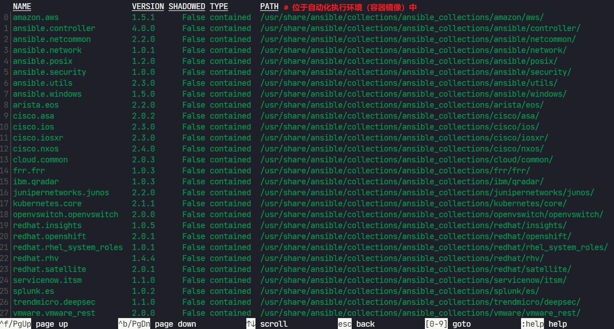
    
    如上所示，第一列编号为集合编号，输入相关的集合编号可列出集合中的模块和插件，若集合编号编号大于 `9`，需在编号前加上 `:`，如 `:19` 表示第 19 行。
    
    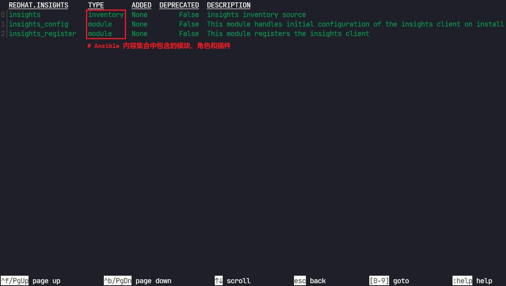
    
    如上所示，输入模块编号来访问其文档。默认情况下，ansible-navigator collections 命令以 `YAML` 格式呈现文档。
    
    👉 除了进入交互界面查看 Ansible 内容集合的方式外，也可在命令行上直接运行：
    
    ```bash
    $ ansible-navigator doc kubernetes.core.k8s -m stdout --eei ee-supported-rhel8:2.0
    # 命令行上查看 kubernetes.core.k8s 模块的使用文档
    ```
    
    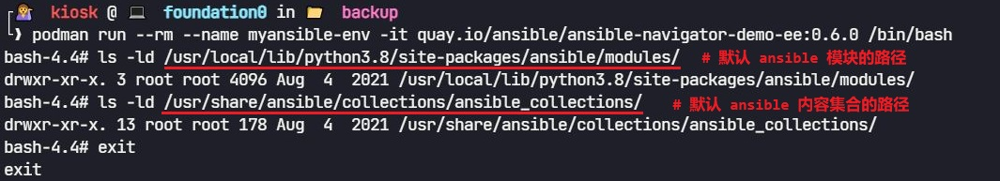
    
    🤘 `ansible.builtin.<module>` 模块的存储路径为自动化执行环境中默认 ansible 模块的路径。
  
  - 在 Playbook 中使用 Ansible 内容集合：
    
    - 使用完全限定的集合名称（FQCN）进行集合中模块或角色的引用。
    
    - 示例 1：集合中模块的引用
      
      ```yaml
      ---
      - name: Register new systems
        hosts: db.example.com
        tasks:
          - name: Ensure the new system is registered with Red Hat Insights
            redhat.insights.insights_register:
              state: present
              force_reregister: true
      ```
    
    - 示例 2：集合中角色的引用
      
      ```yaml
      ---
      - name: Add the test organizations to Red Hat Satellite
        hosts: localhost
        tasks:
          - name: Ensure the organizations exist
            include_role:
              name: redhat.satellite.organizations
            vars:
              satellite_server_url: https://sat.example.com
              satellite_username: admin
              satellite_password: Sup3r53cr3t 
              satellite_organizations:
                - name: test1
                  label: tst1
                  state: present
                  description: Test organization 1
                - name: test2
                  label: tst2
                  state: present
                  description: Test organization 2
      ```
  
  - 查找 Ansible 内容集合：
    
    - 🤘 可参考该 [GitHub 链接](https://github.com/ansible/ansible/blob/devel/lib/ansible/config/ansible_builtin_runtime.yml) 查看 `Ansible 2.9` 中的旧模块名称与 Ansible 内容集合 FQCN 的对应关系，如 `acl` 模块现在是 `ansible.posix` 集合中的一部分。
    
    - 许多 Ansible 内容集合也使用此重定向机制将旧的短名称转译为 FQCN，以便为 Ansible 2.9（`Ansible 自动化平台 1.2`）编写的 playbook 可减少所需的即时迁移工作。
    
    - 若存在旧版的 playbook 需要使用自动化执行环境可使用 `ee-29-rhel8` 容器镜像，该自动化执行环境提供不需要集合的 Ansible 2.9。
      
      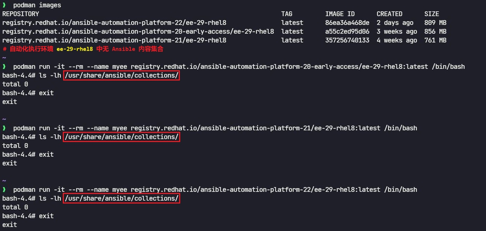
    
    > 👉 注意：Ansible 自动化平台 2.0 使用 Ansible 2.11 引擎。
  
  - 使用内置 Ansible 内容集合：
    
    - Ansible 始终包含名为 `ansible.buildin` 的特殊集合，此集合包含一组常见的模块，如 copy、template、file、yum、command 和 service。
    
    - 💥 可在现有的 Ansible playbook 中依然使用这些模块的短名称，如可使用 file 来引用 ansible.buildin.file 模块，但对于未包含在 ansible.buildin 特殊集合中的模块的其他集合，仍需先安装才能使用。
    
    - ✅ 推荐做法：
      
      使用 FQCN 表示法（完全限定的集合名称），以免与可能的同名集合发生冲突。
    
    - 示例 1：
      
      使用 FQCN 表示法引用 yum、copy 和 service 模块
      
      ```yaml
      ---
      - name: Install and start Apache HTTPD
        hosts: web
      
        tasks:
          - name: Ensure the httpd package is present
            ansible.builtin.yum:
              name: httpd
              state: present
          - name: Ensure the index.html file is present
            ansible.builtin.copy:
              src: files/index.html
              dest: /var/www/html/index.html
              owner: root
              group: root
              mode: 0644
              setype: httpd_sys_content_t
          - name: Ensure the httpd service is started
            ansible.builtin.service:
              name: httpd
              state: started
              enabled: true
      ```
    
    - [示例 2](https://github.com/Alberthua-Perl/ansible-demo/blob/master/do374-rhaap2.0-course-demo/chapter02/ee-distribution-test.yml)：
      
      使用 FQCN 表示法引用 `user` 模块，该示例中使用自动化执行环境 `ee-29-rhel8` 以此验证 ansible.builtin 集合中的模块。
      
      ```yaml
      ---
      - name: Test ansible automation execution environments
        hosts: servera.lab.example.com
      
        tasks:
          - name: Create new user
            ansible.builtin.user:
              name: sysadmin
              uid: 2000
              state: present
              group: wheel
              append: yes
      ```
      
      ```bash
      $ ansible-navigator run ee-distribution-test.yml -m stdout \
        --eei registry.redhat.io/ansible-automation-platform-20-early-access/ee-29-rhel8:latest
      --------------------------------------------------------------------------------------------------------------------
      Execution environment image and pull policy overview
      --------------------------------------------------------------------------------------------------------------------
      Execution environment image name:  registry.redhat.io/ansible-automation-platform-20-early-access/ee-29-rhel8:latest
      Execution environment image tag:   latest
      Execution environment pull policy: tag
      Execution environment pull needed: True
      --------------------------------------------------------------------------------------------------------------------
      Updating the execution environment
      --------------------------------------------------------------------------------------------------------------------
      Trying to pull registry.redhat.io/ansible-automation-platform-20-early-access/ee-29-rhel8:latest...
      Getting image source signatures
      Copying blob 5539c0b23773 skipped: already exists  
      Copying blob a9e23b64ace0 skipped: already exists  
      Copying blob 38b71301a1d9 skipped: already exists  
      Copying blob 00429bc902a6 [--------------------------------------] 0.0b / 0.0b
      Copying config a55c2ed95d done  
      Writing manifest to image destination
      Storing signatures
      a55c2ed95d06aefd54c2560b39bd4d5a1912901965c2800df301a8ac3c7bd907
      
      PLAY [Test ansible automation execution environments] **************************
      
      TASK [Gathering Facts] *********************************************************
      ok: [servera.lab.example.com]
      
      TASK [Create new user] *********************************************************
      ok: [servera.lab.example.com]
      
      PLAY RECAP *********************************************************************
      servera.lab.example.com    : ok=2    changed=0    unreachable=0    failed=0    skipped=0    rescued=0    ignored=0
      # 使用自动化执行环境 ee-29-rhel8 运行 playbook
      
      $ ansible servera.lab.example.com -m command -a 'id sysadmin'
        servera.lab.example.com | CHANGED | rc=0 >>
        uid=2000(sysadmin) gid=10(wheel) groups=10(wheel)
      # ansible ad-hoc 命令验证 sysadmin 用户已创建 
      ```
  
  - 💥 注意：关于 Ansible 2.9 与 Ansible 2.11 的区别
    
    - Ansible 2.9 中包含 `firewalld` 模块，而在 Ansible 2.11 中已不具有该模块，已将该模块重定向至名为 `ansible.posix.firewalld` 的 Ansible 内容集合中。
    
    - 因此，由旧语法开发的 Ansible playbook 使用 Ansible 2.11，可能报错而无法运行，需调整其中的 [模块名称](https://github.com/Alberthua-Perl/ansible-demo/blob/master/do374-rhaap2.0-course-demo/exercise/manage-reusing/basic-web-fqcn.yml)（如 `ansible.builtin.service`）或添加 `collections` 关键字定义的列表，[如下所示](https://github.com/Alberthua-Perl/ansible-demo/blob/master/do374-rhaap2.0-course-demo/exercise/manage-reusing/basic-web-keyword.yml)：
      
      ```yaml
      ---
      - name: Configure a basic web server
        hosts: serverf.lab.example.com
        become: true
        collections:
          - ansible.builtin
          - ansible.posix
          # 使用 collections 关键字定义 Ansible 内容集合的名称，在使用模块时可直接
          # 使用模块的短名称。
      
        tasks:
          - name: Install software
            yum:
              name:
                - httpd
                - firewalld
              state: latest
      ...
      ```

### 查找和安装 Ansible 内容集合：

- Ansible 内容集合的来源：
  
  - Red Hat 官方支持的 Ansible 自动化中心（`Ansible automation hub`）：
    
    - Ansible 自动化中心托管 Red Hat 认证的 Ansible 内容集合。
    
    - 这些集合由 Red Hat 及其合作伙伴为客户提供官方支持。
    
    - Red Hat 审核、维护并更新这些集合，并提供全⾯支持，如，该平台提供 `redhat.rhv`、`redhat.satellite`、`redhat.insights` 和 `cisco.ios` 集合等。
    
    - 💥 需通过订阅 Red Hat Ansible 自动化平台服务才能访问 Ansible 自动化中心。
    
    - 使用 https://console.redhat.com/ansible/automation-hub/ 上的 Ansible 自动化中心 Web UI 来列出和访问集合。
      
      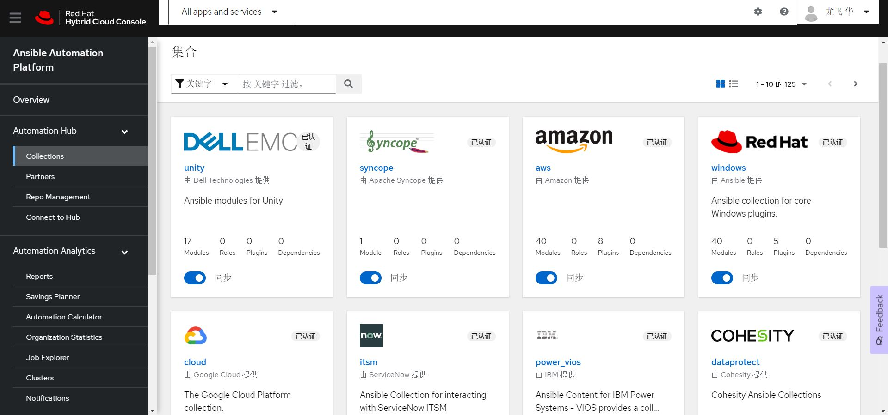
  
  - 开源社区提供的 `Ansible Galaxy`：
    
    - Ansible Galaxy 公共⽹站，主要托管各类 Ansible 开发人员和用户提交的集合。
    
    - Ansible Galaxy 不为其内容提供正式的支持保证。
    
    - 如，该平台提供了 `community.crypto`、`community.postgresql` 和 `community.rabbitmq` 集合等。
    
    - 使用 https://galaxy.ansible.com/ 上的 Web UI 来搜索集合。
      
      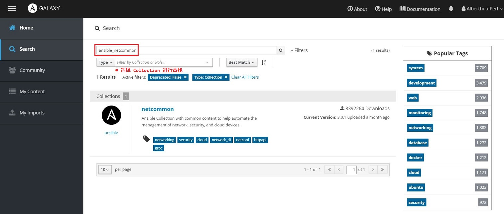
  
  - 🤘 开发者或团队自行开发 Ansible 内容集合以自定义模块、角色或插件：
    
    - 本地部署私有 Ansible 自动化中心（`Ansible automation hub`）存储自定义的集合
      
      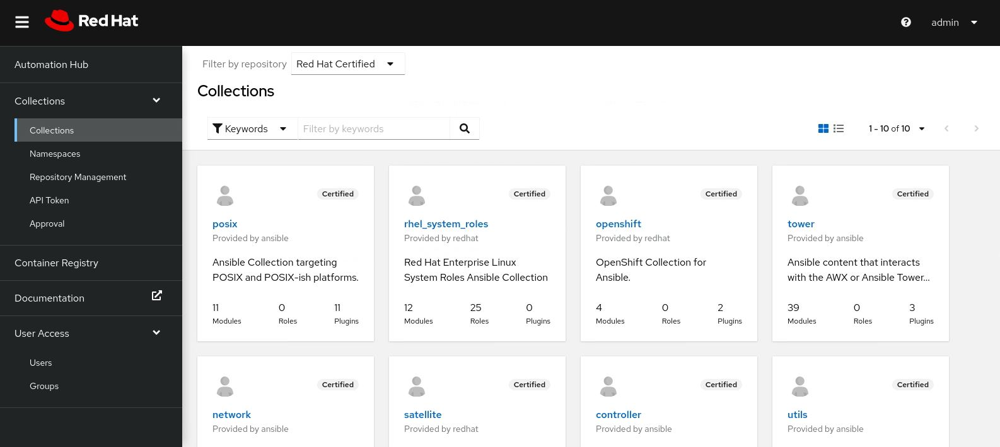
    
    > 💥 本课程中不介绍 Ansible 自动化中心的部署与使用，可自行查看相关资料。
    
    - 也可将自行开发的集合存储于 Git 代码库中
  
  - 供应商和开发人员可按照自己的节奏维护和分发 Ansible 内容集合。

- 安装 Ansible 内容集合：
  
  - 若运行的 playbook 中需使用 Ansible 内容集合，但在自动化执行环境中不存在，此时需在控制节点上安装 Ansible 内容集合。
  
  - 安装方式如下所示：
    
    - 方式 1：`ansible-galaxy` 命令行直接安装
    
    - 方式 2：使用 `collections/requirements.yml` 文件安装
  
  - `ansible-galaxy` 命令行直接安装：
    
    - 默认情况下将从 `Ansible Galaxy` 中下载并安装集合。
    
    - 集合的默认安装路径：`~/.ansible/collections`
    
    ```bash
    ### 方式 1 ###
    $ ansible-galaxy collection install <ansible_collection_name>
    # 指定 Ansible 内容集合的名称从 Ansible Galaxy 中下载并安装集合
    $ ansible-galaxy collection install community.crypto
    # 下载并安装 community.crypto 集合
    
    ### 方式 2 ###
    $ ansible-galaxy collection install /path/to/<ansible_collection_name>.tar.gz
    # 安装指定的 Ansible 内容集合压缩文件（该压缩文件需提前下载）
    $ ansible-galaxy collection install ./ansible-posix-1.4.0.tar.gz
    # 通过压缩文件安装 ansible.posix 集合
    # 注意：
    #   该方式中可以为压缩文件（如 .tar.gz），也可以为归档文件（如 .tar）。 
    
    ### 方式 3 ###
    $ ansible-galaxy collection install \
      http://classroom.example.com/content/courses/ansible-posix-1.4.0.tar.gz
    # 通过共享的压缩文件安装 ansible.posix 集合
    
    ### 方式 4 ###
    $ ansible-galaxy collection install \
      git@git.lab.example.com:student/ansible.tower.git
    # 安装远程代码仓库中的 ansible.tower 集合
    # 注意：
    #   远程代码库中集合可以是开发者或团队开发的集合，也可以是从其他源提前下载并推送至
    #   其中的集合。
    ```
  
  - 指定 Ansible 内容集合的安装目录：
    
    - 方式 1：ansible-galaxy 命令行中使用 `-p` 或 `--collections-path` 选项
      
      ```bash
      $ ansible-galaxy collection install --collections-path ./collections \
        git@git.lab.example.com:student/ansible.tower.git
      # 指定集合安装目录安装集合
      ```
    
    - 方式 2：项目中 `./ansible.cfg` 配置文件中设置 `collections_paths` 指令
      
      ```bash
      $ mkdir ./collections
      # 在当前项目目录中创建 collections 目录
      $ cat ./ansible.cfg
        [defaults]
        inventory = ./inventory
        collections_paths = ./collections:/usr/share/ansible/collections
        ...
      # 该 ansible 配置文件被自动化执行环境使用
      # ansible-galaxy 命令将集合安装于指定的第一个目录中
      $ ansible-galaxy collection install \
        git@git.lab.example.com:student/ansible.tower.git
      # 将集合安装于指定目录中
      ```
      
      - collections_paths 指令定义的安装目录使用 `:` 分隔。
      
      - collections_paths 指令的默认值：
        
        `~/.ansible/collections:/usr/share/ansible/collections`
      
      - `./collections`：控制节点上当前项目中的目录
      
      - `/usr/share/ansible/collections`：自动化执行环境中的安装与存储集合的目录
      
      > 💥 注意：
      > 
      > 1. Ansible 自动化平台 2.0 将控制节点与自动化执行环境分隔开。
      > 
      > 2. 基于容器运行的自动化执行环境对控制节点文件系统的访问非常有限，在容器中运行 playbook 时，collections_paths 指令使用容器内而非控制节点上的 /usr/share/ansible/collections 目录。
      > 
      > 3. 因此，若将集合安装于控制节点的 `~/.ansible/collections` 或 `/usr/share/ansible/collections` 目录中，自动化执行环境将无法使用集合。
      > 
      > 4. 自动化执行环境可访问托管它们的 playbook 所在目录，其中的 collections 目录可被自动化执行环境所访问。
      
      - 报错信息如下所示：
        
        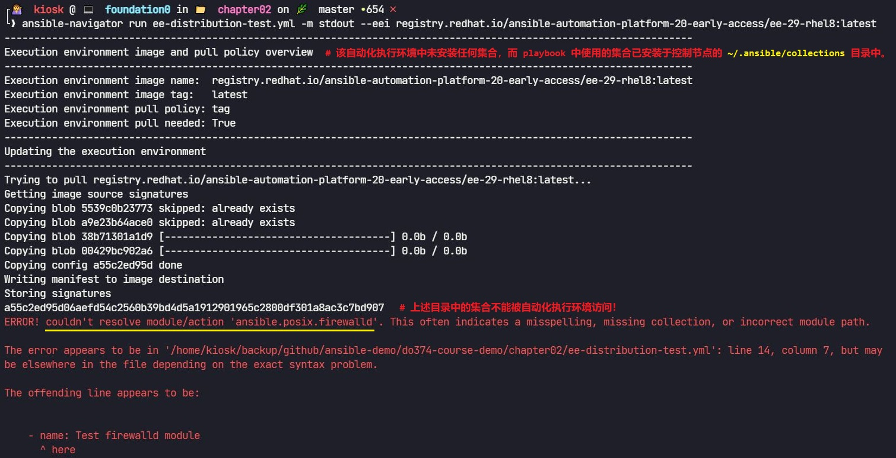
  
  - 使用 `collections/requirements.yml` 文件安装：
    
    - 类似于 Ansible 角色安装使用 roles/requirements.yml，集合的安装也使用 requirements.yml 文件，如下 [示例](https://github.com/Alberthua-Perl/ansible-demo/blob/master/do374-rhaap2.0-course-demo/exercise/manage-finding/collections/requirements.yml)：
      
      ```yaml
      ---
      collections:
        - name: ansible.netcommon
          # 从指定的集合来源安装最新版本的 ansible.netcommon 集合
          # 默认从 Ansible Galaxy 中下载并安装，也可在 ansible.cfg 配置文件中定义
          # 私有 Ansible 自动化中心，以从该中心下载并安装。
      
        - name: redhat.rhv
          version: 1.4.1
          # 从指定的集合来源安装对应版本的 redhat.rhv 集合
      
        - name: http://classroom.example.com/content/courses/ansible-tower-3.8.5.tar.gz  
          # 指定集合的共享文件，下载并安装集合
      
        - name: git@git.lab.example.com:student/ansible.tower.git
          # 从指定的远程代码仓库中拉取集合的代码并安装
          # 注意：
          #   1. 此处只能使用 SSH 连接的方式，不能使用 HTTP 或 HTTPS 的方式，否则报错！
          #   2. 指定集合共享文件地址与远程代码仓库中的集合将由 ansible-galaxy 直接拉取
          #      并安装，而只指定集合名称的话可自定义私有 Ansible 自动化中心。
      ```
      
      ```bash
      $ ansible-galaxy collection install \
        -r collections/requirements.yml -p ./collections
      # 在当前项目目录中的 collections 目录中安装 requirements.yml 文件中指定的集合
      ```
  
  - 列出已安装的集合：
    
    - 列出控制节点上由 collections_paths 指令定义的目录中已安装的集合：
      
      ```bash
      $ ansible-galaxy collection list
      
      # /home/student/manage-finding/collections/ansible_collections
      Collection         Version
      ------------------ -------
      ansible.controller 4.1.0  
      ansible.netcommon  2.5.0  
      ansible.tower      3.8.5  
      ansible.utils      2.4.3  
      community.crypto   1.9.3  
      redhat.rhv         1.4.1  
      ### 以上安装的集合可被自动化执行环境识别
      
      # /usr/share/ansible/collections/ansible_collections
      Collection               Version
      ------------------------ -------
      redhat.rhel_system_roles 1.0.1 
      ### 以上安装的集合不可被自动化执行环境识别
      ```
    
    - 列出自动化执行环境中安装的集合：
      
      ```bash
      $ ansible-navigator collections list --eei ee-supported-rhel8:2.0
      # 该命令列出的集合不包含由 ansible-galaxy 命令安装并列出的集合 
      ```
    
    > 💥 以上两个命令均不会列出 `ansible.builtin` 集合，它始终可用。

- 配置集合来源：
  
  - ansible-galaxy 命令默认使用 https://galaxy.ansible.com 中的 Ansible Galaxy 来下载集合。
  
  - 👉 可在 `ansible.cfg` 配置文件中配置其他分发平台。
  
  - 🚀 从 Ansible 自动化中心或私有自动化中心安装集合：
    
    ```ini
    $ vim ./ansible.cfg
    ...
    [galaxy]
    server_list = automation_hub, galaxy, rh-certified_repo, community_repo
    # ansible-galaxy 命令使用的集合来源名称（使用逗号分隔）
    
    ### Ansible 自动化中心 ###
    [galaxy_server.automation_hub]
    # 以上 server_list 指定的集合来源名称
    url = https://console.redhat.com/ansible/automation-hub/
    # 集合来源的 URL 地址
    auth_url = https://sso.redhat.com/auth/realms/redhat-external/protocol/openid-connect/token
    token = eyJh...fxcs
    # 集合来源的身份验证 URL 地址与 token
    # 使用 Ansible 自动化中心必须使用该 token 进行身份验证
    
    # 注意：若不使用 token 作为登录的身份验证令牌，可使用如下指令：
    #username = <username>
    # 指定登录 Ansible 自动化中心的用户名
    #password = <password>
    # 指定登录 Ansible 自动化中心的用户密码
    
    [galaxy_server.galaxy]
    url = https://galaxy.ansible.com/
    # 由于 Ansible 自动化中心中可能不具有所指定的对应集合，将 Ansible Galaxy 作为
    # 备用集合来源。
    
    ### 私有自动化中心 ###
    [galaxy_server.rh-certified_repo]
    url = https://hub.lab.example.com/api/galaxy/content/rh-certified/
    token = 67b5...c847
    
    [galaxy_server.community_repo]
    url = https://hub.lab.example.com/api/galaxy/content/community/
    token = 67b5...c847
    ...
    ```
    
    - 如下所示，必须使用订阅账户登录 Ansible 自动化中心，用以生成对应的 token，并将该 token 用于 ansible.cfg 配置文件中：
      
      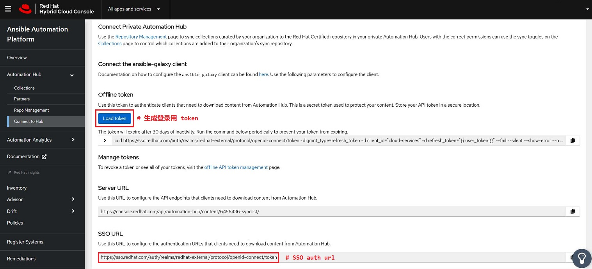
    
    - 若在 ansible.cfg 配置文件中不使用 token、username 与 password 指令，可使用如下环境变量指定所需的 token、username 与 password：
      
      ```bash
      # ANSIBLE_GALAXY_SERVER_<SERVERID>_<KEY>=<value>
      ### 方式 1 ###
      ANSIBLE_GALAXY_SERVER_AUTOMATION_HUB_TOKEN='eyJh...sInR'
      ### 方式 2 ###
      ANSIBLE_GALAXY_SERVER_AUTOMATION_HUB_USERNAME=<username>
      ANSIBLE_GALAXY_SERVER_AUTOMATION_HUB_PASSWORD=<password>
      # 可指定 token 或 username 与 password 环境变量
      # 可将上述环境变量以 export 的方式写入 ~/.bashrc 文件中
      ```

### 选择自动化执行环境：

- 描述自动化执行环境：
  
  - 自动化执行环境是一种容器镜像，其中包含 Ansible 内容集合、其软件依赖项，以及一个可运行 playbook 的最小 Ansible 引擎。
  
  - 通过使用自动化执行环境，可使用相同的统⼀可移植环境在一个系统上开发 Ansible Playbook，并在另⼀个系统上运行它们。
  
  - 👏 此方法简化了开发流程，并有助于确保结果的可观测性和可重复性。
  
  - 自动化执行环境是 Ansible Playbook 实际运行的地方。
  
  - 通常使用 ansible-navigator 等工具来运行 playbook（实际在容器内运行）。
  
  - 👉 自动化执行环境由以下部分组成：
    
    - Ansible Core（或 Ansible）
    
    - 用来补充 Ansible Core 的 Ansible 内容集合
    
    - Python 以及 Ansible Core 和所含集合的任何其他依赖项
    
    - 用于运行 playbook 的 Ansible Runner
  
  - 自动化执行环境由执行环境构建器（ansible-builder）准备，可以推送到任何容器镜像仓库（registry）。
  
  > 后续章节将介绍如何创建自定义自动化执行环境。

### 选择受支持的自动化执行环境：

- Ansible 自动化平台 2.0 提供了三种预构建的自动化执行环境：
  
  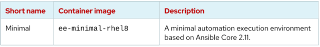
  
  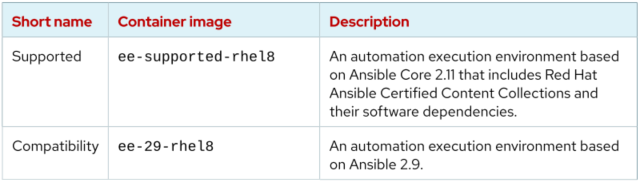

- 最小化自动化执行环境仅包含 `ansible.builtin` Ansible 内容集合，通常将其保留为构建自定义自动化执行环境的起点。

- 该自动化执行环境兼容 `Ansible 2.9`，其在模块从核心 Ansible 软件包中分离为集合之前发布。

- 预构建的自动化执行环境可从以下 URL 获取：
  
  - registry.redhat.io/ansible-automation-platform-20-early-access/ee-minimal-rhel8:2.0
  
  - registry.redhat.io/ansible-automation-platform-20-early-access/ee-supported-rhel8:2.0
  
  - registry.redhat.io/ansible-automation-platform-20-early-access/ee-29-rhel8:2.0

### 检查自动化执行环境：

- 列出当前系统上可用的自动化执行环境（包括其他容器镜像）：
  
  ```bash
  $ ansible-navigator images
  ```
  
  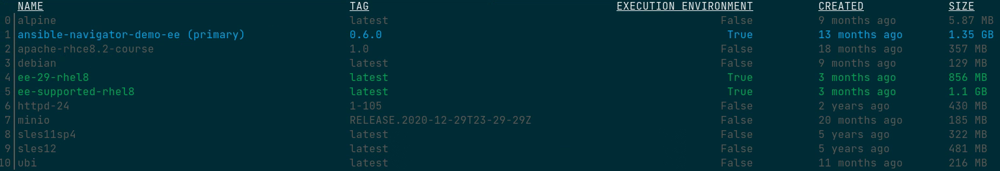
  
  可通过使用前置序号查看每个自动化执行环境的详细信息。
