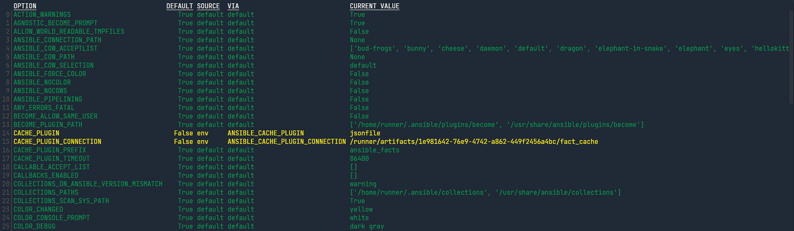
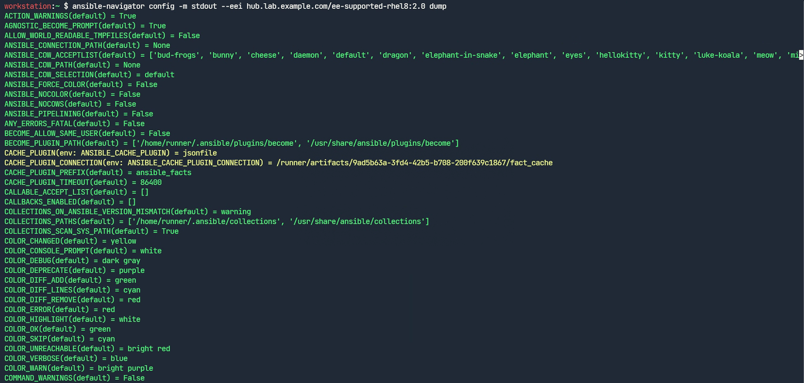

# Ansible 自动化进阶实践 (9) —— 使用 Ansible 配置设置

## 文档目录

- 使用 ansible-navigator 检查 Ansible 配置
- 配置 ansible-navigator

## 使用 ansible-navigator 检查 Ansible 配置

- 交互模式检查配置：
  - ansible-navigator config 命令以交互模式显示：
    - 检索当前 Ansible 配置和默认的配置设置
    - 访问各个配置参数的文档
    - 确定 ansible-navigator 从哪个来源获取当前的配置设置
  - 了解 ansible-navigator 配置设置的来源，有助于确定何种原因导致当前 Ansible 配置中特定设置的值。
  - 🚀 Ansible 配置设置的来源：
    - 具体的环境变量
    - `ANSIBLE_CONFIG` 环境变量指定的配置文件
    - 硬编码的默认值
  - ansible-navigator config 命令可用于对配置问题进行故障排除，该命令显示 Ansible 用于每个参数的实际值，以及它从哪个来源检索这个值、环境变量或配置文件等。
  - 使用 ansible-navigator config 查看 Ansible 配置设置：

    ```bash
    $ ansible-navigator config \
      --eei hub.lab.example.com/ee-supported-rhel8:2.0
    ```

    <center></center>

    以上每一行条目为 Ansible 配置参数，每列的信息如下所示：

    - OPTION：显示 Ansible 用于参数的内部名称，这些名称在 `ansible.cfg` 配置文件中使用的名称不同。如 `DEFAULT_BECOME` 参数对应于 ansible.cfg 配置文件中的 become 参数。
    - DEFAULT：指示参数是使用其默认值（为 True 时）还是使用在 ansible.cfg 配置文件中或通过环境变量显式设置的值（为 False 时）。ansible-navigator 命令以绿色显示默认的参数设置，以黄色显示已更改默认值的参数设置。
    - SOURCE：当参数未使用其默认值时，SOURCE 列将指示参数的设置方式。SOURCE 列提供 Ansible 从中检索参数值的配置文件的完整路径。若列中显示 `env` 关键字，则可通过环境变量设置该参数的值。

    > 🤘 可以通过环境变量与当前 Ansible 项目目录中的 ansible.cfg 配置参数覆盖自动化执行环境中的 Ansible 配置参数。

    - VIA：使用环境变量设置参数值时，VIA 列将提供该环境变量的名称。如上图所示 CACHE_PLUGIN 参数的值已由 ANSIBLE_CACHE_PLUGIN 环境变量定义。
    - CURRENT VALUE：显示参数的实际值
  - 搜索具体的配置参数：
    - 在 ansible-navigator config 交互模式下通过 `:filter`（或 `:f`），后跟正则表达式（区分大小写），以在命令输出中执行搜索，如，若要查找 DEFAULT_FORKS 参数，可使用 `:f FORKS` 筛选命令。
    - 该功能不限于搜索参数名称，可在 ansible-navigator 输出中搜索任何模式，如，可使用 `:f ansible.cfg` 筛选命令列出 ansible.cfg 配置文件中定义的所有参数。
  - 检查本地配置：
    - 默认情况下，ansible-navigator 命令使用自动化执行环境来执行其工作。
    - 💥 若 Ansible 项目不提供 ansible.cfg 配置文件，则 ansible-navigator 命令将使用自动化执行环境提供的 `/etc/ansible/ansible.cfg` 文件。
    - 👉 当使用自动化执行环境时，该命令不使用本地系统中的 /etc/ansible/ansible.cfg 或 ~/.ansible.cfg 配置文件。若要处理这些本地文件，使用 `--execution-environment false`（或 `--ee false`）选项来阻止命令使用自动化执行环境。
- 在标准输出模式中检查 Ansible 配置：

  与 ansible-config 命令类似，ansible-navigator config 命令使用 `-m stdout` 选项与 list、dump 以及 view 子命令在标准输出模式中检查（非交互模式）。
  
  - `list` 子命令：列出所有 Ansible 配置参数，不列出当前的参数值，输出描述各个参数的静态列表。
  - 💪 `dump` 子命令：列出所有 Ansible 配置参数及其当前的值。

    ```bash
    $ ansible-navigator config -m stdout \
      --eei hub.lab.example.com/ee-supported-rhel8:2.0 \
      dump
    ```

    <center></center>
  
  - `view` 子命令：显示 Ansible 正在使用的 ansible.cfg 配置文件的内容，该子命令有助于确认 Ansible  正在使用预期的配置文件。

## 配置 ansible-navigator

- ansible-navigator 配置文件的格式：
  - 可为 ansible-navigator 创建配置文件以覆盖其配置的默认值。
  - 配置文件可采用 `JSON` 或 `YAML` 格式。
    - 对于 JSON 格式的设置，扩展名必须是 `.json`。
    - 对于 YAML 格式的设置，扩展名必须是 `.yml` 或 `.yaml`。
- 查找配置文件：
  - ansible-navigator 按以下顺序查找配置文件，并使用找到的第一个文件，优先级依次降低：
    - 1️⃣ `ANSIBLE_NAVIGATOR_CONFIG` 环境变量指定的配置文件路径
    - 2️⃣ 当前 Ansible 项目目录中的 `./ansible-navigator.yml` 文件
    - 3️⃣ `~/.ansible-navigator.yml` 文件（家目录中的隐藏文件）
  - 每个项目都可以有自身的 ansible-navigator 配置文件。
  - 常见的配置参数可以是项目所需自动化执行环境镜像的名称，也可以是 Ansible 配置参数，如 forks、log levels 和构件（artifact）创建等。
  
  > 💥 注意：项目目录和用户家目录中各自只能包含一个配置文件，如果同一目录中存在 ansible-navigator.yml 文件和 ansible-navigator.yaml 或 ansible-navigator.json 文件，则会导致错误。
  
  - 选择要使用的配置文件：
    - 若 Ansible 项目目录中有 ansible-navigator.yml 文件，它将与项目的其余部分一起存储在版本控制库中，并覆盖用户家目录中的任何配置文件，该项目的其他用户也可使用该配置文件。
    - 只有当没有其他配置文件可用时才使用 ~/.ansible-navigator.yml 文件。若正在使用的 Ansible 项目没有首选配置，可使用该文件指定使用的默认配置。
    - 如需覆盖所有的其他配置文件，则仅仅使用 ANSIBLE_NAVIGATOR_CONFIG 环境变量指定配置文件。
- 编辑配置文件：
  - 可使用该示例配置文件创建初始 [ansible-navigator.yml](https://ansible-navigator.readthedocs.io/en/latest/settings/) 配置文件：

    ```yaml
    # # cspell:ignore cmdline, workdir
    ---
    ansible-navigator:
    #
    #   ansible:
    #     config:
    #       help: False
    #       path: /tmp/ansible.cfg
    #     cmdline: "--forks 15"
    #     doc:
    #       help: False
    #       plugin:
    #         name: shell
    #         type: become
    #     inventory:
    #       help: False
    #       entries:
    #         - /tmp/test_inventory.yml
    #     playbook:
    #       help: False
    #       path: /tmp/test_playbook.yml
    #
    #   ansible-builder:
    #     help: False
    #     workdir: /tmp/
    #
    #   ansible-lint:
    #     config: ~/ansible-lint.yml
    #     lintables: ~/myproject/
    #
    #   ansible-runner:
    #     artifact-dir: /tmp/test1
    #     rotate-artifacts-count: 10
    #     timeout: 300
    #
    #   app: run
    #
    #   collection-doc-cache-path: /tmp/cache.db
    #
    #   color:
    #     enable: False
    #     osc4: False
    #
    #   editor:
    #     command: vim_from_setting
    #     console: False
    #
    #   enable-prompts: False
    #
    #   exec:
    #     shell: False
    #     command: /bin/foo
    #
    #   execution-environment:
    #     container-engine: podman
    #     enabled: False
    #     environment-variables:
    #       pass:
    #         - ONE
    #         - TWO
    #         - THREE
    #       set:
    #         KEY1: VALUE1
    #         KEY2: VALUE2
    #         KEY3: VALUE3
    #     image: test_image:latest
    #     pull:
    #       arguments:
    #         - "--tls-verify=false"
    #       policy: never
    #     volume-mounts:
    #       - src: "/tmp"
    #         dest: "/test1"
    #         options: "Z"
    #     container-options:
    #       - "--net=host"
    #
    #   format: json
    #
    #   images:
    #     details:
    #       - ansible_version
    #       - python_version
    #
    #   inventory-columns:
    #     - ansible_network_os
    #     - ansible_network_cli_ssh_type
    #     - ansible_connection
    #
      logging:
        level: critical
    #     append: False
    #     file: /tmp/log.txt
    #
    #   mode: stdout
    #
    #   playbook-artifact:
    #     enable: True
    #     replay: /tmp/test_artifact.json
    #     save-as: /tmp/test_artifact.json
    #
    #   settings:
    #     effective: False
    #     sample: False
    #     schema: json
    #     sources: False
    #
    #   time-zone: Japan
    ```
  
  - 该文件以 `ansible-navigator` 键开头，其包含代表顶级配置类别和配置的子键。
  - 顶级配置包括 `ansible`（特定于 Ansible 的配置）和 `execution-environment`（表示 ansible-navigator 使用的自动化执行环境配置）。
  - ansible-navigator.yml 配置文件示例：

    ```yaml
    ---
    ansible-navigator:
      # ansible:
      #   config: ./ansible.cfg
      # 该配置参数与如下 environment-variables 配置参数中的 ANSIBLE_CONFIG 
      # 效果相同 
    
      execution-environment:
        container-engine: podman
        enabled: True
        environment-variables:
          set:
            ANSIBLE_CONFIG: ansible.cfg
        image: hub.lab.example.com/ee-supported-rhel8:2.0
      logging:
        level: critical
        # file: /dev/null
      mode: stdout
      playbook-artifact:
        enable: False
    ```
  
  - 因此，配置完指定位置的 ansible-navigator.yml 文件后可直接运行 ansible-navigator 命令无需在命令行中再次指定特定的选项。

## 参考链接

- [Documentation - ansible-navigator settings](https://ansible-navigator.readthedocs.io/en/latest/settings/)
- [How To Change Control Plane Execution Environment Settings](https://www.jazakallah.info/post/how-to-change-control-plane-execution-environment-settings)
