# GitHub 与 GitLab 基础与常规应用

## 文档说明

- OS 版本：CentOS Linux release 7.4.1708 (Core)
- Git 版本：git-1.8.3.1-20.el7.x86_64
- GitLab 版本：gitlab-ce-12.7.0-ce.0.el7.x86_64
- 该文档中若未指定具体版本均已上述版本为例。
- ✨ 该文档中所涉及的 GitLab 命令、配置与故障排除将持续更新。

## 文档目录

- [GitHub 的常规使用](#github-的常规使用)
  - [GitHub 基本概览](#github-基本概览)
  - [GitHub 常规操作与故障排除](#github-常规操作与故障排除)
- [GitLab 基本概念与架构](#gitlab-基本概念与架构)
- [GitLab 安装部署](#gitlab-安装部署)
  - [使用 RPM 包安装部署](#使用-rpm-包安装部署)
  - [使用容器镜像部署](#使用容器镜像部署)
- [GitLab 常规配置使用](#gitlab-常规配置使用)
  - [GitLab 常用命令示例](#gitlab-常用命令示例)
  - [创建、管理 GitLab 用户](#创建管理-gitlab-用户)
  - [更改 GitLab 的远程拉取地址](#更改-gitlab-的远程拉取地址)
  - [更改 GitLab 自定义代码存储路径](#更改-gitlab-自定义代码存储路径)
  - [重置 GitLab 管理员 roor 密码](#重置-gitlab-管理员-roor-密码)
- [参考链接](#参考链接)

## GitHub 的常规使用

### GitHub 基本概览

- GitHub 官方 [guide demo](https://guides.github.com/activities/hello-world/)
- GitHub 的使用场景：
  - 创建和使用仓库（repository）：
    - 一个仓库通常用来组织一个单独的项目（project）。
    - 该仓库可以包含项目中的所有文件。
    - 创建仓库时，默认创建 `README.md` 文件，或者自定义的用来记录项目信息的文件。
  - 创建和管理分支（branch）：
    - 分支是一个可以在同一时间工作在同一个仓库的不同版本的方法。
    - 仓库中会有一个默认的名叫 `master` 的主分支，该分支用来存储最终确定的版本代码。
    - 可使用其他的子分支来进行编辑和更改，确定之后再提交到主分支。
    - 👉 当从主分支创建出一个子分支的那一刻，其实是对当时时间点的主分支做了一个拷贝。
    - 💥 若之后别的分支对主分支进行了更新，在提交到主分支之前，必须先从主分支上拉取那些更新。
    - 分支合作的整个流程，以创建 `feature` 子分支为例，如下所示：

      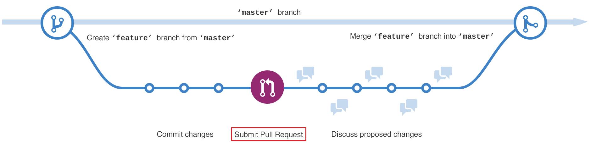
  
  - 更改文件并将它提交（commit）到 GitHub：
    - GitHub 中的每次操作最终保存更改称为提交（commit），每一次提交都需要写修改的备注说明。
    - 该过程与 `git commit` 命令类似。
  - 🤘 发起（`pull request`）合并请求（`merge`）至主分支（master）：
    - 请求代码合并是 GitHub 团队协作的核心功能。
    - 当发出一个 "请求代码合并" 请求时，相当于请求别人拷贝你当前的代码做出审查，审查通过之后将你的代码下载并且合并到他们的分支上。
    - 该请求将会在所有的分支上显示出不相同的部分。
    - 做出的任何更改、增加以及减少，都会用绿色和红色显示出来。
    - 在代码完成之前，可以随时进行代码提交，发起请求代码合并的请求以及进行讨论。
    - 可以通过 GitHub 的 `@` 功能，在每次发出 "请求代码合并" 请求时，向特定的人或团队做出反馈。
    - ✅ 可以向自己的仓库发出 "请求代码合并" 的请求，并且自己去合并，这在接触到大型项目之前是非常好的练习方法。

### GitHub 常规操作与故障排除

- 添加 GitHub profile 的 `README.md` 文件以设置个人主页信息：

  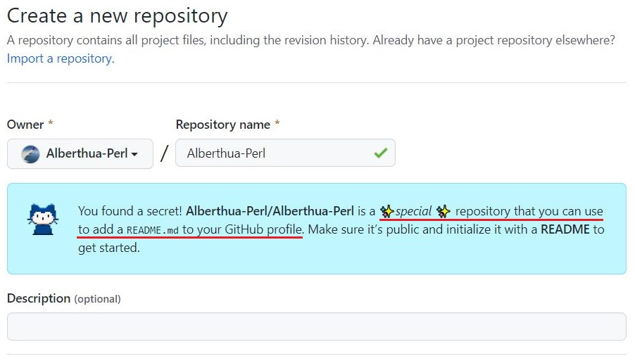
  
- 本地用户使用 SSH 登录 GitHub 账号：
  - 创建本地用户用于免密码登录 GitHub 的 SSH 公私钥对：

    ```bash
    $ cd $HOME/.ssh
    $ ssh-keygen -t rsa -C "<your_email_address>"
    ```

    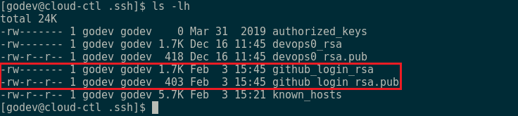

    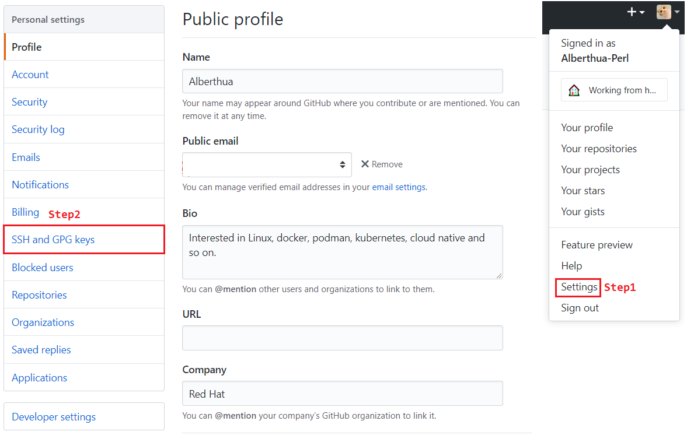

    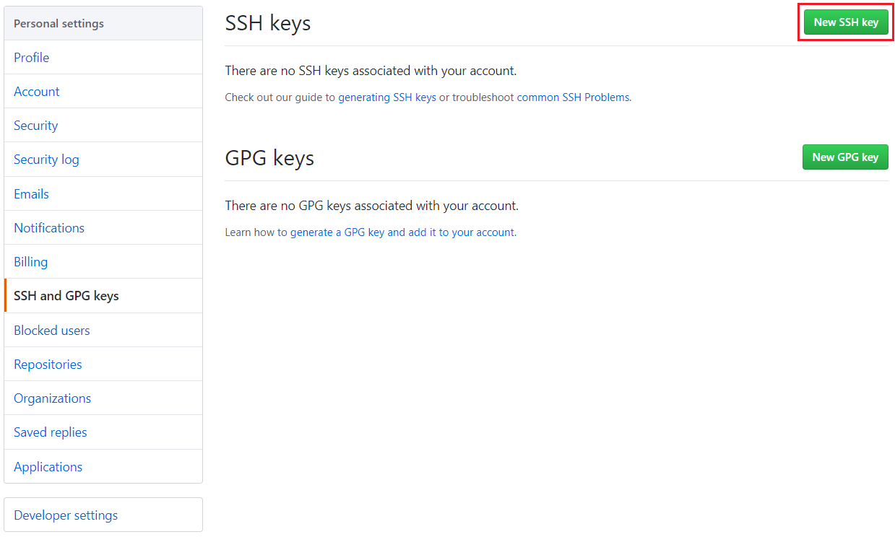

    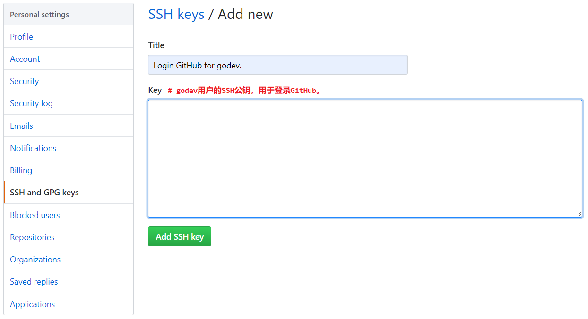

    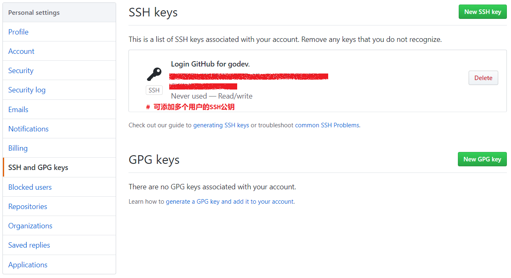

  - 本地登录 GitHub 测试：

    ```bash
    $ vim $HOME/.ssh/config
      Host github.com
        IdentityFile ~/.ssh/github_login_rsa
    # 为了保证 SSH 免密登录 GitHub 的密钥指定的唯一性，配置 SSH 客户端配置。
    $ chmod 0600 $HOME/.ssh/config
    # 更改 SSH 客户端配置文件权限
    $ ssh -Tv git@github.com
    # 免密登录 GitHub 测试
    ```

  - 登录 GitHub 的故障报错如下，`sign_and_send_pubkey: signing failed: agent refused operation Permission denied (publickey).`，其解决方法如下所示：

    ```bash
    $ evel $(ssh-agent -s)
    $ ssh-add <ssh_private_key>
    ```

    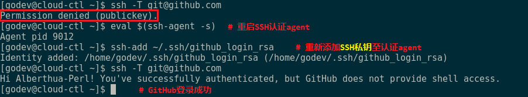

  - 若不使用 SSH 公钥免密码登录 GitHub，将在推送本地仓库代码至远程代码仓库时，需交互式输入用户名与密码来完成身份验证。
  - 👉 本地用户使用 SSH 登录 `GitLab` 类似登录 GitHub。
  - GitLab 也使用本地用户的 `SSH pubkey` 认证方法，远程登录 GitLab Shell。

    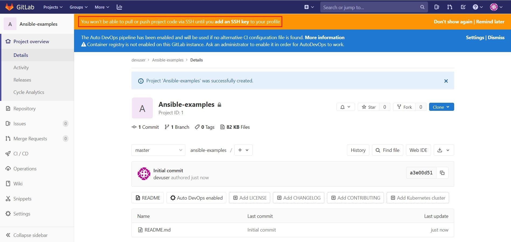

    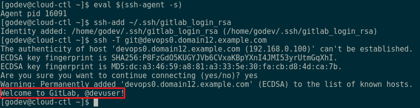
  
- 本地用户使用 SSH 登录 GitLab 私有代码仓库报错：
  - 由于本地用户生成的 SSH 用户公私钥对已重命名，而 SSH 用户公钥做密钥交换时使用默认的 `id_rsa` 前缀名，两者的名称不一致导致的本地用户免密登录 GitLab 失败。
  - 可更改 `$HOME/.ssh/config` 使用指定的 SSH 用户私钥名称以解决。
- 💥 GitHub 的仓库中不允许创建空目录，需在创建的目录中再创建文件，导入其他文件后删除该文件即可。

  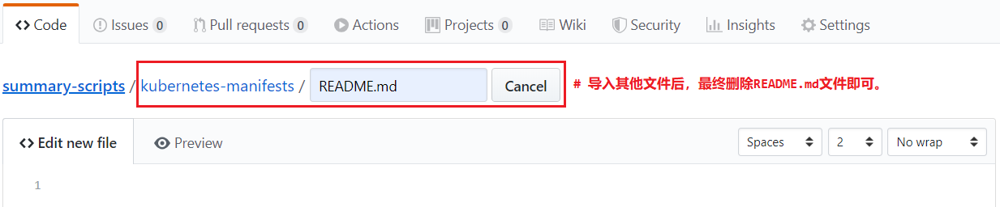
  
- 💥 GitHub 推送代码大小限制：单个文件 `50MB`

  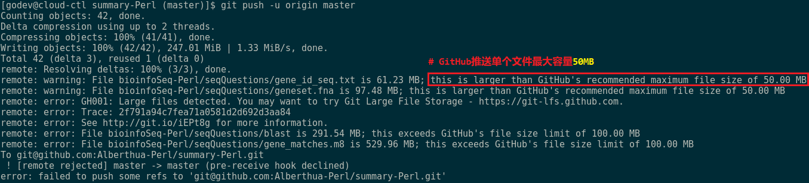

- GitLab 中新建项目后可执行以下步骤实现代码库的初始化：

  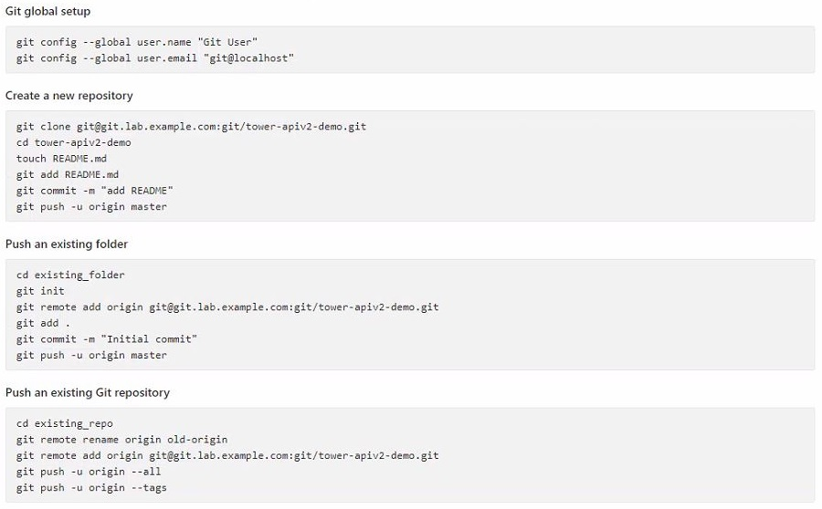  

## GitLab 基本概念与架构

- GitLab 是利用 `Ruby on Rails` 的开源版本管理系统，实现一个自托管的 Git 项目仓库，可通过 Web 界面进行访问公开的或者私有项目。
- 与 GitHub 类似，GitLab 能够浏览源代码，管理缺陷和注释。
- 可以管理团队对仓库的访问，它非常易于浏览提交过的版本并提供一个文件历史库。
- 团队成员可以利用内置的简单聊天程序（`Wall`）进行交流。
- 👉 它还提供一个代码片段收集功能可以轻松实现代码复用，便于日后有需要的时候进行查找。
- GitLab `v12.7` 架构示意：

  若无特殊指定，所有 GitLab 组件之间使用 `Unix socket` 通信！
  
  <center>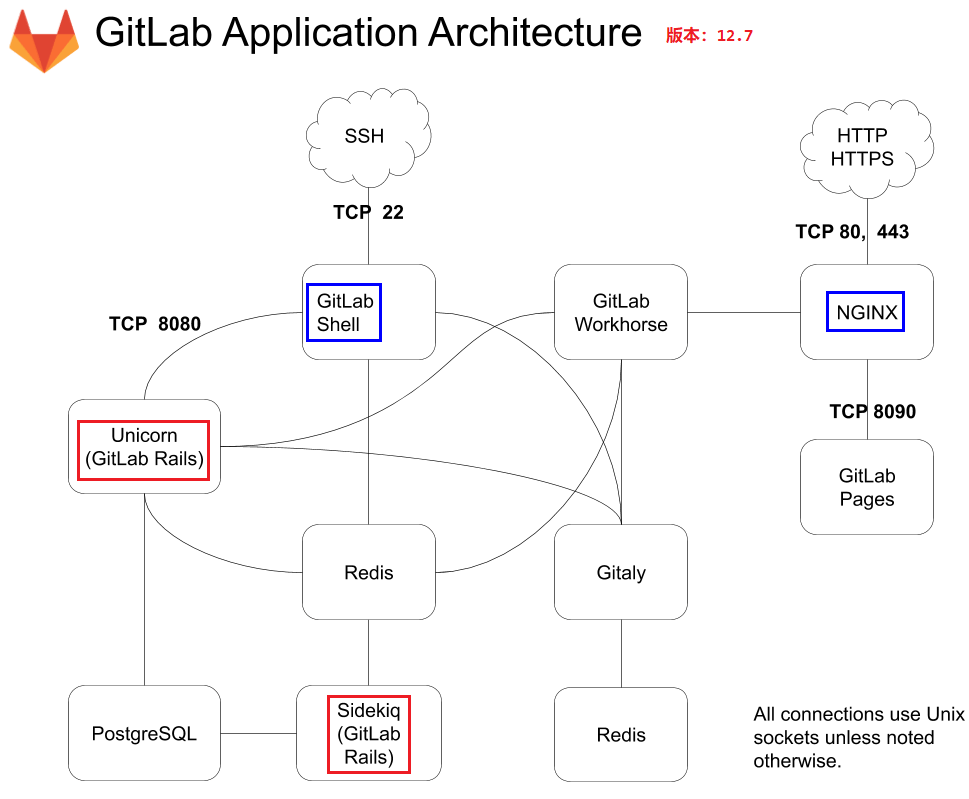</center>

  <center>GitLab 12.7 架构图</center>

  <center>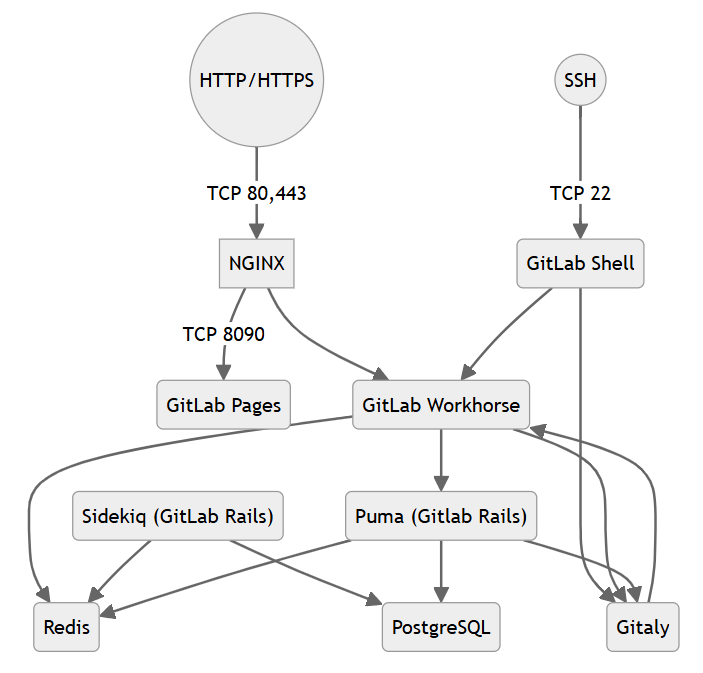</center>

  <center>GitLab 17.x 架构图</center>

- GitLab 各组件服务构成：
  - nginx：静态 Web 服务器
  - `gitlab-workhorse`：轻量级的反向代理服务器
  - `gitlab-shell`：用于处理 `Git` 命令和修改 `authorized_keys` 列表
  - logrotate：日志文件管理工具
  - `unicorn`：该服务用于 `GitLab Rails` 应用的托管
  - redis：缓存数据库
  - postgresql：PG 数据库
  - `sidekiq`：用于在后台执行队列任务（异步执行）
- GitLab 默认内置用户：
  GitLab 安装完成后将自动创建以下用户：
  - `git`：Git 管理用户

    ```bash
    ┌─[codeadmin][gitlab-harbor][~]
    └─➞ ls -lh /var/opt/gitlab/ | grep -w git
    drwx------ 2 git               root         6 Jan 24  2020 backups
    drwx------ 3 git               root       103 May 18 20:43 gitaly
    drwx------ 3 git               root        26 Jan 24  2020 git-data
    drwxr-xr-x 3 git               root        20 Jan 24  2020 gitlab-ci
    drwxr-xr-x 2 git               root        53 Feb  7  2020 gitlab-exporter
    drwxr-xr-x 9 git               root       160 Feb  7  2020 gitlab-rails
    drwx------ 2 git               root        24 Feb  7  2020 gitlab-shell
    drwxr-x--- 2 git               gitlab-www  54 May 18 20:43 gitlab-workhorse
    drwxr-x--- 2 gitlab-redis      git         60 May 19 21:18 redis
    ```
  
  - `gitlab-www`：Nginx 组件用户
  - `gitlab-redis`：Redis 数据库用户
  - `gitlab-psql`：PostgreSQL 数据库用户
  - `gitlab-prometheus`：GitLab 监控用户
- 🔥 GitLab 相关目录：
  - `/opt/gitlab`：GitLab 默认安装目录
  - `/etc/gitlab`：配置文件目录
  > 👉 gitlab-ctl reconfigure 使用该配置文件目录编译，生成的数据将覆盖 /var/opt/gitlab。
  - `/etc/gitlab/gitlab.rb`：主配置文件
  - `/var/opt/gitlab`：默认配置文件目录
  > 👉 gitlab-ctl reconfigure 编译后的配置文件，无需手动修改。
  - `/var/opt/gitlab/git-data/repositories`：Git 代码仓库默认存储目录
  > 👉 可指定自定义仓库路径
  - `/var/opt/gitlab/nginx/conf/gitlab-http.conf`：Nginx 组件的配置文件
  - `/var/opt/gitlab/backups`：备份文件生成的目录
  - `/var/log/gitlab`：GitLab 各个组件生成的日志
- GitLab 常规工作流程：
  - 创建或克隆项目
  - 创建项目或分支
  - 编写代码并提交至该分支
  - 推送该项目分支至远程 GitLab 服务器
  - 进行代码检查并提交 master 主分支合并申请（pull request）
  - 项目领导审查代码并确认合并申请

## GitLab 安装部署

### 使用 RPM 包安装部署

GitLab 安装部署过程：💥 此处使用 `RPM` 包的方式安装 GitLab，并且 GitLab 安装节点的物理内存不可小于 2G！
  
```bash
$ sudo systemctl enable --now postfix.service
$ sudo curl -S -o gitlab-repo.sh \
  https://packages.gitlab.com/install/repositories/gitlab/gitlab-ce/script.rpm.sh
# 下载 gitlab 软件源配置脚本
  
$ cat /etc/yum.repos.d/gitlab_gitlab-ce.repo
  [gitlab_gitlab-ce]
  name=gitlab_gitlab-ce
  baseurl=https://packages.gitlab.com/gitlab/gitlab-ce/el/7/$basearch
  repo_gpgcheck=1
  gpgcheck=1
  enabled=1
  gpgkey=https://packages.gitlab.com/gitlab/gitlab-ce/gpgkey
         https://packages.gitlab.com/gitlab/gitlab-ce/gpgkey/gitlab-gitlab-ce-3D645A26AB9FBD22.pub.gpg
  sslverify=1
  sslcacert=/etc/pki/tls/certs/ca-bundle.crt
  metadata_expire=300
  
$ sudo yum makecache
$ sudo yum list gitlab-ce --showduplicates
# 查看 gitlab 的所有 RPM 软件包版本
```
  
此处已提前下载 `gitlab-ce-12.7.0-ce.0.el7.x86_64.rpm` 软件包，该软件包具有所有服务组件，无需安装数据库与缓存数据库，直接安装该软件包即可，如下所示：
  
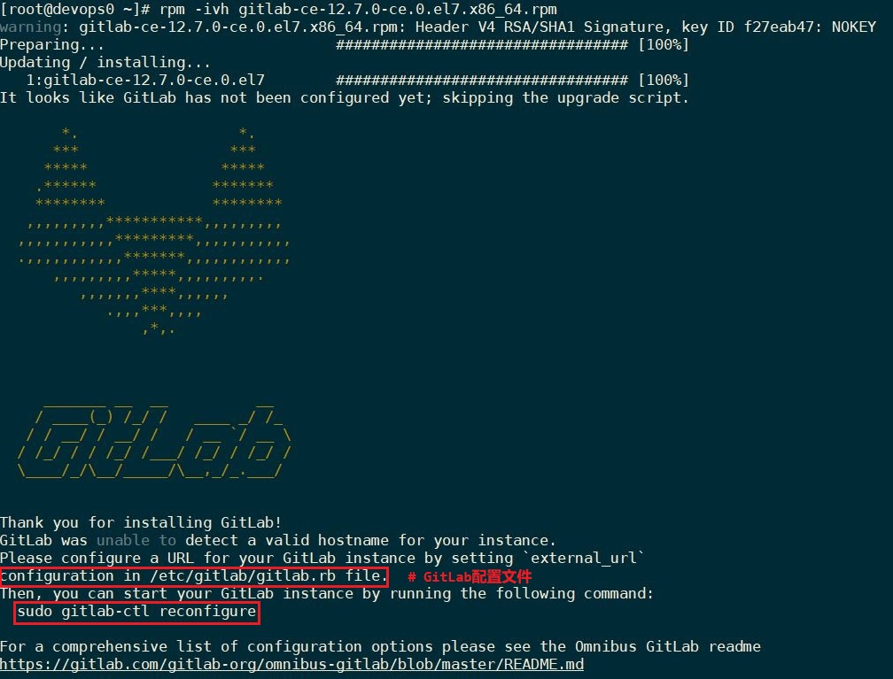
  
```bash
$ sudo gitlab-ctl reconfigure
# 重新初始化配置 gitlab，该配置过程将执行较长时间。
# 注意：系统中不应存在 git 用户，若存在需将其删除，否则报错！
```
  
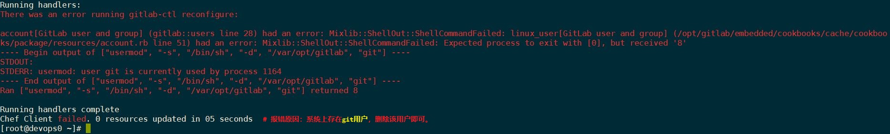
  
```bash
$ sudo gitlab-ctl status
run: alertmanager: (pid 2057) 39342s; run: log: (pid 2056) 39342s
run: gitaly: (pid 2064) 39342s; run: log: (pid 2055) 39342s
run: gitlab-exporter: (pid 2062) 39342s; run: log: (pid 2050) 39342s
run: gitlab-workhorse: (pid 2052) 39342s; run: log: (pid 2049) 39342s
run: grafana: (pid 2043) 39342s; run: log: (pid 2042) 39342s
run: logrotate: (pid 3249) 3341s; run: log: (pid 2030) 39342s
run: nginx: (pid 2046) 39342s; run: log: (pid 2045) 39342s
run: node-exporter: (pid 2040) 39342s; run: log: (pid 2039) 39342s
run: postgres-exporter: (pid 2054) 39342s; run: log: (pid 2053) 39342s
run: postgresql: (pid 2067) 39342s; run: log: (pid 2051) 39342s
run: prometheus: (pid 2044) 39342s; run: log: (pid 2041) 39342s
run: redis: (pid 2037) 39342s; run: log: (pid 2036) 39342s
run: redis-exporter: (pid 2048) 39342s; run: log: (pid 2047) 39342s
run: sidekiq: (pid 2059) 39342s; run: log: (pid 2058) 39342s
run: unicorn: (pid 2061) 39342s; run: log: (pid 2060) 39342s
# 查看 gitlab 各组件服务状态
```
  
```bash
$ sudo systemctl status gitlab-runsvdir.service
# 查看 gitlab 各组件服务状态
```
  
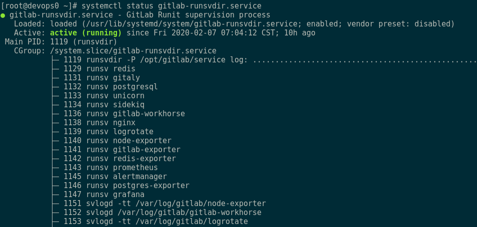

```bash
$ sudo ss -ntulp | grep 80
# gitlab 使用 nginx 80 端口监听请求，该端口不可占用。
# 若 80 端口已被占用，可修改配置的端口或使用 Docker 容器方式运行 gitlab。
```
  
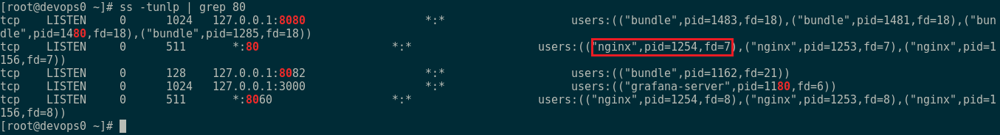

### 使用容器镜像部署

#### 常规容器化部署方式

💥 说明：此次部署使用 **Podman 容器引擎**，GitLab-CE 版本为 **17.9.8-ce.0**。

```bash
$ sudo podman pull docker.io/gitlab/gitlab-ce:17.9.8-ce.0
# 若无法拉取以上镜像，可使用 quay.io/alberthua/gitlab-ce:17.9.8-ce.0 代替，此镜像为以上镜像的同步，两者完全相同。
# 可选步骤：$ podman pull quay.io/alberthua/gitlab-ce:17.9.8-ce.0
$ sudo mkdir -p /opt/gitlab-ce/{config,data,logs}
$ sudo chmod -R 0777 /opt/gitlab-ce
$ sudo podman run --detach --restart always \
    --security-opt seccomp=unconfined \
    --hostname gitlab-ce.lab.example.com --name gitlab-ce \
    --publish 8080:80 --publish 8443:443 --publish 2222:22 \
    --volume /opt/gitlab-ce/config:/etc/gitlab:Z \
    --volume /opt/gitlab-ce/logs:/var/log/gitlab:Z \
    --volume /opt/gitlab-ce/data:/var/opt/gitlab:Z \
    docker.io/gitlab/gitlab-ce:17.9.8-ce.0
# 🎯 当前 podman 版本中设置 --security-opt 选项是为了避免容器启动过程中 OCI runtime runc 调用系统调用权限不足而导致容器运行失败。
# 默认的 podman 容器引擎 seccomp 规则文件位于 /usr/share/containers/seccomp.json
$ sudo watch -d podman ps
...
03cd62d1d53b  docker.io/gitlab/gitlab-ce:17.9.8-ce.0  /assets/wrapper       2 hours ago  Up 2 hours (healthy)  0.0.0.0:2222->22/tcp, 0.0.0.0:8080->80/tcp, 0.0.0.0:8443->443/tcp  gitlab-ce
...
# 注意：等待近 7~8 分钟后，gitlab-ce 容器的状态逐渐从 starting -> unhealthy -> healthy 状态。

$ sudo podman exec gitlab-ce gitlab-ctl status
# 查看 gitlab-ce 容器内组件运行状态
```

待 gitlab-ce 容器正常运行后，使用 `http://gitlab-ce.lab.example.com:8080`（主机名在本地需正确配置名称解析）登录 Web UI，使用 root 用户与密码首次登录 GitLab。其中，root 的初始化密码位于容器映射的文件中 `/opt/gitlab-ce/config/initial_root_password`，类似如下所示：

```plaintext
# WARNING: This value is valid only in the following conditions
#          1. If provided manually (either via `GITLAB_ROOT_PASSWORD` environment variable or via `gitlab_rails['initial_root_password']` setting in `gitlab.rb`, it was provided before database was seeded for the first time (usually, the first reconfigure run).
#          2. Password hasn't been changed manually, either via UI or via command line.
#
#          If the password shown here doesn't work, you must reset the admin password following https://docs.gitlab.com/ee/security/reset_user_password.html#reset-your-root-password.

Password: XyUBd20rq4Plb3fQ1zCK3fsbY4/Pi04FG4Sv+TUrAwU=    #root 首次登录 GitLab 的初始化密码

# NOTE: This file will be automatically deleted in the first reconfigure run after 24 hours.
```

root 初次登录成功后，可参考以下方法更新 root 密码：

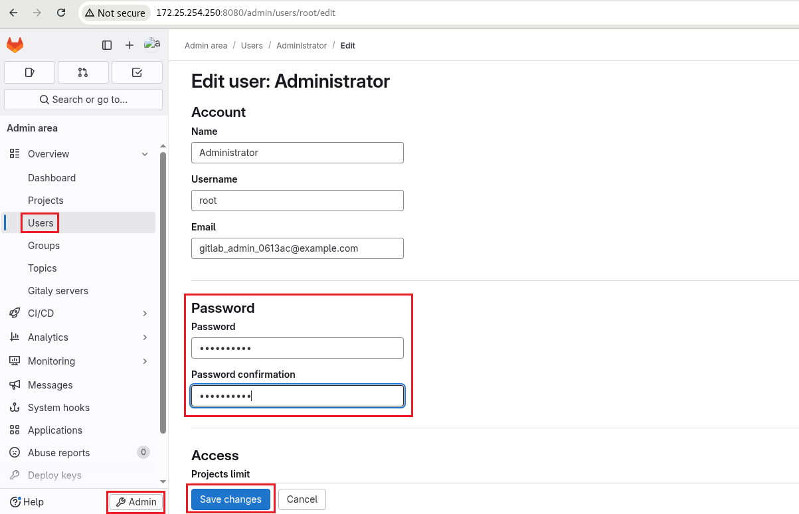

root 更新完毕后，需创建常规用户。用户创建完成后，需让 root 用户进行审批放行方可正常使用。新建的用户呈现 `Pending approval` 状态，root 用户审批通过后，即可正常使用。

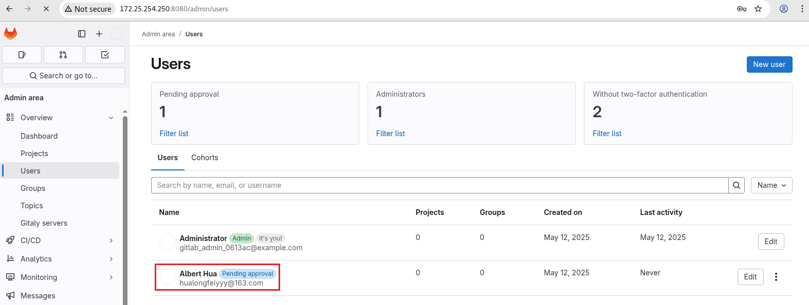

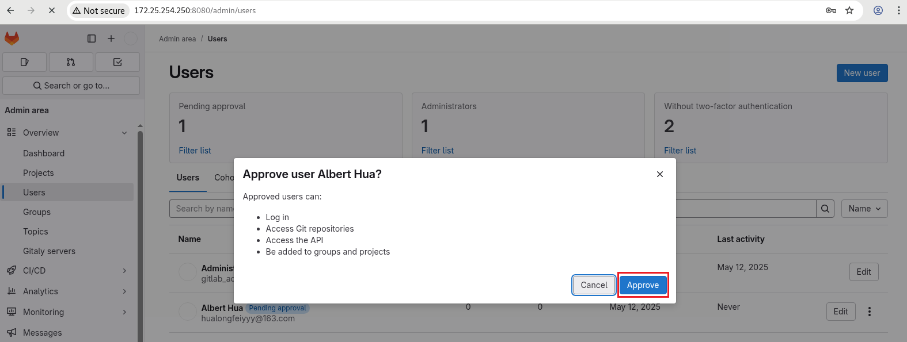

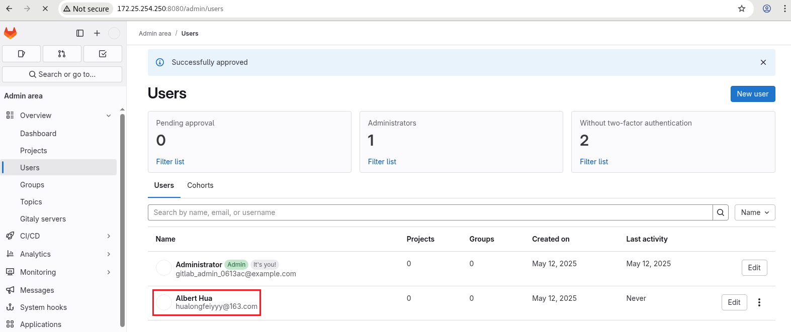

#### 容器化部署失败回退方式

```bash
$ sudo podman stop gitlab-ce
$ sudo podman rm gitlab-ce
# 停止并删除容器
$ sudo rm -rf /opt/gitlab-ce/config/*
$ sudo rm -rf /opt/gitlab-ce/logs/*
$ sudo rm -rf /opt/gitlab-ce/data/*
# 删除残留的 gitlab-ce 配置文件与相关数据
```

## GitLab 常规配置使用

### GitLab 常用命令示例
  
```bash
$ gitlab-ctl stop
# 停止 gitlab 各组件服务
$ gitlab-ctl start
# 启动 gitlab 各组件服务
$ gitlab-ctl restart
# 重启 gitlab 各组件服务
$ gitlab-ctl tail
# 实时刷新 gitlab 所有组件日志
$ gitlab-ctl tail gitlab-rails
# 查看 /var/log/gitlab 子目录中的实时日志
$ gitlab-ctl tail <gitlab_component_name>
# 实时刷新 gitlab 指定组件的日志
```

### 创建、管理 GitLab 用户

- 首次登录 GitLab 时，需设置 root 管理员密码并确认，密码长度至少 `8` 位。
  - 8.8 版本之前默认 `root` 账号，密码为 `5iveL!fe`。
  - 8.9 版本之后登录 Web 界面要求更改密码，密码最少为 `8` 位。
- root 密码设置完成后即可登录，如下所示：

  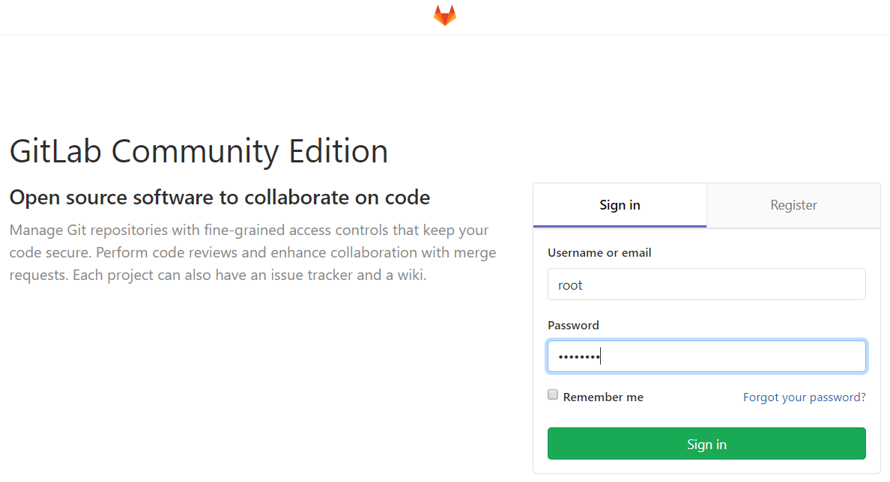
  
- 创建项目（仓库）、用户与组：👉 使用管理员区域（`Admin Area`）按钮设置

  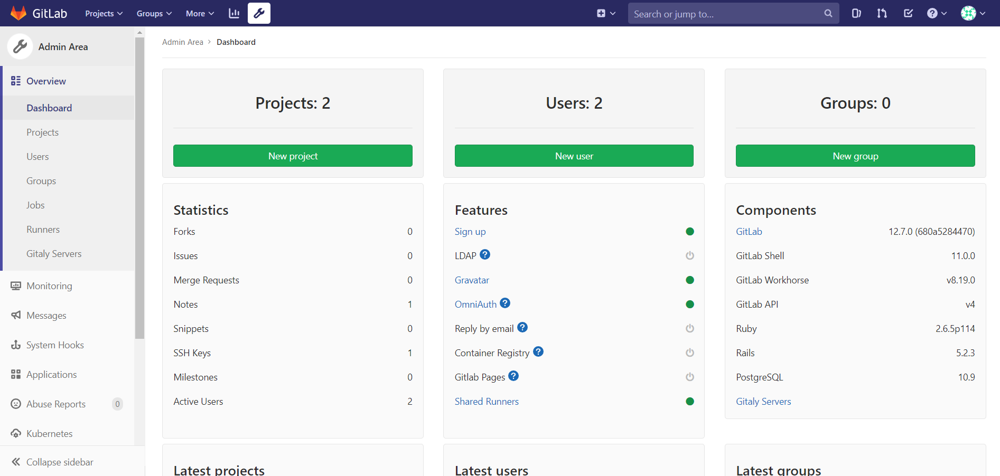
  
- 更改已存在用户的信息：
  - 创建的新用户设置密码，需要使用由 GitLab 发送的邮件链接完成。
  - 创建的密码可由 root 管理员或用户自身进行更改。

    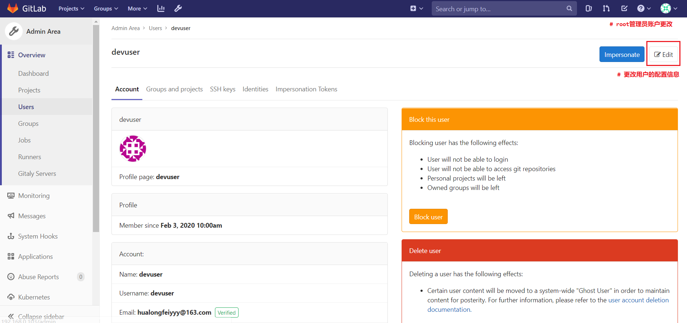

    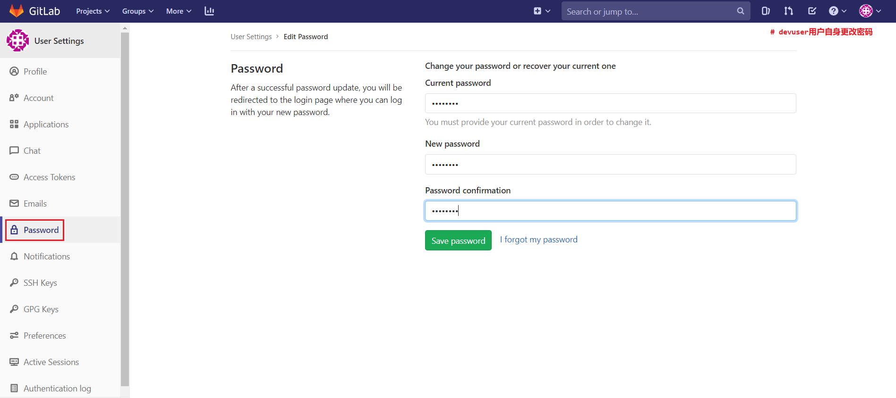

### 更改 GitLab 的远程拉取地址
  
```bash
$ sudo ls -l /opt/gitlab/embedded/service/gitlab-rails/config/gitlab.yml
  lrwxrwxrwx 1 root root 43 Jan 24  2020 /opt/gitlab/embedded/service/gitlab-rails/config/gitlab.yml -> /var/opt/gitlab/gitlab-rails/etc/gitlab.yml
$ sudo vim /var/opt/gitlab/gitlab-rails/etc/gitlab.yml
  # This file is managed by gitlab-ctl. Manual changes will be
  # erased! To change the contents below, edit /etc/gitlab/gitlab.rb
  # and run `sudo gitlab-ctl reconfigure`.
  
  production: &base
    #
    # 1. GitLab app settings
    # ==========================
  
    ## GitLab settings
    gitlab:
      ## Web server settings (note: host is the FQDN, do not include http://)
      host: gitlab.lab.example.com
      port: 80
      https: false
      ### 配置 GitLab 远程代码仓库地址与监听端口，并关闭 HTTPS。
  
      # The maximum time unicorn/puma can spend on the request. This needs to be smaller than the worker timeout.
      # Default is 95% of the worker timeout
      max_request_duration_seconds: 57
  ...
$ sudo gitlab-ctl restart
# 重启 gitlab 各组件服务
```
  
- 编辑 `/etc/gitlab/gitlab.rb` 配置文件后需重新配置 gitlab，即执行 `gitlab-ctl reconfigure` 命令，而编辑其他配置文件后，只需重启 gitlab 各服务组件即可。
- 💥 若重新配置 gitlab，由于 /etc/gitlab/gitlab.rb 配置文件未更改，其他配置文件中更改的内容将被全部清除而无法生效！
- ✅ 最佳实践：尽可能更改 `/var/opt/gitlab/` 目录中的配置，再重启 gitlab 各服务组件。

### 更改 GitLab 自定义代码存储路径
  
```bash
$ sudo gitlab-ctl stop
$ sudo mkdir -p /data/git-data
# 创建自定义代码存储路径
$ sudo cp /etc/gitlab/gitlab.rb /etc/gitlab/gitlab.rb.bak
# 重要：备份 gitlab 配置文件！
$ sudo vim /etc/gitlab/gitlab.rb
  ...
  ### For setting up different data storing directory
  ###! Docs: https://docs.gitlab.com/omnibus/settings/configuration.html#storing-git-data-in-an-alternative-directory
  ###! **If you want to use a single non-default directory to store git data use a
  ###!   path that doesn't contain symlinks.**
  git_data_dirs({
    "default" => { 
      "path" => "/data/git-data",  # 指定自定义 git 代码存储路径
      "failure_count_threshold" => 10,
      "failure_wait_time" => 30,
      "failure_reset_time" => 1800,
      "storage_timeout" => 30
    }
  })
  ...
# 编辑 gitlab 配置文件，指定自定义代码存储路径。
$ sudo gitlab-ctl reconfigure
# 重新配置 gitlab，使配置生效。
$ sudo ls -lh /data/git-data/repositories
  total 0
  drwxr-sr-x  3 git root  17 Jan 24  2020 +gitaly
  drwxr-s--- 12 git root 106 May  4 09:50 @hashed
# 查看自定义代码存储路径的属组、权限（SGID）。
$ sudo cp -avr /var/opt/gitlab/git-data/repositories/* /data/git-data/repositories/
# 拷贝所有 Git 相关文件至自定义代码存储路径中，实现迁移（权限保持不变）。
$ sudo gitlab-ctl start     
# 启动 gitlab 各组件服务，查看代码仓库状态。
```

### 重置 GitLab 管理员 roor 密码
  
```bash
$ sudo gitlab-rails console production
  gitlab-shell> user = User.where(id:1).first
  gitlab-shell> user.password = "<password>"
  gitlab-shell> user.save!
  gitlab-shell> exit
```
  
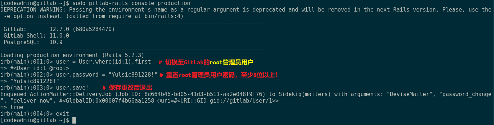

## 参考链接

- ❤ [GitLab Docs](https://docs.gitlab.com)
- [gitlab's repos](https://packages.gitlab.com/gitlab)
- ❤ [使用 Docker Engine 安装极狐GitLab | GitLab Docs](https://gitlab.cn/docs/jh/install/docker/installation.html#%E4%BD%BF%E7%94%A8-docker-engine-%E5%AE%89%E8%A3%85%E6%9E%81%E7%8B%90gitlab)
- [GitLab Architecture | GitLab Docs](https://docs.gitlab.com/development/architecture/)
- [GitLab 架构](https://blog.csdn.net/kikajack/article/details/80354774)
- [GitLab 搭建遇到的问题记录](https://blog.csdn.net/huohongpeng/article/details/113856718)
- [GitLab启动所有服务的方式](http://www.doocr.com/articles/58aef65448fad94044cf13cc)
- [GitLab 操作手册](https://blog.51cto.com/14241151/2366621?source=dra)
