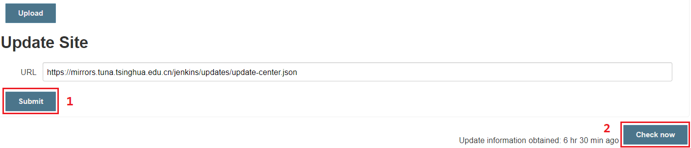
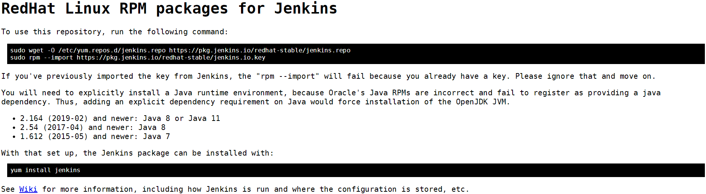

# Jenkins 的安装与部署

## 文档说明

- OS 版本：CentOS Linux release 7.4.1708 (Core)
- Jenkins 版本：jenkins-2.204.2-1.1.noarch

## 文档目录

- Jenkins 基本概念与架构
- Jenkins 安装与配置

## Jenkins 基本概念与架构

- Jenkins 最大的优势在于具有众多的插件（plugin），实际工作的是插件。
- Jenkins 使用插件的源位于国外服务器，下载更新速度很慢，可更换为国内清华的插件源。
- Jenkins 更换插件源：
  - Manage Jenkins -> Manage Plugins -> Advanced
  - [清华的插件源](https://mirrors.tuna.tsinghua.edu.cn/jenkins/updates/update-center.json)：

    

## Jenkins 安装与配置

- Jenkins 具有两种不同的软件发行周期：
  - 长期稳定版（`LTS`）：每 `12` 周更新一次
  - 每周更新版：每周更新一次以获得软件的最新特性
- 使用长期稳定版的 RPM 方式安装：
  
  
  
  该安装方式可参考 [该文档链接](https://github.com/Alberthua-Perl/tech-docs/blob/master/%E5%9F%BA%E4%BA%8E%20Jenkins%20%E7%9A%84%20DevOps%20CICD%20%E9%83%A8%E7%BD%B2%E7%A4%BA%E4%BE%8B.md)。

## 参考链接

- 
