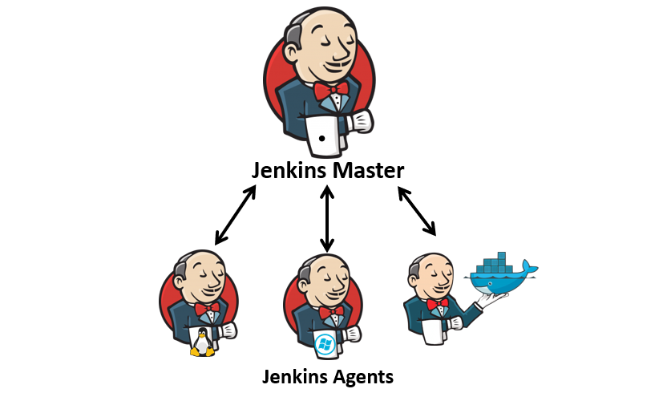

# Jenkins 分布式构建环境

## 文档目录

- [1. Jenkins 部署架构概述](#1-jenkins-部署架构概述)
- [2. Jenkins 部署架构详解](#2-jenkins-部署架构详解)
  - [2.1 单 Master 架构](#21-单-master-架构)
  - [2.2 分布式架构（Master + Agent）](#22-分布式架构master--agent)
    - [2.2.1 Agent 的常见形式](#221-agent-的常见形式)
      - [2.2.1.1 按照 Agent 的运行形式分类](#2211-按照-agent-的运行形式分类)
      - [2.2.1.2 按照 Agent 的持久化分类](#2212-按照-agent-的持久化分类)
    - [2.2.2 节点标签（label）](#222-节点标签label)
    - [2.2.3 Master 与 Agent 间的连接方式](#223-master-与-agent-间的连接方式)
    - [2.2.4 配置与使用 JNLP Agent](#224-配置与使用-jnlp-agent)
    - [2.2.5 配置与使用 SSH Agent](#225-配置与使用-ssh-agent)
- [参考链接](#参考链接)

## 1. Jenkins 部署架构概述

Jenkins 部署分为以下两种模式：

- 一种是直接使用单 Master 安装 Jenkins，直接进行任务管理和业务构建发布，但可能存在一定的生产安全风险。
- 一种是 Master 加 Agent 模式。Master 主要是处理调度构建作业，把构建分发到 Agent 实际执行，监视 Agent 的状态。业务构建发布的工作交给 Agent 进行，即执行 Master 分配的任务，并返回任务的进度和结果。

Jenkins 的 Master 和 Agent 均可安装在虚拟机或容器中，且组合形式可多样。

| 部署模式 | Master | Agent | 优缺点分析 |
|-----|-----|-----|-----|
| 单 Master | 虚拟机 | - | ✅ **优点**：本地化构建，操作简单。  ❌ **缺点**：任务管理和执行都在同一台虚拟机上，安全风险较高。|
| 单 Master | 容器 | - | ✅ **优点**：利用 Kubernetes Pod 调度机制，拥有一定的自愈能力。  ❌ **缺点**：任务管理和执行没有分离，安全风险问题仍未解决。|
| Master + Agent | 虚拟机 | 虚拟机 | ✅ **优点**：任务管理和执行分离，降低了一定的安全风险。  ❌ **缺点**：只能固定 Agent，无法进行资源调度，资源利用率低，且环境维护成本高。|
| Master + Agent | 虚拟机 | 容器（Kubernetes集群） | ✅ **优点**：容器化的 Agent 可以选择固定 Agent，也可以通过 Kubernetes 实现动态 Agent，动态 Agent 的方式资源利用率高。并且可以根据调度策略均匀分配任务，后期也比较容易维护。  ❌ **缺点**：Jenkins 的 Master 存在小概率的宕机风险，恢复成本较高。|
| Master + Agent| 容器（Kubernetes集群）| 容器（Kubernetes集群）| ✅ **优点**：容器化的 Agent 可以选择固定 Agent，也可以通过 Kubernetes 实现动态 Agent，资源利用率高。并且 Master 具有自愈能力，维护成本低。Agent 可以选择和 Master 共集群，也可以分集群。  ❌ **缺点**：系统复杂程度高，环境搭建较困难。|

## 2. Jenkins 部署架构详解

### 2.1 单 Master 架构

- 单 Master 安装 Jenkins，直接进行任务管理和业务构建发布。

- 对于某些特定场景，单节点不足以满足需求：
  - 如果所有执行程序（executor）都忙于处理构建作业，则作业（job）必须等待。
  - 当项目的数量或负载增加时，很可能会耗尽资源。
- 为了恢复并运行 Jenkins 基础设施，需要通过增加内存、CPU 等来扩容服务器，而此不具备可扩展性，必须根据需求维护和升级服务器。
- 在维护升级过程中，构建环境将被关闭，作业不得不停止，整个 Jenkins 基础设施将不可用。
- 此种单节点架构会造成系统经常处于 idle 状态，分配给 Jenkins 环境的资源在此种状态下也没法被充分利用。
- 单节点架构还会引入安全问题，因为 Jenkins 用户对所有资源和工作空间都拥有完全的权限。
- 由于此些原因，Jenkins 支持分布式架构，其中构建项目的工作负载被委托给多个 Jenkins 代理（agent）。

### 2.2 分布式架构（Master + Agent）

- 在 Jenkins 中，节点是一个基础概念，代表了任何可以执行 Jenkins 任务的系统。
  - 采用 Master/Agent 架构，因而其节点可划分主节点（Master）和代理节点（Agent）两种类型，代理节点也被称为从节点（Slave）。
  - 主节点负责提供 UI、处理 HTTP 请求及管理构建环境等，而代理节点则主要负责执行构建任务。
- Jenkins 的 Master 和 Agent 均可安装在物理机、虚拟机或容器中，可根据自身需求选择其中一种方案执行。
- Jenkins 分布式架构特点：
  - Master 负责（也叫 Controller 节点）：
    - 调度构建作业
    - 将构建作业分发给 Agent 实际执行
    - 监视 Agent ，并根据需要停止其工作。
  - Agent 负责（也叫 Slave 节点）：
    - 从 Master 接收请求或工作，Agent 的工作就是按命令行事。
    - 可以将工作配置为始终在特定 Agent 上执行
    - Master 将利用其资源来处理 HTTP 请求和管理构建环境，构建的实际执行将委托给 Agent。
- 通过此种配置，可以横向扩展 Jenkins 架构，其中 Jenkins 将安装在单个节点上。
- 节点（Node）与执行器（Executor）
  - 主节点：
    - Jenkins 的一个部署实例的核心控制系统，它能够完全访问所有 Jenkins 配置的选项和任务（job）列表，而且，若不存在其他代理节点，主节点也是默认的任务执行节点。
    - 2020年8月，Jenkins 项目投票决定将 Master 一词替换为 Controller。
  - 代理节点：
    - 在早先版本的 Jenkins 中，代理节点（Agent）也被称为从节点（Slave），它代表着所有的非主节点。
    - 此类节点由主节点管理，按需分配或指定执行特定的任务，如不同的构建任务或测试任务等。
    - 脚本式流水线中，节点特指一个运行代理节点的系统，而在声明式流水线中，它则是分配的一个来作为代理节点的特定节点。
  - 执行器（Executor）：
    - 简单来说，Executor 只是节点或代理节点用于执行任务的一个槽位。
    - Executor 的数量定义了此节点可以执行的并发任务量，一个节点上可以有任务数量的槽位，但也允许管理员按节点资源定义合适的数量。
    - 在主节点将任务分配给特定节点时，此节点上必须有可用的 Executor。

#### 2.2.1 Agent 的常见形式

##### 2.2.1.1 按照 Agent 的运行形式分类

- 节点 Agent：
  - 在特定节点上部署的 Jenkins 实例
  - 配置其作为 Master 上的 Agent 使用
- Docker Agent：
  - 静态 Docker：
    - 基于特定 Image 运行的 Agent
    - 相较于节点 Agent 的区别仅在于 Jenkins 的部署和运行方式有所不同
    - 可使用专用的 Image 作为 Agent 运行，例如 *jenkins/ssh-gent* 和 *jenkins/inbound-agent*。
  - 动态 Docker：
    - 由 Master 按需在 Docker 主机上启动容器作为 Agent，并在任务完成后予以销毁。
    - Agent 规模能够动态伸缩，具体取决于 Docker 主机的可用资源量。
- Kubernetes Pod Agent：
  - 以 Pod 形式按需运行 Agent 执行构建任务
  - Agent 规模可动态伸缩

##### 2.2.1.2 按照 Agent 的持久化分类

- 固定 Agent 类型：
  - Agent 一直运行，任务构建完成后不会销毁，创建完成后将一直占用集群资源，配置过程较简单。每个 Agent 可以存在多个 executor，具体的数量应该根据Agent 所在主机的系统资源来设定。
  - 常见的固定 Agent 部署场景如下：
    - Linux Jenkins（常用）
    - Windows Jenkins
    - 容器化 Agent
  - 💥 注意：很多的构建步骤，有可能会通过运行 shell 命令进行，于是此时要确保在物理机、虚拟机或容器内部有可用的命令，比如流水线风格的作业中需要执行 mvn 命令，需要在容器内安装配置好 maven 工具等。
- 动态 Agent 类型：
  - 构建任务时动态创建 Agent 容器，并在任务构建完成后销毁容器，可实现资源动态分配，资源利用率高，但是配置过程较为复杂。可以把每个 Agent 视作一个动态的 executor。
  - 依赖云环境，通过 Jenkins Controller（即 Jenkins Mater 节点）与云环境进行交互以管理此些动态 Agent。Jenkins Controller 通过API（依赖插件）与云提供商的服务进行通信，发送请求以创建新的资源（如虚拟机或容器）、配置此些资源以作为 Jenkins Agent 运行，以及在作业完成后销毁此些资源。此些 API 调用允许 Jenkins Controller 自动化整个流程，从资源的创建到销毁，从而实现了 Agent 的动态管理。
    - **Docker plugin**：基于配置的 Docker 主机，按需要创建容器运行 Agent，需要事先配置好 Agent 的容器镜像模版。
    - **Kubernetes plugin**（常用）：基于配置的 Kubernetes，按需要创建 Pod 运行 Agent，需要事先配置 Pod 的资源清单定义。

    > 注意：Jenkins Controller 自身既可以部署在 Kubernetes 集群上，也完全可以运行在 Kubernetes 外。

#### 2.2.2 节点标签（label）

- Jenkins 中的标签（label）指的是附加在节点之上的标识符，而后可由 pipeline 中的 agent 指令等进行过滤和选择。
- Agent 节点较多时，出于便捷管理的需要，通常应该给这些节点添加能够暴露其某种特性或功能的标签，以便于在构建任务中能基于标签过滤出符合条件的Agent。
  - 一个 Agent 上可附加多个标签。
  - 标签名称不允许使用空白字符，也不允许使用标签表达式中预留的关键字，如 `!`、`&`、`|`、`<`、`>`、`)` 和 `(` 等。
- 常用的标签有如下几个：
  - 操作系统类型：linux、windows、macos
  - 系统位数：32bit、64bit
  - 集成的工具链：jdk、go、python、nodejs

#### 2.2.3 Master 与 Agent 间的连接方式

- 为了能让 Master 将一个主机识别为 Agent，需要事先在各 Agent 上运行特定的代理程序以使得其能够与 Master 之间建立双向通信。
- Jenkins 使用 JNLP 协议启动 Agent 原理：
  - 概述：Java 网络启动协议（JNLP）是一种允许客户端启动托管在远程 Web 服务器上的应用程序的协议，用于在 Java 应用程序之间建立安全、高效的通信。
  - JNLP 协议只是技术方式，其核心是：
    - Agent 主动运行一个 Agent 程序与 Master 建立连接，接收并执行 Master 传递的作业，然后将结果反馈给 Master。
    - Master 通过 JNLP 协议与 Agent 进行通信，将构建任务分发到 Agent 执行。
  - 为什么使用 JNLP 协议：
    - 自动化：JNLP 协议允许 Master 和 Agent 之间的连接和配置过程自动化，而不需要手动干预。Agent 启动时自动处理与 Master 的连接和认证，简化了配置过程。
    - 安全性：JNLP 协议中的认证机制可以确保只有授权的 Agent 可以连接到 Master，从而提高了系统的安全性。
    - 动态更新：JNLP 文件可以包含最新的配置信息，这使得 Agent 可以在启动时动态地获取和使用这些信息。
  - Master 和 Agent 之间的通信过程：
    - Agent 通过 JNLP 协议与 Master 建立 TCP/IP 长连接，这个长连接的机制允许 Master 和 Agent 之间保持持续的通信，以便实时地进行任务调度、执行和状态更新。

    > 关于长连接的说明：
    >
    > - 长连接的建立：
    >   - Agent 启动：当 Agent 启动时，它会连接到 Master 并建立一个持久的 TCP 连接。这种连接使用 JNLP 协议。
    >   - 通信保持：这个连接用于传输任务配置、执行步骤、日志信息等。它确保 Master 和 Agent 之间的通信可以实时进行。
    > - 通信过程：
    >   - 实时交互：在任务执行过程中，Agent 会定期向 Master 发送任务进度、构建日志和其他状态信息。Master 会接收这些更新，并在 Web 界面中显示实时进展。
    >   - 指令发送：Master 会通过这个长连接向 Agent 发送任务指令和配置更新。
    > - 连接的稳定性：
    >   - TCP 连接：Jenkins 使用 TCP 连接来维持与 Agent 的长连接。TCP 协议提供了可靠的数据传输，确保数据包的顺序和完整性。
    >   - 心跳机制：为了保持连接的活跃性，Master 和 Agent 通常会使用心跳机制（即定期发送空闲的网络包）来检测连接是否仍然有效。如果连接中断，Master 会尝试重新连接，或者标记 Agent 为离线状态。

    - Master 调度构建任务，从节点根据标签接收构建任务，并按照 Master 的指示执行构建作业，并将构建结果和日志发送回 Master。
    - Master 将构建结果和日志发布到 Jenkins Dashboard 上，供用户查看和监控。

- 💪 连接方式汇总如下：

  | 项目 | JNLP-HTTP 连接器（Launch agent by connecting it to the controller）| SSH 连接器（Launch agent via SSH）|
  | ----- | ----- | ----- |
  | 连接方式 | Agent 主动连接 Master，Agent 接收并执行 Master 传递的作业，然后将结果反馈给 Master。| Master 主动连接 Agent，通过 SSH 协议连接到远程机器并启动代理进程。|
  | 适用平台 | 适用于各种操作系统，只要网络可以正常通信，且目标机器安装了 Java 环境即可。| 通常适用于 Linux 或 macOS 系统。|
  | 安全性 | 需要在  Master 上开启 Inbound agents 端口（默认为 50000/tcp），可能存在一定的安全风险。| 1️⃣ 首选且最稳定的双向连接机制，它依赖于 Jenkins 内置的 SSH 客户端，要求各 Agent 要部署并启动 SSH 服务。  2️⃣ 支持基于密钥及口令的两种认证方式，但认证信息要保存为 Master之上的凭证。  3️⃣ 基于密钥认证时，Master 主机上私钥凭证对应的公钥要正确配置到各 Agent主机之上。|
  | 配置复杂度 | 1️⃣ 配置相对复杂，需要在 Master 上配置节点，并生成 JNLP 连接文件，然后在 Agent 机器上运行该文件。  2️⃣ 在 Agent 上以手动或系统服务的方式经由 JNLP 协议触发双向连接的建立。| 配置相对简单，只需在 Master 上配置节点，提供目标机器的 SSH 连接信息即可。|
  | 自动恢复能力 | 如果 Agent 掉线，需要手动重新启动 Agent。| 如果 Agent 掉线，Master 可以自动重新连接。|

#### 2.2.4 配置与使用 JNLP Agent

- Jenkins 基于一个 TCP 端口通过 JNLP 代理节点进行通信：
  - 💥 由系统随机选择使用的端口能有效避免冲突，但是这种不固定又可能会给防火墙设置等带来困扰。
  - 未使用 JNLP 代理的情况下，建议关闭 Jenkins 上的此端口。
  - Jenkins 默认为 JNLP 使用的固定端口是 `50000/TCP`。
- 配置各种类型的 Agent 的关键之处在于启动 Agent 的方式：
  - JNLP Agent 对应着 `Launch agent by connecting it to the controller`（早先版本为 `通过 Java Web 启动代理` 方式）
  - Master 与 Agent 之间建立一个基于 HTTP/HTTPS 协议的 Web 连接
  - Agent 首次接入 Master 时，需要提供用于认证的 Secret 以完成 Bootstrap。
- 🧪 配置 JNLP Agent 创建分布式构建环境的步骤：
  - Master 节点上部署好 Jenkins，准备 Agent 节点。
  - 在 Master 节点上，添加 Agent 节点的定义。
  - 在 Master 节点上，获取将 Agent 节点连接至 Master 节点时需要执行的命令。
  - 在 Agent 节点上，打开命令终端，运行 Master 节点提示的命令。
  - 在 Master 节点上验证添加的结果。

  > 💪 说明：以上步骤可参考 [11.1 JNLP 连接方式](https://github.com/Alberthua-Perl/tech-docs/tree/master/DevOps%20%E6%8A%80%E6%9C%AF%E6%A0%88/Jenkins%20%E7%9A%84%20CICD%20%E4%B9%8B%E6%97%85#111-jnlp-%E8%BF%9E%E6%8E%A5%E6%96%B9%E5%BC%8F)

- 如何调用 JNLP Agent 执行任务构建？
  - 1️⃣ 由 Master（Controller）自行按调度逻辑动态分配
  - 2️⃣ 在作业中指定要使用的节点
    - 一般情况下，仅某些特定的任务必须要在特定类型的 Agent（如特定操作系统，或安装有特定的工具）上构建时，才需要手动指定。
    - 可以基于节点标签筛选目标节点
- 标签表达式（label expressions）操作符：
  - `!expression`：表达式条件取反
  - `a && b`：表达式间 “与” 联结
  - `a || b` ：表达式间 “或” 联结
  - `a -> b`：等同于 `!a || b`，意味着如果满足 a 表达式，则同时必须满足 b表达式。如，`linux -> x64`，意味着，如果操作系统为 linux，则它也必须是 x64 的系统环境。
  - `a <-> b`：表示两个条件要么同时满足，要么同时都不满足，即等同 `a && b || !a && !b`
  - `(expression)`：表达式分组，常在需要改变操作符间的优先级顺序时使用

#### 2.2.5 配置与使用 SSH Agent

- 静态运行 SSH Agent 的方式有两种：
  - 在常规的 Jenkins 节点上，将运行 jenkins 进程的用户账号（如 jenkins）设定为可通过 sshd 远程连接和访问。
  - 基于 *jenkins/ssh-agent* Image 运行 Docker 容器
- Jenkins Master（Controller）连接 SSH Agent 的方式：
  - 对于运行有 sshd 服务的常规 Jenkins 节点，可选择使用口令认证或密钥认证的方式：
    - 将认证信息保存为 Jenkins 上的凭据
    - 启动方式：Lanch agent via SSH
  - 对于容器化运行的 SSH Agent，通常只能使用密钥认证的方式：
    - 使用 ssh-keygen 生成一对密钥，并将公钥通过环境变量传递给 ssh-agent 容器。
    - 将私钥保存为 Jenkins 上的凭据

## 参考链接

- [在 CCE 中安装部署 Jenkins 方案概述 | 华为云](https://support.huaweicloud.com/bestpractice-cce/cce_bestpractice_0066.html)
- [11. 设置 Jenkins 分布式构建环境](https://github.com/Alberthua-Perl/tech-docs/tree/master/DevOps%20%E6%8A%80%E6%9C%AF%E6%A0%88/Jenkins%20%E7%9A%84%20CICD%20%E4%B9%8B%E6%97%85#11-%E8%AE%BE%E7%BD%AE-jenkins-%E5%88%86%E5%B8%83%E5%BC%8F%E6%9E%84%E5%BB%BA%E7%8E%AF%E5%A2%83)
