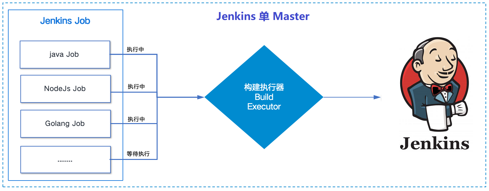
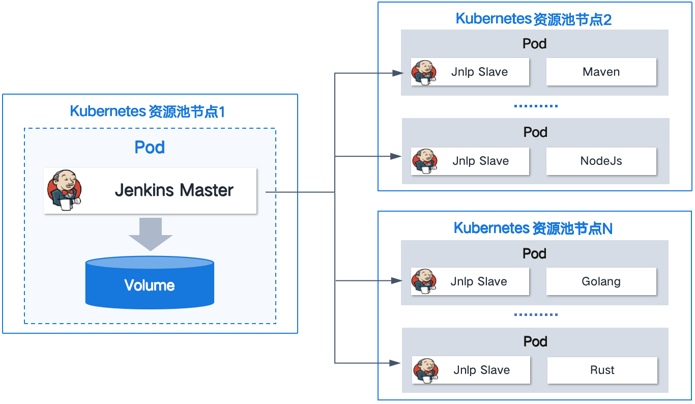

# Jenkins 分布式构建环境

## 文档目录

- [1. Jenkins 部署架构概述](#1-jenkins-部署架构概述)
- [2. Jenkins 部署架构详解](#2-jenkins-部署架构详解)
  - [2.1 单 Master 节点架构](#21-单-master-节点架构)
  - [2.2 分布式架构（Master + Agent）](#22-分布式架构master--agent)
    - [2.2.1 固定 Agent 类型](#221-固定-agent-类型)
    - [2.2.2 动态 Agent 类型](#222-动态-agent-类型)
- [参考链接](#参考链接)

## 1. Jenkins 部署架构概述

Jenkins 部署分为以下两种模式：

- 一种是直接使用单 Master 安装 Jenkins，直接进行任务管理和业务构建发布，但可能存在一定的生产安全风险。
- 一种是 Master 加 Agent 模式。Master 节点主要是处理调度构建作业，把构建分发到 Agent 实际执行，监视 Agent 的状态。业务构建发布的工作交给 Agent 进行，即执行 Master 分配的任务，并返回任务的进度和结果。

Jenkins 的 Master 和 Agent 均可安装在虚拟机或容器中，且组合形式可多样。

| 部署模式 | Master | Agent | 优缺点分析 |
|-----|-----|-----|-----|
| 单 Master | 虚拟机 | - | ✅ **优点**：本地化构建，操作简单。  ❌ **缺点**：任务管理和执行都在同一台虚拟机上，安全风险较高。|
| 单 Master | 容器 | - | ✅ **优点**：利用 Kubernetes Pod 调度机制，拥有一定的自愈能力。  ❌ **缺点**：任务管理和执行没有分离，安全风险问题仍未解决。|
| Master + Agent | 虚拟机 | 虚拟机 | ✅ **优点**：任务管理和执行分离，降低了一定的安全风险。  ❌ **缺点**：只能固定 Agent，无法进行资源调度，资源利用率低，且环境维护成本高。|
| Master + Agent | 虚拟机 | 容器（Kubernetes集群） | ✅ **优点**：容器化的 Agent 可以选择固定 Agent，也可以通过 Kubernetes 实现动态 Agent，动态 Agent 的方式资源利用率高。并且可以根据调度策略均匀分配任务，后期也比较容易维护。  ❌ **缺点**：Jenkins 的 Master 存在小概率的宕机风险，恢复成本较高。|
| Master + Agent| 容器（Kubernetes集群）| 容器（Kubernetes集群）| ✅ **优点**：容器化的 Agent 可以选择固定 Agent，也可以通过 Kubernetes 实现动态 Agent，资源利用率高。并且 Master 具有自愈能力，维护成本低。Agent 可以选择和 Master 共集群，也可以分集群。  ❌ **缺点**：系统复杂程度高，环境搭建较困难。|

## 2. Jenkins 部署架构详解

### 2.1 单 Master 节点架构

- 单 Master 安装 Jenkins，直接进行任务管理和业务构建发布。

  

  
图 2.1-1 Jenkins 单 Master 节点架构示意

- 对于某些特定场景，单节点不足以满足需求：
  - 如果所有执行程序（executor）都忙于处理构建作业，则作业（job）必须等待。
  - 当项目的数量或负载增加时，很可能会耗尽资源。
- 为了恢复并运行 Jenkins 基础设施，需要通过增加内存、CPU 等来扩容服务器，而这不具备可扩展性，必须根据需求维护和升级服务器。
- 在维护升级过程中，构建环境将被关闭，作业不得不停止，整个 Jenkins 基础设施将不可用。
- 这种单节点架构会造成系统经常处于 idle 状态，分配给 Jenkins 环境的资源在这种状态下也没法被充分利用。
- 单节点架构还会引入安全问题，因为 Jenkins 用户对所有资源和工作空间都拥有完全的权限。
- 由于这些原因，Jenkins 支持分布式架构，其中构建项目的工作负载被委托给多个 Jenkins 代理（agent）。

### 2.2 分布式架构（Master + Agent）

- Jenkins 的 Master 节点和 Agent 节点均可安装在物理机、虚拟机或容器中，可根据自身需求选择其中一种方案执行。
- Jenkins 分布式架构特点：
  - Master 节点负责（也叫 Controller 节点）：
    - 调度构建作业
    - 将构建作业分发给 Agent 实际执行
    - 监视 Agent 节点，并根据需要停止其工作。
  - Agent 节点负责（也叫 Slave 节点）：
    - 从 Master 节点接收请求或工作，Agent 的工作就是按命令行事。
    - 可以将工作配置为始终在特定 Agent 上执行
    - Master 节点将利用其资源来处理 HTTP 请求和管理构建环境，构建的实际执行将委托给 Agent。
- 通过这种配置，可以横向扩展 Jenkins 架构，其中 Jenkins 将安装在单个节点上。

#### 2.2.1 固定 Agent 类型

- Agent 一直运行，任务构建完成后不会销毁，创建完成后将一直占用集群资源，配置过程较简单。每个 Agent 可以存在多个 executor，具体的数量应该根据Agent 所在主机的系统资源来设定。
- 常见的固定 Agent 部署场景如下：
  - Linux Jenkins（常用）
  - Windows Jenkins
  - 容器化 Agent
- 💥 注意：很多的构建步骤，有可能会通过运行 shell 命令进行，于是此时要确保在物理机、虚拟机或容器内部有可用的命令，比如流水线风格的作业中需要执行 mvn 命令，需要在容器内安装配置好 maven 工具等。

#### 2.2.2 动态 Agent 类型

- 构建任务时动态创建 Agent 容器，并在任务构建完成后销毁容器，可实现资源动态分配，资源利用率高，但是配置过程较为复杂。可以把每个 Agent 视作一个动态的 executor。
- 依赖云环境，通过 Jenkins Controller（即 Jenkins Mater 节点）与云环境进行交互以管理这些动态 Agent。Jenkins Controller 通过API（依赖插件）与云提供商的服务进行通信，发送请求以创建新的资源（如虚拟机或容器）、配置这些资源以作为 Jenkins Agent 运行，以及在作业完成后销毁这些资源。这些 API 调用允许 Jenkins Controller 自动化整个流程，从资源的创建到销毁，从而实现了 Agent 的动态管理。
  - **Docker plugin**：基于配置的 Docker 主机，按需要创建容器运行 Agent，需要事先配置好 Agent 的容器镜像模版。
  - **Kubernetes plugin**（常用）：基于配置的 Kubernetes，按需要创建 Pod 运行 Agent，需要事先配置 Pod 的资源清单定义。

    > 注意：Jenkins Controller 自身既可以部署在 Kubernetes 集群上，也完全可以运行在 Kubernetes 外。

图 2.2.2-1 Kuberbetes 集群中 Jenkins 分布式架构的动态 Agent

## 参考链接

- [在 CCE 中安装部署 Jenkins 方案概述 | 华为云](https://support.huaweicloud.com/bestpractice-cce/cce_bestpractice_0066.html)
