# Jenkins 的 CI/CD 之旅 —— Jenkins 概述与部署

## 文档说明

- OS 版本：Red Hat Enterprise Linux release 9.0 (Plow)
- 主机名：workstation.lab.example.com
- 主机名别名：jenkins-master.lab.example.com
- Java 版本依赖：[java-17-openjdk](https://www.jenkins.io/doc/book/platform-information/support-policy-java/)
- Jenkins 版本：[jenkins-2.479.1-1.1.noarch](https://mirrors.huaweicloud.com/jenkins/redhat-stable/jenkins-2.479.1-1.1.noarch.rpm)

## 文档目录

- [1. Jenkins 基础](#1-jenkins-基础)
  - [1.1 Jenkins 是什么？](#11-jenkins-是什么)
  - [1.2 Jenkins 的特点](#12-jenkins-的特点)
- [2. Jenkins 系统组件](#2-jenkins-系统组件)
- [3. Jenkins 安装与配置](#3-jenkins-安装与配置)
- [4. Jenkins 的插件设置](#4-jenkins-的插件设置)
- [5. 参考链接](#5-参考链接)

## 1. Jenkins 基础

### 1.1 Jenkins 是什么？

<center>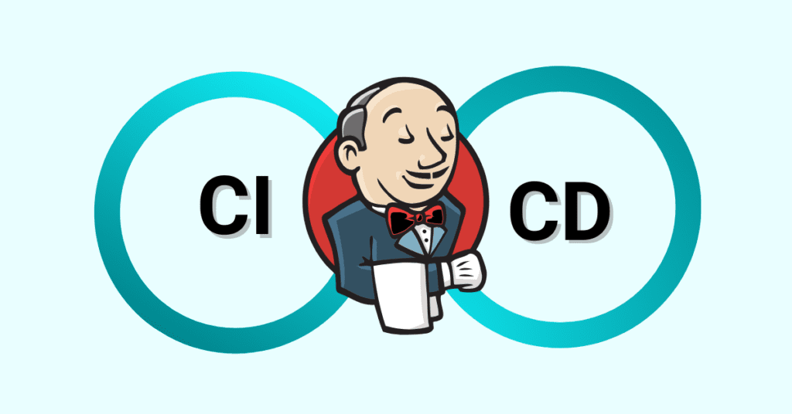</center>

- Jenkins 是一个开源的、提供友好操作界面的持续集成（Continuous Integration, CI）工具，起源于 `Hudson`，主要用于持续、自动地构建/测试软件项目、监控外部任务的运行。
- Jenkins 用 Java 语言编写，可在 Tomcat 等流行的 `servlet` 容器中运行，也可通过 Java 环境独立使用 `war` 包运行，也可通过容器化运行。通常与版本控制工具（SCM）、构建工具结合使用。Jenkins 可以很好地支持各种语言的项目构建，也完全兼容 `Maven`、`Ant`、`Gradle` 等多种第三方构建工具，同时跟 SVN、Git 等常用的版本控制工具无缝集成，也支持直接对接 GitHub 等源代码托管网站。
- 💥 **Jenkins 的版本可分为 `1.x` 与 `2.x`，目前主流已使用 `2.x` 版本。后文若未说明版本，均为 `2.x`。**

### 1.2 Jenkins 的特点

- `DSL` 是 Jenkins 2 的核心组件，作为构建模块让其他核心的用户导向特性成为可能。
- 支持将原本写在 Jenkins 中的代码提取到一个 `Jenkinsfile` 文件中，从而以一种更加结构化的方法来创建工作流，即声明式流水线，它比传统的脚本式流水线有着更加清晰、可预期的结构，以及更强大的 DSL 元素和结构体。
- 具有称为 `Blue Ocean` 的全新用户界面，为流水线的每个阶段添加了图形化展示，能够显示成功、失败和进展等标识，并对每个任务都提供了点选式日志查看功能。
- 用于支持源码控制平台（SCM）上将多个代码库聚合成 “组织” 的功能，目前已经支持 Github 和 Bitbucket 平台上的 “组织” 功能，未来将会逐步支持其他的平台。
- 👍 多分支流水线：在有着 Jenkinsfile 的项目中，若创建了一个新的分支，Jenkins 将自动基于这个新分支创建一个新项目，此类型的项目可应用于任何 Git 或 SVN 代码库。
- 常见的 CI/CD 工作流如下所示，并且 Jenkins 在 CI/CD 工作流中占据着重要的主导作用。

  <center>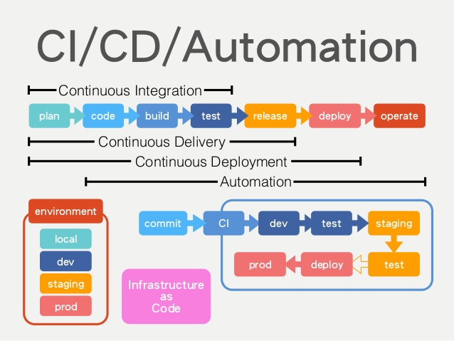</center>

  <center>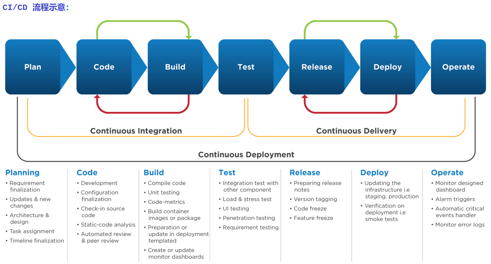</center>

- 💪 虽然此处主要讨论 DevOps 中的 Jenkins，但也可横向对比 Jenkins 介导的 CI/CD 与 `GitOps` 介导的 CI/CD 之间的异同点（如下图所示）。不难看出，从克隆代码、单元测试、集成与构建，再到应用容器镜像构建（若存在的话）几乎完全相同。不同点在于持续部署阶段，前者使用 `Pipeline` 以推送（PUSH）的方式部署应用至指定的环境中；而后者使用 `ArgoCD Operator` 部署应用至指定环境中的同时，还能同步拉取（PULL）SCM 中更新过的代码，从而触发新的 CI 流程，以此循环往复。

  <center>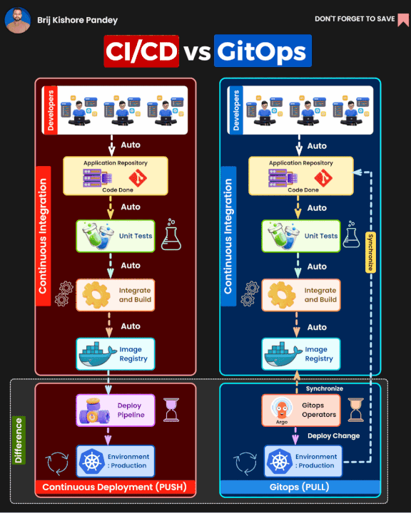</center>

## 2. Jenkins 系统组件

- 在 Jenkins 2 中，节点（node）是一个基础概念，代表了任何可以执行 Jenkins 任务的系统。
- 节点中包含 **主节点（master）** 和 **代理节点（agent）** 两种类型，但主节点一般用于完成任务分配等管理功能，而代理节点才会执行各类具体的任务。
  - 主节点：Jenkins 的一个部署实例的核心控制系统，它能够完全访问所有 Jenkins 配置的选项和任务（job）列表，而且，若不存在其他代理节点，主节点也是默认的任务执行节点。
  - 代理节点：在早先版本的 Jenkins 中，代理节点被称为从节点（slave），它代表着所有的非主节点。
    - 这类节点由主节点管理，按需分配或指定执行特定的任务，如，不同的构建任务或测试任务等。
    - 脚本式流水线中，节点特指一个运行代理节点的系统，而在声明式流水线中，它则是分配的一个来作为代理节点的特定节点。
  - **执行器（executor）**：简单来说，executor 只是节点或代理节点用于执行任务的一个槽位（slot）。
    - executor 的数量定义了该节点可以执行的并发任务量，一个节点上可以有任务数量的槽位，但也允许管理员按节点资源定义合适的数量。
    - 在主节点将任务分配给特定节点时，该节点上必须有可用的 executor 来立即执行该任务，否则，只能等到有空闲槽位可用。

    > 注意：一般而言，执行器的数量小于或等于所在节点的 CPU 核心数，当然，也需要根据任务的负载来做数量上的调整。

## 3. Jenkins 安装与配置

- Jenkins 具有两种不同的软件发行周期：
  - 长期稳定版（`LTS`）：每12周更新一次，每4周发布 bug 修复与安全补丁加固。
  - 每周更新版：每周更新一次以获得软件的最新特性
- 如前所述，Jenkins 可跨平台在不同的操作系统发行版上安装运行，即可以以 `war` 包的形式直接运行，也可以通过各类软件包（rpm 或 deb）完成安装，也可以以容器镜像的方式在云原生环境中通过容器或 pod 的方式运行等。具体请参考 [Download and deploy](https://www.jenkins.io/download/#download-and-deploy)。
- 此次部署使用长期稳定版的 [RPM 方式安装](https://www.jenkins.io/doc/book/installing/linux/#red-hat-centos)。参考 [redhat-stable](https://pkg.jenkins.io/redhat-stable/) 的提示，可下载 `2.479.1 (October 2024) 及以上的版本`。因此，笔者环境中使用 `2.479.1` 软件包（依赖 Java 17 或 Java 21）。
- 软件包默认从 [Jenkins 官网](https://pkg.jenkins.io/) 下载。由于国内网络环境，可从国内镜像点（包括 [阿里云](https://mirrors.aliyun.com/jenkins/?spm=a2c6h.13651104.d-5065.1.577cdb0ewKFra5) 与 [华为云](https://mirrors.huaweicloud.com/jenkins/) 提前下载。再根据以下步骤完成安装：
  
  ```bash
  [devops@workstation ~]$ sudo wget -O /etc/yum.repos.d/jenkins.repo https://pkg.jenkins.io/redhat-stable/jenkins.repo
  # 可选步骤：若已提前下载 jenkins 软件包，此步可不做配置。
  [devops@workstation ~]$ sudo rpm --import https://pkg.jenkins.io/redhat-stable/jenkins.io-2023.key
  [devops@workstation ~]$ sudo yum upgrade
  # 可选步骤：为 jenkins 软件包安装必要的依赖
  [devops@workstation ~]$ wget http://content.example.com/jenkins-ci-plt/jenkins-2.479.1-1.1.noarch.rpm
  # 软件包提前下载并同步至内部共享站点，方便节点间共享。
  [devops@workstation ~]$ sudo yum install -y fontconfig java-17-openjdk
  # 若存在 java-21-openjdk 软件包，可安装此软件包。
  [devops@workstation ~]$ sudo yum install -y jenkins-2.479.1-1.1.noarch
  [devops@workstation ~]$ sudo systemctl daemon-reload
  [devops@workstation ~]$ sudo systemctl enable --now jenkins.service
  ```

  根据以上步骤即可完成节点上基于 RPM 方式的 Jenkins 安装部署。

- 访问 Jenkins 守护进程所在的节点，即 http://jenkins-master.lab.example.com:8080（Jenkins 默认 8080 端口）。

  > 注意：如果将 Jenkins 在 Kubernetes 中发布，那么需注意 ingress 资源中端口的定义！

- 输入 `/var/lib/jenkins/secrets/initialAdminPassword` 中的初始化密码：

  <center>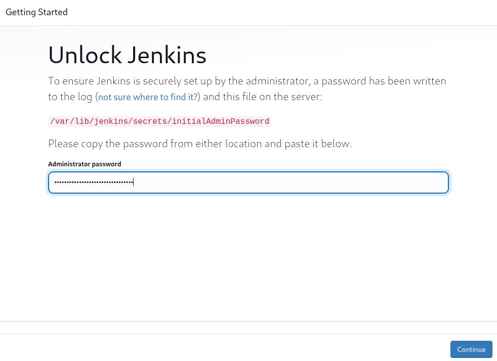</center>

- 初始化密码输入后进入安装插件界面，由于国内网络环境原因，常常超时而导致安装失败，因此，可直接选择第一个选项 "安装推荐的插件"，即使安装失败也无妨，可在后续 Jenkins 插件源中更换为国内源加速插件安装。插件安装后，进入设置管理员用户界面，可参考以下完成设置：

  <center>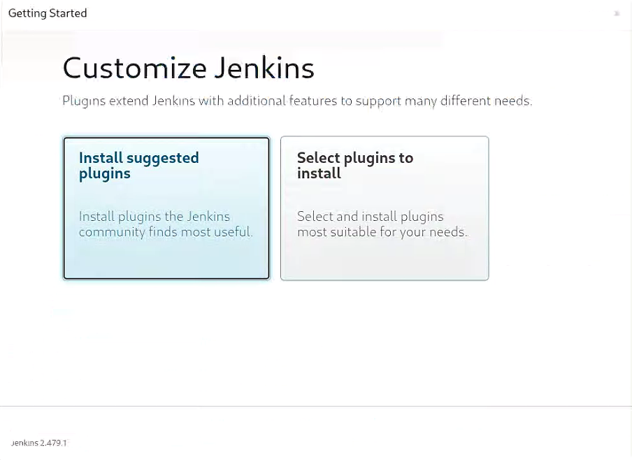</center>

  <center>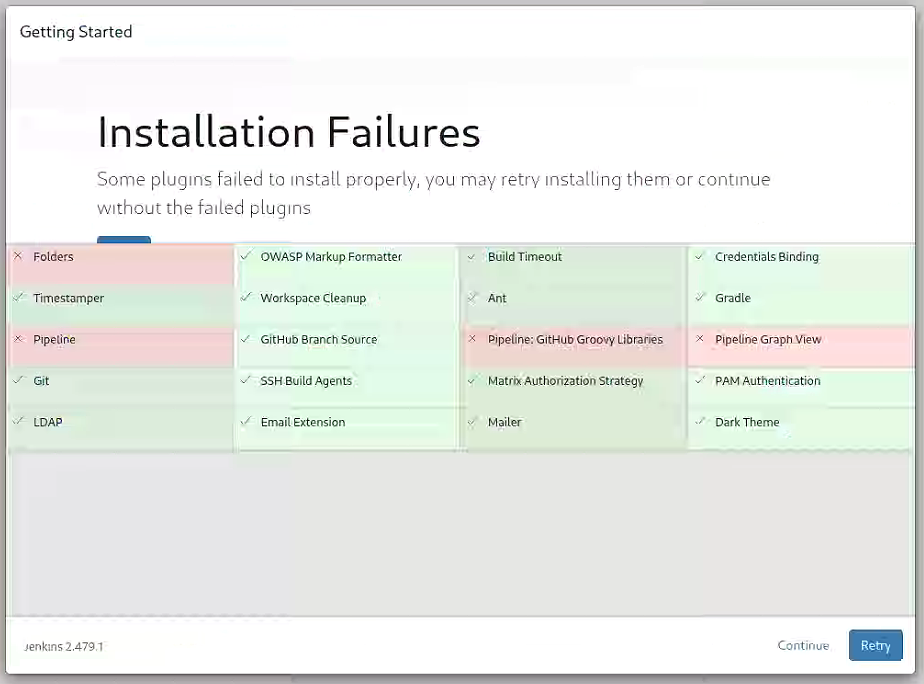</center>

  <center>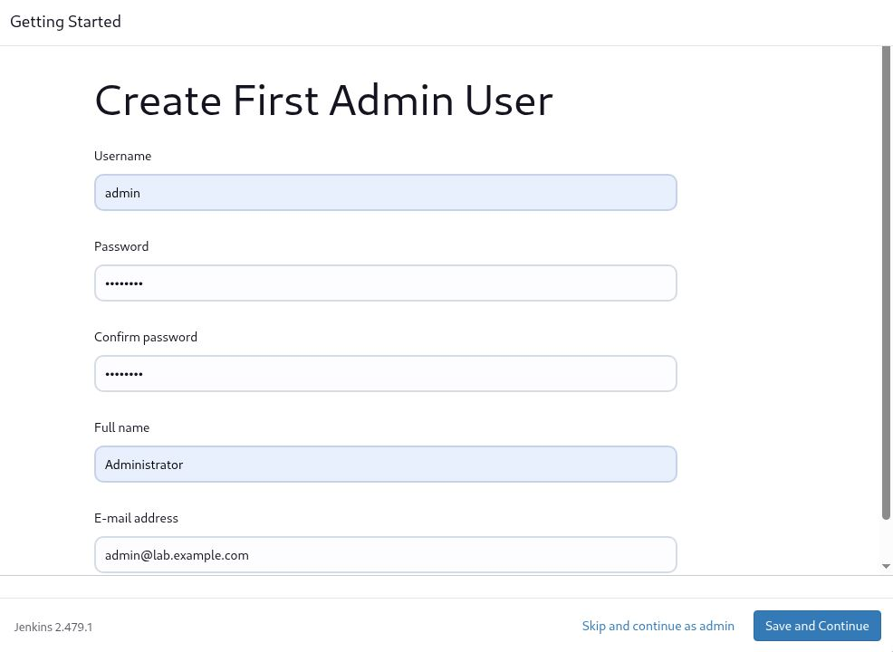</center>

- 管理员账号设置完成后，Jenkins 返回可访问 Web UI 界面的地址：

  <center>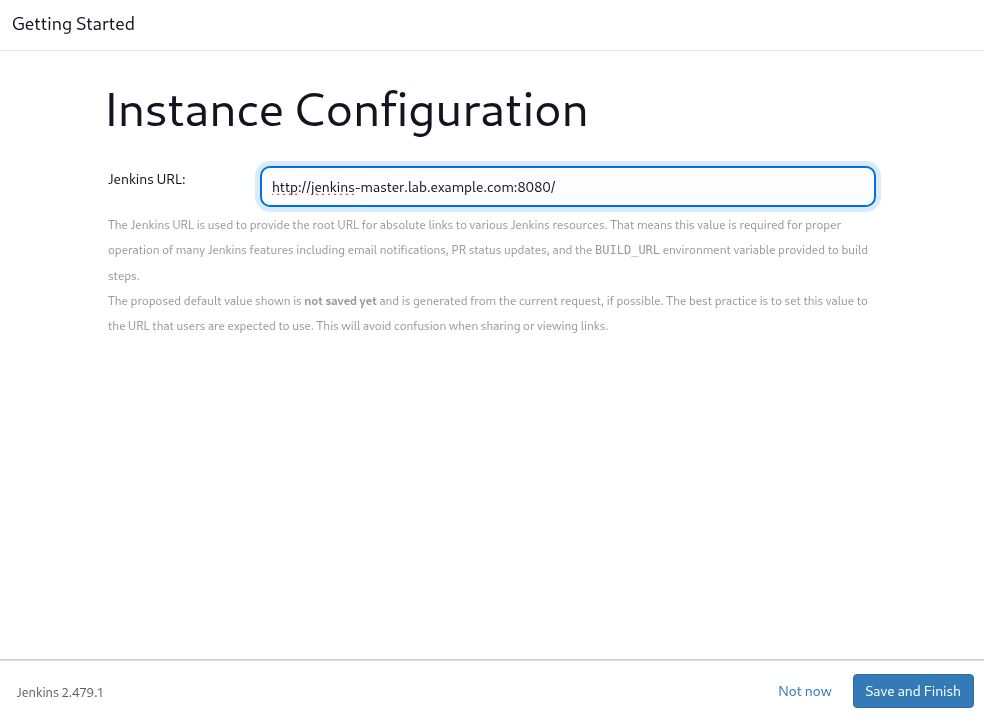</center>

  <center>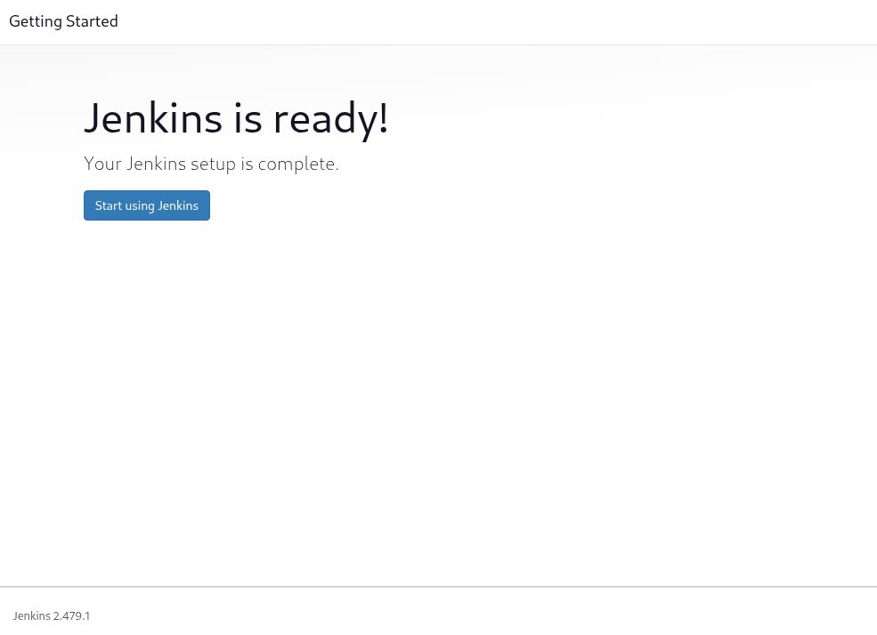</center>

- 访问 Jenkins 的 Web UI 界面：

  <center>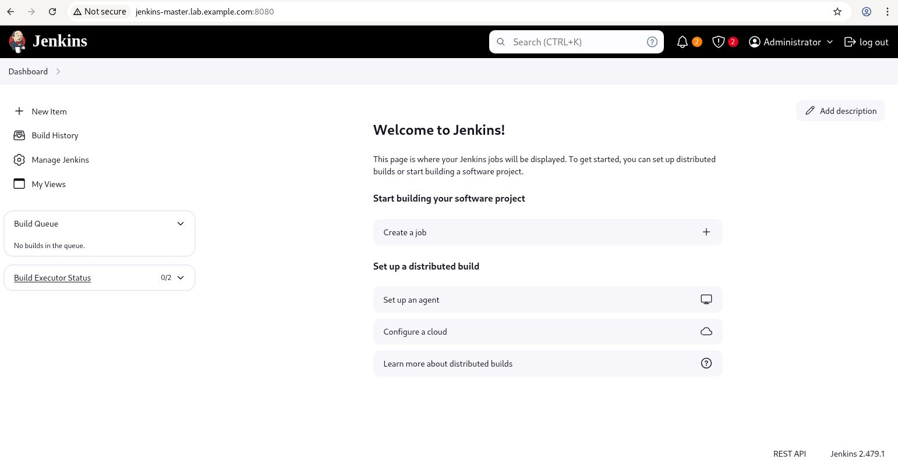</center>

  > 再次提示：由于国内网络问题，经常造成插件下载超时而导致安装失败，因此，可参考以下 “Jenkins 的插件设置” 部分解决此问题。

## 4. Jenkins 的插件设置

- Jenkins 最大的优势在于具有众多的 **插件**（plugin），实际工作的是插件。
- Jenkins 使用插件的源位于 [jenkins.io](https://updates.jenkins.io/update-center.json) 官方站点，下载更新速度很慢，时常由于连接超时问题而导致插件安装失败，因此，可更换为国内的插件源。
- Jenkins 更换插件源：
  - `Dashboard` > `Manage Jenkins` > `Plugins` > `Advanced settings`
  - [华为云的插件源](https://mirrors.huaweicloud.com/jenkins/updates/update-center.json)：

    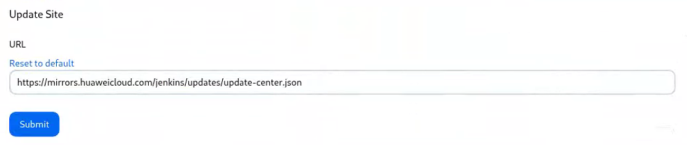

    > 注意：清华与阿里云的插件源是 Jenkins 官方的镜像同步，在这两个源中已不存在 updates 目录而无法再同步！

## 5. 参考链接

- [什么是 CI/CD？| RedHat](https://www.redhat.com/zh/topics/devops/what-is-ci-cd#)
