# Jenkins 的 CI/CD 之旅 —— Nexus3 的部署与常规设置

## 文档说明

- OS 版本：Red Hat Enterprise Linux release 9.0 (Plow)
- Nexus 版本：Nexus 3.9.0

## 文档目录

- [1. 容器化部署 Nexus3](#1-容器化部署-nexus3)
- [2. 创建 Nexus3 用户](#2-创建-nexus3-用户)
- [3. Nexus3 仓库类型的说明](#3-nexus3-仓库类型的说明)
- [4. 容器镜像仓库](#4-容器镜像仓库)
  - [4.1 创建 docker (hosted) 类型的容器镜像仓库](41-创建-docker-hosted-类型的容器镜像仓库)
  - [4.2 登录仓库与推送镜像](#42-登录仓库与推送镜像)
- [5. npm 构件库](#5-npm-构件库)
  - [5.1 创建 npm (proxy) 类型构件库](#51-创建-npm-proxy-类型构件库)
  - [5.2 测试 npm (proxy) 类型构件库](#52-测试-npm-proxy-类型构件库)
    - [5.2.1 生成登录 Nexus3 的用户名与密码的 base64 编码](#521-生成登录-nexus3-的用户名与密码的-base64-编码)
    - [5.2.2 编辑 .npmrc 文件](#522-编辑-npmrc-文件)
    - [5.2.3 安装构建用依赖模块测试 npm-proxy 构件库](#523-安装构建用依赖模块测试-npm-proxy-构件库)
    - [5.2.4 pnpm 构建应用](#524-pnpm-构建应用)
    - [5.2.5 pnpm 本地运行测试应用](#525-pnpm-本地运行测试应用)
  - [5.3 创建 npm (hosted) 类型构件库](#53-创建-npm-hosted-类型构件库)
  - [5.4 测试 npm (hosted) 类型构件库](#54-测试-npm-hosted-类型构件库)
    - [5.4.1 .npmrc 文件添加 npm-hosted 构件库认证](#541-npmrc-文件添加-npm-hosted-构件库认证)
    - [5.4.2 推送应用构件至 npm-hosted 构件库](#542-推送应用构件至-npm-hosted-构件库)
- [6. 参考链接](#6-参考链接)

## 1. 容器化部署 Nexus3

本文使用容器化方式部署 Nexus3，以便为迁移 Nexus3 至 Kubernetes 或 OpenShift 等云原生环境中做准备。

```bash
$ sudo mkdir /opt/nexus-data
$ sudo chmod -R 0777 /opt/nexus-data
$ sudo podman pull docker.io/sonatype/nexus3:3.9.0
# 若无法拉取以上镜像，可使用 quay.io/alberthua/nexus3:3.9.0 代替，此镜像为以上镜像的同步，两者完全相同。
# 可选步骤：$ podman pull quay.io/alberthua/nexus3:3.9.0
$ sudo podman run \
    --detach \
    --restart always \
    --hostname nexus3.lab.example.com \
    --name nexus3 \
    --publish 8881:8081 --publish 8882:8082 --publish 8883:8083 \
    --volume /opt/nexus-data:/nexus-data:Z \
    --memory 4096m \
    docker.io/sonatype/nexus3:3.9.0
# 宿主机对外暴露的端口根据实际情况而定
# 此处 8881 端口用于访问 Nexus3 管理页面，8882 端口用于暴露 docker-hosted 类型的容器镜像仓库，8883 端口待定。
```

访问 Nexus3 容器所在主机 nexus3.lab.example.com:8881，以 `admin` 用户身份与默认密码 `admin123` 登录，刷新页面后可显示仓库管理按钮 📦 与设置按钮 ⚙。接下来可创建常规用户用于开发、测试与部署等，以及创建管理各类仓库。

<center>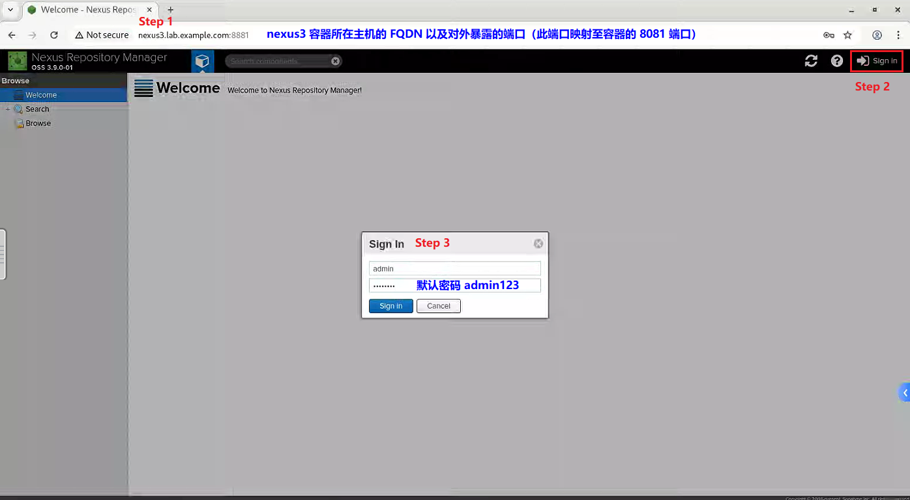</center>

<center>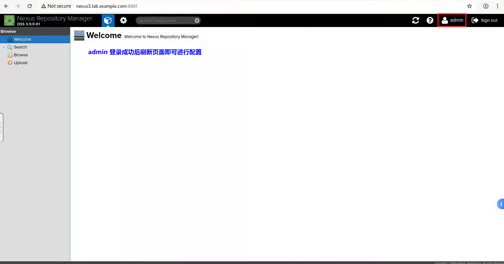</center>

## 2. 创建 Nexus3 用户

Nexus3 运行后即可创建用户以区别 admin 用户，用于日常开发、测试等使用，以下创建名为 devuser0 用户为例，并赋予管理员权限：

<center>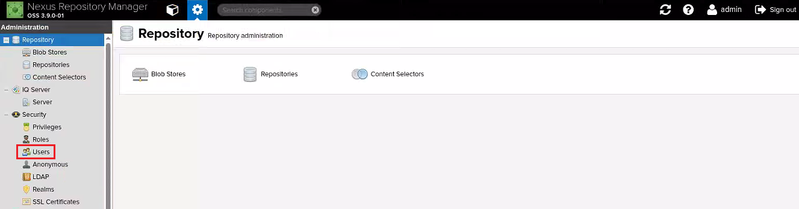</center>

<center>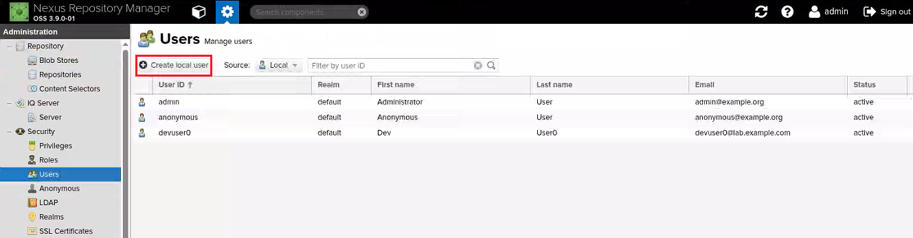</center>

<center>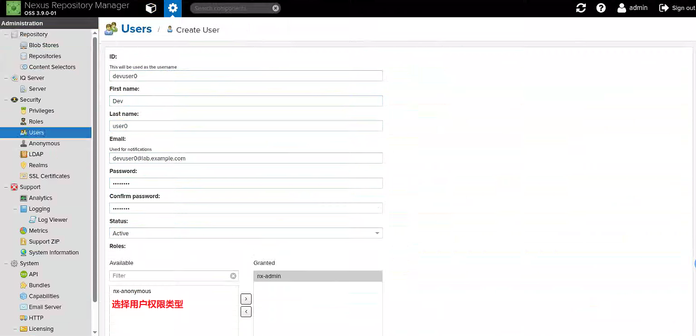</center>

## 3. Nexus3 仓库类型的说明

Nexus3 仓库（repository）类型分为三种类型：

- 代理仓库（Proxy）：用来代理公共的远程仓库，在本地持久化存储远程仓库下载的构件，当再次请求该构件时将从 Nexus 私服下载。
- 宿主仓库（Hosted）：通常宿主仓库在保存构件时分为以下 3 个常用类型

  | 宿主仓库类型 | 说明 |
  | ----- | ----- |
  | 3rd party | 保存第三方依赖的仓库。通常由内部人员下载之后再发布到 Nexus 。 |
  | releases | 保存内部发布的正式稳定版本。 |
  | snapshots | 保存内部发布的快照，为不稳定版本。 |

- 仓库组（Group）：管理多个仓库，客户端直接请求仓库组即可请求到组中的多个仓库。宿主仓库主要用于发布公司内部项目构建、第三方项目构件（如购买的商业构件），以及其他无法从公用仓库获取的构件。

## 4. 容器镜像仓库

### 4.1 创建 docker (hosted) 类型的容器镜像仓库

docker (hosted) 类型的容器镜像仓库用于存储第三方下载后推送的镜像，以及自定义构建的镜像。此处创建仓库后，推送 docker.io/library/registry:2 镜像，验证此仓库是否可正常提供服务。如下所示：

<center>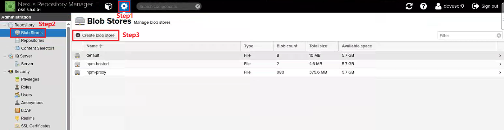</center>

<center>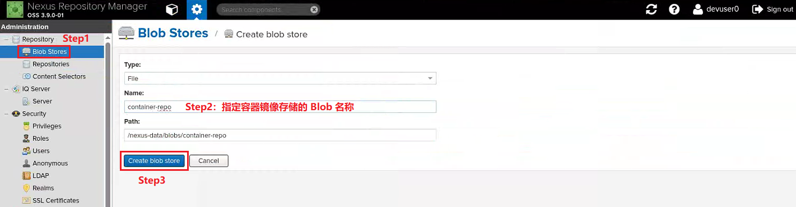</center>

<center>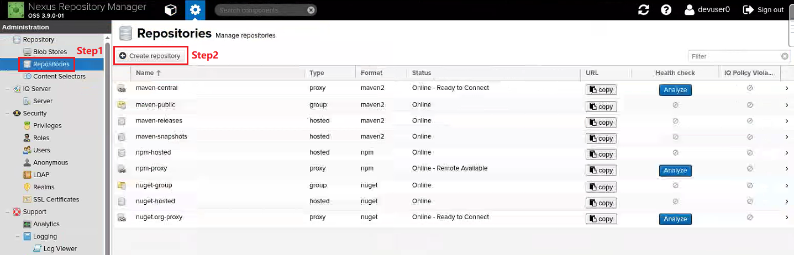</center>

<center>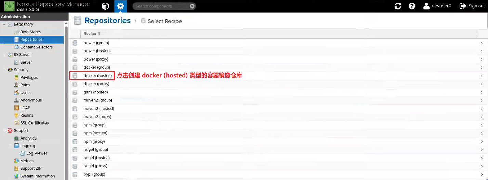</center>

<center>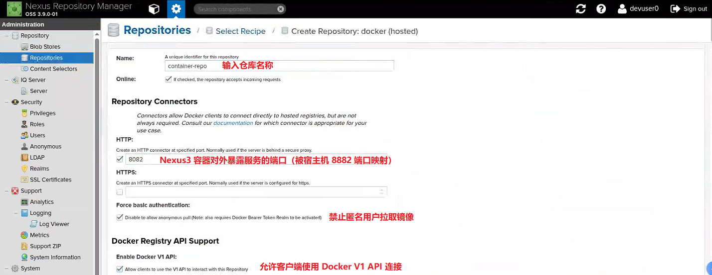</center>

<center>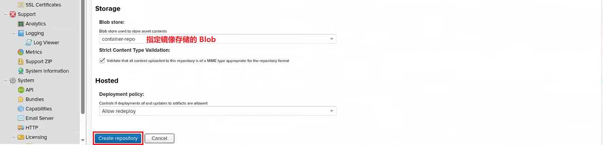</center>

### 4.2 登录仓库与推送镜像

podman 登录以上创建的仓库默认使用 SSL 认证，若本地未设置 SSL 证书将认证失败而无法登录。报错如下：

```bash
$ podman login nexus3.lab.example.com:8882
Authenticating with existing credentials for nexus3.lab.example.com:8882
Existing credentials are invalid, please enter valid username and password
Username (devuser0): devuser0
Password:
Error: authenticating creds for "nexus3.lab.example.com:8882": pinging container registry nexus3.lab.example.com:8882: Get "https://nexus3.lab.example.com:8882/v2/": EOF
# 报错提示 SSL 认证证书问题
```

根据 Nexus3 容器启动的端口映射可知，访问容器所在的宿主机端口 8882 即可访问容器镜像服务。

```bash
$ podman login --tls-verify=false nexus3.lab.example.com:8882
Username: devuser0  #以上 Nexus3 中创建的常规用户
Password:    #该用户的密码
Login Succeeded!
# 成功登录仓库
```

Nexus3 中的容器镜像存储在扁平化的空间中，镜像不从属于用户或组织，而是直接进行管理。因此，在为容器镜像设置标签时，可遵循以下方式，此处以 `docker.io/library/registry:2` 为例：

```bash
$ podman tag docker.io/library/registry:2 nexus3.lab.example.com:8882/registry:2
$ podman push --tls-verify=false nexus3.lab.example.com:8882/registry:2
Getting image source signatures
Copying blob 3dc78a2f4e56 skipped: already exists
Copying blob 1a0007403c9e skipped: already exists
Copying blob 11d475ff1a07 skipped: already exists
Copying blob 8d881b642817 skipped: already exists
Copying blob 0fcc9ad4e206 skipped: already exists
Copying config 26b2eb0361 done
Writing manifest to image destination
```

容器镜像推送完成后，Nexus3 中将显示此镜像：

<center>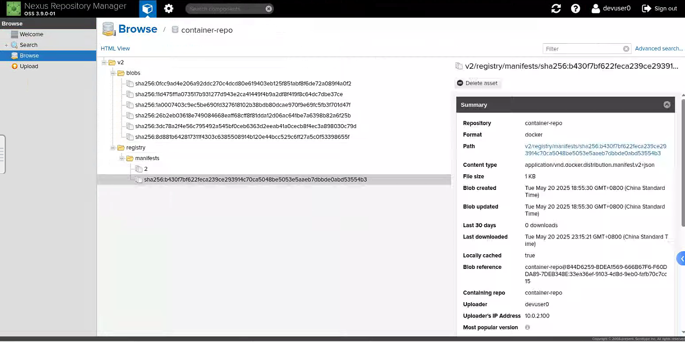</center>

## 5. npm 构件库

### 5.1 创建 npm (proxy) 类型构件库

应用目录的 `.npmrc` 文件或 `$HOME/.npmrc` 文件中定义了此类仓库的地址的话，那么使用 `pnpm install` 或 `npm install` 安装应用依赖的模块时，将从此类仓库中下载安装，但仓库内不存在对应模块的话，仓库将从定义的上游仓库中（本例使用淘宝的 npm 仓库）拉取下载模块至仓库中，再提供给应用。因此，若其他应用使用相同的的模块，此类仓库可直接提供而无需再从上游仓库中下载。

<center>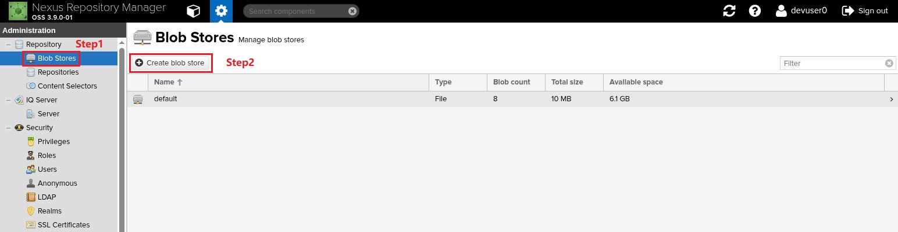</center>

<center>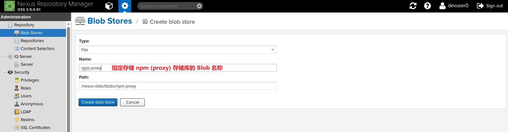</center>

<center>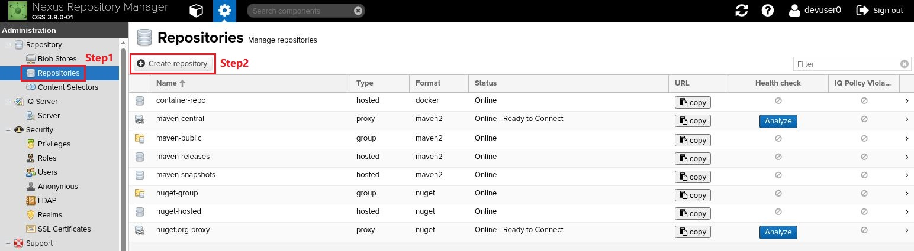</center>

<center>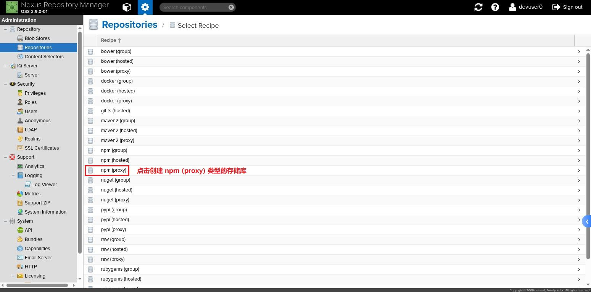</center>

<center>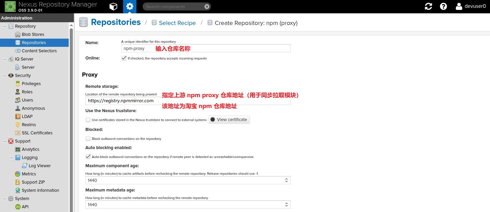</center>

<center>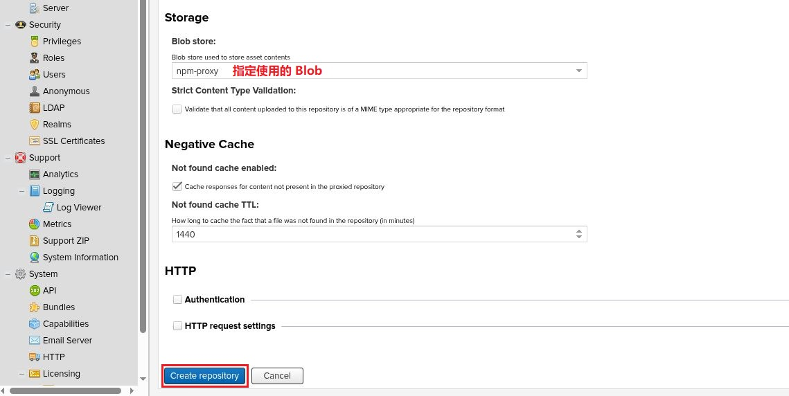</center>

### 5.2 测试 npm (proxy) 类型构件库

以上类型的构件库创建完成后，对其进行测试。本例中使用 Node.js 项目 [etherpad-lite](https://github.com/ether/etherpad-lite) 完成模块的安装与应用构建发布，并将应用的构件推送至 `npm (hosted)` 类型的仓库中。

#### 5.2.1 生成登录 Nexus3 的用户名与密码的 base64 编码

此处使用以上步骤中创建的 devuser0 用户以及密码

```bash
### 方法1
[devops@serverb etherpad-lite]$ echo -n "devuser0:1qazZSE$" | base64
ZGV2dXNlcjA6MXFhelpTRSQ=

### 方法2
[devops@serverb etherpad-lite]$ echo -n "devuser0:1qazZSE$" | openssl base64
ZGV2dXNlcjA6MXFhelpTRSQ=
```

#### 5.2.2 编辑 .npmrc 文件

编辑 `$HOME/.npmrc` 文件，定义 npm (proxy) 类型仓库的地址与认证用户的 base64 编码。此类仓库地址可通过以下方法获取：

<center>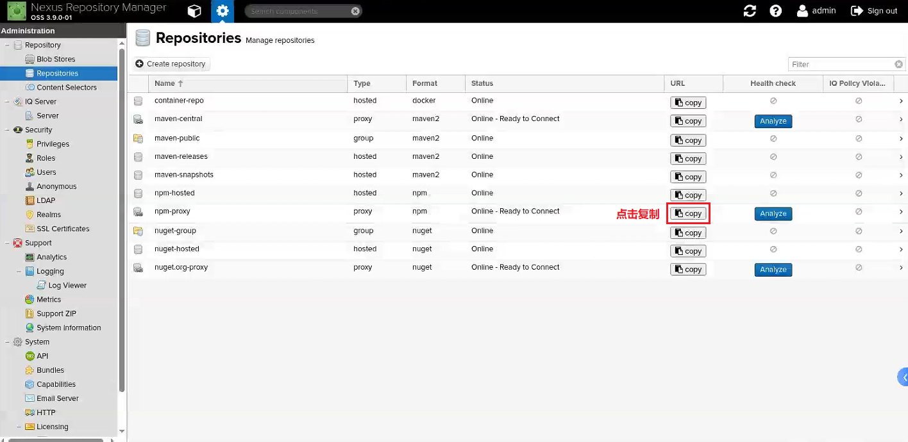</center>

<center>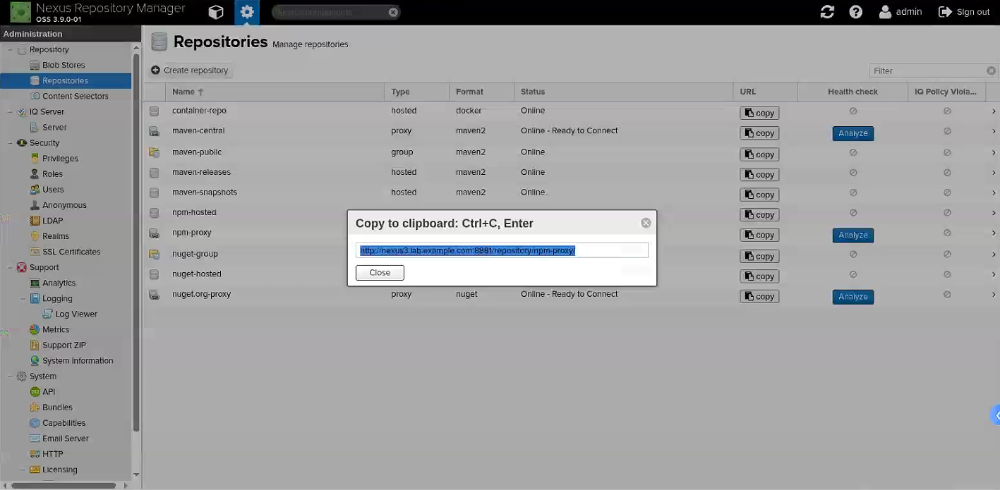</center>

```bash
[devops@serverb etherpad-lite]$ vim ~/.npmrc
registry=http://nexus3.lab.example.com:8881/repository/npm-proxy/  #指定 npm-proxy 构件库
always-auth=true  #总是启用登录认证
//nexus3.lab.example.com:8881/repository/npm-proxy/:_auth="ZGV2dXNlcjA6MXFhelpTRSQ="  #登录 npm-proxy 构件库认证
```

#### 5.2.3 安装构建用依赖模块测试 npm-proxy 构件库

使用 pnpm 连接此构件库，并安装模块至当前项目的 `node_modules/` 目录中。关于 pnpm 的安装可参考 [Node.js 之 npm 常用方法]()。

```bash
[devops@serverb etherpad-lite]$ pnpm install
Scope: all 6 workspace projects
 WARN  Ignoring broken lockfile at /home/devops/etherpad-lite: Lockfile /home/devops/etherpad-lite/pnpm-lock.yaml not compatible with current pnpm
 WARN  3 deprecated subdependencies found: lodash.get@4.4.2, node-domexception@1.0.0, superagent@8.1.2
Packages: +965
+++++++++++++++++++++++++++++++++++++++++++++++++++++++++++++++++++++++++++++++++++++++++++++++++++++++++++++++++++++++++++++++++++++++++++++++++++
Progress: resolved 1071, reused 959, downloaded 11, added 965, done
node_modules/.pnpm/@scarf+scarf@1.4.0/node_modules/@scarf/scarf: Running postinstall script, done in 3s
node_modules/.pnpm/@swc+core@1.11.24/node_modules/@swc/core: Running postinstall script, done in 223ms
node_modules/.pnpm/esbuild@0.25.4/node_modules/esbuild: Running postinstall script, done in 227ms
node_modules/.pnpm/esbuild@0.21.5/node_modules/esbuild: Running postinstall script, done in 236ms
node_modules/.pnpm/unrs-resolver@1.7.2/node_modules/unrs-resolver: Running postinstall script, done in 68ms

dependencies:
+ ep_etherpad-lite 2.3.0 <- src

devDependencies:
+ admin 2.3.0 <- admin
+ docs <- doc
+ ui 0.0.0 <- ui

 WARN  Issues with peer dependencies found
doc
└─┬ vitepress 1.6.3
  └─┬ @docsearch/js 3.8.2
    └─┬ @docsearch/react 3.8.2
      ├── ✕ missing peer search-insights@">= 1 < 3"
      ├─┬ @algolia/autocomplete-core 1.17.7
      │ └─┬ @algolia/autocomplete-plugin-algolia-insights 1.17.7
      │   ├── ✕ missing peer search-insights@">= 1 < 3"
      │   └─┬ @algolia/autocomplete-shared 1.17.7
      │     └── ✕ missing peer @algolia/client-search@">= 4.9.1 < 6"
      └─┬ @algolia/autocomplete-preset-algolia 1.17.7
        └── ✕ missing peer @algolia/client-search@">= 4.9.1 < 6"
Peer dependencies that should be installed:
  @algolia/client-search@">=4.9.1 <6.0.0-0"  search-insights@">=1.0.0 <3.0.0-0"

src
└─┬ eslint-config-etherpad 4.0.4
  ├─┬ @typescript-eslint/eslint-plugin 7.18.0
  │ ├── ✕ unmet peer eslint@^8.56.0: found 9.27.0
  │ └─┬ @typescript-eslint/type-utils 7.18.0
  │   ├── ✕ unmet peer eslint@^8.56.0: found 9.27.0
  │   └─┬ @typescript-eslint/utils 7.18.0
  │     └── ✕ unmet peer eslint@^8.56.0: found 9.27.0
  └─┬ @typescript-eslint/parser 7.18.0
    └── ✕ unmet peer eslint@^8.56.0: found 9.27.0

Done in 1m 21.9s
```

验证 npm-proxy 构件库中是否同步依赖的模块：

<center>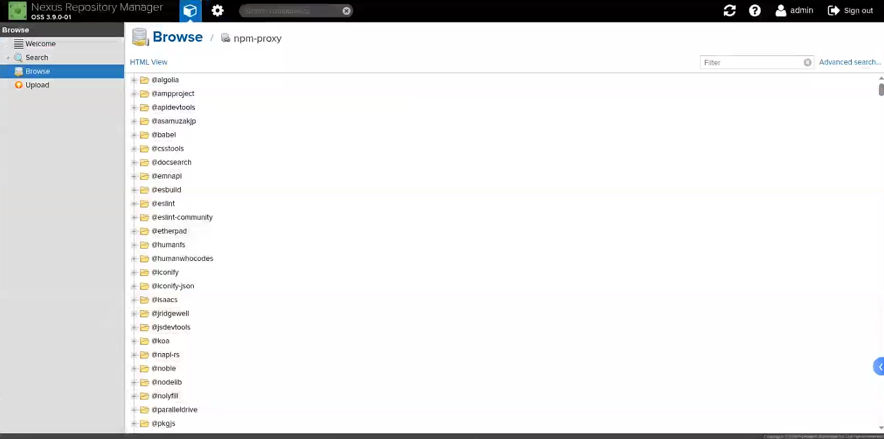</center>

#### 5.2.4 pnpm 构建应用

```bash
[devops@serverb etherpad-lite]$ pnpm run build:etherpad  #根据 package.json 中的脚本定义构建

> etherpad@2.3.0 build:etherpad /home/devops/etherpad-lite
> pnpm --filter admin run build-copy && pnpm --filter ui run build-copy


> admin@2.3.0 build-copy /home/devops/etherpad-lite/admin
> tsc && vite build --outDir ../src/templates/admin --emptyOutDir

vite v6.3.5 building for production...
✓ 1742 modules transformed.
../src/templates/admin/index.html                   0.49 kB │ gzip:   0.31 kB
../src/templates/admin/assets/index-BSQTLHmC.css   10.89 kB │ gzip:   3.19 kB
../src/templates/admin/assets/index-CmBU3i6n.js   479.31 kB │ gzip: 154.07 kB
[vite-plugin-static-copy] Copied 1 items.
✓ built in 7.58s

> ui@0.0.0 build-copy /home/devops/etherpad-lite/ui
> tsc && vite build --outDir ../src/static/oidc --emptyOutDir

vite v6.3.5 building for production...
✓ 6 modules transformed.
../src/static/oidc/consent.html               1.01 kB │ gzip: 0.49 kB
../src/static/oidc/login.html                 2.60 kB │ gzip: 1.03 kB
../src/static/oidc/assets/style-CLgJS82q.css  1.58 kB │ gzip: 0.75 kB
../src/static/oidc/assets/main-BcSxKxdW.js    0.15 kB │ gzip: 0.15 kB
../src/static/oidc/assets/style-CNP0ENT6.js   0.71 kB │ gzip: 0.40 kB
../src/static/oidc/assets/nested-DhUhjXU9.js  1.06 kB │ gzip: 0.53 kB
✓ built in 164ms
```

#### 5.2.5 pnpm 本地运行测试应用

```bash
[devops@serverb etherpad-lite]$ pnpm run prod  #应用监听 9001 端口

> etherpad@2.3.0 prod /home/devops/etherpad-lite
> pnpm --filter ep_etherpad-lite run prod


> ep_etherpad-lite@2.3.0 prod /home/devops/etherpad-lite/src
> cross-env NODE_ENV=production node --require tsx/cjs node/server.ts

[2025-05-20T04:09:56.484] [INFO] settings - All relative paths will be interpreted relative to the identified Etherpad base dir: /home/devops/etherpad-lite
[2025-05-20T04:09:56.487] [WARN] settings - No settings file found in /home/devops/etherpad-lite/settings.json. Continuing using defaults!
[2025-05-20T04:09:56.487] [INFO] settings - No credentials file found in /home/devops/etherpad-lite/credentials.json. Ignoring.
[2025-05-20T04:09:56.488] [WARN] settings - loglevel: INFO
[2025-05-20T04:09:56.488] [WARN] settings - logLayoutType: colored
[2025-05-20T04:09:56.489] [WARN] settings - No "skinName" parameter found. Please check out settings.json.template and update your settings.json. Falling back to the default "colibris".
[2025-05-20T04:09:56.492] [INFO] settings - Using skin "colibris" in dir: /home/devops/etherpad-lite/src/static/skins/colibris
[2025-05-20T04:09:56.492] [WARN] settings - File location: /home/devops/etherpad-lite/var/rusty.db
[2025-05-20T04:09:56.493] [INFO] settings - Random string used for versioning assets: d674b503
[2025-05-20T04:09:57.660] [INFO] server - Starting Etherpad...
[2025-05-20T04:09:57.714] [INFO] plugins - check installed plugins for migration
[2025-05-20T04:09:57.717] [INFO] plugins - start migration of plugins in node_modules
[2025-05-20T04:09:57.726] [INFO] plugins - pnpm --version: 8.15.9
[2025-05-20T04:09:58.470] [INFO] plugins - Loading plugin ep_etherpad-lite...
[2025-05-20T04:09:58.471] [INFO] plugins - Loaded 1 plugins
[2025-05-20T04:10:00.538] [INFO] server - Installed plugins:
[2025-05-20T04:10:00.540] [INFO] settings - Report bugs at https://github.com/ether/etherpad-lite/issues
[2025-05-20T04:10:00.543] [INFO] settings - Your Etherpad version is 2.3.0 (3a9e126)
[2025-05-20T04:10:03.813] [INFO] http - HTTP server listening for connections
[2025-05-20T04:10:03.813] [INFO] settings - You can access your Etherpad instance at http://0.0.0.0:9001/
[2025-05-20T04:10:03.814] [WARN] settings - Admin username and password not set in settings.json. To access admin please uncomment and edit "users" in settings.json
[2025-05-20T04:10:03.814] [INFO] server - Etherpad is running
...
```

### 5.3 创建 npm (hosted) 类型构件库

此类构件库与 npm (proxy) 类型构件库创建方法类似，先创建 Blob 再创建 npm (hosted)。

<center>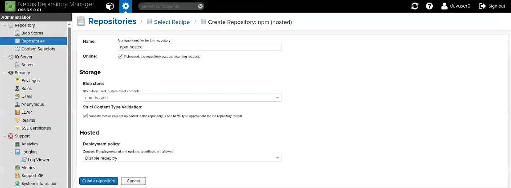</center>

### 5.4 测试 npm (hosted) 类型构件库

#### 5.4.1 .npmrc 文件添加 npm-hosted 构件库认证

```bashrc
[devops@serverb etherpad-lite]$ vim ~/.npmrc
...
//nexus3.lab.example.com:8881/repository/npm-hosted/:_auth="ZGV2dXNlcjA6MXFhelpTRSQ="
#登录 npm-hosted 构件库认证（用于推送构建的应用）
```

#### 5.4.2 推送应用构件至 npm-hosted 构件库

```bash
[devops@serverb etherpad-lite]$ npm publish --registry=http://nexus3.lab.example.com:8881/repository/npm-hosted/
npm warn package-json etherpad@2.3.0 No bin file found at bin/etherpad-healthcheck
npm warn package-json etherpad@2.3.0 No bin file found at bin/etherpad-healthcheck
npm warn package-json etherpad@2.3.0 No bin file found at bin/etherpad-healthcheck
npm warn publish npm auto-corrected some errors in your package.json when publishing.  Please run "npm pkg fix" to address these errors.
npm warn publish errors corrected:
npm warn publish "repository.url" was normalized to "git+https://github.com/ether/etherpad-lite.git"
npm warn package-json etherpad@2.3.0 No bin file found at bin/etherpad-healthcheck
npm notice
npm notice 📦  etherpad@2.3.0
npm notice Tarball Contents
npm notice 515B .dockerignore
npm notice 292B .editorconfig
npm notice 703B .env.default
npm notice 765B .env.dev.default
npm notice 19B .gitattributes
npm notice 480B .github/dependabot.yml
npm notice 61B .github/FUNDING.yml
npm notice 1.2kB .github/ISSUE_TEMPLATE/bug_report.md
npm notice 845B .github/ISSUE_TEMPLATE/feature_request.md
npm notice 740B .github/ISSUE_TEMPLATE/plugin-request-template.md
...
npm notice Tarball Details
npm notice name: etherpad
npm notice version: 2.3.0
npm notice filename: etherpad-2.3.0.tgz
npm notice package size: 4.8 MB
npm notice unpacked size: 9.0 MB
npm notice shasum: 676d9f5417e6dbb3d2441d3f21a4309ae48b31e4
npm notice integrity: sha512-jmT7WUePc9nxR[...]kMmiw7t+3kZFQ==
npm notice total files: 782
npm notice
npm notice Publishing to http://nexus3.lab.example.com:8881/repository/npm-hosted/ with tag latest and default access
+ etherpad@2.3.0
```

验证 npm-hosted 构件库：

<center>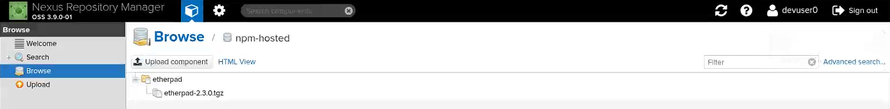</center>

## 6. 参考链接

- ❤ [Sonatype Nexus Repository | Documentation](https://help.sonatype.com/en/sonatype-nexus-repository.html)
- [sonatype/nexus | DockerHub](https://hub.docker.com/r/sonatype/nexus)
