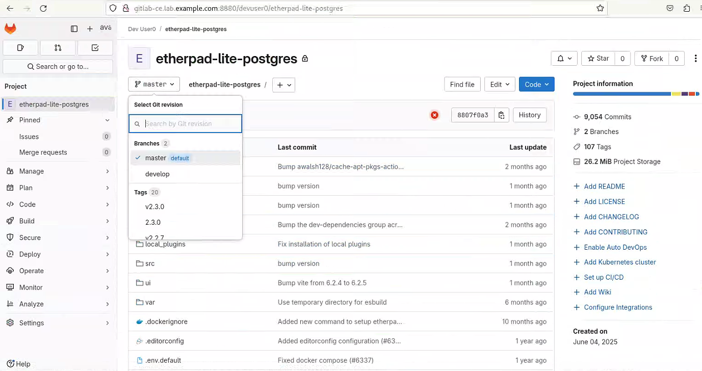
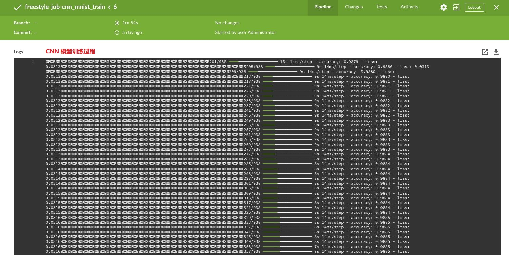

# 🧪 基于 Ansible Navigator 部署管理分布式 Jenkins CI/CD 平台 —— 构建发布 Node.js、Flask 与 Golang 应用

## 文档说明

- ✍ 本文档使用 Ansible Navigator 自动化部署 Jenkins 分布式构建平台（Master+Agent），并发布 Java、Node.js、Flask 与 Golang 应用。
- 📚 文档项目源代码：[jenkins-ci-plt | GitHub](https://github.com/Alberthua-Perl/ansible-demo/tree/master/jenkins-ci-plt)

## 文档目录

- [0. Lab 环境架构与实现](#0-lab-环境架构与实现)
- [1. Lab 相关用户名与登录密码](#1-lab-相关用户名与登录密码)
- [2. Foundation 中设置节点资源](#2-foundation-中设置节点资源)
  - [2.1 调整虚拟机计算资源](#21-调整虚拟机计算资源)
  - [2.2 配置 classroom 可实现外网连接](#22-配置-classroom-可实现外网连接)
  - [2.3 创建与附加 raw 磁盘镜像](#23-创建与附加-raw-磁盘镜像)
- [3. 注意 Ansible 清单文件中的 ansible 变量 ansible_host](#3-注意-ansible-清单文件中的-ansible-变量-ansible_host)
- [4. 生成 devops 用户 SSH 公私钥并实现各节点免密登录](#4-生成-devops-用户-ssh-公私钥并实现各节点免密登录)
- [5. 部署与设置 GitLab-CE 容器](#5-部署与设置-gitlab-ce-容器)
  - [5.1 安装 Ansible 内容集合（collection）](#51-安装-ansible-内容集合collection)
  - [5.2 部署 GitLab-CE 容器](#52-部署-gitlab-ce-容器)
  - [5.3 重置 GitLab-CE 的 root 密码](#53-重置-gitlab-ce-的-root-密码)
  - [5.4 创建与批准 GitLab-CE 的 devuser0 开发者用户](#54-创建与批准-gitlab-ce-的-devuser0-开发者用户)
  - [5.5 Node.js 应用导入](#55-nodejs-应用导入)
    - [5.5.1 创建新项目 etherpad-lite-postgres](#551-创建新项目-etherpad-lite-postgres)
    - [5.5.2 导入 etherpad-lite-postgres 外部代码库](#552-导入-etherpad-lite-postgres-外部代码库)
  - [5.6 Flask 应用导入](#56-flask-应用导入)
    - [5.6.1 创建新项目 cnn_mnist_train](#561-创建新项目-cnn_mnist_train)
    - [5.6.2 导入 cnn_mnist_train 外部代码库](#562-导入-cnn_mnist_train-外部代码库)
- [6. 部署与设置 Nexus3 容器](#6-部署与设置-nexus3-容器)
  - [6.1 部署 Nexus3 容器](#61-部署-nexus3-容器)
  - [6.2 创建 Nexus3 的 devuser0 用户](#62-创建-nexus3-的-devuser0-用户)
  - [6.3 创建 Nexus3 的容器镜像仓库（hosted 类型）](#63-创建-nexus3-的容器镜像仓库hosted-类型)
  - [6.4 创建 Nexus3 的 npm 构建仓库（proxy 类型）](#64-创建-nexus3-的-npm-构建仓库proxy-类型)
- [7. 部署应用运行及构建环境](#7-部署应用运行及构建环境)
  - [7.1 Node.js 运行环境](#71-nodejs-运行环境)
- [8. 部署与设置 PostgreSQL 数据库](#8-部署与设置-postgresql-数据库)
  - [8.1 安装部署 PostgreSQL 数据库](#81-安装部署-postgresql-数据库)
  - [8.2 数据库服务器中创建 etherpad-lite 应用相关用户与数据库](#82-数据库服务器中创建-etherpad-lite-应用相关用户与数据库)
- [9. 部署 Jenkins Master 服务](#9-部署-jenkins-master-服务)
- [10. 运行自由风格的作业（Free Style Project）](#10-运行自由风格的作业free-style-project)
  - [10.1 Node.js 应用 —— 构建测试 etherpad-lite 应用及容器镜像](#101-nodejs-应用--构建测试-etherpad-lite-应用及容器镜像)
    - [10.1.1 创建基于 SSH 私钥的凭据连接 GitLab-CE](#1011-创建基于-ssh-私钥的凭据连接-gitlab-ce)
    - [10.1.2 安装 Jenkins 的 Blue Ocean 插件](#1012-安装-jenkins-的-blue-ocean-插件)
    - [10.1.3 jenkins 用户的 SSH 连接代码库的主机密钥校验与配置](#1013-jenkins-用户的-ssh-连接代码库的主机密钥校验与配置)
    - [10.1.4 设置 jenkins 用户的 subuid/subgid 以满足 podman 的 rootless 构建环境](#1014-设置-jenkins-用户的-subuidsubgid-以满足-podman-的-rootless-构建环境)
    - [10.1.5 构建与推送 node-pnpm 容器镜像](#1015-构建与推送-node-pnpm-容器镜像)
    - [10.1.6 创建与运行作业](#1016-创建与运行作业)
  - [10.2 Flask 应用 —— 训练 CNN 模型、构建 app-tf-flask 应用及推理容器镜像](#102-flask-应用--训练-cnn-模型构建-app-tf-flask-应用及推理容器镜像)
    - [10.2.1 推送 tf-flask 构建用容器镜像](#1021-推送-tf-flask-构建用容器镜像)
    - [10.2.2 安装 AnsiColor 插件](#1022-安装-ansicolor-插件)
    - [10.2.3 创建与运行作业](#1023-创建与运行作业)
- [附录A. PostgreSQL 常用命令](#附录a-postgresql-常用命令)
  - [A.1 登录数据库](#a1-登录数据库)
  - [A.2 更新数据库管理员 postgres 密码](#a2-更新数据库管理员-postgres-密码)
  - [A.3 用户（角色）与数据库操作](#a3-用户角色与数据库操作)
  - [A.4 psql 常用的元命令](#a4-psql-常用的元命令)
- [参考链接](#参考链接)

## 0. Lab 环境架构与实现


## 1. Lab 相关用户名与登录密码

| 节点角色 | 管理员用户 | 管理员密码 | 普通用户 | 普通用户密码 |
| ----- | ----- | ----- | ----- | ----- |
| GitLab CE | root | 1qazZSE$ | devuser0 | 1qazZSE$ |
| Nexus3 | admin | admin123 | devuser0 | 1qazZSE$ |
| Jenkins Master | admin | 1qazZSE$ | devuser0 | 1qazZSE$ |
| RedHat AAP2.2 | admin | redhat | NA | NA |

## 2. Foundation 中设置节点资源

### 2.1 调整虚拟机计算资源

- 本实验使用 RedHat RH294v9.0 实验环境，各节点的资源调整如下：

  > 说明：如果读者具有相应的计算与存储资源也可根据以下资源需求构建自定义实验环境。

  | 主机名 | 主机别名 | IPv4 | vCPU | 内存 | 节点角色 |
  | ----- | ----- | ----- | ----- | ----- | ----- |
  | foundation0.ilt.example.com | NA | 172.25.254.250 | 8 | 48 | 虚拟机宿主机 & 应用部署 |
  | workstation.lab.example.com | gitlab-ce.lab.example.com | 172.25.250.9 | 8 | 6 | GitLab CE 容器 |
  | servera.lab.example.com | jenkins-master.lab.example.com | 172.25.250.10 | 4 | 4 | Jenkins Master 节点 |
  | serverb.lab.example.com | jenkins-agent0.lab.example.com | 172.25.250.11 | 4 | 4 | Jenkins Agent 节点 |
  | serverc.lab.example.com | jenkins-agent1.lab.example.com | 172.25.250.12 | 4 | 4 | Jenkins Agent 节点 |
  | serverd.lab.example.com | nexus3.lab.example.com | 172.25.250.13 | 4 | 6 | Nexus3 容器 & PostgreSQL 数据库 |

  > 💥 注意：servera，serverb，serverc，serverd 节点的 qcow2 磁盘镜像由于存储容量的限制在 Jenkins CI 流程中无法满足需求，因此，在本实验环境中进行了重新构建。workstation 节点需根据 2.3 添加新磁盘以满足存储需求。

- 调整每个节点的 vCPU 与内存直接通过在 foundation0 节点上运行以下命令完成：

  ```bash
  [kiosk@foundation0 ~]$ su -  #密码：Asimov
  [root@foundation0 ~]# virsh edit <domain_name>
  ```

### 2.2 配置 classroom 可实现外网连接

```bash
[kiosk@foundation0 ~]$ wget http://content.example.com/jenkins-ci-plt/00-set_classroom_extnet
[kiosk@foundation0 ~]$ ./set_classroom_extnet
```

### 2.3 创建与附加 raw 磁盘镜像

workstation 节点用作 GitLab-CE 运行节点需要更多的计算资源与较大的存储空间用于存储配置、数据与日志，但由于 workstation 节点的存储空间有限，因此，需要创建额外的 raw 格式磁盘镜像，并将其附加（attach）至此节点上，可参考以下步骤：

```bash
## 注意：
##   1. 为 foundation0 分配一个新磁盘 90G
##   2. 将此磁盘创建为逻辑卷并挂载 /mnt/vmdisk，此目录用于存储 workstation 的额外存储。
[root@foundation0 ~]# cd /mnt/vmdisk  #切换至已挂载逻辑卷的目录中
[root@foundation0 vmdisk]# qemu-img create -f raw /mnt/vmdisk/workstation-vdb-10G.raw 10G
[root@foundation0 vmdisk]# chown qemu:qemu /mnt/vmdisk/workstation-vdb-10G.raw  #更改为 qemu 用户与用户组
[root@foundation0 vmdisk]# virsh attach-disk workstation --source /mnt/vmdisk/workstation-vdb-10G.raw --target vdb --persistent --cache none  #--persistent 选项：持久化添加 vdb 磁盘（否则关机后将自动删除此磁盘）

## 登录 devops@workstation 执行
[devops@workstation ~]$ sudo pvcreate /dev/vdb
[devops@workstation ~]$ sudo vgcreate vgscmdata /dev/vdb
[devops@workstation ~]$ sudo lvcreate -l+100%FREE vgscmdata -n lvscmdata
[devops@workstation ~]$ sudo mkfs.xfs /dev/mapper/vgscmdata-lvscmdata
[devops@workstation ~]$ sudo mkdir /home/devops/middleware
[devops@workstation ~]$ sudo vim /etc/fstab
...
/dev/mapper/vgscmdata-lvscmdata  /home/devops/middleware  xfs  defaults  0 0
...
[devops@workstation ~]$ sudo systemctl daemon-reload
[devops@workstation ~]$ sudo mount -a
[devops@workstation ~]$ sudo mkdir -p /home/devops/middleware/gitlab-ce/{data,config,logs}
[devops@workstation ~]$ sudo chown -R devops:devops /home/devops/middleware
[devops@workstation ~]$ sudo chmod -R 0777 /home/devops/middleware
[devops@workstation ~]$ tree /home/devops/middleware
/home/devops/middleware/
└── gitlab-ce
    ├── config
    ├── data
    └── logs
# 注意：以上 gitlab-ce 容器相关的映射目录创建后，在 ansible playbook 中无需再次创建！    
```

## 3. 注意 Ansible 清单文件中的 ansible 变量 ansible_host

- 在 `ini` 或 `yaml` 格式的主机清单文件中使用 `ansible_host` 变量：

  ```ini
  ...
  [master]
  jenkins-master.lab.example.com  ansible_host=servera.lab.example.com
  #inventory_hostname             #ansible_host
  ...
  ```

- Ansible 使用 `ansible_host` 变量指定的真实主机进行 SSH 连接, 而 `inventory_hostname` 变量仅仅在 Ansible 运行返回中显示。因此，需要将以上两个变量指定的>主机名称均写入 `/etc/hosts` 文件中完成主机名解析（笔者环境中使用），当然也可加入上游 DNS 服务器的解析文件中实现。

## 4. 生成 devops 用户 SSH 公私钥并实现各节点免密登录

```bash
[devops@workstation ~]$ ssh-keygen 
Generating public/private rsa key pair.
Enter file in which to save the key (/home/devops/.ssh/id_rsa): /home/devops/.ssh/devops-jenkins    
Created directory '/home/devops/.ssh'.
Enter passphrase (empty for no passphrase): 
Enter same passphrase again: 
Your identification has been saved in /home/devops/.ssh/devops-jenkins
Your public key has been saved in /home/devops/.ssh/devops-jenkins.pub
The key fingerprint is:
SHA256:SInrTKN4O8GL6m2fft4nWo8Bp3teHO2ArBalKC2wx3A devops@foundation0.ilt.example.com
The key's randomart image is:
+---[RSA 3072]----+
|                 |
|     . .         |
| o E. o  .       |
|  * .o..+ . .    |
| o =+o.+S+ o .   |
| .+=o.  * . +    |
|..ooo  + o o .   |
|..+o  o.+o=.     |
|+.ooo+o+++o.     |
+----[SHA256]-----+
# 生成 devops 用户 SSH 公私钥

[devops@workstation ~]$ ls -lh ~/.ssh
total 8.0K
-rw-------. 1 devops devops 2.6K May 27 11:19 devops-jenkins
-rw-r--r--. 1 devops devops  588 May 27 11:19 devops-jenkins.pub

[devops@workstation ~]$ for i in workstation.lab.example.com gitlab-ce.lab.example.com \
  servera.lab.example.com jenkins-master.lab.example.com \
  serverb.lab.example.com jenkins-agent0.lab.example.com \
  serverc.lab.example.com jenkins-agent1.lab.example.com \
  serverd.lab.example.com nexus3.lab.example.com \
  utility.lab.example.com; do ssh-copy-id -i ~/.ssh/devops-jenkins devops@$i; done
```

## 5. 部署与设置 GitLab-CE 容器

### 5.1 安装 Ansible 内容集合（collection）

```bash
[kiosk@foundation0 ~]$ ssh devops@workstation
[devops@workstation ~]$ eval $(ssh-agent)
[devops@workstation ~]$ ssh-add ~/.ssh/devops-jenkins
[devops@workstation ~]$ cd ~/jenkins-ci-plt
[devops@workstation jenkins-ci-plt]$ ansible-galaxy collection install -r collections/requirements.yml -p collections/
[devops@workstation jenkins-ci-plt]$ ansible-galaxy collection list
```

### 5.2 部署 GitLab-CE 容器

```bash
[devops@workstation jenkins-ci-plt]$ sh scm-artifact/deploy-prep.sh
# 部署容器前准备
## 可选命令：$ ansible-playbook --list-tags <playbook_name>.yml  #列举 playbook 中的 tag
[devops@workstation jenkins-ci-plt]$ podman login utility.lab.example.com  #login: admin/redhat
[devops@workstation jenkins-ci-plt]$ podman pull utility.lab.example.com/ansible-automation-platform-22/ee-supported-rhel8:latest
[devops@workstation jenkins-ci-plt]$ ansible-navigator run scm-artifact/prep-scm-nexus3.yml --tag gitlab-ce
# 部署 gitlab-ce 容器（容器启动需 7~8 分钟），容器状态将从 starting -> unhealthy -> healthy。
```

### [5.3 重置 GitLab-CE 的 root 密码](https://github.com/Alberthua-Perl/tech-docs/blob/master/DevOps%20%E6%8A%80%E6%9C%AF%E6%A0%88/Jenkins%20%E7%9A%84%20CICD%20%E4%B9%8B%E6%97%85/GitHub%20%E4%B8%8E%20GitLab%20%E5%9F%BA%E7%A1%80%E4%B8%8E%E5%B8%B8%E8%A7%84%E4%BD%BF%E7%94%A8/GitHub%20%E4%B8%8E%20GitLab%20%E5%9F%BA%E7%A1%80%E4%B8%8E%E5%B8%B8%E8%A7%84%E4%BD%BF%E7%94%A8.md#%E4%BD%BF%E7%94%A8%E5%AE%B9%E5%99%A8%E9%95%9C%E5%83%8F%E9%83%A8%E7%BD%B2)

### [5.4 创建与批准 GitLab-CE 的 devuser0 开发者用户](https://github.com/Alberthua-Perl/tech-docs/blob/master/DevOps%20%E6%8A%80%E6%9C%AF%E6%A0%88/Jenkins%20%E7%9A%84%20CICD%20%E4%B9%8B%E6%97%85/GitHub%20%E4%B8%8E%20GitLab%20%E5%9F%BA%E7%A1%80%E4%B8%8E%E5%B8%B8%E8%A7%84%E4%BD%BF%E7%94%A8/GitHub%20%E4%B8%8E%20GitLab%20%E5%9F%BA%E7%A1%80%E4%B8%8E%E5%B8%B8%E8%A7%84%E4%BD%BF%E7%94%A8.md#%E4%BD%BF%E7%94%A8%E5%AE%B9%E5%99%A8%E9%95%9C%E5%83%8F%E9%83%A8%E7%BD%B2)

- Web 注册界面创建 devuser0 开发者用户
- 设置此用户的 SSH 连接公钥（此处使用 `devops@workstation` 中名为 devops-jenkins.pub 的 SSH 公钥）

### 5.5 Node.js 应用导入

#### 5.5.1 创建新项目 etherpad-lite-postgres

以 devuser0 用户登录代码库创建新项目：

<center></center>

<center></center>

<center></center>

#### 5.5.2 导入 etherpad-lite-postgres 外部代码库

下载 etherpad-lite-postgres.tar 源代码文件并推送至 GitLab-CE 中。此应用的源代码为 [etherpad-lite | GitHub](https://github.com/ether/etherpad-lite) 项目的 *master* 分支，并在源代码目录中新增 `.npmrc` 与 `settings.json` 文件。前者用于 Nexus3 的 npm(proxy) 与 docker(hosted) 仓库的认证连接，后者用于应用运行后与已部署的 PostgreSQL 服务器的连接认证。如下所示：

```bash
### file: .npmrc
### 注意：Nexus3 的资源在 `6. 部署与设置 Nexus3 容器` 中设置完成
registry=http://nexus3.lab.example.com:8881/repository/npm-proxy/
always-auth=true
//nexus3.lab.example.com:8881/repository/npm-proxy/:_auth="ZGV2dXNlcjA6MXFhelpTRSQ="
//nexus3.lab.example.com:8881/repository/npm-hosted/:_auth="ZGV2dXNlcjA6MXFhelpTRSQ="

### settings.json
### 注意：PostgreSQL 服务器资源在 `8. 部署与设置 PostgreSQL 数据库` 中设置完成（通过 ansible playbook 实现）
{
  "dbType": "postgres",  #连接数据库类型
  "dbSettings": {
    "user": "etherpad_user",  #数据库用户
    "host": "serverd.lab.example.com",  #数据库节点
    "port": 5432,  #数据库监听端口
    "password": "redhat",  #数据库用户密码
    "database": "etherpad_db"  #数据库名称（存储 etherpad-lite 应用数据）
  },
  "ip": "0.0.0.0",  #应用监听地址
  "port": 9001,  #应用监听端口
  "title": "Etherpad"
}
```

```bash
[devops@workstation ~]$ wget http://content.example.com/jenkins-ci-plt/code-examples/etherpad-lite-postgres.tar
[devops@workstation ~]$ tar -xf etherpad-lite-postgres.tar
# 下载应用源代码

[devops@workstation ~]$ cd etherpad-lite-postgres
[devops@workstation etherpad-lite-postgres]$ cat > ~/.ssh/config <<EOF
Host gitlab-ce.lab.example.com
  Port 8882
  IdentityFile ~/.ssh/devops-jenkins
EOF
[devops@workstation etherpad-lite-postgres]$ chmod 0644 ~/.ssh/config
[devops@workstation etherpad-lite-postgres]$ ssh -T git@gitlab-ce.lab.example.com
Welcome to GitLab, @devuser0!
# 使用 5.4 中已设置的 devuser0 SSH 公钥登录代码库

[devops@workstation etherpad-lite-postgres]$ git config --global user.name devuser0
[devops@workstation etherpad-lite-postgres]$ git config --global user.email devuser0@lab.example.com
# 设置开发者用户信息

[devops@workstation etherpad-lite-postgres]$ vim .gitignore  #注释 settings.json，否则无法推送此文件配置。
...
#/settings.json
...
[devops@workstation etherpad-lite-postgres]$ git remote set-url origin git@gitlab-ce.lab.example.com:devuser0/etherpad-lite-postgres.git
# 💥 此应用为 GitHub 中应用的克隆，具有原始 github 源地址，因此使用上述命令更新上游源代码仓库地址。
[devops@workstation etherpad-lite-postgres]$ cat .git/config
[core]
        repositoryformatversion = 0
        filemode = true
        bare = false
        logallrefupdates = true
[remote "origin"]
        url = git@gitlab-ce.lab.example.com:devuser0/etherpad-lite-postgres.git  #更新成功
        fetch = +refs/heads/*:refs/remotes/origin/*
[branch "develop"]
        remote = origin
        merge = refs/heads/develop
[branch "master"]
        remote = origin
        merge = refs/heads/master

[devops@workstation etherpad-lite-postgres]$ git push --set-upstream origin --all  #推送分支代码至仓库中
Enumerating objects: 57577, done.
Counting objects: 100% (57577/57577), done.
Delta compression using up to 8 threads
Compressing objects: 100% (14480/14480), done.
Writing objects: 100% (57577/57577), 26.20 MiB | 33.21 MiB/s, done.
Total 57577 (delta 42590), reused 57561 (delta 42583), pack-reused 0
remote: Resolving deltas: 100% (42590/42590), done.
remote:
remote: To create a merge request for develop, visit:
remote:   http://workstation.lab.example.com/devuser0/etherpad-lite-postgres/-/merge_requests/new?merge_request%5Bsource_branch%5D=develop
remote:
remote:
remote: To create a merge request for master, visit:
remote:   http://workstation.lab.example.com/devuser0/etherpad-lite-postgres/-/merge_requests/new?merge_request%5Bsource_branch%5D=master
remote:
To gitlab-ce.lab.example.com:devuser0/etherpad-lite-postgres.git
 * [new branch]          develop -> develop
 * [new branch]          master -> master
Branch 'develop' set up to track remote branch 'develop' from 'origin'.
Branch 'master' set up to track remote branch 'master' from 'origin'.

[devops@workstation etherpad-lite-postgres]$ git push origin --tags  #推送本地 tag 至远程代码库
Enumerating objects: 60, done.
Counting objects: 100% (60/60), done.
Delta compression using up to 8 threads
Compressing objects: 100% (42/42), done.
Writing objects: 100% (60/60), 19.15 KiB | 19.15 MiB/s, done.
Total 60 (delta 18), reused 60 (delta 18), pack-reused 0
To gitlab-ce.lab.example.com:devuser0/etherpad-lite-postgres.git
 * [new tag]             1.0 -> 1.0
 * [new tag]             1.1.1 -> 1.1.1
 * [new tag]             1.1.2 -> 1.1.2
 * [new tag]             1.1.3 -> 1.1.3
 * [new tag]             1.1.4 -> 1.1.4
 * [new tag]             1.1.5 -> 1.1.5
 * [new tag]             1.2.0 -> 1.2.0
 * [new tag]             1.2.1 -> 1.2.1
 * [new tag]             1.2.10 -> 1.2.10
 * [new tag]             1.2.11 -> 1.2.11
 * [new tag]             1.2.12 -> 1.2.12
...
[devops@workstation etherpad-lite-postgres]$ git add .
[devops@workstation etherpad-lite-postgres]$ git commit -m "Upload .npmrc and settings.json"
[devops@workstation etherpad-lite-postgres]$ git push origin master
```

导入完成后的仓库后续将用于 etherpad-lite 应用的构建与测试，如下所示：

<center></center>

### 5.6 Flask 应用导入

#### 5.6.1 创建新项目 cnn_mnist_train

以 devuser0 用户登录代码库创建新项目：

<center></center>

<center></center>

<center></center>

#### 5.6.2 导入 cnn_mnist_train 外部代码库

本示例使用基于 MNIST 数据集进行 CNN 模型的训练，并将训练好的模型部署于 Flask 中，用户可访问 Flask 应用页面完成手写数字识别。可参考 [基于 TensorFlow 实现 CNN 手写数字识别](https://github.com/Alberthua-Perl/python-project-demo/blob/develop/%E6%9C%BA%E5%99%A8%E5%AD%A6%E4%B9%A0%20%26%20%E6%B7%B1%E5%BA%A6%E5%AD%A6%E4%B9%A0%E7%B3%BB%E5%88%97/%E3%80%90Lab%E3%80%91%E5%9F%BA%E4%BA%8E%20TensorFlow%20%E5%AE%9E%E7%8E%B0%20CNN%20%E6%89%8B%E5%86%99%E6%95%B0%E5%AD%97%E8%AF%86%E5%88%AB/%E5%9F%BA%E4%BA%8E%20TensorFlow%20%E5%AE%9E%E7%8E%B0%20CNN%20%E6%89%8B%E5%86%99%E6%95%B0%E5%AD%97%E8%AF%86%E5%88%AB.ipynb) 访问此应用。

```bash
[devops@workstation ~]$ wget http://content.example.com/jenkins-ci-plt/code-examples/cnn_mnist_train.tar
[devops@workstation ~]$ tar -xf cnn_mnist_train.tar
[devops@workstation ~]$ cd cnn_mnist_train
[devops@workstation cnn_mnist_train]$ git config --global init.defaultBranch main  #设置默认的初始化分支名称
[devops@workstation cnn_mnist_train]$ git init .  #此应用首次上传至源代码仓库中，原目录中不具有 git 仓库的信息，需执行初始化。
Initialized empty Git repository in /home/devops/cnn_mnist_train/.git/
[devops@workstation cnn_mnist_train]$ git remote add origin git@gitlab-ce.lab.example.com:devuser0/cnn_mnist_train.git
#添加远程代码仓库地址
[devops@workstation cnn_mnist_train]$ git pull origin main  #拉取远程代码仓库中内容合并至本地 main 分支
From gitlab-ce.lab.example.com:devuser0/cnn_mnist_train
 * branch            main       -> FETCH_HEAD
# 注意：
#   1. 如果仅仅执行 git pull 命令拉取远程代码仓库，那么 git 无法合并分支代码，因此需指定合并的本地代码分支（main 分支）。
#   2. 如下所示，仅仅执行 git pull 的返回，提示需执行合并的分支：
#        There is no tracking information for the current branch.
#        Please specify which branch you want to merge with.
#        See git-pull(1) for details.
#
#            git pull <remote> <branch>
#
#        If you wish to set tracking information for this branch you can do so with:
#
#            git branch --set-upstream-to=origin/<branch> main

[devops@workstation cnn_mnist_train]$ ls -lh
total 16K
-rw-r--r--. 1 devops devops 1.8K Jun  8 03:21 app.py
-rw-r--r--. 1 devops devops 6.1K Jun  9 01:38 README.md  #远程代码库中的文件被拉取至本地
drwxr-xr-x. 2 devops devops   24 Jun  8 09:10 templates
-rw-r--r--. 1 devops devops 1.7K Jun  8 03:21 train_mnist_model_tf.py
[devops@workstation cnn_mnist_train]$ git add .
[devops@workstation cnn_mnist_train]$ git commit -m "Update cnn project"
[devops@workstation cnn_mnist_train]$ git push origin main  #推送本地源代码
Enumerating objects: 7, done.
Counting objects: 100% (7/7), done.
Delta compression using up to 8 threads
Compressing objects: 100% (5/5), done.
Writing objects: 100% (6/6), 3.62 KiB | 3.62 MiB/s, done.
Total 6 (delta 0), reused 0 (delta 0), pack-reused 0
To gitlab-ce.lab.example.com:devuser0/cnn_mnist_train.git
   9f5c478..fb1d868  main -> main
```

<center></center>

## 6. 部署与设置 Nexus3 容器

### 6.1 部署 Nexus3 容器

```bash
[devops@workstation jenkins-ci-plt]$ ansible-navigator run scm-artifact/prep-scm-nexus3.yml --tag nexus3
# 部署 nexus3 容器（容器启动需 2~3 分钟）
```

### [6.2 创建 Nexus3 的 devuser0 用户](https://github.com/Alberthua-Perl/tech-docs/blob/master/DevOps%20%E6%8A%80%E6%9C%AF%E6%A0%88/Jenkins%20%E7%9A%84%20CICD%20%E4%B9%8B%E6%97%85/Nexus3%20%E7%9A%84%E9%83%A8%E7%BD%B2%E4%B8%8E%E5%B8%B8%E8%A7%84%E8%AE%BE%E7%BD%AE/Nexus3%20%E7%9A%84%E9%83%A8%E7%BD%B2%E4%B8%8E%E5%B8%B8%E8%A7%84%E8%AE%BE%E7%BD%AE.md#2-%E5%88%9B%E5%BB%BA-nexus3-%E7%94%A8%E6%88%B7)

### [6.3 创建 Nexus3 的容器镜像仓库（hosted 类型）](https://github.com/Alberthua-Perl/tech-docs/blob/master/DevOps%20%E6%8A%80%E6%9C%AF%E6%A0%88/Jenkins%20%E7%9A%84%20CICD%20%E4%B9%8B%E6%97%85/Nexus3%20%E7%9A%84%E9%83%A8%E7%BD%B2%E4%B8%8E%E5%B8%B8%E8%A7%84%E8%AE%BE%E7%BD%AE/Nexus3%20%E7%9A%84%E9%83%A8%E7%BD%B2%E4%B8%8E%E5%B8%B8%E8%A7%84%E8%AE%BE%E7%BD%AE.md#41-%E5%88%9B%E5%BB%BA-docker-hosted-%E7%B1%BB%E5%9E%8B%E7%9A%84%E5%AE%B9%E5%99%A8%E9%95%9C%E5%83%8F%E4%BB%93%E5%BA%93)

### [6.4 创建 Nexus3 的 npm 构建仓库（proxy 类型）](https://github.com/Alberthua-Perl/tech-docs/blob/master/DevOps%20%E6%8A%80%E6%9C%AF%E6%A0%88/Jenkins%20%E7%9A%84%20CICD%20%E4%B9%8B%E6%97%85/Nexus3%20%E7%9A%84%E9%83%A8%E7%BD%B2%E4%B8%8E%E5%B8%B8%E8%A7%84%E8%AE%BE%E7%BD%AE/Nexus3%20%E7%9A%84%E9%83%A8%E7%BD%B2%E4%B8%8E%E5%B8%B8%E8%A7%84%E8%AE%BE%E7%BD%AE.md#5-npm-%E6%9E%84%E4%BB%B6%E5%BA%93)

## 7. 部署应用运行及构建环境

### 7.1 Node.js 运行环境

Jenkins Master 节点与 Agent 节点使用 Node.js 管理工具构建与管理模块与应用，因此，各节点需安装 node 运行环境、npm 与 pnpm 工具，可参考以下步骤：

```bash
[devops@workstation jenkins-ci-plt]$ ansible-navigator run build-env/prep-nodejs-env.yml
```

## 8. 部署与设置 PostgreSQL 数据库

此 postgresql 数据库服务器用于 Node.js 应用 etherpad-lite 在运行后的数据连接。etherpad-lite 应用在容器镜像构建过程中通过本地的 Nexus3 的 npm-proxy 仓库安装依赖模块，构建与指定执行应用方式。当应用容器镜像构建完成，可将其推送至本地 Nexus3 的 docker-hosted 镜像仓库中，待到部署此应用时拉取运行即可。连接 postgresql 服务器的应用，如果通过应用 Web 界面编辑文本，那么这些文本将存储于数据库中。

### 8.1 安装部署 PostgreSQL 数据库

```bash
[devops@workstation jenkins-ci-plt]$ ansible-navigator run build-env/setup-postgres-db.yml --skip-tags allow_local
[devops@workstation jenkins-ci-plt]$ ssh root@serverd
[root@serverd ~]# su - postgres
[postgres@serverd ~]$ psql -c "ALTER USER postgres WITH PASSWORD '1qazZSE$';"
ALTER ROLE
# 默认免密码登录本地数据库服务器，因此，设置数据库服务器 postgres 管理员密码。
[postgres@serverd ~]$ exit
logout

[devops@workstation jenkins-ci-plt]$ ansible-navigator run build-env/setup-postgres-db.yml --tag allow_local
# 数据库服务器 postgres 管理员密码设置完成后，配置以密码认证方式本地连接数据库。
```

### 8.2 数据库服务器中创建 etherpad-lite 应用相关用户与数据库

构建的 etherpad-lite 应用可通过源代码中的 settings.json 文件定义的数据库服务器对接。因此，此处创建相关用户与数据库，如下所示：

```bash
[devops@workstation jenkins-ci-plt]$ ansible-navigator run build-env/setup-postgres-db.yml --tag create_user_db
```

如果用户创建或数据库创建失败或报错，可执行以下命令回退：

```bash
[devops@workstation jenkins-ci-plt]$ ansible-navigator run build-env/setup-postgres-db.yml --tag revoke_user_db
```

## 9. 部署 Jenkins Master 服务

```bash
[devops@workstation jenkins-ci-plt]$ ansible-navigator run jenkins/jkn-cluster.yml --tag master_config
# 部署 Jenkins Master 节点服务
```

Jenkins Master 服务部署完成后需登录 Web UI 继续设置，可参考 [Jenkins 安装与配置](https://github.com/Alberthua-Perl/tech-docs/blob/master/DevOps%20%E6%8A%80%E6%9C%AF%E6%A0%88/Jenkins%20%E7%9A%84%20CICD%20%E4%B9%8B%E6%97%85/Jenkins%20%E6%A6%82%E8%BF%B0%E4%B8%8E%E9%83%A8%E7%BD%B2/Jenkins%20%E6%A6%82%E8%BF%B0%E4%B8%8E%E9%83%A8%E7%BD%B2.md#3-jenkins-%E5%AE%89%E8%A3%85%E4%B8%8E%E9%85%8D%E7%BD%AE)中的部分内容。

## 10. 运行自由风格的作业（Free Style Project）

### 10.1 Node.js 应用 —— 构建测试 etherpad-lite 应用及容器镜像

#### 10.1.1 创建基于 SSH 私钥的凭据连接 GitLab-CE

此处创建的凭据后续用于连接 GitLab-CE 代码库

<center></center>

<center></center>

<center></center>

<center></center>

<center></center>

#### 10.1.2 安装 Jenkins 的 Blue Ocean 插件

点击 `Dashboard > Manage Jenkins > Plugins > Available plugins`，搜索 `Blue Ocean` 插件，点击 Install 即可逐步安装。此插件可作为新一代的 Jenkins 作业构建面板。

<center></center>

<center></center>

#### 10.1.3 jenkins 用户的 SSH 连接代码库的主机密钥校验与配置

配置自由风格作业的过程中，如需连接远程代码库，那么要指定连接远程代码库的凭据，此处使用基于 SSH 私钥的凭据。本次采用容器化部署的 gitlab-ce 远程代码库，其对外暴露的 SSH 监听端口不再是默认的 22/tcp 端口，而是映射至宿主机的 8882/tcp 端口，因此，Jenkins Master 节点使用 SSH 连接时需执行以下步骤：

```bash
### 步骤1：切换 jenkins 用户
[devops@servera ~]$ sudo su -
[root@servera ~]# grep jenkins /etc/passwd
jenkins:x:977:977:Jenkins Automation Server:/var/lib/jenkins:/bin/false
# jenkins 用户不具有登录 shell，因此切换至此用户需指定登录的 shell 类型。
[root@servera ~]# su - -s /bin/bash jenkins  #切换至 jenkins 用户
[jenkins@servera ~]$ pwd  #jenkins 用户家目录
/var/lib/jenkins

### 步骤2：指定远程代码库监听的 SSH 端口
[jenkins@servera ~]$ cat > ~/.ssh/config <<EOF
> Host workstation.lab.example.com gitlab-ce.lab.example.com
>   Port 8882
> EOF
# 直接在 jenkins 用户家目录中创建 SSH 配置文件，指定远程代码库监听的 SSH 端口（gitlab-ce 容器映射至宿主机的端口）。
[jenkins@servera ~]$ ls -lh ~/.ssh/config  #确认 SSH 配置文件的权限
-rw-r--r--. 1 jenkins jenkins 71 Jun  6 11:33 /var/lib/jenkins/.ssh/config

### 步骤3：接受远程代码库的 SSH 主机公钥
[jenkins@servera ~]$ ssh devops@workstation.lab.example.com
The authenticity of host '[workstation.lab.example.com]:8882 ([172.25.250.9]:8882)' can't be established.
ED25519 key fingerprint is SHA256:IO2evgSVI11S4LZh75hWb7F/bS9kY1zHW1dkFasDiQM.
This key is not known by any other names
Are you sure you want to continue connecting (yes/no/[fingerprint])? yes
Warning: Permanently added '[workstation.lab.example.com]:8882' (ED25519) to the list of known hosts.
devops@workstation.lab.example.com: Permission denied (publickey).

[jenkins@servera ~]$ ssh devops@gitlab-ce.lab.example.com
The authenticity of host '[gitlab-ce.lab.example.com]:8882 ([172.25.250.9]:8882)' can't be established.
ED25519 key fingerprint is SHA256:IO2evgSVI11S4LZh75hWb7F/bS9kY1zHW1dkFasDiQM.
This host key is known by the following other names/addresses:
    ~/.ssh/known_hosts:1: [workstation.lab.example.com]:8882
Are you sure you want to continue connecting (yes/no/[fingerprint])? yes
Warning: Permanently added '[gitlab-ce.lab.example.com]:8882' (ED25519) to the list of known hosts.
devops@gitlab-ce.lab.example.com: Permission denied (publickey).

[jenkins@servera ~]$ cat ~/.ssh/known_hosts  
[workstation.lab.example.com]:8882 ssh-ed25519 AAAAC3NzaC1lZDI1NTE5AAAAIHnWFj9xJ4k3/OLAX5pDCNiISbbuAduzECuQHOo1GCOJ
[gitlab-ce.lab.example.com]:8882 ssh-ed25519 AAAAC3NzaC1lZDI1NTE5AAAAIHnWFj9xJ4k3/OLAX5pDCNiISbbuAduzECuQHOo1GCOJ
# 满足 SSH 主机公钥加密算法 ed25519，远程代码库监听的 SSH 端口（gitlab-ce 容器映射至宿主机的端口）。
```

以上 3 步保证在创建自由风格作业的过程中，连接远程代码库时，避免出现以下报错：

- Jenkins 连接远程代码库时需验证此节点的主机公钥，因此需验证此公钥以免连接失败（步骤3）。当然，也可在 Jenkins 的 Dashboard 中设置，如下图所示，但关闭主机 SSH 公钥验证将降低 Jenkins 安全性（此方法不推荐）。

  <center></center>

- 连接的远程代码库对外映射的 SSH 端口为 8882/tcp，如果直接在源代码 url 地址中指定端口的话，Jenkins 解析地址失败，因此可直接在 jenkins 用户的 SSH 连接配置中直接指定映射至宿主机的监听端口解决（步骤2）。

#### 10.1.4 设置 jenkins 用户的 subuid/subgid 以满足 podman 的 rootless 构建环境

自由风格的作业中以 jenkins 用户运行 podman 构建应用容器镜像，而 jenkins 用户作为非特权用户需以 rootless 模式执行构建，如果此用户未在 `/etc/subuid` 与 `/etc/subgid` 中设置子用户与子用户组映射的话，在 Jenkins 作业执行过程中 Blue Ocean 界面报错如下：

<center></center>

可执行以下步骤解决此问题：

```bash
[devops@servera ~]$ sudo su -
[root@servera ~]# loginctl enable-linger 977  #jenkins 的 UID
[root@servera ~]# vim /etc/subuid
devops:100000:65536
jenkins:165536:65536
[root@servera ~]# vim /etc/subgid
devops:100000:65536
jenkins:165536:65536
# 分别添加 jenkins 用户的子用户与用户组映射
```

#### 10.1.5 构建与推送 node-pnpm 容器镜像

etherpad-lite-postgres 应用容器镜像基于 node 运行环境与 pnpm 构建，因此需预先构建此类基础镜像，再推送至 Nexus3 容器镜像仓库中。构建此镜像的 Containerfile 可使用 [node-pnpm | GitHub](https://github.com/Alberthua-Perl/dockerfile-s2i-demo/tree/master/node-pnpm)，容器镜像存储于 [node-pnpm | DockerHub](https://hub.docker.com/repository/docker/alberthua/node-pnpm/general) 中。

```bash
### 注意：由于其他节点的存储空间有限，因此在 foundation0 节点中构建容器镜像。
[kiosk@foundation0 ~]$ wget http://content.example.com/jenkins-ci-plt/container-images/rockylinux-9.3.tar
# docker.io 中的容器镜像，由于拉取超时失败，因此已提前准备。
[kiosk@foundation0 ~]$ podman load -i rockylinux-9.3.tar
[kiosk@foundation0 ~]$ wget http://content.example.com/jenkins-ci-plt/code-examples/node-pnpm.tar
[kiosk@foundation0 ~]$ tar -xf node-pnpm.tar
[kiosk@foundation0 ~]$ cd node-pnpm
[kiosk@foundation0 node-pnpm]$ podman build -t node-pnpm:10.11.0 --format=docker .
# 上传至 Nexus3 中的容器镜像不支持 oci 格式，在构建时指定兼容 docker 镜像格式（v2s2），否则后续推送镜像直接失败！
[kiosk@foundation0 node-pnpm]$ podman tag localhost/node-pnpm:10.11.0 nexus3.lab.example.com:8882/node-pnpm:10.11.0
[kiosk@foundation0 node-pnpm]$ podman login --tls-verify=false --username devuser0 --password 1qazZSE$ nexus3.lab.example.com:8882
[kiosk@foundation0 node-pnpm]$ podman push --tls-verify=false nexus3.lab.example.com:8882/node-pnpm:10.11.0
```

#### 10.1.6 创建与运行作业

1️⃣ 点击 Dashboard > Create a job 创建作业：

<center></center>

2️⃣ 指定创建的作业名称，以及作业的类型，此处选择自由风格的作业（项目）类型：

<center></center>

3️⃣ 点击 Source Code Management，选择 Git 源代码仓库选项，填入 Repository URL，即 `git@workstation.lab.example.com:devuser0/etherpad-lite-postgres.git`（5.6 中已导入），并选择相应的连接凭据 devuser0（10.1.1 中已创建）。

> 注意：💥 如果未在 10.1.3 中完成设置，那么在选择完 devuser0 凭据后，可能出现连接的远程代码仓库 SSH 主机公钥验证失败或者指定的源代码 namespace 不存在，亦或访问权限不足等报错。

<center></center>

4️⃣ 构建需指定源代码分支，此处选择 *master* 分支：

<center></center>

5️⃣ Build Steps 中选择 Execute shell，编写作业的执行逻辑，最后点击 Save 保存此作业。此脚本的执行思路：先构建、测试源码，成功通过后再使用 Containerfile 构建此应用的容器镜像，并推送至 Nexus3 中待后续部署。

```bash
#!/bin/bash

# 说明：
#   Jenkins 的作业存储于 /var/lib/jenkins/workspace/<job_name>/ 目录中，因此，拉取的源代码目录中的内容直接保存于此目录中。
#   因此，当前作业目录中直接保存了所有源代码文件。
echo -e "\n---> Create app build env..."
mkdir build/  #创建新目录
shopt -s extglob  #设置 shell 通配符扩展，如果不设置，那么下一步命令无法执行。
mv !(build) build/ && mv .[a-zA-Z]* build/
#将源代码文件及隐藏文件全部移入 build/ 目录中，方便之后在当前目录中创建 Containerfile 用于构建应用镜像。

echo -e "\n---> Show local dir structure..."
tree -L 2 .  #查看当前目录结构

echo -e "\n---> Test etherpad-lite-postgres app..."
cd build/
pnpm install --no-frozen-lockfile --force  #强制安装应用依赖模块，不使用 --force 选项将停滞在是否安装模块选项中。
pnpm run build:etherpad  #构建应用
[[ $? -eq 0 ]] || exit 10  #构建成功继续执行，否则错误退出。

echo -e "\n---> Generate app Containerfile..."
cd ../  #切换至源码目录外
cat > Containerfile <<EOF  #生成 Containerfile
FROM nexus3.lab.example.com:8882/node-pnpm:10.11.0  #此基础镜像需提前上传至 Nexus3 中
MAINTAINER hualongfeiyyy@163.com

RUN mkdir /app
ADD ./build /app  #将源码文件全部拷贝至容器镜像中
WORKDIR /app
RUN pnpm install --no-frozen-lockfile --force && \
    pnpm run build:etherpad

EXPOSE 9001  #暴露 9001 端口
ENTRYPOINT ["pnpm", "run", "prod"]  #运行应用
EOF

echo -e "\n---> Login and pull base image..."
podman login --tls-verify=false --username devuser0 --password 1qazZSE$ nexus3.lab.example.com:8882
podman pull --tls-verify=false nexus3.lab.example.com:8882/node-pnpm:10.11.0  
#提前拉取镜像，如果构建时自动拉取镜像，会由于连接 Nexus3 镜像仓库的证书认证失败而导致拉取失败！
podman build -t etherpad-lite-postgres:v1.0 --format=docker .  #指定构建镜像格式执行构建
if [[ $? -eq 0 ]]; then
  podman tag localhost/etherpad-lite-postgres:v1.0 nexus3.lab.example.com:8882/etherpad-lite-postgres:v1.0
  podman push --tls-verify=false nexus3.lab.example.com:8882/etherpad-lite-postgres:v1.0
else
  echo -e "\n---> [ERROR] Build failure..."
  exit 10
fi
#如果构建成功，那么推送镜像，反之退出作业流程。
```

<center></center>

以上构建脚本可参考 [jenkins-ci-plt/jenkins/free-style-demo/etherpad-lite-postgres-job.sh](https://github.com/Alberthua-Perl/ansible-demo/blob/master/jenkins-ci-plt/jenkins/free-style-demo/etherpad-lite-postgres-job.sh)

6️⃣ 点击 Build Now 开始构建，也可点击 Open Blue Ocean 打开浏览构建过程：

<center></center>

7️⃣ 应用构建、测试与容器镜像构建、推送完成：

<center></center>

<center></center>

### 10.2 Flask 应用 —— 训练 CNN 模型、构建 app-tf-flask 应用及推理容器镜像

> ✍ 容器镜像说明：tf-flask 为构建用镜像（包含 TensorFlow 等深度学习框架）、app-tf-flask 为推理容器镜像（包含 TensorFlow、Flask 等框架）

#### 10.2.1 推送 tf-flask 构建用容器镜像

`5.6 Flask 应用导入` 中已介绍此项目的相关信息，此处使用自由风格作业方式完成持续构建。在后续的 app-tf-flask 容器镜像构建过程中依赖 nexus3.lab.example.com:8882/tf-flask:2.18.0 基础镜像，构建此镜像的 Containerfile 可使用 [tf-flask | GitHub](https://github.com/Alberthua-Perl/dockerfile-s2i-demo/tree/master/tf-flask)，容器镜像存储于 [tf-flask | DockerHub](https://hub.docker.com/repository/docker/alberthua/tf-flask/general)，并将其推送至 Nexus3 仓库中。如下所示：

```bash
[kiosk@foundation0 ~]$ wget http://content.example.com/jenkins-ci-plt/container-images/tf-flask-2.18.0.tar
[kiosk@foundation0 ~]$ podman load -i tf-flask-2.18.0.tar
[kiosk@foundation0 ~]$ podman images  #此容器镜像已直接推送至 Nexus3 中
[kiosk@foundation0 ~]$ podman push --tls-verify=false nexus3.lab.example.com:8882/tf-flask:2.18.0  #推送构建用镜像
```

#### 10.2.2 安装 AnsiColor 插件

在后续的 CNN 模型训练过程中，Blue Ocean 界面无法以 ANSI 形式进度条的方式显示，因此先预安装 `AnsiColor` 插件支持此功能。安装方法可参考 `10.1.2` 的方式。

#### 10.2.3 创建与运行作业

可参考以下步骤完成 CNN 模型训练与推理容器镜像（Flask 应用）的构建及推送：

<center></center>

<center></center>

<center></center>

以上 Shell 脚本的执行思路：在 Jenkins 节点上使用 MNIST 数据集训练 CNN 模型，并将模型的训练结果保存于本地，拉取构建用基础镜像，创建 Containerfile，构建推理容器镜像（Flask 应用中部署模型），将构建的镜像推送至 Nexus3 中。如下所示：

```bash
#!/bin/bash

echo -e "\n---> Create build env..."
mkdir build/
shopt -s extglob
mv !(build) build/

echo -e "\n---> Train MNIST and generate module..."
cd build/
python ./train_mnist_model_tf.py  #训练与保存 CNN 模型
tree .

echo -e "\n---> Generate Containerfile..."
cd ../
cat > Containerfile <<EOF
FROM nexus3.lab.example.com:8882/tf-flask:2.18.0

ADD build/ /app
WORKDIR /app
EXPOSE 5000

ENTRYPOINT ["python", "app.py"]
EOF

echo -e "\n---> Login and pull tf-flask image..."
podman login --tls-verify=false --username devuser0 --password 1qazZSE$ nexus3.lab.example.com:8882
podman pull --tls-verify=false nexus3.lab.example.com:8882/tf-flask:2.18.0

echo -e "\n---> Build app-tf-flask app image..."
podman build -t app-tf-flask:v1.0 --format=docker .  #构建推理容器镜像
if [[ $? -eq 0 ]]; then
  podman tag localhost/app-tf-flask:v1.0 nexus3.lab.example.com:8882/app-tf-flask:v1.0
  podman push --tls-verify=false nexus3.lab.example.com:8882/app-tf-flask:v1.0
  if [[ $? -eq 0 ]]; then
    echo -e "\n--> Remove local builded image..."
    podman rmi localhost/app-tf-flask:v1.0 nexus3.lab.example.com:8882/app-tf-flask:v1.0  #移除本地构建的镜像，释放存储空间。
  fi
else
  echo -e "\n---> [ERROR] Build failure..."
  exit 10
fi
```

以上脚本可参考 [jenkins-ci-plt/jenkins/free-style-demo/cnn-mnist-train-job.sh](https://github.com/Alberthua-Perl/ansible-demo/blob/master/jenkins-ci-plt/jenkins/free-style-demo/cnn-mnist-train-job.sh)。

<center></center>

<center></center>

<center></center>

<center></center>

Nexus3 中已存储推送的 app-tf-flask 容器镜像

## 附录A. PostgreSQL 常用命令

### A.1 登录数据库

```bash
# 方法1：命令行指定登录
$ psql -U <username> -d <db_name> -h <pg_server> -p <port>
# 指定数据库登录用户名、密码、连接的服务器地址与监听端口（默认监听 5432 端口）
$ psql -U etherpad_user -d etherpad_db -h 172.25.250.13
Password for user etherpad_user:  #输入此用户密码即可登录 
psql (13.7)
Type "help" for help.

etherpad_db=> 

# 方法2：设置环境变量登录
$ export PGDATABASE=<db_name>
$ export PGUSER=<db_username>
$ export PGHOST=<db_host>
$ export PGPORT=<db_port>
$ psql
psql (13.7)
Type "help" for help.

postgres=#
```

### A.2 更新数据库管理员 postgres 密码

```bash
(root)$ su - postgres
# PostgreSQL 服务器节点切换至 postgres 用户，此用户作为 PostgreSQL 服务器的管理员用户。
(postgres)$ psql -c "ALTER USER postgres WITH PASSWORD '<password>';"
# 更新 postgres 管理员用户密码
```

### A.3 用户（角色）与数据库操作

```bash
(postgres)$ psql -U postgres
Password for user postgres: 
psql (13.7)
Type "help" for help.

postgres=# CREATE USER <username> WITH PASSWORD '<password>';  #创建指定用户
postgres=# CREATE DATABASE <db_name> OWNER <username>;  #创建所属指定用户的数据库
postgres=# GRANT ALL PRIVILEGES ON DATABASE <db_name> TO <username>;  #授权数据库

postgres=# DROP DATABASE <db_name>  #删除数据库
postgres=# DROP USER <username>  #输出用户

postgres=# \du  #查看所以用户
                                     List of roles
   Role name   |                         Attributes                         | Member of 
---------------+------------------------------------------------------------+-----------
 etherpad_user |                                                            | {}
 postgres      | Superuser, Create role, Create DB, Replication, Bypass RLS | {}

postgres=# \l  #查看所以数据库
                                          List of databases
    Name     |     Owner     | Encoding |   Collate   |    Ctype    |        Access privileges        
-------------+---------------+----------+-------------+-------------+---------------------------------
 etherpad_db | etherpad_user | UTF8     | en_US.UTF-8 | en_US.UTF-8 | =Tc/etherpad_user              +
             |               |          |             |             | etherpad_user=CTc/etherpad_user
 postgres    | postgres      | UTF8     | en_US.UTF-8 | en_US.UTF-8 | 
 template0   | postgres      | UTF8     | en_US.UTF-8 | en_US.UTF-8 | =c/postgres                    +
             |               |          |             |             | postgres=CTc/postgres
 template1   | postgres      | UTF8     | en_US.UTF-8 | en_US.UTF-8 | =c/postgres                    +
             |               |          |             |             | postgres=CTc/postgres
(4 rows)
```

### A.4 psql 常用的元命令

| 元命令 | 作用 | 元命令 | 作用 |
| ----- | ----- | ----- | ----- |
| \l | 列出数据库中所有数据库的名称、所有者、字符集编码以及使用权限等 | \d | 列出当前 search_path 中模式下所有的表、视图和序列 |
| \db | 列出所有可用的表空间 | \dn | 列出所有的模式（名称空间）|
| \du | 列出所有的数据库角色 | \dt | 列出数据库中的表 |
| \di | 列出所有的索引 | \dv | 列出所有的视图 |
| \ds | 列出所有的序列 | \dp | 列出权限信息 |
| \d *table* | 列出表的详细信息 | \d *index* | 列出索引的详细信息 |
| \df | 列出所有的函数 | \sf | 列出函数的定义 |
| \timing | 显示每条 SQL 语句的执行时间（以毫秒为单位）| \echo *string* | 把字符串写到标准输出 |
| \i *file*.sql | 从文件中读取内容，并将其当作输入，执行查询 | \\! *os_command* | 执行操作系统命令 |
| \? | 查看 psql 的帮助命令 | \h | 查看 SQL 语法帮助 |
| \conninfo | 查询当前连接的数据库的信息 | \c *dbname* *dbuser* | 更换连接的数据库和用户（角色）|
| \o *file* | 把所有的查询结果发送到文件中 | \q | 退出 psql |

## 参考链接

- [containers.podman.podman_container module – Manage podman containers | Ansible Docs](https://docs.ansible.com/ansible/latest/collections/containers/podman/podman_container_module.html)
- [Community.Postgresql | Ansible Docs](https://docs.ansible.com/ansible/latest/collections/community/postgresql/index.html)
- [ansible.builtin.pip module – Manages Python library dependencies | Ansible Docs](https://docs.ansible.com/ansible/latest/collections/ansible/builtin/pip_module.html)
- [community.postgresql | Galaxy Docs](https://galaxy.ansible.com/ui/repo/published/community/postgresql/?version=4.0.0)
- [Automate container and pod deployments with Podman and Ansible | RedHat Blog](https://www.redhat.com/en/blog/ansible-podman-container-deployment)
- [How to use 'mv' command to move files except those in a specific directory? | stack overflow](https://stackoverflow.com/questions/4612157/how-to-use-mv-command-to-move-files-except-those-in-a-specific-directory)
- [Cannot run docker commands through Jenkin's Blue Ocean: ERRO[0000] No subuid ranges found for user “jenkins” in /etc/subuid | stack overflow](https://stackoverflow.com/questions/58855758/cannot-run-docker-commands-through-jenkins-blue-ocean-erro0000-no-subuid-ran)
- [pip cannot uninstall <package>: "It is a distutils installed project" | stack overflow](https://stackoverflow.com/questions/53807511/pip-cannot-uninstall-package-it-is-a-distutils-installed-project)
- [tensorflow/tensorflow | DockerHub](https://hub.docker.com/r/tensorflow/tensorflow/tags/)
- [PostgreSQL 入门指南：安装、配置与基本命令](https://developer.aliyun.com/article/1655700)
