# 流水线作业 (Pipeline Job) 与 Pipeline 语法

## 文档说明

此文档中的部分 Jenkinsfile 可直接参考 GitHub 中的源代码。

## 文档目录

- [流水线 (Pipeline) 是什么？]()
- [流水线语法初步]()
- [Pipeline 的组成]()
- [Pipeline 编辑器的特性]()
- [Pipeline 基础及代码示例]()
  - [运行一条 Pipeline]()
  - [控制台输出]()
  - [运行失败的视图]()
  - [流水线步骤]()
  - [回放（Replay）]()
- [参考链接]()

## 流水线 (Pipeline) 是什么？

- “从某种抽象层次上讲，部署流水线（Deployment Pipeline）是指从软件版本控制库到用户手中这一过程的自动化表现形式。” ——《持续交付——发布可靠软件的系统方法》
- Jenkins 原本就支持 pipeline，只不过最初该功能被称为 “任务”。
  - Jenkins 1.x 仅支持于界面中手动配置流水线（Freestyle Job），而 2.x 则实现了 “流水线即代码（Pipeline as a Code）” 的机制，它支持通过 “代码” 来描述部署整条流水线。
  - 使用 “代码” 而非 UI 完成 pipeline 定义的意义在于：
    - 更好地版本化：支持版本控制
    - 更好地协作：pipeline 的修改对所有人可见，且支持代码审查。
    - 更好的可重用性
- 在 Jenkins 2.x 中，用于保存 pipeline 代码并可被 Jenkins 加载的文件称为 Jenkinsfile。
  - 流水线既可以在 pipeline 类型的任务中创建，也可以定义在一个称为 Jenkinsfile 的外部文件中，它可以同代码保存在一起。
  - Jenkinsfile 就是一个文本文件，它是部署流水线概念在 Jenkins 中的表现形式。

## 流水线语法初步

Jenkins 2.x 支持两种 pipeline 语法：

- 脚本式（scripted）语法：Jenkins 最先支持的 pipeline 语法，它采用命令式风格，直接在流水线脚本中定义逻辑和程序流程。

```groovy
//脚本式流水线：node 用于脚本式流水线，从技术层面上来说，它是一个步骤，代表可以用于流水线中执行活动的资源。
node('node01') {
  stages {    
    stage('Build') {
      steps {
        echo 'Building...'
      }
    }

    stage('Test') {
      steps {
        echo 'Testing...'
      }
    }
  }
}
```

- 声明式（declarative）语法：CloudBees 公司为 Jenkins 引入的一种 “流水线即代码” 的 pipeline 语法，它允许用户在 pipeline 的定义中将更多的精力关注于期望 pipeline 的状态和输出之上，而非实现逻辑。

```groovy
//声明式流水线：agent 用于声明式流水线，它作为一个指令用于分配节点。
pipeline {
  agent {
      label 'node01'
  }

  stages {    
    stage('Build') {
      steps {
        echo 'Building...'
      }
    }

    stage('Test') {
      steps {
        echo 'Testing...'
      }
    }
  }    
}
```

## Pipeline 的组成

- pipeline 实际上就是基于 Groovy 语言实现的一种 DSL（Domain-Specific Language），用于描述代码编译到打包发布的整个流水线是如何进行的。
- pipeline 的定义有一个明确的、必须遵循的结构，它由一些指令及嵌套的代码块组成，该结构存在以下几个基本元素：
  - `pipeline`：流水线的最外层结构，代表整条 pipeline，包含着 pipeline 的完整逻辑。
  - `stages`：用于包含所有 stage 的定义
  - `stage`：阶段，代表流水线的一个单独的功能完成时期，例如编译等。
  - `steps`：用于在 stage 中定义完成该阶段功能所需要经历的一系列步骤，并能够把这些步骤同该 stage 中的其它定义（如环境的定义等）分隔开。
  - `agent`：pipeline 中的单独指令，用于指定流水线的执行位置，它可能是代表着 Agent 主机的某个物理机、虚拟机或者容器。
  - `post`：用在 stage 代码块，或者是整个 pipeline 执行完成后附加的步骤。
- 在上面给出的几个配置中，post 是配置语法中惟一可省略的，但在实际应用中，通常不能省略。

```groovy
pipeline {
  agent any

  stages {
    stage('name1') {
      steps {
        ...
      }
      post {
        ...
      }
    }

    stage('name2') {
      ...
    }
  }

  post {
    ...
  }
}
```

## Pipeline 编辑器的特性

在创建的或已存在的流水线风格作业中，pipeline 编辑器如下所示：

<center>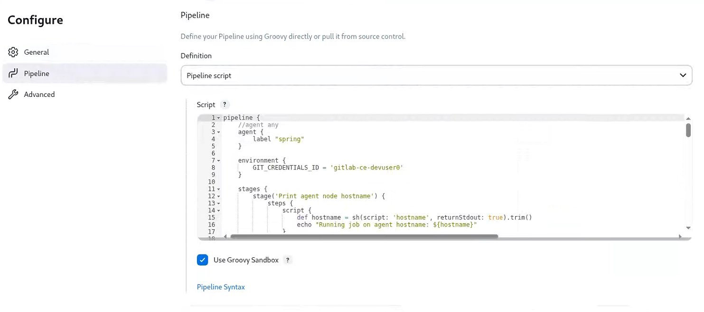</center>

- 语法检查：
  - 编辑器会尝试检查 Groovy 语法和引用的有效性，所有问题都会在对应代码行前面通过红色 “X” 方框标记提示出来。
  - 然而，并非所有的错误标记都代表真正的错误，在某些时候脚本可能无法解析依赖或最近创建的输入，这是一个异常而非规则。
- 完整的错误信息：
  - X 标记在提供快速识别问题行的同时，还支持鼠标悬停时展示完整的错误信息。
- 自动补全：
  - 编辑器还提供了一定程度上的自动补全功能，比如自动补全括号。
- 提供了 “代码片断生成器”：
  - 代码片断生成器提供了一种搜索可用的 DSL 步骤的方法，以帮助用户随时借鉴和查阅感兴趣步骤的主义和语法。

## Pipeline 基础及代码示例

- 流水线一般由多个阶段组成，包括获取源代码、编译、集成测试、代码分析、应用打包和部署等。
  - Jenkins 2.x 能够代码化整个流水线，可参考如下 [Jenkinsfile](https://github.com/Alberthua-Perl/ansible-demo/blob/master/jenkins-ci-plt/jenkins/pipeline-syntax-test/Jenkinsfile.base-structure)：

  ```groovy
  pipeline {
    agent any

    stages {
      stage('Source') {
        steps {
          echo 'Get code from Git Repository...'
        }
      }

      stage('Build') {
        steps {
          echo 'Building...'
        }
      }

      stage('Test') {
        steps {
          echo 'Testing...'
        }
      }

      stage('Deploy') {
        steps {
          echo 'Deploying...'
        }
      }
    }    
  }
  ```

  > 💥 注意：以下流水线执行过程需安装 `Pipeline: Stage View` 插件，用以显示方块形的阶段视图。

  - 第一次保存流水线定义时，Dashboard 会提示流水线尚未执行，在项目上通过 “立即构建”，可手动触发构建过程。
    - 任务执行结果在阶段视图中以方块的形式显示
      - 一次构建用一行方块来表示，其中每个方块代表流水线中的一个阶段（stage）。
      - 每个方块都代表了一个特定阶段的一次执行结果

  <center></center>

  - 方块颜色的意义：
    - 蓝色条纹：运行中
    - 白色：stage 尚未执行
    - 红色条纹：state 执行失败
    - 绿色：stage 执行成功
    - 浅红色：stage 执行成功，但是下游的某个 stage 出现失败。

### 运行一条 Pipeline

以前面示例中的代码保存为一个 pipeline 的定义，通过左边菜单中的 “立即构建” 便可触发 pipeline 的一次运行，具体结果如下图所示：

<center>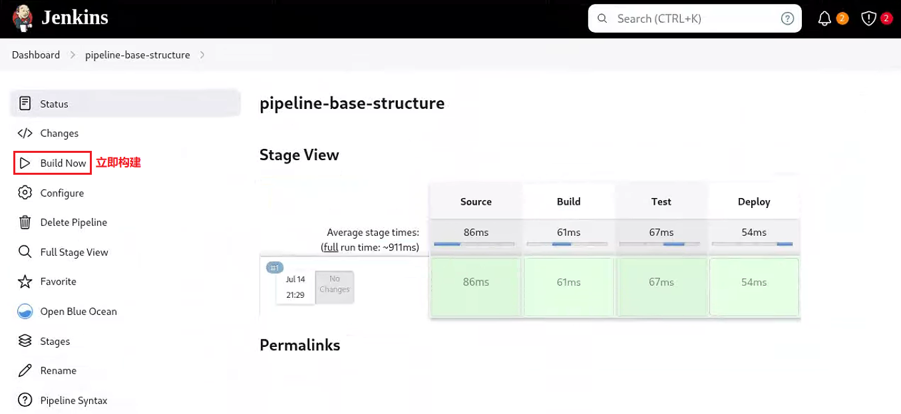</center>

### 控制台输出

- 在传统的 Jenkins 中，通过点出控制台输出链接或者构建历史窗口中的构建旁边状态球来查看控制台输出，新式的 stage 视图同样支持此功能。
- 另外，将鼠标悬停于 stage 视图中的某个方块上，还会出现该阶段相关的日志信息的按钮，点击该按钮，即可显示此 stage 的日志。

<center>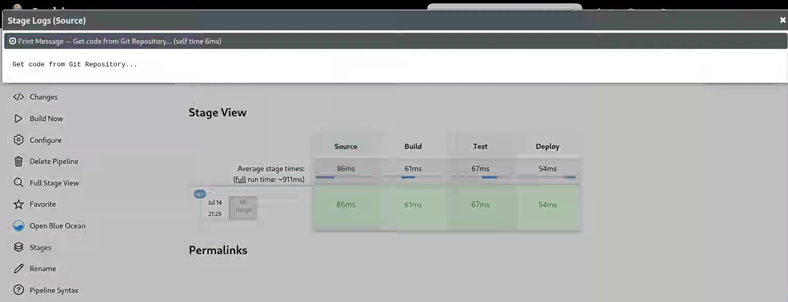</center>

### 运行失败的视图

多次运行构建任务时，最新一次的运行位于视图中的最上方。

- 当某个 stage 因任何原因运行失败时，Jenkins 会将其标记为红色条纹背景。
- 鼠标悬停于 stage 方块上方，会有错误信息提示。
- 如，将此前 pipeline 示例代码的 “Build” 阶段有意改为错误格式，将 echo 换成 bat 命令等，其构建结果将输出为类似如下视图：

<center>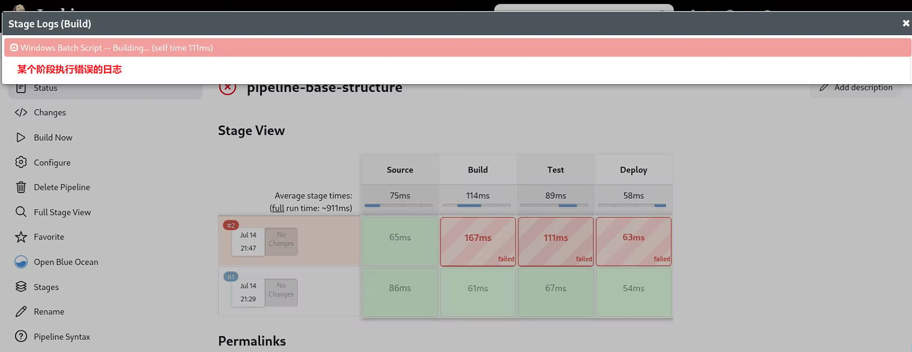</center>

### 流水线步骤

流水线作业中的 Pipeline Steps 可以分解显示每个步骤的执行状态：

<center>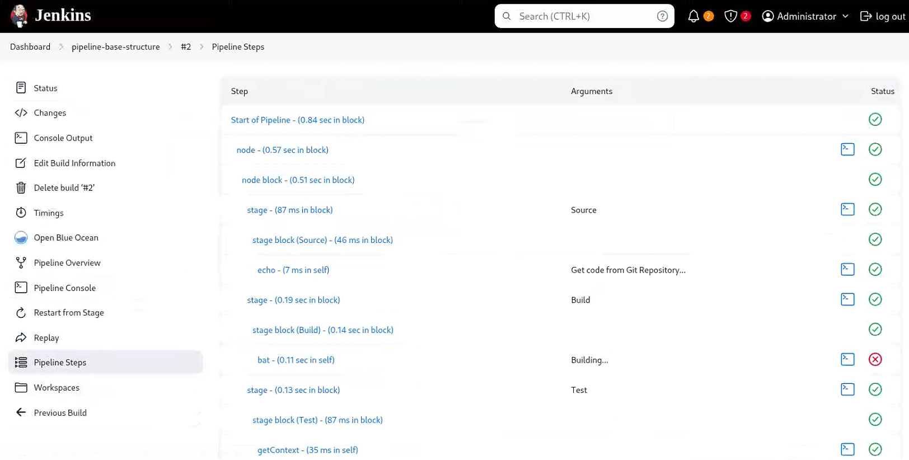</center>

### 回放（Replay）

- 对于错误的构建任务，Jenkins 提供了一种称为 “回放（Replay）” 的机制，它允许用户无须改变已保存的原有代码的基础上进行试验和调试。
- 回放为用户提供了一种在原有代码基础上修改代码并再次触发 pipeline 的功能，以便于在正式提交代码之前进行一次变更的快速验证并查看效果。
  - 点击构建菜单中的 “回放”，会弹出编辑窗口，并允许用户任意修改程序，而后点击 “运行” 按钮来验证变更效果。
  - Jenkins 会在回放窗口中运行编辑后的代码，并保存一次全新的构建记录，但原始代码依然保持从前的状态。
  - 因此，回放操作能帮用户验证变更，但真正的变更依然需要用户手动更新 pipeline 的代码完成。

<center>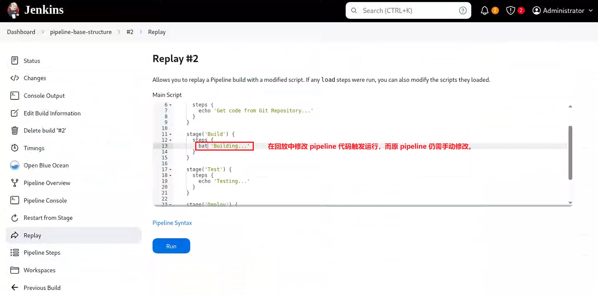</center>

<center>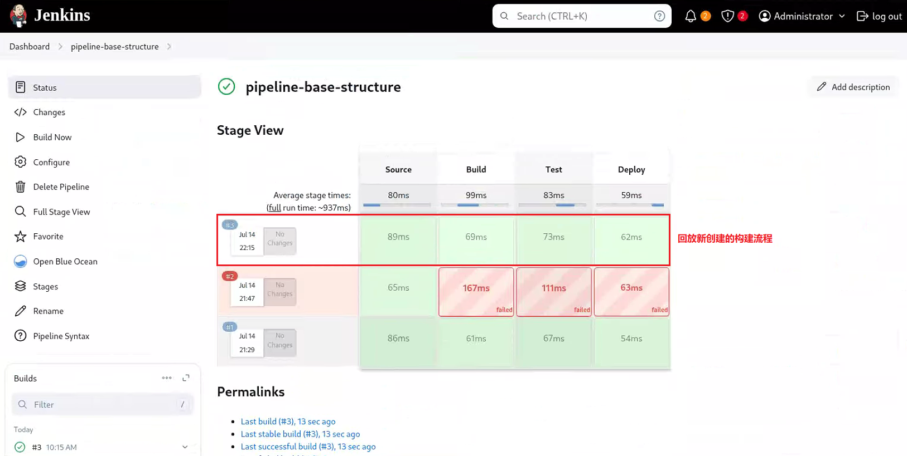</center>

## 声明式 Pipeline 的结构

pipeline 的定义有一个明确的、必须遵循的结构，它由一些 `directive` 和 `section` 组成，每一个 section 又可包含其它的 section、directive 和 step，以及一些 `condition` 的定义。

- Section：用于将那些在某个时间点需要一同运行的条目（item）组织在一起
  - `agent section`：指定负责运行代码的节点
  - `stages section`：组织一到多个 stage
  - `steps section`：组织一至多个 DSL 格式的步骤
  - `post section`：在 stage 或整个 pipeline 的尾部封装一些需要被执行的步骤或者检验条件
- Directive（指令）：负责完成特定功能的语句或代码块，如 `environment`、`tools`、`triggers`、`input` 和 `when` 等。
- Steps：steps 本身就是一个标识特定 section 的名称，其内部可以使用任何合法的 DSL 语句，如 `git`、`sh`、`bat` 和 `echo` 等。

下图中的实线部分，为必选的配置参数。

<center>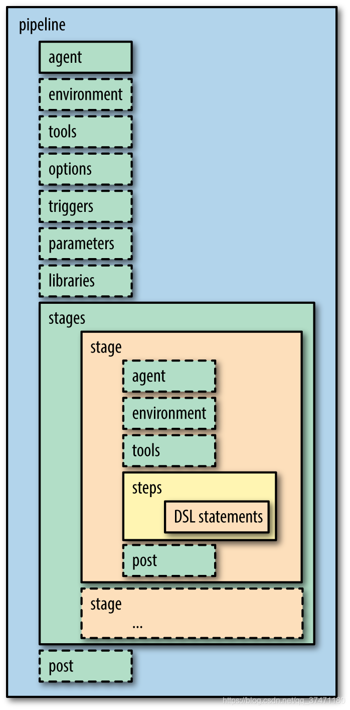</center>

## Pipeline 支持的 Section

### Section: agent

- agent 用于指明使用哪一个节点去执行 pipeline 或 stage 中的代码
  - 在 pipeline 代码块的顶部，必须要有一个 agent 来指定 “默认” 的执行节点。
  - 一个 stage 的顶部也可以有一个 agent 的定义，用来指定负责运行该 stage 中的代码的节点。
- agent 可接受多种形式的参数：
  - `any`：任何可用节点
  - `none`：用于 pipeline 顶端时表示不定义默认的 agent，这就需要为每个 stage 单独指定。
  - `label { label "<label>" }`：具有指定的标签的节点均为可用节点
  - `node { label "<label>" }`：与 label 相似，但可以指定额外的参数 `customWorkspace`。
  - `docker`：
    - 在指定的容器中运行 pipeline 或 stage 代码，该容器动态创建并运行于预配置的可运行容器的 node 上，或能够匹配到指定 label 的 node 上。
    - 可用参数如下：`image`、`label`、`args`、`rgistryUrl` 和 `registryCredentialsId` 等。

    ```groovy
    //适合私有仓库或需要额外挂载/环境变量的场景
    pipeline {
      agent {
        docker {
          image 'maven:3.9.3-eclipse-temurin-17'
          label 'docker-enabled-node'  //只在打了该 label 的节点上运行
          args  '-v /tmp:/tmp -e MAVEN_OPTS="-Xmx2g"'  //参数传递给 docker run
          registryUrl 'https://registry.lab.example.com/'  //私有容器镜像仓库
          registryCredentialsId 'registry-cred'   //Jenkins 里预存的凭据 ID
        }
      }

      stages {
        stage('Build') {
          steps {
            sh 'mvn -B clean package'
          }
        }
      }
    }
    ```

  - `dockerfile`：
    - 功能上类似于上面 docker 参数，但容器镜像通过指定的 Dockerfile 进行构建。
    - 该参数要求 Jenkinsfile 必须从 **Multibranch Pipeline** 或者 **Pipeline from SCM** 中加载。
    - 可用参数如下：`filename`、`dir`、`label`、`additionalBuildArgs`、`args`、`registryUrl` 和 `registryCredentialsId`。

    ```groovy
    pipeline {
      agent {
        dockerfile {
          filename 'Dockerfile.ci'   //源码中的 Dockerfile 文件名
          dir 'build'                //构建上下文目录
          label 'docker-enabled-node'
          additionalBuildArgs '--build-arg VERSION=1.0.2'
          args '-v /tmp:/tmp'
        }
      }

      stages {
        stage('Test') {
          steps {
            sh 'pytest'
          }
        }
      }
    }
    ```  

- `kubernetes`：
  - 于 Kubernetes 集群上指定的 Pod 中运行 stage 或 pipeline 代码，该参数同样要求 Jenkinsfile 必须从 **Multibranch Pipeline** 或者 **Pipeline from SCM** 中加载。
  - 需要在 kubernetes 参数中指定 Pod 模板

```groovy
//Declarative Pipeline（推荐，语法简洁）
pipeline {
  /* 1. 整个流水线都跑在同一个 Pod 里 */
  agent {
    kubernetes {
      cloud 'kubernetes'          //Jenkins 系统里配置的 K8s Cloud 名称
      slaveConnectTimeout 1200    //Jenkins 等待 Pod Ready 的超时时间（秒）
      workspaceVolume emptyDirWorkspaceVolume()    //工作目录使用 emptyDir

      /* 2. 直接内嵌 Pod YAML（最灵活） */
      yaml '''
apiVersion: v1
kind: Pod
metadata:
  labels:
    jenkins: agent
spec:
  restartPolicy: Never
  containers:
  - name: jnlp    //JNLP 容器，必须存在
    image: jenkins/inbound-agent:4.15-1-alpine
    imagePullPolicy: IfNotPresent
    args: ['\$(JENKINS_SECRET)', '\$(JENKINS_NAME)']

  - name: maven   //额外工具容器
    image: maven:3.9-eclipse-temurin-17
    imagePullPolicy: IfNotPresent
    command: ['cat']
    tty: true
    resources:
      limits:
        memory: "1Gi"
        cpu: "500m"
      requests:
        memory: "512Mi"
        cpu: "250m"
  volumes:
  - name: maven-cache
    emptyDir: {}
'''
    }
  }

  environment {
    //把 kubeconfig 作为凭据注入
    KUBECONFIG = credentials('my-kubeconfig')
  }

  stages {
    stage('Maven Build') {
      steps {
        container('maven') {    //在 maven 容器里执行
          sh 'mvn -B clean package -DskipTests'
        }
      }
    }

    stage('Deploy via kubectl') {
      steps {
        container('maven') {    //同一 Pod 里复用即可
          sh '''
            kubectl --kubeconfig=$KUBECONFIG \
                    set image deployment/myapp myapp=myrepo/myapp:$BUILD_NUMBER
          '''
        }
      }
    }
  }
}
```

### Section: post

- post section 在 pipeline 或 stage 的尾部定义一些 step，并根据其所在 pipeline 或 stage 的完成情况来判定是否
运行这些 step。
- post section 支持的 condition 如下所示：
  - `always`：总是运行
  - `changed`：其所处的 pipeline 或 stage 同前一次运行具有不同状态时，才运行该 post。
  - `fixed`：pipeline 或 stage 本次运行成功，但前一次为 failed 或 unstable 时，才运行该 post。
  - `regression`：pipeline 或 stage 前一次运行成功，但本次为 failure、unstable 或 aborted 时，才运行该 post。
  - `success`：pipeline 或 stage 的运行状态为 success 时，才运行该 post。
  - `failure`：pipeline 或 stage 的运行状态为 failed 时，才运行该 post。
  - `unstable`：因测试失败或代码冲突导致 pipeline 或 stage 的运行状态为 unstable 时，才运行该 post。在 Dashboard 中以黄色显示。
  - `aborted`：pipeline 或 stage 的运行状态为 aborted 时，才运行该 post。在 Dashboard 中以灰色显示。  
  - `unsuccessful`：pipeline 或 stage 的运行不成功时，才运行该 post。
  - `cleanup`：在其它所有的 post 的条件均被评估后（无论 pipeline 或 stage 的状态如何）才运行该 post。

  | Condition      | 触发时机 |
  | -------------- | ------------------------------- |
  | `always`       | **无论构建结果如何**，都会执行。 |
  | `changed`      | **构建结果与上一次不同**（如从成功变为失败，或反之） |
  | `success`      | **构建成功**时执行 |
  | `failure`      | **构建失败**时执行 |
  | `unstable`     | **构建结果不稳定**（如测试失败但未完全失败） |
  | `aborted`      | **构建被手动中止**时执行 |
  | `unsuccessful` | **构建未成功**（即失败、不稳定或中止） |
  | `cleanup`      | **无论结果如何**，在所有其他 `post` 条件执行后运行 |

- [Jenkinsfile](https://github.com/Alberthua-Perl/ansible-demo/blob/master/jenkins-ci-plt/jenkins/pipeline-syntax-test/Jenkinsfile.post-condition) 示例：

```groovy
pipeline {
  agent any

  stages {
    stage('Build') {
      steps {
        script {
          //模拟构建失败
          error('构建失败！')  //测试1：失败构建
          //echo '构建完成！'  //测试2：成功构建
        }
      }
    }
  }
  
  post {
    always {
      echo '无论成功或失败，我都会运行！'
    }
    changed {
      echo '构建结果与上一次不同！'
    }
    success {
      echo '构建成功！'
    }
    failure {
      echo '构建失败！'
      emailext subject: '构建失败', body: '请检查 Jenkins 日志', to: 'hualongfeiyyy@163.com'
    }
    unstable {
      echo '构建不稳定！可能有测试失败。'
    }
    aborted {
      echo '构建被中止！'
    }
    unsuccessful {
      echo '构建未成功（失败/不稳定/中止）。'
    }
    cleanup {
      echo '清理工作，比如删除临时文件。'
      deleteDir()  //清理工作区
    }
  }
}
```

- 根据以上 Jenkinsfile，分别测试构建成功与构建失败触发 post 执行的过程，如下所示：

<center>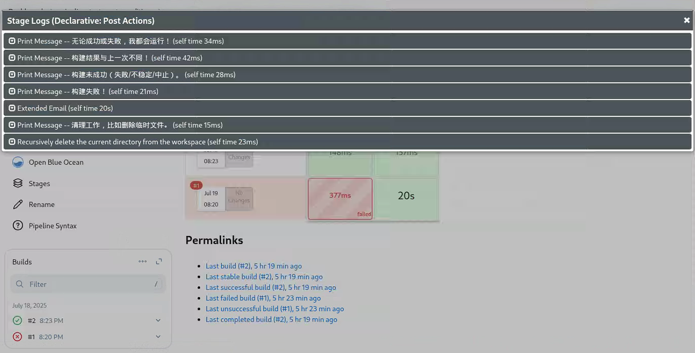</center>

上图中以 “测试1：失败构建” 进行流水线运行显示 post 执行日志。

<center>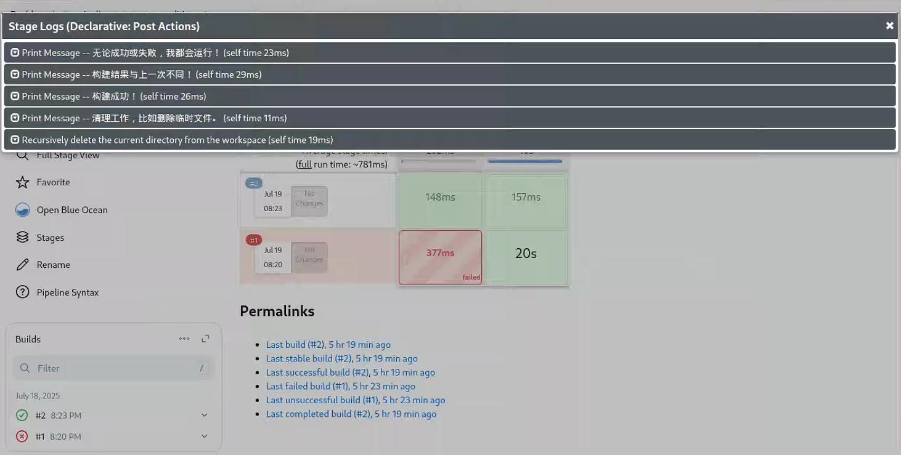</center>

上图中以 “测试2：成功构建” 进行流水线运行显示 post 执行日志。

- 常见用法场景：

  | 场景 | 推荐 `post` 条件 |
  | ----- | ----- |
  | 发送构建通知邮件 | `failure`, `success`, `changed` |
  | 清理临时文件 | `cleanup` |
  | 记录构建状态变化 | `changed` |
  | 构建失败后回滚  | `failure` |
  | 构建被中止时报警 | `aborted` |

### Section: stages 和 steps

pipeline 中 stages 和 steps 结构的关系：

<center>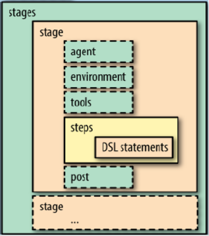</center>

- stages：
  - 封装了用于定义 pipeline 主体和逻辑的所有 stage 的定义，它包含一个或多个 stage 指令。
  - stages 负责描述 pipeline 中绝大部分的实际工作（work）
  - 事实上，stages 中至少需要包含一个 stage 指令来定义 CD 过程的每个离散部分，如构建、测试和部署等。
- steps：
  - 负责在 stage 中定义一到多个 DSL 语句，这些语句负责完成该 stage 中特定的功能，但能够同其它的语句分隔开，如 environment 等。
  - pipeline 中真正 “做事” 的还是其内部一个个具体的 step，因而 steps 是 pipeline 中最核心的组成部署。
    - 除了 script，几乎所有的 step 在 pipeline 中都是不可拆分的原子操作。
    - pipeline 内置了大量的 step，具体请参考 [Pipeline Steps Reference](https://www.jenkins.io/doc/pipeline/steps)。
    - 除此之外，有相当一部分插件可直接当作 step 来用。
  - `script {}` 步骤负责将脚本引入到 `steps {}` 配置段中，但它为非必要的步骤，且复杂的脚本应该单独组织为 `Shared Libraries`，并由Pipeline 导入后使用。

```groovy
pipeline {
  agent any
  
  stages {
    stage('Example') {
      steps {
        echo 'Hello World'
        
        script {
          def distributions = ['RedHat', 'SUSE']
          for (int i = 0; i < distributions.size(); ++i) {
            echo "Testing the ${distributions[i]} system distribution"
          }
        }
      }
    }
  }
}
```

- 💥 在 Jenkins 的 Declarative Pipeline（声明式流水线）里，关于 `step { sh '...' }` 与 `step { script { 'sh ...' } }` 的结构，它们表面上都能执行 shell，但它们在**作用域**、**返回值**、**语法限制**、**生命周期**等方面有本质区别：

  - 1️⃣ 语法位置 & 可读性：
    - `steps { sh '...' }`：
      - 直接位于 Declarative 的 steps 块中，语法简洁、更符合声明式风格。
      - 只能写 “一行” 或 “一块” 简单脚本，不能出现 Groovy 逻辑代码。
    - `steps { script { sh '...' } }`：
      - 把脚本包在 `script { sh '...' }` 里，相当于临时切换到 Scripted Pipeline（脚本式流水线）语法。
      - 可以写完整的 Groovy 逻辑（循环、条件、变量、方法调用等）。
  - 2️⃣ 返回值与后续处理：
    - 直接 `sh`：
      - 返回值默认丢弃，只能通过 `returnStatus: true` 或 `returnStdout: true` 捕获。
      - 不能直接把结果赋值给外部变量（因为声明式作用域不允许赋值）。

      ```groovy
      steps {
        sh 'echo hello'  //只执行，获取不到结果。
      }
      ```

    - `script { sh ... }`：
      - 可以显式接收返回值，再在 Groovy 里继续处理。
      - 可以把结果存到变量，供后面的步骤使用。

      ```groovy
      steps {
        script {
          def msg = sh(script: 'echo hello', returnStdout: true).trim()
          echo "msg=$msg"  //可以继续用 Groovy 处理
        }
      }
      ```

  - 3️⃣ 变量作用域：
    - 直接 `sh`：
      - 无法定义 Groovy 变量
      - 只能使用环境变量、参数或 Credentials
    - `script { sh ... }`：
      - 可以定义 Groovy 变量/闭包/方法，生命周期仅限于该 script 块。
      - 变量不会泄漏到 pipeline 顶层，也不会影响其他 steps。

  - 4️⃣ 错误处理：
    - 直接 `sh`：脚本返回非 0 时，会立即抛异常，导致步骤失败，整个 stage 标红。
    - `script { sh ... }`：可以用 Groovy 的 `try-catch` 捕获返回码，做更细粒度的失败处理。
    - [Jenkinsfile](https://github.com/Alberthua-Perl/ansible-demo/blob/master/jenkins-ci-plt/jenkins/pipeline-syntax-test/Jenkinsfile.stages-steps-error) 示例：

    ```groovy
    pipeline {                                
      agent any                               
                                          
      stages {                                
        stage('Example') {                    
          steps {                             
            echo 'Example for building...'                
                                          
            script {                          
              try {      
                //def prefix = sh(script: 'echo \\>', returnStdout: true).trim()  //正确语法：">" 需要双重转义
                def prefix = sh(script: 'echo >', returnStdout: true).trim()  //错误语法：此处将触发异常处理
                def distributions = ['RedHat', 'SUSE']
                for (int i = 0; i < distributions.size(); ++i) {
                  echo "${prefix} Testing the ${distributions[i]} system distribution"
                }                             
              } catch(error) {  //构建失败时抛出的异常实例，实例名称可自定义。
                echo "捕获异常: ${error}"  //完整的异常处理实例，相当于 error.toString()。
                echo "异常消息：${error.getMessage()} and ${error.toString()}"  //error.getMessage() 只返回 error.toString() 的部分内容
                currentBuild.result = "UNSTABLE"  //此阶段将处于 FAILURE 状态（红色颜色块），但此处修改为 UNSTABLE 状态，颜色块将显示为黄色（如下图所示）。
              }                               
            }                                 
          }                                   
        }                                     
      }                                       
    }
    ```

    <center>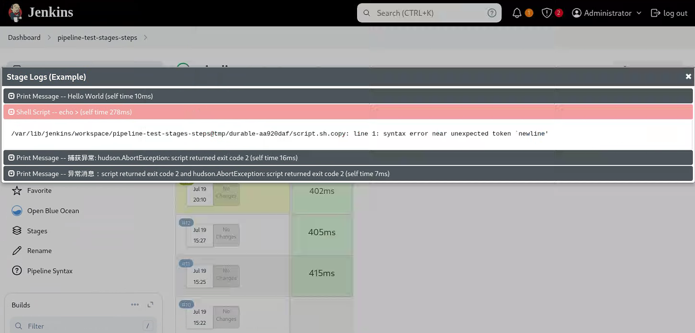</center>

    - 上述示例中，`currentBuild.result` 是 pipeline 的一个只写（write-only）的全局变量，用来 “覆盖” 本次构建在 Dashboard 里最终显示的总体结果（颜色块）。需注意以下几点：
      - 只能往更差的方向修改：
        - 初始值是 SUCCESS。
        - 允许把它改成 `UNSTABLE` 或 `FAILURE`，但不能改回 `SUCCESS`。
      - 不会中断流水线：
        - 仅仅改变 Dashboard 图标和 REST/JSON API 中看到的 result 字段。
        - 流水线会继续往下跑，除非自己再抛异常或 error()。
      - 优先级最低：若后面某个步骤又抛异常导致 Jenkins 内部把结果设为 FAILURE，则最终显示仍然是 FAILURE，之前设的 UNSTABLE 会被覆盖。  

## Pipeline 支持的 Directive

pipeline 支持的 Directive（指令）主要包括：

- `environment`：
  - 设定环境变量，可用于 pipeline 或 stage 代码块中。
  - 支持 `credentials()` 函数，用于通过标识符访问预定义的凭证。
- `tools`：
  - 指定需要在 agent 上下载并配置的工具，如 git、maven、jdk 等，这些工具可经由 PATH 环境变量指定的位置访问到。
  - 可用于 pipeline 或 stage 代码块中。
- `parameters`：
  - 用户在触发 pipeline 时应该提供的参数列表
  - 仅可用于 pipeline 级别
- `options`：
  - 仅可用在 `pipeline` 级别来配置 pipeline 自身的选项，支持的参数可由 pipeline 自身提供，也可由其它插件（如 `timestamps`）提供。
  - 如 `retry(2)` 允许在 pipeline 失败时重试两次
- `triggers`：
  - 用于指定负责自动启动 pipeline 的触发器，对于集成了 Github 或 Gitlab 等自带触发机制的系统场景来说，triggers 并非必须的指令。
  - 仅可用于 pipeline 级别
- `libraries`：当前 pipeline 可以导入的共享库，该共享库内部的代码则可被该 pipeline 调用。
- `stage`：负责在 stages 配置段中封装 steps 配置段，以及其它可用于 stage 中的指令。
- `input`：stage 中的专用指令，用于暂停 pipeline 并提示用户输入内容后继续。
- `when`：stage 中的专用指令，用于设定该 stage 的运行条件。

## 参考链接

- [Pipeline Syntax | Jenkins Doc](https://www.jenkins.io/doc/book/pipeline/syntax/)
- [Pipeline Steps Reference | Jenkins Doc](https://www.jenkins.io/doc/pipeline/steps/)
