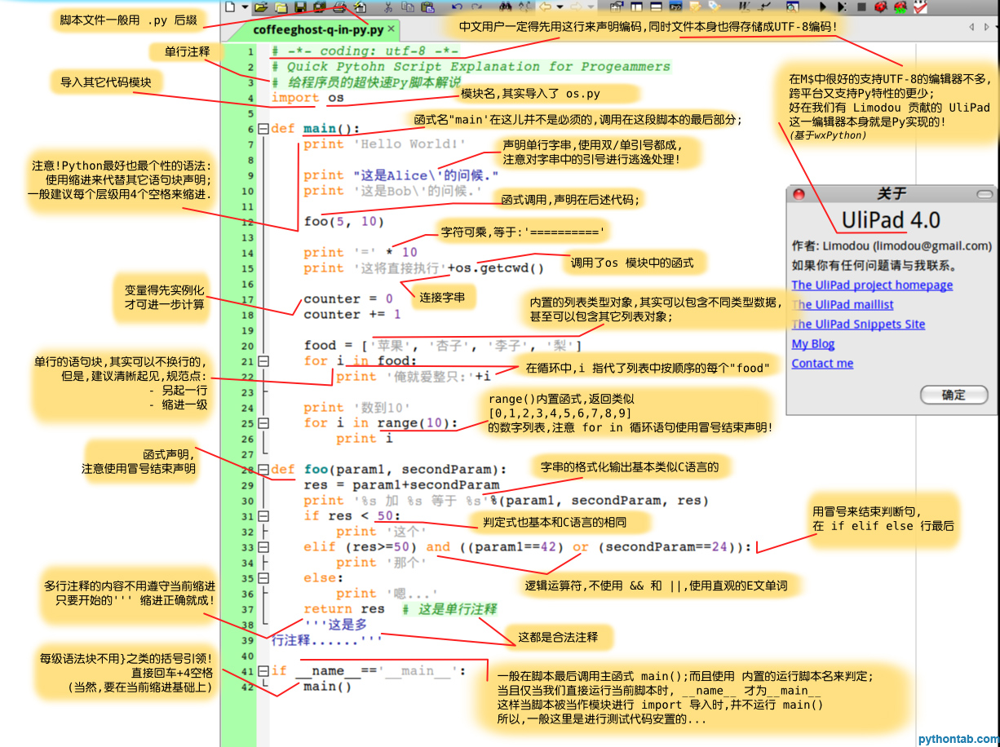
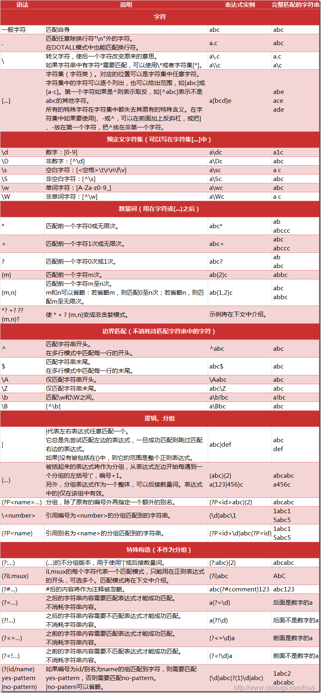
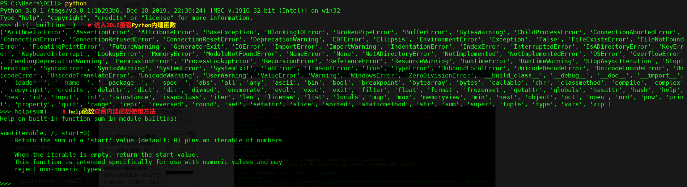
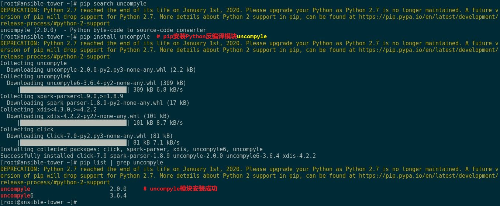
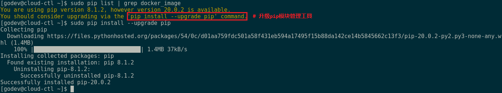

# 🐍 Python 常用配置方法

## 文档目录

- [🐍 Python 常用配置方法](#-python-常用配置方法)
  - [文档目录](#文档目录)
  - [1. Python 学习快速入门](#1-python-学习快速入门)
  - [2. Python 正则表达式汇总](#2-python-正则表达式汇总)
  - [3. 查看 Python 内置函数使用说明](#3-查看-python-内置函数使用说明)
  - [4. Python3 模块管理工具：pip3](#4-python3-模块管理工具pip3)
    - [4.1 安装 pip3 模块管理工具（该软件包无依赖的软件包）](#41-安装-pip3-模块管理工具该软件包无依赖的软件包)
    - [4.2 pip3 搜索 Python 模块](#42-pip3-搜索-python-模块)
      - [4.2.1 pip3 search 搜索方式](#421-pip3-search-搜索方式)
      - [4.2.2 推荐搜索方式](#422-推荐搜索方式)
    - [4.3 安装 Python 模块](#43-安装-python-模块)
      - [4.3.1 pip3 安装指定的 Python 模块](#431-pip3-安装指定的-python-模块)
      - [4.3.2 使用模块源代码安装](#432-使用模块源代码安装)
    - [4.4 升级 pip3](#44-升级-pip3)
  - [5. 配置 pip3 模块安装源](#5-配置-pip3-模块安装源)
    - [5.1 代码替换](#51-代码替换)
    - [5.2 手动替换](#52-手动替换)
  - [6. 参考链接](#6-参考链接)

## 1. Python 学习快速入门

<center></center>

## 2. Python 正则表达式汇总

该正则表达式可适用于 `Ansible Playbook` 的模块中。

<center></center>

## 3. 查看 Python 内置函数使用说明

<center></center>

## 4. Python3 模块管理工具：pip3

### 4.1 安装 pip3 模块管理工具（该软件包无依赖的软件包）

```bash
$ sudo dnf install -y python3-pip
```

### 4.2 pip3 搜索 Python 模块

#### 4.2.1 pip3 search 搜索方式
```bash
$ pip3 search docker-py
# 搜索 docker-py 模块，该模块为 Ansible 中的 docker_image 模块所依赖。
```

pip search 已于 2020 年底被 PyPI 官方下线（接口关闭），现在直接执行会提示：

```plaintext
ERROR: XMLRPC request failed [code: -32500]
RuntimeError: PyPI no longer supports 'pip search' (or XML-RPC search). Please use https://pypi.org/search (via a browser) instead. See https://warehouse.pypa.io/api-reference/xml-rpc.html#deprecated-methods for more information.
```

因此，无法再用 pip 命令搜索/列举版本。

#### 4.2.2 推荐搜索方式

- 1️⃣ 访问 PyPI 官方站点：https://pypi.org/

<center></center>

- 2️⃣ 执行以下代码：

  ```python
  import requests, json
  pkg = "scikit-learn"  #指定模块名称
  print(*json.loads(requests.get(f"https://pypi.org/pypi/{pkg}/json").text)["releases"], sep="\n")
  ```

### 4.3 安装 Python 模块

#### 4.3.1 pip3 安装指定的 Python 模块

```bash
$ pip3 install docker-py
# 安装 docker-py 模块

$ pip3 install uncompyle
# 安装 Python 反编译模块 uncompyle
```

<center></center>

#### 4.3.2 使用模块源代码安装

```bash
$ python setup.py install
# 使用 python 模块中的 setup.py 脚本安装模块
```

### 4.4 升级 pip3

```bash
$ python3 -m pip install --upgrade pip
$ pip3 install --upgrade pip
# 以上2个命令效果等同
```

<center></center>

<center></center>

## 5. 配置 pip3 模块安装源

pip3 模块安装源默认情况下使用 Python 官方源下载安装，常由于网络问题而超时中断，因此可替换源 URL，加速模块的下载安装。

### 5.1 代码替换

```bash
$ pip3 config set global.index-url https://mirrors.aliyun.com/pypi/simple
$ pip3 config set install.trusted-host mirrors.aliyun.com
$ pip3 -v config list
# 查看更新后的 pip3 模块安装源
```

### 5.2 手动替换

```bash
$ mkdir $HOME/.pip
$ mkdir $HOME/.config/pip
# 以上两个目录均可存储 pip.conf 配置文件
# 当前用户环境中使用 pip3

$ cat > $HOME/.pip/pip.conf <<EOF
[global]
index-url=https://mirrors.aliyun.com/pypi/simple/
[install]
trusted-host=mirrors.aliyun.com
EOF

$ pip3 -v config list
```

## 6. 参考链接

- [Python 官网](https://www.python.org/)
- [Python Releases for Windows](https://www.python.org/downloads/windows/)
- [pypi.org](https://pypi.org/)
