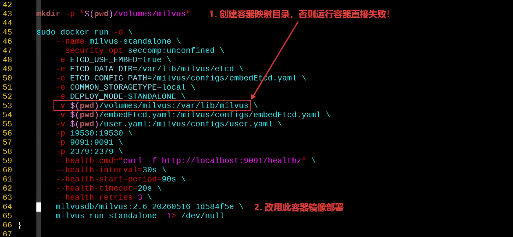

# 📚 RAG 知识库构建与在线检索优化实践

## 文档说明

## 环境资源要求

| 操作系统类型 | CPU 数量 | 内存容量 | Docker 版本 | Dify 版本 | Milvus 版本 | Attu 版本 |
| ----- | ----- | ----- | ----- | ----- | ----- | ----- |
| Ubuntu 24.04.4 LTS (Noble Numbat) | 8 | 16GB | 1️⃣ docker-ce 29.5.0 <br> 2️⃣ docker-ce-cli 29.5.0 <br> 3️⃣ docker-ce-rootless-extras 29.5.0 <br> 4️⃣ docker-compose-plugin 5.1.3 | 1.13.3 | v2.6.16 | v2.6 |

## 文档目录

- [📚 RAG 知识库构建与在线检索优化实践](#-rag-知识库构建与在线检索优化实践)
  - [文档说明](#文档说明)
  - [环境资源要求](#环境资源要求)
  - [文档目录](#文档目录)
  - [Dify 容器化部署](#dify-容器化部署)
  - [Dify 插件安装](#dify-插件安装)
  - [Milvus 数据库部署：Standalone 模式](#milvus-数据库部署standalone-模式)
    - [Docker 单容器运行方式](#docker-单容器运行方式)
    - [Docker Compose 运行方式](#docker-compose-运行方式)
  - [Dify 节点执行报错汇总](#dify-节点执行报错汇总)
  - [待测试内容](#待测试内容)
  - [参考链接](#参考链接)

## Dify 容器化部署

截止笔者部署 Dify 时，其最新版本更新为 `1.14.0`，遂尝试此版本部署，但在使用过程中发现，以下两大问题：

- ⚠️ 创建知识库后使用内置 DSL 知识库模板无法正确渲染
- ⚠️ 在自定义知识库流水线中由于内部数据库通信异常而导致调试单个节点常出现实例失败

因此，笔者选择 Dify 1.13.3 版本部署测试。

Dify 以 **Docker Compose** 多容器运行方式，其中包含多个组件，启动过程如下：

```bash
$ git clone https://github.com/langgenius/dify.git
# 克隆 Dify 源代码
$ cd dify
# 进入 Dify 源代码目录
$ git checkout 3.13.3
# 切换 Dify 3.13.3 版本
$ cd dify/docker
# 切换至 docker-compose.yaml 文件所在目录
$ cp .env.example .env
# 生成默认的环境文件，此文件定义 Dify 各功能，后续可自定义修改。
$ docker compose pull
# 先拉取 Dify 相关容器镜像，防止因拉取超时而导致启动失败。
$ docker compose up -d
# 在 Dify 源码目录中执行：根据 docker-compose.yaml 文件以后台形式启动整个 Dify 应用

$ docker compose ps
NAME                     IMAGE                                       COMMAND                  SERVICE         CREATED        STATUS                  PORTS
docker-api-1             langgenius/dify-api:1.14.0                  "/bin/bash /entrypoi…"   api             19 hours ago   Up 19 hours (healthy)   5001/tcp
docker-api_websocket-1   langgenius/dify-api:1.14.0                  "/bin/bash /entrypoi…"   api_websocket   19 hours ago   Up 19 hours             5001/tcp
docker-db_postgres-1     postgres:15-alpine                          "docker-entrypoint.s…"   db_postgres     19 hours ago   Up 19 hours (healthy)   5432/tcp
docker-nginx-1           nginx:latest                                "sh -c 'cp /docker-e…"   nginx           19 hours ago   Up 19 hours             0.0.0.0:80->80/tcp, [::]:80->80/tcp, 0.0.0.0:443->443/tcp, [::]:443->443/tcp
docker-plugin_daemon-1   langgenius/dify-plugin-daemon:0.6.0-local   "/usr/bin/tini -g --…"   plugin_daemon   19 hours ago   Up 19 hours             0.0.0.0:5003->5003/tcp, [::]:5003->5003/tcp
docker-redis-1           redis:6-alpine                              "docker-entrypoint.s…"   redis           19 hours ago   Up 19 hours (healthy)   6379/tcp
docker-sandbox-1         langgenius/dify-sandbox:0.2.15              "/entrypoint.sh"         sandbox         19 hours ago   Up 19 hours (healthy)
docker-ssrf_proxy-1      ubuntu/squid:latest                         "sh -c 'cp /docker-e…"   ssrf_proxy      19 hours ago   Up 19 hours             3128/tcp
docker-weaviate-1        semitechnologies/weaviate:1.27.0            "/bin/weaviate --hos…"   weaviate        19 hours ago   Up 19 hours
docker-web-1             langgenius/dify-web:1.14.0                  "/bin/sh ./entrypoin…"   web             19 hours ago   Up 19 hours             3000/tcp
docker-worker-1          langgenius/dify-api:1.14.0                  "/bin/bash /entrypoi…"   worker          19 hours ago   Up 19 hours             5001/tcp
docker-worker_beat-1     langgenius/dify-api:1.14.0                  "/bin/bash /entrypoi…"   worker_beat     19 hours ago   Up 19 hours             5001/tcp

$ docker compose -f ~/backup/dify/docker/docker-compose.yaml ps
# 注意：如果不在 Dify 源码目录中，那么指定 docker-compose.yaml 的绝对路径
```

等待片刻，打开浏览器访问 Dify 所在节点的 IP 地址，如 http://<dify_ip_address>，默认监听 80/tcp 端口。根据页面提示创建用户，如下所示：


## Dify 插件安装

Dify 插件安装过程中虽然可从官方的 Markplace 中下载插件，但插件所需的依赖依然需要从国外的 Python 模块站点上下载，经常因为超时超时而报错。以下为安装 **Dify 文本提取器插件** 过程中的超时报错：

```plaintext
failed to launch plugin: failed to install dependencies: failed to install dependencies: signal: killed, output: DEBUG uv 0.11.7 (x86_64-unknown-linux-gnu)
DEBUG Found project root: `/app/storage/cwd/langgenius/general_chunker-0.0.11@427168e20dcf0b761438182aaba0243f20c048c9cf816dbb6b4c7b87d3c2de82`
DEBUG No workspace root found, using project root
DEBUG No Python version file found in workspace: /app/storage/cwd/langgenius/general_chunker-0.0.11@427168e20dcf0b761438182aaba0243f20c048c9cf816dbb6b4c7b87d3c2de...iles.pythonhosted.org/packages/d5/1f/5f4a3cd9e4440e9d9bc78ad0a91a1c8d46b4d429d5239ebe6793c9fe5c41/fsspec-2026.3.0-py3-none-any.whl
DEBUG Sending fresh GET request for: https://files.pythonhosted.org/packages/d5/1f/5f4a3cd9e4440e9d9bc78ad0a91a1c8d46b4d429d5239ebe6793c9fe5c41/fsspec-2026.3.0-py3-none-any.whl
Downloading numpy (15.9MiB)
Downloading transformers (11.4MiB)
Downloading tokenizers (3.1MiB)
Downloading hf-xet (4.0MiB)
init process exited due to no activity for 120 seconds
failed to init environment
```

## Milvus 数据库部署：Standalone 模式

### Docker 单容器运行方式

本文采用 `Milvus Standalone` 模式部署数据库，但采用 [官方脚本](https://raw.githubusercontent.com/milvus-io/milvus/master/scripts/standalone_embed.sh) 无法正确启动 Milvus 数据库，需更改以下内容修复：



```bash
$ wget -O standalone_embed.sh https://raw.githubusercontent.com/milvus-io/milvus/master/scripts/standalone_embed.sh
$ mkdir milvus
# 创建 Milvus 数据库目录
$ chmod -R 0777 milvus
# 修改 Milvus 数据库目录权限
$ mv standalone_embed.sh milvus/
$ cd milvus/
$ vim standalone_embed.sh
# 根据上图修改脚本完成部署
$ bash standalone_embed.sh start
Unable to find image 'milvusdb/milvus:2.6-20260516-1d584f5e' locally
2.6-20260516-1d584f5e: Pulling from milvusdb/milvus
7646c8da3324: Already exists
5f94a9591bfb: Pull complete
c17e2914f747: Pull complete
ee4a5c473250: Pull complete
90b5180edda9: Pull complete
c3d515cd17cd: Pull complete
a5626e2c21c5: Pull complete
56391d0d194c: Pull complete
4f4fb700ef54: Pull complete
Digest: sha256:a1cde8304c130d8613c4be60a49f8e4b69ad236e4c08f9dc6df5b80302211c36
Status: Downloaded newer image for milvusdb/milvus:2.6-20260516-1d584f5e
Wait for Milvus Starting...
Start successfully.
To change the default Milvus configuration, add your settings to the user.yaml file and then restart the service.
# 首次启动将拉取 Milvus 数据库容器镜像

$ docker ps --format="table {{ .Names }} {{ .Status }}" | grep milvus
milvus-standalone Up 54 minutes (healthy)
```

### Docker Compose 运行方式

## Dify 节点执行报错汇总

1️⃣ 上传 Markdown 格式文件测试知识库流水线，在 `DIFY EXTRACTOR` 节点中报错如下：

```plaintext
An error occurred in the langgenius/dify_extractor/dify_extractor, please contact the author of langgenius/dify_extractor/dify_extractor for help, error type: ValueError, error details: Invalid file URL '/files/731c7e5c-ddc3-463f-93b3-40b5971351c0/file-preview?timestamp=1779170277&nonce=69df7aba32d79233f7926109d2eeeef7&sign=6tcQHLYMrIR5l0456VSiCz7NVfmcwgKvKnQvwqnDVPk%3D': Request URL is missing an 'http://' or 'https://' protocol.. Ensure the `FILES_URL` environment variable is set in your .env file
```

## 待测试内容

- 在现有离线索引知识库流水线中尝试将 Dify 向量数据库后端换成外部 Milvus，Embedding 模型换成 BGE-M3，此模型可同时生成稀疏向量与密集向量，之后再将知识库节点启用混合检索，观察是否能同时支持双向量？
- 在线检索阶段，如何接入外部 Milvus 完成混合检索？
- 最终确认是代码节点完成还是替换整个 Dify 自建流程？

## 参考链接

- [milvusdb/milvus | DockerHub](https://hub.docker.com/r/milvusdb/milvus)
- [容器化部署Milvus向量数据库：从开发到生产环境的完整指南 | 博客园](https://www.cnblogs.com/ycfenxi/p/19926766)
