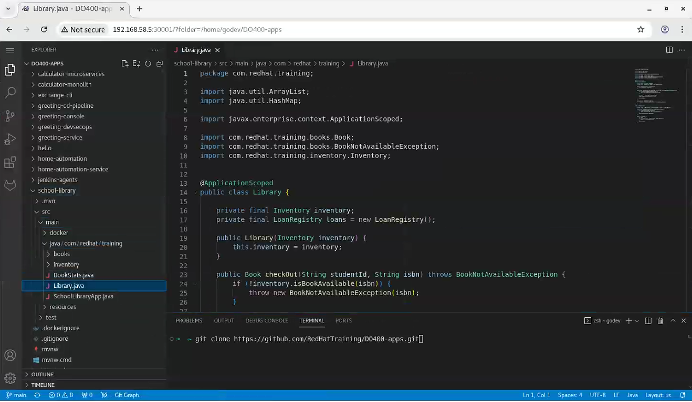

# minikube 快速上手管理 Kubernetes 集群

## 文档说明

本文主要介绍如何使用 minikube 快速部署与管理单个控制节点与高可用的 Kubernetes 集群，可极大地方便在本地做开发与测试。同时，本地部署还支持 `kvm`、`docker`（推荐）与 `podman`（实验性）等驱动，更加方便地快速部署集群。minikube 部署还支持不同的 `CNI` 插件，可在本地使用不同的插件进行调试。

此次实验中，笔者分别使用 `flannel`、`cilium` 插件部署于单个控制节点的 Kubernetes 集群中，而使用 `calico` 插件部署于3个控制节点的高可用集群中。

实验环境说明：

- 操作系统类型：Red Hat Enterprise Linux release 8.4 (Ootpa)
- CPU 资源：8 核心
- Memory 资源：32GiB
  > 注意：根据实际可用资源来定，建议最低分配 16GiB 内存。此次实验中由于要部署多套集群，因此给定 32GiB 内存。
- Docker 版本：26.1.3
- [minikube 版本](https://github.com/kubernetes/minikube/releases/download/v1.34.0/minikube-linux-amd64)：v1.34.0
- [docker-machine-driver-kvm2 版本](https://github.com/kubernetes/minikube/releases/download/v1.34.0/docker-machine-driver-kvm2-amd64)：v1.34.2

💥 存在的问题：minikube 部署 Kubernetes 集群的麻烦之处在于对 `docker.io` 与 `gcr.io` 等容器镜像站点的访问（网络访问问题）。虽然在 `minikube start` 的选项中提供 `--image-repository=registry.cn-hangzhou.aliyuncs.com/google_containers`，但是在节点启动后部分组件（如 flannel/calico/cilium 等）依然需要从 docker.io 或 gcr.io 中拉取，若超时始终拉取不到相应的容器镜像，那么将导致集群 `NotReady`。因此，解决容器镜像站点的访问问题可有效解决 minikube 部署失败。

💪 可选方案：此次实验使用局域网内 `NanoPi R2S 软路由` 实现对外部容器镜像仓库的访问，这样在后续部署过程中可保证部署的成功率。

## 文档目录

- [Docker 容器运行环境准备](#docker-容器运行环境准备)
  - [配置 docker-ce.repo 软件源](#配置-docker-cerepo-软件源)
  - [部署 docker-ce 组件](#部署-docker-ce-组件)
- [minikube 相关组件准备](#minikube-相关组件准备)
  - [minikube 下载与安装](#minikube-下载与安装)
  - [docker-machine-driver-kvm2 驱动下载与安装](#docker-machine-driver-kvm2-驱动下载与安装)
- [minikube 快速部署单个控制节点的 Kubernetes 集群](#minikube-快速部署单个控制节点的-kubernetes-集群)
  - [部署使用 Flannel CNI 的集群](#部署使用-flannel-cni-的集群)
  - [部署使用 Cilium CNI 的集群](#部署使用-cilium-cni-的集群)
- [minikube 快速部署高可用 Kubernetes 集群](#minikube-快速部署高可用-kubernetes-集群)
- [部署中的故障排除](#部署中的故障排除)
  - [添加节点失败报错](#添加节点失败报错)
  - [删除节点报错](#删除节点报错)
- [minikube 相关子命令使用](#minikube-相关子命令使用)  
- [参考链接](#参考链接)  

## Docker 容器运行环境准备

此次实验中使用 RHEL8 运行 minikube，但在 RHEL8 中底层默认使用 Podman 作为容器运行时。因此，在安装 Docker 容器运行环境之前需删除 podman 相关组件，包括 podman、buildah 等。然后，再编辑 `/etc/yum.repos.d/docker-ce.repo` 软件源文件用以安装 Docker-CE 相关组件。

### 配置 docker-ce.repo 软件源

```plaintext
# RHEL8 中部署 Docker-CE 组件
[docker-ce-stable]
name=Docker CE Stable - $basearch
baseurl=https://download.docker.com/linux/centos/$releasever/$basearch/stable
enabled=1
gpgcheck=1
gpgkey=https://download.docker.com/linux/centos/gpg

[docker-ce-stable-debuginfo]
name=Docker CE Stable - Debuginfo $basearch
baseurl=https://download.docker.com/linux/centos/$releasever/debug-$basearch/stable
enabled=0
gpgcheck=1
gpgkey=https://download.docker.com/linux/centos/gpg

[docker-ce-stable-source]
name=Docker CE Stable - Sources
baseurl=https://download.docker.com/linux/centos/$releasever/source/stable
enabled=0
gpgcheck=1
gpgkey=https://download.docker.com/linux/centos/gpg

[docker-ce-test]
name=Docker CE Test - $basearch
baseurl=https://download.docker.com/linux/centos/$releasever/$basearch/test
enabled=0
gpgcheck=1
gpgkey=https://download.docker.com/linux/centos/gpg

[docker-ce-test-debuginfo]
name=Docker CE Test - Debuginfo $basearch
baseurl=https://download.docker.com/linux/centos/$releasever/debug-$basearch/test
enabled=0
gpgcheck=1
gpgkey=https://download.docker.com/linux/centos/gpg

[docker-ce-test-source]
name=Docker CE Test - Sources
baseurl=https://download.docker.com/linux/centos/$releasever/source/test
enabled=0
gpgcheck=1
gpgkey=https://download.docker.com/linux/centos/gpg

[docker-ce-nightly]
name=Docker CE Nightly - $basearch
baseurl=https://download.docker.com/linux/centos/$releasever/$basearch/nightly
enabled=0
gpgcheck=1
gpgkey=https://download.docker.com/linux/centos/gpg

[docker-ce-nightly-debuginfo]
name=Docker CE Nightly - Debuginfo $basearch
baseurl=https://download.docker.com/linux/centos/$releasever/debug-$basearch/nightly
enabled=0
gpgcheck=1
gpgkey=https://download.docker.com/linux/centos/gpg

[docker-ce-nightly-source]
name=Docker CE Nightly - Sources
baseurl=https://download.docker.com/linux/centos/$releasever/source/nightly
enabled=0
gpgcheck=1
gpgkey=https://download.docker.com/linux/centos/gpg
```

### 部署 docker-ce 组件

```bash
$ sudo rpm -qa | egrep "podman|buildah"  #1
$ sudo dnf remove -y podman buildah  #2
# 可选步骤（#1与#2）：若查询发现已安装 podman 与 buildah，那么需执行此步用以移除这些组件。

$ sudo dnf install -y docker-ce containerd.io docker-ce-cli
# 安装 docker 与 containerd 相关软件包
$ sudo usermod -aG docker $USER
# 将当前用户添加进 docker 用户组，该用户可直接调用 docker 命令。
$ sudo systemctl enable --now docker.service  #务必启动 docker 守护进程，否则 minikube 部署集群时报错！
$ docker version  #验证当前用户权限
```

## minikube 相关组件准备

### minikube 下载与安装

```bash
wget https://github.com/kubernetes/minikube/releases/download/v1.34.0/minikube-linux-amd64
sudo cp ./minikube-linux-amd64 /usr/local/bin/minikube
```

### docker-machine-driver-kvm2 驱动下载与安装

```bash
wget https://github.com/kubernetes/minikube/releases/download/v1.34.0/docker-machine-driver-kvm2-amd64
sudo cp ./docker-machine-driver-kvm2-amd64 /usr/local/bin/docker-machine-driver-kvm2
```

## minikube 快速部署单个控制节点的 Kubernetes 集群

此处以 `flannel` 与 `cilium` CNI 插件为例部署单个控制节点的集群。

### 部署使用 Flannel CNI 的集群

🧪 直接指定3个节点部署集群：

```bash
$ minikube start --nodes=3 --profile=flannel-aio \
    --cni=flannel --container-runtime=cri-o --driver=docker \
    --kubernetes-version=v1.31.0 --memory=4096m
# 直接指定3个节点（默认1个控制节点与2个工作节点）启动集群。此处使用 docker 驱动，因此，节点以容器的方式运行。

# 各选项说明：
#   --nodes：指定部署的节点数量
#   --profile：指定部署集群的概览名称
#   --cni：指定 CNI 容器网络接口插件，包括 auto, bridge, calico, cilium, flannel, kindnet 或 CNI manifest (默认为 auto)。
#   --container-runtime：指定集群中容器运行时，包括 docker, cri-o, containerd (默认为 auto)。
#   --driver：指定运行集群节点的驱动，包括 virtualbox, kvm2, qemu2, qemu, vmware, none, docker, podman, ssh (默认为 auto-detect)。该驱动为集群节点以何种方式运行，若驱动为 docker，那么集群节点以容器方式运行，若驱动为 kvm2，那么集群节点以 kvm 虚拟机的方式运行。
#   --kubernetes-version：指定部署的集群版本
#   --memory：指定集群节点限制的可使用内存容量

$ minikube kubectl --profile=flannel-aio -- get pods -A -o wide
NAMESPACE      NAME                                  READY   STATUS    RESTARTS   AGE   IP             NODE              NOMINATED NODE   READINESS GATES
kube-flannel   kube-flannel-ds-jfdcz                 1/1     Running   0          9h    192.168.76.2   flannel-aio       <none>           <none>
kube-flannel   kube-flannel-ds-wfwq8                 1/1     Running   0          9h    192.168.76.4   flannel-aio-m03   <none>           <none>
kube-flannel   kube-flannel-ds-zx8tl                 1/1     Running   0          9h    192.168.76.3   flannel-aio-m02   <none>           <none>
kube-system    coredns-6f6b679f8f-rxp4s              1/1     Running   0          9h    10.244.2.2     flannel-aio-m03   <none>           <none>
kube-system    etcd-flannel-aio                      1/1     Running   0          9h    192.168.76.2   flannel-aio       <none>           <none>
kube-system    kube-apiserver-flannel-aio            1/1     Running   0          9h    192.168.76.2   flannel-aio       <none>           <none>
kube-system    kube-controller-manager-flannel-aio   1/1     Running   0          9h    192.168.76.2   flannel-aio       <none>           <none>
kube-system    kube-proxy-9l2jb                      1/1     Running   0          9h    192.168.76.2   flannel-aio       <none>           <none>
kube-system    kube-proxy-glgxz                      1/1     Running   0          9h    192.168.76.4   flannel-aio-m03   <none>           <none>
kube-system    kube-proxy-n2v96                      1/1     Running   0          9h    192.168.76.3   flannel-aio-m02   <none>           <none>
kube-system    kube-scheduler-flannel-aio            1/1     Running   0          9h    192.168.76.2   flannel-aio       <none>           <none>
kube-system    storage-provisioner                   1/1     Running   0          9h    192.168.76.4   flannel-aio-m03   <none>           <none>
# 等待 flannel pod 状态转变为 Running 后，coredns pod 状态也将转变为 Running，集群状态最后从 NotReady 转变为 Ready。

$ minikube kubectl --profile=flannel-aio -- get nodes
NAME              STATUS   ROLES           AGE   VERSION
flannel-aio       Ready    control-plane   9h    v1.31.0
flannel-aio-m02   Ready    <none>          9h    v1.31.0
flannel-aio-m03   Ready    <none>          9h    v1.31.0

### 可选步骤：#1、#2、#3
$ echo "alias k-aio-flannel='minikube kubectl --profile=flannel-aio --'" >> ~/.bash_profile  #1
# 为了更加便捷地查询集群状态，可添加以上命令行别名。
$ k-aio-flannel get nodes  #2
$ k-aio-flannel get pods -A -o wide  #3
```

### 部署使用 Cilium CNI 的集群

🧪 先部署单个控制节点，再添加2个工作节点完成集群部署：

```bash
$ minikube start --profile=cilium-aio \
    --cni=cilium --container-runtime=cri-o --driver=docker \
    --kubernetes-version=v1.31.0 --memory=4096m
# 未指定 --nodes 选项的话将直接部署单节点集群，该节点作为控制节点运行，后续扩展集群规模可再添加节点即可。

$ minikube node add --profile=cilium-aio --worker=true
# 添加工作节点时，minikube 为新添加的节点自动按照顺序命名。
# 若成功添加节点，可继续执行以上命令添加后续节点。

#以添加2个工作节点为例
$ minikube kubectl --profile=cilium-aio -- get pods -A -o wide                                                          
NAMESPACE     NAME                                 READY   STATUS    RESTARTS   AGE   IP             NODE             NOMINATED NODE   READINESS GATES
kube-system   cilium-56jqq                         1/1     Running   0          22h   192.168.67.2   cilium-aio       <none>           <none>
kube-system   cilium-6s5jd                         1/1     Running   0          22h   192.168.67.4   cilium-aio-m03   <none>           <none>
kube-system   cilium-envoy-fc6rx                   1/1     Running   0          22h   192.168.67.3   cilium-aio-m02   <none>           <none>
kube-system   cilium-envoy-kb4k8                   1/1     Running   0          22h   192.168.67.2   cilium-aio       <none>           <none>
kube-system   cilium-envoy-n498s                   1/1     Running   0          22h   192.168.67.4   cilium-aio-m03   <none>           <none>
kube-system   cilium-fp2mk                         1/1     Running   0          22h   192.168.67.3   cilium-aio-m02   <none>           <none>
kube-system   cilium-operator-5c7867ccd5-fm692     1/1     Running   0          22h   192.168.67.2   cilium-aio       <none>           <none>
kube-system   coredns-6f6b679f8f-swvxg             1/1     Running   0          22h   10.244.0.170   cilium-aio       <none>           <none>
kube-system   etcd-cilium-aio                      1/1     Running   0          22h   192.168.67.2   cilium-aio       <none>           <none>
kube-system   kube-apiserver-cilium-aio            1/1     Running   0          22h   192.168.67.2   cilium-aio       <none>           <none>
kube-system   kube-controller-manager-cilium-aio   1/1     Running   0          22h   192.168.67.2   cilium-aio       <none>           <none>
kube-system   kube-proxy-c52h4                     1/1     Running   0          22h   192.168.67.3   cilium-aio-m02   <none>           <none>
kube-system   kube-proxy-l78cx                     1/1     Running   0          22h   192.168.67.4   cilium-aio-m03   <none>           <none>
kube-system   kube-proxy-nqbm4                     1/1     Running   0          22h   192.168.67.2   cilium-aio       <none>           <none>
kube-system   kube-scheduler-cilium-aio            1/1     Running   0          22h   192.168.67.2   cilium-aio       <none>           <none>
kube-system   storage-provisioner                  1/1     Running   0          22h   192.168.67.2   cilium-aio       <none>           <none>

$ minikube kubectl --profile=cilium-aio -- get nodes
NAME             STATUS   ROLES           AGE   VERSION
cilium-aio       Ready    control-plane   22h   v1.31.0
cilium-aio-m02   Ready    <none>          22h   v1.31.0
cilium-aio-m03   Ready    <none>          22h   v1.31.0

### 可选步骤：#1、#2、#3
$ echo "alias k-aio-cilium='minikube kubectl --profile=cilium-aio --'" >> ~/.bash_profile  #1
# 为了更加便捷地查询集群状态，可添加以上命令行别名。
$ k-aio-cilium get nodes  #2
$ k-aio-cilium get pods -A -o wide  #3
```

## minikube 快速部署高可用 Kubernetes 集群

🧪 先初始化 3 个控制节点（control-plane）的高可用集群：

```bash
$ minikube start --profile=ha-multi-nodes --nodes=3 --ha=true \
    --apiserver-port=6443 --cni=calico --container-runtime=cri-o --driver=docker \
    --kubernetes-version=v1.31.0 --memory=4096m
😄  [ha-multi-nodes] minikube v1.34.0 on Redhat 8.4
✨  Using the docker driver based on user configuration
📌  Using Docker driver with root privileges
👍  Starting "ha-multi-nodes" primary control-plane node in "ha-multi-nodes" cluster
🚜  Pulling base image v0.0.45 ...
🔥  Creating docker container (CPUs=2, Memory=4096MB) ...
🌐  Found network options:
    ▪ NO_PROXY=192.168.0.0/16,10.96.0.0/12
🎁  Preparing Kubernetes v1.31.0 on CRI-O 1.24.6 ...
    ▪ env NO_PROXY=192.168.0.0/16,10.96.0.0/12
    ▪ Generating certificates and keys ...
    ▪ Booting up control plane ...
    ▪ Configuring RBAC rules ...
🔗  Configuring Calico (Container Networking Interface) ...
    ▪ Using image gcr.io/k8s-minikube/storage-provisioner:v5
🌟  Enabled addons: storage-provisioner, default-storageclass

👍  Starting "ha-multi-nodes-m02" control-plane node in "ha-multi-nodes" cluster
🚜  Pulling base image v0.0.45 ...
🔥  Creating docker container (CPUs=2, Memory=4096MB) ...
🌐  Found network options:
    ▪ NO_PROXY=192.168.0.0/16,10.96.0.0/12
🎁  Preparing Kubernetes v1.31.0 on CRI-O 1.24.6 ...
    ▪ env NO_PROXY=192.168.0.0/16,10.96.0.0/12
🔎  Verifying Kubernetes components...

🚜  Pulling base image v0.0.45 ...
🔥  Creating docker container (CPUs=2, Memory=4096MB) ...
🌐  Found network options:
    ▪ NO_PROXY=192.168.0.0/16,10.96.0.0/12
🎁  Preparing Kubernetes v1.31.0 on CRI-O 1.24.6 ...
    ▪ env NO_PROXY=192.168.0.0/16,10.96.0.0/12
🔎  Verifying Kubernetes components...
💡  kubectl not found. If you need it, try: 'minikube kubectl -- get pods -A'
🏄  Done! kubectl is now configured to use "ha-multi-nodes" cluster and "default" namespace by default

$ minikube kubectl --profile=ha-multi-nodes -- get pods -A
# 等待一段时间，calico-node pod 状态转变为 Running 后，整个集群的 node 状态转变为 Ready。

$ minikube kubectl --profile=ha-multi-nodes -- get nodes
NAME                 STATUS     ROLES           AGE   VERSION
ha-multi-nodes       Ready      control-plane   12h   v1.31.0
ha-multi-nodes-m02   Ready      control-plane   12h   v1.31.0
ha-multi-nodes-m03   Ready      control-plane   12h   v1.31.0
```

添加新的节点以扩展集群规模：

```bash
$ minikube node add --profile=ha-multi-nodes --worker=true
# 添加工作节点时，minikube 为新添加的节点自动按照顺序命名。
# 若成功添加节点，可继续执行以上命令添加后续节点。

#以添加3个工作节点为例：3 master-nodes + 3 worker-nodes
$ minikube kubectl --profile=ha-multi-nodes -- get pods -A                                                              
NAMESPACE       NAME                                          READY   STATUS    RESTARTS        AGE
app-predeploy   golang-codeready-workspace-75c4b6869d-bgqjc   1/1     Running   2               25h
kube-system     calico-kube-controllers-7fbd86d5c5-9bhgc      1/1     Running   2               38h
kube-system     calico-node-64d59                             1/1     Running   2               38h
kube-system     calico-node-75gtl                             1/1     Running   1               22h
kube-system     calico-node-9kvkk                             1/1     Running   1               22h
kube-system     calico-node-f7q8c                             1/1     Running   1               24h
kube-system     calico-node-jmkr9                             1/1     Running   4 (6m ago)      38h
kube-system     calico-node-x9h52                             1/1     Running   2               38h
kube-system     coredns-6f6b679f8f-7rspv                      1/1     Running   2               38h
kube-system     coredns-6f6b679f8f-lx4g5                      1/1     Running   2               38h
kube-system     etcd-ha-multi-nodes                           1/1     Running   2               38h
kube-system     etcd-ha-multi-nodes-m02                       1/1     Running   6 (6m36s ago)   38h
kube-system     etcd-ha-multi-nodes-m03                       1/1     Running   6 (6m2s ago)    38h
kube-system     kube-apiserver-ha-multi-nodes                 1/1     Running   4 (6m18s ago)   38h
kube-system     kube-apiserver-ha-multi-nodes-m02             1/1     Running   6 (6m36s ago)   38h
kube-system     kube-apiserver-ha-multi-nodes-m03             1/1     Running   6 (6m3s ago)    38h
kube-system     kube-controller-manager-ha-multi-nodes        1/1     Running   4 (6m14s ago)   38h
kube-system     kube-controller-manager-ha-multi-nodes-m02    1/1     Running   7 (6m13s ago)   38h
kube-system     kube-controller-manager-ha-multi-nodes-m03    1/1     Running   6 (6m3s ago)    38h
kube-system     kube-proxy-2ggbj                              1/1     Running   2               38h
kube-system     kube-proxy-4vzpw                              1/1     Running   1               22h
kube-system     kube-proxy-jq8fl                              1/1     Running   2               38h
kube-system     kube-proxy-lnmgm                              1/1     Running   1               22h
kube-system     kube-proxy-pds9w                              1/1     Running   1               24h
kube-system     kube-proxy-vgdcr                              1/1     Running   2               38h
kube-system     kube-scheduler-ha-multi-nodes                 1/1     Running   2               38h
kube-system     kube-scheduler-ha-multi-nodes-m02             1/1     Running   6 (6m36s ago)   38h
kube-system     kube-scheduler-ha-multi-nodes-m03             1/1     Running   6 (6m3s ago)    38h
kube-system     kube-vip-ha-multi-nodes                       1/1     Running   1               24h
kube-system     kube-vip-ha-multi-nodes-m02                   1/1     Running   6 (6m36s ago)   38h
kube-system     kube-vip-ha-multi-nodes-m03                   1/1     Running   6 (6m3s ago)    38h
kube-system     storage-provisioner                           1/1     Running   4               38h

$ minikube kubectl --profile=ha-multi-nodes -- get nodes                                                                
NAME                 STATUS   ROLES           AGE   VERSION
ha-multi-nodes       Ready    control-plane   38h   v1.31.0
ha-multi-nodes-m02   Ready    control-plane   38h   v1.31.0
ha-multi-nodes-m03   Ready    control-plane   38h   v1.31.0
ha-multi-nodes-m04   Ready    <none>          24h   v1.31.0
ha-multi-nodes-m08   Ready    <none>          22h   v1.31.0
ha-multi-nodes-m09   Ready    <none>          22h   v1.31.0

### 可选步骤：#1、#2、#3
$ echo "alias k-ha-calico='minikube kubectl --profile=ha-multi-nodes --'" >> ~/.bash_profile  #1
# 为了更加便捷地查询集群状态，可添加以上命令行别名。
$ k-ha-calico get nodes  #2
$ k-ha-calico get pods -A -o wide  #3
```

## 测试高可用集群功能

在 profile 名为 ha-multi-nodes 的集群中使用以下 [manifest](https://github.com/Alberthua-Perl/go-kubernetes-learn-path/blob/hotfixes/golang-codeready-workspace-deployment.yml) 文件部署 Golang workspace 应用：

```bash
$ k-ha-calico create namespace app-predeploy
# 创建命令空间用于部署应用
$ vim golang-codeready-workspace-deployment.yml  #如下所示
```

```yaml
# file: golang-codeready-workspace-deployment.yml
apiVersion: v1
kind: Service
metadata:
  labels:
    name: golang-codeready-workspace
  name: golang-codeready-workspace
  namespace: app-predeploy
spec:  
  ports:
    # the port that this service should serve on
    - port: 8080
      protocol: TCP
      targetPort: 8080
      nodePort: 30001
  # label keys and values that must match in order to receive traffic for this service
  selector:
    app: golang-codeready-workspace
  type: NodePort
  #type: ClusterIP
---    
apiVersion: apps/v1
kind: Deployment
metadata:
  labels:
    app: golang-codeready-workspace
  name: golang-codeready-workspace
  namespace: app-predeploy
spec:  
  replicas: 1
  selector:
    matchLabels:
      app: golang-codeready-workspace
  template:
    metadata:
      creationTimestamp: null
      labels:
        app: golang-codeready-workspace
    spec:
      containers:
      - image: quay.io/alberthua/golang-code-server:v1.1
        imagePullPolicy: IfNotPresent
        name: golang-codeready-workspace
        ports:
        - containerPort: 8080
          protocol: TCP
      restartPolicy: Always
      schedulerName: default-scheduler
      securityContext: {}
      terminationGracePeriodSeconds: 30
```

```bash
$ k-ha-calico apply -f ./golang-codeready-workspace-deployment.yml
$ k-ha-calico get all -n app-predeploy                                                                       
NAME                                              READY   STATUS    RESTARTS   AGE
pod/golang-codeready-workspace-75c4b6869d-bgqjc   1/1     Running   2          30h

NAME                                 TYPE       CLUSTER-IP      EXTERNAL-IP   PORT(S)          AGE
service/golang-codeready-workspace   NodePort   10.98.169.101   <none>        8080:30001/TCP   30h

NAME                                         READY   UP-TO-DATE   AVAILABLE   AGE
deployment.apps/golang-codeready-workspace   1/1     1            1           30h

NAME                                                    DESIRED   CURRENT   READY   AGE
replicaset.apps/golang-codeready-workspace-75c4b6869d   1         1         1       30h
$ k-ha-calico get nodes -o wide | awk '{print $1"\t"$2"\t"$3"\t"$6}'                                         
NAME                STATUS  ROLES           INTERNAL-IP
ha-multi-nodes      Ready   control-plane   192.168.58.2
ha-multi-nodes-m02  Ready   control-plane   192.168.58.3
ha-multi-nodes-m03  Ready   control-plane   192.168.58.4
ha-multi-nodes-m04  Ready   <none>          192.168.58.5
ha-multi-nodes-m08  Ready   <none>          192.168.58.9
ha-multi-nodes-m09  Ready   <none>          192.168.58.10
```

在本地节点上打开浏览器（推荐 Chrome）使用以上任意一个工作节点的 IPv4 地址与 30001 端口访问此应用，如下所示：



golang-workspace 应用启动后，即可使用此 workspace 进行代码拉取与开发测试工作。

## 部署中的故障排除

### 添加节点失败报错

```bash
$ minikube node add --profile ha-multi-nodes --worker=true
😄  Adding node m06 to cluster ha-multi-nodes as [worker]
👍  Starting "ha-multi-nodes-m06" worker node in "ha-multi-nodes" cluster
🚜  Pulling base image v0.0.45 ...
🔥  Creating docker container (CPUs=2, Memory=4096MB) ...
✋  Stopping node "ha-multi-nodes-m06"  ...
🛑  Powering off "ha-multi-nodes-m06" via SSH ...
🔥  Deleting "ha-multi-nodes-m06" in docker ...
🤦  StartHost failed, but will try again: creating host: create: provisioning: ssh command error:
command : sudo mkdir -p /etc/sysconfig && printf %s "
CRIO_MINIKUBE_OPTIONS='--insecure-registry 10.96.0.0/12 '
" | sudo tee /etc/sysconfig/crio.minikube && sudo systemctl restart crio
err     : Process exited with status 1
output  :
CRIO_MINIKUBE_OPTIONS='--insecure-registry 10.96.0.0/12 '
Job for crio.service failed because the control process exited with error code.
See "systemctl status crio.service" and "journalctl -xeu crio.service" for details.

...

❌  Exiting due to GUEST_NODE_ADD: failed to add node: Failed to start host: creating host: create: provisioning: ssh command error:
command : sudo mkdir -p /etc/sysconfig && printf %s "
CRIO_MINIKUBE_OPTIONS='--insecure-registry 10.96.0.0/12 '
" | sudo tee /etc/sysconfig/crio.minikube && sudo systemctl restart crio
err     : Process exited with status 1
output  :
CRIO_MINIKUBE_OPTIONS='--insecure-registry 10.96.0.0/12 '
Job for crio.service failed because the control process exited with error code.
See "systemctl status crio.service" and "journalctl -xeu crio.service" for details.


╭───────────────────────────────────────────────────────────────────────────────────────────╮
│                                                                                           │
│    😿  If the above advice does not help, please let us know:                             │
│    👉  https://github.com/kubernetes/minikube/issues/new/choose                           │
│                                                                                           │
│    Please run `minikube logs --file=logs.txt` and attach logs.txt to the GitHub issue.    │
│    Please also attach the following file to the GitHub issue:                             │
│    - /tmp/minikube_node_e51c5cbe511fcc5f9eb7e956570eb8b8d9a5f423_0.log                    │
│                                                                                           │
╰───────────────────────────────────────────────────────────────────────────────────────────╯
```

解决方案：

查看 `systemctl status docker.service` 守护进程日志中，发现大量的 `Too many open files` 报错，因此可更新以下内核参数解决：

```bash
$ sudo vim /etc/sysctl.d/10-container-limits.conf
fs.inotify.max_queued_events = 32768
fs.inotify.max_user_instances = 512
fs.inotify.max_user_watches = 524288

$ sudo sysctl --system
# 持久化更新内核参数使其生效
```

### 删除节点报错

由于节点中的 `kubelet` 守护进程为 inactive 状态，minikube 无法找到节点而导致无法删除节点：

```bash
$ minikube node delete --profile ha-multi-nodes ha-multi-nodes-m04
🔥  Deleting node ha-multi-nodes-m04 from cluster ha-multi-nodes
E0509 09:43:10.643740 2016804 node.go:177] kubectl delete node "ha-multi-nodes-m04" failed: nodes "ha-multi-nodes-m04" not found

❌  Exiting due to GUEST_NODE_DELETE: deleting node: nodes "ha-multi-nodes-m04" not found

╭───────────────────────────────────────────────────────────────────────────────────────────╮
│                                                                                           │
│    😿  If the above advice does not help, please let us know:                             │
│    👉  https://github.com/kubernetes/minikube/issues/new/choose                           │
│                                                                                           │
│    Please run `minikube logs --file=logs.txt` and attach logs.txt to the GitHub issue.    │
│    Please also attach the following file to the GitHub issue:                             │
│    - /tmp/minikube_node_ac9805ce5e5c1c617806039753a7a33917712c01_0.log                    │
│                                                                                           │
╰───────────────────────────────────────────────────────────────────────────────────────────╯
```

无法删除的节点将始终保留在 profile 中，若新添加的节点将顺延编号。因此，无法删除的节点将继续保留，需要添加新节点时，继续执行 `minikube node add` 命令即可。

```bash
$ minikube status --profile ha-multi-nodes
E0509 09:47:23.453502 2025488 status.go:263] The "ha-multi-nodes-m04" host does not exist!
E0509 09:47:23.453566 2025488 status.go:263] The "ha-multi-nodes-m05" host does not exist!
E0509 09:47:23.453607 2025488 status.go:263] The "ha-multi-nodes-m06" host does not exist!
...
ha-multi-nodes-m04
type: Worker
host: Nonexistent
kubelet: Nonexistent

ha-multi-nodes-m05
type: Worker
host: Nonexistent
kubelet: Nonexistent

ha-multi-nodes-m06
type: Worker
host: Nonexistent
kubelet: Nonexistent
```

## minikube 相关子命令使用

查看 minikube 命令的通用选项：

```bash
$ minikube options
```

查看本地的所有集群 profile：

```bash
$ minikube profile list
|----------------|-----------|---------|----------------|------|---------|---------|-------|----------------|--------------------|
|    Profile     | VM Driver | Runtime |       IP       | Port | Version | Status  | Nodes | Active Profile | Active Kubecontext |
|----------------|-----------|---------|----------------|------|---------|---------|-------|----------------|--------------------|
| cilium-aio     | docker    | crio    | 192.168.67.2   | 8443 | v1.31.0 | Running |     3 |                |                    |
| flannel-aio    | docker    | crio    | 192.168.76.2   | 8443 | v1.31.0 | Running |     3 |                |                    |
| ha-multi-nodes | docker    | crio    | 192.168.58.254 | 6443 | v1.31.0 | HAppy   |     7 |                | *                  |
|----------------|-----------|---------|----------------|------|---------|---------|-------|----------------|--------------------|
```

查看指定集群 profile 的状态：

```bash
$ minikube [--profile=<name>] status
# 若不指定 profile 名称，则默认名为 minikube 的 profile。

$ minikube --profile=cilium-aio status
cilium-aio
type: Control Plane
host: Running
kubelet: Running
apiserver: Running
kubeconfig: Configured

cilium-aio-m02
type: Worker
host: Running
kubelet: Running

cilium-aio-m03
type: Worker
host: Running
kubelet: Running
```

停止指定集群 profile 的节点：

```bash
$ minikube stop [--profile=<name>]

$ minikube stop --profile=ha-multi-nodes
✋  Stopping node "ha-multi-nodes-m09"  ...
🛑  Powering off "ha-multi-nodes-m09" via SSH ...
✋  Stopping node "ha-multi-nodes-m08"  ...
🛑  Powering off "ha-multi-nodes-m08" via SSH ...
✋  Stopping node "ha-multi-nodes-m07"  ...
🛑  Powering off "ha-multi-nodes-m07" via SSH ...
✋  Stopping node "ha-multi-nodes-m04"  ...
🛑  Powering off "ha-multi-nodes-m04" via SSH ...
✋  Stopping node "ha-multi-nodes-m03"  ...
🛑  Powering off "ha-multi-nodes-m03" via SSH ...
✋  Stopping node "ha-multi-nodes-m02"  ...
🛑  Powering off "ha-multi-nodes-m02" via SSH ...
✋  Stopping node "ha-multi-nodes"  ...
🛑  Powering off "ha-multi-nodes" via SSH ...
🛑  7 nodes stopped.
```

## 参考链接

- ❤ [minikube | GitHub](https://github.com/kubernetes/minikube)
- [minikube releases | GitHub](https://github.com/kubernetes/minikube/releases)
- [minikube Docs](https://minikube.sigs.k8s.io/docs/)
- [使用多控制平面 - 高可用集群 | minikube Docs](https://minikube.kubernetes.ac.cn/docs/tutorials/multi_control_plane_ha_clusters/)
- [使用 Minikube 安装 Kubernetes | Kubernetes Docs](https://people.wikimedia.org/~jayme/k8s-docs/v1.16/zh/docs/setup/learning-environment/minikube/)
