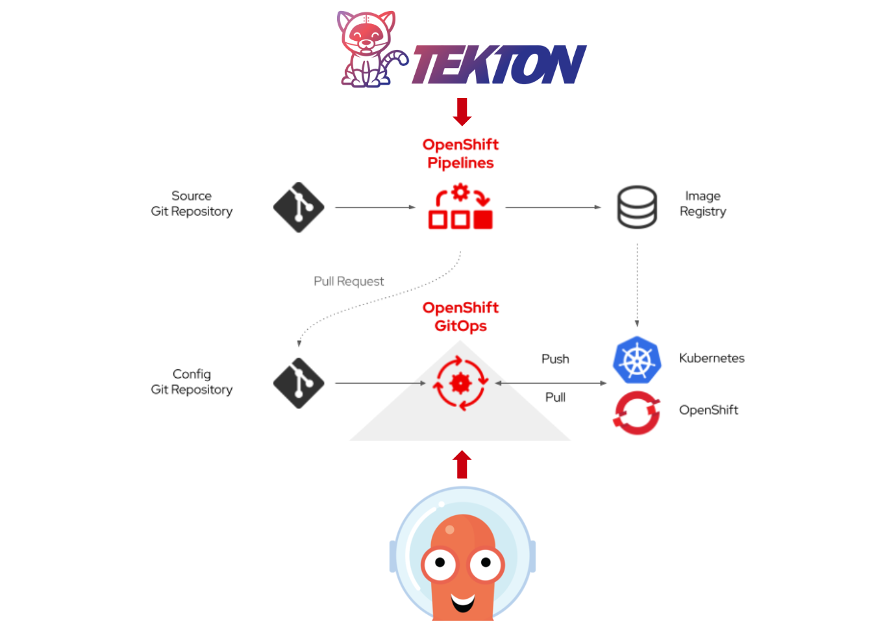

# 云原生持续集成之 Tekton

## 文档目录

- [云原生持续集成之 Tekton](#云原生持续集成之-tekton)
  - [文档目录](#文档目录)
  - [云原生 CI/CD 工具 Tekton 与 ArgoCD 的区别是什么？](#云原生-cicd-工具-tekton-与-argocd-的区别是什么)
  - [Tekton 持续集成概述](#tekton-持续集成概述)
  - [Tekton 基本组件](#tekton-基本组件)
  - [Tekton 命令行工具 tkn](#tekton-命令行工具-tkn)

## 云原生 CI/CD 工具 Tekton 与 ArgoCD 的区别是什么？

- Tekton 负责 CI（持续集成），它的最终产出通常是：
  - 构建好的容器镜像（推送到镜像仓库）
  - 部署所需的 Kubernetes YAML 文件（或者是 Helm Chart、Kustomize 文件等）
- ArgoCD 负责 CD（持续部署），它通过 GitOps 模式，持续监控 Git 仓库中的 YAML 文件（这些 YAML 文件由 Tekton 或其他工具生成），并将这些 YAML 文件所描述的期望状态同步到 Kubernetes 集群中。
- ArgoCD 不直接关注代码本身，它只关注 Git 仓库中的 YAML 文件（或其他 Kubernetes 资源描述文件）。
- GitOps 的实现是通过 ArgoCD 持续监控 Git 仓库中的 YAML 文件，并确保集群状态与 Git 仓库中的描述保持一致。
- Tekton 则是负责生成这些 YAML 文件，并确保它们是经过构建、测试、验证后的 "可部署" 版本。

<center></center>

<center>图例：Tenton 与 ArgoCD 在云原生 CI/CD 工作流中角色</center>

## Tekton 持续集成概述

## Tekton 基本组件

## Tekton 命令行工具 tkn

```bash
$ tkn <type> <command>

$ tkn t list
$ tkn t describe <task_name>
$ tkn t start <task_name>
$ tkn tr list

$ tkn p list
$ tkn p describe <pipeline_name>
$ tkn p start <pipeline_name>
$ tkn pr list
```
