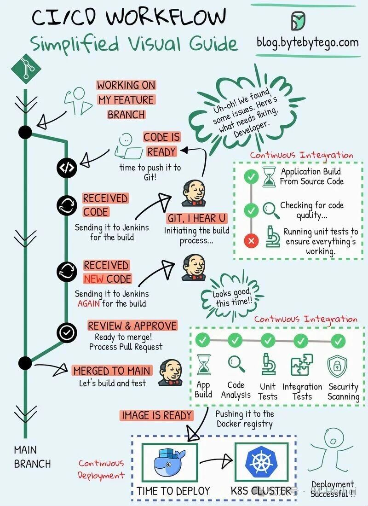
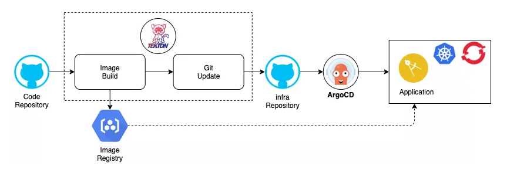
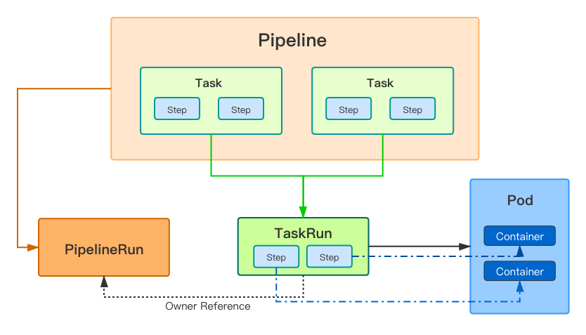
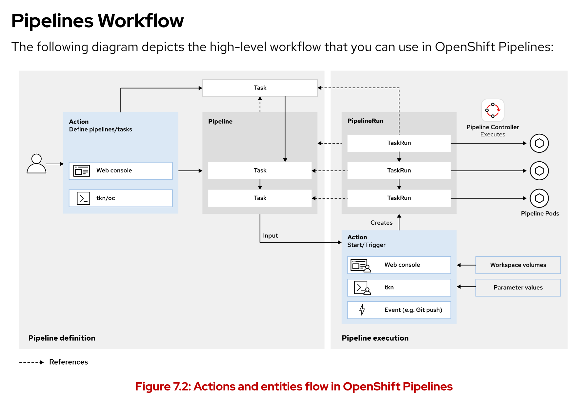

# 🐱 云原生持续集成之 Tekton

## 文档目录

- [🐱 云原生持续集成之 Tekton](#-云原生持续集成之-tekton)
  - [文档目录](#文档目录)
  - [CI/CD 快速回顾](#cicd-快速回顾)
  - [云原生 CI/CD 工具：Jenkins 与 Tekton 的区别？](#云原生-cicd-工具jenkins-与-tekton-的区别)
  - [云原生 CI/CD 工具：Tekton 与 ArgoCD 的区别？](#云原生-cicd-工具tekton-与-argocd-的区别)
  - [Tekton 基本组件](#tekton-基本组件)
    - [基本组件说明](#基本组件说明)
      - [ClusterTask](#clustertask)
      - [Task](#task)
      - [Step](#step)
      - [Pipeline](#pipeline)
      - [TaskRun](#taskrun)
      - [PipelineRun](#pipelinerun)
      - [Parameter](#parameter)
      - [Workspace](#workspace)
      - [Trigger](#trigger)
    - [基本组件间的关系](#基本组件间的关系)
      - [Pipeline 与 Task 的关系](#pipeline-与-task-的关系)
      - [Task 与 Step 的关系](#task-与-step-的关系)
  - [Tekton 的运行方式](#tekton-的运行方式)
  - [Tekton 与 Kubernetes 的关系](#tekton-与-kubernetes-的关系)
  - [Tekton 命令行工具 tkn](#tekton-命令行工具-tkn)
  - [参考链接](#参考链接)

## CI/CD 快速回顾

🤓 一起来看看对 CI/CD 的定义：

Continuous integration and continuous delivery/deployment (CI/CD) are fundamental practices for
DevOps. Cloud and microservices-based architectures involve a high degree of automation and
operational complexity. Implementing DevOps techniques, and in particular, CI/CD, enables fast
delivery cycles, high reliability, short feedback loops, and low lead times.

译文：

- 持续集成和持续交付/部署（CI/CD）是 DevOps 的核心实践。基于云和微服务的架构具有高度的自动化程度和复杂的运营特性。
- 实施 DevOps 技术，尤其是 CI/CD，能够实现快速的交付周期、高可靠性、短反馈周期以及较短的前置时间。

Continuous integration involves the frequent integration and verification of code changes into
the main development branch. Continuous delivery automates the creation of releases, in a way
that the code is always ready for deployment. Continuous deployment automates the deployment
process, so that code changes are available to users quickly and efficiently.

译文：

- 1️⃣ 持续集成（CI）指的是将代码更改频繁地整合并验证到主开发分支中。
- 2️⃣ 持续交付（CD）则通过自动化的方式创建发布版本，确保代码始终处于可部署状态。
- 3️⃣ 持续部署（CD）则将部署过程自动化，使得代码变更能够快速、高效地提供给用户使用。

CI/CD 是通过自动化流程实现软件频繁可靠交付的实践体系，核心流程涵盖 **代码提交 → 自动构建 → 测试验证 → 制品生成 → 多环境部署 → 监控反馈** 等步骤。

- Code Commit：
  - 代码提交
  - 将代码提交至 Git 代码仓库，把本地提交的代码推送至远程 Git 仓库，实现团队协作与版本管理。
- Run Tests：
  - 代码构建：编译代码文件，同时自动解决依赖包（如第三方库、工具类）的引入问题。
  - 将源代码转换为可执行文件或字节码，同步处理项目依赖的下载、适配与整合。
- Static Code Analysis：
  - 执行测试：运行单元测试、集成测试和端到端（E2E）测试，验证代码功能正确性与兼容性。
  - 单元测试：验证单个代码模块（如函数、类）的逻辑准确性
  - 集成测试：检测多个模块协作时的交互是否正常
  - 端到端测试：模拟真实用户操作，验证整个业务流程（如 “登录→下单→支付”）是否通顺。
  - 静态代码分析：通过代码检查工具（Linter）和安全扫描工具，在不运行代码的情况下检测语法错误、代码规范问题及潜在安全漏洞（如硬编码密码、SQL 注入风险）。
  - 运行代码检查工具和安全扫描工具
  - 使用工具（如 ESLint、SonarQube）检查代码风格一致性，通过安全扫描工具（如 MobSF、OWASP ZAP）排查代码中的安全隐患。
- Artifact Creation：
  - 制品生成：将通过测试与分析的代码打包为可部署的制品（如 iOS 的 IPA 包、Android 的 APK 包、后端的 Jar/War 包）
- Package code as deployable artifacts：
  - 将代码打包为可部署制品：按目标环境要求，将代码与依赖资源整合为标准格式的部署包，确保可直接在服务器或设备上运行。
- Deploy to Staging：
  - 部署到预发布环境：将制品发布到预发布（Staging）环境，该环境配置与生产环境一致，用于后续测试验证。
- Release to testing environment：
  - 发布到测试/预发布环境：将代码或制品部署到专门的测试环境，供测试团队开展功能与性能测试。
- Acceptance Testing：
  - 验收测试：运行自动化用户验收测试（UAT）和冒烟测试，验证产品是否满足业务需求与用户使用场景。
- Run automated UAT and smoke tests：
  - 运行自动化用户验收测试和冒烟测试
  - 自动化 UAT：模拟用户视角，自动验证核心业务功能是否符合需求文档。
  - 冒烟测试：快速验证关键功能（如 “应用能否正常启动、核心接口是否可用”），排查致命问题。
- Production Deployment：
  - 生产环境部署：将通过验收测试的制品发布到生产环境，供最终用户使用将代码或制品部署到正式服务环境，确保用户可访问并使用产品功能。
- Monitoring & Feedback：
  - 监控与反馈：跟踪系统运行指标（如响应时间、错误率、服务器负载），同时收集用户使用反馈，用于后续版本优化。

<center></center>

<center>图例： 基于 Jenkins 的 CI/CD 工作流（传统环境/云原生环境）</center>

## 云原生 CI/CD 工具：Jenkins 与 Tekton 的区别？

Jenkins 虽然在 CI/CD 领域作为自动化服务器多年，但在基于云原生与微服务场景中的持续集成工具，Tekton 相比更加适合。

| 对比 | Jenkins | Tekton / OpenShift Pipelines |
| ----- | ----- | ----- |
| **解决方案类型** | 通用型自动化服务器 | 云原生的 CI/CD 解决方案 |
| **架构** | 中心化；控制节点（controller node）在其他工作节点（worker node）上编排作业 | 分布式；Task 作为 Pod 运行 |
| **容器支持** | 需要插件（plug-ins）来支持容器；中心化服务器编排 execution | 容器优先；每个 Step 在 Pod 中的对应容器内执行 |
| **可扩展性** | 基于插件；活跃的 [社区](https://plugins.jenkins.io/) 来支持这些插件 | 可重用的 [Tasks 与 Pipelines](https://hub.tekton.dev/) |
| **Task 实体** | Jenkinsfile 中的 stage 对象 | Task 自定义资源 |
| **Pipeline 实体** | Jenkinsfile 中的 pipeline 对象 | Pipeline 自定义资源 |
| **运行** | Jenkins UI 构建 | PipelineRun/TaskRun |

## 云原生 CI/CD 工具：Tekton 与 ArgoCD 的区别？

- 云原生时代的流水线框架 —— **Tekton**
- Tekton 负责 CI（持续集成），它的最终产出通常是：
  - 构建好的容器镜像（推送到镜像仓库）
  - 部署所需的 Kubernetes YAML 文件（或者是 Helm Chart、Kustomize 文件等）
- ArgoCD 负责 CD（持续部署），它通过 GitOps 模式，持续监控 Git 仓库中的 YAML 文件（这些 YAML 文件由 Tekton 或其他工具生成），并将这些 YAML 文件所描述的期望状态同步到 Kubernetes 集群中。
- ArgoCD 不直接关注代码本身，它只关注 Git 仓库中的 YAML 文件（或其他 Kubernetes 资源描述文件）。
- GitOps 的实现是通过 ArgoCD 持续监控 Git 仓库中的 YAML 文件，并确保集群状态与 Git 仓库中的描述保持一致。
- Tekton 则是负责生成这些 YAML 文件，并确保它们是经过构建、测试、验证后的 "可部署" 版本。

<center></center>

<center>图例：Tenton 与 ArgoCD 在云原生 CI/CD 工作流中角色</center>

## Tekton 基本组件

### 基本组件说明

#### ClusterTask

| 名称 | 功能 |
| ----- | ----- |
| **git-clone** | 从 Git 仓库克隆代码到 Workspace |
| **buildah** | 用 Buildah 构建容器镜像并推送到仓库 |
| **sonarqube-scanner** | 在代码上运行 SonarQube 静态分析 |
| **wait-for-vmi-status** | 等待 KubeVirt 虚拟机实例进入 Running 状态 |
| **disk-virt-customize** | 用 libguestfs 对 PVC 镜像执行 virt-customize |
| **apply-manifests** | 向集群 apply 一组 Kubernetes YAML |
| **update-deployment** | 更新 Deployment 中的镜像版本 |

#### Task

A task represents an action that runs in a **pod**, usually as part of a pipeline, such as testing, or
building your application. A task defines a series of **steps** that run **in order**, as containers that
belong to the task pod.

译文：

- 一个任务代表在容器组中运行的一项操作，通常作为流水线的一部分而存在，比如测试或构建应用程序。
- 一个任务定义了一系列按顺序运行的步骤，这些步骤由属于该任务容器组的容器来执行。
- Task 自定义资源代表了任务

#### Step
  
A step is a single operation that runs as part of a task, such as **executing an npm command or**
**any other script**. Each step is associated with a **container image**, so that the action runs inside
a specific container.

译文：
  
- 一个步骤是指作为任务一部分执行的单个操作，例如执行一个 npm 命令或任何其他脚本。
- 每个步骤都与一个容器镜像相关联，这样操作就会在特定的容器中运行。

#### Pipeline

A pipeline is a **workflow** that consists of tasks. Pipelines dictate the dependencies between tasks, 
such as whether one task should run before another, or whether two tasks can run in parallel. Pipelines
can define Tasks inline or can refer to other Task resources that already exist.

译文：

- 管道是一种由任务组成的工作流程。
- 管道规定了任务之间的依赖关系，比如某个任务是否应在另一个任务之前运行，或者两个任务是否可以并行执行。
- 管道可以将任务直接定义出来，也可以引用已存在的其他任务资源。
- Pipeline 自定义资源代表了管道

#### TaskRun

A task run is a task in the **execution stage**. A task run represents a single execution of a task,
and includes a reference to the corresponding task definition, as well as other inputs, such
as parameter values or storage claims.

译文：

- TaskRun 是一个处于执行阶段的任务。
- 它代表了任务的一次单独执行过程，包含对相应任务定义的引用，以及诸如参数值或存储声明等其他输入信息。

#### PipelineRun

A pipeline run is a pipeline in the **execution stage**. A pipeline run represents a single execution
of a pipeline, and includes a reference to the corresponding pipeline definition, as well as
other inputs, such as parameter values or storage claims.

译文：

- PipelineRun 是处于执行阶段的管道。
- 它代表了管道的一次单独执行过程，它包含了对相应管道定义的引用，以及诸如参数值或存储声明等其他输入信息。
- PipelineRun 创建自定义资源 TaskRun，它运行包含在管道中的任务。

> 注意：
> 
> 1. 通常情况下，不需要手动与 TaskRun 和 PipelineRun 对象交互。
> 2. 比如说，可通过 OpenShift Web 控制台与 tkn 命令行创建任务与管道。OpenShift 管道创建了所需的 TaskRun 和 PipelineRun 对象。
> 3. 若需要对某一次构建运行进行排错，可使用 OpenShift Web 控制台与 tkn 命令行查看构建运行日志。

#### Parameter

The Pipeline and Task resources can declare parameters, such as an environment flag or
a Git branch name. In pipelines and tasks, you can declare parameters by setting properties
such as the name and type of the parameter.

译文：

- 管道和任务资源可以声明参数，例如环境标志或 Git 分支名称。
- 在管道和任务中，可以通过设置诸如参数的名称和类型等属性来声明参数。
- 在 PipelineRun 和 TaskRun 资源中，可以传递管道或任务所需的或支持的参数的值。

#### Workspace

A workspace represents **storage**. Workspaces can be useful for sharing state between tasks, or
as a way to mount or store inputs or outputs.
  
The Pipeline and Task resources can declare workspaces in specific directories inside the
pod. At runtime, the PipelineRun and TaskRun resources define the particular storage
requirements for a workspace, for example, by mapping a workspace to a persistent volume
claim.

译文：

- Workspace 代表的是存储空间。
- Workspace 可用于在任务之间共享状态，或者作为挂载或存储输入输出的途径。
- pipeline 和 task 资源可以在容器内的特定目录中声明工作区。
- 在运行时，PipelineRun 和 TaskRun 资源会定义工作区的特定存储需求，例如，通过将 workspace 映射到持久卷声明（PVC）来实现。
  
> 注意：同一个 Task 中的 Step 不使用 Workspace 共享资源，因为它们运行的容器都在一个 Pod 中，彼此间共享网络命名空间与存储空间。

#### Trigger

Triggers can run tasks and pipelines based on external events, such as a Git push action. You
can define triggers by combining the Trigger, TriggerBinding, and TriggerTemplate
custom resources. Alternatively, you can use the OpenShift web console to streamline the
creation of these resources.
  
When a trigger starts a pipeline or a task, OpenShift Pipelines also creates the corresponding
PipelineRun and TaskRun resources.

译文：

- 触发器能够根据外部事件（例如 Git 推送操作）来运行任务和流程。
- 可以通过组合 Trigger, TriggerBinding, 与 TriggerTemplate 等自定义资源来定义触发器。
- 或者，也可以使用 OpenShift Web 控制台来简化这些资源的创建过程。
- 当触发器启动管道或任务时，OpenShift Pipelines 也会创建相应的 PipelineRun 和 TaskRun 资源。

### 基本组件间的关系

#### Pipeline 与 Task 的关系

- Pipeline 由 Task 组成，两者均为流水线定义 **模板**。
- PipelineRun 由 TaskRun 组成，两者均为流水线运行的 **实例**。

#### Task 与 Step 的关系

- 每个 TaskRun 运行对应一个 Pod
- 每个 Task 中的 Step 对应 Pod 中的各个容器
  - Step 是 Task 中容器内的步骤，可以是一段脚本或命令。
  - 多个 Step 按顺序跑在同一个 Pod 里，共享 Pod 的网络与存储。
  - Step 失败 → Task 失败
  - Step 成功 → 进入下一个 Step
- 可以理解为：Task = Pod；Step = 容器
- 当然，也可只定义 Task + TaskRun 直接运行，如下所示：

```yaml
# 示例1：只定义 Task，未定义 TaskRun。
apiVersion: tekton.dev/v1
kind: Task
metadata:
  name: hello-steps
spec:
  steps:
    - name: step-1        # 第 1 个容器
      image: alpine
      script: echo "step 1"
    - name: step-2        # 第 2 个容器
      image: alpine
      script: echo "step 2"
```

```yaml
# 示例2：同时定义 Task 与 TaskRun
apiVersion: tekton.dev/v1
kind: Task
metadata:
  name: hello-task
spec:
  steps:
    - name: echo
      image: alpine
      script: echo "Hello from Task!"
---
apiVersion: tekton.dev/v1
kind: TaskRun
metadata:
  name: hello-taskrun
spec:
  taskRef:
    name: hello-task
```

```bash
# 无需 Pipeline，TaskRun 自己创建 Pod 并执行。
$ kubectl apply -f task+taskrun.yml
$ kubectl logs -f taskrun/hello-taskrun
```

- 同样，也可只定义 Pipeline + PipelineRun 直接运行，如下所示：

```yaml
# 示例：同时定义 Pipeline 与 PipelineRun
apiVersion: tekton.dev/v1
kind: Pipeline
metadata:
  name: hello-pipeline
spec:
  tasks:
    - name: echo
      taskSpec:
        steps:
          - name: echo
            image: alpine
            script: echo "Hello from Pipeline!"
---
apiVersion: tekton.dev/v1
kind: PipelineRun
metadata:
  name: hello-pipelinerun
spec:
  pipelineRef:
    name: hello-pipeline
```

```bash
# 无需预先定义 Task 对象，PipelineRun 会内联生成 TaskRun 并执行。
$ kubectl apply -f pipeline+pipelinerun.yml
$ kubectl logs -f pipelinerun/hello-pipelinerun
```

- 🎉 两者都是 **“定义+实例”** 一对即可，无需彼此依赖。

<center></center>

<center>图例：Pipeline, PipelineRun, Task, TaskRun, Step 之间在流水线中的关系</center>

## Tekton 的运行方式

- Tekton 在执行 Pipeline 构建时将生成 “临时 Pod” 来承载每个 Step，这些 Pod 会自动附加 Task/Pipeline 中声明的 PVC（或 EmptyDir/ConfigMap 等 Workspace），构建完成后 Pod 被删除，PVC 保留（除非显式设置 ephemeral: true）。
- 当 Task 声明 Workspace 时，Tekton 会把对应的 PVC/EmptyDir/ConfigMap 挂载到 /workspace/<name> 路径，Pod 生命周期与 PVC 生命周期解耦。
- 构建路径：Pod 挂载 PVC → 构建 → Pod 删除 → PVC 保留

<center></center>

<center>图例：OpenShift Pipelines 工作流</center>

## Tekton 与 Kubernetes 的关系

- Tekton 以 CRD（CustomResourceDefinition）+ Operator 形式部署在 Kubernetes 上，只要集群版本 ≥ 1.24，即可通过官方 YAML 或 OperatorHub 一键安装。
- Tekton 从 v0.45 起要求 K8s ≥ 1.24，以 CRD 形式部署。
- 一条 kubectl apply 即可让 Tekton 部署进入集群。

## Tekton 命令行工具 tkn

- tkn 只是 kubectl 的 Tekton 插件，底层通信完全一致。
- tkn 与 kubectl 的区别：

  | 工具 | 作用 | 协议 |
  | ----- | ----- | ----- |
  | **kubectl** | 通用 K8s 操作 | HTTP/HTTPS 到 API Server |
  | **tkn** | **Tekton 专用操作**（Pipeline、Task、PipelineRun 等） | **同一 HTTP/HTTPS 到 API Server** |

- tkn 通过读取 kubeconfig 关联 Kubernetes 集群
- tkn 与 kubectl 共用同一 API Server，协议、凭据、多集群方式完全一致。

```bash
$ tkn <type> <command>

$ tkn t list
$ tkn t describe <task_name>
$ tkn t start <task_name>
$ tkn tr list

$ tkn p list
$ tkn p describe <pipeline_name>
$ tkn p start <pipeline_name>
$ tkn pr list
```

> 说明：关于 Kubernetes 与 OpenShift 中 Operator 的版本信息
> 
> 1. csv 是 `ClusterServiceVersion` 的缩写
> 2. 它是 Operator Lifecycle Manager (OLM) 中的核心资源，代表某个 Operator 的 “安装包” 版本（包含 Deployment、RBAC、CRD 等清单）。
> 3. 用 oc get csv 即可查看集群里已安装的所有 Operator 及其版本
> 4. csv = ClusterServiceVersion = Operator 安装包版本

## 参考链接

- [Tekton docs | Tekton](https://tekton.dev/docs/)
- [Tektoncd Operator | operatorhub.io](https://operatorhub.io/operator/tektoncd-operator)
- 🎉 [Tasks and Pipelines | Tekton](https://tekton.dev/docs/pipelines/)
- 🎉 [Concept model | Tekton](https://tekton.dev/docs/concepts/concept-model/)
- [CLI | Tekton](https://tekton.dev/docs/cli/)
- 🔎 [Tekton Hub](https://hub.tekton.dev/)
- [Chapter 3. Understanding OpenShift Pipelines | OpenShift docs](https://docs.redhat.com/en/documentation/red_hat_openshift_pipelines/1.14/html-single/about_openshift_pipelines/index#understanding-openshift-pipelines)
- 🎞️ [OpenShift Pipelines Tutorial using Tekton | Youtube](https://www.youtube.com/watch?v=pMDiiW1UqLo)
- 🎞️ [OpenShift Pipelines Demo | Youtube](https://www.youtube.com/watch?v=2lLqP8FeSPs)
- 👍 [redhat-appdev-practice/tekton-lab | GitHub](https://github.com/redhat-appdev-practice/tekton-lab)
- 👍 [openshift/pipelines-tutorial | GitHub](https://github.com/openshift/pipelines-tutorial)
