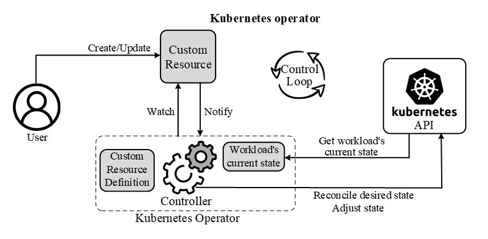
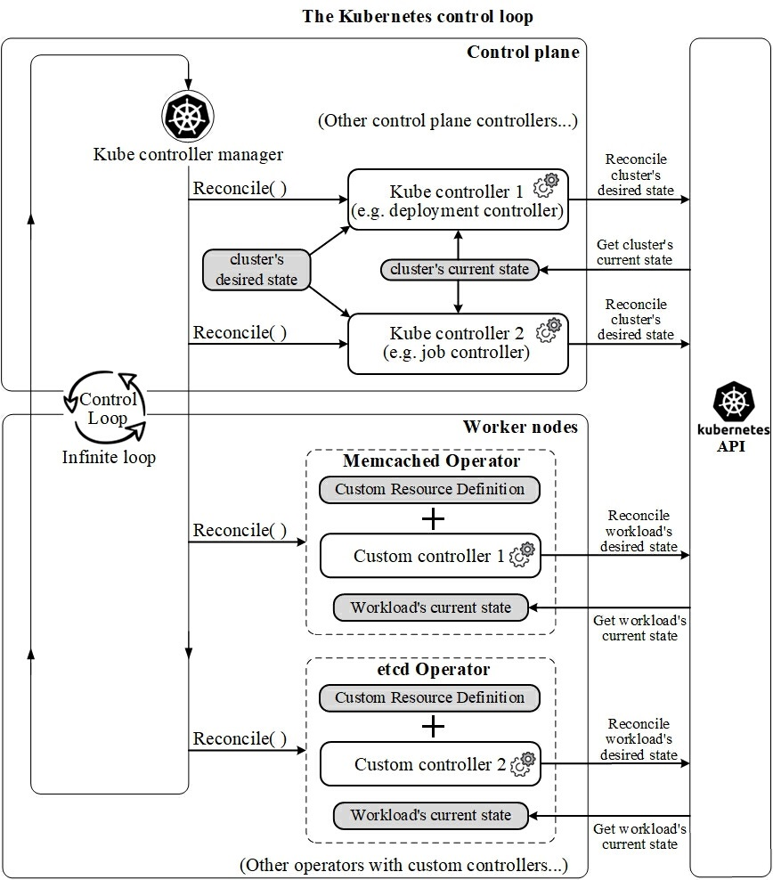

# 解析 Kubernetes Operator 工作原理

## 1. 概述

在以 Kubernetes 为事实标准的云原生环境中，Kubernetes Operator 是强有力的工具，籍此，Kubernetes 集群得以充分扩展功能。
基于以下两图，本文简述了 Operator、Controller 和 Custom Resources（自定义资源）的协同工作机制。

## 2. Kubernetes Operator 的工作原理

Kubernetes 为集群管理提供了一个强大的 API，包括用于部署应用程序的 Pod、Jobs 和 Deployments。然而，在许多情况下，标准 API 是不够的，还需要额外的抽象级别及增强的功能。通过在 Kubernetes 中定义和管理应用程序和服务作为独立的自定义资源，`Kubernetes Operator` 模式（pattern）解决了这一问题，这也是有助于实现可重用性和降低整体复杂性的技术机制。
Operator 模式的实现是由特定于域的控制器实现的，这些控制器监控 Custom Resources（自定义资源）的生命周期。这种控制器不断地将当前状态与环境所期望之状态进行比对和同步，以便对 Kubernetes集群进行必要的更改。这一技术概念被称为 `Control Loop`（控制循环）或 `Reconciliation Loop`（调谐循环），为便于有效地叙述，本文使用更为中文化的名称：控制回路。

Kubernetes 项目对 "Operator" 的定义很简单：“Operator 是使用自定义资源来管理应用程序及其组件的软件扩展（software extensions）”。换句话说，使用 Operator 使我们能够将应用程序视为单个对象，该对象仅公开对应用程序有意义的调整，而不是一组原语（primitives，例如 Pod、Deployments、Services 或 ConfigMaps）。
此外，对于运行在 Kubernetes 集群中的软件，Operator 允许自动执行典型的 Day-1 任务（安装、配置等）和 Day-2 任务（重新配置、升级、备份、故障转移、恢复等），并与 Kubernetes 概念和 APIs 进行原生集成。
这些应用工具被称为 “原生 Kubernetes 应用程序”，而这一定义也可以从另一个更具操作性的角度去理解：Kubernetes Operator 是用于在 Kubernetes 上打包、管理和部署应用程序的控制器。为了完成这些工作，用户建立和更新自定义资源 (`Custom Resources`，CR)，形成自定义资源定义（`Custom Resource Definitions`，CRD）的形式，落实在 Kubernetes Operator 中并在环境中生效，以此，定义对特定应用程序的配置和状态（configuration and state）的期望。

🚀 简而言之，Kubernetes Operator 的作用是：致力于将应用程序的实际状态与 CRD 所期望的状态进行协调，使用控制回路对应用程序进行自动扩展、更新或重新启动。为此，Kubernetes 提供了基本命令和原语（primitives），Operator 可用之以定义更复杂的操作。
综上所述，Operator 是在集群中运行的实际程序，通过 Kubernetes API 进行交互，以此，对超出 Kubernetes 自身掌控之原生功能范畴的复杂功能进行自动化。

## 3. 用 Kubernetes Operator 实现状态调整

在机器人和自动化的应用中，控制回路是指一个永不休止的循环，用于调节系统状态。这一含义被映射到 Kubernetes 中，每个控制器是一个控制回路，通过 API 服务器监视集群的共享状态，并尝试进行更改以将当前状态转为期望状态。

实际上，Kubernetes 在其核心 API 中就使用了这种控制回路模式，Kubernetes 控制器管理器（kube-controller-manager）是一个守护进程，内嵌Kubernetes 的核心控制回路。

与 Kubernetes 一样，应用架构的实践者希望可以定义 Custom Resources，编写特定的控制器以理解声明式的自定义资源执行技术调整达成期望状态，Kubernetes Operator 正践行了这一理念。

在 Kubernetes 中，control plane（控制平面）中的控制器运行在一个控制回路（Control Loop）中，该回路持续不断地比对集群的期望状态和当前状态。如果状态不相匹配，则控制器采取行动调整当前状态，使其更接近于期望状态。

类似地，隶属于 Kubernetes Operator 的控制器监视（watches）相关的 Custom Resources（自定义资源）类型，并采取特定于应用程序的操作，使工作负载（workload）的当前状态与用户在 Custom Resources 中表达的期望状态相匹配。

以上图表说明了 control plane 如何在一个回路中运行各个控制器，其中一些控制器原生内置于 Kubernetes 中，如，deployment controller 和 job controller，而另一些则是属于 Kubernetes Operator 的一部分，如，Custom controller 1 属于 Memcached Operator，而 Custom controller 2 则属于 etcd Operator。

control plane 的控制器针对无状态（Stateless）工作负载（workloads）进行了优化，一组控制器即可适用于所有的无状态工作负载，因为它们都是相似的。隶属于某个 Kubernetes Operator 的控制器都是为特定的有状态（Stateful）工作负载而定制的。每个有状态的工作负载都有各自的 Operator 及其隶属控制器，这些控制器了解如何管理该工作负载。

## 参考链接

- [Operator SDK](https://sdk.operatorframework.io/)
- [RedHat Doc: Operators](https://docs.redhat.com/en/documentation/openshift_container_platform/4.14/html-single/operators/index#operators-overview)
