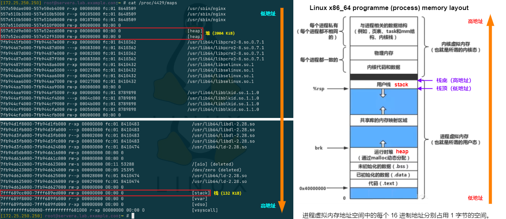

# 🪄 Linux 内核内存管理集锦

## 文档目录

- [🪄 Linux 内核内存管理集锦](#-linux-内核内存管理集锦)
  - [文档目录](#文档目录)
  - [堆与栈的基本特点](#堆与栈的基本特点)
  - [内存寻址空间](#内存寻址空间)
  - [📜 Linux 内存管理中的段、逻辑地址、线性地址](#-linux-内存管理中的段逻辑地址线性地址)
    - [Linux 在 x86 的内存管理演进](#linux-在-x86-的内存管理演进)
    - [段、逻辑地址、线性地址、物理地址转换流程](#段逻辑地址线性地址物理地址转换流程)
  - [🔬 Linux 用户空间进程虚拟内存布局（layout）](#-linux-用户空间进程虚拟内存布局layout)
  - [Linux 匿名页释义](#linux-匿名页释义)
  - [参考链接](#参考链接)

## 堆与栈的基本特点

- 队列（queue）：
  - 特点：先进先出
- 堆（heap）：
  - 功能：一般由程序员分配释放，若程序员不释放，程序结束时可能由操作系统回收，分配方式类似于数据结构中的 **链表**。堆是在程序运行时，而不是在程序编译时，申请某个大小的内存空间（申请的动态内存）。
  - 特点：队列优先，先进先出（FIFO - first in first out）
- 栈（stack）：
  - 功能：由操作系统自动分配释放，存放函数的参数值，局部变量的值等。其操作方式类似于数据结构中的栈。
  - 特点：先进后出（FILO—First-In/Last-Out）

## 内存寻址空间

- CPU 字长决定了可寻址的内存空间大小，32 位CPU 最大寻址空间是 2^32 = 4GiB；64 位CPU 最大可寻址空间是 2^64，由于在当前这个空间过于庞大，所以 64 位 CPU 只会用到地址空间一部分，具体根据系统和平台有所差异。
- 系统的最大地址空间跟系统拥有的可用物理内存大小无关，所以称为虚拟内存。
- 虚拟内存被划分为 **内核空间** 和 **用户空间**，32 与 64 位系统普遍采用低地址段为用户空间（user space）, 高地址段为内核空间（Kernel Space）。
- 一个十六进制内存地址可以存储 8 个数据位（bit），即 1 个字节（byte）。

  > 注意：（内存结束地址 - 内存初始地址）换算成十进制后 = 多少个字节（Byte）

- CPU 寻址 16 位：4 位十六进制最大到 FFFF 换算成十进制为 65536，也就是 65536 = B = 64 MB。
- CPU 寻址 32 位：8 位十六进制最大到 FFFF FFFF 换算成十进制为 4294967296B = 4194304KB = 4096MB = 4GB
- CPU 寻址 64 位：16 位十六进制最大到 FFFF FFFF FFFF FFFF 换算成十进制为 1.844674407371e19B = 1.801439850948e16KB = 17592186044416MB = 17179869184GB

## 📜 Linux 内存管理中的段、逻辑地址、线性地址

### Linux 在 x86 的内存管理演进

- 分段机制（历史遗留包袱）：
  - 在 32 位 x86（IA-32）时代，CPU 先通过 **段选择子 + 偏移量** 计算出线性地址，再通过页表转换为物理地址。
  - **<font color=orange>公式：线性地址 = 段基址 + 偏移量</font>**
- 现代 Linux 在 x86_64 的 **平坦模型（Flat Memory Model）**：
  - 逻辑地址：
    - “段选择子:偏移量” 组成的二元组
    - 段选择子在程序中不可见，偏移量在汇编程序中可见。

    > 说明：
    >
    > 1. 硬件把所有段的基址都设为 0：所有段的描述符 base=0
    > 2. 限长设为最大：段限长 = 4GB（32位）或 64T（64位）
    > 3. 段负责将逻辑地址转换为线性地址
    > 4. 逻辑上绕过了段机制，但硬件上依然走段机制的流程，只是结果做恒等映射，这意味着逻辑地址中的偏移量直接等于线性地址。
    > 5. 因此，在 x86_64 下 Linux 已不再使用 **段（segment）** 管理地址，**<font color=orange>段只起恒等映射作用，既不参与地址分配，也不提供隔离。</font>**

  - 线性地址：
    - 也称为虚拟地址
    - 平坦模型：逻辑地址 = 偏移量 = 线性地址（恒等映射，段部件不做任何算术）

### 段、逻辑地址、线性地址、物理地址转换流程

```plaintext
汇编指令中的地址表示（如 mov %rax, 0x804a000，其中 0x804a000 为偏移量）
  ↓
"段选择子 : 偏移量"  ← 逻辑地址
  ↓
CPU 用段选择子查 GDT/LDT → 得到段基址 base=0（恒等映射）
  ↓
线性地址（单一数值）= 段基址 + 偏移量 = 0 + 偏移量 ← C 语言中的获得的地址是偏移量（如 &p 取地址操作获得的地址）
  ↓
MMU 查页表
  ↓
物理地址
```

- 所有 “虚拟地址空间” 的划分、保护、换入、换出完全由页表（页机制）包办。
- 因此，用户代码里看到的地址就是线性地址（也是偏移量），Linux 只通过 **四级/五级页表** 把它映射到物理页。
- “分段” 在 64-bit Linux 中名存实亡，所有线性地址到物理地址的转换完全由分页机制完成。

## 🔬 Linux 用户空间进程虚拟内存布局（layout）

- Linux 内核使用分页机制实现进程虚拟内存地址、线性内存地址至物理内存地址的转换，而虚拟内存地址的分段信息可在 `/proc/<pid>/maps` 中确定，如下图所示。

  <center></center>
  
  `/proc/<pid>/maps` 中的 16 进制虚拟内存地址从显示的低地址位向高地址位扩展，并且在连续的地址空间之间为了保证数据安全性存在一定的 `gap` 区域，而右侧示意图中显示除了进程自身的虚拟内存地址空间外，还存在内核虚拟内存地址空间，两者共同协作完成进程所需执行的任务。

- Linux 中堆内存（heap）的分配调用关系：

  | 操作 | 调用链 | 是否进入内核 |
  | ----- | ----- | ----- |
  | 小内存分配（堆够用） | `malloc` → `ptmalloc` → 空闲链表 | ❌ 纯用户空间 |
  | 小内存分配（堆不够） | `malloc` → `ptmalloc` → `brk` | ✅ 系统调用 |
  | 大内存分配 | `malloc` → `ptmalloc` → `mmap` | ✅ 系统调用 |
  | 小内存释放 | `free` → `ptmalloc` → 插入空闲链表 | ❌ 不归还内核 |
  | 大内存释放 | `free` → `ptmalloc` → `munmap` | ✅ 立即归还 |
  | 强制回收堆内存 | `malloc_trim(0)` → `brk`（缩小） | ✅ 可选 |

- 对于指定进程的全部状态信息可在 `/proc/<pid>/status` 文件中查看，如上述进程的栈（stack）大小为 132 KiB（占 33 个 page）。
  
  ```bash
  $ sudo grep VmStk /proc/4429/status
    VmStk:       132 kB
  ```

## Linux 匿名页释义

在 Linux 中，匿名页（Anonymous Page）是一种特殊类型的内存页，它在内核中用于匿名（无关联文件）的内存映射。匿名页通常用于存储进程的堆（heap）和栈（stack）等动态分配的数据。

以下是关于匿名页的一些重要含义：

- 无关联文件：匿名页不与任何磁盘文件关联。它们用于临时存储进程的运行时数据，如动态分配的内存、函数调用栈等。与之相反，与文件关联的页被称为文件页。
- 内存映射：匿名页通过内存映射机制将物理内存映射到进程的虚拟地址空间。这样，进程可以直接访问匿名页，而无需关心具体的物理内存位置。
- 内存分配：匿名页通常通过系统调用（如 `mmap()` 或 `sbrk()`）或 C 库函数（如 `malloc()`）进行动态分配。当进程请求分配匿名页时，内核会为其分配一块虚拟地址空间，并在需要时触发缺页异常分配物理内存。
- 页面置换：如果系统内存不足，匿名页可能会被交换（换出 swapout）到交换分区（Swap）中，以腾出物理内存供其他进程使用。当进程再次访问被交换的匿名页时，它将被交换回物理内存。
- 内存释放：当进程不再需要匿名页时，它可以通过相应的系统调用（如 `munmap()` 或 `free()`）释放这些页。内核将回收这些页的物理内存，并将其标记为可再分配。

匿名页在进程的运行中起着重要的作用，特别是在动态内存分配和堆栈操作方面。通过使用匿名页，进程可以方便地进行内存管理和动态数据存储，而无需关心具体的物理内存位置和文件关联。

## 参考链接
