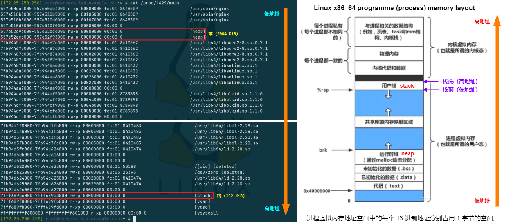

# 🩺 Linux 内核内存管理集锦

## 文档目录

- [🩺 Linux 内核内存管理集锦](#-linux-内核内存管理集锦)
  - [文档目录](#文档目录)
  - [🔮 Linux 虚拟内存管理](#-linux-虚拟内存管理)
    - [内存寻址空间](#内存寻址空间)
    - [队列、堆、栈的基本特点](#队列堆栈的基本特点)
    - [内存管理：段、逻辑地址、线性地址](#内存管理段逻辑地址线性地址)
      - [⏳ x86 体系中 Linux 的内存管理演进](#-x86-体系中-linux-的内存管理演进)
      - [平坦模型：段、逻辑地址、线性地址、物理地址转换流程](#平坦模型段逻辑地址线性地址物理地址转换流程)
    - [🔬 Linux 用户空间进程虚拟内存布局（layout）](#-linux-用户空间进程虚拟内存布局layout)
      - [✒️ /proc/\[pid\]/maps 解读](#️-procpidmaps-解读)
      - [堆内存（heap）的分配调用关系](#堆内存heap的分配调用关系)
      - [✏️ /proc/\[pid\]/status 解读](#️-procpidstatus-解读)
    - [🔥 内核自身运行的虚拟内存与用户空间程序运行所在的虚拟内存的区别](#-内核自身运行的虚拟内存与用户空间程序运行所在的虚拟内存的区别)
  - [🔖 Linux 中进程页表的类型](#-linux-中进程页表的类型)
    - [页表类型的使用确认](#页表类型的使用确认)
    - [4级 vs 5级页表的比较：寻址空间](#4级-vs-5级页表的比较寻址空间)
    - [4级 vs 5级页表的比较：页表结构](#4级-vs-5级页表的比较页表结构)
    - [各级页表转换涉及的数据结构与函数](#各级页表转换涉及的数据结构与函数)
    - [CR3 寄存器中的物理地址变化](#cr3-寄存器中的物理地址变化)
  - [🧩 Linux 物理内存管理](#-linux-物理内存管理)
    - [自顶向下：物理内存划分图谱](#自顶向下物理内存划分图谱)
    - [🔥 内核如何为自己分配物理内存？如何为用户空间进程分配物理内存？](#-内核如何为自己分配物理内存如何为用户空间进程分配物理内存)
    - [🔇 Linux 匿名页释义](#-linux-匿名页释义)
  - [♻️ 物理内存分配与回收](#️-物理内存分配与回收)
    - [物理内存写回（write）与回收释放（reclaim）](#物理内存写回write与回收释放reclaim)
      - [引入：sar -B 命令的两个指标 pgscank/s 与 pgscand/s 与刷盘内核参数](#引入sar--b-命令的两个指标-pgscanks-与-pgscands-与刷盘内核参数)
      - [内核脏页写回机制](#内核脏页写回机制)
      - [内存回收机制（与写回解耦）](#内存回收机制与写回解耦)
    - [swap 换出与换入前后的物理页面变化](#swap-换出与换入前后的物理页面变化)
  - [参考链接](#参考链接)

## 🔮 Linux 虚拟内存管理

### 内存寻址空间

- CPU 字长（word）决定了可寻址的内存空间大小，32 位 CPU 最大寻址空间是 2^32 = 4GiB（2^32/2^30GiB），64 位CPU 最大可寻址空间是 2^64，由于在当前这个空间过于庞大，所以 64 位 CPU 只会用到地址空间一部分，具体根据系统和平台有所差异。
- 系统的最大地址空间跟系统拥有的可用物理内存大小无关，所以称为虚拟内存。
- 虚拟内存被划分为 **内核空间** 和 **用户空间**，32 与 64 位系统普遍采用低地址段为用户空间（user space）, 高地址段为内核空间（kernel space）。
- 一个十六进制内存地址可以存储 8 个数据位（bit），即 1 个字节（byte）。
- ✏️ 公式：**内存结束地址 - 内存初始地址 ➡ 换算成十进制后 ➡ 多少个字节（Byte）**
- CPU 寻址 16 位：4 位十六进制最大到 FFFF 换算成十进制为 65536，也就是 65536 = B = 64 MiB。
- CPU 寻址 32 位：8 位十六进制最大到 FFFF FFFF 换算成十进制为 4294967296B = 4194304KB = 4096MB = 4GiB
- CPU 寻址 64 位：16 位十六进制最大到 FFFF FFFF FFFF FFFF 换算成十进制为 1.844674407371e19B = 1.801439850948e16KB = 17592186044416MB = 17179869184GB

### 队列、堆、栈的基本特点

- 队列（queue）：
  - 特点：先进先出
- 堆（heap）：
  - 功能：一般由程序员分配释放，若程序员不释放，程序结束时可能由操作系统回收，分配方式类似于数据结构中的 **链表**。堆是在程序运行时，而不是在程序编译时，申请某个大小的内存空间（申请的动态内存）。
  - 特点：队列优先，先进先出（FIFO - first in first out）
- 栈（stack）：
  - 功能：由操作系统自动分配释放，存放函数的参数值，局部变量的值等。其操作方式类似于数据结构中的栈。
  - 特点：先进后出（FILO—First-In/Last-Out）

### 内存管理：段、逻辑地址、线性地址

#### ⏳ x86 体系中 Linux 的内存管理演进

- 分段机制（历史遗留包袱）：
  - 在 32 位 x86（IA-32）时代，CPU 先通过 **段选择子 + 偏移量** 计算出线性地址，再通过页表转换为物理地址。
  - **<font color=red>公式：线性地址 = 段基址 + 偏移量</font>**
- 现代 Linux 在 x86_64 的 **平坦模型（Flat Memory Model）**：
  - 逻辑地址：
    - “段选择子:偏移量” 组成的二元组
    - 段选择子在程序中不可见，偏移量在汇编程序中可见。
    - 硬件把所有段的基址都设为 0：所有段的描述符 base=0
    - 限长设为最大：段限长 = 4GB（32位）或 64T（64位）
    - 段负责将逻辑地址转换为线性地址
    - 逻辑上绕过了段机制，但硬件上依然走段机制的流程，只是结果做恒等映射，这意味着逻辑地址中的偏移量直接等于线性地址。
    - 因此，在 x86_64 下 Linux 已不再使用 **段（segment）** 管理地址，**<font color=red>段只起恒等映射作用，既不参与地址分配，也不提供隔离。</font>**
  - 线性地址：
    - 也称为虚拟地址
    - 平坦模型：逻辑地址 = 偏移量 = 线性地址（恒等映射，段部件不做任何算术）
    - 程序中可获得的地址即为线性地址

#### 平坦模型：段、逻辑地址、线性地址、物理地址转换流程

```plaintext
汇编指令中的地址表示（如 mov %rax, 0x804a000，其中 0x804a000 为偏移量）
  ↓
"段选择子 : 偏移量"  ← 逻辑地址
  ↓
CPU 用段选择子查 GDT/LDT → 得到段基址 base=0（恒等映射）
  ↓
线性地址（单一数值）= 段基址 + 偏移量 = 0 + 偏移量 ← C 程序中获得的地址是偏移量（如 &p 取地址操作获得的地址）
  ↓
MMU 查页表
  ↓
物理地址
```

所有 “虚拟地址空间” 的划分、保护、换入、换出完全由页表（页机制）包办。</br>
“分段” 在 64 位 Linux 中名存实亡，所有线性地址到物理地址的转换完全由分页机制完成。</br>

以下示例演示程序中变量的逻辑地址与线性地址的对应关系：

```c
// file: cal_logical_addr.c

#include <stdio.h>

int global_var = 40;

int main() {
    unsigned long offset;
    unsigned short seg_selector;
    unsigned long seg_base = 0;    // 平坦模型下段基址为 0
    unsigned long linear_addr;

    // 获取逻辑地址的两个组成部分(段选择子:偏移量)
    __asm__ volatile (
        "lea %1, %0"
        : "=r" (offset)
        : "m" (global_var)
    );
    // __asm__ 表示 C 语言中的内联汇编
    // volatile 表示禁止编译器优化此代码，保持汇编原样
    // %1, %0 分别代表占位符，对应内存(m)中的 global_var 变量作为输入，
    // 以及进入通用寄存器(=r)的 offset 偏移量作为输出

    __asm__ volatile (
        "mov %%ds, %0"
        : "=r" (seg_selector)
    );
    // %%ds 转义表示 DS 段寄存器
    // seg_selector 变量作为输入，存储由 DS 提供的段选择子

    // 线性地址 = 段基址 + 偏移量
    // 平坦模型下：seg_base = 0，所以 linear_addr = offset
    linear_addr = seg_base + offset;

    printf("global_var 的地址分析：\n");
    printf("  逻辑地址 = 0x%04x:0x%lx\n", seg_selector, offset);
    printf("  段基址   = 0x%lx (平坦模型为 0)\n", seg_base);
    printf("  线性地址 = 0x%lx + 0x%lx = 0x%lx\n",
           seg_base, offset, linear_addr);

    return 0;
}
```

```bash
$ gcc -o cal_logical_addr cal_logical_addr.c
$ ./cal_logical_addr
global_var 的地址分析：
  逻辑地址 = 0x0000:0x60102c
  段基址   = 0x0 (平坦模型为 0)
  线性地址 = 0x0 + 0x60102c = 0x60102c
```

### 🔬 Linux 用户空间进程虚拟内存布局（layout）

#### ✒️ /proc/[pid]/maps 解读

Linux 内核使用分页机制实现进程的逻辑地址、线性地址至物理地址的转换，而线性地址的分段信息可在 `/proc/[pid]/maps` 中确定，如下图所示。

<center></center>
  
`/proc/[pid]/maps` 中的 16 进制线性地址从显示的低地址位向高地址位扩展，并且在连续的地址空间之间为了保证数据安全性存在一定的 `gap` 区域，而右侧示意图中显示除了进程自身的线性地址空间外，还存在内核线性内存地址空间，两者共同协作完成进程所需执行的任务。

在 Linux 中进程的线性内存分段的映射位于 `/proc/[pid]/maps` 文件中，计算方法如下所示：
  
```bash
$ sudo cat /proc/[pid]/maps | \
  awk '{print $1}' | \
  awk -F'[-]' '{ s=strtonum("0x"$1); e=strtonum("0x"$2); sum+=e-s } END { print sum/1024 }'
# 统计指定进程的虚拟内存地址空间中的地址数量，每个地址对应 1 字节。
# 以上命令返回的单位为 KiB
```

#### 堆内存（heap）的分配调用关系

| 操作 | 调用链 | 是否进入内核 |
| ----- | ----- | ----- |
| 小内存分配（堆够用） | `malloc` → `ptmalloc` → 空闲链表 | ❌ 纯用户空间 |
| 小内存分配（堆不够） | `malloc` → `ptmalloc` → `brk` | ✅ 系统调用 |
| 大内存分配 | `malloc` → `ptmalloc` → `mmap` | ✅ 系统调用 |
| 小内存释放 | `free` → `ptmalloc` → 插入空闲链表 | ❌ 不归还内核 |
| 大内存释放 | `free` → `ptmalloc` → `munmap` | ✅ 立即归还 |
| 强制回收堆内存 | `malloc_trim(0)` → `brk`（缩小） | ✅ 可选 |

对于指定进程的全部状态信息可在 `/proc/[pid]/status` 文件中查看，如上述进程的栈（stack）大小为 132 KiB（占 33 个 page）。
  
```bash
$ sudo grep VmStk /proc/4429/status
  VmStk:       132 kB
```

#### ✏️ /proc/[pid]/status 解读

### 🔥 内核自身运行的虚拟内存与用户空间程序运行所在的虚拟内存的区别

- Linux 内核永远跑在 **高地址、特权级、固定映射** 的那一段内存里；所有用户态进程只能呆在 **低地址、非特权、按需映射** 的另一半。两边用页表+特权级完全隔离，互不干扰。
  
  | 维度 | 内核空间 (Kernel Space) | 用户空间 (User Space) |
  | ----- | ----- | ----- |
  | **虚拟地址范围** | x86_64：ffff 8000 0000 0000 以上（128 TiB 高地址）<br>x86-32：0xC000 0000 ~ 0xFFFF FFFF（高 1 GB）| x86_64：0000 0000 0000 0000 ~ 0000 7FFF FFFF FFFF（128 TiB 低地址）<br>x86-32：0x0000 0000 ~ 0xBFFF FFFF（低 3 GB）|
  | **特权级** | Ring 0，可直接执行特权指令、访问所有硬件寄存器 | Ring 3，任何 I/O 或特权指令都会触发 #GP → 进入内核 |
  | **页表** | 所有进程共享一份 “主内核页表”；当 CPU 运行在 Ring 0 时，页表项 PGD 高位恒映射内核 | 每个进程独立一份用户页表；切进程 ⇒ 切 CR3 ⇒ 切换用户页表，但高位内核映射不变 |
  | **物理内存来源** | 启动早期一次性把低端物理页“线性映射”到高地址；高端内存临时用 `kmap` | 通过 `brk/mmap` 向伙伴系统申请，按需建立/撤销映射，可换出到 swap |
  | **内存保护** | 页表始终可读可写；没有 page-fault 换出概念（swappable=No）| 页表项有 R/W/X、Dirty/Accessed、swap 位；可被换出、写保护、COW |
  | **异常/中断** | 自己处理自己；中断向量表、IDT、TSS 都在内核段 | 任何中断/异常 CPU 自动切到 Ring 0 入口，内核保存用户寄存器后处理 |

- 32 位内核的 高端内存（HIGHMEM）是内核自己也要临时映射才能访问的 “用户可用物理页”；64 位因地址空间巨大，已取消 HIGHMEM。
- 用户调用 read()、malloc() 等库函数时，CPU 通过 syscall/sysenter 指令从 Ring 3 跳到 Ring 0，栈也瞬间切换到内核栈；返回时再用 sysret/iret 回到 Ring 3，继续跑用户代码。</br>
- cat /proc/[pid]/maps 只能看到用户地址；sudo cat /proc/kallsyms 才能看到内核符号地址，印证了 “用户看不见内核”。
- 总结：
  - 用户空间 = 低地址 + Ring 3 + 按需映射
  - 内核空间 = 高地址 + Ring 0 + 永远映射
- 两边地址空间重叠但权限隔离，用户态永远触碰不到内核那半张页表。

## 🔖 Linux 中进程页表的类型

### 页表类型的使用确认

确认系统中是否使用 5 级页表：

```bash
### 第1步 ###
$ sudo grep CONFIG_X86_5LEVEL /boot/config-$(uname -r)
CONFIG_X86_5LEVEL=y
# 确认内核编译是否支持 5 级页表

### 第2步 ###
$ sudo grep la57 /proc/cpuinfo
# 返回 la57 表示 CPU 支持且 BIOS/内核启用了 5 级页表，反之表示仅使用 4 级页表。
```

### 4级 vs 5级页表的比较：寻址空间

| 项目 | 4级页表 | 5级页表 |
| ----- | ----- | ----- |
| 虚拟地址位数 | 48位（实际使用） | 57位（实际使用） |
| 可寻址虚拟空间 | 2^48 = **256 TB** | 2^57 = **128 PB** |
| 用户空间 | 128 TB（地址空间 0x0000_0000_0000_0000 ~ 0x0000_7FFF_FFFF_FFFF） | 64 PB |
| 内核空间 | 128 TB（地址空间 0xFFFF_8000_0000_0000 ~ 0xFFFF_FFFF_FFFF_FFFF） | 64 PB |
| **物理地址位数** | 46位 | 52位 |
| **物理内存上限** | 2^46 = **64 TB**（由页表结构决定） | 2^52 = **4 PB** |

**重要说明：** 由于四级页表的物理内存上限为 64TB，对数据中心中大内存的服务器而言需要突破此限制，而非虚拟地址位数不够造成，因此采用五级页表线性地址至物理地址的转换。

### 4级 vs 5级页表的比较：页表结构

| 特性 | 4级页表 (LA48) | 5级页表 (LA57) |
| ----- | ----- | ----- |
| **PGD Index 位** | bit 47-39 (9 bits) | bit 56-48 (9 bits) |
| **新增 P4D** | ❌ 无 | ✅ bit 47-39 |
| **PUD Index** | bit 38-30 | bit 38-30 |
| **PMD Index** | bit 29-21 | bit 29-21 |
| **PTE Index** | bit 20-12 | bit 20-12 |
| **Page Offset** | bit 11-0 | bit 11-0 |
| **符号扩展位** | bit 63-48 = bit 47 | bit 63-57 = bit 56 |
| **内核 PGD 项** | PGD\[0x1FF] (bit 47=1) | PGD\[0x1FF] (bit 56=1) |
| **PAGE\_OFFSET** | 0xFFFF\_8000\_0000\_0000 | 0xFF80\_0000\_0000\_0000 |

5级页表从 CR3 出发，经 PGD[bit 56-48] → P4D[bit 47-39] → PUD[bit 38-30] → PMD[bit 29-21] → PTE[bit 20-12]，最终合成 物理地址 = PTE_pfn + Offset[bit 11-0]。新增 P4D 级使虚拟地址从 48 位扩展到 57 位，内核直接映射区基址变为 0xFF80_0000_0000_0000，各级页表索引位整体上移 9 位。

### 各级页表转换涉及的数据结构与函数

| 宏/函数 | 定义文件 | 用途 |
| ----- | ----- | ----- |
| `pgd_offset` | `include/linux/pgtable.h` | 获取 PGD 表项地址 |
| `pud_offset` | `include/linux/pgtable.h` | 获取 PUD 表项地址 |
| `pmd_offset` | `include/linux/pgtable.h` | 获取 PMD 表项地址 |
| `pte_offset_kernel` | `include/linux/pgtable.h` | 获取 PTE 表项地址 |
| `pgd_index` / `pud_index` / `pmd_index` / `pte_index` | `arch/x86/include/asm/pgtable_64_types.h` | 计算各级索引 |
| `__va(x)` | `arch/x86/include/asm/page.h` | 物理地址 → 内核虚拟地址 |
| `__pa(x)` | `arch/x86/include/asm/page.h` | 内核虚拟地址 → 物理地址 |
| `PAGE_OFFSET` | `arch/x86/include/asm/page_64_types.h` | 内核虚拟地址起始偏移 |

pgd_offset, pud_offset, pmd_offset, pte_offset_kernel 均为指针。

### CR3 寄存器中的物理地址变化

- CR3 寄存器中的页表基址（物理地址）在进程生命周期中通常不变。
- CR3 的本质：

  | 特性 | 说明 |
  | ----- | ----- |
  | **存储内容** | 当前进程 **顶级页表 (PGD) 的物理基址** |
  | **寄存器类型** | 每 CPU 核心一个，上下文切换时更新 |
  | **地址属性** | 物理地址（非虚拟地址），直接指向内存中的 PGD 页 |
  | **切换时机** | 进程调度时 (`switch_mm`) |

- CR3 寄存器物理地址变化场景：

  | 场景 | CR3 是否变化 | 说明 |
  | ----- | ----- | ----- |
  | **正常进程调度** | ✅ 变化 | 切换到其他进程，CR3 加载新进程的 PGD 物理地址 |
  | **同一进程内** | ❌ 不变 | 用户态/内核态切换 (`syscall`/`iret`) 不改变 CR3 |
  | **内核线程** | ✅ 特殊 | 内核线程使用借用的 `init_mm` 或前一个进程的 mm |
  | **页表重建 (exec)** | ✅ 变化 | `execve()` 释放旧 PGD，分配新 PGD，更新 CR3 |
  | **KPTI/KAISER (内核页表隔离)** | ⚠️ 特殊 | 用户态/内核态切换时 CR3 在 "影子页表" 间切换 |

- CR2 寄存器存储触发缺页异常的虚拟地址（线性地址），CPU 在 `#PF` 时自动写入，内核通过读取 CR2 知道哪个地址触发了缺页异常。
- CR3 寄存器存储当前进程顶级页表（PGD）的物理地址，即页全局目录的物理起始地址。

## 🧩 Linux 物理内存管理

### 自顶向下：物理内存划分图谱

- Linux 内核在初始化阶段就把整台机器的物理内存抽象成一张 **<font color=blue>多级目录表</font>**，随后所有 **分配/回收** 动作都在这张表里完成。
- “自顶向下” 的顺序：**<font color=red>从 NUMA 节点 → 内存域（Zone）→ 页帧（Page Frame）→ 每 CPU/伙伴/Slab 三级缓存</font>**
- Linux 把物理内存先切成 NUMA 节点，节点内再切成 Zone，Zone 里用 **伙伴系统** 管理 $2^n$ 页块（$n$ 为 ORDER 阶数），每页对应一个 `struct page`；小对象再由 **slab** 切分，形成 **<font color=blue>节点-域-页-对象</font>** 四级物理内存版图。
- 64 位 Linux 将物理内存按 DMA → DMA32 → NORMAL 分区（MOVABLE 是 NORMAL 内的可迁移子集），物理地址通过 PFN → struct page → zone → 虚拟地址链管理，构成内核的完整物理内存图谱。
- 通过 128 TB 线性映射区（PAGE_OFFSET 起）实现 **固定偏移零成本寻址**（`__va/__pa 宏`）；离散内存和设备 MMIO 走 `vmalloc/ioremap` 动态建页表。

  | 物理地址区间 | Zone 类型 | 内核虚拟窗口 | 主要用途 / 备注 |
  | ----- | ----- | ----- | ----- |
  | **0 ~ 16 MB** | **ZONE\_DMA** | `__va(x)` 线性映射 | 遗留 ISA 16-bit DMA；实际可用常从 1MB 起（BIOS/EBDA 预留低 1MB） |
  | **0 ~ 4 GB** | **ZONE\_DMA32** | `__va(x)` 线性映射 | 32-bit 设备 DMA；与 ZONE\_DMA 重叠，64-bit 系统保留 |
  | **4 GB ~ 物理内存顶** | **ZONE\_NORMAL** | `__va(x)` 线性映射 | 主内存：用户进程、page cache、匿名页、slab、内核栈等 |
  | **NORMAL 内动态划分** | **ZONE\_MOVABLE** | `__va(x)` 线性映射 | 可迁移页区域，用于内存热插拔、CMA、反碎片；**非独立物理区间** |
  | **PMEM/GPU 显存等** | **ZONE\_DEVICE** | `__va(x)` 或 `ioremap` | 持久内存、设备内存；通过 `devm_memremap_pages` 映射 |
  | **任意物理页** | **所属 Zone** | **vmalloc 区** (动态页表) | 内核模块、大缓冲区、per-cpu 数组；页本身仍属某 Zone，虚拟地址离散映射 |
  | **struct page 数组** | **N/A** | **vmemmap 区** | `mem_map` 扩展，per-node 的 `struct page` 数组虚拟地址；**管理结构，非数据窗口** |
  | **设备 MMIO/ROM/ACPI** | **N/A (非 RAM)** | **ioremap 窗口** | PCIe BAR、固件、寄存器；不走 page cache，直接映射到内核虚拟地址 |
  | **低 1MB 预留** | **ZONE\_DMA 内** | **fixmap / early\_ioremap** | APIC、IOAPIC、HPET；早期启动临时映射，后期可归入线性区 |

### 🔥 内核如何为自己分配物理内存？如何为用户空间进程分配物理内存？

- 把 Linux 内核的内存分配机制拆成两条主线：
  - “内核给自己用” —— 内核地址空间
  - “内核给用户进程用” —— 用户地址空间
- 内核为自己分配物理内存：
  
  | 场景 | 核心 API | 物理页来源 | 虚拟地址 | 释放/归还 |
  | ----- | ----- | ----- | ----- | ----- |
  | **伙伴系统** 大块连续页 | `alloc_pages(gfp_mask, order)` | 伙伴系统 $2^n$ 页框 | 固定线性映射区（直接映射）或临时 `kmap` | `__free_pages()` |
  | **slab/slub** 小对象 | `kmalloc(size, gfp)` → 走 slab 缓存 | slab 把伙伴页切成对象 | 直接映射区 | `kfree()` |
  | **vmalloc** 非连续大块 | `vmalloc(size)` | 每次一页，物理不连续 | vmalloc 区（直接映射之外） | `vfree()` |
  | **per-CPU 变量** | `alloc_percpu(type)` | 每 CPU 一段 | 每 CPU 固定线性映射 | `free_percpu()` |
  | **bootmem/memblock** 早期 | `memblock_alloc()` | 启动早期预留 | 静态映射 | 启动完成后转交伙伴系统 |

### 🔇 Linux 匿名页释义

在 Linux 中，匿名页（Anonymous Page）是一种特殊类型的内存页，它在内核中用于匿名（无关联文件）的内存映射。匿名页通常用于存储进程的堆（heap）和栈（stack）等动态分配的数据。

以下是关于匿名页的一些重要含义：

- **无关联文件**：匿名页不与任何磁盘文件关联。它们用于临时存储进程的运行时数据，如动态分配的内存、函数调用栈等。与之相反，与文件关联的页被称为文件页。
- **内存映射**：匿名页通过内存映射机制将物理内存映射到进程的虚拟地址空间。这样，进程可以直接访问匿名页，而无需关心具体的物理内存位置。
- **内存分配**：匿名页通常通过系统调用（如 `mmap()` 或 `sbrk()`）或 C 库函数（如 `malloc()`）进行动态分配。当进程请求分配匿名页时，内核会为其分配一块虚拟地址空间，并在需要时触发缺页异常分配物理内存。
- **页面置换**：如果系统内存不足，匿名页可能会被交换（换出 swapout）到交换分区（Swap）中，以腾出物理内存供其他进程使用。当进程再次访问被交换的匿名页时，它将被交换回物理内存。
- **内存释放**：当进程不再需要匿名页时，它可以通过相应的系统调用（如 `munmap()` 或 `free()`）释放这些页。内核将回收这些页的物理内存，并将其标记为可再分配。

匿名页在进程的运行中起着重要的作用，特别是在动态内存分配和堆栈操作方面。通过使用匿名页，进程可以方便地进行内存管理和动态数据存储，而无需关心具体的物理内存位置和文件关联。

## ♻️ 物理内存分配与回收

### 物理内存写回（write）与回收释放（reclaim）

#### 引入：sar -B 命令的两个指标 pgscank/s 与 pgscand/s 与刷盘内核参数

| sar -B 指标 | 含义 | 所属机制 | 触发条件 |
| ----- | ----- | ----- | ----- |
| `pgscank/s` | 每秒通过 kswapd 扫描的页面数 | **后台异步回收** (kswapd) | 系统空闲内存低于 `watermark[low]` |
| `pgscand/s` | 每秒通过直接回收扫描的页面数 | **前台同步回收** (direct reclaim) | 内存分配时触发，分配路径阻塞等待 |
| `pgpgin/s` / `pgpgout/s` | 每秒换入/换出页数 | 页缓存与交换区交互 | 页缓存缺失/写回 |

以上指标涉及的机制为物理内存回收，与下方的物理内存写回存在本质的差异：

| 内核参数 | 作用 | 影响对象 |
| ----- | ----- | ----- |
| `vm.dirty_background_ratio` | 脏页占系统内存比例阈值，触发 **pdflush/flush 线程后台写回** | **页缓存回写** (writeback)，非回收 |
| `vm.dirty_ratio` | 脏页硬阈值，触发 **进程直接阻塞写回** | **页缓存回写** (writeback)，非回收 |
| `vm.swappiness` | 回收时优先回收匿名页 vs 文件缓存的比例 | **kswapd 和 direct reclaim 的行为** |
| `watermark` 相关 (`min_free_kbytes` 等) | 控制 kswapd 唤醒水位 | **kswapd 启动时机** |

写回 vs 回收机制对比：**差异在于是否删除了程序线性地址与物理地址间的页表映射关系**

| 操作 | 页表状态 | 物理页状态 | 后续访问行为 |
| ----- | ----- | ----- | ----- |
| **写回 (Writeback)** | 虚拟 → 物理映射 **保留** | 仍被占用，标记从 Dirty → Clean | 直接访问，**无缺页中断** |
| **释放 (Reclaim)** | 虚拟 → 物理映射 **解除** | 归还空闲链表，可被重新分配 | 再次访问触发 **缺页中断**，重新建立映射 |

#### 内核脏页写回机制

```plaintext
  进程 write() → 页标记 PG_dirty
       ↓
  加入 bdi (backing_dev_info) 脏页链表
       ↓
  flusher threads (per-bdi)
    • 由 dirty_background_ratio 唤醒
    • 由 dirty_expire_centisecs 定时
    • 由 sync()/fsync() 强制触发
    • 将脏页写入块设备
       ↓
  清除 PG_dirty → 页变为 Clean
  页仍留在 page cache（不释放内存）
```

#### 内存回收机制（与写回解耦）

```plaintext
  zone free_pages < watermark[low]
       ↓
  唤醒 kswapd (每个 node 一个线程)
       ↓
  扫描 LRU 列表：
    • inactive_file → 干净页直接丢弃
    • active_file → 降级到 inactive
    • inactive_anon → 写入 swap 后释放
    • 脏页（PG_dirty）→ 先写回，再回收
       ↓
  页释放回原 zone 的 free_pages
```

### swap 换出与换入前后的物理页面变化

swap 换入时 VPN 不变，但 PTE 是全新建立的：旧 PTE 在换出时已标记无效并转为 swap entry；换入时分配新物理页 PPN_new，通过 mk_pte() 创建新 PTE 并原子覆盖旧条目。PPN 和 PTE 都不是换出前的值，只有虚拟地址和 swap 位置标识保持不变。

| 概念 | 是否保持不变 | 说明 |
| ----- | ----- | ----- |
| **虚拟地址 (VPN)** | ✅ 是 | 进程地址空间不变 |
| **swap entry (offset+type)** | ✅ 是 | 标识 swap 分区位置，换出时分配 |
| **struct page 内容** | ✅ 是 | 数据从 swap 读回，内容一致 |
| **物理页框号 (PPN)** | ❌ 否 | 几乎必然不同 |
| **PTE 条目** | ❌ 否 | 全新建立，PFN 和 flags 都更新 |
| **页表页 (PMD/PGD)** | ✅ 是 | 页表结构本身不换出（除非内存极端紧张） |

## 参考链接

- Linux 内核源码：
  - [include/linux/list.h](https://elixir.bootlin.com/linux/v4.18/source/include/linux/list.h)
  - [include/linux/mmzone.h](https://elixir.bootlin.com/linux/v4.18/source/include/linux/mmzone.h#)
  - [include/linux/mm_types.h](https://elixir.bootlin.com/linux/v4.18/source/include/linux/mm_types.h)
  - [arch/x86/mm/numa.c](https://elixir.bootlin.com/linux/v4.18/source/arch/x86/mm/numa.c)
  - [include/linux/gfp.h](https://elixir.bootlin.com/linux/v4.18/source/include/linux/gfp.h)
  - [mm/page_alloc.c](https://elixir.bootlin.com/linux/v4.18/source/mm/page_alloc.c)
  - [arch/x86/include/asm/page.h](https://elixir.bootlin.com/linux/v4.18/source/arch/x86/include/asm/page.h)
