# 🛠️ Linux 与 Windows 系统工具与资源

## 文档目录

- [🛠️ Linux 与 Windows 系统工具与资源](#️-linux-与-windows-系统工具与资源)
  - [文档目录](#文档目录)
  - [1. 常用公共服务器](#1-常用公共服务器)
    - [1.1 镜像站点](#11-镜像站点)
    - [1.2 NTP 时间同步服务器](#12-ntp-时间同步服务器)
    - [1.3 DNS 名称服务器](#13-dns-名称服务器)
    - [1.4 UTC 时间、GMT 时间、EST 时间、CST 时间的区别](#14-utc-时间gmt-时间est-时间cst-时间的区别)
  - [2. Windows 常用 PowerShell 命令](#2-windows-常用-powershell-命令)
    - [2.1 常规系统信息设置](#21-常规系统信息设置)
    - [2.2 网络环境设置](#22-网络环境设置)
  - [3. oh-my-bash 终端字体（fonts）的安装](#3-oh-my-bash-终端字体fonts的安装)
  - [4. Markdown 语法配置](#4-markdown-语法配置)
  - [5. VSCode 常用 Settings 参数与插件](#5-vscode-常用-settings-参数与插件)
  - [6. Chrome 扩展安装与使用](#6-chrome-扩展安装与使用)
    - [6.1 更改 GitHub 页面 logo](#61-更改-github-页面-logo)
    - [6.2 更改 GitHub 默认的代码字体](#62-更改-github-默认的代码字体)
  - [7. Tabby 自定义 CSS](#7-tabby-自定义-css)
  - [8. 安装与配置外部软件](#8-安装与配置外部软件)
    - [8.1 安装 qpdf 并解密 PDF 文件](#81-安装-qpdf-并解密-pdf-文件)
    - [8.2 RHEL 7/8 安装 exfat 驱动](#82-rhel-78-安装-exfat-驱动)
    - [8.3 安装 xfce4-terminal 软件包](#83-安装-xfce4-terminal-软件包)
    - [8.4 RHEL8/9 安装 openvpn-gnome 客户端](#84-rhel89-安装-openvpn-gnome-客户端)
    - [8.5 RHEL8 安装 Google Chrome](#85-rhel8-安装-google-chrome)
    - [8.6 RHEL9 安装 Google Chrome](#86-rhel9-安装-google-chrome)
    - [8.7 RHEL8 安装 VScode](#87-rhel8-安装-vscode)
    - [8.8 RHEL9 安装 VScode](#88-rhel9-安装-vscode)
    - [8.9 RHEL10 安装 VScode](#89-rhel10-安装-vscode)
    - [8.10 RHEL9 安装 EPEL9 软件源](#810-rhel9-安装-epel9-软件源)
    - [8.11 RHEL10 安装 EPEL10 软件源](#811-rhel10-安装-epel10-软件源)
    - [8.12 RHEL10 安装 Grafana 软件源](#812-rhel10-安装-grafana-软件源)
    - [8.13 RHEL 安装中文输入法支持](#813-rhel-安装中文输入法支持)
    - [8.14 安装 rdesktop 软件包连接 Windows RDP 桌面](#814-安装-rdesktop-软件包连接-windows-rdp-桌面)
    - [8.15 RHEL9 安装 ToDesk](#815-rhel9-安装-todesk)
    - [8.16 RHEL9 安装 x11vnc 虚拟桌面与外部登录访问](#816-rhel9-安装-x11vnc-虚拟桌面与外部登录访问)
      - [8.16.1 安装与设置 x11vnc 虚拟桌面](#8161-安装与设置-x11vnc-虚拟桌面)
      - [8.16.2 MobaXterm 的连接访问](#8162-mobaxterm-的连接访问)
  - [9. dnf 下载软件包及其依赖](#9-dnf-下载软件包及其依赖)
  - [10. dnf 实现软件包安全检测与更新](#10-dnf-实现软件包安全检测与更新)
  - [11. RedHat 订阅服务使用](#11-redhat-订阅服务使用)
  - [12. 如何在 Windows 11 家庭版中禁用 Hyper-V？](#12-如何在-windows-11-家庭版中禁用-hyper-v)
  - [13. RHEL8/9/10 启用 /var/log/dmesg 日志](#13-rhel8910-启用-varlogdmesg-日志)
  - [14. Windows 客户端使用 RDP 协议控制 RHEL10 远程桌面](#14-windows-客户端使用-rdp-协议控制-rhel10-远程桌面)
  - [15. 使用已存在的 qcow2 虚拟磁盘创建 KVM 虚拟机](#15-使用已存在的-qcow2-虚拟磁盘创建-kvm-虚拟机)
  - [16. Ubuntu 24.04.4 LTS 中安装 Clash 工具](#16-ubuntu-24044-lts-中安装-clash-工具)
  - [17. 参考链接](#17-参考链接)

## 1. 常用公共服务器

### 1.1 镜像站点

| 站点 | 描述 |
| ----- | ----- |
| https://developer.aliyun.com/mirror/ | 阿里云 |

### 1.2 NTP 时间同步服务器

| 站点 | 描述 |
| ----- | ----- |
| www.pool.ntp.org/zone/cn | 最常见、熟知 |
| cn.pool.ntp.org | 最常用的国内 NTP 时间服务器 |
| cn.ntp.org.cn | 中国 |
| edu.ntp.org.cn | 中国教育网 |
| ntp1.aliyun.com | 阿里云 |
| time1-7.aliyun.com | 阿里云 NTP 服务器 |
| ntp.sjtu.edu.cn | 202.120.2.101（上海交通大学网络中心 NTP 服务器地址）|
| s1a.time.edu.cn | 北京邮电大学 |
| s1b.time.edu.cn | 清华大学 |
| s1c.time.edu.cn | 北京大学 |
| s2m.time.edu.cn | 北京大学 |
| s1d.time.edu.cn | 东南大学 |
| s1e.time.edu.cn | 清华大学 |
| s2a.time.edu.cn | 清华大学 |
| s2b.time.edu.cn | 清华大学 |
| s2c.time.edu.cn | 北京邮电大学 |
| s2d.time.edu.cn | 西南地区网络中心 |
| s2e.time.edu.cn | 西北地区网络中心 |
| s2f.time.edu.cn | 东北地区网络中心 |
| s2g.time.edu.cn | 华东南地区网络中心 |
| s2h.time.edu.cn | 四川大学网络管理中心 | 
| s2j.time.edu.cn | 大连理工大学网络中心 |
| s2k.time.edu.cn | CERNET 桂林主节点 |

### 1.3 DNS 名称服务器

| 站点 | 描述 |
| ----- | ----- |
| 223.5.5.5 | 阿里云 |
| 223.6.6.6 | 阿里云 |
| http://www.alidns.com | 阿里云 |

### 1.4 UTC 时间、GMT 时间、EST 时间、CST 时间的区别

- **UTC**：协调世界时（Coordinated Universal Time）是最主要的世界时间标准，其以原子时秒长为基础，在时刻上尽量接近于格林尼治标准时间。UTC 是一个标准，而不是一个时区。

  > **GMT**：Greenwich Mean Time 的缩写，指的是皇家格林威治天文台的标准时间，称作格林威治时间，因为本初子午线通过此地区，因此也称为世界标准时间。然而地球的自转不是完全规律的，而且正逐渐减慢，因此自 1924 年开始，格林威治时间（GMT）已经不再被视为标准时间，取而代之的是 "世界协调时间"（UTC: Coordinated Universal Time）。

- **EST**：东部标准时间（Eastern Standard Time）= UTC-05:00（晚5小时），美国东部时间（EST）。
- **CST**：北京时间（China Standard Time，中国标准时间）是中国的标准时间。在时区划分上，属东八区，比协调世界时早8小时，记为 UTC+8。CST 比 EST 早 13 个小时。
- **RTC**：主板电池时间，由主板电池供电，与系统时间无关。

## 2. Windows 常用 PowerShell 命令

### 2.1 常规系统信息设置

```powershell
> cls
# 清除终端信息

> winver
# 查看 Windows 详细版本信息

> systeminfo
# 查看系统详细信息

> chcp 437
# 更改终端字符集为 437 编码模式

> mv <filename> <directory>
# powershell 命令行中的文件名可使用通配符与中文字符
# powershell 命令行中显示乱码依然为中文（编码模式不同而导致）
```

### 2.2 网络环境设置

```powershell
## 兼容传统 COM 方式
> netsh advfirewall firewall show rule name=all dir=in
# 查看所有的防火墙入站规则
> netsh advfirewall firewall show rule name=accepted_icmpv4
> netsh advfirewall firewall show rule name=accepted_ssh
# 查看 ICMPv4 与 SSH 入站规则
> netsh advfirewall firewall show rule name=<rule_name>
# 查看指定防火墙规则的详细信息

> route print
# 查看 Windows 的路由表信息

## PowerShell 可编程模式（防火墙规则设置后立即生效）
> New-NetFirewallRule -Name "Allow-8000-TCP" `
  -DisplayName "Allow 8000 TCP" `
  -Direction Inbound -Protocol TCP -LocalPort 8000 `
  -Action Allow -Profile Any
> Remove-NetFirewallRule -Name "Allow-8000-TCP"
# 添加与删除 8000/TCP 端口防火墙规则
> Get-NetFirewallRule -Name "Allow-8000-TCP"

Name                          : Allow-8000-TCP
DisplayName                   : Allow 8000 TCP
Description                   :
DisplayGroup                  :
Group                         :
Enabled                       : True
Profile                       : Any
Platform                      : {}
Direction                     : Inbound
Action                        : Allow
EdgeTraversalPolicy           : Block
LooseSourceMapping            : False
LocalOnlyMapping              : False
Owner                         :
PrimaryStatus                 : OK
Status                        : 已从存储区成功分析规则。 (65536)
EnforcementStatus             : NotApplicable
PolicyStoreSource             : PersistentStore
PolicyStoreSourceType         : Local
RemoteDynamicKeywordAddresses : {}
PolicyAppId                   :
PackageFamilyName             :

> New-NetFirewallRule -Name "Allow-22-TCP" `
  -DisplayName "Allow 22 TCP" `
  -Direction Inbound -Protocol TCP -LocalPort 22 `
  -Action Allow -Profile Any
> Remove-NetFirewallRule -Name "Allow-22-TCP"
# 添加与删除 22/TCP 端口防火墙规则
```

## 3. oh-my-bash 终端字体（fonts）的安装

> 同理，oh-my-zsh 可使用类似的方法完成安装。

- RHEL 7/8 与 CentOS 7/8 中安装：安装方式见 GitHub 项目源码

  ```bash
  ### 通过 curl 安装 ###
  $ bash -c "$(curl -fsSL https://raw.githubusercontent.com/ohmybash/oh-my-bash/master/tools/install.sh)"
    
  ### 通过 wget 安装 ###
  $ bash -c "$(wget https://raw.githubusercontent.com/ohmybash/oh-my-bash/master/tools/install.sh -O -)"
  ```

  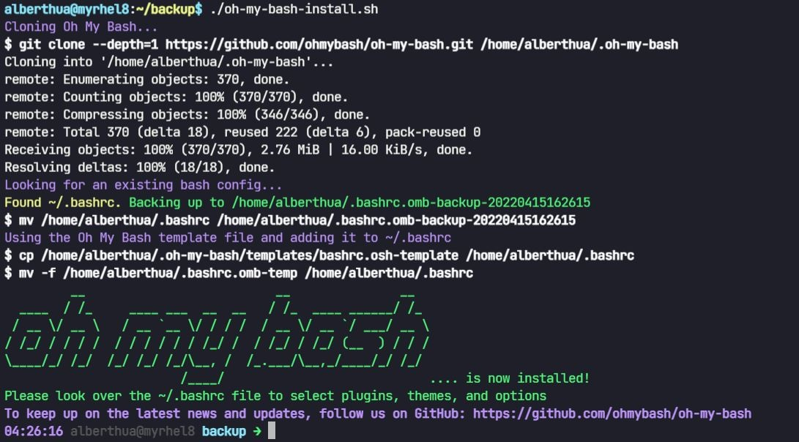

  下载安装该项目源码后，更改 `$HOME/.bashrc` 中的 `OSH_THEME` 值为对应的 `fonts theme` 即可（位于 `$HOME/.oh-my-bash/themes/`），最后 source 该文件生效。
  此处使用的 theme 为 `powerline`，在 `$HOME/.oh-my-bash/themes/powerline/powerline.base.sh` 的第 165 行可自定义更改 PS1 环境变量。

  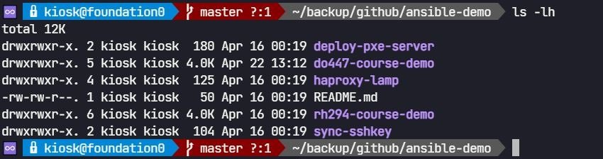
  
- Ubuntu 20.04.3 LTS 中安装：安装方式为 deb 软件包安装

  ```bash
  $ apt-get install -y powerline fonts-powerline
  # 安装 powerline theme 与 powerline fonts 
  $ vim /usr/share/powerline/bindings/bash/powerline.sh
  # 可更改第 120 行的 PS1 环境变量
  $ chmod +x /usr/share/powerline/bindings/bash/powerline.sh
  $ vim $HOME/.bashrc
    ...
    ### Use powerline fonts on bash
    POWERLINE_SCRIPT=/usr/share/powerline/bindings/bash/powerline.sh
    if [[ -f ${POWERLINE_SCRIPT} ]]; then
      source ${POWERLINE_SCRIPT}
    fi
  # 添加上述代码段至 $HOME/.bashrc 文件中使 PS1 环境变量生效
  $ source $HOME/.bashrc
  ```

  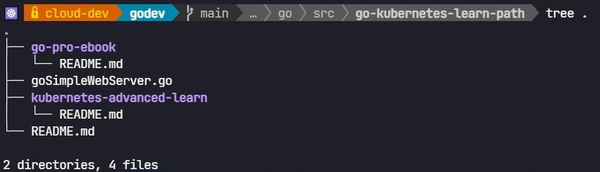

## 4. Markdown 语法配置

| 功能 | 语法 | 效果 |
| ----- | ----- | ----- |
| 设置字体颜色 | `$\color{#FF0000}{红}$` <br> `$\color{#FF7D00}{橙}$` <br> `$\color{#FFFF00}{黄}$` <br> `$\color{#00FF00}{绿}$` <br> `$\color{#0000FF}{蓝}$` <br> `$\color{#00FFFF}{靛}$` <br> `$\color{#FF00FF}{紫}$` <br> `<span style="color:red">红色</span>` | $\color{#FF0000}{红}$ <br> $\color{#FF7D00}{橙}$ <br> $\color{#FFFF00}{黄}$ <br> $\color{#00FF00}{绿}$ <br> $\color{#0000FF}{蓝}$ <br> $\color{#00FFFF}{靛}$ <br> $\color{#FF00FF}{紫}$ <br> <span style="color:red">红色</span> |
| 设置字体颜色 | `<font face="楷体" size=13 color=Blue>你好</font>` | <font face="楷体" size=13 color=Blue>你好</font> |
| 标题选项 | `- [ ] 计划` <br> `- [x] 计划` | - [ ] 计划 <br> - [x] 计划 |
| 加粗文本 | `**文本内容**` | **文本内容** |
| 删除文本（添加中横线）| `~~文本内容~~` | ~~文本内容~~ |
| 图片居中显示 | `<center></center>` | <center></center> |

## 5. VSCode 常用 Settings 参数与插件

- 常用参数：

```bash
Render Line Highlight: none
# 去除整行周围的方框，可选参数包括 none、gutter、line 与 all。
Render Indent Guides: none
# 去除代码垂直对齐
Match Brackets: never
# 去除成对花括号上的方框
Cursor Style: block
# 设置光标的输入形式为 block
```

- 常用插件：
  - Dracula Theme Official：Dracula 配色方案
  - Markdown Preview Mermaid Support：支持 UML 时序图预览
  - Markdown All in One：支持 Markdown 语法格式
    - `ctrl + shift + p`：`Markdown: Create Table of Contents`（自动生成 markdown 文件目录结构）
  - markdownlint：Markdown 语法检查
  - vscode-pdf：支持 PDF 文件预览
  - YAML：支持 yaml 格式语法

## 6. Chrome 扩展安装与使用

### 6.1 更改 GitHub 页面 logo

- 安装 Chrome 扩展 `Stylus`
- 打开该扩展，并将 `GitHub PH logo design` CSS 样式导入其中，如下所示：

  

  

  ```css
  .Header-item.Header-item--full.flex-justify-center.d-md-none.position-relative a svg,
  .Header-item.mt-n1.mb-n1.d-none.d-md-flex a svg
    {
      opacity: 0;
    }
    
    .Header-item.Header-item--full.flex-justify-center.d-md-none.position-relative a,
  .Header-item.mt-n1.mb-n1.d-none.d-md-flex a
    {
      width: 91px;
      background-image: url("data:image/png;base64,iVBORw0KGgoAAAANSUhEUgAAAxcAAAEUCAYAAABZK8u7AAAABGdBTUEAALGPC/xhBQAAACBjSFJNAAB6JgAAgIQAAPoAAACA6AAAdTAAAOpgAAA6mAAAF3CculE8AAAABmJLR0QAAAAAAAD5Q7t/AAAACXBIWXMAAAsSAAALEgHS3X78AAAuyUlEQVR42u3dd3jddd3/8ecnSZOmM90Lyih7OQDZlq2C3ALK9CcO0NuoOHHdKsit4MIFagX3YtyCoggiyBKUKUNKAQGBMEv3TJu0ef/+OCmW2pY2Ocnne855Pq7rXC20zXl9T9Pk+zqflZAkbbT2aZM3BQ4AdgO2BTYHRgODgabc+SRJWosOYDEwG3gCeBi4C7ihubXtqXI8Qcp9hZJUKdqnTZ4MvB04Htghdx5JkspoBnAx8PPm1rYne/pBLBeS9DLap01+BfAZ4M1AXe48kiT1oS7gMuCs5ta2+zb2D1suJGkd2qdNHgt8FTgJv15KkmpLAD8HPtHc2vbChv4hv1lK0lq0T5t8DHAB0JI7iyRJGc0H3tPc2vbrDfnNlgtJWk37tMmNwLeA1txZJEkqkO8DH2pubetY32+yXEhSt/Zpk4dQmmd6aO4skiQV0DXAm5tb2xav6zdYLiQJaJ82eRDwZ2Cv3FkkSSqwW4GDm1vblq7tF931RFLN654KdQUWC0mSXs5ewO+7v3f+B8uFJJXWWByYO4QkSRXiIODba/sFp0VJqmnt0yYfR+nQIEmStHFOaG5te8n3UMuFpJrVPm3yROAB3G5WkqSemA/s2Nza9uyq/+G0KEm17GtYLCRJ6qkWSt9LX+TIhaSa1D5t8quBu/DroCRJvRHAbs2tbXeDIxeSatfpWCwkSeqtROl76ov/IUk1pX3a5M2Af+EbLJIklUMXsFVza9vjfmOVVIv+HxYLSZLKpQ5456qfSFKteWvuAJIkVZnjwGlRkmpM+7TJmwJtuXNIklSFpjhyIanWeBK3JEl94wDLhaRas1vuAJIkValXWi4k1ZptcgeQJKlKbWu5kFRrpuQOIElSldrSciGp1ozJHUCSpCrVYrmQVGuG5Q4gSVKVGmq5kCRJklQOjZYLSZIkSWVhuZAkSZJUFpYLSZIkSWVhuZAkSZJUFpYLSZIkSWVhuZAkSZJUFpYLSZIkSWVhuZAkSZJUFpYLSZIkSWVhuZAkSZJUFpYLSZIkSWVhuZAkSZJUFpYLSZIkSWVhuZAkSZJUFpYLSZIkSWVhuZAkSZJUFpYLSZIkSWVhuZAkSZJUFpYLSZIkSWVhuZAkSZJUFpYLSZIkSWVhuZAkSZJUFpYLSZIkSWVhuZAkSZJUFpYLSZIkSWXRkDtAThExAJgEbA5s1v0YB4zsfoxY7ed13Y+h6/hwK4HF3Y/lwDxg7mqPp4HngWeAfwFPppQ6cr8GkiRJUrnURLmIiDpgK2CXNR6bUb7Rm3pgePdjQ3RFxNPAg8AMYDpwL3B/Sqkz92smSZIkbayqLBcR0QDsBuwHTAX2pjQKUSR1wOTux+tW+/8dEXEPcCtwE/CXlNLc3GEl9Y8dPv0Uj8+PLM+9RUtixpc2zf0SZHHC957l8vtXZHv+Od/ehEGNzlRWcVx46wJO/vmCfn/ed+3VyHdPGp/78tULVVMuImIkcDjwJko360NyZ+qhRmCP7seHS5cWdwN/AK4C7kwp5bnzKKCI2B+4Icdzp5RS7uuXJEkqkoouFxExFDgOOBF4LaWpSdUmAbt2P84AnoqIXwOXpJTuyB1OkiRJWqUix2AjYp+I+BHwHPAD4ACqs1iszabAR4HbI2J6RHwsIkblDiVJkiRVTLmIiLqIOLZ7PcItwLuAwblzZbYjcA7wdERcEBHb5w6k6hURTRHx6Yj4eO4skiSpmApfLiJiQEScDDwEXAK8MnemAhoIvBt4ICIuiYhX5Q6k6hIRr6e0o9nZWOolSdI6FLZcRESKiGMpbdX6Q2Dr3JkqQAKOBe6OiF9GxGa5A6myRcQWEfF74I+UtnOWJElap0KWi4jYA7id0kjFlNx5KtRbgYci4osRMTB3GFWWiGiOiDMpncFyRO48kiSpMhSqXETEmIj4CXAbsHvuPFVgIPAZ4P6IOCB3GFWGiDiSUqk4ndLnkCRJ0gYpTLmIiJMoTYF6R+4sVWgr4PqI+IajGFqXiNgmIq4GfgtsnjuPJEmqPNnLRURMiIgrgZ8Bbqnatz4C3BERrl/RiyJicER8mdKC7df19uNJkqTalbVcRMTRlG5oDsv9QtSQnYG7IuJNuYMov4g4HngY+CQwIHceSZJU2bKUi+798r8DXAaMzP0i1KBhwG8j4pO5gyiPiNgpIq4HLgIm5c4jSZKqQ7+Xi4jYlNIheO/PffE1LgFfjojzI6JWTjeveRExLCK+AdxL6WR7SZKksunXchERrwXuAnbLfeF60XuAiyKiMXcQ9Z3uc2NOAh6htPbGQilJksqu38pFRLwV+DMwNvdF6z8cA1xqwahO3Se230Jp0wT//UmSpD7TL+UiIj4N/BIXjBbZEZQKRkPuICqPiBgZEd+jNFq4d+48kiSp+vVpueieivE14OzcF6oNcgRwQUSk3EHUcxFRFxHvBv4JtFKALaclSVJt6LObju4b1O8Bp+W+SG2UdwJn5A6hnomIPYA7gAvw3BhJktTP+qRcrFYs3pv7AtUjZ0TEMblDaMNFxNiI+BFwK7Br7jySJKk29dXIxTlYLCrdTyNi59whtH4R0RARH6B0EN67KG0xLEmSlEXZy0VEfAz4aO4LU68NAv4vIgbnDqK1i4h9gb8D5wEtufNIkiSVtVxExAmURi1UHbYDvpU7hNbpu8AuuUNIkiStUrZyERF7Aj/JfUEqu1Mi4rDcIbRWkTuAJEnS6spSLiJiInA50JT7gtQnvh8Rw3KHkCRJUrH1+sC0iBgA/BoYl/tiymQh8ADwEPAo8DTwHDAbmA/MW+P3DwAGA0OBicAEYDKwA7AjpalFlX4w3abA53EtjSRJktajHDe9X6GyT/9tA64FbgJuBx5JKW3sdJNZ3T/ev+YvRMRAYE9gf+D1wB65L7iHPhgRP04pTc8dRJIkScXUq3IREa8DPpL7InrgIeBC4PKU0v29/WDrk1JaBtzY/fh8REwGjgHeAeyU+4XYCPWUiuThuYNIkiSpmHpcLiJiFPDT3BewETooFYppKaU7coVIKbUBXwe+HhEHAR8G3pj7xdlAh0XE1JTSTbmDrOYWYETuEJIkSerdyMW5wPjcF7ABlgDfAb6RUnohd5jVpZSuA66LiNcAXwNemzvTBjiT0hSvQkgpraC0FkaSJEmZ9Wi3qIg4Ejgxd/iXsZJSqdg8pfSpohWL1aWU7kgpTQWOA2bmzvMypnYf3iZJkiS9xEaXi+4Tm8/LHfxl/A14RUrp1JTS7NxhNlRK6f8o7TB1Se4sL+NTuQNIkiSpeHoycvF5YJPcwddhOaUF5vullB7IHaYnUkpzUkrHAx8CVuTOsw6HRcSU3CEkSZJULBtVLiJiG0o3vUX0T2DPlNK3UkpducP0VkrpXOBgSuduFE0CPpA7hCRJkoplY0cuvkLp0Lii+SPwmpTSvbmDlFP3rkz7UjrAr2jeFhGNuUNIkiSpODa4XETEa4Ejcwdei2nAESmlBbmD9IXuczj24t8H9RXFKOCw3CEkSZJUHBszcvG/ucOuxRdSSu9LKa3MHaQvpZQepXQjvyR3ljW8LXcASZIkFccGlYuIOASYmjvsGs5OKZ2eO0R/SSndBRwLRO4sqzmse/cwSZIkaYNHLj6bO+gavplS+kzuEP0tpXQVcHbuHKsZCLw+dwhJkiQVw8uWi4jYi2KdHP1b4LTcITI6A7gld4jVvDF3AEmSJBXDhoxcFOnAtOnA/6uGrWZ7qnt9yXuAjtxZur0uIlLuEJIkScqvYX2/GBFbAEfkDtltMXB0Smlp7iC5pZQejIivAJ/LnQWYQOlU8em5g0iSJK3P8hXBk7M7eXRmB0/M7uDJ2Z08PnslT8/t4uEXuli6xvHFI5sSW45JjB9ex+RR9Ww6soFNRw5gs9Glx5ihDT0LUsVe7hX5IKUD04rg1JTSI7lDFMiXgHcD43MHoTRtznIhSZIKJQIemdnBrY8u5aaH2rn0nk46N2L+y9zlwdynA57uAlYAy1/y6zuNrePQnRt5zZbN7L5FMxNHWDbW+QpExEDg7bkDdrsqpfTT3CGKJKXUHhFnA+fmzkKpXHwvdwhJUs8c/JVn+OsT/b+r+1UfHMUB21fGpoN3/qud136t/4+c2qIlMeNLm+a+/IrTNqeTP/5jMT+5eQn3Pdd3s+mnv9DF9OuWwXXLgHlMnVLP8XsM5uAdB7PJyCKeO9331lev3gyMyB0QaAfelztEQZ0PfBKY1I/P2QU8Atyz2uPeXC9AROwP3JDjuVNKZRnVi4jLgTfluIYeOiMizijzx9wipfRE7guTJFWuCLj9X+38+Kb5/OLOziwZbnpsJTc9thBYyPG7NnDSPsPZb9tBNNQVZSJQ31tfuTg5d7huX04pPZk7RBGllDoi4gLgzD56imWUpjutKhD3AP9IKRXtMD9JklSjArj1kaV87Y/zuPrB4pyrfPHfV3Dx3+fw6knz+MRhw3nDLkNobKj+krHWchERk4D9c4cDnge+ljtEwf2A0sLu3k7ym89LS8Q9wEMppRW9+JiSJEl95tGZHZx1xWwu/ntxb1fufqaL438wj1dPWsCZR43gwB0GU80DGeu6IT2RYizkPiul1J47RJGllJ6LiKuA/9qIP/YULy0R9zg6JEmSKkV7R/Cjv8zjk79ZTFfkTrNh7n6miyO+M4ejX7GALxw9mi3HNuaO1CfWVS6OzR0MmAlckDtEhbiUtZeLLuAh/l0k7qVUJObkDixJktQTDz67nPf9bBa3tVXmsWe/uW8Fl//jec49fihv36eFhvoivJ9fPv9RLiJiMrBb7mDAeSmlohwUV3S/BxYAD/Of6yMc+ZEkSRWvK+CS2xfw7p8vYGWFjFas71o+cNEi/nR/O988cQyTRlTPzlJrG7k4MncoSpsIT8sdolKklBZExIiUUoX/U5MkSfpP7R3B53/7AufeuLz3H6xArpi+grvPfp5f/Pco9tpqUO44ZVG3lv/3utyhgN+klObmDlFJLBaSJKkazV60khOmPVt1xWKVZxYHB359NhfeuoBquJl7SbmIiEZgau5QwA9zB5AkSVJeT83t5Khzn+NPDxVni9m+cvLPF3DOVbMrZoH6uqw5crEnkPuozOeAGzNnkCRJUkaPzuzgkK88z11PV+bC7Z44/YqlfO6yF1hRwQ1jzXJxSO5AwGUppdr5LJIkSdJLPDqzgzd+YyZPLqzcm+ye+sZ1yzj9slkVWzDWLBcH5w4E/C53AEmSJOXx9NxOjj63NovFKt+8fhlfuqIyp0i9WC4iohnYPXOepcDNmTNIkiQpg6fmrOTEaTN5ZG4F3lWX2dlXtzPtusrb32j1rWhfAdRnznN9Sqk6twKQJEnSel37z+pfuL0xTrtsMZuPGcDhrxiaO8oGW31a1K65wwA35Q4gSZIkFcVx58/jwWcr5733opWLW3IHkCRJkopiZcApP57FwvbK2O9o9XKxW+YsHcDfM2eQJEmSCuXuZ7o46/ezcsfYIHUAETEQ2CFzlvtTSp25XxBJkiSpaM69cTk3PLgkd4yXtWpB99bkX8x9T+bnl6Sa9vj8oLm1LXcMSdI6vP/nc7nt9GaGNdf1/oP1kVXJpuQOAkzPHUCSJEkqqsfnB+ffUOztaVeNXBShXDycO4AkSZKqwwFb1fOGXZrZalwjk0cNYPTQegY2JAY0JCKgvSNYtGwlz8xbwZOzO7ntsXYuuaODRStyJ1+/069YytG7dTBlbGPuKGu1+rSo3CwXkiRJ6rE9Nq2j9aChHLD9YMYOa1jv7x3cBKOH1rPFmEb23QbeuvdwzjkhuPfJZVx02wLOv6Uj9+Ws07f+NJfz3jY+d4y1KsrIRRfwVOYMkiRJqkD7blHPGUeOYO+tB1GXev5xmhoSe0xpZo8pzXzy8BV8/4a5fPWaZbkv7z/88G8dtB60nB0mNuWO8h9WlYvNM+d4LqVU8EEoqc+8FRjQgz93M7BThrxfAb5c5o+5MMN1SJIq3KAG+P7bWjhqt6E09KZVrMWElgbOPGosJ+y5nE9cPLtwp4eff8M8vv3W4o1erCoXEzLncNRCNSul1KN95SIi11e5ZSml+ZmeW5IkAA7Zpp5z3zaWzUf35P25DbfdhCZ+/YGJnHftHD53xdLcl/2iC27p4COv6+zz699YdRHRBAzOnOP53C+EJEmSKsPJezdyyfsn9NuNddOAxGmHjeY3rSOpL+8ASa9ccvuC3BH+Qx0wOncIYHbuAJIkSSq+T72umW+9dRzNjf1/1sMbdhnCHz80ujAF41vXtLNkeVfuGC9RB4zLHQLLhSRJkl7GB6Y28Zn/Gl329RUbY79tB/Hb94/M/VIAML8juPGhYp3aXZSRCxdzSpIkaZ1O2HUAZ71lbNZiscohOw7hh28bnjsGAJfctih3hJeoA4pQvYqzOkaSJEmFsvP4Or5x4lgaG/IXi1VO3Hs4p07NvxXsr+9dwQsLi7Ppah0wMHcIoHirUTZARNwYWt29uf9OJElS9fn+20fTMqg+d4yXSMDnjhzDtqPyF56bHy7O+/R13Q9JkiSpcP7n9c28evMivBf+n4YOrOPrJ+afBHTN9OKsu6gDhuUOQYWOXEiSJKnvjGxKnHpI/pv39Tlw+8EcuXND7z9QL/zqzs7C7BpVlFGLyB1AkiRJxXLmUUMKNx1qTSnBR18/ImuGlQH/eGpZ7pcCKJWLIblDSJIkSasbUAdH7VqECTYvb7ctmnntlnlL0N1PFqdc5B3HkSRJktbw0YObGTWk2KMWq6QEp0wdmjXDTQ8Vp1x05g4BDModQJIkScVxzGsqY9RilUN2GsyAjAsOrnxgBe0d+ddd1AFFWF7emDuAJEmSimGnsXVsPzH/GRIbo2VQPe/cO98tbVfA47PzjxkUZUH3gNwBJEmSVAxv3buZAhzEvdEO3mFw1ud/5PmO3C8BdUARzgzP+zchSZKkwnjtdpV5a7jbFs1Zn/+h55bnfgmoA1bmDkExztqQJElSZvUJtp9QWVOiVpnQ0pB116gHny3GyEUR1lzkXV4vSZKkQnjjTg00N1bgnKhu+26Tb93F3x7JP2ZQB7yQOwRQ7KMXJUmS1C/23WZg7gi9ssum+fI/tShY2J53x6g6YHbWBCVjcgeQJElSftuOr+xNRHPnf2HhiqzPXwfMyZqgxHIhSZIkNhlZ2ZuIbjY6b7mYtShvuWigGOViUu4AklTrNhuWuPsLtfnl+O0XPM8fHsj7DVlSycSWhtwReqW5MbHDmDpmzMozPemFhXnXXTSklDojYj7QkjHHhIioSynlP1ZQkmpUXR0MaizK8Uf9q6E2L1sqnE2HJoYPyrfbUrnsMjlfuZi3JG+5WPXltC1ritIIyvjMGSRJkpTRdhOqo+lvPS7f1K65BSkX/8qaomTr3AEkSZKUz4SW6igXk0bkKxezF1kuVtkqdwBJkiTlM76l8qdEAbRknNq1oABb0UIxysU2uQNIkiQpn1GDq6Vc5BuBmbfEcrHKzrkDSJIkrU3HysgdoSY0DaiOaVFDm/OVpMXL8n6urvobfChripJdcgeQJElam44Vlov+0NSQckcoi2ED85WkpR15r70OIKX0OLAwbxQmRYSH6UmSJNWoxiopFwPq811H7iK8eq26N2uSkj1yB5AkSZJ6o2lAvnIxe3FxysU9WZOU7J07gCRJktQbDXXVMQLTE0Ubudg3dwBJkqQ15Z5qIlWKhtV+/vfcYYA9I2JISmlx7iAb6I289DXM7UTgu7lDSJK0IZYuz7tl5sawXPSPanmVmxvzjVzkHjRZ/cb4AWAeMCJjngHAVODKnC/KhipaCYqIpbkzSJK0obqq5U5SZbN4WeUUzvXJWUbHD8+7ne+Lz55S6gL+kjVNyeG5A0iSJK3OItQ/VlbJC72yOjpSj6xZbW7MHQg4MiKq4wQVSZJUFZZU0BSuSragvTpe58g4wWt4c95rL2K5mAC8JncISZKkVTo9obtfLFi6MneEsli6PN/ny5CBeRddrFku/kFp3UVuJ+UOIEmStMqyTstFf5i3pDpGLlZknN41JOPp4LBGuehed3FV1kQlx0dEU+4QkiSp77RX0A37YqdF9YvnF1TH67wo48L0UUMKVC66/S5ropIRwJtzh5AkSX1nRQVNNaqkbXMr2X1t1fE6L8y4dmTUkPqs1762cnE10JE1VckHcweQJEl9p5K2Hc15s1hLZrZHVSyen7ck39qRlkEFKxcppUXAdVlTlewREXvmDiFJkvpGZwVtOzp/aeXf8FaKOYsrf1H3/IwL00cXcOQCijE1CuBTuQNIkqS+UUlTjeYurpysle65BStyR+i1x2d1Znvu0UMbev9BemFd5eJSijE16k0R8arcISRJUvlV0g5Mz8yvnKyV7rGZRbgF7Z1/Pp+vXIwZWsCRi5TSHOCKrMn+7Wu5A0iSpPJbXiHlIgKmP+/IRX956LnluSP02l2PZ5wWVdCRC4CfZk32bwdFxBtzh5AkSeW1qEKmRS1a1kUFbWxV8e5+It+7/uUwf+lKnlqU5xNm06GJYc3F24p2lT8BL2RN92/fjohBuUNIkqTy6VhRGXfsC9orf4FxJbnukZUVvTvXoxmnde05Je+UKFhPuUgpdQK/yh2w25bAmblDSJKk8pmd6d3djTVroeWiv814tnKnRj3wTL7sO0xqzH35vNy4yfeAovzL/2hE7Jc7hCRJKo+ZFXIa83MLKnuaTiX6+xPtuSP02N1PLsv23NuML3i5SCk9SnEWdtcBF0bEyNxBJEmqJinled62OUV5/3L9nplb+VujVppL71hamHe3N0bHiuDSO/OV0a3HFbxcdPtm7pCr2QS4KCLyTyiTJKlKjB6Sp13MbA86K2CldCVP0alUt7V1VeSWtPc/vYy5y/N9Tm8+pgLKRUrpRuC+3EFXcyjwjdwhpBo2PHcASeVVl3FzmXlLir+e4eaHHbnI4caHluSOsNFufnhptuc+YKt6hg7Mu1MUbNjIBcDXcwddwwcj4rTcIYokIgYCb8idQzUh0wQKSX2lZVC+G5Kil4uZC1cwY1ZlrA2pNtOuW1IRI1urrOwKLr4931qRA7Zvyv0SABteLi4CHssddg1fi4jW3CGKICK2Bm4Djs2dRZJUeYZn3Bf/hYLvxHTXvyp3YXGlmzGri79kHAnYWHf8q537nstXRF+1WXPulwDYwHKRUloBfDF32LX4Xi0XjIhIEfFe4B7gFbnzqGbkn9ApqawGN+UbkGybW+ydmC6/e3HuCDXtO3+eT1eFDBxdeOvCrM//ismVNXIB8Evg0dyB1+J7EfGZ3CH6W0RsCVwDTAMG586jmuKBllKVGTE43z4pjzxf3EW7bXM6+WXGnX8EVz+4kmseKH7Be2J2Jz/8W77P5UO2qWfM0IbcLwOwEeWie/Ti07kDr8MXI+KCiKj6d1QjoikiPg1MBw7OnUdZFfc7sqSKkvOm5NoHirsT089umZ87goDPXTqfpR3FHr744Y3zsj7/4a8szvt+GzvJ8jJKc/uL6N3ATRExKXeQvhIRRwEPAGcDxZhYp5xyTUQdmvvCJZVXy+B8ay7ufqaLpwo4NeqRmR18+U+utyiC6S908d0/z80dY51mPLucr1+X7+A8gH23qdBykVIK4FSKc2r3mvYE7o2Io3MHKaeI2D8i/gb8BpiSO48KI9feiJYLqcrknk5x7fRiTXtZ0RV87rLZdBX1bqcGnX7FUm57rHhlr3Nl8On/m501w05j69h+YjHWW8DGj1yQUroL+GHu4OsxGrgsIn4REWNzh+mNiDggIm4EbgD2yp1HhZPru/Gw3BcuqbzGD89bLs69ZjHLVxTnTv6nN8/nd/d7tkXRvOOC2Ty/oFh/Lz+4cR7XPJx3x7OT9h1EXYE2ie/pOOgngJm5w7+M/wc8HBGnVtJajIhojIi3R8TfgeuBqbkzqbByTUD1ED2pyoweWp/15uThOcEV9yzK/TIAcMs/l3LqxcXIopd6cmHw3z+ZSXtB1l/c9NASPnZp/lG3w185JHeEl+hRuUgpzQfenzv8BmgBzgVmdN+wF2MZ/VpExLiI+DzwFPBT4NW5M6nwcu15t3nuC5dUXg11iT0n5z3Z9xOXLGDO4rzvAN/Xtow3nZd3iovW75qHV/KRC2fSkXmk6/6nl3H0d+fkfjk4YqcGthxTrPfQe/yVJKV0GXBx7gvYQFMo3bD/KyI+FhGjcweCF0cpjoyIy4GngTOAip7KpX6V662bgd1bIUuqIq/ZckDW539uSfDZy17IdqbBXY+3c8Q3Z7G0WLNutBY/u72Tj12Ur2A8MrODY84rxufKO/cr3kzl3r5N0UrpprhSbAqcAzwTEZdExJsjol93XYqIYRFxVET8ApgF/BZ4E1DYURUVVs59747JffGSymvHTfIvCP3pbZ18+9r+fzf4insWsf/XZjFrWXHWfWj9fvi3Dk750XPMX9q/o13/eGoZB315Jk8uzP+5MmVE4sDti3fUWa9uaFNK8yPiBOBGIN8JPBuvETi2+9EeETdROpDur8C9KaWynR8QES2UdrHaG9if0sJsi4TKYX7G5z4tIn6YUso/JiypLLYal79cAPzP5UtorE+876CRpD5eB7JkeRdfvWo2X70m7zai6plf37uCJ2Y/xwXvHMN2fbxbUgB/uGcR7/jxvEKMWAB87A1DaRpQoJXc3Xp9k5tSuiUiPgt8KffF9FAz8PruB8DyiJhB6ZC6R4A24BlKowxzgTVXedUBo4CRwBhK89E3B7YFdgY2y32BqlrzMz73ql3ZDksp9ei8je4zaY6nNAryhpRS3hOIpBq3/YTizNs+7bLFPDW3k8/+1xiGDCz/WpAAbnt0KR+5cC73PVeMxcHqmTuf7mK3L87km8cO5aR9W2hqKP/N9oKlKznnj3M458/FKaEjmxJH7VrMneHL9Q76V4DdgWo4X6IJeFX3Qyqy+Zmffyrwl4g4KaU04+V+c0Qk4BXA64A3AvsAq74LbELeaV5SzRs+qJ5Dt63Pvq3mKt++YTk3PvQs5xw/kn22GUQ5bhkDmP7UMs69dh6/vLN4B/epZ1YGfPCSRfzk5iWccWQLB+4wmAH1vf+M6VwZXHXfYj5+8XyeWpR/GtTqznrzUFoGFXPSUFnKRUopIuIkYCtgl9wXJdWIIkxJ2pXSwZWXA5cCdwOzKU09HEVp5O5VlHY/2w8Yt46Pswlwf+6LkWrdwTs2c83D+bfWXOW+57o45JuzOWKnBt6z/3D22bqZ5saNH8mYt2Qlf3l4Kb/46yKunFGQOS0qu3ue7eLI781l5/Hzed+BQzh4x8FsMnLjNyqYtWgF19y/hG9cvYgZs4o3srXZsMSbdy/eQu5Vyjb3P6W0JCLeCNwKTMp9YcrCr9j9qy13gG4DKE1t6s0i78m5L0IS7LvNIPKdz7luV0xfwRXT5zC0AU7Ys5E9tmxmyrhGxg9roGVQHQNWmwqzsL2LeUtW8vTcTh5+voMbH1xmoagx9z/fReuFC4GF7LtFPYfs2MROmwxk8qgBjBxSz7CBddR1d9Sly4OF7St5ck4nj87s4Op/LOWqB4sxercuXzmuhaF9MF2wXMq6sDil9FREHAbcjKf41ppngHfkDlFjnsgdoIw2yR1AEuy8SROThiSeWVysKSCrLFoBF9zSwQW3lG3fFVW5Wx5fyS2PLwV6tDywcA7dtr5wh+atqey1J6X0D0qLo9tzX5z6zQxgr5TS9NxBaklKaTHFmBpVDpYLqQAa6hOnTO3XHdolbYSvHDeahrri7RC1uj4ZU0kp3UppwaYFo/pdDeybUnoqd5Aa9bILqSvExNwBJJUcWdAdaKRad86bh7DdhGJsGb0+fTZhK6V0PaWCsST3RarPfAE43C1Es7ord4Aycc2FVBDbTWji8B08jmldPn7IwNwRqtLUKcXc+agoDt22nlP2H5E7xgbp09Ug3QXjINxistrMBo5IKZ2eUireNgq15Z7cAcrEaVFSgZx6yPDcEQrpXXs18s79WnLHqEoH7dDEtBNdrrs2LY2J8942tk/O8OgLfb7UPKV0O6X97Iuys41650pg55TSH3IHEQB35g5QJkMiwrsZqSD222YwB2zlO8mre/WkOs56yxjq+vrY8Bp20j4tvHPP4hzmWBS/eu9IJo/a+C11c+mXfaxSSg8CewJ35L5g9dgi4L2URiyezx1GJSmlh4Anc+coE0cvpIKoq4MzjxqZO0ZhjGxK/Pw9Ywt7aFm1qKuDrx431ilSqzn3uKEcuP3g3DE2Sr9tkptSeo7Sib6/yH3R2miXAdunlM5PKRVzf8LadmXuAGWyae4Akv5t9y2bef9ri794tK/VJ7j0A6OYMtZ31PvDkIF1/PiUcWzR4gjRxw8ZyMlTK2Odxer69QSOlNKylNJJQCuwPPfF62U9QWnB9ltSSs/kDqN1qpYpapYLqWA+dcTomr/J++37R7LXVoNyx6gpE1sa+P2HxzFmYO1+7p28dyOnv2kMBd91dq2yHO+XUvo+pWlSD+V+AbRWC4CPA9ullK7KHUYv68/AzNwhysBpUVLBjB5Szw/eNSp3jGx+0zqSQ3Ys9oFl1WqrcY388bSxtDRW4N11Lx2/awNfO24sDfWVee3Zzg5PKd0LvBr4Tu4XQS/qBL4FTEkpnZNScnSpAqSUOoEf5c5RBpYLqYD22XoQ5x5XW2df1Ce48tRRvGEXi0VOO05q4s+fGFtTIxgn7jaA7500nubGbLfovZY1eUqpPaV0KrA/8EjuF6OGdQLnA1ullD6SUqqWU59ryXnAstwheslyIRXUyVNH8OEDamP9xbjmxPWnjeHAHSprEW212nFSE9d/ahxTRlR/wTh1ahPT3l7ZxQIyl4tVUko3AbtQOpTNd8v7Twf/LhXvTSm5XXCF6t7B65u5c/SSB+lJBVWX4Myjx3LK3tW9qHnPyXXc+D/jec2WzbmjaDVbjWvk2k9M4KCtq3cXqS++aTBfPnYcjRVylsX6FKJcwIuLvU8Htgd+mztPlZsDnAVsZqmoKmdT2efJOHIhFVhjQ+LrJ4zjQ1U6gvGBqU38/iMT2Xx05ZwnUEsmtDRwyfsn8N79qqvg1if49X+P4GOvH0VdYe7Ke6dwl5FSejyldDSwL/C33HmqzD+B9wGTU0qf9byK6pJSWgy8FViZO0sPeZCeVHCNDYmzjxnHN4+pnrUILY2JX53cwlePH8fQgYW7LdJqBjfV8Y0TxvOzdwynQtc6v8Tum9Rx52fH8cZXVteapsL+K0op/TWltA/wBuD23Hkq2ArgUuBgSrs/TUspLc0dSn0jpXQL8IHcOXrB0Qup4OoSvPfAkVz9oVFMGlLZd3gn7DqAv585gaN3G0ZlX0ntSAmO3WM4954xnkO3rdxpUh8/ZCBXfmwi20+svpHAwpaLVVJKV6eU9qR0c/zH3HkqyGPAZ4BNU0rHpJSu8wC82tC91fNpuXP0kGddSBVi6naD+dvnJvD2PSpvGtFOY+v43ftH8qOTJzCxpSF3HPXAVuMaufTUiUw7cRiDKuivcOfxdVz/sdH879Fjq3akrGKuqvvm+DBgR0rb1y7KnamA5gLTgH2ArVNKZzv1qTallL5OaYpUe+4sG8lyIVWQscMamPaOCVx56ih2Glv8W4qRTYlzjxvKTZ+ZyKE7DSE5XFHRBtQn3rFfCzPOmshHDxqYO856DWqA844fyk2fnlj1hzIW/yvBGlJKM7q3r50IvBO4KXemzOYBvwSOBManlN6XUvqboxRKKV0IvAa4L3eWjeC0KKnCJODAHQZz82cn8aOThhfyRO8xAxPfOnYoD5w9kXfvP4JBFb7Vp15q3LAGznrLWO7//Hje/9piTTMaUAf/e8QgHjxrIqdMHVHx28xuiAoaSHqp7sWrPwV+GhGTgWO6H3vkztYP2oDfAZcDf0kprcgdSMWUUpoeEbsDH6Y0Ta7IC6YXUNm7XUk1beCAxIl7DefIXYdy9T8Wc961C7mtrStrpn02r+d9Bw3ldTsPYXBT9d/U1bqtxjVyzgnjaD2og4tvW8A3rm1naaY7pC1aEh99/RCOfPUwRg+t3LUhPVG8txd6KSImAYd3P/YHhuXOVAbzgBuA64A/p5T+mTtQUUTE/pRem36XUmUNqEfEaEprMVopzr+LFcBfKL1R8OuUUp8fBNg+bbKjevoPyzqDrsj3qdHcWFd135C7uuDetmVced8ivn/DMuYu75/Xd4uWxMmvHcTrdxnCDhObyj71qStgWWf/laYEWd7t7lwZdK7sv38TDXWp7Gc8zF+6kutnLOGi2xbzhwf6vmU01cPJ+zRx5KuHsseU5qo4s6InqvqqI6Ie2B2Y2v3jayj+nO4AHqa0Q9aqx70ppbxv/xRURDQAWfZETCnNz339PdG93etJwCmUDq/sbwuB64E/AL9NKc3tzye3XEj9b/mKYPrTy7jtsXaund7OtQ+vpKtM/xKb6uHIVzQwdbtB7DGlmW3HN1JfV9W3N+qBZ+Z1cvtj7Vw3YymX391ZtrK77xb1HLpTE3ttNYhXbz7QKXdUeblYm4gYD+xGqWzsAGzV/chxgzobeKD7MaP7x3tSSgtyv06qDRGxHfAW4HXAnvTNVMkngTu6H38F7kgpZTuLw3Ih5dfeETz2QgdPzu7gyTmdPD6rk2fnr+SJ2V3MXBA8s/il/0w3HZoYNzwxZWwdE4bXs+XYRjYfPYDNRpd+rNV3iNUzK7qCJ2Z18sjMDp6Y3cE/n++gbfZKnpgdPDKni9UHpprqYbuxdUxqSWwyqp4tRg9g8qgBTOn+HBw+qLamPG0I/zV2i4iJwNbAFsA4YHT3j2O6fz4aGMC/S8ja5q4vArqAZZR2blr1mA3MonST1bbqUanvfKs6RUQzsCvwKmBbSqV7U2AopWlUQ4DVv4quoPQ5P6/7MRt4Cnia0uf6DOChlNLC3Ne2OsuFJEl9x3IhqaZYLiRJ6jtODJMkSZJUFpYLSZIkSWVhuZAkSZJUFpYLSZIkSWVhuZAkSZJUFpYLSZIkSWVhuZAkSZJUFpYLSZIkSWVhuZAkSZJUFpYLSZIkSWVhuZAkSZJUFpYLSZIkSWVhuZAkSZJUFpYLSZIkSWVhuZAkSZJUFpYLSZIkSWVhuZAkSZJUFpYLSZIkSWVhuZAkSZJUFpYLSZIkSWVhuZAkSZJUFpYLSZIkSWVhuZAkSZJUFpYLSZIkSWVhuZAkSZJUFpYLSZIkSWVhuZAkSZJUFpYLSZIkSWVhuZAkSZJUFpYLSZIkSWVhuZAkSZJUFpYLSZIkSWVhuZAkSZJUFpYLSZIkSWVhuZAkSZJUFpYLSZIkSeXQYbmQVGsW5g4gSVKVWmy5kFRrZuUOIElSlZpnuZBUax7LHUCSpCr1L8uFpFrzz9wBJEmqUg9bLiTVmrtyB5AkqUrda7mQVGuuzx1AkqQqdYPlQlJNaW5tewp4MHcOSZKqzCPNrW2uuZBUk36VO4AkSVXmEvAQPUm16VdAV+4QkiRViS7gx2C5kFSDmlvbngCuyJ1DkqQqcUVza9vjYLmQVLu+AETuEJIkVbgA/nfVf1guJNWk5ta2vwMX5c4hSVKFu6i5te3uVf9huZBUyz4OzM8dQpKkCjWf0vfSF1kuJNWs5ta2Z4HW3DkkSapQrd3fS19kuZBU05pb2y4Gvp87hyRJFeb87u+hL2G5kCT4EJ7cLUnShroe+ODafiHlTiZJRdA+bfIg4M/AXrmzSJJUYLcCBze3ti1d2y86ciFJQPcXyUOBa3JnkSSpoK4BDl1XsQDLhSS9qLm1bTFwBHB+7iySJBXM+cAR3d8r18lpUZK0Fu3TJh8DXAC05M4iSVJG84H/bm5t+78N+c2OXEjSWjS3tv0a2Bb4OZ7kLUmqPUHpe+C2G1oswJELSXpZ7dMmvxL4H+DN+KaMJKm6dQGXAWc3t7bdu7F/2HIhSRuofdrkycDbgROA7XPnkSSpjB4CLgR+3tza9mRPP4jlQpJ6oLtoHADsDmwDbA6MBoYAA3LnkyRpLTqBxcBs4Angn8CdwA3NrW1t5XiC/w9e/jMECmjTtAAAAABJRU5ErkJggg==");
      background-size: contain;
      background-repeat: no-repeat;
    }
  ```
  
- 以上 CSS 样式可参考 [该链接](https://userstyles.org/styles/204545/github-ph-logo-design)。
- 配置完成后重新打开 GitHub 页面即可显示效果。

### 6.2 更改 GitHub 默认的代码字体

- 安装 Chrome 扩展 `Github Code Font Changer`

  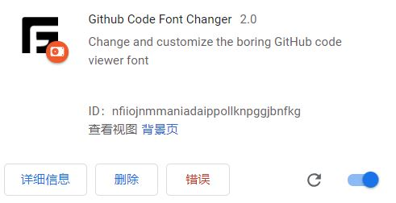
  
- 安装完成后即可使用该扩展选择对应的字体，打开 GitHub 页面即可显示效果。

## 7. Tabby 自定义 CSS

```css
.content.tabs-on-top {
    background: url("file:///E:/应用软件/tabby-bg-pics/提神竖屏 虽迟但到~AOA短发.jpg") no-repeat;
    background-position: center;  /* 图片居中显示 */
    background-size: cover;  /* 如果需要全屏背景，取消注释这行 */
}
```

## 8. 安装与配置外部软件

### 8.1 安装 qpdf 并解密 PDF 文件

```bash
$ sudo yum install -y qpdf
$ sudo qpdf --password=<password> \
  --decrypt <input_file>.pdf <output_file>.pdf
# 指定加密的 PDF 文件的密码解密 PDF 文件
```

### 8.2 RHEL 7/8 安装 exfat 驱动

```bash
$ sudo yum install -y epel-release
$ sudo rpm -ivh \
  http://li.nux.ro/download/nux/dextop/el7/x86_64/nux-dextop-release-0-5.el7.nux.noarch.rpm
$ sudo yum install -y exfat-utils fuse-exfat
$ sudo mount.exfat /dev/sdX <mountpoint>
# 注意:
#   1. Nux Desktop 是第三方的 RPM 软件包库
#   2. Nux Desktop 库依赖于 epel 库，安装前需先安装 epel 库。
#   3. Nux Desktop 库安装成功后，再安装 exfat-utils 与 fuse-exfat 软件包，
#      即可识别挂载 exfat 文件系统。 
#   4. Nux Desktop 库与其他第三方库可能存在冲突，因此不使用时将其禁用，需使用时显示开启：
#      $ sudo yum --enablerepo=nux-desktop install -y <package>
```

### 8.3 安装 xfce4-terminal 软件包

```bash
$ sudo dnf install -y xfce4-terminal
# 该软件包可设置终端背景图片及透明度
```

### 8.4 RHEL8/9 安装 openvpn-gnome 客户端

```bash
$ sudo dnf install NetworkManager-openvpn-1.8.10-1.el8.1.x86_64.rpm \
  NetworkManager-openvpn-gnome-1.8.10-1.el8.1.x86_64.rpm \
  openvpn-2.4.12-2.el8.x86_64.rpm \
  pkcs11-helper-1.22-7.el8.x86_64.rpm \
  redhat-internal-cert-install-0.1-29.el7.noarch.rpm \
  redhat-internal-NetworkManager-openvpn-profiles-0.1-61.el7.noarch.rpm
```

### 8.5 RHEL8 安装 Google Chrome

```bash
$ sudo vim /etc/yum.repos.d/google-chrome.repo
[google-chrome]
name=google-chrome
baseurl=https://dl.google.com/linux/chrome/rpm/stable/x86_64
enabled=1
gpgcheck=1
gpgkey=https://dl.google.com/linux/linux_signing_key.pub

$ sudo dnf install -y google-chrome-stable
```

### 8.6 RHEL9 安装 Google Chrome

```bash
$ sudo dnf install https://dl.google.com/linux/direct/google-chrome-stable_current_x86_64.rpm
```

### 8.7 RHEL8 安装 VScode

```bash
$ sudo rpm --import https://packages.microsoft.com/keys/microsoft.asc
$ sudo tee /etc/yum.repos.d/vscode.repo <<ADDREPO
[code]
name=Visual Studio Code
baseurl=https://packages.microsoft.com/yumrepos/vscode
enabled=1
gpgcheck=1
gpgkey=https://packages.microsoft.com/keys/microsoft.asc
ADDREPO
$ sudo dnf install -y code
$ code
```

### 8.8 RHEL9 安装 VScode

```bash
$ sudo rpm --import https://packages.microsoft.com/keys/microsoft.asc
$ sudo tee /etc/yum.repos.d/vscode.repo <<ADDREPO
[code]
name = Visual Studio Code
baseurl = https://packages.microsoft.com/yumrepos/vscode
enabled = 1
gpgcheck = 1
gpgkey = https://packages.microsoft.com/keys/microsoft.asc
ADDREPO
$ sudo dnf install -y code
$ code
```

### 8.9 RHEL10 安装 VScode

```bash
$ sudo rpm --import https://packages.microsoft.com/keys/microsoft.asc
$ sudo tee /etc/yum.repos.d/vscode.repo <<EOF
[code]
name=Visual Studio Code
baseurl=https://packages.microsoft.com/yumrepos/vscode
enabled=1
gpgcheck=1
gpgkey=https://packages.microsoft.com/keys/microsoft.asc
EOF
$ sudo dnf install code
```

### 8.10 RHEL9 安装 EPEL9 软件源

```bash
$ sudo dnf config-manager \
--add-repo="https://dl.fedoraproject.org/pub/epel/9/Everything/x86_64/"
# 添加 epel9 软件包的软件源
$ sudo rpm --import \
https://dl.fedoraproject.org/pub/epel/RPM-GPG-KEY-EPEL-9
# 导入 EPEL9 的 RPM 公钥
$ sudo dnf install \
https://dl.fedoraproject.org/pub/epel/epel-release-latest-9.noarch.rpm
# 安装 epel9 软件包
```

### 8.11 RHEL10 安装 EPEL10 软件源

```bash
$ sudo cat > /etc/yum.repos.d/epel10.repo <<EOF
[epel10-everything]
name=EPEL10 Everything
baseurl=https://dl.fedoraproject.org/pub/epel/10/Everything/x86_64/
enabled=1
gpgcheck=0
EOF
$ sudo dnf repolist
```

### 8.12 RHEL10 安装 Grafana 软件源

```bash
$ sudo cat > /etc/yum.repos.d/grafana.repo <<EOF
[grafana]
name=grafana
baseurl=https://mirrors.cloud.tencent.com/grafana/yum/rpm/
enabled=1
gpgcheck=0
EOF
$ sudo dnf install -y grafana
```

### 8.13 RHEL 安装中文输入法支持

以下输入法引擎（IME）可以从 RHEL 中列出的软件包中获得：

| 语言 | 脚本 | IME 名称 | 软件包 |
| ----- | ----- | ----- | ----- |
| 中文 | 简体中文 | Intelligent Pinyin | ibus-libpinyin |
| 中文 | 繁体中文 | New Zhuyin | ibus-libzhuyin |
| 日语 | Kanji, Hiragana, Katakana | Anthy |ibus-anthy |
| 韩语 | Hangul | Hangul | ibus-hangul |
| 其他 | 各种各样的 | M17N | ibus-m17n |

```bash
$ sudo dnf install -y langpacks-zh_CN.noarch ibus-libpinyin
# GNOME3 中安装中文输入法支持，并且可在 Keyboard 中设置调整
```

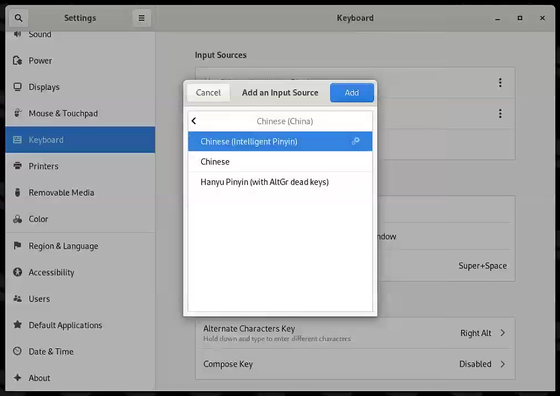

如上图所示，在 Settings > Keyboard > Input Sources 中添加 `Chinese (Intelligent Pinyin)` 即可完成设置。

### 8.14 安装 rdesktop 软件包连接 Windows RDP 桌面

```bash
$ sudo dnf install -y rdesktop
$ rdesktop -u <remote_user> -d <domain> -p <password> <hostname_or_ip>:<port>
$ rdesktop -u hwuser88 -d bestvdc -p Ansible2024! redhat.bestvdc.com:23353
# 登录 Cloudshell bestvdc desktop
```

### 8.15 RHEL9 安装 ToDesk

```bash
$ wget https://rh-course-materials.oss-cn-hangzhou.aliyuncs.com/todesk-v4.7.2.0-x86_64.rpm
$ sudo rpm -ivh todesk-v4.7.2.0-x86_64.rpm
$ sudo dnf install -y libappindicator-gtk3
# 安装 todesk 软件包依赖
$ sudo systemctl enable --now todeskd.service
# 启动并设置开机自启服务
```

### 8.16 RHEL9 安装 x11vnc 虚拟桌面与外部登录访问

#### 8.16.1 安装与设置 x11vnc 虚拟桌面

```bash
### 打开一个终端执行 ###
$ sudo dnf install -y crudini
# 安装 crudini 用于编辑 ini 格式文件
$ sudo crudini --set /etc/gdm/custom.conf WaylandEnable false
# 禁用 Wayland Server，防止与 x11vnc 启动冲突。
$ sudo systemctl restart gdm.service
# 重启 gdm 服务使配置生效
$ sudo dnf install -y x11vnc
# 安装 x11vnc 软件包
$ x11vnc -storepasswd
Enter VNC password: 
Verify password:    
Write password to /home/kiosk/.vnc/passwd?  [y]/n y
Password written to: /home/kiosk/.vnc/passwd
# 设置当前用户的 x11vnc 登录用密码
$ x11vnc -display :1 -forever -usepw -noxdamage
# 前台启动 x11vnc，可通过外部 MobaXterm 的 VNC 连接登录。

### 打开另一个终端执行 ###
$ sudo netstat -tunlp | grep x11vnc
tcp        0      0 0.0.0.0:5900            0.0.0.0:*               LISTEN      4396/x11vnc
tcp6       0      0 :::5900                 :::*                    LISTEN      4396/x11vnc
# 确认 x11vnc 监听的端口，用于外部连接的端口确认
```

#### 8.16.2 MobaXterm 的连接访问

1️⃣ 打开 MobaXterm，点击 Session 创建新会话：

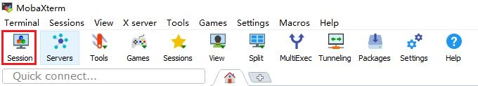

2️⃣ 点击 VNC 创建新连接：

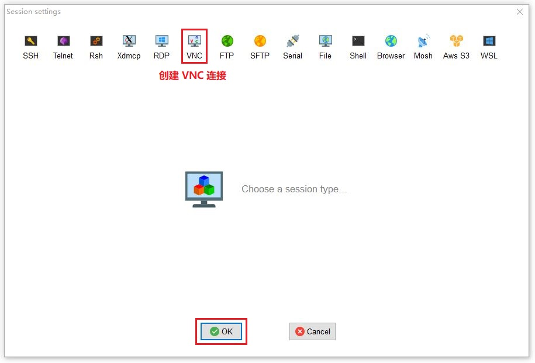

3️⃣ 输入 VNC 服务端的地址与监听端口，点击 OK 即弹出密码输入框，输入设置的 VNC 登录用户密码即可完成登录：

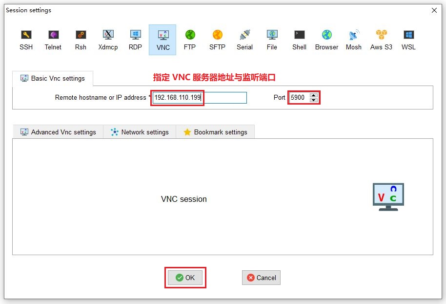

4️⃣ 可在 VNC 虚拟桌面中操作：

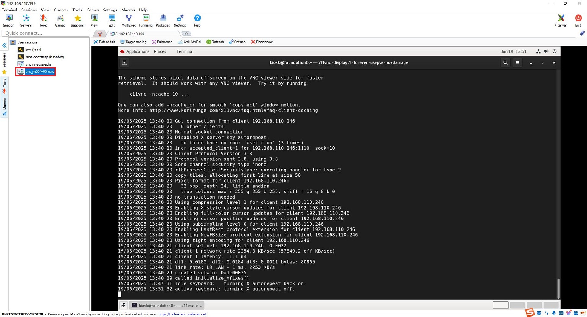

## 9. dnf 下载软件包及其依赖

```bash
$ sudo dnf install --downloadonly \
  --destdir /path/to/saving_dir \
  <package>
# 指定软件包下载目录仅仅下载对应版本的软件包（不安装）
$ sudo dnf install --downloadonly \
  --destdir ~/backup/packages/podman-deps \
  podman
# 下载 podman 及其依赖的软件包至目标目录（仅下载不安装）
```

## 10. dnf 实现软件包安全检测与更新

```bash
$ sudo dnf --security updateinfo
Loaded plugins: langpacks, product-id, search-disabled-repos, subscription-manager
Updates Information Summary: updates
    435 Security notice(s)
         16 Critical Security notice(s)
        239 Important Security notice(s)
        139 Moderate Security notice(s)
         41 Low Security notice(s)
updateinfo summary done
# 查看所有安全相关的软件包更新信息（安全通知）
$ sudo dnf --security list updates
# 查看可用的安全相关的软件包
$ sudo dnf updateinfo list updates | grep Critical
# 查看可更新软件包对应的 RHBA 与 RHSA 的列表
$ sudo dnf updateinfo RHSA-xxxx:xxxx
# 查看指定的 RHSA 信息（包含涉及的 CVE）
$ sudo dnf updateinfo list --cve CVE-xxxx-xxxx
# 查看依赖指定 CVE 编号的软件包列表
$ sudo dnf update --cve CVE-xxxx-xxxx
# 更新依赖指定 CVE 编号的软件包
```

## 11. RedHat 订阅服务使用

```bash
$ sudo subscription-manager register [--username=<username>] [--password=<password>]
# 使用订阅用户名与密码将主机注册至订阅服务器
$ sudo subscription-manager list --available
# 查看当前订阅用户可用的订阅
$ sudo subscription-manager attach --pool=<pool_id>
# 附加指定的软件订阅仓库（池）
$ sudo subscription-manager attach --pool=2c94a1c28bd4a831018bf0bfb68b3099
# 讲师可用 SKU 订阅仓库
$ sudo subscription-manager attach --pool=2c94d9658d9ea93e018da64a01e64bca
# RedHat OpenShift GitOps 订阅仓库
$ sudo subscription-manager repos --enable="*"
# 启用可用的所有订阅仓库
$ sudo subscription-manager repos --list-enabled
# 列举当前系统可用的订阅仓库
```

## 12. 如何在 Windows 11 家庭版中禁用 Hyper-V？

- ❓问题：此次需要在 `DELL Precision 3591` 上的 Windows 11 家庭版中运行 VMware 虚拟机，但在启动虚拟机过程中直接返回类似报错 "虚拟机不支持 VT-x 模式"。
- ✔️ 解决：
  - 在硬件 BIOS 中已经启用 `VT-x` 虚拟化，宿主机可运行虚拟机，但出现问题中的报错，可判断为宿主机中可能运行着 Hyper-V 组件，需将其禁用才能运行 VMware 拟机（Hyper-V 与 VMware 运行冲突导致）。

    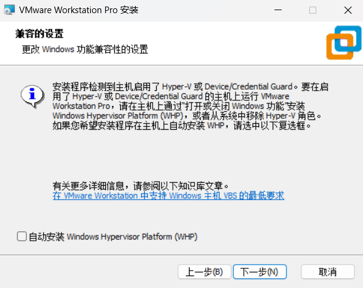
  
    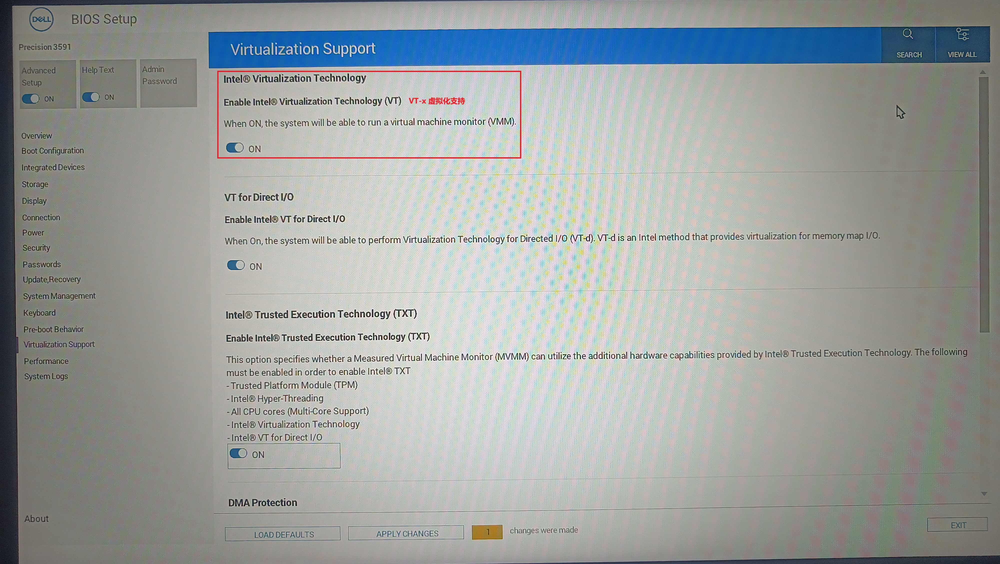

  - `Win + R` 输入 `optionalfeatures` 查看 **启动或关闭 Windows 功能**，此列表中未显示 Hyper-V 相关的功能，需要通过其他方式将其彻底关闭（Windows 11 家庭版中不会显式列出 Hyper-V 组件）。
  - 以管理员身份运行 PowerShell 关闭虚拟化调度器，执行以下命令：
  
    ```powershell
    > bcdedit /set hypervisorlaunchtype off  #关闭 Hyper-V 功能
    > bcdedit  #查看是否关闭 Hyper-V
    Windows 启动加载器
    -------------------
    ...
    hypervisorlaunchtype    Off
    ```

  - `Win + R` 输入 `windowsdefender:` 查看 **Windows 安全中心**，点击 **设备安全性-转到设置**，在 **内核隔离** 中关闭 **内存完整性**（基于虚拟化的安全性 VBS）。

    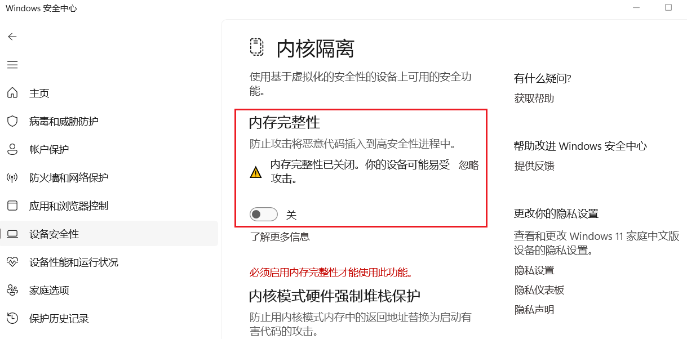

  - 重启系统使配置生效
  - 系统重启后，`Win + R` 输入 `msinfo32` 查看，是否与如下信息一致，若一致表示彻底关闭 Hyper-V，可运行 VMware 虚拟机。
  
    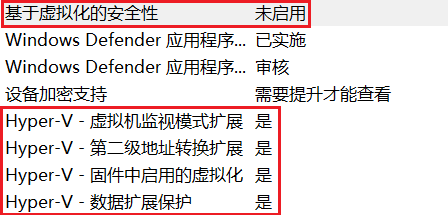

- 💥 WSL2 与 Hyper-V 的切换关系：
  - WSL2 启用 → Hyper-V 启用：WSL2 子系统的启用需要 Hyper-V 的启用。执行 `bcdedit /set hypervisorlaunchtype auto` 启用 Hyper-V，重启系统使配置生效。
  - WSL2 禁用 → Hyper-V 禁用：WSL2 子系统的启用会造成原系统中的 VMware 虚拟机无法正常启动（报错不支持 VT-x 模式）。因此，需按照 "控制面板 > 程序 > 启用或关闭 Windows 功能 > 适用于 Linux 的 Windows 子系统（去除勾选）" 以禁用 WSL2 子系统，再执行 `bcdedit /set hypervisorlaunchtype off` 禁用 Hyper-V，重启系统使配置生效。
  - 如果想再次启用 WSL2，需勾选 "适用于 Linux 的 Windows 子系统"，执行 `bcdedit /set hypervisorlaunchtype auto`，并执行 `wsl --install --no-distribution`，此命令将再次安装 WSL2，本地存在先前运行的 Linux 发行版的话也不会覆盖或丢失。

## 13. RHEL8/9/10 启用 /var/log/dmesg 日志

默认情况下，在系统引导过程中 RHEL8/9/10 不再自动生成 /var/log/dmesg 日志，因此，查看系统启动早期过程只能通过 `dmesg` 命令与 `journalctl -k` 命令完成。若需自动生成 /var/log/dmesg 日志的话，可执行以下过程完成生成：

```bash
$ sudo cat > /etc/systemd/system/dmesg.service <<EOF
[Unit]
Description=Create /var/log/dmesg on boot
ConditionPathExists=/var/log/dmesg

[Service]
ExecStart=/usr/bin/dmesg
StandardOutput=file:/var/log/dmesg

[Install]
WantedBy=multi-user.target
EOF

$ sudo touch /var/log/dmesg
$ sudo restorecon -v /var/log/dmesg

$ sudo systemctl daemon-reload
$ sudo systemctl enable dmesg.service
$ sudo systemctl reboot
```

## 14. Windows 客户端使用 RDP 协议控制 RHEL10 远程桌面

RHEL10 的 Gnome3 已内置支持 RDP 协议连接的远程桌面控制，可使用以下方法设置：

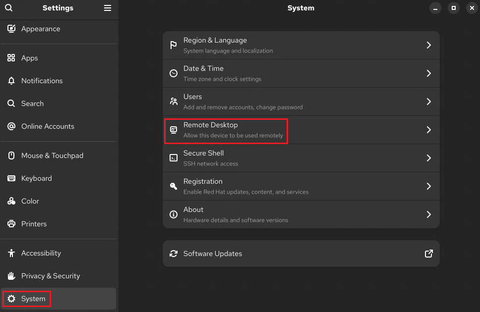

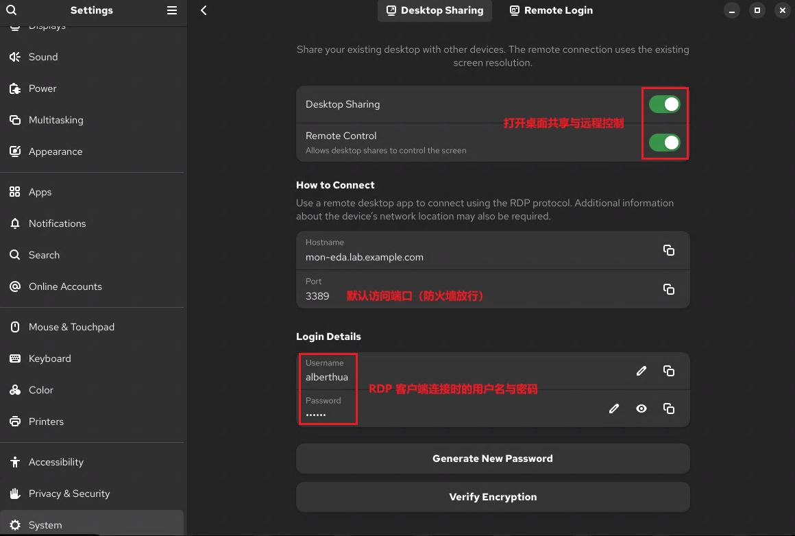

Windows 客户端使用 `Win+R` 组合键，在运行窗口中输入 `mstsc` 后可连接 Gnome3：

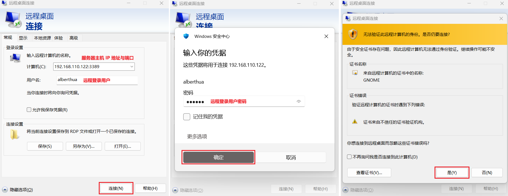

## 15. 使用已存在的 qcow2 虚拟磁盘创建 KVM 虚拟机

```bash
$ sudo chown qemu:qemu /var/lib/libvirt/images/mysle15sp6-origin.qcow2
# 更改 qcow2 虚拟磁盘属组
$ sudo virt-install --name mysle15sp6 \
  --machine q35 --boot uefi \
  --vcpus 2 --memory 4096 --disk path=/var/lib/libvirt/images/mysle15sp6-origin.qcow2,format=qcow2,bus=virtio \
  --network bridge=br-ext,model=virtio \
  --import \
  --os-variant sle15sp6 --virt-type kvm
# 指定虚拟机名称、主板芯片类型、系统引导方式、vCPU、内存、使用的 qcow2 虚拟磁盘路径与驱动类型、
# 网络类型与驱动类型、系统发行版与虚拟化类型
# 以上网络类型中的 bridge 需提前创建
$ sudo virt-viewer --connect qemu:///system mysle15sp6
# 连接虚拟机终端
$ sudo virsh destroy mysle15sp6
# 关闭虚拟机
$ sudo virsh undefine mysle15sp6
# 删除虚拟机
```

## 16. Ubuntu 24.04.4 LTS 中安装 Clash 工具

此处使用 [nelvko/clash-for-linux-install | GitHub](https://github.com/nelvko/clash-for-linux-install) 仓库安装 Linux 的 Clash 工具。

```bash
### 安装 Clash ###
$ wget https://github.com/nelvko/clash-for-linux-install/archive/refs/heads/master.zip
# 下载 Clash 源代码压缩文件
$ unzip clash-for-linux-install-master.zip
$ cd clash-for-linux-install-master
# 解压缩并进入源代码目录
$ ./install.sh
😼 安装内核：mihomo by nohup       # 首次安装会自动下载
📦 安装路径：/home/godev/clashctl  # clashctl 命令行工具安装路径

╔═══════════════════════════════════════════════╗
║                😼 Web 控制台                  ║
║═══════════════════════════════════════════════║
║                                               ║
║     🔓 注意放行端口：9090                      ║
║     🏠 内网：http://192.168.110.115:9090/ui   ║
║     🌏 公网：http://101.228.51.109:9090/ui    ║
║     ☁️ 公共：http://board.zash.run.place      ║
║                                               ║
╚═══════════════════════════════════════════════╝

😼 当前密钥：Cqblof
🎉 enjoy 🎉
    
Usage: 
  clashctl COMMAND [OPTIONS]

Commands:
  on                    开启代理
  off                   关闭代理
  proxy                 系统代理
  status                内核状态
  ui                    面板地址
  sub                   订阅管理
  log                   内核日志
  tun                   Tun 模式
  mixin                 Mixin 配置
  secret                Web 密钥
  upgrade               升级内核

Global Options:
  -h, --help            显示帮助信息

For more help on how to use clashctl, head to https://github.com/nelvko/clash-for-linux-install
✈️  请输入要添加的订阅链接：********************    # 输入订阅地址
⏳ 正在下载...
🍃 验证订阅配置...
🎉 订阅已添加：[1] ********************    # 返回输入的订阅地址
🔥 订阅已生效

### 管理订阅地址 ###
$ clashctl sub add <url>
# 添加新的订阅地址
$ clashctl sub ls
# 查看使用的订阅
use: 1
# 订阅列表
profiles:
  - id: 1
    path: /home/godev/clashctl/resources/profiles/1.yaml
    url: ********************
  - id: 2
    path: /home/godev/clashctl/resources/profiles/2.yaml
    url: ********************
$ clashctl sub use <id>
# 切换不同的订阅地址

### 管理 Clash 工作模式 ###
# 注意：此处使用隧道模式实现代理
$ clashctl tun on
$ clashctl tun off
# 启用或关闭 Clash 的隧道模式

$ clashctl proxy on
$ clashctl proxy off
# 启用或关闭 Clash 的系统代理模式

### Clash UI 界面访问 ###
$ clashctl ui  # 使用内网方式访问

╔═══════════════════════════════════════════════╗
║                😼 Web 控制台                  ║
║═══════════════════════════════════════════════║
║                                               ║
║     🔓 注意放行端口：9090                      ║
║     🏠 内网：http://192.168.110.115:9090/ui   ║
║     🌏 公网：http://101.228.51.109:9090/ui    ║
║     ☁️ 公共：http://board.zash.run.place      ║
║                                               ║
╚═══════════════════════════════════════════════╝

$ clashctl secret
😼 当前密钥：kCJJrh
# 查看登录 Web 界面所需的密钥

### 启用或关闭 Clash 代理 ###
$ clashctl on
$ clashctl off
```

浏览器中输入前文的内网地址与密钥即可登录设置代理：

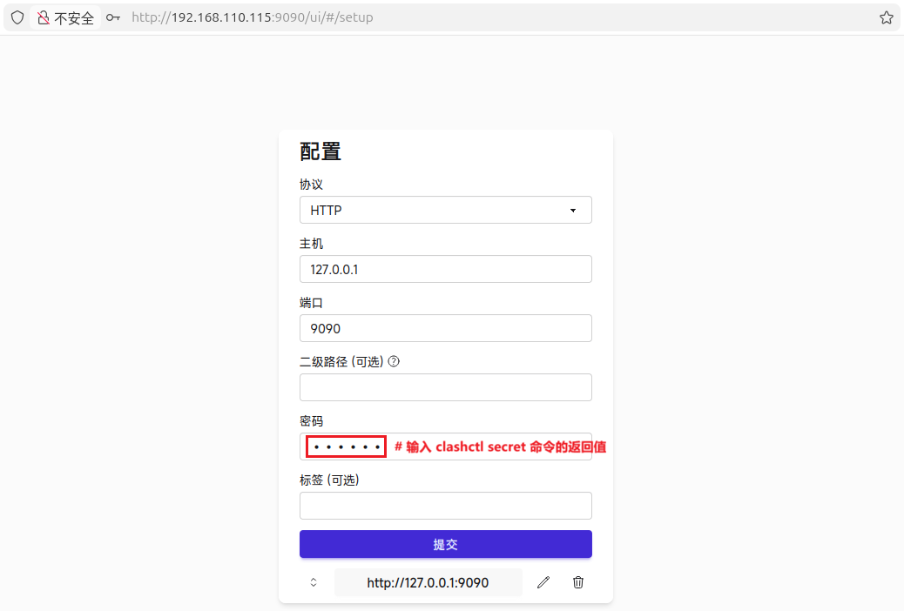

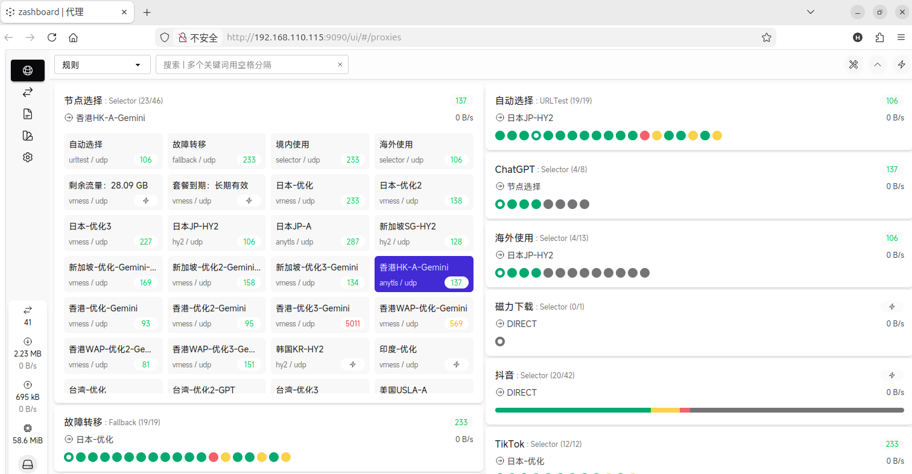

```bash
$ ping -c3 google.com
PING google.com (28.0.0.23) 56(84) bytes of data.
64 bytes from 28.0.0.23: icmp_seq=1 ttl=64 time=0.240 ms
64 bytes from 28.0.0.23: icmp_seq=2 ttl=64 time=0.063 ms
64 bytes from 28.0.0.23: icmp_seq=3 ttl=64 time=0.168 ms

--- google.com ping statistics ---
3 packets transmitted, 3 received, 0% packet loss, time 6005ms
rtt min/avg/max/mdev = 0.063/0.157/0.240/0.072 ms
# 测试 Google 连通性
```

💥 注意：若调用 OpenAI 的 API，请选择日本或新加坡节点代理，香港节点受地区限制无法调用 API！

## 17. 参考链接

- [1.7. 为所有用户禁用 Wayland | RedHat Doc](https://docs.redhat.com/zh-cn/documentation/red_hat_enterprise_linux/9/html/getting_started_with_the_gnome_desktop_environment/proc_disabling-wayland-for-all-users_assembly_overview-of-gnome-environments)
- [7.2. 可用的输入法引擎 | RedHat Doc](https://docs.redhat.com/zh-cn/documentation/red_hat_enterprise_linux/9/html/getting_started_with_the_gnome_desktop_environment/ref_available-input-method-engines_assembly_enabling-chinese-japanese-or-korean-text-input)
- [The /var/log/dmesg file is not created during boot for Red Hat Enterprise Linux](https://access.redhat.com/solutions/3748981)
