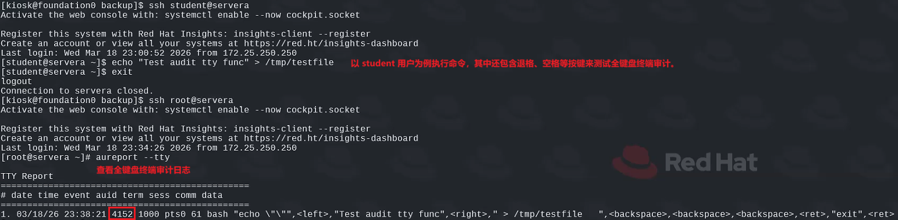
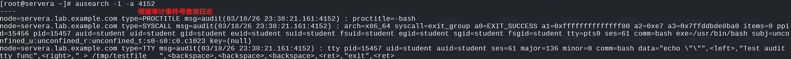

# Linux 中使用 AUDIT 记录系统事件

## 文档目录

- [Linux 中使用 AUDIT 记录系统事件](#linux-中使用-audit-记录系统事件)
  - [文档目录](#文档目录)
  - [1. 配置 Audit 以记录系统事件](#1-配置-audit-以记录系统事件)
    - [1.1 Linux Audit 系统](#11-linux-audit-系统)
    - [1.2 使用 Audit 审计系统](#12-使用-audit-审计系统)
    - [1.3 配置 auditd](#13-配置-auditd)
    - [1.4 使用 auditd 进行远程日志记录](#14-使用-auditd-进行远程日志记录)
  - [2. 检查 Audit 日志](#2-检查-audit-日志)
    - [2.1 解读 Audit 消息](#21-解读-audit-消息)
    - [2.2 搜索事件：ausearch 命令](#22-搜索事件ausearch-命令)
    - [2.3 常见的审计记录类型](#23-常见的审计记录类型)
    - [2.4 审计记录字段说明](#24-审计记录字段说明)
    - [2.5 Audit 消息报告：aureport 命令](#25-audit-消息报告aureport-命令)
    - [2.6 追踪程序：autrace 命令](#26-追踪程序autrace-命令)
  - [3. 编写自定义审计规则](#3-编写自定义审计规则)
    - [3.1 添加规则](#31-添加规则)
    - [3.2 检查规则](#32-检查规则)
    - [3.3 使规则不可变](#33-使规则不可变)
    - [3.4 持久规则](#34-持久规则)
  - [4. 启用预打包的审计规则集](#4-启用预打包的审计规则集)
    - [4.1 预打包的审计规则集](#41-预打包的审计规则集)
    - [4.2 全终端按键记录](#42-全终端按键记录)
  - [🆕 5. 补充讨论](#-5-补充讨论)
    - [5.1 sudo 命令的执行过程](#51-sudo-命令的执行过程)
    - [🎯 **5.2 审计字段各类 uid 的探讨**](#-52-审计字段各类-uid-的探讨)
    - [5.3 su 命令的认证流程](#53-su-命令的认证流程)
    - [5.4 strace 命令的安全限制](#54-strace-命令的安全限制)
    - [🪄 **5.5 使用 GDB 调试器劫持 su 认证过程切换任意用户**](#-55-使用-gdb-调试器劫持-su-认证过程切换任意用户)

-----

## 1. 配置 Audit 以记录系统事件

### 1.1 Linux Audit 系统

- Linux Audit 系统是内核中的一种机制，提供了一种在系统上跟踪与安全相关的事件和信息的方法。
- 可定义一组加载到内核中的规则，以指定它在审计日志中记录哪些事件。
- **auditd 系统守护进程将记录的事件写入本地磁盘，或将它们转发到远程日志服务器。**
- 然后，可使用此信息来发现和调查违反或企图违反系统安全策略的原因。
- 可将 Audit 配置为根据用户身份、安全上下文或其他标签包含或排除事件。
- Audit 系统可收集的事件相关信息：
  - 事件的日期和时间、类型以及结果。
  - 主题和对象的敏感度标签。
  - 事件与触发事件的用户身份之间的关系。
  - 对 Audit 配置的所有修改，以及尝试访问 Audit 日志文件的行为。
  - 所有身份认证机制的使用情况，如 SSH 和 Kerberos 等。
  - 对任何受信任数据库的更改，如 /etc/passwd。
  - 尝试在系统中导入或导出信息的行为。

### 1.2 使用 Audit 审计系统

- **auditd 是 Linux 审计子系统的用户空间组件（user-space component）。**
- 在守护进程启动时，启动 auditd 的 systemd 单元文件，通常会加载所有持久性审计规则。
- 当 Audit 规则加载至内核后，内核使用规则报告相关的事件。
- 内核将事件相关的信息发送给 auditd 守护进程。
- auditd 守护进程的角色：收集由内核报告的审计事件信息，并将其保存至日志文件中。
- ✅ 审计流程：*audit_rules* ⬅ *kernel* ➡ *audit_events* ➡ *auditd* ➡ *log_file*
- auditd 守护进程运行时，事件信息将被写入 **<span style="color:orange">/var/log/audit/audit.log</span>**，该守护进程不运行时，rsyslog 接收内核的审计信息。
- 若没有任何额外的配置，仅有限数量的消息通过审计系统，主要是身份认证和授权消息（用户正在登录、正在使用 sudo 等）和 SELinux 消息。
- 使用 auditctl 命令添加控制审计系统的审计规则、监视文件或有关任何系统调用的记录信息。

### 1.3 配置 auditd

- /etc/audit/auditd.conf：auditd 守护进程主配置文件
- /etc/audit/audit.rules：auditd 加载的审计规则
  
  > 注意：不要编辑以上文件，auditd 在启动时将从 /etc/audit/audit.d/ 中生成该文件！

- /etc/audit/rules.d：手动配置审计规则的目录

  > 注意：该目录中的所有审计规则在 auditd 启动时被合并入 /etc/audit/audit.rules 中，并加载至内核中。

- /etc/audit/rules.d/audit.rules：手动管理的审计规则文件

```bash
$ sudo systemctl [start|stop|restart|enable|disable] auditd.service
# 启动、停止、重启、开机自启动、开机不自启动 auditd 服务
```

- auditd 启动后，其 systemd 单元文件自动从 /etc/audit/rules.d 中重建审计规则集，并将其加载至内核中。
- 当 auditd 重新加载时，它会尝试使用 **augenrules** 命令重建规则文件并加载新的规则。
- ❗若加载了使当前规则不可变的控制规则，可能会失败，需重新引导系统以更改加载的规则集。
- 调整 auditd 设置以管理存储：
  - 根据加载的审计规则，审计日志可能会非常快速地变大。
  - ✅ 推荐做法：/var/log/audit 目录最好是带有自有文件系统的挂载点，这样就不会有其他进程因存储空间和性能调优原因而与审计日志竞争。
  - 若审计系统由于缺少存储空间而无法将事件记录到磁盘，则系统必须立即停止或降级到单用户模式，这是为了确保不会在没有记录的情况下发生任何事件。
  - auditd 护进程具有相关的机制，可以在即将发生这种情况时发出警告，并在存储变低时采取各种操作。
  - /etc/audit/auditd.conf 配置文件参数：

    | 参数/指令（directive） | 描述（description） |
    | ----- | ----- |
    | log_file | 用于存储审计日志文件的位置，默认为 /var/log/audit/audit.log。 |
    | max_log_file | 最大审计日志文件大小（以 MB 为单位）。<br> 当到达此阈值，触发 max_log_file_action 参数设置的操作。 |
    | max_log_file_action | 当审计日志文件大小到达 max_log_file 后执行的操作。<br> 默认设置为 `ROTATE`，这将轮转日志文件，由 num_logs 参数指定保持旧日志文件的数量；如果设置为 `KEEP_FILES`，日志文件将轮转且不被删除（忽略 num_logs 参数）。KEEP_FILES 将最终占满日志文件所在的存储，除非备份或移除这些旧日志文件。 |
    | space_left | 审计日志文件所在的文件系统上剩余的可用空间大小（以 MB 为单位），用于触发 space_left_action 参数中设置的操作。<br> 此参数必须设置为一个数字，以便管理员有足够的时间来响应并释放文件系统空间，并在文件系统仅剩余 admin_space_left 的可用空间前采取行动。 |
    | space_left_action | 默认设置为 `SYSLOG`，这记录 warning 日志。<br> 如果设置为 `EMAIL`，系统上配置了 /usr/lib/sendmail（Postfix 或 Sendmail 提供），email 会发送到由 action_mail_acct 参数指定的地址。可选地，也可设置为 `EXEC /path/to/script` 或 `/path/to/script` 命令来运行。 |
    | admin_space_left | 审计日志文件所在的文件系统上可用空间的绝对最小值（以 MB 为单位），用于触发 admin_space_left_action 参数设置的操作。<br> 此参数必须设置为⼀个数字，确保留出⾜够的空间来记录管理员执⾏的操作。此参数通常会暂停 auditd 守护进程或停⽌整个系统，以保留少量的可⽤空间来修复问题。 |
    | admin_space_left_action | 到达 admin_space_left 参数设置的阈值时执行的操作。<br> 默认设置为 `SUSPEND`，这将引起 auditd 停止向文件系统写入审计记录。许多安全策略要求将此参数设置为 `SINGLE`（将系统置于单用户模式，允许管理员进行修复）或 `HALT`（暂停整个系统）。由于系统没有维持完整的审计日志，这些安全策略设置这些值来禁止操作此系统。 |
    | disk_full_action | 审计日志所在文件系统没有可用空间时触发的操作。<br> 此参数可设置为 `SUSPEND`、`SINGLE` 或 `HALT`。此参数可确保当审计⽆法再记录事件时，系统已关闭或在单⽤⼾模式下。 |
    | disk_error_action | 审计日志所在文件系统还有可用空间，但检测到错误时触发的操作。<br> 默认设置为 `SUSPEND`，这将停止记录审计事件。也可设置为 `SINGLE` 或 `HALT`。 |

    ```bash
    $ man 5 auditd.conf
    # 查看 auditd 服务配置文件参数的详细信息
    ```

- 调整以下 /etc/audit/auditd.conf 参数以提高 auditd 服务性能：
  - flush = INCREMENTAL_ASYNC：
    - 达到 freq 指定的写入次数后将记录异步清理到存储，以提高系统性能。
    - 但由于系统崩溃时审计消息可能丢失，此时需将此参数设置为 DATA 或 SYNC。
    - 以相对较低的 freq 设置使用 INCREMENTAL_ASYNC，可确保记录快速同步到文件系统，同时保持良好的系统性能。
  - freq = 50：
    - 在每 50 条记录后清空 Audit 日志（假设设置 flush = INCREMENTAL_ASYNC）。
    - 若 flush 设置为 DATA 或 SYNC，则忽略此设置，并且每次写入存储都是同步的。
  - ❗只有设置 flush = INCREMENTAL_ASYNC 时，freq 参数才起作用！
  
  > 说明：可以理解为减小批次的记录，提高异步刷新的频率来提高审计记录的性能。

### 1.4 使用 auditd 进行远程日志记录

- 可通过以下两种方式将审计消息发送到远程系统：
  - 1️⃣ 可将审计消息发送到本地 rsyslog 服务并将其转发至 rsyslog 配置的远程服务器。
  - 2️⃣ 可将系统配置为将审计消息发送到远程 auditd 服务。
- **配置客户端：**
  - 使用以上两种方式均需对系统的 /etc/audit/auditd.conf 文件进行以下更改：
    - log_format = ENRICHED：在传输每个事件之前解析 UID、GID、系统调用数量、架构和套接字地址信息等，保证该日志信息在远程系统上有意义，远程系统上可能具有以上映射的不同值。
    - name_format = HOSTNAME：在每条消息中包含主机名，区别审计消息所属的主机。
  - 针对于 **第一种方式**：
    - 1️⃣ 需在客户端安装 audispd-plugins 软件包。
    - 2️⃣ 设置客户端 **<font color=orange>/etc/audit/plugins.d/syslog.conf</font>** 文件中 active = yes 可将消息发送到 rsyslog。
    - 3️⃣ 配置本地 rsyslog 服务，将日志消息发送到 /etc/rsyslog.conf 文件中定义的远程日志服务器。
    - ⚗️ 补充实验：[LogAnalyzer 集成 auditd 日志](https://github.com/Alberthua-Perl/sc-col/tree/master/rsyslog-loganalyzer-viewer#loganalyzer-%E9%9B%86%E6%88%90-auditd-%E6%97%A5%E5%BF%97)
  - 针对于 **第二种方式**：
    - 1️⃣ 需在客户端安装 audispd-plugins 软件包。
    - 2️⃣ 设置客户端 **<font color=orange>/etc/audit/plugins.d/au-remote.conf</font>** 文件中的 active = yes。
    - 3️⃣ 设置客户端 **<font color=orange>/etc/audit/audisp-remote.conf</font>** 文件中的 remote_server 指令为远程 auditd 服务器的 IP 地址或主机名，若远程服务器未监听默认 60/TCP 端口的话，需更新 port 指令。
- **配置服务端：**
  - 针对于 **第一种方式：**
    - 1️⃣ 配置 rsyslog 服务 /etc/rsyslog.conf 文件，配置其为服务端并监听 514/UDP 或 514/TCP 端口，接收来自客户端的审计消息。（参考前文补充实验）
  - 针对于 **第二种方式：**
    - 1️⃣ 设置 /etc/audit/auditd.conf 文件中的 tcp_listen_port = 60 指令（60/TCP）用以监听远程客户端的审计消息。
    - 2️⃣ 设置 firewalld 以放行 60/TCP 端口。
    - ❗必须以重启操作系统的方式来重启 auditd 服务使其配置生效。

    > 注意：<br>
    > 默认情况下，以上两种方式传输审计日志均通过未加密的明文方式实现，缺少安全加密极可能导致关键信息暴露或窃取。<br>
    > rsyslog 服务必须通过 TLS 认证与加密保护审计日志传输；auditd 守护进程使用 Kerberos 认证与加密（客户端 /etc/audisp/audisp-remote.conf 与服务端 /etc/audit/auditd.conf）。<br>
    > 查看 man 手册：audisp-remote.conf(5)，auditd.conf(5)

- 📝 常用离线帮助文档：
  
  ```bash
  $ man 5 auditd.conf           # 查看 auditd 服务配置文件的详细使用信息
  $ man 5 audisp-remote.conf    # 查看 audisp-remote 配置文件信息
  $ man 7 audit.rules           # 查看内核审计系统的规则集合信息
  ```

-----

## 2. 检查 Audit 日志

### 2.1 解读 Audit 消息

- /var/log/audit/audit.log 中记录的 Audit 事件在紧凑的格式中纳入许多的信息。
- 一个事件实际上可能会记录多个不同类型的审计记录到日志中，作为单独的消息。
- 这些记录可能各自包含多个字段，记录事件的相关信息。
- 示例：/var/log/audit/audit.log 文件中未经处理的单个审计事件（audit event）相关的多条审计记录（audit record）<br>
  1️⃣ **type=SYSCALL msg=audit(1371716130.596:28708)**: arch=c000003e **syscall=2** success=yes exit=4 a0=261b130 a1=90800 a2=e a3=19 items=1 ppid=2548 pid=26131 **auid=1000** uid=0 gid=0 euid=0 suid=0 fsuid=0 egid=0 sgid=0 fsgid=0 tty=pts0 ses=1 comm="aureport" exe="/sbin/aureport" subj=unconfined_u:unconfined_r:unconfined_t:s0-s0:c0.c1023 **key="audit-access"**<br>
  2️⃣ type=CWD msg=audit(1371716130.596:28708):  cwd="/root"<br>
  3️⃣ type=PATH msg=audit(1371716130.596:28708): item=0 name="/var/log/audit" inode=17998 dev=fd:01 mode=040750 ouid=0 ogid=0 rdev=00:00 obj=system_u:object_r:auditd_log_t:s0<br>
  
  以上输出显示了三条审计记录，它们都属于审计事件 **28708** 的一部分。<br>
  - "type=SYSCALL" 记录指明了 "type" 字段的内容。每条审计记录都有一个记录类型，有时也被称为消息类型，这种类型是由每个记录开头的 "type" 字段体现。此记录为 "SYSCALL" 记录。
  - "msg=audit(1371716130.596:28708)" 这条记录指出了 "msg" 字段的内容。该 "msg" 字段给出了此记录的 **时间戳** 以及 **审计事件编号**。冒号前的数字（在本例中为 1371716130.596）是以秒为单位表示的自起始时间点（即 1970 年 1 月 1 日 00:00 UTC）以来的时间戳。可使用 `date --date=@<起始时间>` 命令将起始时间转换为本地时间。冒号后的数字（28708）是审计事件编号，该记录与该事件的其他记录共享此编号。
  - "syscall=2" 记录指代的是系统调用字段。第一条记录的类型为 "SYSCALL"，这表示的是向内核发出的系统调用的相关信息。这个系统调用字段表示的是所发出的系统调用的编号（而非其名称）。系统调用编号与名称之间的对应关系在不同的处理器架构中可能会有所不同（X86/ARM/MIPS/RISC-V 等架构），这就是为什么在没有帮助的情况下直接解读原始格式的日志可能会很困难的原因之一。可以使用 ausearch 命令来提供帮助。
  
    ```bash
    $ sudo uname -a
    Linux foundation0.ilt.example.com 5.14.0-570.12.1.el9_6.x86_64 #1 SMP PREEMPT_DYNAMIC Fri Apr 4 10:41:31 EDT 2025 x86_64 x86_64 x86_64 GNU/Linux
    # 查看系统内核版本
    $ sudo head -n 10 /usr/include/asm/unistd_64.h    # x86_64 架构中系统调用与编号对应关系
    #ifndef _ASM_UNISTD_64_H
    #define _ASM_UNISTD_64_H

    #define __NR_read 0
    #define __NR_write 1
    #define __NR_open 2
    #define __NR_close 3
    #define __NR_stat 4
    #define __NR_fstat 5
    #define __NR_lstat 6

    $ sudo ausyscall x86_64 newfstatat    # ausyscall 正向与反向查看系统调用
    newfstatat         262
    $ sudo ausyscall x86_64 262
    newfstatat
    ```

  - "auid=1000" 记录指代的是 "auid" 字段。该 "auid" 字段记录了触发此事件的用户的审计用户标识（Audit UID）。这是触发此事件的用户最初用于 **<font color=orange>登录此机器的账户的标识</font>**，即便该用户使用了 sudo 或 su 命令以其他用户身份登录也是如此，即 **<font color=orange>原始登录用户</font>**。

### 2.2 搜索事件：ausearch 命令

- 审计系统附带 ausearch 命令，该命令用于搜索审计日志。
- 可使用 ausearch 搜索和过滤各种类型的事件。
- 可将数值转换为更易读的值，如用户名或系统调用名，以解读这些事件。
- 常用的 ausearch 命令选项：
  
  | 选项 | 描述 |
  | ----- | ----- |
  | -i | 解析日志记录，将数值转换为名称。当拥有原始日志文件时，此功能非常有用。 |
  | --raw | 打印原始日志条目，甚至不要在事件之间添加分隔符。可配合其他能够解析原始日志格式的工具。与选项 -r 等效。 |
  | -a `<EVENT-ID>` | 显示具有 `<EVENT-ID>` 作为事件标识的该事件的所有记录。 |
  | -m `<MESSAGE-TYPE>` | 显示所有包含 `<MESSAGE-TYPE>` 作为其消息类型记录的事件。与长选项 --message 等效。 |
  | -f `<FILENAME>` | 搜索与特定文件名相关的所有事件。与长选项 --file 等效。 |
  | -k `<KEY>` | 查找所有标有 `<KEY>` 键的事件。 |
  | --start `[start-date]` `[start-time]` | 仅需在 *start-date* 和 *start-time* 之后进行搜索。如果未指定开始时间，搜索将默认设定为午夜（midnight）。如果未指定开始日期，搜索将默认设定为今天（today）。 <br> 时间格式取决于当前的地区设置。还可以使用其他值，如 **recent**（过去十分钟内）、**this-week**、**this-month** 和 **this-year**。 <br> **--end** 可用于查找在特定日期和时间之前发生的事件，并且其使用方式与 **--start**相同。 |

  ```bash
  $ sudo ausearch -i -if /path/to/file
  # 查看指定文件的全部审计记录

  $ sudo ausearch -i -a <EVENT-ID>
  # 查看指定审计事件的全部审计记录

  $ sudo ausearch -p <PID> --raw
  # 查看指定进程的原始审计日志条目

  $ sudo ausearch -m <MESSAGE-TYPE>
  # 根据消息类型搜索审计记录

  $ sudo ausearch -f /path/to/file
  # 根据文件名称搜索审计记录

  $ sudo ausearch -i --start "dd/mm/yyyy" "hh:mm:ss" -f <filename>
  # 基于文件名的审计日志查询

  $ sudo ausearch -ui <UID>
  # 根据用户 ID 搜索审计记录
  ```

- 🔎 **解释审计日志条目：**

  🎯 Audit 审计事件字段汇总：[Audit Event Fields | RHEL Audit System Reference](https://access.redhat.com/articles/4409591)，如果由于访问权限问题，可直接访问 [GitHub 链接](https://github.com/Alberthua-Perl/tech-docs/blob/master/Linux%20%E5%9F%BA%E7%A1%80%E4%B8%8E%E8%BF%9B%E9%98%B6/Linux%20%E4%B8%AD%E4%BD%BF%E7%94%A8%20AUDIT%20%E8%AE%B0%E5%BD%95%E7%B3%BB%E7%BB%9F%E4%BA%8B%E4%BB%B6/RHEL%20Audit%20System%20Reference%20-%20Red%20Hat%20Customer%20Portal.pdf)。

  ```bash
  $ sudo ausearch -i -a 28708
  ----
  type=PATH msg=audit(07/31/2023 10:15:30.596:28708) : item=0 name=/var/log/
  audit inode=17998 dev=fd:01 mode=dir,750 ouid=root ogid=root rdev=00:00
  obj=system_u:object_r:auditd_log_t:s0
  type=CWD msg=audit(07/31/2023 10:15:30.596:28708) :  cwd=/root
  type=SYSCALL msg=audit(07/31/2023 10:15:30.596:28708) : arch=x86_64 syscall=open
  success=yes exit=4 a0=261b130 a1=90800 a2=e a3=19 items=1 ppid=2548 pid=26131
  auid=student uid=root gid=root euid=root suid=root fsuid=root egid=root
  sgid=root fsgid=root tty=pts0 ses=1 comm=aureport exe=/sbin/aureport
  subj=unconfined_u:unconfined_r:unconfined_t:s0-s0:c0.c1023 key=audit-access
  ```

  - 每个审计事件之间都以四个破折号隔开。
  - 此输出显示了 **PATH**、**CWD** 和 **SYSCALL** 事件类型。
  - PATH 记录是与该事件相关的文件。该文件名为 /var/log/audit（name=/var/log/audit），其 inode 为 17998（inode=17998）。该文件位于文件系统上的一个设备上，其主/次设备号为 253，1（dev=fd:01，设备编号采用**十六进制格式**）。通过使用 ls -l 命令在 /dev 目录中查看，可以看到 /dev/dm-1 设备具有这些编号，并与一个逻辑卷相关联。该文件是一个目录，具有八进制权限 750（mode=dir,750），由 root 用户和 root 组所有（ouid=root ogid=root），具有 SELinux 类型 auditd_log_t（obj=system_u:object_r:auditd_log_t:s0）。
  - CWD 记录指的是与引发此事件的进程相关联的当前工作目录，在此例中为 /root 目录。
  - SYSCALL 记录即触发此事件的系统调用。使用 **open()** 系统调用（syscall=open）成功（success=yes）打开了由 PATH 记录指定的文件（即 /var/log/audit 目录）。此调用由具有 26131 PID 的进程执行（pid=26131）。该调用由 /sbin/aureport 可执行文件启动（exe=/sbin/aureport），并以 root 有效用户 ID（euid=root）和无限制 SELinux 域 （subj=unconfined_u:unconfined_r:unconfined_t:s0-s0:c0.c1023）由 root 用户（uid=root）运行。该命令在 pts/0 虚拟终端（tty=pts0）上运行，可能是图形终端窗口或远程登录会话。用户**最初**以 student 用户身份登录（auid=student），此后不知何故变成了 root 用户。此记录设置了审计访问键，以便使用 ausearch 命令更容易找到其事件（key=audit-access）。

### 2.3 常见的审计记录类型

| 记录类型 | 描述 |
| ----- | ----- |
| **CWD** | 与此事件相关的**当前工作目录**。 |
| **PATH** | 与此事件中涉及的文件路径相关的信息。请特别注意其 `objtype` 字段，该字段记录了此记录为何参与包含 **SYSCALL** 记录的事件。同一事件中可能存在多个 **PATH** 记录，对应因不同原因而涉及的文件。 |
| **PROCTITLE** | 触发此事件的完整命令行。 |
| **SYSCALL** | 触发此事件的、向内核发起的系统调用。特定的系统调用（如 `open()`、`fchmod()` 和 `setxattr()`）通常与文件变更事件相关。**该记录也最有可能是包含有关哪个用户和进程参与该操作的最详细信息的记录。** |

### 2.4 审计记录字段说明

| 字段 | 描述 |
| ----- | ----- |
| **a0** | 系统调用的第一个参数。 |
| **a1** | 系统调用的第二个参数。在 x86_64 架构的 `open(2)` 系统调用中，此字段尤为重要，因为它记录了用于打开文件的访问模式。`O_WRONLY` 或 `O_RDWR` 模式表示该系统调用正尝试以可写模式打开文件。 |
| **a2** | 系统调用的第三个参数。 |
| **a3** | 系统调用的第四个参数。 |
| **auid** | 审计 UID。**这是用户最初登录系统时使用的用户 ID。** 即使用户使用 `su` 或其他命令更改了其实际 UID，该值也保持不变。 |
| **cwd** | 与此事件相关的当前工作目录。 |
| **euid** | 有效 UID。**这是进程用于权限检查的用户 ID。** 例如，一个设置了 set-user-ID root 权限的可执行文件由普通用户运行时，其有效 UID 为 root，除非它主动放弃了特权。 |
| **egid** | 有效 GID。**这是进程用于权限检查的组 ID。** |
| **proctitle** | 进程标题。显示执行的完整命令行及其参数。该字段以 **十六进制** 编码表示。使用 `ausearch` 的 `-i` 选项可对其进行解码。 |
| **syscall** | 发送给内核的系统调用。 |
| **success** | 显示系统调用是否成功。 |
| **tty** | 控制该进程的终端或伪终端。如果命令是作为交互式会话的一部分运行的，且用户有多个会话正在进行中，此字段可用于帮助识别是哪个会话用于运行该命令。 |
| **uid** | 真实 UID。**启动该进程的用户 ID。**这可能与用户的初始登录 ID 不同。例如，用户可以使用 `su` 从一个用户切换到另一个用户，从而更改其真实 UID。同样，如果进程是由 set-user-ID 或 set-group-ID 可执行文件启动的，进程的有效 UID 或 GID 可能会有所不同。 |

### 2.5 Audit 消息报告：aureport 命令

- aureport 命令可用于获取审计消息的快速概览和特定类型事件的详细报告。
- 常用选项：
  
  ```bash
  $ aureport --help
  usage: aureport [options]
        -a,--avc                        Avc report
        -au,--auth                      Authentication report
        --comm                          Commands run report
        -c,--config                     Config change report
        -cr,--crypto                    Crypto report
        --debug                         Write malformed events that are skipped to stderr
        --eoe-timeout secs              End of Event Timeout
        -e,--event                      Event report
        --escape option                 Escape output
        -f,--file                       File name report
        --failed                        only failed events in report
        -h,--host                       Remote Host name report
        --help                          help
        -i,--interpret                  Interpretive mode
        -if,--input <Input File name>   use this file as input
        --input-logs                    Use the logs even if stdin is a pipe
        --integrity                     Integrity event report
        -k,--key                        Key report
        -l,--login                      Login report
        -m,--mods                       Modification to accounts report
        -ma,--mac                       Mandatory Access Control (MAC) report
        -n,--anomaly                    aNomaly report
        -nc,--no-config                 Don't include config events
        --node <node name>              Only events from a specific node
        -p,--pid                        Pid report
        -r,--response                   Response to anomaly report
        -s,--syscall                    Syscall report
        --success                       only success events in report
        --summary                       sorted totals for main object in report
        -t,--log                        Log time range report
        -te,--end [end date] [end time] ending date & time for reports
        -tm,--terminal                  TerMinal name report
        -ts,--start [start date] [start time]   starting data & time for reports
        --tty                           Report about tty keystrokes
        -u,--user                       User name report
        -v,--version                    Version
        --virt                          Virtualization report
        -x,--executable                 eXecutable name report
        If no report is given, the summary report will be displayed
  ```

  ```bash
  $ sudo aureport -x -i
  # 生成命令执行报告

  $ sudo aureport -u -i
  # 生成用户活动报告

  $ sudo aureport --summary
  # 生成汇总报告

  $ sudo aureport --tty
  # 生成终端按键报告
  ```

- ❗aulast 命令与 aulastlog 命令和 last 命令与 lastlog 命令极其类似，但前者不解析 `/var/log/wtmp` 与 `/var/log/btmp` 文件。

  | 特性 | /var/log/wtmp | /var/log/btmp |
  | ----- | ----- | ----- |
  | **记录内容** | **成功登录**历史 | **失败登录**尝试（暴力破解痕迹） |
  | **数据格式** | 二进制（utmp 结构） | 二进制（utmp 结构） |
  | **读取命令** | `last` | `lastb` |
  | **审计价值** | 追踪用户会话、取证分析 | 检测攻击行为、安全审计 |
  | **日志轮转** | 通常保留（`wtmp.1`） | 通常保留（`btmp.1`） |
  | **权限要求** | root 可读 | root 可读 |

  ```bash
  $ sudo last
  # 查看系统上全局成功登录记录

  $ sudo last <username>
  # 查看系统上指定用户的成功登录记录

  $ sudo lastb
  # 查看系统上全局失败登录记录

  $ sudo lastb <username>
  # 查看系统上指定用户的失败登录记录
  ```

### 2.6 追踪程序：autrace 命令

- autrace 命令可用于调查进程执行的系统调用，该命令与 strace 命令非常类似。
- 💥 运行 autrace 命令将删除所有自定义审计规则，并将其替换为专门用于追踪指定程序的规则。
- 执行完成后，autrace 命令将清除这些规则，然后提供示例 ausearch 命令来调查这些事件。
- 这对于排除故障或调查感兴趣的程序非常有用。
- 示例：使用 autrace 调查 ip 命令的系统调用

  ```bash
  $ sudo autrace /usr/sbin/ip link show dev eth0
  Waiting to execute: /usr/sbin/ip
  2: eth0: <BROADCAST,MULTICAST,UP,LOWER_UP> mtu 1500 qdisc fq_codel state UP mode DEFAULT group default qlen 1000
      link/ether 52:54:00:00:fa:0a brd ff:ff:ff:ff:ff:ff
      altname enp1s0
  Cleaning up...
  Trace complete. You can locate the records with 'ausearch -i -p 1959'

  $ sudo ausearch -i -p 1959                            # 方法1：输出此进程的解析的审计日志
  ...
  $ sudo ausearch --raw -p 1959 | aureport -i --file    # 方法2：输出此进程的原始审计日志，配合 aureport 命令解析。

  File Report
  ===============================================
  # date time file syscall success exe auid event
  ===============================================
  1. 03/15/26 23:53:23  newfstatat yes /usr/sbin/autrace root 326
  2. 03/15/26 23:53:24 /usr/sbin/ip execve yes /usr/sbin/ip root 330
  3. 03/15/26 23:53:24 /etc/ld.so.preload access no /usr/sbin/ip root 333
  4. 03/15/26 23:53:24 /etc/ld.so.cache openat yes /usr/sbin/ip root 334
  5. 03/15/26 23:53:24  newfstatat yes /usr/sbin/ip root 335
  6. 03/15/26 23:53:24 /lib64/libbpf.so.1 openat yes /usr/sbin/ip root 338
  7. 03/15/26 23:53:24  newfstatat yes /usr/sbin/ip root 340
  8. 03/15/26 23:53:24 /lib64/libelf.so.1 openat yes /usr/sbin/ip root 347
  9. 03/15/26 23:53:24  newfstatat yes /usr/sbin/ip root 349
  10. 03/15/26 23:53:24 /lib64/libmnl.so.0 openat yes /usr/sbin/ip root 357
  11. 03/15/26 23:53:24  newfstatat yes /usr/sbin/ip root 359
  12. 03/15/26 23:53:24 /lib64/libcap.so.2 openat yes /usr/sbin/ip root 367
  13. 03/15/26 23:53:24  newfstatat yes /usr/sbin/ip root 369
  14. 03/15/26 23:53:24 /lib64/libc.so.6 openat yes /usr/sbin/ip root 375
  15. 03/15/26 23:53:24  newfstatat yes /usr/sbin/ip root 380
  16. 03/15/26 23:53:24 /lib64/libz.so.1 openat yes /usr/sbin/ip root 389
  17. 03/15/26 23:53:24  newfstatat yes /usr/sbin/ip root 391
  18. 03/15/26 23:53:24  newfstatat yes /usr/sbin/ip root 447
  19. 03/15/26 23:53:24 /etc/iproute2/group openat yes /usr/sbin/ip root 448
  20. 03/15/26 23:53:24  newfstatat yes /usr/sbin/ip root 449
  ```

  **newfstatat() 系统调用说明**：用于获取文件元数据（大小、权限、时间戳等），替代 fstatat64，支持 64 位文件大小和纳秒级时间戳。动态链接器 ld.so 加载共享库时检查文件元数据将频繁调用此系统调用，与 openat() 通常同时出现，即先 openat() 打开，再 newfstatat() 获取信息。如下所示：

  ```bash
  $ sudo strace -e trace=file /bin/date
  execve("/usr/bin/date", ["date"], 0x7ffddeb0c820 /* 30 vars */) = 0
  access("/etc/ld.so.preload", R_OK)      = -1 ENOENT (No such file or directory)
  openat(AT_FDCWD, "/etc/ld.so.cache", O_RDONLY|O_CLOEXEC) = 3
  newfstatat(3, "", {st_mode=S_IFREG|0644, st_size=20199, ...}, AT_EMPTY_PATH) = 0
  openat(AT_FDCWD, "/lib64/libc.so.6", O_RDONLY|O_CLOEXEC) = 3
  newfstatat(3, "", {st_mode=S_IFREG|0755, st_size=2387240, ...}, AT_EMPTY_PATH) = 0
  openat(AT_FDCWD, "/usr/lib/locale/locale-archive", O_RDONLY|O_CLOEXEC) = 3
  newfstatat(3, "", {st_mode=S_IFREG|0644, st_size=223542144, ...}, AT_EMPTY_PATH) = 0
  ...
  ```

- 命令示例：

  ```bash
  $ sudo autrace /path/to/command
  # 追踪命令或程序的系统调用

  $ sudo ausearch --raw -p <PID> | aureport -i --file
  # 查看指定命令或程序使用的文件（包含系统调用）

  $ sudo ausearch --raw | aureport -i --file
  # 查看审计规则涉及的文件
  ```

- ❗autrace 命令将删除所有活动的审计规则，或者要求在运行之前删除所有活动规则，可能导致丢失来自现有规则会记录的其他进程的事件，若审计规则被锁定，autrace 命令将不能正常工作。

   ```bash
   $ sudo auditctl -l
   -a always,exit -F arch=b32 -S rename,renameat -F auid>=500 -F subj_type!=mysqld_t -F key=rename-key
   $ sudo autrace /bin/date
   autrace cannot be run with rules loaded.
   Please delete all rules using 'auditctl -D' if you really wanted to
   run this command.
   ```

-----

## 3. 编写自定义审计规则

### 3.1 添加规则

- auditctl 命令用于添加审计规则。

```bash
$ auditctl -h    # 查看 auditctl 命令使用概要
usage: auditctl [options]
    -a <l,a>                          Append rule to end of <l>ist with <a>ction
    -A <l,a>                          Add rule at beginning of <l>ist with <a>ction
    -b <backlog>                      Set max number of outstanding audit buffers
                                      allowed Default=64
    -c                                Continue through errors in rules
    -C f=f                            Compare collected fields if available:
                                      Field name, operator(=,!=), field name
    -d <l,a>                          Delete rule from <l>ist with <a>ction
                                      l=task,exit,user,exclude,filesystem
                                      a=never,always
    -D                                Delete all rules and watches
    -e [0..2]                         Set enabled flag
    -f [0..2]                         Set failure flag
                                      0=silent 1=printk 2=panic
    -F f=v                            Build rule: field name, operator(=,!=,<,>,<=,
                                      >=,&,&=) value
    -h                                Help
    -i                                Ignore errors when reading rules from file
    -k <key>                          Set filter key on audit rule
    -l                                List rules
    -m text                           Send a user-space message
    -p [r|w|x|a]                      Set permissions filter on watch
                                      r=read, w=write, x=execute, a=attribute
    -q <mount,subtree>                make subtree part of mount point's dir watches
    -r <rate>                         Set limit in messages/sec (0=none)
    -R <file>                         read rules from file
    -s                                Report status
    -S syscall                        Build rule: syscall name or number
    --signal <signal>                 Send the specified signal to the daemon
    -t                                Trim directory watches
    -v                                Version
    -w <path>                         Insert watch at <path>
    -W <path>                         Remove watch at <path>
    --loginuid-immutable              Make loginuids unchangeable once set
    --backlog_wait_time               Set the kernel backlog_wait_time
    --reset-lost                      Reset the lost record counter
    --reset_backlog_wait_time_actual  Reset the actual backlog wait time counter
```

- ✅ 审计规则的顺序原则：**先入为主 + 满足每个审计字段**
  - 若使用不同的键（key）配置了两条规则，一条规则将所用于记录对 /etc 目录的所有访问，另一条用于记录对 /etc/sysconfig 目录的所有访问，按照该顺序，任何对 /etc/sysconfig 目录的访问都不会触发第二条规则，因为 /etc 目录及其子目录中的每个操作都会匹配第一个规则，永远不会到达第二个规则。
  - 若颠倒两个规则的顺序并访问 /etc/sysconfig，那么记录对 /etc/sysconfig 的访问的规则将匹配该事件，访问 /etc/sysconfig 所需的 /etc 目录上的操作可能会作为独立的事件与第二个规则匹配，在此情况下，对 /etc 本身的操作超出了 /etc/sysconfig 规则的范围，不会与它匹配，而与 /etc 目录的规则匹配。
- 审计规则的三种类型：
  - 1️⃣ 文件系统规则（监视）：审计对文件和目录的访问
  - 2️⃣ 系统调用规则：审计系统调用的执行，该调用由与内核通信的进程发出，以访问系统资源。
- 1️⃣ 设置文件系统规则（监视）：
  - 可添加的最简单的一种规则是监视（watch）。
  - 可在文件和目录上设置监视，并且可以将这些监视配置为发生特定类型的访问（读取、写入、属性更改和执行）时触发。
  - open() 系统调用会触发监视，单独的 read() 或 write() 系统调用不触发监视。
  
  ```bash
  $ sudo auditctl -w <file_or_dir> -p <permissions> -k <key>
  # 设置基础的文件系统自定义审计规则
  ```
  
  - -w 选项：为要监视的文件或目录的名称，若路径是目录，则规则将递归匹配该目录中的所有内容和子目录，但不包括作为挂载点的子目录，该规则不会跨文件系统。
  - -p 选项：按照权限类型获取监控的访问的列表。
    - r：读取访问
    - w：写入访问
    - x：执行访问
    - a：更改属性
  - -k 选项：设置对审计记录的键（key），可通过特定的 ausearch 查询来查找。
  - 示例：

    ```bash
    $ sudo auditctl -w /etc/passwd -p wa -k user-edit
    # 对 /etc/passwd 文件设置写入与更改属性权限的审计规则，ausearch 查找键为 user-edit。
    ```

    ```bash
    $ sudo auditctl -w /etc/sysconfig -p rwa -k sysconfig-access
    # 对 /etc/sysconfig/ 目录中的文件及子目录递归设置读取、写入与更改属性权限的审计规则，ausearch 查找键为 sysconfig-access。
    ```

    ❗<font color=orange>**文件系统的审计规则不能跨文件系统**</font>，若对 / 目录设置审计规则，而 /tmp 目录挂载于另一文件系统，对 / 目录的审计规则不对 /tmp 目录生效。

- 2️⃣ 设置系统调用规则:
  - 系统调用审计规则定义如下所示：

    ```bash
    $ sudo auditctl -a <list>,<action> \
      [-F <filter-expression>]... \
      [-C <compare-expression>]... \
      [-S <system-call>... ]
    ```

  - -a 选项：
    - list：审计规则的列表
      - **exit**：最常用，在所有系统调用退出时评估。
      - **user**：评估源自于用户空间内的事件。
      - task：很少使用，仅在 fork(2) 和 clone(2) 系统调用期间检查。
      - **exclude**：偶尔使用，用于将事件从日志记录中完全过滤掉。
      - 若将 -a 替换为 -A，Audit 会将规则插入到所指定的列表的顶部，而不插入到底部。
    - acition：**always**（始终记录某一事件）或 **never**（永不记录这一事件）
    - ✅ **在大多数情形中，`<list>,<action>` 为 `exit,always`，即在系统调用退出时始终记录相应的事件。**
  - -F 选项：审计字段过滤，如 auid、arch 和 exit，即 **审计字段 vs 指定的值**。
  - -C 选项：审计字段间比较，如比较调用进程的 Audit UID（`auid`）和被访问的文件的所有者 `obj_uid`。
  - -S 选项：根据系统调用进行过滤。
  - ❗在 64 位系统中，应通过按名称指定系统调用来编写规则两次，一次使用 `-F arch=b32` 选项，另一次使用 `-F arch=b64` 选项。
  - 由于每个系统调用不会在 32 位和 64 位架构中转换为相同名称的相同编号，而 64 位系统确实提供应用可能使用的 32 位系统调用。
  - 1️⃣ 示例：针对原始 Audit 用户 ID 等于或大于 500 的所有用户，审计 rename 和 renameat 系统调用的 32 位版本，若进程位于 mysqld_t SELinux 域下，不触发该审计规则，并且添加rename 键到日志。

    ```bash
    $ sudo auditctl -a exit,always -F arch=b32 -S rename -S renameat -F "auid>=500" -F subj_type!=mysqld_t -k rename-key
    # 注意：
    #   1. 只能在 i386 架构中执行
    #   2. -F arch= 选项必须放在 -S 选项前面，否在运行失败。
    #   3. -F auid= 选项等有关 UID 的过滤需要使用双引号圈引。
    ```

    ```bash
    $ sudo auditctl -a exit,always -F arch=b64 -S renameat2 -F "auid>=500" -F subj_type!=mysqld_t -k rename-key

    ### 测试审计规则 ###
    $ ssh student@servera
    $ mkdir dir2
    $ mv dir2 dir1    # mv 命令触发 renameat2() 系统调用
    # 注意：
    #   1. 以 student 用户为例登录节点并重命名文件或目录
    #   2. 必须在 x86_64 架构上执行，在 32 位系统上无法触发此规则。
    #   3. rename() 系统调用最原始；renameat() 系统调用从 Linux 2.6.16 开始支持；
    #      renameat2() 系统调用从 Linux 3.15+ 开始支持 GNU 扩展，因此在 x86_64 架构中使用此系统调用。    

    $ sudo ausearch -i -k rename-key
    ...
    ----
    node=servera.lab.example.com type=PROCTITLE msg=audit(03/17/26 11:12:07.722:2023) : proctitle=mv dir2 dir1
    node=servera.lab.example.com type=PATH msg=audit(03/17/26 11:12:07.722:2023) : item=3 name=dir1 inode=8616721 dev=fc:04 mode=dir,755 ouid=student ogid=student rdev=00:00 obj=unconfined_u:object_r:user_home_t:s0 nametype=CREATE cap_fp=none cap_fi=none cap_fe=0 cap_fver=0 cap_frootid=0
    node=servera.lab.example.com type=PATH msg=audit(03/17/26 11:12:07.722:2023) : item=2 name=dir2 inode=8616721 dev=fc:04 mode=dir,755 ouid=student ogid=student rdev=00:00 obj=unconfined_u:object_r:user_home_t:s0 nametype=DELETE cap_fp=none cap_fi=none cap_fe=0 cap_fver=0 cap_frootid=0
    node=servera.lab.example.com type=PATH msg=audit(03/17/26 11:12:07.722:2023) : item=1 name=/home/student inode=13854 dev=fc:04 mode=dir,700 ouid=student ogid=student rdev=00:00 obj=unconfined_u:object_r:user_home_dir_t:s0 nametype=PARENT cap_fp=none cap_fi=none cap_fe=0 cap_fver=0 cap_frootid=0
    node=servera.lab.example.com type=PATH msg=audit(03/17/26 11:12:07.722:2023) : item=0 name=/home/student inode=13854 dev=fc:04 mode=dir,700 ouid=student ogid=student rdev=00:00 obj=unconfined_u:object_r:user_home_dir_t:s0 nametype=PARENT cap_fp=none cap_fi=none cap_fe=0 cap_fver=0 cap_frootid=0
    node=servera.lab.example.com type=CWD msg=audit(03/17/26 11:12:07.722:2023) : cwd=/home/student
    node=servera.lab.example.com type=SYSCALL msg=audit(03/17/26 11:12:07.722:2023) : arch=x86_64 syscall=renameat2 success=yes exit=0 a0=AT_FDCWD a1=0x7ffc6dc7b72c a2=AT_FDCWD a3=0x7ffc6dc7b731 items=4 ppid=12601 pid=12622 auid=student uid=student gid=student euid=student suid=student fsuid=student egid=student sgid=student fsgid=student tty=pts2 ses=21 comm=mv exe=/usr/bin/mv subj=unconfined_u:unconfined_r:unconfined_t:s0-s0:c0.c1023 key=rename-key
    ```

  - 2️⃣ 示例：root 用户对 /home 目录及其子目录与子文件的审计，排除文件或目录所有者与当前 root 原始用户身份不同的文件或目录。

    ```bash
    $ sudo auditctl -a exit,always -F dir=/home/ -F "uid=0" -C "auid!=obj_uid" -k compare-search

    ### 测试审计规则 ###
    $ ssh student@servera
    $ touch /home/student/testfile
    $ ssh root@servera
    $ vim /home/student/testfile    # 在 /home 目录中创建不同属组的文件
    Modified by root.

    $ sudo ausearch -i -k compare-search
    ...
    node=servera.lab.example.com type=PROCTITLE msg=audit(03/17/26 12:24:24.607:2282) : proctitle=vim /home/student/testfile
    node=servera.lab.example.com type=PATH msg=audit(03/17/26 12:24:24.607:2282) : item=1 name=/home/student/.testfile.swp inode=763855 dev=fc:04 mode=file,644 ouid=root ogid=root rdev=00:00 obj=unconfined_u:object_r:user_home_t:s0 nametype=DELETE cap_fp=none cap_fi=none cap_fe=0 cap_fver=0 cap_frootid=0
    node=servera.lab.example.com type=PATH msg=audit(03/17/26 12:24:24.607:2282) : item=0 name=/home/student/ inode=13854 dev=fc:04 mode=dir,700 ouid=student ogid=student rdev=00:00 obj=unconfined_u:object_r:user_home_dir_t:s0 nametype=PARENT cap_fp=none cap_fi=none cap_fe=0 cap_fver=0 cap_frootid=0
    node=servera.lab.example.com type=CWD msg=audit(03/17/26 12:24:24.607:2282) : cwd=/root
    node=servera.lab.example.com type=SYSCALL msg=audit(03/17/26 12:24:24.607:2282) : arch=x86_64 syscall=unlink success=yes exit=0 a0=0x5562dc36a3f0 a1=0x1 a2=0x1d a3=0x1 items=2 ppid=12747 pid=12792 auid=root uid=root gid=root euid=root suid=root fsuid=root egid=root sgid=root fsgid=root tty=pts2 ses=26 comm=vim exe=/usr/bin/vim subj=unconfined_u:unconfined_r:unconfined_t:s0-s0:c0.c1023 key=compare-search
    ```

  - 3️⃣ 示例：审计 UID 大于等于 500 的用户身份切换
  
    > 说明：用户身份切换可以是普通用户身份间的切换，也可以是普通用户向 root 用户身份切换的特权升级。

    ```bash
    $ sudo auditctl -a exit,always \
      -F arch=b64 -S setreuid,setregid,setresuid,setresgid -F "uid>=500" \
      -C "uid!=euid" \
      -F key=identity-change    # setreuid()、setregid()、setresuid()、setresgid() 系统调用可被 su 与 sudo 命令调用

    ### 测试审计规则 ###
    $ ssh student@servera
    $ su - root    # 分别测试3个用户账户切换
    $ su -
    $ su - devops

    $ sudo ausearch -i -k identity-change
    ...
    ----
    node=servera.lab.example.com type=PROCTITLE msg=audit(03/17/26 23:02:28.339:3016) : proctitle=su - root
    node=servera.lab.example.com type=SYSCALL msg=audit(03/17/26 23:02:28.339:3016) : arch=x86_64 syscall=setregid success=yes exit=0 a0=unset a1=root a2=0x0 a3=0x0 items=0 ppid=13702 pid=13735 auid=student uid=student gid=student euid=root suid=root fsuid=root egid=root sgid=root fsgid=root tty=pts2 ses=40 comm=su exe=/usr/bin/su subj=unconfined_u:unconfined_r:unconfined_t:s0-s0:c0.c1023 key=identity-change
    ...
    ----
    node=servera.lab.example.com type=PROCTITLE msg=audit(03/17/26 23:13:51.573:3058) : proctitle=su -
    node=servera.lab.example.com type=SYSCALL msg=audit(03/17/26 23:13:51.573:3058) : arch=x86_64 syscall=setregid success=yes exit=0 a0=unset a1=student a2=0x7fcc1643ee5d a3=0x0 items=0 ppid=13702 pid=13818 auid=student uid=student gid=student euid=root suid=root fsuid=root egid=student sgid=root fsgid=student tty=pts2 ses=40 comm=su exe=/usr/bin/su subj=unconfined_u:unconfined_r:unconfined_t:s0-s0:c0.c1023 key=identity-change
    ----
    node=servera.lab.example.com type=PROCTITLE msg=audit(03/17/26 23:15:59.622:3061) : proctitle=sudo strace su - devops
    node=servera.lab.example.com type=SYSCALL msg=audit(03/17/26 23:15:59.622:3061) : arch=x86_64 syscall=setresuid success=yes exit=0 a0=student a1=unset a2=unset a3=0x7f1bee1fee60 items=0 ppid=13702 pid=13895 auid=student uid=student gid=student euid=root suid=root fsuid=root egid=student sgid=student fsgid=student tty=pts2 ses=40 comm=sudo exe=/usr/bin/sudo subj=unconfined_u:unconfined_r:unconfined_t:s0-s0:c0.c1023 key=identity-change
    ```

  - 4️⃣ 示例：审计 UID 大于等于 500 的用户使用 SUID 程序（Linux 权限位具有 suid 的程序文件）

    ```bash
    $ sudo auditctl -a exit,always -F arch=b64 -S getuid,getgid,geteuid,getegid -F "uid>=500" -C "uid!=euid" -F key=suid-call

    ### 测试审计规则 ###
    $ ssh student@servera
    $ ls -lh /usr/bin | awk '/^[a-z\-]{3}s/ { print $1 " | " $3 " | " $4 " | " $9 }'
    -rwsr-xr-x. | root | root | at
    -rwsr-xr-x. | root | root | chage
    -rws--x--x. | root | root | chfn
    -rws--x--x. | root | root | chsh
    -rwsr-xr-x. | root | root | crontab
    -rwsr-xr-x. | root | root | gpasswd
    -rwsr-xr-x. | root | root | mount
    -rwsr-xr-x. | root | root | newgrp
    -rwsr-xr-x. | root | root | passwd
    -rwsr-xr-x. | root | root | pkexec
    -rwsr-xr-x. | root | root | su
    ---s--x--x. | root | root | sudo
    -rwsr-xr-x. | root | root | umount
    $ chsh -s /bin/ksh student    # chsh 程序具有 suid 权限位，修改用户自身登录 shell 类型时 euid=0。
    
    $ sudo ausearch -i -k suid-call
    ...
    ----
    node=servera.lab.example.com type=PROCTITLE msg=audit(03/18/26 02:41:55.000:3562) : proctitle=chsh -s /bin/ksh student
    node=servera.lab.example.com type=SYSCALL msg=audit(03/18/26 02:41:55.000:3562) : arch=x86_64 syscall=geteuid success=yes exit=0 a0=0x7 a1=0x558f50f6c010 a2=0x558a080ce027 a3=0x0 items=0 ppid=14423 pid=14448 auid=student uid=student gid=student euid=root suid=root fsuid=root egid=student sgid=student fsgid=student tty=pts0 ses=51 comm=chsh exe=/usr/bin/chsh subj=unconfined_u:unconfined_r:unconfined_t:s0-s0:c0.c1023 key=suid-call
    ```

  - 5️⃣ 示例：在 x86_64 架构中原始登录用户 UID 大于等于 500，UID 不等于 EUID（用户提权操作），审计用户的创建、修改、删除与重命名的操作。
  
    > 🔎 此例中存在以下两种场景：
    > 1. 场景1：auid 等于 uid，表明原始登录用户（auid）就是直接执行 sudo 提权操作的用户（uid）。
    > 2. 场景2：auid 不等于 uid，表明原始登录用户（auid）通过 su 命令切换为其他用户（uid），再由这个用户执行 sudo 命令提权（euid）。

    ```bash
    $ sudo auditctl -a exit,always -F arch=b64 -S openat,linkat,mkdirat,symlinkat \
      -S fchmodat,fchownat,utimensat \
      -S renameat2,unlinkat \
      -F "auid>=500" \
      -C "uid!=euid" \
      -k privilege-file-op

    ### 测试审计规则 ###
    ## 场景1 ##
    [student@servera ~]$ sudo mkdir /opt/sdir
    [student@servera ~]$ sudo chown student:student /opt/sdir
    [student@servera ~]$ sudo rmdir /opt/sdir

    ## 场景2 ##
    [student@servera ~]$ su - devops
    [devops@servera ~]$ sudo mkdir /opt/ddir
    [devops@servera ~]$ sudo rmdir /opt/ddir

    [root@servera ~]# ausearch -i -k privilege-file-op
    ...
    ----
    node=servera.lab.example.com type=PROCTITLE msg=audit(03/20/26 09:34:27.970:130) : proctitle=sudo mkdir /opt/sdir
    node=servera.lab.example.com type=PATH msg=audit(03/20/26 09:34:27.970:130) : item=0 name=/usr/libexec/sudo/glibc-hwcaps/x86-64-v3/libaudit.so.1 nametype=UNKNOWN cap_fp=none cap_fi=none cap_fe=0 cap_fver=0 cap_frootid=0
    node=servera.lab.example.com type=CWD msg=audit(03/20/26 09:34:27.970:130) : cwd=/home/student
    node=servera.lab.example.com type=SYSCALL msg=audit(03/20/26 09:34:27.970:130) : arch=x86_64 syscall=openat success=no exit=ENOENT(No such file or directory) a0=AT_FDCWD a1=0x7fffc9a899b0 a2=O_RDONLY|O_CLOEXEC a3=0x0 items=1 ppid=1106 pid=1143 auid=student uid=student gid=student euid=root suid=root fsuid=root egid=student sgid=student fsgid=student tty=pts0 ses=3 comm=sudo exe=/usr/bin/sudo subj=unconfined_u:unconfined_r:unconfined_t:s0-s0:c0.c1023 key=privilege-file-op    # 场景1
    ...
    ----
    node=servera.lab.example.com type=PROCTITLE msg=audit(03/20/26 09:34:49.465:363) : proctitle=sudo chown student:student /opt/sdir
    node=servera.lab.example.com type=PATH msg=audit(03/20/26 09:34:49.465:363) : item=0 name=/usr/libexec/sudo/glibc-hwcaps/x86-64-v3/libaudit.so.1 nametype=UNKNOWN cap_fp=none cap_fi=none cap_fe=0 cap_fver=0 cap_frootid=0
    node=servera.lab.example.com type=CWD msg=audit(03/20/26 09:34:49.465:363) : cwd=/home/student
    node=servera.lab.example.com type=SYSCALL msg=audit(03/20/26 09:34:49.465:363) : arch=x86_64 syscall=openat success=no exit=ENOENT(No such file or directory) a0=AT_FDCWD a1=0x7ffc81ed2940 a2=O_RDONLY|O_CLOEXEC a3=0x0 items=1 ppid=1106 pid=1154 auid=student uid=student gid=student euid=root suid=root fsuid=root egid=student sgid=student fsgid=student tty=pts0 ses=3 comm=sudo exe=/usr/bin/sudo subj=unconfined_u:unconfined_r:unconfined_t:s0-s0:c0.c1023 key=privilege-file-op    # 场景1
    ...
    ----
    node=servera.lab.example.com type=PROCTITLE msg=audit(03/20/26 09:35:01.598:580) : proctitle=sudo rmdir /opt/sdir
    node=servera.lab.example.com type=PATH msg=audit(03/20/26 09:35:01.598:580) : item=0 name=/usr/libexec/sudo/glibc-hwcaps/x86-64-v3/libaudit.so.1 nametype=UNKNOWN cap_fp=none cap_fi=none cap_fe=0 cap_fver=0 cap_frootid=0
    node=servera.lab.example.com type=CWD msg=audit(03/20/26 09:35:01.598:580) : cwd=/home/student
    node=servera.lab.example.com type=SYSCALL msg=audit(03/20/26 09:35:01.598:580) : arch=x86_64 syscall=openat success=no exit=ENOENT(No such file or directory) a0=AT_FDCWD a1=0x7fff0eac1fe0 a2=O_RDONLY|O_CLOEXEC a3=0x0 items=1 ppid=1106 pid=1162 auid=student uid=student gid=student euid=root suid=root fsuid=root egid=student sgid=student fsgid=student tty=pts0 ses=3 comm=sudo exe=/usr/bin/sudo subj=unconfined_u:unconfined_r:unconfined_t:s0-s0:c0.c1023 key=privilege-file-op    # 场景1
    ...
    ----
    node=servera.lab.example.com type=PROCTITLE msg=audit(03/20/26 09:35:21.963:1026) : proctitle=sudo mkdir /opt/ddir
    node=servera.lab.example.com type=PATH msg=audit(03/20/26 09:35:21.963:1026) : item=0 name=/usr/libexec/sudo/glibc-hwcaps/x86-64-v2/libaudit.so.1 nametype=UNKNOWN cap_fp=none cap_fi=none cap_fe=0 cap_fver=0 cap_frootid=0
    node=servera.lab.example.com type=CWD msg=audit(03/20/26 09:35:21.963:1026) : cwd=/home/devops
    node=servera.lab.example.com type=SYSCALL msg=audit(03/20/26 09:35:21.963:1026) : arch=x86_64 syscall=openat success=no exit=ENOENT(No such file or directory) a0=AT_FDCWD a1=0x7ffe8358c8a0 a2=O_RDONLY|O_CLOEXEC a3=0x0 items=1 ppid=1173 pid=1199 auid=student uid=devops gid=devops euid=root suid=root fsuid=root egid=devops sgid=devops fsgid=devops tty=pts0 ses=3 comm=sudo exe=/usr/bin/sudo subj=unconfined_u:unconfined_r:unconfined_t:s0-s0:c0.c1023 key=privilege-file-op    # 场景2
    ...
    ----
    node=servera.lab.example.com type=PROCTITLE msg=audit(03/20/26 09:35:30.776:1236) : proctitle=sudo rmdir /opt/ddir
    node=servera.lab.example.com type=PATH msg=audit(03/20/26 09:35:30.776:1236) : item=0 name=/usr/libexec/sudo/glibc-hwcaps/x86-64-v3/libaudit.so.1 nametype=UNKNOWN cap_fp=none cap_fi=none cap_fe=0 cap_fver=0 cap_frootid=0
    node=servera.lab.example.com type=CWD msg=audit(03/20/26 09:35:30.776:1236) : cwd=/home/devops
    node=servera.lab.example.com type=SYSCALL msg=audit(03/20/26 09:35:30.776:1236) : arch=x86_64 syscall=openat success=no exit=ENOENT(No such file or directory) a0=AT_FDCWD a1=0x7ffe33b2a4e0 a2=O_RDONLY|O_CLOEXEC a3=0x0 items=1 ppid=1173 pid=1207 auid=student uid=devops gid=devops euid=root suid=root fsuid=root egid=devops sgid=devops fsgid=devops tty=pts0 ses=3 comm=sudo exe=/usr/bin/sudo subj=unconfined_u:unconfined_r:unconfined_t:s0-s0:c0.c1023 key=privilege-file-op    # 场景2
    ```

- 3️⃣ 设置控制规则：
  - 该规则用于修改 Linux Audit 的内核配置。
  - 它们往往简短，通常设置在规则列表的顶部，但 `-e 2` 规则除外，该规则用于防止进一步更改审计规则集。
  - 示例：

    ```bash
    $ sudo auditctl -D
    # 删除所有审计规则，系统再次重启规则也将不复存在。
    ```

    ```bash
    $ sudo auditctl -W /bin
    # -W 选项：删除文件系统监视规则
    # 删除监控 /bin 的文件系统规则，路径 /bin 必须与规则完全匹配。
    ```

  - `-d <list>,<action>` 选项：删除通过 -a 或 -A 添加的审计规则

### 3.2 检查规则

```bash
$ sudo auditctl -l
-a always,exit -F arch=b64 -S setreuid,setregid,setresuid,setresgid -F uid>=500 -C uid!=euid -F key=identity-change
-a always,exit -F arch=b64 -S getuid,getgid,geteuid,getegid -F uid>=500 -C uid!=euid -F key=suid-cal
# 查看当前的审计规则集
```

```bash
$ sudo auditctl -s
# 检查 Audit 的当前状态，显示有关用于存储审计消息的内部缓冲区大小的信息（当存储无法跟上时）以及处于活跃状态的任何速率限制。
```

### 3.3 使规则不可变

```bash
$ sudo auditctl -e 0
# 禁用审计，但不关闭 auditd 守护进程（守护进程依然运行）。
```

```bash
$ sudo auditctl -e 1
# 重新启用审计
```

```bash
$ sudo auditctl -e 2
# 审计系统免疫状态：将审计规则配置为不可变，将无法再添加、删除或更改规则，也不能停止 Audit 子系统。
```

- **若要能够重新进行更改，需重新引导整个系统。**
- ❗若在 /etc/audit/rules.d/audit.rules 或以 .rules 结尾的规则文件中设置 -e 2 规则，它必须是 **最后加载的规则**，因为在设置了这一规则后，之后尝试设置规则都不被允许。

### 3.4 持久规则

- 审计规则可通过 auditctl 命令行设置，也可通过规则文件使其持久化。
- 可将审计规则写入 **<font color=orange>/etc/audit/rules.d/audit.rules</font>** 或 **<font color=orange>.rules</font>** 结尾的规则文件中使审计规则持久化，每个审计规则前可使用 `#` 进行注释。

  ```bash
  $ sudo auditctl -R <filename>
  # 重新读取审计规则文件使其生效
  # 如果将以上各规则写入 /etc/audit/rules.d/audit.rules 中，那么执行 auditctl -R /etc/audit/rules.d/audit.rules 即可完成规则持久化。

  $ man 7 audit.rules
  # 内核审计子系统规则说明
  ```

-----

## 4. 启用预打包的审计规则集

### 4.1 预打包的审计规则集

- 若需实施安全策略，可查找随 audit 软件包预安装的审计规则集。
- 这些规则位于 **<font color=orange>/usr/share/doc/audit-*/rules/</font>** 目录中，作为后缀名为 .rules 的文件提供。
- /usr/share/doc/audit-*/rules/README-rules 文件提供了基础背景以及定义如何使用规则，是否还应加载其他规则文件等。
- 加载规则时顺序很重要，每个规则文件的名称都以数字开头，以确保以正确的顺序加载它们。
- 提供的规则文件示例：
  - 30-nispom.rules：旨在满足《国家工业安全计划操作手册》的 “信息系统安全” 章节的要求
  - 30-pci-dss-v31.rules：旨在满足支付卡行业数据安全标准（PCIDSS）v3.1 规定的要求
  - **30-stig.rules**：旨在满足美国国防部安全技术实施指南（**STIG**）的要求
- 启用预打包规则集
  - 拷贝一个或多个 .rules 文件至 /etc/audit/rules.d 目录中以使用其中一个预先打包的规则集。

    ```bash
    $ sudo augenrules --load
    # 重新加载审计规则
    ```
  
  - 这些示例文件不保证完全与所写的规则相符，而是提供配置环境的起点。
  - 复制其中一个默认规则集后，需要查看其文件，并按照说明针对特定环境启用或禁用某些规则。

### 4.2 全终端按键记录

- 某些审计策略要求记录用户进行的每次按键。
- 💥 Audit与 `pam_tty_audit` PAM 模块联合提供该功能。
- 每一次按键都记录在审计日志 /var/log/audit/audit.log 中。
- 将 pam_tty_audit.so 模块添加到 /etc/pam.d/system-auth 和 /etc/pam.d/password-auth 文件中以启用按键记录。
- 因此系统中启用终端功能的所有守护进程将记录其按键，除非在 PAM 配置中明确禁用。
- ❗pam_tty_audit.so 模块仅实施 session 功能，将模块添加到 PAM 中的任何其他部分，都会阻止任何用户登录。
- pam_tty_audit.so 模块采用 enable 或 disable 选项。
- 这两个选项都将逗号分隔的用户名模式列表作为参数，其作用分别为启用和禁用。
- 配置 /etc/pam.d/system-auth 与 /etc/pam.d/password-auth 文件：

  ```bash
  $ sudo vim /etc/pam.d/system-auth
  ...
  session    optional    pam_keyinit.so revoke
  session    required    pam_tty_audit.so disable=* enable=student,devops
  ...

  $ sudo vim /etc/pam.d/password-auth
  ...
  session    optional    pam_keyinit.so revoke
  session    required    pam_tty_audit.so disable=* enable=student,devops
  ...

  # 以上两文件的配置方法相同
  ```

- 将上述文件配置完成后，切换用户以验证全终端按键记录，如下所示：

  

- ❗若 enable= 模式和 disable= 模式都与某一用户匹配，则适用命令行中的最后一个。

  ```bash
  $ sudo aureport --tty
  # 查看 pam_tty_audit 模块中指定用户的终端按键记录
  ```

- aureport --tty 命令无法确定相应的按键记录用户，可配合 ausearch 命令来确定。如下图所示，根据审计事件号查询审计日志：

  

- 按键记录可能需要系统上的大量存储空间！
- ✅ 推荐做法：使用按键记录可能存在某些 **法律限制或要求**，在实施按键记录之前，应与法律顾问讨论该问题。

## 🆕 5. 补充讨论

### 5.1 sudo 命令的执行过程

关于 sudo 命令的核心保留用户的 ruid，而切换 euid 为 0 的操作，执行 sudo 的过程如下所示：

```plaintext
执行前：普通用户 shell
ruid=1000(student)  euid=1000(student)  suid=1000

执行：sudo command
      ↓
内核检查 /usr/bin/sudo 的 SUID 位
      ↓
启动 sudo 进程：
ruid=1000          euid=0(root)        suid=0    ← 关键！保留 ruid

sudo 内部：
- 读取 /etc/sudoers 验证权限
- 记录日志（用 ruid=1000 标识是谁执行的）
- 执行目标命令（保持 euid=0）

子进程继承：
ruid=1000          euid=0              suid=0    ← 可以执行完毕恢复
```

### 🎯 **5.2 <font color=orange>审计字段各类 uid 的探讨</font>**

1️⃣ uid：真实 UID，当前执行进程的用户 UID（uid 与 Linux 中的 ruid 等同）。
2️⃣ auid：原始的登录用户 UID，始终保持不变。

通过以下过程深入理解 uid 与 auid 的区别：以 student 用户原始登录节点，再通过 su 命令切换至 devops 用户，而此用户可通过 sudo 命令提升至 root 用户权限，这个过程中 uid、euid 与 auid 是如何变化的呢？

```plaintext
时间线 ─────────────────────────────────────────────►

T0: 登录
用户: student (UID 1000)
ruid=1000, euid=1000, auid=1000  ← auid 在此设置

T1: su 到 devops
  su 进程:
  ruid=1000, euid=0 (suid 位), suid=0  ← /usr/bin/su 命令具有 suid 权限位
  认证 devops 密码...
  调用 setresuid(1001, 1001, 1001)
                                        
  新 shell:
  ruid=1001, euid=1001, suid=1001
  auid=1000  ← 保持不变！

T2: sudo 到 root
  sudo 进程:
  ruid=1001, euid=0 (suid位), suid=0
  认证 /etc/sudoers...
                                  
  新 shell:
  ruid=1001, euid=0, suid=0
  auid=1000  ← 仍然不变！              
```

3️⃣ euid：有效用户，决定进程的实际权限。
  
- 内核只通过检查可执行文件的 SUID 权限位决定是否修改 euid，与可执行文件中的 setuid()、setreuid()、setresuid() 等各类系统调用无关，如 sudo、su 与 chsh 命令等。
- 内核设置 euid 在调用可执行文件中的各类系统调用之前，两个阶段互相分离；
- 若 SUID 权限位设置，内核将 euid 设为文件所有者 UID（无条件执行）；
- euid 与 uid 不同时，表明进程处于特权状态（提权或降权）；
- setresuid() 系统调用影响用户的所有权限与部分权限。它的三个参数分别为 ruid、euid、suid，参数组合与函数原型如下所示：

  | 参数组合 | 权限状态 |
  | ----- | ----- |
  | (0, 0, 0) | 完全 root（所有 UID 都是 0） |
  | (1001, 0, 0) | 特权保留（euid=0 有权限，但 ruid=1001 可审计） |
  | (1001, 1001, 0) | 完全降权（但 suid=0 可恢复） |
  | (1001, 1001, 1001) | 完全降权（不可逆） |

  ```c
  #define _GNU_SOURCE         /* See feature_test_macros(7) */
  #include <unistd.h>

  int setresuid(uid_t ruid, uid_t euid, uid_t suid);
  int setresgid(gid_t rgid, gid_t egid, gid_t sgid);
  ```

### 5.3 su 命令的认证流程

```plaintext
用户执行：su - root
        ↓
1. 启动阶段（内核自动，因为文件是 setuid root）
   uid=1000, euid=0, suid=0
  （此时已经是 "特权状态"，但 uid 保持真实用户）
        ↓
2. 验证密码（以 euid=0 读取 /etc/shadow）
   需要：getuid() 确认真实用户是谁
   调用：geteuid() 确认有 root 权限
        ↓
3. 完全切换身份（关键步骤！）

   目标：变成完全的 root，但保留恢复能力。

   setresuid(0, 0, 0) 或 setreuid(0, 0)

   结果：uid=0, euid=0, suid=0
   （完全 root，但子进程可以恢复？）

   或者更复杂：
   setresuid(target_uid, target_uid, 0)
   （变成目标用户，但保留 root 恢复能力）
        ↓
4. 执行目标 shell
   execve("/bin/bash", ...) 
  （新进程继承这些凭证）                   
```

### 5.4 strace 命令的安全限制

普通用户执行 strace 命令执行 SUID 程序追踪将破坏此程序的安全机制，因此，使用 strace 命令追踪 su 命令的过程即使密码输入正确也将被中断导致认证失败。如果使用 root 用户执行不受此限制。

| 正常执行：su - devops | strace 执行：strace su - devops |
| ----- | ----- |
| 1. 用户执行 su（/bin/su 有 SUID 权限位） | 1. strace 启动（普通用户权限） |
| 2. 内核检测到 SUID 权限位 | **2. strace 使用 ptrace 附加到 su 进程** |
| 3. 内核设置：euid=0, suid=0（特权状态） | 3. 内核安全机制触发："调试器附加到 SUID 程序 → 丢弃特权！" |
| 4. su 验证密码（读取 /etc/shadow） | 4. su 执行时：euid=1000（普通用户） |
| 5. 认证成功，切换用户 | 5. su 尝试读取 /etc/shadow → 权限拒绝 <br> 6. 认证失败（无法验证密码） |

### 🪄 **5.5 使用 GDB 调试器劫持 su 认证过程切换任意用户**

strace 命令中断 su 的认证过程，以防止调试器的认证劫持。因此，本例中采用 GDB 调试器演示对 su 命令切换至指定用户时的劫持，用以切换至任意用户而不仅仅是指定用户。如下所示，student 用户 uid=1000，devops 用户 uid=1001，在 su 命令内执行用户 UID 切换前设置中断点，更新 setuid()、setreuid() 或 setresuid() 系统调用在 CPU 寄存器中的参数值，即可完成切换至不同用户。

1️⃣ 安装 GDB 调试器与创建用户：

```bash
### 以在 servera 节点上运行为例 ###
$ sudo dnf install -y gdb
$ sudo useradd devops
$ sudo echo "redhat" | passwd --stdin devops
```

2️⃣ 直接使用 GDB 进入 su 命令调试过程：

```bash
$ sudo gdb --args su - devops
GNU gdb (GDB) Red Hat Enterprise Linux 10.2-10.el9
Copyright (C) 2021 Free Software Foundation, Inc.
License GPLv3+: GNU GPL version 3 or later <http://gnu.org/licenses/gpl.html>
This is free software: you are free to change and redistribute it.
There is NO WARRANTY, to the extent permitted by law.
Type "show copying" and "show warranty" for details.
This GDB was configured as "x86_64-redhat-linux-gnu".
Type "show configuration" for configuration details.
For bug reporting instructions, please see:
<https://www.gnu.org/software/gdb/bugs/>.
Find the GDB manual and other documentation resources online at:
    <http://www.gnu.org/software/gdb/documentation/>.

For help, type "help".
Type "apropos word" to search for commands related to "word"...
Reading symbols from su...
Reading symbols from .gnu_debugdata for /usr/bin/su...
(No debugging symbols found in .gnu_debugdata for /usr/bin/su)
Missing separate debuginfos, use: dnf debuginfo-install util-linux-2.37.4-11.el9_2.x86_64
(gdb) set follow-fork-mode child    # su 命令会创建多个子线程，因此设置子线程追踪。
(gdb) catch syscall setuid          # catch syscall 相较于 break 更早地劫持系统调用
Catchpoint 1 (syscall 'setuid' [105])
(gdb) catch syscall setresuid       # 本例中设置 setuid 与 setresuid 两个中断点
Catchpoint 2 (syscall 'setresuid' [117])
(gdb) run                           # 运行原进程
Starting program: /usr/bin/su - devops
[Thread debugging using libthread_db enabled]
Using host libthread_db library "/lib64/libthread_db.so.1".
Last login: Wed Mar 18 23:22:22 EDT 2026 on pts/0
[Attaching after Thread 0x7f7acba36780 (LWP 15830) fork to child process 15835]
[New inferior 2 (process 15835)]
[Detaching after fork from parent process 15830]
[Inferior 1 (process 15830) detached]
[Thread debugging using libthread_db enabled]
Using host libthread_db library "/lib64/libthread_db.so.1".
[Switching to Thread 0x7f7acba36780 (LWP 15835)]

Thread 2.1 "su" hit Catchpoint 1 (call to syscall setuid), 0x00007f7acb919bb9 in setuid () from /lib64/libc.so.6    # 劫持到 setuid 系统调用
(gdb) info registers rdi rsi    # setuid 只有 uid 参数，rsi 寄存器存储 uid 参数，此处的 rsi 寄存器存储了垃圾值。
rdi            0x3e9               1001
rsi            0x564ff2ebc7fc      94901377943548
(gdb) set $rdi=0    # uid 此时为 devops 用户，设置为 0，切换至 root 用户。
(gdb) set $rsi=0
(gdb) continue      # 继续执行进程
Continuing.

Thread 2.1 "su" hit Catchpoint 1 (returned from syscall setuid), 0x00007f7acb919bb9 in setuid () from /lib64/libc.so.6
(gdb)
Continuing.
process 15835 is executing new program: /usr/bin/bash
warning: Could not load shared library symbols for linux-vdso.so.1.
Do you need "set solib-search-path" or "set sysroot"?
[Thread debugging using libthread_db enabled]
Using host libthread_db library "/lib64/libthread_db.so.1".
[Attaching after Thread 0x7f6100d29740 (LWP 15835) fork to child process 15836]
[New inferior 3 (process 15836)]
[Detaching after fork from parent process 15835]
[Inferior 2 (process 15835) detached]
[Thread debugging using libthread_db enabled]
Using host libthread_db library "/lib64/libthread_db.so.1".
process 15836 is executing new program: /usr/bin/id
Missing separate debuginfos, use: dnf debuginfo-install bash-5.1.8-6.el9_1.x86_64
[Thread debugging using libthread_db enabled]
Using host libthread_db library "/lib64/libthread_db.so.1".
[Inferior 3 (process 15836) exited normally]
Missing separate debuginfos, use: dnf debuginfo-install coreutils-8.32-34.el9.x86_64
(gdb) [root@servera ~]#    # root 用户切换成功
```
