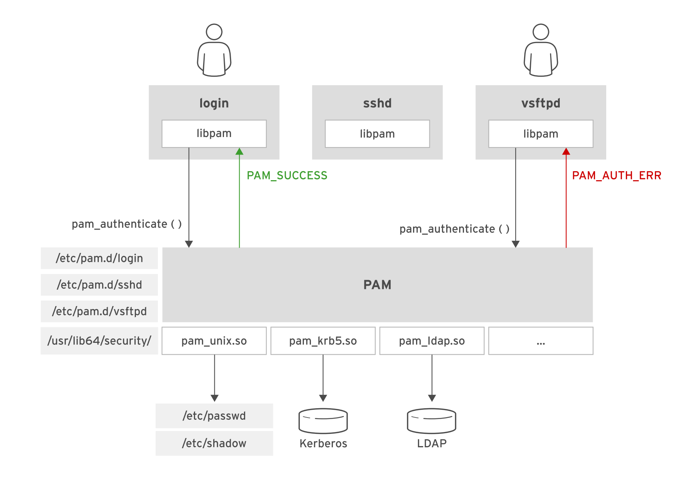
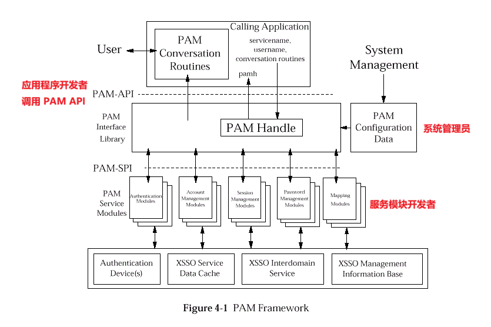
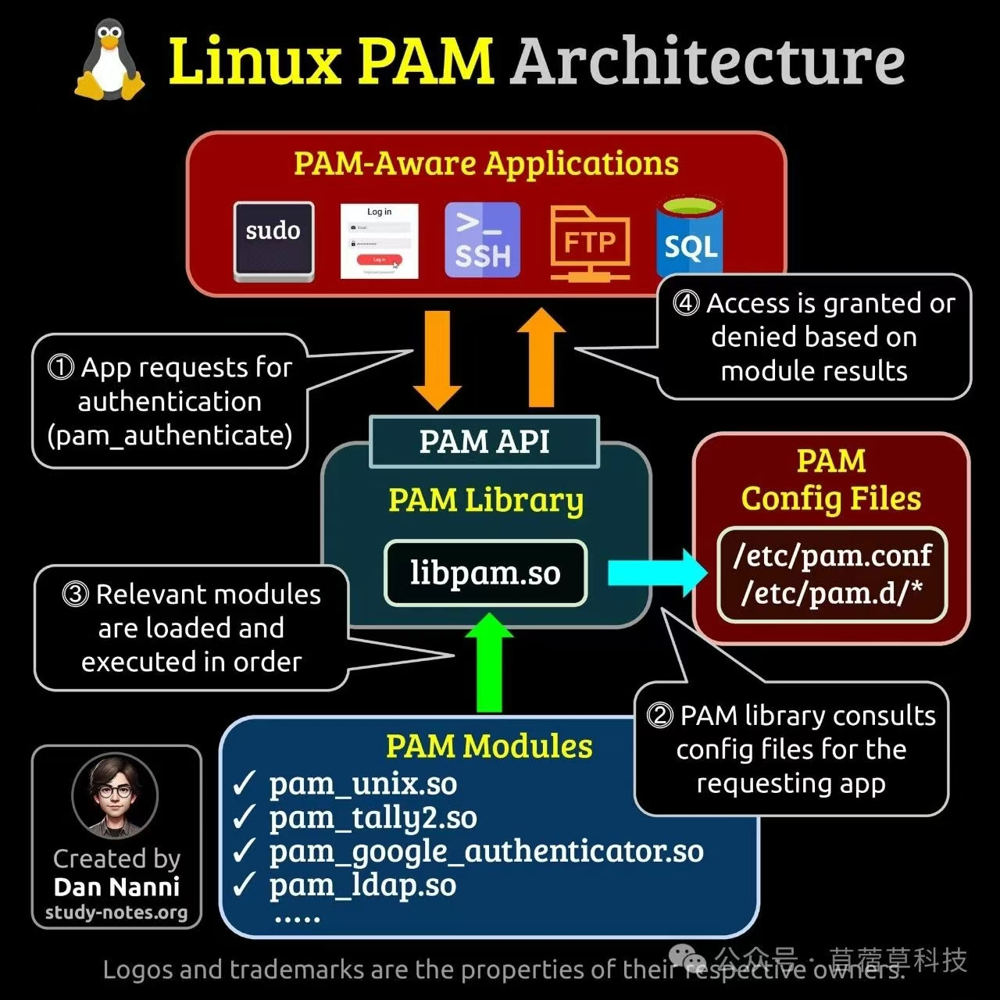

# 🗝️ Linux 中通过 PAM 控制身份认证

## 文档目录

- [🗝️ Linux 中通过 PAM 控制身份认证](#️-linux-中通过-pam-控制身份认证)
  - [文档目录](#文档目录)
  - [1. 选择 PAM 配置](#1-选择-pam-配置)
    - [1.1 PAM 概述](#11-pam-概述)
    - [1.2 配置 PAM](#12-配置-pam)
      - [1.2.1 选择安全配置集](#121-选择安全配置集)
      - [1.2.2 PAM 配置文件语法](#122-pam-配置文件语法)
  - [2. 修改 PAM 配置](#2-修改-pam-配置)
    - [2.1 准备更新配置](#21-准备更新配置)
    - [2.2 使用 authconfig 配置 PAM](#22-使用-authconfig-配置-pam)
    - [2.3 手动修改 PAM](#23-手动修改-pam)
  - [3. 配置密码质量要求](#3-配置密码质量要求)
    - [3.1 描述 pam\_pwquality 模块](#31-描述-pam_pwquality-模块)
    - [3.2 配置 pam\_pwquality 模块](#32-配置-pam_pwquality-模块)
    - [3.3 配置具有特定字符类要求的密码策略](#33-配置具有特定字符类要求的密码策略)
    - [3.4 解释贡献度（credit）机制](#34-解释贡献度credit机制)
  - [4. 登录失败后限制访问](#4-登录失败后限制访问)
    - [4.1 多次登录失败后锁定帐户](#41-多次登录失败后锁定帐户)
    - [4.2 启用 pam\_faillock 模块](#42-启用-pam_faillock-模块)
    - [4.3 管理锁定的帐户](#43-管理锁定的帐户)
  - [5. 补充讨论](#5-补充讨论)

## 1. 选择 PAM 配置

### 1.1 PAM 概述

- 可插拔式认证模块系统（pluggable authentication modules system，PAM）为应用提供一种通用的方法以实现身份认证（authentication）和授权（authorization）。
- PAM 为应用提供通用的方式，实施对身份认证和授权的支持。
- 支持 PAM 的应用调用 PAM 核心库（libpam），使应用执行所有身份认证任务，并将通过的结果（pass 或 fail）返回给应用。
- PAM 模块可实施不同的身份认证方法，如下所示：
  - 利用 Kerberos 执行身份认证（**pam_krb5 模块**）
  - 利用 LDAP 服务器进行身份认证（**pam_ldap 模块**）
  - 使用标准的本地文件 /etc/passwd 和 /etc/shadow 进行身份认证（**pam_unix 模块**）
- 支持 PAM 的应用可以直接使用上述身份认证方法，无需进行修改或重新编译。
- 管理员可以使用 PAM 配置文件来选择要用于各个应用的模块。
- PAM身份认证原理示意：

  <center></center>

  <center>图示：PAM 认证：服务或应用 ➡ PAM 框架（各服务 PAM 配置文件）➡ PAM 模块 ➡ 身份认证文件或验证系统</center>

- 如上所示，login 程序与 PAM 联系以进行身份认证：
  - 1️⃣ PAM 读取 /etc/pam.d/login 配置文件，以检索用于身份认证的模块列表。
  - 2️⃣ PAM 调用存储在 /usr/1ib64/security/ 目录中的模块以进行身份认证。
  - 3️⃣ PAM 将身份认证成功状态返回给 login 程序。
- vsftpd FTP 服务器也使用 PAM 验证 FTP 用户的身份，但在图中，用户提供了不正确的凭据，因此 PAM 将一个失败代码返回给 vsftpd。
- ✅ PAM 与系统管理员、PAM 模块开发者、应用程序开发者间的关系：

  <center></center>

  <center></center>

  - 系统管理员：通过各服务或应用程序的 PAM 配置文件制定认证策略。
  - PAM 模块开发者：利用 PAM SPI 编写验证模块，主要引入 pam_sm_*() 函数供 libpam 调用，将不同的认证机制引入。
  - 应用程序开发者：通过在程序中使用 PAM API 实现对认证方法的调用。

  > 在 PAM 架构中：
  > 1. 应用程序通过 PAM API（Application Programming Interface，应用编程接口）与 PAM 库通信。
  > 2. PAM 模块则通过 PAM SPI（Service Provider Interface，服务提供者接口）与 PAM 库通信。<br>
  > 这种设计使得应用程序开发者可以使用 PAM 服务而无需了解具体的认证策略细节，同时模块开发者可以通过 SPI 编写新的认证模块来扩展系统功能。

- 描述身份认证和授权：
  - 描述身份认证和授权
    - 应用必须对客户端进行身份认证。
    - 应用必须授权客户端，使其可访问应用。
  - 如，用户在登录提示符下键入正确的用户名和密码后通过了身份认证。
  - 但访问控制限制可能不授权该用户，并从交互式登录中拒绝。
  - PAM 可管理身份认证和授权。

### 1.2 配置 PAM

| 文件或目录 | 功能 |
| ----- | ----- |
| **<font color=orange>/usr/lib64/libpam.so.*</font>** | PAM 核心库文件 |
| **<font color=orange>/etc/pam.d/</font>** 目录 | 大多数 PAM 配置文件存放目录 |
| **<font color=orange>/etc/security/</font>** 目录 | 部分 PAM 模块的额外配置文件存放目录 |
| **<font color=orange>/usr/1ib64/security/</font>** 目录 | PAM 模块存放目录 |

- 每个支持 PAM 的应用都在 /etc/pam.d/ 中拥有其 PAM 配置文件，通常此文件的名称与应用的名称相同。如，/etc/pam.d/login 针对的是 login 程序，或 /etc/pam.d/sshd 针对的是 sshd 守护进程。若缺少针对某一应用的服务文件，则 PAM 会默认使用 /etc/pam.d/other。
- 配置文件包含指定要调用的模块的规则，从而能进行身份认证和授权。
- 因此，管理员可以为各个应用配置不同的身份认证方式。实践中通常希望所有应用都使用相同的身份认证方法。
- 🎯 因此，大多数配置文件使用 include 或 substack 指令来包含 `system-auth` 或 `password-auth` 文件（位于/etc/pam.d/）。
- 利用这种组织方式，应用共享相同的身份认证方式，并且维护一致性的 PAM 测试也相当容易。
- 管理员仅需要管理 system-auth 与 password-auth 文件以及单独的服务配置文件。
- 网络服务配置文件（sshd 或 vsftpd）包含 password-auth 文件。
- 本地服务配置文件（login 或 sudo）包含 system-auth 文件。

#### 1.2.1 选择安全配置集

- RHEL8 及更⾼版本提供了多个安全配置集（security profile）。**安全配置集的本质是调整 PAM 配置规则并启用不同的 PAM 模块。**
- 可以使⽤ `authselect list` 命令列出可⽤的安全配置集：
  - **minimal**：此配置集适⽤于仅包含本地⽤⼾的最⼩安装。
  - **nis**：此配置集会启⽤⽹络信息服务（NIS）进⾏系统⾝份验证。
  - **sssd**：此配置集会启⽤ SSSD 进⾏系统⾝份验证。此配置集是可与 LDAP 或其他⾝份提供程序搭配使⽤的典型配置⽂件。
  - **winbind**：此配置集会启⽤ winbind 进⾏系统⾝份验证。
- 常用 authselect 命令示例：

  ```bash
  $ sudo authselect current
  # 查看当前的安全配置集
  ```

  ```bash
  $ sudo authselect show minimal
  Local users only for minimal installations
  ==========================================

  Selecting this profile will enable local files as the source of identity
  and authentication providers.

  This profile can be used on systems that require minimal installation to
  save disk and memory space. It serves only local users and groups directly
  from system files instead of going through other authentication providers.
  Therefore SSSD, winbind and fprintd packages can be safely removed.

  Unless this system has strict memory and disk constraints, it is recommended
  to keep SSSD running and use 'sssd' profile to avoid functional limitations.

  AVAILABLE OPTIONAL FEATURES
  ---------------------------
  with-faillock::
      Enable account locking in case of too many consecutive
      authentication failures.

  with-mkhomedir::
      Enable automatic creation of home directories for users on their
      first login.
  ...
  with-pwhistory::
      Enable pam_pwhistory module for local users.
  ...
  # 查看 minimal 安全配置集的额外功能描述

  $ sudo authselect list-features <PROFILE-ID>
  # 每个安全配置集可以实施额外的功能，以启⽤特定的额外 PAM 模块或调整现有的 PAM 配置。
  # 查看指定安全配置集的额外功能

  $ sudo authselect list-features minimal
  with-altfiles
  with-custom-aliases
  with-custom-automount
  with-custom-ethers
  with-custom-group
  with-custom-hosts
  with-custom-initgroups
  with-custom-netgroup
  with-custom-networks
  with-custom-passwd
  with-custom-protocols
  with-custom-publickey
  with-custom-rpc
  with-custom-services
  with-custom-shadow
  with-ecryptfs
  with-faillock
  with-mkhomedir
  with-pamaccess
  with-pwhistory
  with-silent-lastlog
  without-nullok
  # 查看 minimal 安全配置集的额外功能
  ```

  备份安全配置集 & 切换安全配置集：

  ```bash
  $ sudo authselect current
  Profile ID: sssd
  Enabled features: None
  $ sudo authselect select minimal with-pwhistory with-mkhomedir --force --backup=sssd-none
  Backup stored at /var/lib/authselect/backups/sssd-none
  Profile "minimal" was selected.
  The following nsswitch maps are overwritten by the profile:
  - aliases
  - automount
  - ethers
  - group
  - hosts
  - initgroups
  - netgroup
  - networks
  - passwd
  - protocols
  - publickey
  - rpc
  - services
  - shadow

  - with-mkhomedir is selected, make sure pam_oddjob_mkhomedir module
    is present and oddjobd service is enabled and active
    - systemctl enable --now oddjobd.service

  # 指定 minimal 安全配置集，并实施 with-pwhistory 与 with-mkhomedir 功能，同时创建名为 sssd-none 的备份（此备份为切换安全配置集之前的配置）。
  # 注意：备份的名称可根据先前的配置便于回滚。此处之前为 sssd 配置，因此设置为 sssd-none。

  $ sudo authselect current    # 已切换为 minimal 安全配置集
  Profile ID: minimal
  Enabled features:
  - with-pwhistory
  - with-mkhomedir
  $ sudo authselect backup-list    # 列举当前的安全配置集
  sssd-none (created at Mon Mar 23 03:46:23 2026)
  $ sudo authselect backup-restore sssd-none    # 回滚 sssd-none 安全配置集
  $ sudo authselect current
  Profile ID: sssd
  Enabled features: None
  ```

- authselect 工具的备份机制主要用于在修改系统身份验证配置（如 PAM 和 NSS）之前，保存当前的系统状态，以便在配置出错时能够快速恢复。
- 其备份的核心原理如下：
  - 备份触发机制：
    authselect 在以下情况会触发备份操作：<br>
    - 强制覆盖（--force）：当用户从非 authselect 管理的配置（如手动修改的文件）切换到 authselect 配置文件时，使用 --force 参数会自动创建备份。
    - 手动指定（-b / --backup）：在执行 select、apply-changes 或 enable-feature 等命令时，通过 -b 或 --backup=NAME 参数手动触发备份。
  - 备份存储位置与命名：
    - 存储路径：备份文件统一存储在 /var/lib/authselect/backups/ 目录下。
    - 命名规则：如果未手动指定名称，系统通常会以“当前时间戳 + 随机字符串”作为备份文件夹的名称。
  - 备份内容：
    备份本质上是对受影响的关键配置文件的“快照”，主要包括：<br>
    - PAM 配置文件：如 /etc/pam.d/ 目录下的相关文件。
    - NSS 配置文件：主要是 /etc/nsswitch.conf。
    - 元数据：记录当时启用的配置文件（Profile）和功能（Features）信息。 
  - 恢复原理：
    - 命令：用户可以使用 authselect backup-restore <NAME> 命令进行恢复。
    - 逻辑：恢复时，authselect 会将备份文件夹中的文件重新覆盖回系统的 /etc 对应位置，并重置 authselect 的内部状态，使系统回到备份时的配置水平。 
  - 与 authconfig 的区别：
    - 早期的 authconfig 将备份存储在 /var/lib/authconfig/。authselect 延续了这一思路，但采用了基于 Profile（配置方案） 的管理方式，通过软链接（Symbolic Links）来管理 /etc 下的文件，确保配置的系统性和一致性。

#### 1.2.2 PAM 配置文件语法
  
- /etc/pam.d/ 中应用的配置文件规则格式：

  ```bash
  type  control  module [module_arguments]
  ```
  
- 如下所示：
  
  ```bash
  #/etc/pam.d/system-auth
  # Generated by authselect on Mon Mar 23 03:43:43 2026
  # Do not modify this file manually.

  auth        required                                     pam_env.so
  auth        required                                     pam_faildelay.so delay=2000000
  auth        [default=1 ignore=ignore success=ok]         pam_usertype.so isregular
  auth        [default=1 ignore=ignore success=ok]         pam_localuser.so
  auth        sufficient                                   pam_unix.so nullok
  auth        [default=1 ignore=ignore success=ok]         pam_usertype.so isregular
  auth        sufficient                                   pam_sss.so forward_pass
  auth        required                                     pam_deny.so

  account     required                                     pam_unix.so
  account     sufficient                                   pam_localuser.so
  account     sufficient                                   pam_usertype.so issystem
  account     [default=bad success=ok user_unknown=ignore] pam_sss.so
  account     required                                     pam_permit.so

  password    requisite                                    pam_pwquality.so local_users_only
  password    sufficient                                   pam_unix.so sha512 shadow nullok use_authtok
  password    sufficient                                   pam_sss.so use_authtok
  password    required                                     pam_deny.so

  session     optional                                     pam_keyinit.so revoke
  session     required                                     pam_limits.so
  -session    optional                                     pam_systemd.so
  session     [success=1 default=ignore]                   pam_succeed_if.so service in crond quiet use_uid
  session     required                                     pam_unix.so
  session     optional                                     pam_sss.so
  ```
  
  - 1️⃣ 第一列为类型（type）：
    - 将不同的测试组织在 4 种管理组（management groups）中，分别为 auth、account、password、session。
    - **<font color=orange>在每个管理组中的 PAM 规则顺序相当重要，PAM 规则将从上至下解析并执行！</font>**
    - 位于类型（type）前的 `-` 表示 PAM 模块不存在时跳过规则测试。
    - PAM规则类型：
      - **auth**（认证管理）：接受用户名与密码，对该用户的密码进行认证等。
      - **account**（帐户管理）：检查帐户是否允许登录系统，密码是否过期，账号登录是否存在时间限制等。
      - **password**（密码管理）：管理用户的密码更改，**该管理组不执行认证与授权**。
      - **session**（会话管理）：提供对会话的管理与记账。

      | 类型 | 说明 |
      | ----- | ----- |
      | auth | 验证用户身份，如验证用户名/密码、证书、生物特征等。<br> ⽤⼾必须通过这些规则才能验证其⾝份。在前⾯的输出中，此组中的其中⼀个规则调⽤ pam_unix 模块。此模块参照 /etc/shadow ⽂件验证提供的⽤⼾名和密码。 |
      | account | 账户权限检查，如检查账户是否过期、是否允许访问该服务、时间限制等。<br> 换句话说，应⽤将确定该帐⼾的访问是否已获得授权。在前⾯的⽰例 /etc/pam.d/system-auth ⽂件中，规则还会调⽤ account 管理组中的 pam_unix 模块。在该组中，pam_unix 模块使⽤ /etc/shadow ⽂件中的到期信息来确定密码是否仍然有效。 |
      | password | 密码管理，如处理密码修改、密码策略强制、密码历史检查等。<br> 此管理组中的规则 **不涉及⾝份验证或授权**。如果应⽤为⽤⼾提供更改其密码的功能，则当⽤⼾尝试通过应⽤更改密码时，PAM 会调⽤这些规则。在之前的 /etc/pam.d/system-auth ⽂件中，pam_pwquality 模块是该组中的第⼀个模块。此模块会验证⽤⼾提供的新密码的质量。接下来调⽤ pam_unix 模块。在该密码管理组中，pam_unix 模块会将新密码存储到 /etc/shadow ⽂件中。 |
      | session | 会话管理，如设置环境、挂载家目录、记录审计日志、资源限制等。<br> 应⽤会在⽤⼾会话开始和结束时调⽤此管理组中的规则。这些规则管理⽇志记录、设备或控制台所有权等任务。 |

    - 相同的 PAM 模块可在不同的管理组中被多次调用，PAM 可区分在不同管理组中相同模块的不同行为。
  - 2️⃣ 第二列是控制（control flags），控制类型如下所示：
    - **required**：该模块必须返回成功才通过认证，若该模块返回失败，失败结果不立即通知用户，而是等到同一管理组中的所有模块全部执行完成后再将失败结果返回至应用程序（必要条件）。
    - **requisite**：与 required 类似，该模块必须返回成功才通过认证，区别在于，一旦模块返回失败，将不再执行同一管理组中的任何模块，而是直接将控制权返回至应用程序（必要条件）。
    - **sufficient**：该模块返回成功已足以通过认证，不必再执行该管理组内的其他模块，若该模块返回失败可忽略结果（充分条件）。
    - **optional**：该模块可选，其返回成功与否一般对身份认证不起关键作用，其执行结果不影响其他模块的执行，返回值一般被忽略。
  - 3️⃣ 第三列是 PAM 模块本身：
    - 可使用模块的绝对路径或模块名称（推荐）指定。
    - PAM 模块可具有选项和参数，但并非每个模块都具有。
    - PAM 模块的选项和参数一般具有唯一性。
  - PAM 控制类型（control flags）执行结果汇总：

    | Control Flags | Result | Keep test | Affect |
    | :----- | :----- | :----- | :----- |
    | **Required** | Pass | Y | Define by system |
    |              | Fail | Y | Fail |
    | **Requisite** | Pass | Y | Define by system |
    |               | Fail | N | Fail |
    | **Sufficient** | Pass | N | Ok |
    |                | Fail | Y | ignore |
    | **Optional** | Pass | Y | ignore |
    |              | Fail | Y | ignore |

  - PAM 控制类型执行结果示例：

    验证示例1：

    | | | | user1 | user2 | user3 |
    | :----- | :----- | :----- | :----- | :----- | :----- |
    | Auth | Required | Module1 | Pass | **Fail** | Pass |
    | Auth | Required | Module2 | Pass | Pass | Fail |
    | Auth | Required | Module3 | Pass | Pass | Fail |
    | **Result** | | | Pass | **Fail** | Fail |

    验证示例2：

    | | | | user1 | user2 | user3 |
    | :----- | :----- | :----- | :----- | :----- | :----- |
    | Auth | Required | Module1 | Pass | **Fail** | Pass |
    | Auth | Sufficient | Module2 | Pass | Pass | Fail |
    | Auth | Required | Module3 | N/A | N/A | Pass |
    | **Result** | | | Pass | **Fail** | Pass |

  - **<font color=orange>required 与 requisite 对应的 PAM 模块只要返回失败，其所在的管理组最终返回失败，区别只是在于是否继续执行其同一管理组中的后续测试</font>**。
- 使用 SSSD 和 PAM
  - RHEL 6.0 中引入的 **系统安全服务守护程序（system security services daemon，SSSD）** 允许对远程目录和身份认证服务（如 LDAP、Kerberos、ActiveDirectory 和红帽身份管理 IdM）进行用户身份认证。
  - 当远程用户在本地系统上进行身份认证时，SSSD 会将其凭据和身份认证参数存储到本地缓存中。
  - 因此，即使远程认证服务器不可访问，远程用户仍然可以登录本地系统。
  - 此功能对于与公司网络断开连接的笔记本电脑特别有用，也有助于减轻远程认证服务的负载。
  - PAM 首选通过 `pam_sss` 模块使用 SSSD。
- 访问 PAM 文档
  
  ```bash
  $ man 5 pam.conf
  # 查看 PAM 配置文件使用的详细信息
  ```
  
  ```bash
  $ man -k pam_
  # 查看系统上可用的 PAM 模块列表与说明信息
  ```

-----

## 2. 修改 PAM 配置

💥 注意：此部分在 RHEL7.x 有效，而在 RHEL9.x 中使用 authselect 替代了 authconfig，请参考 *1.2.1 选择安全配置集* 部分。

### 2.1 准备更新配置

- 由于 PAM 控制对系统的访问，因此其配置中的错误可能会产生严重的后果。
- 不正确的配置会导致无法访问系统，甚至 root 也可能会被拒绝访问。
- 为避免 PAM 的误配置，可使用如下命令备份 PAM 配置。

  ```bash
  $ sudo authconfig --savebackup=<backup_dir>
  # 备份 PAM 配置文件
  ```

  ```bash
  $ sudo authconfig --restorebackup=<backup_dir>
  # 恢复 PAM 配置文件
  ```

- ✅ 在另一个终端上打开 root shell，并保持打开状态。
- 若将自己锁定在系统外，仍可使用该打开的 shell 来修复问题。
- 在关闭该救援终端前，请确认新的 PAM 配置是否按预期工作。
- ✅ 若遇到任何问题，请在修复系统之前不要重启系统。
- 使用提供的 authconfig 命令配置 PAM，而不要手动修改文件。

### 2.2 使用 authconfig 配置 PAM

- authconfig 提供命令行工具，也通过 authconfig-gtk 提供图形界面。
- 已弃用的 authconfig-tui 命令提供基于文本的界面。
- 管理员也可使用 authconfig 来管理名称服务交换机（NSS），以配置对用户信息数据库的访问。
- authconfig 命令的两种工作模式：  
  - 更新模式（update mode）：使用 --update 选项更新配置  
  - 测试模式（test mode）：使用 --test 选项打印配置而不应用配置
- 更新模式下，authconfig 命令将更改 /etc/pam.d/{system-auth-ac,password-auth-ac} 文件，而大多数服务的 PAM 配置文件包含 system-auth 与 password-auth 文件，这两个文件是前两个文件的软链接。
- 当 authconfig 命令更新了 *-ac 文件，PAM配置即时生效。

### 2.3 手动修改 PAM

- 大多数情况下，管理员可通过 authconfig 命令管理 PAM，而在一些特殊情况下，需要手动编辑 PAM 配置文件。
- ✅ 推荐做法：编辑 PAM 配置文件时，需确保在保存文件之前进行需要的所有更改。
- 由于 PAM 会立即应用修改，因此配置不全可能会导致系统无法访问。
- 手动修改 /etc/pam.d/system-auth文件（软链接），若使用 authconfig 命令更新将覆盖该文件已更新的配置，使用以下两种方式避免此现象的发生。
- 仅允许手动配置  
  - 可创建 system-auth-local 与 password-auth-local 文件避免 authconfig 命令的配置覆盖。  
  - 因此，可手动编辑以上文件完成 PAM 配置，若误使用 authconfig 命令更新，其只影响 system-auth-ac 与 password-auth-ac 文件，不会影响现有 PAM 配置。
- 允许手动与 authconfig 配置  
  - 可能更倾向于使用 authconfig 命令，但也允许手动配置。  
  - 因此，可使用自定义的 *-local 文件用于手动配置，但也包含了通过 authconfig 命令更新的 *-ac 文件。

-----

## 3. 配置密码质量要求

### 3.1 描述 pam_pwquality 模块

- RHEL 中可强制使用密码安全策略。
- 当用户通过打开的应用会话更改其密码时，PAM 使用 password 管理组中的规则。
- /etc/pam.d/sshd 与 /etc/pam.d/login 文件中的 password规则：

  ```bash
  $ sudo grep ^password /etc/pam.d/sshd
  password   include      password-auth
  $ sudo grep ^password /etc/pam.d/login
  password   include      system-auth
  ```

- 🔎 /etc/pam.d/password-auth 与 /etc/pam.d/system-auth 文件中的 password 规则解读：

  ```bash
  $ sudo grep ^password /etc/pam.d/system-auth
  password    requisite                                    pam_pwquality.so local_users_only               # 第1条
  password    sufficient                                   pam_unix.so sha512 shadow nullok use_authtok    # 第2条
  password    sufficient                                   pam_sss.so use_authtok                          # 第3条
  password    required                                     pam_deny.so                                     # 第4条
  $ sudo grep ^password /etc/pam.d/password-auth
  password    requisite                                    pam_pwquality.so local_users_only
  password    sufficient                                   pam_unix.so sha512 shadow nullok use_authtok
  password    sufficient                                   pam_sss.so use_authtok
  password    required                                     pam_deny.so
  ```

- 1️⃣ 第1条：
  - pam_pwquality 模块提取用户提供的新密码，对照 /usr/share/cracklib/ 中的字典，并检查它的模式和易猜组合。
  - **<font color=orange>此模块默认要求密码长度超过六个字符，并且组合有大写、小写字母、数字以及特殊字符。</font>**
  - 此模块通过 requisite 控制器调用，因此若判定为不符合要求，密码更改会立即停止，并且控制权返回到启动 PAM 调用的应用，不进一步测试 PAM 规则。
  - ❗pam_pwquality 模块代替了 RHEL7 中的 pam_cracklib 模块。
- 2️⃣ 第2条：
  - 若用户通过 pam_pwquality 测试，PAM 将执行 sufficient pam_unix.so 规则。
  - 在 password 管理组中，pam_unix 模块在各种后端存储机制中更新用户密码，包括 /etc/passwd、/etc/shadow 或网络信息系统（NIS）。
  - 由于 pam_unix 规则使用 sufficient 控制器，若成功更新用户的密码，PAM 将关闭并将控制权传回调用它的应用。
- 3️⃣ 第3条：
  - 与 SSSD 认证相关，若本地无 sssd 守护进程忽略此规则。
- 4️⃣ 第4条：
  - 最后一条规则是 required pam_deny.so 条目。
  - 若由于某种原因导致 sufficient pam_unix.so 规则未能更新用户密码，PAM 才会测试此规则。
  - **pam_deny 模块始终返回失败结果，应用就能感知调用 PAM 时出现了错误。**
  - 由于 pam_deny 规则为 required，因此 PAM 会向尝试更改用户密码的应用返回整体失败。

### 3.2 配置 pam_pwquality 模块

- pam_pwquality.so 参数位于 **<font color=orange>/etc/security/pwquality.conf</font>** 中。
- 在 /etc/pam.d/system-auth 和 /etc/pam.d/password-auth 文件中修改以下参数：
  - `try_first_pass`:
    - 提示用户输入密码之前，pam_pwquality 会验证先前的模块是否已请求过密码。
    - 若是这种情况，pam_pwquality 将重用此密码。
  - `local_users_only`:
    - 仅认证由 /etc/passwd 文件定义的本地用户。
  - `retry=N`:
    - 为用户提供 N 次机会，来输入通过模块测试的密码。
  - `authtok_type=`: 
    - 默认情况下，pam_pwquality 在要求输入新密码时会显示 “New password” 和 “Retype new password” 提示。  
    - 使用 authtok_type 自定义该提示。  
    - pam_pwquality 将 authtok_type 的值插入到 new 和 password 间。  
    - 如，将 authtok_type 设置为 Linux 会将提示更改为 “New Linux password” 和 “Retype new Linux password”。

  ```bash
  $ sudo grep pam_pwquality /etc/pam.d/system-auth
  password    requisite        pam_pwquality.so local_users_only try_first_pass retry=3 authtok_type=LINUX
  $ sudo grep pam_pwquality /etc/pam.d/password-auth
  password    requisite        pam_pwquality.so local_users_only try_first_pass retry=3 authtok_type=LINUX
  # 配置 pam_pwquality 模块各参数

  $ sudo passwd student
  Changing password for user student.
  New LINUX password:    # authtok_type 参数生效
  BAD PASSWORD: The password is shorter than 8 characters
  Retype new LINUX password:
  passwd: all authentication tokens updated successfully.
  ```

- 配置密码复杂性要求：
  - 可在 PAM 配置文件中将其指定为 pam_pwquality 模块的参数，或在 /etc/security/pwquality.conf 文件中指定。
  - `minlen`:  
    - 密码所需的最短长度。
    - 默认情况下，所有字符对总长度分数贡献分值都是 1。
    - 管理员可利用 credit 系统为某些字符类型给予更大的分值，从而只需较少的总字符数即可满足相同的长度要求。
  - `lcredit`:  
    - 小写字母字符对密码长度的贡献分值。  
    - 若将此值设置为负数，它将指定所需的最少小写字母字符数。
  - `ucredit`:  
    - 大写字母字符对密码长度的贡献分值。  
    - 若将此值设置为负数，它将指定所需的最少大写字母字符数。
  - `dcredit`:  
    - 数字字符对密码长度的贡献分值。  
    - 若将此值设置为负数，它将指定所需的最少数字字符数。
  - `ocredit`:
    - 其他字符对密码长度的贡献分值。  
    - 其他字符包括符号，以及不包括在小写、大写和数字范围的所有字符。  
    - 若将此值设置为负数，它将指定所需的最少其他字符数。
  - `difok=N`:
    - 新密码与旧密码间最少的不同字符数。
  - `minclass=N`:
    - 最少的字符类别，包括数字、大写、小写与其他字符。
  - `maxrepeat=N`:
    - 密码中不能出现超过 N 个连续重复的字符。
  - `maxsequence=N`:
    - 密码中不能出现连续 N 位的单调字符。

  ```bash
  $ sudo tail -n8 /etc/security/pwquality.conf
  minlen=8
  lcredit=-2
  ucredit=-2
  dcredit=-1
  ocredit=-1
  difok=4
  maxrepeat=3
  maxsequence=3

  $ id
  uid=1000(student) gid=1000(student) groups=1000(student),10(wheel) context=unconfined_u:unconfined_r:unconfined_t:s0-s0:c0.c1023
  $ passwd
  Changing password for user student.
  Current password:
  New LINUX password:    # 新密码：1qazZSEEEE$
  BAD PASSWORD: The password contains more than 3 same characters consecutively    # maxrepeat=3 生效
  New LINUX password:
  BAD PASSWORD: The password contains more than 3 same characters consecutively
  New LINUX password:
  BAD PASSWORD: The password contains more than 3 same characters consecutively
  passwd: Have exhausted maximum number of retries for service

  $ passwd
  Changing password for user student.
  Current password:
  New LINUX password:    # 新密码：1qazZSE$5678
  BAD PASSWORD: The password contains monotonic sequence longer than 3 characters    # maxsequence=3 生效
  New LINUX password:
  BAD PASSWORD: The password contains monotonic sequence longer than 3 characters
  New LINUX password:
  BAD PASSWORD: The password contains monotonic sequence longer than 3 characters
  passwd: Have exhausted maximum number of retries for service
  ```

- 帮助文档查询：

  ```bash
  $ man 8 pam_pwquality
  # 查看 pam_pwquality 模块的详细使用信息

  $ man 5 pwquality.conf
  #查看 pam_pwquality 模块的配置文件信息
  ```

- pam_pwquality 模块调整密码记录：

  ```bash
  $ sudo vim /etc/security/pwhistory.conf
  ...
  enforce_for_root
  remember = 3
  ```

### 3.3 配置具有特定字符类要求的密码策略

- 用户密码复杂度示例：
  - 密码⻓度必须⾄少为 8 个字符。
  - 密码必须包含⾄少⼀个⼤写字符。
  - 密码必须包含⾄少两个数字。
  - 密码必须包含⾄少⼀个特殊字符。
- 负值表示每个类所需的最少字符数。
- 即使策略未指定有关小写字母字符的任何内容，仍需将 lcredit 参数设置为 0。
- 所有这些贡献度参数的默认值为 1，需要为所有参数指定合适的值，否则 pam_pwquality 将不能正确实施密码策略。

### 3.4 解释贡献度（credit）机制

- pam_pwquality 贡献度机制当贡献度参数为 **正数值** 时触发。
- 在启⽤贡献度机制的情况下，minlen 参数相当于质量级别，密码必须达到该质量级别，模块才会接受它：
  - 密码中的每个字符都可获得⼀分。
  - 每个⼩写字符可获得额外的贡献分值，最⾼为 lcredit 参数的值。
  - 每个⼤写字符可获得额外的贡献分值，最⾼为 ucredit 参数的值。
  - 每个数字可获得额外的贡献分值，最⾼为 dcredit 参数的值。
  - 每个其他字符可获得额外的贡献分值，最⾼为 ocredit 参数的值。
- **<font color=orange>如果最终得分等于或大于 minlen  参数，则接受该密码。</font>**

  以 minlen=18 为例，如下表所示的贡献度计算：

  | 密码 | 长度 | 贡献度 | 状态 |
  | :----- | :----- | :----- | :----- |
  | passwordlowercase | 17 | • 长度 = 17 <br> • 小写 = +1 <br> • 大写 = 0 <br> • 数字 = 0 <br> • 其他 = 0 <br><br> **贡献度 = 18** | 通过 |
  | WithFourUpperChr | 16 | • 长度 = 16 <br> • 小写 = +1 <br> • 大写 = +1 <br> • 数字 = 0 <br> • 其他 = 0 <br><br> **贡献度 = 18** | 通过 |
  | withaspecialch! | 15 | • 长度 = 15 <br> • 小写 = +1 <br> • 大写 = 0 <br> • 数字 = 0 <br> • 其他 = +1 <br><br> **贡献度 = 17** | 失败（未达到18） |
  | !with-o?char. | 13 | • 长度 = 13 <br> • 小写 = +1 <br> • 大写 = 0 <br> • 数字 = 0 <br> • 其他 = +4 <br><br> **贡献度 = 18** | 通过 |
  | Sc01#+=11 | 11 | • 长度 = 11 <br> • 小写 = +1 <br> • 大写 = +1 <br> • 数字 = +2 <br> • 其他 = +3 <br><br> **贡献度 = 18** | 通过 |

-----

## 4. 登录失败后限制访问

### 4.1 多次登录失败后锁定帐户

- 许多安全策略都有与多次登录尝试失败后锁定用户帐户相关的要求。
- 可使用 pam_faillock 模块来实施此要求。
- pam_faillock 模块：可以在特定次数的登录尝试失败后锁定帐户，定义的期限后自动解锁帐户。
- 使用 faillock 命令（PAM 软件包的一部分）查看登录尝试失败的报告或重置用户失败的尝试。
- ❗pam_faillock 模块已添加至 RHEL 6.1中，与现有的 pam_tally2 模块一起提供。
- pam_faillock 提供一些额外的功能，如它还控制本地屏幕保护程序上的失败登录尝试。
- authconfig 工具可以配置 pam_faillock 模块，但不能配置 pam_tally2 模块。
- ❗注意：**<font color=orange>启用 pam_faillock 时，具有拒绝服务攻击风险，恶意用户可以通过自愿输入错误密码来可轻松锁定帐户，之后锁定期间内，合法用户将被拒绝访问其帐户。</font>**

### 4.2 启用 pam_faillock 模块

- pam_faillock 没有专用的配置文件，其配置完全通过配置参数进行。
- RHEL7 中使用 authconfig 工具完成 pam_faillock 模块的启用与配置：

  ```bash
  $ sudo authconfig --enablefaillock --faillockargs="deny=3 fail_interval=60 unlock_time=600" --update
  # 使用 authconfig 命令更新 pam_faillock 模块配置
  # --enablefaillock 选项激活 PAM 配置中的 pam_faillock 模块，--faillockargs 选项配置该模块。
  ```

- RHEL9 中要启用和配置 pam_faillock，可手动编辑 PAM 配置文件，也可使用 authselect 工具并启用 with-faillock 特性。

  ```bash
  $ sudo authselect select minimal with-faillock --force
  [error] [/etc/authselect/system-auth] has unexpected content!
  [error] [/etc/authselect/password-auth] has unexpected content!
  Backup stored at /var/lib/authselect/backups/2026-03-23-14-31-55.wOAaQg
  Profile "minimal" was selected.
  The following nsswitch maps are overwritten by the profile:
  - aliases
  - automount
  - ethers
  - group
  - hosts
  - initgroups
  - netgroup
  - networks
  - passwd
  - protocols
  - publickey
  - rpc
  - services
  - shadow

  # 由于之前手动修改过 /etc/pam.d/system-auth 与 /etc/pam.d/password-auth 文件，
  # 因此，此处在启用模块时对现有环境进行了配置备份。
  ```

- /etc/security/faillock.conf 中 pam_faillock 模块相关参数：
  - `dir`:
    - 字符串，⽤于配置包含⽤⼾⽂件的⽬录，其中⽤⼾⽂件中包含失败记录。
  - `audit`:
    - 布尔值，如果未找到⽤⼾，将启⽤⽤⼾名记录功能。
  - `silent`:
    - 布尔值，禁⽌打印信息性消息。
  - `no_log_info`:
    - 布尔值，禁⽌在 Syslog ⽂件中记录信息性消息。
  - `local_users_only`:
    - 布尔值，将 pam_faillock 模块配置为忽略 /etc/passwd ⽂件中未包含的⽤⼾。
    - 如果系统环境已将⽤⼾锁定在 LDAP 或其他⾝份管理服务器中，那么此选项会⾮常有⽤。
  - `deny=N`:
    - 整数，⽤于配置在锁定⽤⼾之前，在相应时间间隔内允许的连续⾝份验证失败次数，若全部失败 pam_faillock 将锁定帐户。  
  - `fail_interval=<second>`:
    - 整数，以秒为单位指定的时间间隔，身份验证失败所用的秒数，只有在此期间发生失败的登录尝试才将锁定帐户。
    - 如，当使用 deny=3 和 fail_interval=60 时，若用户在一分钟内连续输错三次密码，pam_faillock 将锁定帐户。
  - `unlock_time=<second>`:
    - 整数，解锁用户前须等待的秒数（用户被锁定的秒数）。
    - 如，当使用 unlock_time=600 时，被锁定的用户必须等待 10 分钟才能再次登录。
  - `even_deny_root`:
    - 布尔值，对 root 用户的锁定。
    - 默认情况下，若不设定此参数，pam_faillock 不锁定 root 帐户。
    - 使用 even_deny_root 参数，pam_faillock 会将应用于普通用户的相同规则应用于 root 用户。
    - **启用此设置可能产生严重后果，恶意用户可以锁定 root 用户，导致合法管理员无法访问系统。**
    - ✅ 缓解方法：可使用 root_unlock_time=<second> 参数为 root 用户指定较短的锁定时间，对于 SSH 而言，可在 /etc/ssh/sshd_config 中 PermitRootlogin 设置为 no。
  - `root_unlock_time=<second>`:
    - 整数，配置 root 用户被锁定的秒数。如果未指定此参数，默认使用 unlock_time 参数。
  - `admin_group`:
    - 字符串，配置遵循 root 用户配置的组。
  - `preauth`:
    - 确认用户帐户是否被锁定，只检查状态不记录。
  - `authfail`:
    - 报告用户帐户登录失败的状态。

    ```plaintext
    $ man 8 pam_faillock
    ...
    {preauth|authfail|authsucc}
    
        The preauth argument must be used when the module is called before the modules which ask for the user credentials
        such as the password. The module just examines whether the user should be blocked from accessing the service in case
        there were anomalous number of failed consecutive authentication attempts recently. This call is optional if
        authsucc is used.

        译文：
        当调用该模块之前需要先获取用户凭证（如密码）的模块（如某些模块）中，必须使用 “preauth” 参数。该模块会检查是否应阻止用户访问服务，
        因为最近连续多次验证失败的次数异常多。如果使用了 “authsucc” 参数，则此调用是可选的。

        The authfail argument must be used when the module is called after the modules which determine the authentication
        outcome, failed. Unless the user is already blocked due to previous authentication failures, the module will record
        the failure into the appropriate user tally file.

        译文：
        当决定认证结果的模块出现故障导致认证失败时，必须使用 “authfail” 参数。除非用户此前因认证失败而已被锁定，否则该模块会将此次失败
        记录到相应的用户计数文件中。
    ```

- ✅ pam_faillock 模块配置示例：

  ```bash
  $ sudo authselect select minimal with-faillock --force    # 启用 faillock 特性
  $ sudo vim /etc/security/faillock.conf    # 编辑 pam_faillock 模块配置文件
  ...
  deny = 3
  fail_interval = 60
  unlock_time = 600

  $ sudo cat /etc/pam.d/system-auth    # 或者也可查看 /etc/pam.d/password-auth
  # Generated by authselect on Tue Mar 24 03:03:34 2026
  # Do not modify this file manually.

  auth        required                                     pam_env.so
  auth        required                                     pam_faildelay.so delay=2000000
  auth        required                                     pam_faillock.so preauth silent    # 阶段1
  auth        sufficient                                   pam_unix.so nullok
  auth        required                                     pam_faillock.so authfail          # 阶段2
  auth        required                                     pam_deny.so

  account     required                                     pam_faillock.so                   # 阶段3
  account     required                                     pam_unix.so
  ```

  1️⃣ 阶段1：
  - 认证前预处理，检查用户是否已被锁定（preauth 参数）。
  - 作用时机：用户输入密码之前
  - 功能：预先检查该用户是否已被 faillock 锁定
    - 如果已锁定，直接拒绝登录（返回失败）。
    - 如果未锁定，继续后续认证流程。

  2️⃣ 阶段2：
  - 认证失败处理，认证失败时记录失败次数（authfail 参数）。
  - 作用时机：密码验证失败之后
  - 功能：记录本次认证失败
    - 增加失败计数器
    - 如果达到 deny 阈值，锁定账户。

  3️⃣ 阶段3：
  - 账户状态检查，检查账户是否因失败次数过多被锁定。
  - 作用时机：认证通过后，检查账户权限。
  - 功能：再次确认账户未被锁定（双重检查）
    - 即使 auth 阶段通过，account 阶段仍会检查。
    - 防止并发场景下的竞态条件

### 4.3 管理锁定的帐户

列出锁定的用户：

```bash
$ sudo faillock
root:
When                Type  Source                                           Valid
student:
When                Type  Source                                           Valid
2026-03-24 03:38:27 RHOST 172.25.250.11                                        V
2026-03-24 03:38:32 RHOST 172.25.250.11                                        V
2026-03-24 03:38:37 RHOST 172.25.250.11                                        V
# 列出失败的登录尝试

$ sudo faillock --user <username>
# 列出指定用户的失败登录记录

$ sudo faillock --user student
student:
When                Type  Source                                           Valid
2026-03-24 03:38:27 RHOST 172.25.250.11                                        V
2026-03-24 03:38:32 RHOST 172.25.250.11                                        V
2026-03-24 03:38:37 RHOST 172.25.250.11                                        V
```

- Type 列指⽰连接的类型：RHOST（表⽰远程连接，如 ssh）或 TTY（表⽰控制台连接）。
- Source 列提供连接的源头：主机名称、IP 地址或 TTY。
- Valid 列指⽰记录仍然有效（V）或⽆效（I）。

解锁指定的锁定用户：

```bash
$ sudo faillock --user <username> --reset
# 删除指定用户的失败登录记录，同时解锁该用户帐户。

$ sudo faillock --user student --reset
$ sudo faillock --user student
student:
When                Type  Source                                           Valid
```

- ❗faillock 的用户帐户锁定与 usermod -L 命令的用户帐户锁定方式不同，前者通过 pam_faillock 模块实现，而后者通过修改 /etc/shadow 文件实现。

## 5. 补充讨论

- pam_tally2 模块
- pam_access 模块
- pam_listfile 模块
- pam_time 模块
- pam_limits 模块

🔗 关于以上模块示例，可参考此 [链接](https://github.com/Alberthua-Perl/tech-docs/blob/master/Linux%20%E5%9F%BA%E7%A1%80%E4%B8%8E%E8%BF%9B%E9%98%B6/Linux%20%E4%B8%AD%E9%80%9A%E8%BF%87%20PAM%20%E6%8E%A7%E5%88%B6%E8%BA%AB%E4%BB%BD%E8%AE%A4%E8%AF%81/Linux%20%E4%B8%AD%E9%80%9A%E8%BF%87%20PAM%20%E6%8E%A7%E5%88%B6%E8%BA%AB%E4%BB%BD%E8%AE%A4%E8%AF%81%20(RHEL7.x).png)。
