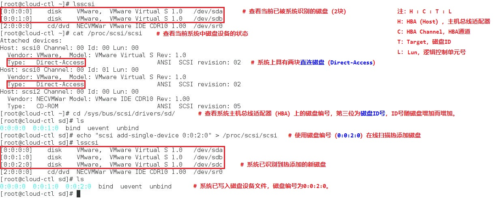
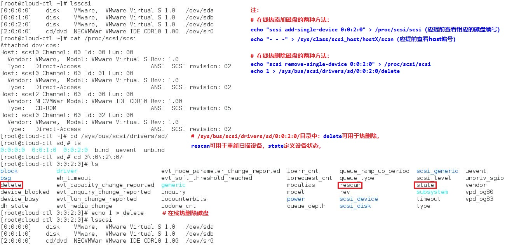
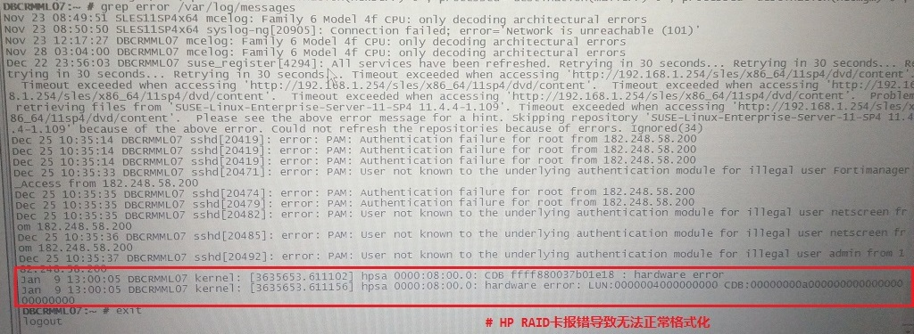

# Linux 块设备存储相关

## 文档目录

- Linux 磁盘盘符分类
- 块设备相关命令示例
- 虚拟机或物理机不重启在线热添加磁盘
- 案例：SLES 11 SP4 磁盘格式化失败故障排查

## Linux 磁盘盘符分类

- IDE HDD：/dev/hd*X*
- SATA HDD：/dev/sd*X*
- SATA SSD：/dev/sd*X*
- NVMe SSD：/dev/nvme*X*n*N*

## 块设备相关命令示例

```bash
$ sginfo -g /dev/sdX
  Rigid Disk Geometry mode page (0x4)
  -----------------------------------
  Number of cylinders                1028015
  Number of heads                    255
  Starting cyl. write precomp        1028015
  Starting cyl. reduced current      0
  Device step rate                   0
  Landing Zone Cylinder              1028015
  RPL                                0
  Rotational Offset                  0
  Rotational Rate                    7200
# 该磁盘的转速：7200 rpm/min
# 查看磁盘的转速，可用于区分机械硬盘（HDD）与固态硬盘（SSD）。

$ blockdev --setro <device_path>
# 块设备级别设置只读权限，该块设备不可进行挂载。
$ blockdev --setrw <device_path>
# 块设备级别设置读写权限，该块设备可进行挂载访问。
```


## 虚拟机或物理机不重启在线热添加磁盘

由于物理机、VMware 虚拟机以及 OpenStack 虚拟机的磁盘驱动方式存在差异, 若使用扫描 `SCSI` 总线的方式无法识别新添加的磁盘, 可使用扫描 **`/proc/scsi/scsi`** 的方式进行。

```bash
$ lsblk [-i]
# 查看当前系统上的磁盘
$ for i in $(seq 0 X); do echo "- - -" > /sys/class/scsi_host/host$i/scan; done
# 重新扫描 SCSI 总线（scsi bus），在线热添加磁盘, 其中的 "X" 为最大的 host 序号。
# 注意:
#   1. 使用 lsscsi 命令查看，显示的 "X:X:X:X" 中的第一位为磁盘所在的 host 号。
#   2. 只需重新扫描该 host 号即可，可热添加磁盘：
#      $ sudo echo "- - -" > /sys/class/scsi_host/hostX/scan

$ lsblk [-i]
# 查看热添加 SCSI 磁盘后，系统上的磁盘状态，或者也可使用 fdisk -l 命令查看。
$ less /var/log/messages
# 查看系统日志中关于热添加 SCSI 磁盘的相关内容
```





## 案例：SLES 11 SP4 磁盘格式化失败故障排查

- 问题描述：
  SLES 11 SP4 格式化数据盘 /dev/sd{h,i} 为 `ext3` 文件系统失败，`mkfs` 进程卡死。
- 排查过程：
  
  ```bash
  mysuse:~ # ps -ef | grep mkfs
  # 查看 mkfs 进程状态，发现 mkfs 保持执行，进程卡死，无法完成格式化。
  mysuse:~ # lsblk
  mysuse:~ # fdisk -l
  # 两个命令均无法查看磁盘状态, 且进程卡死, 说明磁盘存在问题。
  mysuse:~ # df -Th
  # 查看系统各文件系统状态, 确定无法格式化的磁盘为数据盘。
  
  mysuse:~ # grep -i error /var/log/messages
  # 查看系统日志中最近的报错信息，发现报错 "... hpsa ... : hareware error: LUN... CDB:..."
  # 确定报错为 HP RAID 卡故障，无法识别磁盘导致。
  # 排除 HP RAID 卡故障后即可正常完成格式化
  ```
  
  
