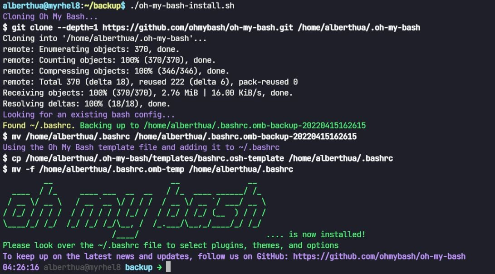
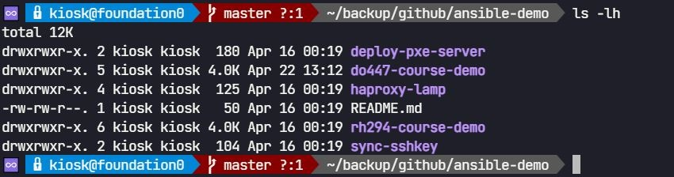
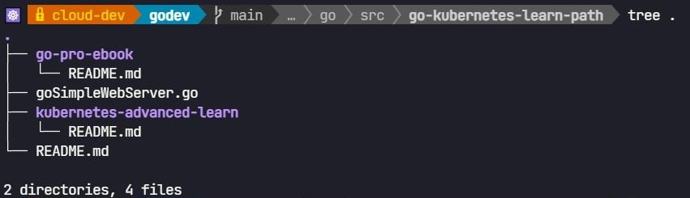
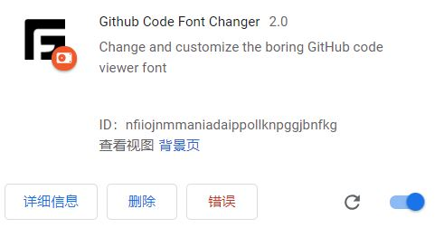

# 🛠 Linux 常用工具与资源

-----

## 文档目录

- 常用公共服务器
- 常用 DOS 命令
- Shell 脚本补充
- Markdown 语法配置
- VSCode 常用 Settings 参数
- Chrome 扩展安装与使用
- Tabby 自定义 CSS
- Linux 环境文件设置
- 💪 安装额外软件包
- dnf 下载软件包及其依赖
- dnf 实现软件包安全检测与更新
- RedHat 订阅服务使用

-----

## 常用公共服务器

- 镜像站点：

```bash
https://developer.aliyun.com/mirror/  阿里云
```

- NTP 时间同步服务器：

```bash
www.pool.ntp.org/zone/cn  最常见、熟知
cn.pool.ntp.org           最常用的国内 NTP 时间服务器
cn.ntp.org.cn             中国
edu.ntp.org.cn            中国教育网
ntp1.aliyun.com           阿里云

time1-7.aliyun.com  阿里云 NTP 服务器
ntp.sjtu.edu.cn     202.120.2.101（上海交通大学网络中心 NTP 服务器地址）
s1a.time.edu.cn     北京邮电大学
s1b.time.edu.cn     清华大学
s1c.time.edu.cn     北京大学
s1d.time.edu.cn     东南大学
s1e.time.edu.cn     清华大学
s2a.time.edu.cn     清华大学
s2b.time.edu.cn     清华大学
s2c.time.edu.cn     北京邮电大学
s2d.time.edu.cn     西南地区网络中心
s2e.time.edu.cn     西北地区网络中心
s2f.time.edu.cn     东北地区网络中心
s2g.time.edu.cn     华东南地区网络中心
s2h.time.edu.cn     四川大学网络管理中心
s2j.time.edu.cn     大连理工大学网络中心
s2k.time.edu.cn     CERNET桂林主节点
s2m.time.edu.cn     北京大学
```

- DNS 名称服务器：

```bash
223.5.5.5              阿里云
223.6.6.6              阿里云
http://www.alidns.com  阿里云
```

- UTC 时间、GMT 时间、EST 时间、CST 时间的区别：
  - **UTC**：协调世界时（Coordinated Universal Time）是最主要的世界时间标准，其以原子时秒长为基础，在时刻上尽量接近于格林尼治标准时间。UTC 是一个标准，而不是一个时区。
  - **GMT**：Greenwich Mean Time 的缩写，指的是皇家格林威治天文台的标准时间，称作格林威治时间，因为本初子午线通过此地区，因此也称为世界标准时间。然而地球的自转不是完全规律的，而且正逐渐减慢，因此自 1924 年开始，格林威治时间（GMT）已经不再被视为标准时间，取而代之的是 "世界协调时间"（UTC: Coordinated Universal Time）。
  - **EST**：东部标准时间（Eastern Standard Time）= UTC-05:00（晚5小时），美国东部时间（EST）。
  - **CST**：北京时间（China Standard Time，中国标准时间）是中国的标准时间。在时区划分上，属东八区，比协调世界时早8小时，记为 UTC+8。CST 比 EST 早 13 个小时。

-----

## 常用 DOS 命令

```powershell
dos> cls
# 清除终端信息

dos> winver
# 查看 Windows 详细版本信息

dos> systeminfo
# 查看系统详细信息

dos> chcp 437
# 更改终端字符集为 437 编码模式

dos> mv <filename> <directory>
# dos 命令行中的文件名可使用通配符与中文字符
# dos 命令行中显示乱码依然为中文（编码模式不同而导致）

dos> netsh advfirewall firewall show rule name=accepted_icmpv4
dos> netsh advfirewall firewall show rule name=accepted_ssh
# 查看 Windows 的 ICMPv4 与 SSH 协议规则

dos> route print
# 查看 Windows 的路由表信息
```

-----

## Shell 脚本补充

- Shell 内部字段分隔符（Internal Field Separator）：`IFS`
  - IFS 默认定义为空格、制表符与换行符，若 Shell 处理数据时出现以上字符，将以其作为内部字段分隔符。
  - 默认情况下，使用 `for` 循环读取空格分隔的单行文本时，将以单词的方式输出字符串，而非单行文本。
  - ✨ 此时默认以空格作为 IFS，需要重新定义 IFS 环境变量，即 `IFS=$'\n'`。
- Shell 脚本多行注释：
  使用 `:<<!` 或 `:<<EOF` 与 `!` 或 `EOF` 注释代码块
- 设置自定义 `PS1` 交互式命令提示符：
  
  ```bash
  $ vim ~/.bashrc
    export COURSE_ID=$(grep COURSE /etc/rht | awk -F'=' '{print $2}' | tr '[a-z]' '[A-Z]')
    export PS1="(${COURSE_ID})\033[1;36m[\u@\h\033[0m \033[1;33m\W\033[0m\033[1;36m]$ \033[0m"
  ```

- bash 常用命令汇总：
  
  ```bash
  $ sh -x /path/to/<shell_script>
  # 跟踪 shell 脚本执行过程      
  
  $ sh -n /path/to/<shell_script>
  # 检查 shell 语法
  ```

- `oh-my-bash` 终端字体（fonts）的安装：
  > 同理，oh-my-zsh 可使用类似的方法完成安装。
  - RHEL 7/8 与 CentOS 7/8 中安装：安装方式见 GitHub 项目源码

    ```bash
    ### 通过 curl 安装 ###
    $ bash -c "$(curl -fsSL https://raw.githubusercontent.com/ohmybash/oh-my-bash/master/tools/install.sh)"
    
    ### 通过 wget 安装 ###
    $ bash -c "$(wget https://raw.githubusercontent.com/ohmybash/oh-my-bash/master/tools/install.sh -O -)"
    ```

    

    下载安装该项目源码后，更改 `$HOME/.bashrc` 中的 `OSH_THEME` 值为对应的 `fonts theme` 即可（位于 `$HOME/.oh-my-bash/themes/`），最后 source 该文件生效。
    此处使用的 theme 为 `powerline`，在 `$HOME/.oh-my-bash/themes/powerline/powerline.base.sh` 的第 165 行可自定义更改 PS1 环境变量。

    
  
  - Ubuntu 20.04.3 LTS 中安装：安装方式为 deb 软件包安装

    ```bash
    $ apt-get install -y powerline fonts-powerline
    # 安装 powerline theme 与 powerline fonts 
    $ vim /usr/share/powerline/bindings/bash/powerline.sh
    # 可更改第 120 行的 PS1 环境变量
    $ chmod +x /usr/share/powerline/bindings/bash/powerline.sh
    $ vim $HOME/.bashrc
      ...
      ### Use powerline fonts on bash
      POWERLINE_SCRIPT=/usr/share/powerline/bindings/bash/powerline.sh
      if [[ -f ${POWERLINE_SCRIPT} ]]; then
        source ${POWERLINE_SCRIPT}
      fi
    # 添加上述代码段至 $HOME/.bashrc 文件中使 PS1 环境变量生效
    $ source $HOME/.bashrc
    ```

    

- grep 常用命令示例：
  
  ```bash
  $ grep -n "pattern" /path/to/file
  # 显示匹配行的行号
  
  $ grep -r "pattern" /path/to/directory
  # 递归搜索目录中的所有文件
  
  $ grep -v "pattern" /path/to/file
  # 反向搜索，显示不包含模式的行。
  
  $ grep -E "regex_pattern" /path/to/file
  # 使用正则表达式搜索
  
  $ grep "pattern1\|pattern2" /path/to/file
  # 查找多个模式之一
  
  $ grep -c "pattern" /path/to/file
  # 统计匹配次数
  
  $ grep -w "pattern" /path/to/file
  # 查找时匹配整个单词而不是部分单词
  
  $ grep "pattern1.*pattern2" /path/to/file
  # 查找同时包含两个模式的行
  
  $ find /path/to/search -type f -exec grep -l "pattern" {} \;
  # grep 结合 find：在目录及其子目录中查找包含特定关键词的文件
  
  $ sed -i 's/pattern/replacement/g' /path/to/file
  # grep 结合 sed：使用正则表达式替换匹配的内容
  
  $ awk '/pattern/ {print $2}' /path/to/file
  # grep 结合 awk：根据特定字段进行过滤或操作
  
  $ cut -d',' -f2 /path/to/file.csv | grep "pattern"
  # grep 结合 cut：通过定界符截取特定字段
  
  $ grep "pattern" /path/to/file | xargs command
  # grep 结合 xargs：将 grep 结果作为参数传递给另一个命令
  ```

-----

## Markdown 语法配置

- 设置字体颜色：
  - 方法 1：

  ```markdown
  $\color{#FF0000}{红}$
  $\color{#FF7D00}{橙}$
  $\color{#FFFF00}{黄}$
  $\color{#00FF00}{绿}$
  $\color{#0000FF}{蓝}$
  $\color{#00FFFF}{靛}$
  $\color{#FF00FF}{紫}$
  ```

  - 方法 2：

  ```markdown
  <font face="楷体" size=13 color=Blue>你好</font>
  ```

- 标题选项：
  - `[ ] 计划`
  - `[x] 计划`
- 加粗文本：
  - `**文本内容**`
- 删除文本（添加中横线）
  - `~~文本内容~~`

-----

## VSCode 常用 Settings 参数

```bash
Render Line Highlight: none
# 去除整行周围的方框，可选参数包括 none、gutter、line 与 all。
Render Indent Guides: false
# 去除代码垂直对齐
Match Brackets: never
# 去除成对花括号上的方框
Cursor Style: block
# 设置光标的输入形式为 block
```

-----

## Chrome 扩展安装与使用

- 更改 `GitHub` 页面 logo：
  - 安装 Chrome 扩展 `Stylus`
  - 打开该扩展，并将 `GitHub PH logo design` CSS 样式导入其中，如下所示：

    

    

    ```css
    .Header-item.Header-item--full.flex-justify-center.d-md-none.position-relative a svg,
    .Header-item.mt-n1.mb-n1.d-none.d-md-flex a svg
      {
        opacity: 0;
      }
    
      .Header-item.Header-item--full.flex-justify-center.d-md-none.position-relative a,
    .Header-item.mt-n1.mb-n1.d-none.d-md-flex a
      {
        width: 91px;
        background-image: url("data:image/png;base64,iVBORw0KGgoAAAANSUhEUgAAAxcAAAEUCAYAAABZK8u7AAAABGdBTUEAALGPC/xhBQAAACBjSFJNAAB6JgAAgIQAAPoAAACA6AAAdTAAAOpgAAA6mAAAF3CculE8AAAABmJLR0QAAAAAAAD5Q7t/AAAACXBIWXMAAAsSAAALEgHS3X78AAAuyUlEQVR42u3dd3jddd3/8ecnSZOmM90Lyih7OQDZlq2C3ALK9CcO0NuoOHHdKsit4MIFagX3YtyCoggiyBKUKUNKAQGBMEv3TJu0ef/+OCmW2pY2Ocnne855Pq7rXC20zXl9T9Pk+zqflZAkbbT2aZM3BQ4AdgO2BTYHRgODgabc+SRJWosOYDEwG3gCeBi4C7ihubXtqXI8Qcp9hZJUKdqnTZ4MvB04Htghdx5JkspoBnAx8PPm1rYne/pBLBeS9DLap01+BfAZ4M1AXe48kiT1oS7gMuCs5ta2+zb2D1suJGkd2qdNHgt8FTgJv15KkmpLAD8HPtHc2vbChv4hv1lK0lq0T5t8DHAB0JI7iyRJGc0H3tPc2vbrDfnNlgtJWk37tMmNwLeA1txZJEkqkO8DH2pubetY32+yXEhSt/Zpk4dQmmd6aO4skiQV0DXAm5tb2xav6zdYLiQJaJ82eRDwZ2Cv3FkkSSqwW4GDm1vblq7tF931RFLN654KdQUWC0mSXs5ewO+7v3f+B8uFJJXWWByYO4QkSRXiIODba/sFp0VJqmnt0yYfR+nQIEmStHFOaG5te8n3UMuFpJrVPm3yROAB3G5WkqSemA/s2Nza9uyq/+G0KEm17GtYLCRJ6qkWSt9LX+TIhaSa1D5t8quBu/DroCRJvRHAbs2tbXeDIxeSatfpWCwkSeqtROl76ov/IUk1pX3a5M2Af+EbLJIklUMXsFVza9vjfmOVVIv+HxYLSZLKpQ5456qfSFKteWvuAJIkVZnjwGlRkmpM+7TJmwJtuXNIklSFpjhyIanWeBK3JEl94wDLhaRas1vuAJIkValXWi4k1ZptcgeQJKlKbWu5kFRrpuQOIElSldrSciGp1ozJHUCSpCrVYrmQVGuG5Q4gSVKVGmq5kCRJklQOjZYLSZIkSWVhuZAkSZJUFpYLSZIkSWVhuZAkSZJUFpYLSZIkSWVhuZAkSZJUFpYLSZIkSWVhuZAkSZJUFpYLSZIkSWVhuZAkSZJUFpYLSZIkSWVhuZAkSZJUFpYLSZIkSWVhuZAkSZJUFpYLSZIkSWVhuZAkSZJUFpYLSZIkSWVhuZAkSZJUFpYLSZIkSWVhuZAkSZJUFpYLSZIkSWVhuZAkSZJUFpYLSZIkSWVhuZAkSZJUFpYLSZIkSWXRkDtAThExAJgEbA5s1v0YB4zsfoxY7ed13Y+h6/hwK4HF3Y/lwDxg7mqPp4HngWeAfwFPppQ6cr8GkiRJUrnURLmIiDpgK2CXNR6bUb7Rm3pgePdjQ3RFxNPAg8AMYDpwL3B/Sqkz92smSZIkbayqLBcR0QDsBuwHTAX2pjQKUSR1wOTux+tW+/8dEXEPcCtwE/CXlNLc3GEl9Y8dPv0Uj8+PLM+9RUtixpc2zf0SZHHC957l8vtXZHv+Od/ehEGNzlRWcVx46wJO/vmCfn/ed+3VyHdPGp/78tULVVMuImIkcDjwJko360NyZ+qhRmCP7seHS5cWdwN/AK4C7kwp5bnzKKCI2B+4Icdzp5RS7uuXJEkqkoouFxExFDgOOBF4LaWpSdUmAbt2P84AnoqIXwOXpJTuyB1OkiRJWqUix2AjYp+I+BHwHPAD4ACqs1iszabAR4HbI2J6RHwsIkblDiVJkiRVTLmIiLqIOLZ7PcItwLuAwblzZbYjcA7wdERcEBHb5w6k6hURTRHx6Yj4eO4skiSpmApfLiJiQEScDDwEXAK8MnemAhoIvBt4ICIuiYhX5Q6k6hIRr6e0o9nZWOolSdI6FLZcRESKiGMpbdX6Q2Dr3JkqQAKOBe6OiF9GxGa5A6myRcQWEfF74I+UtnOWJElap0KWi4jYA7id0kjFlNx5KtRbgYci4osRMTB3GFWWiGiOiDMpncFyRO48kiSpMhSqXETEmIj4CXAbsHvuPFVgIPAZ4P6IOCB3GFWGiDiSUqk4ndLnkCRJ0gYpTLmIiJMoTYF6R+4sVWgr4PqI+IajGFqXiNgmIq4GfgtsnjuPJEmqPNnLRURMiIgrgZ8Bbqnatz4C3BERrl/RiyJicER8mdKC7df19uNJkqTalbVcRMTRlG5oDsv9QtSQnYG7IuJNuYMov4g4HngY+CQwIHceSZJU2bKUi+798r8DXAaMzP0i1KBhwG8j4pO5gyiPiNgpIq4HLgIm5c4jSZKqQ7+Xi4jYlNIheO/PffE1LgFfjojzI6JWTjeveRExLCK+AdxL6WR7SZKksunXchERrwXuAnbLfeF60XuAiyKiMXcQ9Z3uc2NOAh6htPbGQilJksqu38pFRLwV+DMwNvdF6z8cA1xqwahO3Se230Jp0wT//UmSpD7TL+UiIj4N/BIXjBbZEZQKRkPuICqPiBgZEd+jNFq4d+48kiSp+vVpueieivE14OzcF6oNcgRwQUSk3EHUcxFRFxHvBv4JtFKALaclSVJt6LObju4b1O8Bp+W+SG2UdwJn5A6hnomIPYA7gAvw3BhJktTP+qRcrFYs3pv7AtUjZ0TEMblDaMNFxNiI+BFwK7Br7jySJKk29dXIxTlYLCrdTyNi59whtH4R0RARH6B0EN67KG0xLEmSlEXZy0VEfAz4aO4LU68NAv4vIgbnDqK1i4h9gb8D5wEtufNIkiSVtVxExAmURi1UHbYDvpU7hNbpu8AuuUNIkiStUrZyERF7Aj/JfUEqu1Mi4rDcIbRWkTuAJEnS6spSLiJiInA50JT7gtQnvh8Rw3KHkCRJUrH1+sC0iBgA/BoYl/tiymQh8ADwEPAo8DTwHDAbmA/MW+P3DwAGA0OBicAEYDKwA7AjpalFlX4w3abA53EtjSRJktajHDe9X6GyT/9tA64FbgJuBx5JKW3sdJNZ3T/ev+YvRMRAYE9gf+D1wB65L7iHPhgRP04pTc8dRJIkScXUq3IREa8DPpL7InrgIeBC4PKU0v29/WDrk1JaBtzY/fh8REwGjgHeAeyU+4XYCPWUiuThuYNIkiSpmHpcLiJiFPDT3BewETooFYppKaU7coVIKbUBXwe+HhEHAR8G3pj7xdlAh0XE1JTSTbmDrOYWYETuEJIkSerdyMW5wPjcF7ABlgDfAb6RUnohd5jVpZSuA66LiNcAXwNemzvTBjiT0hSvQkgpraC0FkaSJEmZ9Wi3qIg4Ejgxd/iXsZJSqdg8pfSpohWL1aWU7kgpTQWOA2bmzvMypnYf3iZJkiS9xEaXi+4Tm8/LHfxl/A14RUrp1JTS7NxhNlRK6f8o7TB1Se4sL+NTuQNIkiSpeHoycvF5YJPcwddhOaUF5vullB7IHaYnUkpzUkrHAx8CVuTOsw6HRcSU3CEkSZJULBtVLiJiG0o3vUX0T2DPlNK3UkpducP0VkrpXOBgSuduFE0CPpA7hCRJkoplY0cuvkLp0Lii+SPwmpTSvbmDlFP3rkz7UjrAr2jeFhGNuUNIkiSpODa4XETEa4Ejcwdei2nAESmlBbmD9IXuczj24t8H9RXFKOCw3CEkSZJUHBszcvG/ucOuxRdSSu9LKa3MHaQvpZQepXQjvyR3ljW8LXcASZIkFccGlYuIOASYmjvsGs5OKZ2eO0R/SSndBRwLRO4sqzmse/cwSZIkaYNHLj6bO+gavplS+kzuEP0tpXQVcHbuHKsZCLw+dwhJkiQVw8uWi4jYi2KdHP1b4LTcITI6A7gld4jVvDF3AEmSJBXDhoxcFOnAtOnA/6uGrWZ7qnt9yXuAjtxZur0uIlLuEJIkScqvYX2/GBFbAEfkDtltMXB0Smlp7iC5pZQejIivAJ/LnQWYQOlU8em5g0iSJK3P8hXBk7M7eXRmB0/M7uDJ2Z08PnslT8/t4uEXuli6xvHFI5sSW45JjB9ex+RR9Ww6soFNRw5gs9Glx5ihDT0LUsVe7hX5IKUD04rg1JTSI7lDFMiXgHcD43MHoTRtznIhSZIKJQIemdnBrY8u5aaH2rn0nk46N2L+y9zlwdynA57uAlYAy1/y6zuNrePQnRt5zZbN7L5FMxNHWDbW+QpExEDg7bkDdrsqpfTT3CGKJKXUHhFnA+fmzkKpXHwvdwhJUs8c/JVn+OsT/b+r+1UfHMUB21fGpoN3/qud136t/4+c2qIlMeNLm+a+/IrTNqeTP/5jMT+5eQn3Pdd3s+mnv9DF9OuWwXXLgHlMnVLP8XsM5uAdB7PJyCKeO9331lev3gyMyB0QaAfelztEQZ0PfBKY1I/P2QU8Atyz2uPeXC9AROwP3JDjuVNKZRnVi4jLgTfluIYeOiMizijzx9wipfRE7guTJFWuCLj9X+38+Kb5/OLOziwZbnpsJTc9thBYyPG7NnDSPsPZb9tBNNQVZSJQ31tfuTg5d7huX04pPZk7RBGllDoi4gLgzD56imWUpjutKhD3AP9IKRXtMD9JklSjArj1kaV87Y/zuPrB4pyrfPHfV3Dx3+fw6knz+MRhw3nDLkNobKj+krHWchERk4D9c4cDnge+ljtEwf2A0sLu3k7ym89LS8Q9wEMppRW9+JiSJEl95tGZHZx1xWwu/ntxb1fufqaL438wj1dPWsCZR43gwB0GU80DGeu6IT2RYizkPiul1J47RJGllJ6LiKuA/9qIP/YULy0R9zg6JEmSKkV7R/Cjv8zjk79ZTFfkTrNh7n6miyO+M4ejX7GALxw9mi3HNuaO1CfWVS6OzR0MmAlckDtEhbiUtZeLLuAh/l0k7qVUJObkDixJktQTDz67nPf9bBa3tVXmsWe/uW8Fl//jec49fihv36eFhvoivJ9fPv9RLiJiMrBb7mDAeSmlohwUV3S/BxYAD/Of6yMc+ZEkSRWvK+CS2xfw7p8vYGWFjFas71o+cNEi/nR/O988cQyTRlTPzlJrG7k4MncoSpsIT8sdolKklBZExIiUUoX/U5MkSfpP7R3B53/7AufeuLz3H6xArpi+grvPfp5f/Pco9tpqUO44ZVG3lv/3utyhgN+klObmDlFJLBaSJKkazV60khOmPVt1xWKVZxYHB359NhfeuoBquJl7SbmIiEZgau5QwA9zB5AkSVJeT83t5Khzn+NPDxVni9m+cvLPF3DOVbMrZoH6uqw5crEnkPuozOeAGzNnkCRJUkaPzuzgkK88z11PV+bC7Z44/YqlfO6yF1hRwQ1jzXJxSO5AwGUppdr5LJIkSdJLPDqzgzd+YyZPLqzcm+ye+sZ1yzj9slkVWzDWLBcH5w4E/C53AEmSJOXx9NxOjj63NovFKt+8fhlfuqIyp0i9WC4iohnYPXOepcDNmTNIkiQpg6fmrOTEaTN5ZG4F3lWX2dlXtzPtusrb32j1rWhfAdRnznN9Sqk6twKQJEnSel37z+pfuL0xTrtsMZuPGcDhrxiaO8oGW31a1K65wwA35Q4gSZIkFcVx58/jwWcr5733opWLW3IHkCRJkopiZcApP57FwvbK2O9o9XKxW+YsHcDfM2eQJEmSCuXuZ7o46/ezcsfYIHUAETEQ2CFzlvtTSp25XxBJkiSpaM69cTk3PLgkd4yXtWpB99bkX8x9T+bnl6Sa9vj8oLm1LXcMSdI6vP/nc7nt9GaGNdf1/oP1kVXJpuQOAkzPHUCSJEkqqsfnB+ffUOztaVeNXBShXDycO4AkSZKqwwFb1fOGXZrZalwjk0cNYPTQegY2JAY0JCKgvSNYtGwlz8xbwZOzO7ntsXYuuaODRStyJ1+/069YytG7dTBlbGPuKGu1+rSo3CwXkiRJ6rE9Nq2j9aChHLD9YMYOa1jv7x3cBKOH1rPFmEb23QbeuvdwzjkhuPfJZVx02wLOv6Uj9+Ws07f+NJfz3jY+d4y1KsrIRRfwVOYMkiRJqkD7blHPGUeOYO+tB1GXev5xmhoSe0xpZo8pzXzy8BV8/4a5fPWaZbkv7z/88G8dtB60nB0mNuWO8h9WlYvNM+d4LqVU8EEoqc+8FRjQgz93M7BThrxfAb5c5o+5MMN1SJIq3KAG+P7bWjhqt6E09KZVrMWElgbOPGosJ+y5nE9cPLtwp4eff8M8vv3W4o1erCoXEzLncNRCNSul1KN95SIi11e5ZSml+ZmeW5IkAA7Zpp5z3zaWzUf35P25DbfdhCZ+/YGJnHftHD53xdLcl/2iC27p4COv6+zz699YdRHRBAzOnOP53C+EJEmSKsPJezdyyfsn9NuNddOAxGmHjeY3rSOpL+8ASa9ccvuC3BH+Qx0wOncIYHbuAJIkSSq+T72umW+9dRzNjf1/1sMbdhnCHz80ujAF41vXtLNkeVfuGC9RB4zLHQLLhSRJkl7GB6Y28Zn/Gl329RUbY79tB/Hb94/M/VIAML8juPGhYp3aXZSRCxdzSpIkaZ1O2HUAZ71lbNZiscohOw7hh28bnjsGAJfctih3hJeoA4pQvYqzOkaSJEmFsvP4Or5x4lgaG/IXi1VO3Hs4p07NvxXsr+9dwQsLi7Ppah0wMHcIoHirUTZARNwYWt29uf9OJElS9fn+20fTMqg+d4yXSMDnjhzDtqPyF56bHy7O+/R13Q9JkiSpcP7n9c28evMivBf+n4YOrOPrJ+afBHTN9OKsu6gDhuUOQYWOXEiSJKnvjGxKnHpI/pv39Tlw+8EcuXND7z9QL/zqzs7C7BpVlFGLyB1AkiRJxXLmUUMKNx1qTSnBR18/ImuGlQH/eGpZ7pcCKJWLIblDSJIkSasbUAdH7VqECTYvb7ctmnntlnlL0N1PFqdc5B3HkSRJktbw0YObGTWk2KMWq6QEp0wdmjXDTQ8Vp1x05g4BDModQJIkScVxzGsqY9RilUN2GsyAjAsOrnxgBe0d+ddd1AFFWF7emDuAJEmSimGnsXVsPzH/GRIbo2VQPe/cO98tbVfA47PzjxkUZUH3gNwBJEmSVAxv3buZAhzEvdEO3mFw1ud/5PmO3C8BdUARzgzP+zchSZKkwnjtdpV5a7jbFs1Zn/+h55bnfgmoA1bmDkExztqQJElSZvUJtp9QWVOiVpnQ0pB116gHny3GyEUR1lzkXV4vSZKkQnjjTg00N1bgnKhu+26Tb93F3x7JP2ZQB7yQOwRQ7KMXJUmS1C/23WZg7gi9ssum+fI/tShY2J53x6g6YHbWBCVjcgeQJElSftuOr+xNRHPnf2HhiqzPXwfMyZqgxHIhSZIkNhlZ2ZuIbjY6b7mYtShvuWigGOViUu4AklTrNhuWuPsLtfnl+O0XPM8fHsj7DVlSycSWhtwReqW5MbHDmDpmzMozPemFhXnXXTSklDojYj7QkjHHhIioSynlP1ZQkmpUXR0MaizK8Uf9q6E2L1sqnE2HJoYPyrfbUrnsMjlfuZi3JG+5WPXltC1ritIIyvjMGSRJkpTRdhOqo+lvPS7f1K65BSkX/8qaomTr3AEkSZKUz4SW6igXk0bkKxezF1kuVtkqdwBJkiTlM76l8qdEAbRknNq1oABb0UIxysU2uQNIkiQpn1GDq6Vc5BuBmbfEcrHKzrkDSJIkrU3HysgdoSY0DaiOaVFDm/OVpMXL8n6urvobfChripJdcgeQJElam44Vlov+0NSQckcoi2ED85WkpR15r70OIKX0OLAwbxQmRYSH6UmSJNWoxiopFwPq811H7iK8eq26N2uSkj1yB5AkSZJ6o2lAvnIxe3FxysU9WZOU7J07gCRJktQbDXXVMQLTE0Ubudg3dwBJkqQ15Z5qIlWKhtV+/vfcYYA9I2JISmlx7iAb6I289DXM7UTgu7lDSJK0IZYuz7tl5sawXPSPanmVmxvzjVzkHjRZ/cb4AWAeMCJjngHAVODKnC/KhipaCYqIpbkzSJK0obqq5U5SZbN4WeUUzvXJWUbHD8+7ne+Lz55S6gL+kjVNyeG5A0iSJK3OItQ/VlbJC72yOjpSj6xZbW7MHQg4MiKq4wQVSZJUFZZU0BSuSragvTpe58g4wWt4c95rL2K5mAC8JncISZKkVTo9obtfLFi6MneEsli6PN/ny5CBeRddrFku/kFp3UVuJ+UOIEmStMqyTstFf5i3pDpGLlZknN41JOPp4LBGuehed3FV1kQlx0dEU+4QkiSp77RX0A37YqdF9YvnF1TH67wo48L0UUMKVC66/S5ropIRwJtzh5AkSX1nRQVNNaqkbXMr2X1t1fE6L8y4dmTUkPqs1762cnE10JE1VckHcweQJEl9p5K2Hc15s1hLZrZHVSyen7ck39qRlkEFKxcppUXAdVlTlewREXvmDiFJkvpGZwVtOzp/aeXf8FaKOYsrf1H3/IwL00cXcOQCijE1CuBTuQNIkqS+UUlTjeYurpysle65BStyR+i1x2d1Znvu0UMbev9BemFd5eJSijE16k0R8arcISRJUvlV0g5Mz8yvnKyV7rGZRbgF7Z1/Pp+vXIwZWsCRi5TSHOCKrMn+7Wu5A0iSpPJbXiHlIgKmP+/IRX956LnluSP02l2PZ5wWVdCRC4CfZk32bwdFxBtzh5AkSeW1qEKmRS1a1kUFbWxV8e5+It+7/uUwf+lKnlqU5xNm06GJYc3F24p2lT8BL2RN92/fjohBuUNIkqTy6VhRGXfsC9orf4FxJbnukZUVvTvXoxmnde05Je+UKFhPuUgpdQK/yh2w25bAmblDSJKk8pmd6d3djTVroeWiv814tnKnRj3wTL7sO0xqzH35vNy4yfeAovzL/2hE7Jc7hCRJKo+ZFXIa83MLKnuaTiX6+xPtuSP02N1PLsv23NuML3i5SCk9SnEWdtcBF0bEyNxBJEmqJinled62OUV5/3L9nplb+VujVppL71hamHe3N0bHiuDSO/OV0a3HFbxcdPtm7pCr2QS4KCLyTyiTJKlKjB6Sp13MbA86K2CldCVP0alUt7V1VeSWtPc/vYy5y/N9Tm8+pgLKRUrpRuC+3EFXcyjwjdwhpBo2PHcASeVVl3FzmXlLir+e4eaHHbnI4caHluSOsNFufnhptuc+YKt6hg7Mu1MUbNjIBcDXcwddwwcj4rTcIYokIgYCb8idQzUh0wQKSX2lZVC+G5Kil4uZC1cwY1ZlrA2pNtOuW1IRI1urrOwKLr4931qRA7Zvyv0SABteLi4CHssddg1fi4jW3CGKICK2Bm4Djs2dRZJUeYZn3Bf/hYLvxHTXvyp3YXGlmzGri79kHAnYWHf8q537nstXRF+1WXPulwDYwHKRUloBfDF32LX4Xi0XjIhIEfFe4B7gFbnzqGbkn9ApqawGN+UbkGybW+ydmC6/e3HuCDXtO3+eT1eFDBxdeOvCrM//ismVNXIB8Evg0dyB1+J7EfGZ3CH6W0RsCVwDTAMG586jmuKBllKVGTE43z4pjzxf3EW7bXM6+WXGnX8EVz+4kmseKH7Be2J2Jz/8W77P5UO2qWfM0IbcLwOwEeWie/Ti07kDr8MXI+KCiKj6d1QjoikiPg1MBw7OnUdZFfc7sqSKkvOm5NoHirsT089umZ87goDPXTqfpR3FHr744Y3zsj7/4a8szvt+GzvJ8jJKc/uL6N3ATRExKXeQvhIRRwEPAGcDxZhYp5xyTUQdmvvCJZVXy+B8ay7ufqaLpwo4NeqRmR18+U+utyiC6S908d0/z80dY51mPLucr1+X7+A8gH23qdBykVIK4FSKc2r3mvYE7o2Io3MHKaeI2D8i/gb8BpiSO48KI9feiJYLqcrknk5x7fRiTXtZ0RV87rLZdBX1bqcGnX7FUm57rHhlr3Nl8On/m501w05j69h+YjHWW8DGj1yQUroL+GHu4OsxGrgsIn4REWNzh+mNiDggIm4EbgD2yp1HhZPru/Gw3BcuqbzGD89bLs69ZjHLVxTnTv6nN8/nd/d7tkXRvOOC2Ty/oFh/Lz+4cR7XPJx3x7OT9h1EXYE2ie/pOOgngJm5w7+M/wc8HBGnVtJajIhojIi3R8TfgeuBqbkzqbByTUD1ED2pyoweWp/15uThOcEV9yzK/TIAcMs/l3LqxcXIopd6cmHw3z+ZSXtB1l/c9NASPnZp/lG3w185JHeEl+hRuUgpzQfenzv8BmgBzgVmdN+wF2MZ/VpExLiI+DzwFPBT4NW5M6nwcu15t3nuC5dUXg11iT0n5z3Z9xOXLGDO4rzvAN/Xtow3nZd3iovW75qHV/KRC2fSkXmk6/6nl3H0d+fkfjk4YqcGthxTrPfQe/yVJKV0GXBx7gvYQFMo3bD/KyI+FhGjcweCF0cpjoyIy4GngTOAip7KpX6V662bgd1bIUuqIq/ZckDW539uSfDZy17IdqbBXY+3c8Q3Z7G0WLNutBY/u72Tj12Ur2A8MrODY84rxufKO/cr3kzl3r5N0UrpprhSbAqcAzwTEZdExJsjol93XYqIYRFxVET8ApgF/BZ4E1DYURUVVs59747JffGSymvHTfIvCP3pbZ18+9r+fzf4insWsf/XZjFrWXHWfWj9fvi3Dk750XPMX9q/o13/eGoZB315Jk8uzP+5MmVE4sDti3fUWa9uaFNK8yPiBOBGIN8JPBuvETi2+9EeETdROpDur8C9KaWynR8QES2UdrHaG9if0sJsi4TKYX7G5z4tIn6YUso/JiypLLYal79cAPzP5UtorE+876CRpD5eB7JkeRdfvWo2X70m7zai6plf37uCJ2Y/xwXvHMN2fbxbUgB/uGcR7/jxvEKMWAB87A1DaRpQoJXc3Xp9k5tSuiUiPgt8KffF9FAz8PruB8DyiJhB6ZC6R4A24BlKowxzgTVXedUBo4CRwBhK89E3B7YFdgY2y32BqlrzMz73ql3ZDksp9ei8je4zaY6nNAryhpRS3hOIpBq3/YTizNs+7bLFPDW3k8/+1xiGDCz/WpAAbnt0KR+5cC73PVeMxcHqmTuf7mK3L87km8cO5aR9W2hqKP/N9oKlKznnj3M458/FKaEjmxJH7VrMneHL9Q76V4DdgWo4X6IJeFX3Qyqy+Zmffyrwl4g4KaU04+V+c0Qk4BXA64A3AvsAq74LbELeaV5SzRs+qJ5Dt63Pvq3mKt++YTk3PvQs5xw/kn22GUQ5bhkDmP7UMs69dh6/vLN4B/epZ1YGfPCSRfzk5iWccWQLB+4wmAH1vf+M6VwZXHXfYj5+8XyeWpR/GtTqznrzUFoGFXPSUFnKRUopIuIkYCtgl9wXJdWIIkxJ2pXSwZWXA5cCdwOzKU09HEVp5O5VlHY/2w8Yt46Pswlwf+6LkWrdwTs2c83D+bfWXOW+57o45JuzOWKnBt6z/3D22bqZ5saNH8mYt2Qlf3l4Kb/46yKunFGQOS0qu3ue7eLI781l5/Hzed+BQzh4x8FsMnLjNyqYtWgF19y/hG9cvYgZs4o3srXZsMSbdy/eQu5Vyjb3P6W0JCLeCNwKTMp9YcrCr9j9qy13gG4DKE1t6s0i78m5L0IS7LvNIPKdz7luV0xfwRXT5zC0AU7Ys5E9tmxmyrhGxg9roGVQHQNWmwqzsL2LeUtW8vTcTh5+voMbH1xmoagx9z/fReuFC4GF7LtFPYfs2MROmwxk8qgBjBxSz7CBddR1d9Sly4OF7St5ck4nj87s4Op/LOWqB4sxercuXzmuhaF9MF2wXMq6sDil9FREHAbcjKf41ppngHfkDlFjnsgdoIw2yR1AEuy8SROThiSeWVysKSCrLFoBF9zSwQW3lG3fFVW5Wx5fyS2PLwV6tDywcA7dtr5wh+atqey1J6X0D0qLo9tzX5z6zQxgr5TS9NxBaklKaTHFmBpVDpYLqQAa6hOnTO3XHdolbYSvHDeahrri7RC1uj4ZU0kp3UppwaYFo/pdDeybUnoqd5Aa9bILqSvExNwBJJUcWdAdaKRad86bh7DdhGJsGb0+fTZhK6V0PaWCsST3RarPfAE43C1Es7ord4Aycc2FVBDbTWji8B08jmldPn7IwNwRqtLUKcXc+agoDt22nlP2H5E7xgbp09Ug3QXjINxistrMBo5IKZ2eUireNgq15Z7cAcrEaVFSgZx6yPDcEQrpXXs18s79WnLHqEoH7dDEtBNdrrs2LY2J8942tk/O8OgLfb7UPKV0O6X97Iuys41650pg55TSH3IHEQB35g5QJkMiwrsZqSD222YwB2zlO8mre/WkOs56yxjq+vrY8Bp20j4tvHPP4hzmWBS/eu9IJo/a+C11c+mXfaxSSg8CewJ35L5g9dgi4L2URiyezx1GJSmlh4Anc+coE0cvpIKoq4MzjxqZO0ZhjGxK/Pw9Ywt7aFm1qKuDrx431ilSqzn3uKEcuP3g3DE2Sr9tkptSeo7Sib6/yH3R2miXAdunlM5PKRVzf8LadmXuAGWyae4Akv5t9y2bef9ri794tK/VJ7j0A6OYMtZ31PvDkIF1/PiUcWzR4gjRxw8ZyMlTK2Odxer69QSOlNKylNJJQCuwPPfF62U9QWnB9ltSSs/kDqN1qpYpapYLqWA+dcTomr/J++37R7LXVoNyx6gpE1sa+P2HxzFmYO1+7p28dyOnv2kMBd91dq2yHO+XUvo+pWlSD+V+AbRWC4CPA9ullK7KHUYv68/AzNwhysBpUVLBjB5Szw/eNSp3jGx+0zqSQ3Ys9oFl1WqrcY388bSxtDRW4N11Lx2/awNfO24sDfWVee3Zzg5PKd0LvBr4Tu4XQS/qBL4FTEkpnZNScnSpAqSUOoEf5c5RBpYLqYD22XoQ5x5XW2df1Ce48tRRvGEXi0VOO05q4s+fGFtTIxgn7jaA7500nubGbLfovZY1eUqpPaV0KrA/8EjuF6OGdQLnA1ullD6SUqqWU59ryXnAstwheslyIRXUyVNH8OEDamP9xbjmxPWnjeHAHSprEW212nFSE9d/ahxTRlR/wTh1ahPT3l7ZxQIyl4tVUko3AbtQOpTNd8v7Twf/LhXvTSm5XXCF6t7B65u5c/SSB+lJBVWX4Myjx3LK3tW9qHnPyXXc+D/jec2WzbmjaDVbjWvk2k9M4KCtq3cXqS++aTBfPnYcjRVylsX6FKJcwIuLvU8Htgd+mztPlZsDnAVsZqmoKmdT2efJOHIhFVhjQ+LrJ4zjQ1U6gvGBqU38/iMT2Xx05ZwnUEsmtDRwyfsn8N79qqvg1if49X+P4GOvH0VdYe7Ke6dwl5FSejyldDSwL/C33HmqzD+B9wGTU0qf9byK6pJSWgy8FViZO0sPeZCeVHCNDYmzjxnHN4+pnrUILY2JX53cwlePH8fQgYW7LdJqBjfV8Y0TxvOzdwynQtc6v8Tum9Rx52fH8cZXVteapsL+K0op/TWltA/wBuD23Hkq2ArgUuBgSrs/TUspLc0dSn0jpXQL8IHcOXrB0Qup4OoSvPfAkVz9oVFMGlLZd3gn7DqAv585gaN3G0ZlX0ntSAmO3WM4954xnkO3rdxpUh8/ZCBXfmwi20+svpHAwpaLVVJKV6eU9qR0c/zH3HkqyGPAZ4BNU0rHpJSu8wC82tC91fNpuXP0kGddSBVi6naD+dvnJvD2PSpvGtFOY+v43ftH8qOTJzCxpSF3HPXAVuMaufTUiUw7cRiDKuivcOfxdVz/sdH879Fjq3akrGKuqvvm+DBgR0rb1y7KnamA5gLTgH2ArVNKZzv1qTallL5OaYpUe+4sG8lyIVWQscMamPaOCVx56ih2Glv8W4qRTYlzjxvKTZ+ZyKE7DSE5XFHRBtQn3rFfCzPOmshHDxqYO856DWqA844fyk2fnlj1hzIW/yvBGlJKM7q3r50IvBO4KXemzOYBvwSOBManlN6XUvqboxRKKV0IvAa4L3eWjeC0KKnCJODAHQZz82cn8aOThhfyRO8xAxPfOnYoD5w9kXfvP4JBFb7Vp15q3LAGznrLWO7//Hje/9piTTMaUAf/e8QgHjxrIqdMHVHx28xuiAoaSHqp7sWrPwV+GhGTgWO6H3vkztYP2oDfAZcDf0kprcgdSMWUUpoeEbsDH6Y0Ta7IC6YXUNm7XUk1beCAxIl7DefIXYdy9T8Wc961C7mtrStrpn02r+d9Bw3ldTsPYXBT9d/U1bqtxjVyzgnjaD2og4tvW8A3rm1naaY7pC1aEh99/RCOfPUwRg+t3LUhPVG8txd6KSImAYd3P/YHhuXOVAbzgBuA64A/p5T+mTtQUUTE/pRem36XUmUNqEfEaEprMVopzr+LFcBfKL1R8OuUUp8fBNg+bbKjevoPyzqDrsj3qdHcWFd135C7uuDetmVced8ivn/DMuYu75/Xd4uWxMmvHcTrdxnCDhObyj71qStgWWf/laYEWd7t7lwZdK7sv38TDXWp7Gc8zF+6kutnLOGi2xbzhwf6vmU01cPJ+zRx5KuHsseU5qo4s6InqvqqI6Ie2B2Y2v3jayj+nO4AHqa0Q9aqx70ppbxv/xRURDQAWfZETCnNz339PdG93etJwCmUDq/sbwuB64E/AL9NKc3tzye3XEj9b/mKYPrTy7jtsXaund7OtQ+vpKtM/xKb6uHIVzQwdbtB7DGlmW3HN1JfV9W3N+qBZ+Z1cvtj7Vw3YymX391ZtrK77xb1HLpTE3ttNYhXbz7QKXdUeblYm4gYD+xGqWzsAGzV/chxgzobeKD7MaP7x3tSSgtyv06qDRGxHfAW4HXAnvTNVMkngTu6H38F7kgpZTuLw3Ih5dfeETz2QgdPzu7gyTmdPD6rk2fnr+SJ2V3MXBA8s/il/0w3HZoYNzwxZWwdE4bXs+XYRjYfPYDNRpd+rNV3iNUzK7qCJ2Z18sjMDp6Y3cE/n++gbfZKnpgdPDKni9UHpprqYbuxdUxqSWwyqp4tRg9g8qgBTOn+HBw+qLamPG0I/zV2i4iJwNbAFsA4YHT3j2O6fz4aGMC/S8ja5q4vArqAZZR2blr1mA3MonST1bbqUanvfKs6RUQzsCvwKmBbSqV7U2AopWlUQ4DVv4quoPQ5P6/7MRt4Cnia0uf6DOChlNLC3Ne2OsuFJEl9x3IhqaZYLiRJ6jtODJMkSZJUFpYLSZIkSWVhuZAkSZJUFpYLSZIkSWVhuZAkSZJUFpYLSZIkSWVhuZAkSZJUFpYLSZIkSWVhuZAkSZJUFpYLSZIkSWVhuZAkSZJUFpYLSZIkSWVhuZAkSZJUFpYLSZIkSWVhuZAkSZJUFpYLSZIkSWVhuZAkSZJUFpYLSZIkSWVhuZAkSZJUFpYLSZIkSWVhuZAkSZJUFpYLSZIkSWVhuZAkSZJUFpYLSZIkSWVhuZAkSZJUFpYLSZIkSWVhuZAkSZJUFpYLSZIkSWVhuZAkSZJUFpYLSZIkSWVhuZAkSZJUFpYLSZIkSWVhuZAkSZJUFpYLSZIkSWVhuZAkSZJUFpYLSZIkSeXQYbmQVGsW5g4gSVKVWmy5kFRrZuUOIElSlZpnuZBUax7LHUCSpCr1L8uFpFrzz9wBJEmqUg9bLiTVmrtyB5AkqUrda7mQVGuuzx1AkqQqdYPlQlJNaW5tewp4MHcOSZKqzCPNrW2uuZBUk36VO4AkSVXmEvAQPUm16VdAV+4QkiRViS7gx2C5kFSDmlvbngCuyJ1DkqQqcUVza9vjYLmQVLu+AETuEJIkVbgA/nfVf1guJNWk5ta2vwMX5c4hSVKFu6i5te3uVf9huZBUyz4OzM8dQpKkCjWf0vfSF1kuJNWs5ta2Z4HW3DkkSapQrd3fS19kuZBU05pb2y4Gvp87hyRJFeb87u+hL2G5kCT4EJ7cLUnShroe+ODafiHlTiZJRdA+bfIg4M/AXrmzSJJUYLcCBze3ti1d2y86ciFJQPcXyUOBa3JnkSSpoK4BDl1XsQDLhSS9qLm1bTFwBHB+7iySJBXM+cAR3d8r18lpUZK0Fu3TJh8DXAC05M4iSVJG84H/bm5t+78N+c2OXEjSWjS3tv0a2Bb4OZ7kLUmqPUHpe+C2G1oswJELSXpZ7dMmvxL4H+DN+KaMJKm6dQGXAWc3t7bdu7F/2HIhSRuofdrkycDbgROA7XPnkSSpjB4CLgR+3tza9mRPP4jlQpJ6oLtoHADsDmwDbA6MBoYAA3LnkyRpLTqBxcBs4Angn8CdwA3NrW1t5XiC/w9e/jMECmjTtAAAAABJRU5ErkJggg==");
        background-size: contain;
        background-repeat: no-repeat;
      }
    ```
  
  - 以上 CSS 样式可参考 [该链接](https://userstyles.org/styles/204545/github-ph-logo-design)。
  - 配置完成后重新打开 GitHub 页面即可显示效果。
- 更改 GitHub 默认的代码字体：
  - 安装 Chrome 扩展 `Github Code Font Changer`

    
  
  - 安装完成后即可使用该扩展选择对应的字体，打开 GitHub 页面即可显示效果。

-----

## Tabby 自定义 CSS

```css
.content.tabs-on-top {
    background: url("file:///E:/应用软件/tabby-bg-pics/提神竖屏 虽迟但到~AOA短发.jpg") no-repeat;
    background-position: center;  /* 图片居中显示 */
    background-size: cover;  /* 如果需要全屏背景，取消注释这行 */
}
```

-----

## Linux 环境文件设置

```bash
$ sudo vim /etc/profile
  echo "##### Welcome to login workstation.lab.example.com! #####"
  export HISTSIZE=500
  # 配置历史命令最多显示条数
  export HISTTIMEFORMAT="%F %T "
  # 配置历史命令时间的显示格式
  export TMOUT=1800
  # 配置所有用户登陆超时时间。若用户无任何操作，在配置的时间后将自动登出系统，单位为秒（s）。
  # 该超时时间也用于 SSH 远程登陆，若远程连接没有任何操作，在配置的时间后将自动登出。
$ sudo source /etc/profile
# 直接写入 /etc/profile 中，并 source，即可实现自定义。

$ echo "export TMOUT=1800" >> $HOME/.bash_profile
# 配置相关用户登陆系统的超时时间
# 避免自动登出系统的解决方法：
#   $ unset TMOUT  # 取消登陆超时时间
#   $ read         # read 命令搭配 TMOUT 一起使用，使 read 等待无限长时间。

$ sudo vim /etc/nologin.txt    
# 使用 /sbin/nologin 作为登陆 shell 而无法登陆系统
# 若使用该用户登陆时，系统显示的自定义说明文件。

$ sudo vim /etc/nologin
# pam_nologin.so 的配置文件
# 该配置文件内的用户将被拒绝登录系统（本地或远程登录），每个用户占一行。

$ sudo cat /etc/securetty        
# pam_securetty.so 的配置文件
# telnet 远程登录时，限制 root 的登录终端类型。
# 包括：本地控制台（console）、本地终端（ttyX）、远程虚拟终端（pts/X）
```

## 💪 安装额外软件包

- 安装 `qpdf` 并解密 PDF 文件：

```bash
$ sudo yum install -y qpdf
$ sudo qpdf --password=<password> \
  --decrypt <input_file>.pdf <output_file>.pdf
# 指定加密的 PDF 文件的密码解密 PDF 文件
```

- RHEL 7/8 安装 `exfat` 驱动：

```bash
$ sudo yum install -y epel-release
$ sudo rpm -ivh \
  http://li.nux.ro/download/nux/dextop/el7/x86_64/nux-dextop-release-0-5.el7.nux.noarch.rpm
$ sudo yum install -y exfat-utils fuse-exfat
$ sudo mount.exfat /dev/sdX <mountpoint>
# 注意:
#   1. Nux Desktop 是第三方的 RPM 软件包库
#   2. Nux Desktop 库依赖于 epel 库，安装前需先安装 epel 库。
#   3. Nux Desktop 库安装成功后，再安装 exfat-utils 与 fuse-exfat 软件包，
#      即可识别挂载 exfat 文件系统。 
#   4. Nux Desktop 库与其他第三方库可能存在冲突，因此不使用时将其禁用，需使用时显示开启：
#      $ sudo yum --enablerepo=nux-desktop install -y <package>
```

- 安装 `xfce4-terminal` 软件包：

```bash
$ sudo dnf install -y xfce4-terminal
# 该软件包可设置终端背景图片及透明度
```

- RHEL8/9 安装 `openvpn-gnome` 客户端：

```bash
$ sudo dnf install NetworkManager-openvpn-1.8.10-1.el8.1.x86_64.rpm \
  NetworkManager-openvpn-gnome-1.8.10-1.el8.1.x86_64.rpm \
  openvpn-2.4.12-2.el8.x86_64.rpm \
  pkcs11-helper-1.22-7.el8.x86_64.rpm \
  redhat-internal-cert-install-0.1-29.el7.noarch.rpm \
  redhat-internal-NetworkManager-openvpn-profiles-0.1-61.el7.noarch.rpm
```

- RHEL9 安装 `Google Chrome`：

```bash
$ sudo dnf install https://dl.google.com/linux/direct/google-chrome-stable_current_x86_64.rpm
```

- RHEL8 安装 `VScode`：

```bash
$ sudo rpm --import https://packages.microsoft.com/keys/microsoft.asc
$ sudo tee /etc/yum.repos.d/vscode.repo <<ADDREPO
[code]
name=Visual Studio Code
baseurl=https://packages.microsoft.com/yumrepos/vscode
enabled=1
gpgcheck=1
gpgkey=https://packages.microsoft.com/keys/microsoft.asc
ADDREPO
$ sudo dnf install -y code
$ code
```

- RHEL9 安装 `EPEL9` 软件源：

```bash
$ sudo dnf config-manager \
--add-repo="https://dl.fedoraproject.org/pub/epel/9/Everything/x86_64/"
# 添加 epel9 软件包的软件源
$ sudo rpm --import \
https://dl.fedoraproject.org/pub/epel/RPM-GPG-KEY-EPEL-9
# 导入 EPEL9 的 RPM 公钥
$ sudo dnf install \
https://dl.fedoraproject.org/pub/epel/epel-release-latest-9.noarch.rpm
# 安装 epel9 软件包
```

- RHEL9 安装 `VScode`：

```bash
$ sudo rpm --import https://packages.microsoft.com/keys/microsoft.asc
$ sudo tee /etc/yum.repos.d/vscode.repo <<ADDREPO
[code]
name = Visual Studio Code
baseurl = https://packages.microsoft.com/yumrepos/vscode
enabled = 1
gpgcheck = 1
gpgkey = https://packages.microsoft.com/keys/microsoft.asc
ADDREPO
$ sudo dnf install -y code
$ code
```

- 安装 `Chinese lang pack`：

```bash
$ sudo dnf install -y langpacks-zh_CN.noarch
```

- 安装 `rdesktop` 软件包连接 `Windows RDP` 桌面：

```bash
$ sudo dnf install -y rdesktop
$ rdesktop -u <remote_user> -d <domain> -p <password> <hostname_or_ip>:<port>
$ rdesktop -u hwuser88 -d bestvdc -p Ansible2024! redhat.bestvdc.com:23353
# 登录 Cloudshell bestvdc desktop
```

## dnf 下载软件包及其依赖

```bash
$ sudo dnf install --downloadonly \
  --destdir /path/to/saving_dir \
  <package>
# 指定软件包下载目录仅仅下载对应版本的软件包（不安装）
$ sudo dnf install --downloadonly \
  --destdir ~/backup/packages/podman-deps \
  podman
# 下载 podman 及其依赖的软件包至目标目录（仅下载不安装）
```

## dnf 实现软件包安全检测与更新

```bash
$ sudo dnf --security updateinfo
Loaded plugins: langpacks, product-id, search-disabled-repos, subscription-manager
Updates Information Summary: updates
    435 Security notice(s)
         16 Critical Security notice(s)
        239 Important Security notice(s)
        139 Moderate Security notice(s)
         41 Low Security notice(s)
updateinfo summary done
# 查看所有安全相关的软件包更新信息（安全通知）
$ sudo dnf --security list updates
# 查看可用的安全相关的软件包
$ sudo dnf updateinfo list updates | grep Critical
# 查看可更新软件包对应的 RHBA 与 RHSA 的列表
$ sudo dnf updateinfo RHSA-xxxx:xxxx
# 查看指定的 RHSA 信息（包含涉及的 CVE）
$ sudo dnf updateinfo list --cve CVE-xxxx-xxxx
# 查看依赖指定 CVE 编号的软件包列表
$ sudo dnf update --cve CVE-xxxx-xxxx
# 更新依赖指定 CVE 编号的软件包
```

## RedHat 订阅服务使用

```bash
$ sudo subscription-manager register [--username=<username>] [--password=<password>]
# 使用订阅用户名与密码将主机注册至订阅服务器
$ sudo subscription-manager list --available
# 查看当前订阅用户可用的订阅
$ sudo subscription-manager attach --pool=<pool_id>
# 附加指定的软件订阅仓库（池）
$ sudo subscription-manager attach --pool=2c94a1c28bd4a831018bf0bfb68b3099
# 讲师可用 SKU 订阅仓库
$ sudo subscription-manager attach --pool=2c94d9658d9ea93e018da64a01e64bca
# RedHat OpenShift GitOps 订阅仓库
$ sudo subscription-manager repos --enable="*"
# 启用可用的所有订阅仓库
$ sudo subscription-manager repos --list-enabled
# 列举当前系统可用的订阅仓库
```
