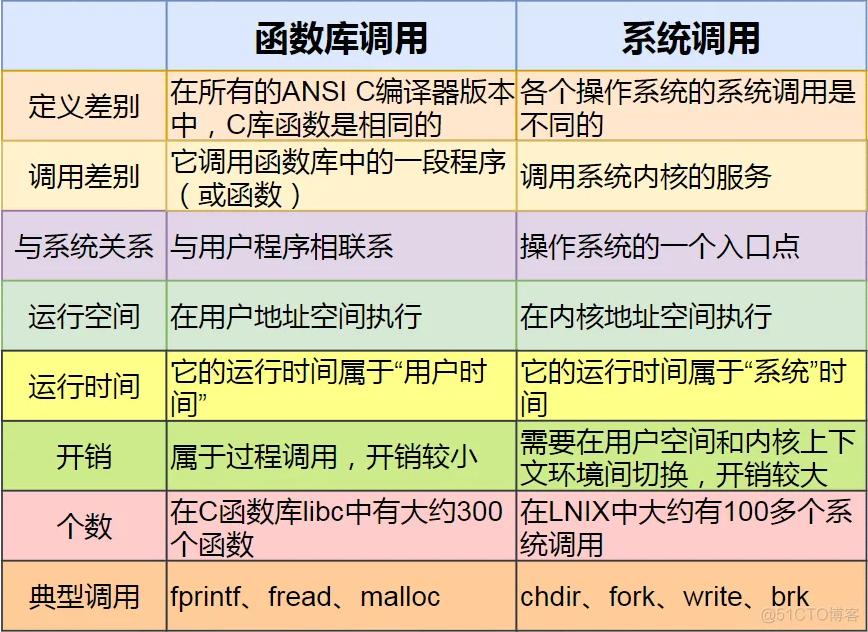

# Linux 常用排错工具与方法

## 文档说明

- 以下示例均在 `RHEL 7/8` 中验证实现，在 RHEL 8 中已更改的内容将特别指出。若针对其他 Linux 发行版请自行测试。
- 该文档中涉及的命令与参考链接可提供排错思路或依据。
- 若更深层次的分析与追踪故障原因需配合业务应用代码或 kernel 源码等进一步分析。
- 该文档将根据所使用的命令持续更新与使用案例。

## 文档目录

- journalctl 命令使用
- sosreport 命令使用
- Performance Co-Pilot (PCP) 组件使用
- 🔥 MBR 与 GPT 分区中的 GRUB2 再认识
- systemd 单元文件的依赖性
- CPU 的个数、核心数、超线程的关系
- CPU 信息查看
- dmidecode 命令使用
- 管理与测试硬件设备
- 常见物理服务器及硬件示例
- 管理内核模块与 KVM 虚拟化
- 🔥 Linux 存储栈故障修复
- rpm 命令使用
- yum 或 dnf 命令使用
- 🔥 基础网络问题调试
- 内存泄漏与内存溢出
- 共享库相关命令
- 🔥 系统调用与库调用
- strace 与 ltrace 命令使用

## journalctl 命令使用

```bash
$ man 7 systemd.journal-filelds
# 获取关于 journalctl 命令更加详细的搜索字段

$ journalctl --list-boots
# 查看系统重启的次数与信息
$ journalctl -b <number>
# 查看指定重启的详细信息
$ journalctl -b _TRANSPORT=kernel
$ journalctl -k
# 以上两个命令均返回上一次系统启动过程中的内核信息，相当于 dmesg 命令输出。

$ journalctl [/dev/sdX|/dev/vdX]
# 查看指定 scsi 磁盘设备或 virtio 磁盘设备的日志信息

$ journalctl -b _SYSTEMD_UNIT=<service_name>.service _PID=<service_pid>
# 查看指定服务中特定进程的日志信息
$ journalctl -u <unit_file_name>
# 查看 systemd 单元的日志信息

$ journalctl -n <number>
# 默认显示最后 10 条日志，也可以指定条目数量。
$ journalctl -ef
# 实时刷新最新的日志

$ journalctl -p <priority>
# 显示 debug、info、notice、warning、err、crit、alert 和 emerg 该级别及其之上的日志。
$ journalctl -p emerg..err
# 查看 emerg 到 err 级别的日志信息

$ journalctl --since today
# 查看当天的所有日志信息
$ journalctl --since "-1 hour"
# 查看前 1 小时的所有日志信息
$ journalctl --since "YYYY-MM-DD hh:mm:ss" --until "YYYY-MM-DD hh:mm:ss"
# 显示指定时间范围内的日志，必须使用双引号。
# 如果省略日期，则命令会假定日期为当天；如果省略时间，则命令假定为自 00:00:00 起的整天。
# yesterday、today 与 tomorrow 可以指定日志时间段，可参考 systemd.time(7) man 帮助。

$ journalctl -o verbose
# 显示更加详细的日志信息
```

- 参考链接：
  
  - [Chapter 10. Troubleshooting problems using log files](https://access.redhat.com/documentation/en-us/red_hat_enterprise_linux/8/html/configuring_basic_system_settings/assembly_troubleshooting-problems-using-log-files_configuring-basic-system-settings#masthead) 
  - [Chapter 5. Troubleshooting problems related to SELinux](https://access.redhat.com/documentation/en-us/red_hat_enterprise_linux/8/html/using_selinux/troubleshooting-problems-related-to-selinux_using-selinux)

## sosreport 命令使用

```bash
$ sosreport -l
# 列出 SOS 支持的插件与可用的选项
$ sosreport -e <plugin_name>
# 启用当前禁用的插件
$ sosreport -n <plugin_name>
# 禁用当前已启用的插件
$ sosreport -k <plugin_option>
$ sosreport -k xfs.logprint
# 使用 xfs.logprint 选项以收集 XFS 文件系统的相关信息 
```

## Performance Co-Pilot (PCP) 组件使用

```bash
$ yum install -y pcp pcp-gui pcp-system-tools
# 安装 PCP、PCP 图形化软件包与 PCP 系统工具包
$ systemctl enable --now pmcd.service pmlogger.service
# 启动并开机自启 pmcd 与 pmlogger 守护进程
# pmlogger 服务将指标日志存储于 /var/log/pcp/pmlogger/<hostname>/ 目录中

$ pminfo
# 查看 Co-Pilot 数据库中的性能指标的类型，可通过 pmval 命令列出数据库中的数据。
$ pminfo -dt <metrics_type>
# 查看指定指标类型的说明
$ pminfo -dt kernel.percpu.cpu.idle

$ pmval -s 5 -t 2 proc.nprocs
  metric:    proc.nprocs
  host:      servera.lab.example.com
  semantics: instantaneous value
  units:     none
  samples:   5
  interval:  2.00 sec
          111
          111
          111
          111
          111
# 实时刷新时间间隔 2 秒，共统计 5 次的瞬时进程数。
$ pmval -a /var/log/pcp/pmlogger/workstation.lab.example.com/20210609.14.52.0 <metrics_type>
# 查看默认指标数据归档文件中指定的指标类型日志
# -a 选项指定性能指标的归档日志

$ pmstat -s <sample_number> -t <number>[seconds|minutes] 
# 高层次的系统性能查看工具，在指定的时间间隔内（默认 5 秒刷新一次），共统计指定次数（类似于 vmstat 命令）。
$ pmatop
# 实时刷新系统资源使用信息（类似于 top 命令）
```

- PCP 软件包除提供命令行模式的性能指标输出外，还提供 `GUI` 图形化界面及 Web 图形化界面，并可与 `Grafana` 集成显示。
  该软件包提供强大而丰富的系统性能监控指标与参数，关于 PCP 软件包及相关命令的使用方法，可参考如下 `Red Hat Access` 链接获取更为详细的技术指导：
  - [RHEL 7 性能监控之 PCP](http://www.361way.com/rhel7-pcp/5149.html)  
  - [How do I install Performance Co-Pilot (PCP) on my RHEL server to capture performance logs](https://access.redhat.com/solutions/1137023) 
  - 💪 [Index of Performance Co-Pilot (PCP) articles, solutions, tutorials and white papers](https://access.redhat.com/articles/1145953) 
  - [Interactive web interface for Performance Co-Pilot](https://access.redhat.com/articles/1378113) 
  - [Introduction to storage performance analysis with PCP](https://access.redhat.com/articles/2450251)
  - 📊 [Chapter 10. Setting up graphical representation of PCP metrics](https://access.redhat.com/documentation/en-us/red_hat_enterprise_linux/8/html/monitoring_and_managing_system_status_and_performance/setting-up-graphical-representation-of-pcp-metrics_monitoring-and-managing-system-status-and-performance#doc-wrapper)
  - 📊 [Visualizing system performance with RHEL 8 using Performance Co-Pilot (PCP) and Grafana (Part 1)](https://www.redhat.com/en/blog/visualizing-system-performance-rhel-8-using-performance-co-pilot-pcp-and-grafana-part-1)
  - 📊 [Visualizing system performance with RHEL 8 using Performance Co-Pilot (PCP) and Grafana (Part 2)](https://www.redhat.com/en/blog/visualizing-system-performance-rhel-8-using-performance-co-pilot-pcp-and-grafana-part-2)

## 🔥 MBR 与 GPT 分区中的 GRUB2 再认识

- 传统 `GRUB` 与 `GRUB2` 在系统引导过程中存在明显的差异，因此对 GRUB2 引导系统各阶段的理解将帮助我们更好地实现引导过程的故障排除。
- GRUB2 不再使用传统 GRUB 的 `stage1`、`stage1.5` 与 `stage2` 阶段，而采用 `boot.img`、`core.img` 与各类 `*.mod` 等实现系统的引导启动，并且根据 MBR 与 GPT 分区的方式不同，GRUB2 在两者间的分布存在显著的区别。
- GRUB2 在 MBR 分区中的分布：
  
  
  
  
  
  如上图，GRUB2 使用 boot.img 作为 `boot loader` 负责系统引导过程的第一阶段（对应 GRUB 方式的 `stage1`），由于该镜像本身的容量大小限制无法识别 `/boot/grub2/` 所在文件系统类型，因此使用可以识别文件系统类型的 core.img，而 boot.img 由 GRUB2 硬编码 core.img 的磁盘位置定位该镜像。boot.img 位于 `/usr/lib/grub/i386-pc/` 中，grub2-install 程序将其转换为合适的 boot loader 程序写入第一个扇区。
  core.img 镜像是由位于 `/usr/lib/grub/i386-pc/` 中的 `diskboot.img`、`lzma_decompress.img`、`kernel.img` 与各类 `*.mod` 模块通过 `grub2-mkimage` 程序动态生成，该镜像安装的位置可在第二个扇区起始的称为 `MBR gap` 的区域（此区域至少 31 KiB）或任意文件系统的第一个扇区。
  
  
  
  由于 core.img 中可能包含更多的功能用以识别不同的文件系统类型与结构，如 Btrfs、ZFS、RAID 与 LVM 等，因此 MBR gap 需要更多空间。现代的很多磁盘管理与分区工具已预留至少 1 MiB 来满足该需求，如 fdisk、gdisk 与 parted 工具等。一旦 boot.img 引导定位至 core.img，其使用文件系统驱动识别 /boot/grub2 所在的文件系统（对应 GRUB 方式的 `stage1.5`）。
  
  
  
  GRUB2 通过读取 /boot/grub2 中的相关配置定位系统的 `vmlinuz (kernel)`、`initramfs (ramdisk)`，继而将系统的控制权由 GRUB2 转交给内存中的 kernel（对应 GRUB 方式的 `stage2`）。

- GRUB2 在 GPT 分区中的分布：
  
  
  
  `GPT`（GUID partition table，全局唯一标识符分区表）分区的结构与 MBR 分区相似，但存在自身的独特分区。在 GPT 中使用 `LBA`（logical block address，逻辑区块地址）来代替常用扇区的概念，虽然当前可使用以 `4 KiB` 的存储单位，但在 LBA 中默认依然采用 `512 bytes` 作为一个 LBA 的存储单位（可将 LBA 作为扇区理解）。  
  GPT 具体分区如上图所示：  
  - `LBA 0`：第一个扇区，称为保护性 MBR（MBR 兼容区块），可安装 446 bytes 的 boot loader 程序与 GPT 分区格式标识符。 
  - `LBA 1`：主要 GPT 表头记录，该部分记录了分区表自身的位置和大小，同时也记录了备用 GPT 分区所在位置（最后 34 个 LBA），还放置了分区表的校验码（CRC32），校验码的作用是让系统判断 GPT 的正确与否，倘若发现错误则可以从备份的 GPT 中恢复正常运行。 
  - `LBA 2~33`：32 个 LBA 共存储 128 个 GPT 分区表信息（entry），其中每个 LBA 存储 4 个分区信息，每个分区信息占 128 bytes。 
  - `LBA 34~2048`：类似于 MBR gap 区域，存储系统引导所需要的 core.img。 
  - `LBA -34 ~ -1`：备用 GPT 分区信息

- MBR 分区与 GPT 分区系统引导的过程与差异：
  
  
  
  虽然 BIOS 和 UEFI 启动过程的大多数配置语法与工具都相同，但存在一些差异。
  - linux16 和 /initrd16  更改为 `linuxefi` 和 `initrdefi`：
    用于加载内核和初始 ramdisk 的配置命令将 linux16 和 initrd16（用于 BIOS）切换为 linuxefi 和 initrdefi（用于 UEFI）。此更改是必要的，因为 UEFI 系统上的内核必须与 BIOS 系统上的加载方式不同。grub2-mkconfig 命令可自动识别 UEFI 系统并使用正确的命令。 
  - /boot/grub2 更改为 `/boot/efi/EFI/redhat`：
    用于存放 UEFI GRUB2 配置文件和对象的目录为 /boot/efi/EFI/redhat。此目录位于 `ESP`（EFI system partition）分区上，用于访问 UEFI 固件。
  - grub2-install：
    不要直接使用 grub2-install 命令安装 UEFI boot loader。RHEL 8 提供预构建的 `/boot/efi/EFI/redhat/grubx64.efi` 文件，其中包含安全启动系统所需的身份认证签名。直接在 UEFI 系统上执行 grub2-install 会生成一个没有这些必要签名的新 grubx64.efi 文件。可以从 `grub2-efi` 软件包恢复正确的 grubx64.efi 文件。使用 grub2-install 会直接在 UEFI 固件中注册可启动目标，以使用该新的 grubx64.efi，而不是所需的 `shim.efi`。
  - /boot/grub2/grub.cfg 更改为 `/boot/efi/EFI/redhat/grub.cfg`：
    GRUB2 配置文件从 BIOS 的 /boot/grub2 目录移至 UEFI ESP 分区上的 /boot/efi/EFI/redhat/ 目录。软链接 /etc/grub.cfg 已移至 `/etc/grub2-efi.cfg`。

- 管理 boot loader 配置文件与引导菜单：
  💥 MBR 分区与 GPT 分区对 boot loader 配置文件及引导菜单的管理方式相似，主要区别在于配置文件路径的变化。
  
  ```bash
  $ sudo vim /etc/default/grub
    GRUB_ENABLE_BLSCFG=true
  $ sudo grub2-mkconfig -o /boot/grub2/grub.cfg
  # MBR 分区方式：更新 GRUB2 配置文件
  $ sudo grub2-mkconfig -o /boot/efi/EFI/redhat/grub.cfg
  # GPT 分区方式：更新 GRUB2 配置文件
  $ sudo kernel-install add $(uname -r) /lib/modules/$(uname -r)/vmlinuz
  # 生成 /boot/loader/entries 条目
  
  $ sudo grubby --default-kernel
  # grubby 程序查看当前系统引导使用的默认内核
  $ sudo grubby --default-index
  # 查看当前系统引导使用的默认索引
  $ sudo grubby --set-default /boot/vmlinuz-4.18.0-305.el8.x86_64
  # 持久化设置默认的系统引导使用的内核
  $ sudo grubby --info=ALL
  # 查看所有内核的目录条目
  $ sudo grubby --info /boot/vmlinuz-4.18.0-305.el8.x86_64
  # 查看指定内核的 GRUB2 目录条目
  ```

- 1️⃣ 示例：管理多个 UEFI 启动目标（boot target）
  UEFI 固件（firmware）引导系统可使用 `efibootmgr` 命令管理启动目标（启动设备）。该命令可对启动目标实现更改、删除、添加等操作，其中删除某项启动目标后，可通过手动添加的方式进行恢复。
  
  ```bash
  $ sudo efibootmgr -v
  # 查看系统当前所有可引导设备的信息
  $ sudo efibootmgr -b <target_num> -B
  # 删除指定的启动目标
  ```
  
  
  
  ✨ 若系统具有多个可用的内核版本时，使用 efibootmgr 命令依然可管理启动目标（默认通常位于 `/boot/efi/EFI/redhat/*.efi` 中），再使用 grubby 命令设置当前可用的默认内核版本，即当 UEFI 方式中 GRUB2 引导至内核选择时，默认选取的内核，如下所示：
  
  
  
  如下所示，通过添加额外的 UEFI 启动目标并指定该启动目标以引导系统：
  
  ```bash
  $ sudo efibootmgr -c -d /path/to/device -p <esp_number> \
    -L "EFI for RedHat Enterprise Linux 8" \
    -l "\EFI\redhat\grubx64.efi"
  # 添加新的 UEFI 启动目标
  # 选项说明：
  #   -c  创建新的引导序号并添加至引导顺序中
  #   -d  使用的引导磁盘设备
  #   -p  ESP 分区的分区号
  #   -L  该命令显示的引导标签
  #   -l  指定的 UEFI 启动目标，默认为 "\EFI\redhat\grub.efi"。
  $ sudo efibootmgr -n <target_number>
  # 指定可用的启动目标覆盖当前的启动目标
  ```
  
  
  
  
  
  efibootmgr 添加额外启动目标后，当系统重启进入 BIOS 引导界面（VMware 虚拟化环境）中可见新增的启动目标。

- 2️⃣ 示例：使用 GRUB2 命令行引导 UEFI 方式启动的系统
  
  
  
  该系统分区中 `/dev/sda1` 挂载于 `/boot/efi` 为 UEFI 的 `ESP` 分区，`/dev/sda2` 挂载于 `/boot`，根分区以 `/dev/rootvg/lv0` 逻辑卷的方式挂载。现尝试使用 GRUB2 命令行方式重新引导系统：
  
  
  
  若 `root=` 根分区指定错误将无法成功引导，报错如下：
  
  

- 参考链接：
  - 📚 [GNU GRUB manual v2.06](https://www.gnu.org/software/grub/manual/grub/)  
  - 📚 [Chapter 26. Working with GRUB 2](https://access.redhat.com/documentation/en-us/red_hat_enterprise_linux/7/html/system_administrators_guide/ch-working_with_the_grub_2_boot_loader#doc-wrapper)  
  - ✨ [Managing, monitoring, and updating the kernel](https://access.redhat.com/documentation/en-us/red_hat_enterprise_linux/8/html-single/managing_monitoring_and_updating_the_kernel/index#doc-wrapper)  
  - 💪 [grub2 详解 (翻译和整理官方手册) - 骏马金龙](https://www.cnblogs.com/f-ck-need-u/p/7094693.html) 
  - 💪 [GRUB2 配置文件 grub.cfg 详解 (GRUB2 实战手册) - 金步国](http://www.jinbuguo.com/linux/grub.cfg.html)
  - 💪 [grub 安装过程](https://www.wxtechblog.com/grub/grub-install)  
  - [Step by Step Linux boot process with GRUB2 and systemd in RHEL 7 / CentOS 7](https://www.golinuxhub.com/2017/12/step-by-step-linux-boot-process-with/)  
  - [Linux Boot Process Explained Step by Step in Detail](https://www.golinuxcloud.com/linux-boot-process-explained-step-detail/) 
  - [第14章 Linux开机详细流程 - 骏马金龙](https://www.cnblogs.com/f-ck-need-u/p/7100336.html#auto_id_6)  
  - [GPT 分区数据格式分析](https://blog.csdn.net/chongyang198999/article/details/43408249)  
  - [GUID 磁碟分割表 - Wikiwand](https://www.wikiwand.com/zh/GUID%E7%A3%81%E7%A2%9F%E5%88%86%E5%89%B2%E8%A1%A8)  
  - ✨ [Linux 无法启动的修复方法](https://note.lishouzhong.com/article/wiki/linux/Linux%20%E6%97%A0%E6%B3%95%E5%90%AF%E5%8A%A8%E7%9A%84%E4%BF%AE%E5%A4%8D%E6%96%B9%E6%B3%95.html) 
  - [How to generate BLS configuration files under /boot/loader/entries in Red Hat Enterprise Linux?](https://access.redhat.com/solutions/5847011) 
  - [How to reinstall GRUB and GRUB2 on UEFI-based machines?](https://access.redhat.com/solutions/3486741)
  - [How to unpack/uncompress and repack/re-compress an initial ramdisk (initrd/initramfs) boot image file on RHEL 5,6 ?](https://access.redhat.com/solutions/24029)

## systemd 单元文件的依赖性

```bash
$ systemctl list-dependencies <unit_name>
# 列出指定单元文件依赖的其他单元文件，绿色点表示处于 active 状态，红色点表示 inactive 状态。
$ yum install -y graphviz
# 安装单元文件依赖的图形化处理工具
$ systemd-analyze dot <unit_name> | dot -Tsvg > <filename>.svg
# 生成指定单元文件的依赖性关系图
$ man 5 systemd.unit
# systemd 单元文件的详细说明文档

$ systemctl enable debug-shell.service
# 启用 debug-shell 服务
# 注意：
#   1. 在 sysinit.target 早期启动期间，该服务将在 /dev/tty9 上启动带有已登录
#      root shell 的虚拟控制台，管理员可使用该 root shell 来分析调试失败的服务或单元。
#   2. 该虚拟控制台对能够访问本地控制台的用户开放，故障排除完毕后需及时关闭该服务！
```

- 可在系统 GRUB2 引导时进行中断，使用 `systemd.unit=emergency.target` 参数进入紧急模式，该模式中 **`/`** 为 `ro`（只读状态），而使用 `systemd.unit=rescue.target` 参数进入救援模式，该模式中 **`/`** 为 `rw`（读写）状态。
- 关于 systemd 更为详尽的指导可参考[此链接](https://access.redhat.com/articles/754933)。

## CPU 的个数、核心数、超线程的关系

- 使用多处理器架构（SMP）或多核心 CPU 中 Linux 内核会将多核 CPU 当做多个单核 CPU 来识别，如 Linux 会将 2 个 4 核的 CPU 当做 8 个单核 CPU 来识别，但两者的性能并不等价。
- 物理 CPU 个数（physical id）：
  服务器主板插槽（socket）上实际插入的 CPU 个数
- CPU 核心数（cpu cores or core id）：
  单块 CPU 上面处理数据的芯片组的数量，如双核、四核等。
- 逻辑 CPU 个数（processor）：
  物理 CPU 个数（physical id）x 每颗 CPU 的核心数（core id）x 每个核心的超线程数（CPU 支持的话）

## CPU 信息查看

```bash
$ grep 'model name' /proc/cpuinfo | cut -d ':' -f 2 | uniq -c
# 查看 CPU 型号与逻辑 CPU 的个数
$ grep 'physical id' /proc/cpuinfo | uniq | wc -l
# 查看主机上物理 CPU 个数

$ grep 'core id' /proc/cpuinfo | sort | uniq | wc -l
$ grep 'cpu cores' /proc/cpuinfo | uniq | cut -d ':' -f 2 | sed 's/^[[:space:]]*//'
# 查看每个物理 CPU 的核心数
# 注意：使用 uniq 命令时必须将重复的行排序到一起后才能去除，否则不能去除重复！

$ grep 'processor' /proc/cpuinfo | wc -l
$ lscpu | grep '^CPU(s)' | cut -d ':' -f 2 | sed 's/^[[:space:]]*//'
$ lscpu | grep '^CPU(s)' | awk -F ':' '{ print $2 }' | sed 's/^[[:space:]]*//'
# 查看主机上逻辑 CPU 的个数
# 使用 lscpu 命令查看 CPU 信息，其中的 "CPU(s)" 为逻辑 CPU 数目。

$ getconf LONG_BIT
# 查看 CPU 的工作模式，即 32-bit 或 64-bit。
# 若显示返回 32，不代表不支持 64-bit。
$ grep 'flags' /proc/cpuinfo | grep 'lm' | wc -l
# 查看 CPU 是否支持 64-bit，若返回值大于 0，则支持 64-bit。
# lm 指 long mode，支持 lm 则支持 64-bit。
```

## dmidecode 命令使用

```bash
$ man dmidecode
# 查看 dmidecode 命令的详细使用方法
# 可搜索 TYPES 关键字查询该命令支持的 DMI 类型，也可搜索 -s 查看该命令支持的类型关键字。

$ dmidecode | grep 'Product Name'
# 查看服务器型号
$ dmidecode | grep 'Serial Number' | grep -Ev "Not|None"
# 查看服务器主板序列号
$ dmidecode -s system-serial-number
# 查看服务器系统序列号

$ dmidecode -t Memory | grep -P -A5 "Memory\s+Device" | grep Size | sed -s 's/^[ \t]*//g'
# 查看系统当前已安装的内存大小与内存槽位数
# -P 选项为 grep 命令支持 Perl 正则表达式
$ dmidecode -t Memory | grep -P -A16 "Memory\s+Device" | grep Speed
# 查看已安装的内存速率，未安装内存的槽位其速率为 Unknown。
$ dmidecode -t 16
  # dmidecode 3.2
  Getting SMBIOS data from sysfs.
  SMBIOS 2.7 present.

  Handle 0x01A2, DMI type 16, 23 bytes
  Physical Memory Array
          Location: System Board Or Motherboard
          Use: System Memory
          Error Correction Type: None
          Maximum Capacity: 161 GB
          # 系统支持的最大扩展内存
          Error Information Handle: Not Provided
          Number Of Devices: 64
          # 系统支持的内存插槽数，单根内存条最大支持容量为 "Maximum Capacity/Number Of Devices"。
# 16 代表 Physical Memory Array
# 注意： 需考虑内存槽位是否被占满，以及是否可被扩展到最大内存。
$ dmidecode -t 16 | grep "Maximum Capacity" | sed -s 's/^[ \t]*//g'
# 查看系统可支持的最大内存数

$ dmidecode -t 0,1
# 同时查看两种 DMI 类型的信息（BIOS 与 processor）
```

- `dmidecode` 允许在 Linux 系统下获取有关硬件方面的信息，其遵循 `SMBIOS`（System Management BIOS）/ `DMI`（Desktop Management Interface） 标准，该标准由 DMTF（Desktop Management Task Force）开发，其输出的信息包括 BIOS、系统、主板、处理器、内存、缓存等等。
- `DMI`（Desktop Management Interface）充当了管理工具和系统层之间接口的角色。它建立了标准的可管理系统更加方便了计算机厂商和用户对系统的了解。DMI 的主要组成部分是 Management Information Format（MIF）数据库。这个数据库包括了所有有关计算机系统和配件的信息。通过 DMI，用户可以获取序列号、计算机厂商、串口信息以及其它系统配件信息。
- 查看硬件相关的命令与文件：
  - `dmesg` 命令：
    在 Linux 上 syslogd 或 klogd 启动前用来记录内核消息（启动阶段的消息）。
    它通过读取内核的环形缓冲区（ring buffer）来获取数据，在排查问题或只是尝试获取系统硬件信息时，该命令非常有用。

    ```bash
    $ dmesg -T
    # 转换 dmesg 命令输出的时间戳以查看启动过程
    ```
  
  - `lshw` 命令：
    通过读取 `/proc` 目录下各种文件的内容和 DMI 表来生成硬件信息。
  - `hwinfo` 命令：
    可提供比 lshw、dmidecode、dmesg 命令更为详细的硬件信息。
    它使用 libhd 库 `libhd.so` 来收集系统上的硬件信息。
    该工具是为 OpenSuSE 特别设计的，后来其它发行版也将它包含在其官方仓库中（RHEL 中来自 EPEL 源）。

    ```bash
    $ ldd $(which hwinfo)
            linux-vdso.so.1 (0x00007ffde40f9000)
            libhd.so.21 => /lib64/libhd.so.21 (0x00007f70bb4b7000)
            libc.so.6 => /lib64/libc.so.6 (0x00007f70bb0f5000)
            libx86emu.so.1 => /lib64/libx86emu.so.1 (0x00007f70baed1000)
            /lib64/ld-linux-x86-64.so.2 (0x00007f70bbba2000)
    ```
  
  - `/sys/class/dm/id/`：
    该目录中具有部分 DMI 信息。
- 参考链接：
  - [linux 下查看主板内存槽与内存信息（dmidecode）](https://blog.csdn.net/d12345678a/article/details/53908889)  
  - [dmidecode 命令详解（获取硬件信息）](http://www.linuxidc.com/Linux/2015-12/126814.htm)

## 管理与测试硬件设备

```bash
### 侦测不同的磁盘驱动设备 ###
$ hdparm -I /dev/sda
# 查看或设置 IDE/SATA 设备的参数

$ lsscsi -v
  [3:0:0:0]    cd/dvd  NECVMWar VMware SATA CD01 1.00  /dev/sr0
    dir: /sys/bus/scsi/devices/3:0:0:0  [/sys/devices/pci0000:00/0000:00:11.0/0000:02:04.0/ata4/host3/target3:0:0/3:0:0:0]
  [26:0:1:0]   disk    VMware,  VMware Virtual S 1.0   /dev/sda
    dir: /sys/bus/scsi/devices/26:0:1:0  [/sys/devices/pci0000:00/0000:00:10.0/host26/target26:0:1/26:0:1:0]
  list_ndevices: scandir: /sys/class/nvme/: No such file or directory
  NVMe module may not be loaded
# 列举 SCSI 设备与 NVMe 设备，该命令从 sysfs 文件系统中读取设备相关信息。

### 侦测 PCI/PCIe 设备 ###
$ lspci -v
# 查看所有 PCI/PCIe 设备的概要信息
$ lspci -v -k -nn -s <bus>:<slot>.<function>
# 根据 PCI 的插槽位置信息查看该设备的详细信息

$ lsusb -v
# 查看系统上的 USB 设备信息
```


如上图所示，确认各类物理网卡的详细 PCIe 信息。

```bash
### 硬件错误报告工具 ###
$ yum install -y mcelog
# 安装 x86 平台硬件故障报告工具 mcelog 软件包，主要针对 CPU 与内存的检测。
$ systemctl start mcelog.service
$ systemctl enable mcelog.service
# 启动 mcelog 服务并设置开机自启动
# mcelog 服务可以守护进程的方式运行（推荐），也可以 cron 计划任务的方式运行（该方式存在无法记录硬件故障的问题）。
# 计划任务方式运行的 crontab 文件位于 /etc/cron.hourly/mcelog.cron

$ yum install rasdaemon
# 安装 rasdaemon 软件包，可使用该软件包替代 mcelog。
$ systemctl start rasdaemon.service
$ systemctl enable rasdaemon.service
# 启动 rasdaemon 服务并设置开机自启动
$ ras-mc-ctl --errors
# 查看硬件错误日志信息

### 物理内存测试工具 ###
$ yum install -y memtest86+
# 安装 memtest86+ 内存测试软件包
$ memtest-setup
# 该命令将在 /etc/grub.d/ 目录中生成 20_memtest86+ 脚本，因此需重新生成 GRUB2 主配置文件。 
$ grub2-mkconfig -o /boot/grub2/grub.cfg
# 重新生成 Legency 模式的 GRUB2 引导文件
# 可在系统引导界面进入内存测试界面进行测试
# 注意：memtest86+ 内存测试通常在物理机上运行测试，而不是虚拟机上运行！
```


如上图所示，使用 memtest86+ 软件包在系统启动引导过程中实现内存测试。

## 常见物理服务器及硬件示例


## 管理内核模块与 KVM 虚拟化

```bash
### 内核模块相关命令 ###
$ lsmod
# 查看当前已加载的内核模块列表
$ modprobe -v <module_name>
# 加载指定的内核模块
$ modprobe -rv <module_name>
# 卸载指定的模块（依然可重新加载）
$ modinfo -p <module_name>
# 查看内核模块的选项
$ cd /sys/module/<module_name>/parameters/; ls -lh
# 该目录用于存放已加载的内核模块选项，未加载的内核模块在该目录中不存在。
# 每个内核模块选项以单独的文件形式记录选项的参数

$ modprobe -v st buffer_kbs=64
  insmod /lib/modules/3.10.0-327.el7.x86_64/kernel/drivers/scsi/st.ko buffer_kbs=64
# 加载 st 内核模块并指定 buffer_kbs 参数
$ modprobe -v megaraid_sas msix_disable=1                                                                             
  insmod /lib/modules/4.18.0-348.el8.x86_64/kernel/drivers/scsi/megaraid/megaraid_sas.ko.xz msix_disable=1
# 加载 megaraid_sas 内核模块并指定 msix_disable 参数
# 该参数将 MegaRAID 阵列卡禁用 MSI-X 中断处理程序

$ vim /etc/modprobe.d/st.conf
  options st buffer_kbs=64 max_sg_segs=512
# 在 /etc/modprobe.d/<module_name>.conf 自定义文件中指定内核模块的参数，当模块加载时将自动加载该参数。
$ vim /etc/modprobe.d/blacklist.conf
  blacklist  <module_name>
  install  <module_name>  /bin/false
# 防止在系统启动时自动载入内核模块
# 注意：
#   使用 blacklist 指令只能指定禁用的模块而无法禁止其依赖模块对它的载入，因此需使用 install
#   指令防止其依赖模块对它的载入。
```


内核模块除了可在系统运行时动态加载、系统引导启动时加载之外，也可将其添加至 `initramfs` 或 `initrd` 镜像中，使镜像具有对特定硬件的驱动能力。如将 `magaraid_sas` 模块添加至 initramfs 中，如下所示：


使用以上方式添加的为内核模块，而 initramfs 中本身具有模块（称为 dracut 模块）与内核模块不同，并且在执行 dracut 命令前必须先备份原先的 `/boot/initramfs-4.18.0-348.el8.x86_64.img` 镜像，防止添加失败导致原 initramfs 镜像数据丢失。
若 initramfs 镜像整个丢失，可使用如下命令重建该镜像：

```bash
$ dracut -f -v /boot/initramfs-4.18.0-348.el8.x86_64.img
```

KVM 虚拟化相关命令使用：

```bash
### KVM 虚拟化 ###
$ modprobe -v [kvm_intel|kvm_amd]
# 加载 KVM 在不同 CPU 平台下的内核模块，若加载报错，说明 CPU 不支持虚拟化或在 BIOS/UEFI 中禁用虚拟化。
# Intel CPU 支持虚拟化的 flag 为 vmx，AMD CPU 支持虚拟化的 flag 为 svm。

$ virsh capabilities
# 查看 hypervisor 支持的虚拟化类型（默认为 qemu-kvm 虚拟化）
$ virsh nodecpustats --percent
# 查看 1 秒内 hypervisor 的 CPU 使用百分比
$ virsh nodememstats
# 查看 hypervisor 的内存使用情况

$ xmllint /path/to/<filename>.xml
# 判断 XML 文件语法的合法性（单纯语法检查）
$ virt-xml-validate /path/to/<kvm_domain_filename>.xml
# 判断 KVM 虚拟机 XML 定义文件的合法性（字段及标签等检查）
```

- 参考链接：
  - 📚 [Chapter 2. Managing kernel modules](https://access.redhat.com/documentation/en-us/red_hat_enterprise_linux/8/html/managing_monitoring_and_updating_the_kernel/managing-kernel-modules_managing-monitoring-and-updating-the-kernel#doc-wrapper)  
  - [dracut.cmdline(7) - Linux manual page](https://man7.org/linux/man-pages/man7/dracut.cmdline.7.html)

## 🔥 Linux 存储栈故障修复

Linux 存储栈（storage stack）主要分为三层：

- 文件系统层（filesystem layer）
- 块层（block layer）
- 设备层（device layer）
根据不同内核版本存储栈存在一定的区别，此处以 `4.10` 内核版本为例展示存储栈全景图：


若对上图实现简单抽象，可参考如下示意：


存储的 I/O 工作流（从磁盘到网络）：


```bash
### 清理与 VFS 相关的缓存 ###
# VFS also maintains several caches to improve storage I/O performance, the inode cache, dentry
# cache, buffer cache, and page cache. Of these, the most important is the page cache. The page
# cache is dynamically allocated from free memory on the system, and is used to cache pages of
# data from files being read or written.
$ man 5 proc
# 搜索 /proc/sys/vm/drop_caches 的详细信息

$ echo 3 > /proc/sys/vm/drop_caches
# 同时清除 page cache、dentries cache 与 inodes cache
# 注意：以上 3 种类型的 cache 均由 VFS 虚拟文件系统管理分配至空闲物理内存中，并且清除 cache 前需提前执行 sync 操作！

### 内核 Device Mapper 框架 ###
# Device mapper is a powerful mechanism in the kernel to create 1:1 mappings of blocks in one
# block device to blocks in another, logical block device.
$ dmsetup ls
# 查看 devicemapper 映射的逻辑设备列表

$ lsblk [--path] [--fs]
NAME            MAJ:MIN RM  SIZE RO TYPE MOUNTPOINT
sr0              11:0    1    1M  0 rom
vda             253:0    0   10G  0 disk
└─vda1          253:1    0   10G  0 part /
vdb             253:16   0    1G  0 disk
├─vdb1          253:17   0  200M  0 part
│ └─myvg1-mylv1 252:0    0  260M  0 lvm
└─vdb2          253:18   0  100M  0 part
  └─myvg1-mylv1 252:0    0  260M  0 lvm
# 预先创建相应的卷组与逻辑卷
$ dmsetup table /dev/mapper/myvg1-mylv1
  0 401408 linear 253:17 2048
  401408 131072 linear 253:18 2048
# 查看 devicemapper 映射的逻辑设备映射表，其中可确定逻辑设备与物理设备之间的线性（linear）映射关系（1:1）。
# 计算逻辑卷容量是否一致：(401408 sectors + 131072 sectors) * 512 byte / 1024 / 1024 = 260MiB
```

Device Mapper 框架如下所示：


devicemapper 从 `2.4.x` 内核中首次提出后，在 `2.6.x` 中正式使用，目前被广泛用于 LVM、devicemapper-multipath、LUKS、Stratis、VDO 等技术中。以前文 LVM 命令行输出为例，devicemapper 使用线性化的方式将不同的磁盘扇区与逻辑设备实现 1:1 映射，如下所示：


```bash
### 磁盘 IO 调度算法 ###
$ cat /sys/block/<device>/queue/scheduler
# 查看指定磁盘设备的 IO 调度算法，一般为 deadline、cfq、noop 三种。
$ echo deadline > /sys/block/<device>/queue/scheduler
# 更改磁盘设备 IO 调度算法

### 文件系统修复 ###
# The data migration can be performed with various common utilities such as dd. 
# This will provide the functional hardware foundation that is required for file system maintenance.
### ext2/ext3/ext4 文件系统修复 ###
$ e2fsck -n <filesystem>
# 将文件系统设置为只读模式，检测文件系统故障但不进行修复。
$ e2fsck -y <filesystem>
# 不进入交互模式直接修复
$ dumpe2fs <filesystem>
# 查看 ext2/ext3/ext4 文件系统的超级块（super block）与块组（blocks group）的信息
$ dumpe2fs <filesystem> | grep -i 'Backup superblock'
# 查看文件系统的备份的 superblock
$ e2fsck -n <filesystem> -b <superblock>
# 使用备份的 superblock 恢复故障的 superblock
### xfs 文件系统修复 ###
$ xfs_repair -n <filesystem>
# 检测 xfs 文件系统故障但不进行修复
$ xfs_repair <filesystem>
# 自动修复 xfs 文件系统故障
# 注意：
#   1. xfs_repair 命令只能在具有干净日志记录的 xfs 文件系统上执行修复！
#   2. 若挂载与卸载不产生干净的日志记录，则日志可能已损坏。
#   3. 在无法产生干净日志记录的情况下，可使用 xfs_repair -L 选项清除日志记录。
#   4. 日志不可恢复时，清除日志记录是必要的，但该操作将丢弃所有日志元数据，这将导致最近写入的
#      数据出现进一步的问题。

$ diff -s <file1> <file2>
# 判断两个文件的内容是否完全相同
$ dd if=/dev/zero of=/tmp/datafile1 oflag=direct bs=4096 count=1000000
# dd 命令使用直写方式，以 4KiB 为单位写入数据文件。

### LUKS 加密磁盘 ###
$ blkid -t TYPE=crypto_LUKS -o device
# 查看 LUKS 加密的块设备
$ dmsetup ls --target crypt
# 查看已加密的 devicemapper 逻辑设备
$ cryptsetup luksHeaderBackup <device> --header-backup-file <backup_file>
# 备份 LUKS 加密设备的 header 头部信息（包括 key slot 信息）至新的备份文件中
$ cryptsetup luksHeaderRestore <device> --header-backup-file <backup_file>
# 通过备份的 header 头部信息文件恢复 LUKS 加密设备，该操作将覆盖当前的 header 头部信息。
# 使用场景：
#   1. 所有可用的 key slot 已全部删除，无法再次解密，可使用备份文件。
#   2. 所有的密码遗忘无法再次解密，可使用备份文件。
# 注意：
#   清除 LUKS 加密设备的 key slot 方法：
#   1. 添加新的 key slot 密钥，再通过新密钥删除旧密钥。
#   2. 直接使用备份的 header 头部信息文件覆盖当前的 header 以去除当前的 key slot。
$ cryptsetup luksOpen <device> <dm_logical_device_name>
# 映射加密的 LUKS 设备至 devicemapper 逻辑设备
```

- 关于 Device Mapper 框架的信息可参考如下链接：
  - 💪 [**Device Mapper FOSDEM** *Sunday 27th February 2005* Alasdair Kergon](https://people.redhat.com/agk/talks/FOSDEM_2005/)
- 关于磁盘 IO 调度的相关技术信息可参考如下链接：
  - [Understanding the Deadline IO Scheduler](https://access.redhat.com/articles/425823) 
  - [Using the Deadline IO Scheduler](https://access.redhat.com/solutions/32376) 
  - [Understanding the Noop IO Scheduler](https://access.redhat.com/articles/46958) 
  - [Unable to change IO scheduler for virtio disk /dev/vda in RHEL 7.1](https://access.redhat.com/solutions/1305843)  
  - [RHEL7 Storage Docs](https://access.redhat.com/documentation/en-us/red_hat_enterprise_linux/7/html/7.2_release_notes/storage#idp1704576)
- 关于 LUKS 加密的相关技术信息可参考如下链接：
  - [Chapter 11. Encrypting block devices using LUKS](https://access.redhat.com/documentation/en-us/red_hat_enterprise_linux/8/html/security_hardening/encrypting-block-devices-using-luks_security-hardening) 
  - [All about LUKS, cryptsetup, and dm-crypt](https://access.redhat.com/articles/193443)  
  - [What is LUKS ( Linux Unified Key Setup) disk encryption and how can it be implemented?](https://access.redhat.com/solutions/100463)  
  - [How to recover lost LUKS key or passphrase](https://access.redhat.com/solutions/1543373)
- 关于 iSCSI 的信息可参考如下链接：
  - [SAN 与 iSCSI 存储相关](https://github.com/Alberthua-Perl/tech-docs/blob/master/Linux%20%E7%9A%84%E5%9F%BA%E7%A1%80%E4%B8%8E%E8%BF%9B%E9%98%B6/SAN%20%E4%B8%8E%20iSCSI%20%E5%AD%98%E5%82%A8%E7%9B%B8%E5%85%B3.md)
- 关于 Linux 存储堆栈的信息可参考如下链接：
  - [Linux Storage Stack Diagram - Thomas-Krenn-Wiki-en](https://www.thomas-krenn.com/en/wiki/Linux_Storage_Stack_Diagram)  
  - 💪 [深入理解 Linux I/O 系统](https://mp.weixin.qq.com/s/ccZJaRLq2-Ns9dJILigIgw)

## rpm 命令使用

- RPM GPG 公钥保存目录：`/etc/pki/rpm-gpg`
- RPM 软件包中文件的状态标识：man rpm 命令 `-V`


```bash
rpm 命令常用选项：
  -a, --all                查询所有的软件包
  -i, --install            安装软件包
  -c, --configfiles        列出软件包的所有配置文件
  -d, --docfiles           列出软件包的所有文档文件
  -U, --upgrade            升级软件包
  -e, --erase              卸载软件包
  -v, --verbose            查看详细的输出内容
  -h, --hash               查看软件包安装过程中的哈希标志
  -q, --query              查询软件包相关信息
  -f, --file               查询指定文件所属的软件包
  -p, --package            查询或确认未安装的软件包文件（该软件包必须提前下载）
  -l, --list               列出软件包中的文件
  --info                   查询软件包的详细信息
  --nodeps                 忽略软件包的依赖关系
  --requires               列出软件包的依赖项目
  --import                 导入软件包的 GPG 公钥
  --allmatches             卸载匹配的全部软件包
  --scripts                列出软件包安装、升级与卸载过程中的所有脚本文件
  --changelog              列出软件包的更改信息

### 管理 RPM 软件包 ###
$ rpm -evh --nodeps <package_name>                           
# 卸载指定软件包，但不卸载依赖的软件包。
$ rpm -qpl <not_installed_package_name>                      
# 查看未安装的软件包中的文件

$ rpm -q --info <package_name>
# 查看已安装软件包的详细信息
$ rpm -ql <package_name>                           
# 查看已安装的软件包中的文件
$ rpm -qc <package_name>
# 查看当前已安装的软件包中的配置文件
$ rpm -qd <package_name>
# 查看当前已安装的软件包中的文档
$ rpm -qf <filename>
# 查询指定文件所属的软件包
$ rpm -q --scripts <package_name>
# 查看当前已安装的软件包中安装、升级与卸载过程中运行的脚本
$ rpm -q --changelog <package_name>
# 查看当前已安装的软件包更改信息

### 管理 RPM GPG 公钥 ###
$ rpm --import /etc/pki/rpm-gpg/RPM-GPG-KEY-<pubkey_name>
# 导入软件包 GPG 公钥至 RPM 数据库中，导入的 GPG 公钥使用 ID 进行区分。
# 注意：
#   1. 可将 GPG 公钥导入 RPM 数据库，再将该 GPG 公钥文件保存至该目录中。
#   2. 只有导入 RPM 数据库的 GPG 公钥，才能使用 rpm 命令查看。
#   3. 保存至该目录中的 GPG 公钥，可防止因初始化 RPM 数据库而造成的 GPG 公钥丢失！ 

$ rpm --import https://<url_of_rpm_gpg_key>
# 从相应 URL 上导入 GPG 公钥至 RPM 数据库中
$ rpm -q gpg-pubkey                                          
# 查看已安装导入至 RPM 数据库中的 GPG 公钥
$ rpm -e --allmatches gpg-pubkey-<id>
# 从 RPM 数据库中删除相应的 GPG 公钥
$ rpm -q --info gpg-pubkey-<id>
# 查看相应RPM数据库中 GPG 公钥信息

### rpm2cpio 命令示例 ###
$ rpm2cpio <package_name>.rpm | cpio -it
# 查看未安装的 rpm 软件包中的文件
$ rpm2cpio <package_name>.rpm | cpio -id
# 提取 rpm 软件包文件至当前工作目录中
$ rpm2cpio <package_name>.rpm | cpio -id "*txt"
# 提取 rpm 软件包中的指定文件

### 恢复冲突的 RPM 数据库 ###
$ lsof | grep /var/lib/rpm
# 确认 /var/lib/rpm 目录是否被进程占用
$ rm /var/lib/rpm/__db*
# 删除 RPM 数据库索引文件
$ tar -jcvf rpmdb-$(date +%Y%m%d-%H%M).tar.bz2 /var/lib/rpm
# 备份原始 RPM 数据库
$ cd /var/lib/rpm
$ /usr/lib/rpm/rpmdb_verify Packages
# 确认 RPM 数据库的合法性
$ mv Packages Packages.broken
# 更改原始 RPM 数据库名称
$ /usr/lib/rpm/rpmdb_dump Packages.broken | /usr/lib/rpm/rpmdb_load Packages
# 修复原始 RPM 数据库
$ /usr/lib/rpm/rpmdb_verify Packages
  BDB5105 Verification of Packages succeeded.
# 确认修复的 RPM 数据库的合法性
$ rpm -v --rebuilddb
  error: rpmdbNextIterator: skipping h#       4 region trailer: BAD, tag 0 type 0 offset 0 count 0
# 重建 RPM 数据库的索引文件
$ rpm -qa > /dev/null
# 再次查询软件包确认数据库正确

### 确认 RPM 软件包文件状态 ###
$ rpm -V <package_name>
# 查看指定软件包中文件的更改状态，若相关文件未发生更改则无返回信息，发生更改的文件具有属性更改信息返回。
$ rpm -V openssh-server
  SM5....T.  c /etc/ssh/sshd_config
# /etc/ssh/sshd_config 文件相较于原始 RPM 软件包中发生了文件大小、文件权限、文件内容、修改时间的更改。   
$ rpm -Va
# 查看所有软件包中文件的更改状态
$ rpm --setperms <package_name>
# 恢复文件为软件包中定义的权限
```

## yum 或 dnf 命令使用

- RHEL 8 中已使用 dnf 命令替换 yum 命令，为保证兼容性 yum 作为 dnf 的软链接依然可继续使用，两者的使用方法上几乎一致，下文依然使用 yum 进行说明，可自行替换为 dnf。
- 配置 yum 软件源优先级：
  - CentOS 7.x/RHEL 7.x 配置 yum 软件源优先级时，需安装 `yum-plugin-priorities` 软件包。
  - yum 插件的配置文件目录：`/etc/yum/pluginconf.d/`
  - yum 软件源优先级功能是否启用：`/etc/yum/pluginconf.d/priorities.conf`

    
  
  - 编辑 `/etc/yum.repos.d/*.repo` 文件：

    
  
  - priority=*N*（取值 **`1~99`**），数值越大优先级越低。
  
  ```bash
  yum 命令常用选项：
    --enablerepo=<repo_name>     使用一个或多个 yum 软件仓库（可使用 wildcard 通配符）
    --disablerepo=<repo_name>    禁用一个或多个 yum 软件仓库（可使用 wildcard 通配符）
    --showduplicates             查看软件仓库中不同版本的软件包（默认只显示最新版）
    --nogpgcheck                 禁用 GPG 签名检查
    --installroot=<path>         指定 rpm 软件包的安装根路径
  
  $ yum --disablerepo=\* --enablerepo=elrepo-kernel list available
  # 查看指定的 yum 软件仓库 elrepo-kernel 中可用的软件包
  $ yum provides <filename>
  # 查看文件由哪些包提供
  $ yum whatprovides <command>
  # 查看命令由哪些包提供
  $ yum deplist <package_name>
  # 查看安装包的依赖文件及提供软件包的信息
  # 注意：
  #   $ rpm -qR <package_name>
  #   # 查看软件包的依赖文件
  
  $ yum list --showduplicates <package_name>
  # 查看软件源中所有可用的软件包
  $ yum list --showduplicates gitlab-ce
  # 查看 GitLab 源中所有可用的不同版本 gitlab-ce 软件包
  
  $ yum reinstall -y <package_name>
  # 重新安装相关软件包
  $ yum reinstall -y kernel
  # 重新安装 kernel 软件包 
  # 使用场景：
  #   1. 若误删 vmlinuz-* 内核文件或 initramfs-* 文件，可使用该方法重新安装内核恢复。  
  #   2. 若只生成 initramfs-* 文件，可直接使用 dracut -f -v /boot/initramfs-* 命令。
  
  $ yum downgrade -y <package_name>
  # 降级指定软件包为旧版本
  # 注意：
  #   $ rpm -U --oldpackage <package_name>
  #   # 指定旧版本软件包降级
  
  $ yum install -y yum-plugin-versionlock
  # 安装 yum 版本锁定插件软件包
  # 注意：RHEL 8 中安装 python3-dnf-plugin-versionlock 以使用 versionlock 子命令
  $ yum versionlock add <package_name_wildcard>
  # 将指定的软件包进行版本锁定
  $ yum versionlock delete <package_name_wildcard>
  # 去除指定软件包的版本锁定
  $ yum versionlock clear
  # 去除所有软件包的版本锁定
  $ yum versionlock list
  # 查看版本锁定的软件包
  # 注意：指定软件包一定版本锁定，将无法进行升级与降级！
  
  $ yumdownloader --destdir <dest_dir> <package_name>
  # 下载软件包至指定目录中
  
  $ yum grouplist
  $ yum groupinfo "<group_name>"
  $ yum groupinstall "<group_name>" \
    -y --setopt=group_package_types=mandatory,default,optional
  # RHEL 7.x/8.x：根据包组中软件包的类型安装相应包组软件
  # 注意：
  #   $ yum groupinstall "Legacy UNIX Compatibility" \
  #     -y --setopt=group_package_types=mandatory,default,optional
  
  $ yum install -y yum-plugin-verify
  # 安装 yum-plugin-verify 软件包，用于确认软件包中文件的状态。
  # 注意：RHEL 8 中已不再提供该软件包实现 verify 子命令
  $ yum verify <package_name>
  # 只确认软件包的状态，不确认软件包配置文件的状态。
  $ yum verify-rpm <package_name>
  # 确认软件包配置文件的状态
  $ yum verify-rpm vsftpd
    Loaded plugins: langpacks, search-disabled-repos, verify
    ==================== Installed Packages ====================
    vsftpd.x86_64 : Very Secure Ftp Daemon
        File: /etc/vsftpd/vsftpd.conf
        Tags: configuration
            Problem:  checksum does not match
            Current:  sha256:37bd013bbecaf93450ba74cbd85c9dcc60d6c47822b0c1e404d6057eba779eb3
            Original: sha256:6e011bfb61a81c33377e78ed1aaef6d204516d390dd6a3daf973ce82ec7eadf2
                                       --------
            Problem:  size does not match
            Current:          5029 B
            Original:         5030 B
                                       --------
            Problem:  mtime does not match
            Current:  Sat Jun 26 23:43:34 2021 (2154 days, 3:37:07 later)
            Original: Mon Aug  3 20:06:27 2015
    verify-rpm done
  # 更改 /etc/vsftpd/vsftpd.conf 配置文件后，可被 yum verify-rpm 命令检测出更改的属性。 
  ```

## 🔥 基础网络问题调试

- 网络连通性测试：ping 与 ping6 命令常用选项
  
  

- 关于 `MTU` 故障的说明：
  - MTU（Maximum Transmission Unit，最大传输单元）是指一种通信协议的某一层上面所能通过的最大数据包大小（以字节为单位）。最大传输单元这个参数通常与通信接口有关。
  - 当 MTU 不合理时会造成如下问题：
    - 本地 MTU 值大于网络 MTU 值时，本地传输的 "数据包" 过大导致网络会拆包后传输，不但产生额外的数据包，而且消耗了 "拆包、组包" 的时间。
    - 本地 MTU 值小于网络 MTU 值时，本地传输的数据包可以直接传输，但是未能完全利用网络给予的数据包传输尺寸的上限值，传输能力未完全发挥。
  - 合理的 MTU 值：
    所谓的合理的 MTU 值，就是让本地 MTU 值与网络的 MTU 值一致，以致于不会出现数据包的大小超过网络传输的 MTU 值，而不得不进行拆包，然后组包，再进行转发，既能完整发挥传输性能，又不让数据包拆分。
  - 💥 数据包大小大于 MTU 的故障：

    

    ping 命令使用 ICMP 协议测试网络连通性，整个数据包包括数据净荷（字节）、ICMP 头（8 字节）、IP 头（20 字节）。因此，上图中使用 1472 字节的数据净荷，而数据包整体为 1500 字节，已达到本地最大传输单元。若禁止本地的数据包分片（`-M do`）且数据净荷超过 1472 字节，则由于数据包大小大于本地 MTU 而无法测试网络连通性；若不使用 `-M do` 选项，可通过本地数据包分片测试连通性。

    

- `nmap` 命令使用示例：
  - nmap 是功能强大的网络扫描工具，可以扫描单个主机和大型网络。
  - 它主要用于安全审核和渗透测试。
  - nmap 是端口扫描的首选工具，除端口扫描外，nmap 还可以检测 MAC 地址、操作系统类型、内核版本等。
  - nmap 默认发送一个 ARP 的 ping 数据包，来探测目标主机 `1-1000` 范围内所开放的所有端口。
  
  ```bash
  $ nmap -vv [<fqdn>|<target_ip_address>]
  # 扫描指定主机是否运行及监听的端口号，及扫描的详细信息。
  $ nmap -vv 172.25.250.250
    Starting Nmap 6.40 ( http://nmap.org ) at 2021-06-28 00:19 CST
    Initiating ARP Ping Scan at 00:19
    Scanning 172.25.250.250 [1 port]
    Completed ARP Ping Scan at 00:19, 0.01s elapsed (1 total hosts)
    Initiating Parallel DNS resolution of 1 host. at 00:19
    Completed Parallel DNS resolution of 1 host. at 00:19, 0.00s elapsed
    Initiating SYN Stealth Scan at 00:19
    Scanning 172.25.250.250 [1000 ports]
    Discovered open port 22/tcp on 172.25.250.250
    Discovered open port 53/tcp on 172.25.250.250
    Completed SYN Stealth Scan at 00:19, 5.18s elapsed (1000 total ports)
    Nmap scan report for 172.25.250.250
    Host is up (0.00070s latency).
    Scanned at 2021-06-28 00:19:26 CST for 5s
    Not shown: 998 filtered ports
    PORT   STATE SERVICE
    22/tcp open  ssh
    53/tcp open  domain
    MAC Address: 52:54:00:B5:8B:12 (QEMU Virtual NIC)
  
    Read data files from: /usr/bin/../share/nmap
    Nmap done: 1 IP address (1 host up) scanned in 5.27 seconds
               Raw packets sent: 1991 (87.588KB) | Rcvd: 16 (1.012KB)
  
  $ nmap -n <target_network>/<prefix>
  # 扫描目标网段中运行的主机 IP 与监听的端口
  # 若不使用 -n 选项，将显示相应主机的 FQDN。
  $ nmap -n 172.25.250.0/24
    Starting Nmap 6.40 ( http://nmap.org ) at 2021-06-28 00:03 CST
    Nmap scan report for 172.25.250.11
    Host is up (0.0031s latency).
    Not shown: 999 filtered ports
    PORT   STATE SERVICE
    22/tcp open  ssh
    MAC Address: 52:54:00:00:FA:0B (QEMU Virtual NIC)
    ...
  
  $ nmap -n -sn <target_network>/<prefix>
  # 扫描目标网段中运行的主机 IP，不进行端口扫描。
  $ nmap -n -sn 172.25.250.0/24
    Starting Nmap 6.40 ( http://nmap.org ) at 2021-06-28 00:09 CST
    Nmap scan report for 172.25.250.11
    Host is up (0.0012s latency).
    MAC Address: 52:54:00:00:FA:0B (QEMU Virtual NIC)
    Nmap scan report for 172.25.250.250
    Host is up (0.00063s latency).
    MAC Address: 52:54:00:B5:8B:12 (QEMU Virtual NIC)
    Nmap scan report for 172.25.250.254
    Host is up (0.0013s latency).
    MAC Address: 52:54:00:00:FA:FE (QEMU Virtual NIC)
    Nmap scan report for 172.25.250.10
    Host is up.
    Nmap done: 256 IP addresses (4 hosts up) scanned in 2.00 seconds
  
  $ nmap -p <ip_range> <target_ip_address>
  # 扫描指定主机的端口范围
  # 注意：端口范围不可超过 65535
  $ nmap -p 20-120 172.25.250.11
    Starting Nmap 6.40 ( http://nmap.org ) at 2021-06-28 00:21 CST
    Nmap scan report for serverb.lab.example.com (172.25.250.11)
    Host is up (0.0016s latency).
    Not shown: 100 filtered ports
    PORT   STATE SERVICE
    22/tcp open  ssh
    MAC Address: 52:54:00:00:FA:0B (QEMU Virtual NIC)
  
    Nmap done: 1 IP address (1 host up) scanned in 2.33 seconds
  
  $ nmap -p <port1>,<port2>,...,<portN> <target_ip_address>
  # 扫描指定主机的相应端口
  $ nmap -p 20,80 172.25.250.11
  
  $ nmap -n [-sU|-sT] <target_ip_address>
  # 扫描指定主机上 UDP 或 TCP 的所有端口
  $ nmap -sT -p- <target_ip_address>
  # 扫描指定主机上 TCP 连接的所有端口（65535 个）
  # 注意：
  #   -sT    指定扫描 TCP 端口
  #   -sU    指定扫描 UDP 端口
  #   -p-    指定扫描所有端口（65535 个），不指定时，默认扫描 1000 个。  
  
  $ nmap -O <target_ip_address>
  # 探测指定主机的操作系统类型
  $ nmap -A <target_ip_address>
  # nmap 命令万能开关：启用操作系统探测、版本探测、脚本扫描、路由追踪
  ```

- nc 命令使用示例：
  - nc 命令（netcat）具有客户端模式与服务端模式

    ```bash
    $ yum install -y nmap-ncat
    # 安装 nmap 与 ncat 软件包
    $ ls -l /usr/bin/nc
      lrwxrwxrwx. 1 root root 4 Jun 27 22:09 /usr/bin/nc -> ncat
    # nc 命令为 ncat 的软链接
    
    ### nc 客户端模式 ###
    $ nc -v [<server_fqdn>|<server_ip_address>] <server_port>
    # 查看与指定服务端端口连接的详细状态
    # 可使用 -v、-vv、-vvv、-vvvv 查看更为详细的状态
    $ nc -v serverb.lab.example.com 22
    # 查看 serverb.lab.example.com 的 22 端口连接状态
    
    ### nc 服务端：监听模式 ###
    $ nc -l <port>
    # 防火墙指定端口放行，监听该端口的连接状态，可配合客户端实时通信。
    $ nc servera.lab.example.com 1210
      hello servera.lab.example.com
      quit
      ^C
    $ nc -l 1210
      hello servera.lab.example.com
      quit
      ^C
    # nc 监听模式可与客户端模式配合获取客户端发送的数据
    
    $ nc -l 1210 -e /bin/bash
    # nc 监听模式：接收的信息由 -e 选项指定的命令执行
    $ nc servera.lab.example.com 1210
      ls
      anaconda-ks.cfg
      rpmdb-20210626-1702.tar.bz2
      pwd
      /root
    
    ### nc 传输文件：客户端到服务端 ###
    servera: $ nc -l 9000 > <filename>
    # nc 监听模式：接收来自客户端模式的数据将其重定向写入文件中
    serverb: $ nc -v servera.lab.example.com 9000 < <filename>
    # nc 客户端模式：将本地文件传输至服务端
    # 注意：nc 命令传输文件或目录无需输入密码，传输完成后需验证文件 md5sum。
    
    ### nc 传输文件：服务端到客户端 ###
    servera: $ nc -l 9000 < <filename>
    # nc 监听模式：监听本地 9000 端口，并发送本地文件至客户端。 
    serverb: $ nc -v servera.lab.example.com 9000 > <filename>
    # nc 客户端模式：接收来自服务端的文件
    
    ### nc 传输目录中的多个文件 ###
    servera: $ nc -l 9000 | tar -zxvf -
    # nc 监听模式：接收客户端的多个文件
    serverb: $ tar -zcvf - * | nc -v servra.lab.example.com 9000
    # nc 客户端模式：使用 tar 命令发送多个文件至服务端
    
    ### 测试网络带宽 ###
    servera: $ nc -v serverb.lab.example.com 9000 < /dev/zero
    serverb: $ nc -l 9000 > /dev/null
    # 测试 serverb 节点的对应 NIC 接口的网速
    # 若需测试 servera 对应的 NIC 接口的网速可将测试命令互换
    ```
  
  - 使用 nc 命令测试网速时，可配合 `iptraf-ng` 工具可视化网络速率。
  - iptraf-ng 命令来自 iptraf-ng 软件包。
  - 以上 nc 测试的 iptarf-ng 如下所示：

    

- tcpdump 命令示例：
  - tcpdump 可使用 `-w` 选项将抓包结果写入以 `.pcap` 结尾的文件中。
  - 该抓包文件可通过 tcpdump 命令的 `-r` 选项进行读取，或使用 Wireshark 读取。
  - 💥 注意：
    - 可使用 Wireshark 抓包显示数据包中的明文密码，如 vsftpd 登录、Apache HTTPD 的用户认证（基于密码文件或 SDBM 文件型数据库的 Basic 认证的方式）。
    - vsftpd 软件包并不安全，建议使用 sftp 进行文件传输！
  
  ```bash
  $ man 7 pcap-filter
  # 查看 tcpdump 的包过滤语法使用说明
  $ man 8 tcpdump
  # 查看 tcpdump 命令的详细使用方法
  $ man 8 tcpslice
  # 该命令可用于提取或合并 tcpdump 的抓包文件
  $ man 4 wireshark-filter
  # 查看 Wireshark 的过滤器语法使用
  
  $ tcpdump -n -i <interface> -w <filename>.pcap 
  # 抓取来自指定网口的流量，不转换主机的 IP 地址为 FQDN，并将抓包结果写入指定文件中。
  $ tcpdump -n -i <interface> icmp and host <target_ip_address>
  # 抓取来自指定网口且来自指定主机的 ICMP 流量。
  $ tcpdump -r <filename>.pcap
  # 查看抓包文件信息
  # 注意：可使用 -v 或 -vv 选项显示更为详细的抓包信息
  ```

- 参考链接：
  - [Linux 网络配置与调试](https://github.com/Alberthua-Perl/tech-docs/blob/master/Linux%20%E7%9A%84%E5%9F%BA%E7%A1%80%E4%B8%8E%E8%BF%9B%E9%98%B6/Linux%20%E7%BD%91%E7%BB%9C%E9%85%8D%E7%BD%AE%E4%B8%8E%E8%B0%83%E8%AF%95.md)
  - [How to use iptraf to monitor network interface?](https://access.redhat.com/solutions/30479)
  - [超详细的网络抓包神器 tcpdump 使用指南（米开朗基杨）](https://mp.weixin.qq.com/s/J3Rdrof9ts9b6_paJk1KJw)
  - [Linux 网络分析必备技能：tcpdump 实战详解](https://mp.weixin.qq.com/s/vzNgYRZigR1Buay17gcfrg)
  - [可能是目前最简单易懂且实用的 tcpdump 和 Wireshark 抓包及分析教程](https://mp.weixin.qq.com/s/9OvL5VXrGad2q-Hxf9wGRw)
  - [最简单的 Wireshark 和 TCP 入门指南](https://mp.weixin.qq.com/s/D2jipFrVOluHGcIB9izKVQ)

## 内存泄漏与内存溢出

- 内存泄漏（memory leak）：
  - 指程序在申请内存后，无法释放已申请的内存空间，导致系统无法及时回收内存并且分配给其他进程使用。
  - 通常少次数的内存无法及时回收并不会对程序造成什么影响，但是如果在系统内存本身就比较少获取多次导致内存无法正常回收时，就会导致内存不够用，最终导致内存溢出。
- 内存溢出（out of memory, OOM）：
  - 指程序申请内存时，没有足够的内存供申请者使用，导致数据无法正常存储到内存中。
  - 也就是说若需要 int 类型的存储数据大小的空间，但是却存储一个 long 类型的数据，这样就会导致内存溢出。
- 两者的关系：
  - 内存泄露最终会导致内存溢出，由于系统中的内存是有限的，如果过度占用资源而不及时释放，最后会导致内存不足，从而无法给所需要存储的数据提供足够的内存，从而导致内存溢出。
  - 导致内存溢出也可能是由于在给数据分配大小时没有根据实际要求分配，最后导致分配的内存无法满足数据的需求，从而导致内存溢出。
- 两者的区别：
  - 内存泄露是由于 `GC` 无法及时或者无法识别可以回收的数据进行及时的回收，导致内存的浪费。
  - 内存溢出是由于数据所需要的内存无法得到满足，导致数据无法正常存储到内存中。
  - 内存泄露的多次表现就会导致内存溢出。
- 内存泄漏的分类（根据发生方式分类）：
  - 常发性内存泄漏：
    发生内存泄漏的代码会被多次执行到，每次被执行的时候都会导致一块内存泄漏。
  - 偶发性内存泄漏：
    - 发生内存泄漏的代码只有在某些特定环境或操作过程下才会发生。
    - 常发性和偶发性是相对的，对于特定的环境，偶发性的也许就变成了常发性的。
    - 所以测试环境和测试方法对检测内存泄漏至关重要。
  - 一次性内存泄漏：
    - 发生内存泄漏的代码只会被执行一次，或者由于算法上的缺陷，导致总会有一块仅且一块内存发生泄漏。
    - 比如，在类的构造函数中分配内存，在析构函数中却没有释放该内存，所以内存泄漏只会发生一次。
  - 隐式内存泄漏：
    - 程序在运行过程中不停的分配内存，但是直到结束的时候才释放内存。
    - 严格的说这里并没有发生内存泄漏，因为最终程序释放了所有申请的内存。
    - 但是对于一个服务器程序，需要运行几天，几周甚至几个月，不及时释放内存也可能导致最终耗尽系统的所有内存。
    - 所以，我们称这类内存泄漏为隐式内存泄漏。
  > 💥 注意：
  > 1. 内存泄漏与内存溢出应注重从应用代码角度去解决问题。
  > 2. 泄漏虚拟内存虽然不好，但是泄漏物理内存更加不好。

## 共享库相关命令

- 共享库（shared library）的查询过程：

> 💥 注意：共享库也称 C 函数库、共享对象（shared object）、动态链接库

- 应用在编译时，需链接到提供相关功能的共享库上。
- 编译器将检查所需的共享库是否存在。
- 编译好的应用可执行文件中包含所需共享库的信息，包括其绝对路径、共享库名称与版本（`DT_SONAME`）。
  
  ```bash
  $ objdump -p /usr/lib64/libyaml-0.so.2.0.5 | grep SONAME
    SONAME               libyaml-0.so.2
  # 获取指定共享库的 SONAME，SONAME 为共享库的软链接。
  ```

- RHEL 7.x 中使用 `/lib64/ld-linux-x86-64.so.2` 作为 `run-time linker`。
- run-time linker 在应用可执行文件运行时通过两种方式查找对应的共享库（以下两种方式任选其一）：​
  - run-time linker 可读取 DT_SONAME，再根据环境变量 `LD_LIBRARY_PATH` 定义的存储目录查找共享库。
  - run-time linker 也可读取 DT_SONAME 及共享库缓存文件 `/etc/ld.so.cache`，再根据该文件查找共享库。
- run-time linker 最终将共享库映射至应用运行时的内存中。
  
  ```bash
  $ ldconfig -p
  # 查看共享库缓存文件 /etc/ld.so.cache，该文件中包含之前读取的共享库清单列表。
  $ strings /etc/ld.so.cache | grep '^/'
  # 查看共享库缓存文件中的共享库列表，文本方式输出。
  $ ldd <application_name>
  # 查看可执行文件所需的共享库
  # ldd 命令实质为 Shell 脚本，而非应用程序。
  ```

> 💥 注意：若相应应用程序缺少指定的共享库，安装共享库后，需使用 ldconfig 命令更新共享库缓存文件。

## 🔥 系统调用与库调用

- Linux 中用户空间程序使用内核空间数据的方法：
  - 系统调用（system call）：
    Linux 提供了一系列系统调用，用于用户空间程序向内核发起请求或通知，如读写文件、创建进程、申请内存等。通过这些系统调用，用户空间程序可以向内核发送请求，内核会进行相应的处理并返回结果。这些系统调用包括 `open`、`read`、`write`、`mmap`、`ioctl` 等。
    ioctl 是一种特殊的系统调用，用于通过设备文件发送命令和控制信息给设备驱动程序。用户空间程序可以通过 ioctl 调用向设备驱动程序发送命令，设备驱动程序收到命令后进行相应的操作，比如启动设备、停止设备、修改设备配置等。
  - 共享内存（shared memory）：
    共享内存是一种高效的数据交换方式。在内核空间中，使用 `shmget` 系统调用来创建或获取一块共享内存区域，然后使用 `shmat` 系统调用将该共享内存区域映射到用户空间中。用户空间程序可以直接读写共享内存中的数据，无需进行系统调用，这样就能够实现用户空间和内核空间的数据交换。
  - 内存映射（memory map）：
    内存映射是一种将文件的一部分映射到进程地址空间的方法。用户空间程序可以通过 `mmap` 系统调用将文件映射到自己的虚拟内存中，然后直接访问内存中的数据，无需每次都通过系统调用来访问硬盘上的文件。内存映射提供了一种高效的数据交换方式，可用于大文件的读写。
- 系统调用：
  - 系统调用在内核空间（kernel space）中执行
  - 系统调用可理解是操作系统为用户提供的一系列操作的接口（API），这些接口提供了对系统硬件设备功能的操作。
- 库调用（library call）：
  - 库调用也称为库函数调用
  - 库函数在用户空间（user space）中执行
  - 库函数可以理解为是对系统调用的一层封装
  - 系统调用作为内核提供给用户空间程序的接口，它的执行效率是比较高效而精简的，但有时我们需要对获取的信息进行更复杂的处理，或更人性化的需要，我们把这些处理过程封装成一个函数再提供给程序员，便于程序编码。
  - 库函数有可能包含有一个或多个系统调用，也可能没有系统调用，如有些操作不需要涉及内核的功能。
  - 无论是应用程序或库函数都有可能不调用系统调用而直接运行。

    
  
  - 库调用运行示例：

    ```c
    // printf_libcall_demo.c
    #include <stdio.h>
    
    int main(int argc, char *argv[])
    {
        printf("hello world!\n");
        return 0;
    }
    ```

    ```bash
    $ gcc -o printf_libcall_demo printf_libcall_demo.c
    ```

    

- 系统调用的意义：
  - 避免了用户直接对底层硬件进行编程。
  - 隐藏背后的技术细节。
  - 保证系统的安全性和稳定性。
    用户程序不能直接操作内核地址空间，而系统调用的功能由内核实现，用户只需调用接口，无需关心细节。
  - 方便程序的移植性。
- ✍ 两者的区别：
  - 所有 C 函数库是相同的，而各个操作系统的系统调用是不同的（CPU 架构的差异）。
  > glibc 中针对不同的 CPU 架构具有不同的库函数实现，在 glibc 源码中体现。
  - 函数库调用是调用函数库中的一个程序，而系统调用是调用系统内核的服务。
  - 函数库调用是与用户程序相联系，而系统调用是操作系统的一个进入点。
  - 函数库调用是在用户地址空间执行，而系统调用是在内核地址空间执行。
  - 函数库调用的运行时间属于用户时间（`user time`），而系统调用的运行时间属于系统时间（`system time`）。
  - 函数库调用属于过程调用，开销较小，而系统调用需要切换到内核上下文环境然后切换回来，开销较大。
  - 在 C 函数库 **`libc`** 中大约 300 个程序，在 UNIX 中大约有 90 个系统调用。
  - 函数库典型的 C 函数：system、fprintf、malloc
  - 典型的系统调用：chdir、fork、write、brk

    
  
  - 参考《C 专家编程》中的附录 A.4，书中关于两者区别为函数库调用是语言或应用程序的一部分，而系统调用是操作系统的一部分。
- 库函数调用大概花费时间为半微妙，而系统调用所需要的时间大约是库函数调用的 70 倍（35 微秒），由于系统调用会有内核上下文切换的开销。
- 纯粹从性能上考虑，应该尽可能地减少系统调用的数量，但是必须记住，许多 C 函数库中的程序通过系统调用来实现功能。
- 以上说明的库函数调用性能远高于系统调用的前提是库函数中没有使用系统调用，再来解释下某些包含系统调用的库函数，然而其性能确实也要高于系统调用。
- 参考链接：
  - [Top (The GNU C Library)](https://www.gnu.org/software/libc/manual/2.28/html_node/index.html) 
  - [The GNU C Library](https://www.gnu.org/savannah-checkouts/gnu/libc/preview/sources.html)  
  - [glibc 源码 - Index of /gnu/libc](https://ftp.gnu.org/gnu/libc/)

## strace 与 ltrace 命令使用

- 系统调用与库函数调用非常相似，即它们都接受并处理参数然后返回值，唯一的区别是系统调用进入内核，而库函数调用不进入。
- 通过使用 C 函数库（Linux 系统上又称为 `glibc`），大部分系统调用对用户隐藏。
- 尽管系统调用本质上是通用的，但是发出系统调用的机制在很大程度上取决于机器（CPU 架构的差异）。
- `strace` 命令：
  trace system calls and signals，跟踪用户进程与 Linux 内核之间的交互（系统调用），及所接收的信号情况。
- `ltrace` 命令：
  a library call tracer，跟踪进程调用库函数的情况。
- 👉 若 strace 命令没有任何输出，并不代表此时进程发生阻塞，也可能进程正在执行某些不需要与系统其它部分发生通信的事情。
- strace 从内核接收信息，且无需以任何特殊方式来构建内核。

```bash
$ man 2 <syscall_name>
# 查看指定系统调用的详细信息

strace 命令常用选项：
  -v                  输出所有的系统调用，一些系统调用关于环境变量、状态、输入输出等由于调用频繁，默认不输出。
  -d                  默认 strace 将结果输出到 STDOUT，该选项输出 STDERR 的调试信息。
  -f                  💪 跟踪并分析由 fork 或 clone 调用所产生的子进程
  -ff                 常与 -o <filename> 一起使用，则所有进程的跟踪结果输出到相应的 <filename>.pid 中，pid 是各进程的进程号。
  -F                  跟踪 vfork 调用，使用 -f 选项时，vfork 调用不被跟踪。
  -c                  💪 统计每一系统调用在内核中所执行的时间、调用次数和出错的次数等。
  -p PID              跟踪正在运行的进程的系统调用
  -t                  在跟踪的输出中的每一行前加上时间戳
  -tt                 在跟踪的输出中的每一行前加上时间戳与微秒级
  -ttt                以微秒级输出跟踪的调用执行的时间戳
  -T                  末尾输出每个系统调用的执行时间
  -r                  前置输出每个系统调用的执行时间
  -a NUMBER           设置系统调用返回值的输出位置，默认为 40。
  -o FILENAME         将 strace 跟踪结果输出写入指定文件
  -s STRINGSIZE       指定输出的字符串的最大长度，默认为 32，文件名一直全部输出。

  -e EXPR             指定表达式用以控制如何跟踪
                      [qualifier=][!]value1[,value2]...
                      qualifier 只能是 trace, abbrev, verbose, raw, signal, read, write 其中之一。
                      value 是用来限定的符号或数字
                      默认的 qualifier 是 trace，感叹号是否定符号。
  -e open             等价于 -e trace=open，表示只跟踪 open 调用。
  -e trace!=open      表示跟踪除了 open 以外的其他调用，有两个特殊的符号 all 和 none。
  -e trace=open,close,rean,write
                      表示只跟踪这四个系统调用，默认的为 set=all。
  -e trace=file       只跟踪有关文件操作的系统调用
  -e trace=process    只跟踪有关进程控制的系统调用
  -e trace=network    跟踪与网络有关的所有系统调用
  -e strace=signal    跟踪所有与系统信号有关的系统调用
  -e trace=ipc        跟踪所有与进程通讯有关的系统调用
  -e signal=SET       指定跟踪的系统信号，默认为 all，如 signal=!SIGIO（或 signal=!io）表示不跟踪 SIGIO 信号。
  -e read=SET         输出从指定文件中读出的数据，如 -e read=3,5。
  -e write=SET        输出写入到指定文件中的数据
# 注意：
#   1. strace 命令跟踪进程的系统调用，输出中的每行代表一个系统调用的执行情况。
#   2. 每行中包含系统调用的名称、系统调用的参数及其执行的返回值。

$ strace -c ip link show dev ens33
  2: ens33: <BROADCAST,MULTICAST,UP,LOWER_UP> mtu 1500 qdisc fq_codel state UP mode DEFAULT group 
     default qlen 1000
      link/ether 00:0c:29:96:61:1c brd ff:ff:ff:ff:ff:ff
      altname enp2s1
  % time     seconds  usecs/call     calls    errors syscall
  ------ ----------- ----------- --------- --------- ----------------
   26.12    0.001282          40        32           mmap
   17.77    0.000872          62        14           mprotect
    6.13    0.000301          33         9           read
    ...
    0.67    0.000033          16         2         1 arch_prctl
    0.00    0.000000           0         1         1 access
    0.00    0.000000           0         1           execve
  ------ ----------- ----------- --------- --------- ----------------
  100.00    0.004908                   129         4 total
# 注意：输出中各项含义
#   % time：系统调用所占所有系统调用时间的百分比
#   seconds：系统调用执行总时间（秒）
#   usecs/call：每次系统调用的平均执行时间（微秒），值越大说明系统调用越慢。
#   calls：系统调用的总次数，值越大说明系统调用越频繁。
#   errors: 系统调用执行过程中出现错误的次数
#   syscall: 系统调用名称

$ strace -ff -o <filename> <pid1> <pid2>
# 跟踪多个多进程的进程，并将其跟踪结果写入对应的 .pid 文件中。

$ strace -T -v -d -Fff -e trace=[process|signal|ipc] -s 128 -o app-strace.log <pid>
# 应用性能或故障分析：跟踪指定进程的详细系统调用过程与执行时间
```

```bash
$ ltrace <process_name>
# 跟踪进程的 C 库函数调用
$ ltrace -p <pid>
# 跟踪已运行进程的 C 库函数调用
$ ltrace -t -f -p <pid>
# 跟踪已运行进程所创建的子进程/线程的 C 库函数调用
```

- 参考链接：
  - [Understanding system calls on Linux with strace](https://opensource.com/article/19/10/strace)

## 参考链接

- [Red Hat Customer Portal - Access to 24x7 support and knowledge](https://access.redhat.com/knowledgebase/)
- [Labs - Red Hat Customer Portal](https://access.redhat.com/labs)
- [What is early kdump support and how do I configure it?](https://access.redhat.com/solutions/3700611#masthead)
