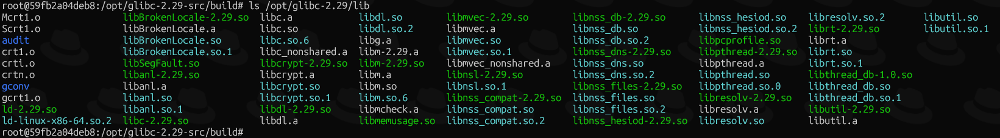

# 容器中 glibc 库异常故障排查

## 文档目录

- [容器中 glibc 库异常故障排查](#容器中-glibc-库异常故障排查)
  - [文档目录](#文档目录)
  - [问题描述](#问题描述)
  - [故障复现](#故障复现)
  - [编译 glibc-2.29 库文件](#编译-glibc-229-库文件)
    - [步骤1：重命名 glibc-2.29 目录名称](#步骤1重命名-glibc-229-目录名称)
    - [步骤2：打开另一个终端运行新的调试容器 glibc-debug](#步骤2打开另一个终端运行新的调试容器-glibc-debug)
    - [步骤3：打开另一个终端将 d0048312bd99 容器中的源码拷贝至调试容器中](#步骤3打开另一个终端将-d0048312bd99-容器中的源码拷贝至调试容器中)
    - [步骤4：重新回到步骤2的调试容器终端中](#步骤4重新回到步骤2的调试容器终端中)
    - [步骤5：备份 glibc-2.29 库文件](#步骤5备份-glibc-229-库文件)
  - [设置容器对 glibc-2.28 与 glibc-2.29 兼容性](#设置容器对-glibc-228-与-glibc-229-兼容性)
    - [步骤1：拷贝 glibc-2.29 库文件至 d0048312bd99 容器中](#步骤1拷贝-glibc-229-库文件至-d0048312bd99-容器中)
    - [步骤2：验证编译的新链接器是否可生效](#步骤2验证编译的新链接器是否可生效)
    - [🎉 步骤3：指定 glibc-2.29 库目录成功运行 R 程序](#-步骤3指定-glibc-229-库目录成功运行-r-程序)
    - [（可选）步骤4：设置 R 程序运行别名](#可选步骤4设置-r-程序运行别名)
  - [容器内运行 R 程序的方式](#容器内运行-r-程序的方式)
  - [总结与提示](#总结与提示)

## 问题描述

接客户反馈，现场用于数据分析的 pipeline 容器运行 R 程序报错，称无法找到 **共享对象文件**（**动态链接库文件**，以下简称 **库文件**）。

## 故障复现

容器内运行命令 `R --version` 返回报错，未找到 `GLIBC_2.29` 符号版本号（symbol version）。确认当前使用的 glibc 版本为 2.28，而容器内缺少 2.29 版本，因此需单独编译安装 glibc-2.29 库以解决此问题。

```bash
(base) root@d0048312bd99:/# R --version  #GLIBC_2.29 未找到
/opt/biosoft/anaconda3/lib/R/bin/exec/R: /lib/x86_64-linux-gnu/libm.so.6: version `GLIBC_2.29' not found (required by /opt/biosoft/anaconda3/lib/R/bin/exec/../../lib/../../libicuuc.so.68)
/opt/biosoft/anaconda3/lib/R/bin/exec/R: /lib/x86_64-linux-gnu/libm.so.6: version `GLIBC_2.29' not found (required by /opt/biosoft/anaconda3/lib/R/bin/exec/../../lib/../../libicui18n.so.68)

(base) root@d0048312bd99:/# ls /lib/x86_64-linux-gnu/ld-2.28.so  #（动态链接库）链接器版本
/lib/x86_64-linux-gnu/ld-2.28.so
```

编译安装 glibc-2.29 库之前，先确认 R 程序依赖的库文件是否都来源于 glibc-2.29 库，还是其他依赖库。发现 R 程序依赖当前容器中已安装的 Anaconda3 中的库文件，以及容器内原本的 glibc-2.28 库文件，因此容器内的旧版本库文件应保持不变，以免对其他容器系统组件造成影响。查看当前容器环境中 `LD_LIBRARY_PATH` 环境变量以确认 R 程序是否可被链接至库文件。结果显示，在 glibc-2.28 环境中可以加载对应的库文件，而 libicuuc.so.68 与 libicui18n.so.68 库文件需要 glibc-2.29 环境。因此，编译 glibc-2.29 库与 glibc-2.28 库共存。

```bash
(base) root@d0048312bd99:/# ldd /opt/biosoft/anaconda3/lib/R/bin/exec/R
/opt/biosoft/anaconda3/lib/R/bin/exec/R: /lib/x86_64-linux-gnu/libm.so.6: version `GLIBC_2.29' not found (required by /opt/biosoft/anaconda3/lib/R/bin/exec/../../lib/../../libicuuc.so.68)
/opt/biosoft/anaconda3/lib/R/bin/exec/R: /lib/x86_64-linux-gnu/libm.so.6: version `GLIBC_2.29' not found (required by /opt/biosoft/anaconda3/lib/R/bin/exec/../../lib/../../libicui18n.so.68)
        linux-vdso.so.1 (0x00007fff6098c000)
        libR.so => /opt/biosoft/anaconda3/lib/R/bin/exec/../../lib/libR.so (0x000079ba08400000)
        libc.so.6 => /lib/x86_64-linux-gnu/libc.so.6 (0x000079ba08240000)
        libblas.so.3 => /opt/biosoft/anaconda3/lib/R/bin/exec/../../lib/../../libblas.so.3 (0x000079ba05a00000)
        libm.so.6 => /lib/x86_64-linux-gnu/libm.so.6 (0x000079ba0587d000)
        libgomp.so.1 => /opt/biosoft/anaconda3/lib/R/bin/exec/../../lib/../../libgomp.so.1 (0x000079ba089c8000)
        libpthread.so.0 => /lib/x86_64-linux-gnu/libpthread.so.0 (0x000079ba089a5000)
        libreadline.so.8 => /opt/biosoft/anaconda3/lib/R/bin/exec/../../lib/../../libreadline.so.8 (0x000079ba08948000)
        libpcre2-8.so.0 => /opt/biosoft/anaconda3/lib/R/bin/exec/../../lib/../../libpcre2-8.so.0 (0x000079ba081a4000)
        liblzma.so.5 => /opt/biosoft/anaconda3/lib/R/bin/exec/../../lib/../../liblzma.so.5 (0x000079ba0891f000)
        libbz2.so.1.0 => /opt/biosoft/anaconda3/lib/R/bin/exec/../../lib/../../libbz2.so.1.0 (0x000079ba0890b000)
        libz.so.1 => /opt/biosoft/anaconda3/lib/R/bin/exec/../../lib/../../libz.so.1 (0x000079ba088f1000)
        librt.so.1 => /lib/x86_64-linux-gnu/librt.so.1 (0x000079ba088e5000)
        libdl.so.2 => /lib/x86_64-linux-gnu/libdl.so.2 (0x000079ba088e0000)
        libiconv.so.2 => /opt/biosoft/anaconda3/lib/R/bin/exec/../../lib/../../libiconv.so.2 (0x000079ba05796000)
        libicuuc.so.68 => /opt/biosoft/anaconda3/lib/R/bin/exec/../../lib/../../libicuuc.so.68 (0x000079ba055a9000)
        libicui18n.so.68 => /opt/biosoft/anaconda3/lib/R/bin/exec/../../lib/../../libicui18n.so.68 (0x000079ba05200000)
        /lib64/ld-linux-x86-64.so.2 (0x000079ba08a20000)
        libgfortran.so.5 => /opt/biosoft/anaconda3/lib/R/bin/exec/../../lib/../.././libgfortran.so.5 (0x000079ba05030000)
        libtinfow.so.6 => /opt/biosoft/anaconda3/lib/R/bin/exec/../../lib/../.././libtinfow.so.6 (0x000079ba08160000)
        libicudata.so.68 => /opt/biosoft/anaconda3/lib/R/bin/exec/../../lib/../../libicudata.so.68 (0x000079ba03400000)
        libstdc++.so.6 => /opt/biosoft/anaconda3/lib/R/bin/exec/../../lib/../../libstdc++.so.6 (0x000079ba0320b000)
        libgcc_s.so.1 => /opt/biosoft/anaconda3/lib/R/bin/exec/../../lib/../../libgcc_s.so.1 (0x000079ba088be000)
        libquadmath.so.0 => /opt/biosoft/anaconda3/lib/R/bin/exec/../../lib/../../././libquadmath.so.0 (0x000079ba08126000)

(base) root@d0048312bd99:/# echo $LD_LIBRARY_PATH  #查看 LD_LIBRARY_PATH 环境变量
/usr/local/cuda-11.1/lib64:"/opt/biosoft/root/lib"

(base) root@d0048312bd99:/# for i in $(ldd /opt/biosoft/anaconda3/lib/R/bin/exec/R | awk '{print $3}' | grep '^/'); do 
echo ">>> $i"; strings $i | grep ^GLIBC_2.29 | sort -u; done
>>> /opt/biosoft/anaconda3/lib/R/bin/exec/../../lib/libR.so
>>> /lib/x86_64-linux-gnu/libc.so.6
>>> /opt/biosoft/anaconda3/lib/R/bin/exec/../../lib/../../libblas.so.3
>>> /lib/x86_64-linux-gnu/libm.so.6
>>> /opt/biosoft/anaconda3/lib/R/bin/exec/../../lib/../../libgomp.so.1
>>> /lib/x86_64-linux-gnu/libpthread.so.0
>>> /opt/biosoft/anaconda3/lib/R/bin/exec/../../lib/../../libreadline.so.8
>>> /opt/biosoft/anaconda3/lib/R/bin/exec/../../lib/../../libpcre2-8.so.0
>>> /opt/biosoft/anaconda3/lib/R/bin/exec/../../lib/../../liblzma.so.5
>>> /opt/biosoft/anaconda3/lib/R/bin/exec/../../lib/../../libbz2.so.1.0
>>> /opt/biosoft/anaconda3/lib/R/bin/exec/../../lib/../../libz.so.1
>>> /lib/x86_64-linux-gnu/librt.so.1
>>> /lib/x86_64-linux-gnu/libdl.so.2
>>> /opt/biosoft/anaconda3/lib/R/bin/exec/../../lib/../../libiconv.so.2
>>> /opt/biosoft/anaconda3/lib/R/bin/exec/../../lib/../../libicuuc.so.68  #报错中的库文件
GLIBC_2.29
>>> /opt/biosoft/anaconda3/lib/R/bin/exec/../../lib/../../libicui18n.so.68  #报错中的库文件
GLIBC_2.29
>>> /opt/biosoft/anaconda3/lib/R/bin/exec/../../lib/../.././libgfortran.so.5
>>> /opt/biosoft/anaconda3/lib/R/bin/exec/../../lib/../.././libtinfow.so.6
>>> /opt/biosoft/anaconda3/lib/R/bin/exec/../../lib/../../libicudata.so.68
>>> /opt/biosoft/anaconda3/lib/R/bin/exec/../../lib/../../libstdc++.so.6
>>> /opt/biosoft/anaconda3/lib/R/bin/exec/../../lib/../../libgcc_s.so.1
>>> /opt/biosoft/anaconda3/lib/R/bin/exec/../../lib/../../././libquadmath.so.0
#查询 R 程序依赖的库文件是否依赖 glibc-2.29，而其他库文件均能在 2.29 版本以下被调用。
```

## 编译 glibc-2.29 库文件

为了避免原容器环境尽可能不产生额外的文件，不安装额外的软件对其造成影响，因此，单独使用原容器的镜像运行一个调试容器，在保证底层环境一致的状态下编译 glibc-2.29 库文件。glibc-2.29 源代码已存在于原容器的 `/opt/glibc-2.29` 目录。

### 步骤1：重命名 glibc-2.29 目录名称

```bash
(base) root@d0048312bd99:/# mv /opt/glibc-2.29 /opt/glibc-2.29-src
```

### 步骤2：打开另一个终端运行新的调试容器 glibc-debug

```bash
tac@TAP-Server:~/glibc-test$ docker run -it --rm --name glibc-debug bio-ngs:v1.7.2 /bin/bash
root@59fb2a04deb8:/# 
```

### 步骤3：打开另一个终端将 d0048312bd99 容器中的源码拷贝至调试容器中

```bash
tac@TAP-Server:~$ mkdir ~/glibc-test  #新建目录存储 glibc 源码与编译后的库文件
tac@TAP-Server:~$ cd ~/glibc-test
tac@TAP-Server:~/glibc-test$ docker cp d0048312bd99:/opt/glibc-2.29-src .  #将 d0048312bd99 容器中的源码拷贝至 TAC-Server 节点本地
tac@TAP-Server:~/glibc-test$ docker cp glibc-2.29-src glibc-debug:/opt/glibc-2.29-src  #将源码拷贝至调试容器中
```

### 步骤4：重新回到步骤2的调试容器终端中

```bash
root@59fb2a04deb8:/# add-apt-repository ppa:ubuntu-toolchain-r/test -y
root@59fb2a04deb8:/# apt-get update
root@59fb2a04deb8:/# apt-get install -y gcc-7 g++-7  #注意：容器自带的 gcc-5.x 无法编译成功，需升级至 gcc-7！
root@59fb2a04deb8:/# update-alternatives --install /usr/bin/gcc gcc /usr/bin/gcc-7 60 --slave /usr/bin/g++ g++ /usr/bin/g++-7  #设置默认的 gcc 与 g++ 命令指向新版本
root@59fb2a04deb8:/# gcc --version  #查看升级后的 gcc 版本
gcc (Ubuntu 7.5.0-3ubuntu1~16.04) 7.5.0
Copyright (C) 2017 Free Software Foundation, Inc.
This is free software; see the source for copying conditions.  There is NO
warranty; not even for MERCHANTABILITY or FITNESS FOR A PARTICULAR PURPOSE.

root@59fb2a04deb8:/# apt-get install -y gawk bison python3 make gperf  #安装编译依赖的软件包
root@59fb2a04deb8:/# cd /opt/glibc-2.29-src
root@59fb2a04deb8:/opt/glibc-2.29-src# cd build/
root@59fb2a04deb8:/opt/glibc-2.29-src/build# ../configure \
                                             --prefix=/opt/glibc-2.29 --disable-profile --enable-add-ons \
                                             libc_cv_forced_unwind=yes libc_cv_c_cleanup=yes libc_cv_ssp=no
#--prefix 选项：指定编译的库文件存储路径，此目录不存在将自动创建，与系统的库文件隔离。新编译的库文件默认生成在此目录中。
#--disable-profile 选项：关闭 profiling 变体（libc_p.so 等），减少编译时间、节省磁盘空间。
#三项 libc_cv_*=yes/no 会跳过旧编译器无法通过的运行时小测试。
root@59fb2a04deb8:/opt/glibc-2.29-src/build# make -j4  #大约持续 5min
root@59fb2a04deb8:/opt/glibc-2.29-src/build# make install  #大约持续 5min
```

> 💥 注意：如果执行 make install 编译错误，可在同级目录中执行 make clean 清除编译缓存，重新从 configure 程序开始编译。

编译完成后的库文件如下图所示：



### 步骤5：备份 glibc-2.29 库文件

```bash
tac@TAP-Server:~/glibc-test$ docker cp glibc-debug:/opt/glibc-2.29 .
tac@TAP-Server:~/glibc-test$ ls -lh
总计 8.0K
drwxr-xr-x 10 tac tac 4.0K 12月 27 08:56 glibc-2.29      #备份已编译完成的 glibc-2.29 库文件
drwxr-xr-x 70 tac tac 4.0K 12月 26 23:53 glibc-2.29-src  #glibc-2.29 源码文件
```

## 设置容器对 glibc-2.28 与 glibc-2.29 兼容性

### 步骤1：拷贝 glibc-2.29 库文件至 d0048312bd99 容器中

调试容器内编译完库文件后，即可将其拷贝至 d0048312bd99 容器中来兼容 glibc-2.29。

```bash
tac@TAP-Server:~/glibc-test$ docker cp glibc-2.29 d0048312bd99:/opt/glibc-2.29
```

### 步骤2：验证编译的新链接器是否可生效

```bash
(base) root@d0048312bd99:/opt/glibc-2.29# /opt/glibc-2.29/lib/ld-2.29.so  #链接器可正常工作
Usage: ld.so [OPTION]... EXECUTABLE-FILE [ARGS-FOR-PROGRAM...]
You have invoked `ld.so', the helper program for shared library executables.
This program usually lives in the file `/lib/ld.so', and special directives
in executable files using ELF shared libraries tell the system's program
loader to load the helper program from this file.  This helper program loads
the shared libraries needed by the program executable, prepares the program
to run, and runs it.  You may invoke this helper program directly from the
command line to load and run an ELF executable file; this is like executing
that file itself, but always uses this helper program from the file you
specified, instead of the helper program file specified in the executable
file you run.  This is mostly of use for maintainers to test new versions
of this helper program; chances are you did not intend to run this program.

  --list                list all dependencies and how they are resolved
  --verify              verify that given object really is a dynamically linked
                        object we can handle
  --inhibit-cache       Do not use /opt/glibc-2.29/etc/ld.so.cache
  --library-path PATH   use given PATH instead of content of the environment
                        variable LD_LIBRARY_PATH
  --inhibit-rpath LIST  ignore RUNPATH and RPATH information in object names
                        in LIST
  --audit LIST          use objects named in LIST as auditors
```

### 🎉 步骤3：指定 glibc-2.29 库目录成功运行 R 程序

```bash
(base) root@d0048312bd99:/# /opt/glibc-2.29/lib/ld-2.29.so \
                            --library-path /opt/glibc-2.29/lib:/usr/local/cuda-11.1/lib64:/opt/biosoft/root/lib \
                            /opt/biosoft/anaconda3/lib/R/bin/exec/R --version  #未指定 R 家目录执行报错
Fatal error: R home directory is not defined

(base) root@d0048312bd99:/# export R_HOME=/opt/biosoft/anaconda3/lib/R  #导出 R 家目录环境变量
(base) root@d0048312bd99:/# echo $LD_LIBRARY_PATH  #确认动态链接库目录
/usr/local/cuda-11.1/lib64:/opt/biosoft/root/lib
(base) root@d0048312bd99:/# /opt/glibc-2.29/lib/ld-2.29.so \
                            --library-path /opt/glibc-2.29/lib:/usr/local/cuda-11.1/lib64:/opt/biosoft/root/lib \
                            /opt/biosoft/anaconda3/lib/R/bin/exec/R --version  #核心方法
R version 4.0.5 (2021-03-31) -- "Shake and Throw"
Copyright (C) 2021 The R Foundation for Statistical Computing
Platform: x86_64-conda-linux-gnu (64-bit)

R is free software and comes with ABSOLUTELY NO WARRANTY.
You are welcome to redistribute it under the terms of the
GNU General Public License versions 2 or 3.
For more information about these matters see
https://www.gnu.org/licenses/.

#使用 glibc-2.29 的链接器 ld-2.29.so，指定所需的新编译的库目录（具有 GLIBC_2.29）执行 R 程序。
#--library-path 选项的优先级高于 LD_LIBRARY_PATH 环境变量指定的库文件位置，因此使用此选项指定 glibc-2.29 库与所需的其他库。为了防止 LD_LIBRARY_PATH 环境变量被污染，此处不再额外设置此环境变量。
```

> 注意：R_HOME 环境变量在退出容器终端时被回收，因此，每次访问容器终端时请再次执行 export R_HOME=/opt/biosoft/anaconda3/lib/R 命令。当然，也可将此命令添加至 $HOME/.bashrc 文件中持久化，此处不做赘述。

### （可选）步骤4：设置 R 程序运行别名

如果每次运行 R 程序都使用冗长的命令行前缀使用非常不便，可参考以下方式利用 `alias` 别名的方式简化 R 程序的运行。

> 注意：alias 命令同样只具有临时性，要持久化别名，将此命令添加至 $HOME/.bashrc 文件中，此处不做赘述。

```bash
(base) root@d0048312bd99:/# alias R='/opt/glibc-2.29/lib/ld-2.29.so --library-path /opt/glibc-2.29/lib:/usr/local/cuda-11.1/lib64:/opt/biosoft/root/lib /opt/biosoft/anaconda3/lib/R/bin/exec/R'
(base) root@d0048312bd99:/# R --version
R version 4.0.5 (2021-03-31) -- "Shake and Throw"
Copyright (C) 2021 The R Foundation for Statistical Computing
Platform: x86_64-conda-linux-gnu (64-bit)

R is free software and comes with ABSOLUTELY NO WARRANTY.
You are welcome to redistribute it under the terms of the
GNU General Public License versions 2 or 3.
For more information about these matters see
https://www.gnu.org/licenses/.

```

## 容器内运行 R 程序的方式

如果退出 d0048312bd99 容器终端，先前设置的环境变量也不复存在，可参考以下方式执行 R 程序：

```bash
tac@TAP-Server:~$ docker exec -it d0048312bd99 /bin/bash
(base) root@d0048312bd99:/# export R_HOME=/opt/biosoft/anaconda3/lib/R
(base) root@d0048312bd99:/# alias R='/opt/glibc-2.29/lib/ld-2.29.so --library-path /opt/glibc-2.29/lib:/usr/local/cuda-11.1/lib64:/opt/biosoft/root/lib /opt/biosoft/anaconda3/lib/R/bin/exec/R'
(base) root@d0048312bd99:/# R --version
R version 4.0.5 (2021-03-31) -- "Shake and Throw"
Copyright (C) 2021 The R Foundation for Statistical Computing
Platform: x86_64-conda-linux-gnu (64-bit)

R is free software and comes with ABSOLUTELY NO WARRANTY.
You are welcome to redistribute it under the terms of the
GNU General Public License versions 2 or 3.
For more information about these matters see
https://www.gnu.org/licenses/.

(base) root@d0048312bd99:/#
```

## 总结与提示

- 本次故障中 R 程序同时使用 glibc-2.28 与 glibc-2.29 库文件。
- 利用 ldd 命令查询 R 程序需要加载的 glibc-2.28 库文件。
- `LD_LIBRARY_PATH` 环境变量中指定的是支持 glibc-2.28 的库文件，缺少的 glibc-2.29 库文件不能再使用原容器中的 /lib/x86_64-linux-gnu/ld-2.28.so 链接器加载。
- 使用 /opt/glibc-2.29/lib/ld-2.29.so 链接器指定新编译的库与其他依赖库，这样可同时让 R 程序支持两个库版本。
- 为什么以下命令中 libicuuc.so.68 依然无法找到（not found）？原因在于，ldd 版本仍然是 glibc-2.28，无法支持 GLIBC_2.29，找不到是正常行为，但对于执行 R 程序无影响。

```bash
(base) root@d0048312bd99:/# ldd /opt/biosoft/anaconda3/lib/R/bin/exec/../../lib/../../libicui18n.so.68
/opt/biosoft/anaconda3/lib/R/bin/exec/../../lib/../../libicui18n.so.68: /lib/x86_64-linux-gnu/libm.so.6: version `GLIBC_2.29' not found (required by /opt/biosoft/anaconda3/lib/R/bin/exec/../../lib/../../libicui18n.so.68)
        linux-vdso.so.1 (0x00007ffebc89c000)
        libicuuc.so.68 => not found  #依然无法找到
        libstdc++.so.6 => /usr/lib/x86_64-linux-gnu/libstdc++.so.6 (0x0000772721a7e000)
        libm.so.6 => /lib/x86_64-linux-gnu/libm.so.6 (0x00007727218fb000)
        libgcc_s.so.1 => /lib/x86_64-linux-gnu/libgcc_s.so.1 (0x00007727216e5000)
        libc.so.6 => /lib/x86_64-linux-gnu/libc.so.6 (0x0000772721525000)
        /lib64/ld-linux-x86-64.so.2 (0x0000772722224000)
(base) root@d0048312bd99:/# ldd --version
ldd (Debian GLIBC 2.28-10+deb10u3) 2.28
Copyright (C) 2018 Free Software Foundation, Inc.
This is free software; see the source for copying conditions.  There is NO
warranty; not even for MERCHANTABILITY or FITNESS FOR A PARTICULAR PURPOSE.
Written by Roland McGrath and Ulrich Drepper.
```
