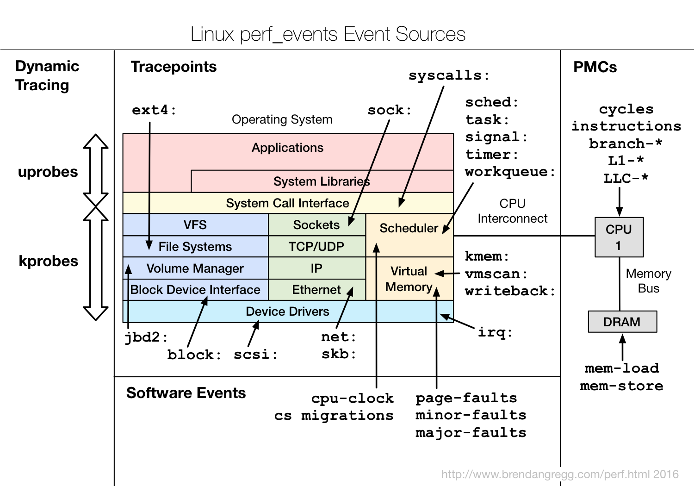
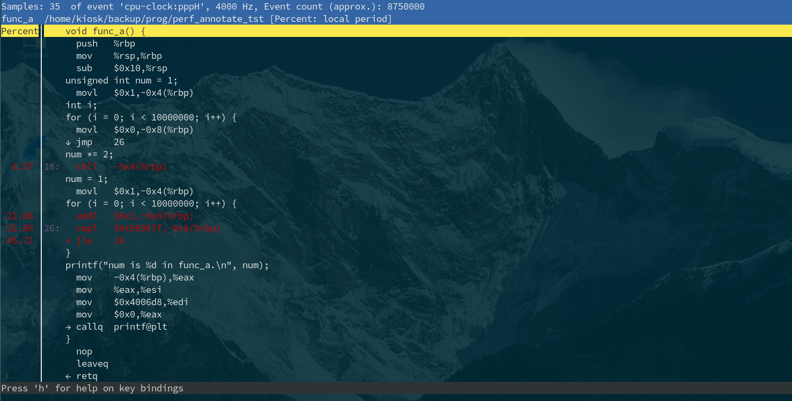

# 🧬 Linux 性能分析工具之 perf

## 文档目录

- perf 介绍与说明
- perf 的工作原理与事件类型
- perf 子命令概览
- perf stat 子命令
- perf top 子命令
- perf record 与 perf report 子命令
- perf annotate 子命令
- perf 示例与排查
- 火焰图生成与解读
- 参考链接

## perf 介绍与说明

- ✨ perf 是一个基于 `Linux 2.6+` 系统的分析工具，它抽象了在 Linux 中性能度量中 CPU 的硬件差异，提供一个简单的用户空间命令行界面，它基于内核的 **`perf_events`** 接口。
- Linux 内核可提供 `perf_event` 接口，它是一个用于在应用程序和内核之间传递性能数据的接口。
- 使用 PCL 和 perf_event 接口可以帮助应用程序更好地监视处理器性能，并提高系统的性能。

  > 说明：
  > 在编译内核时，需要开启 `CONFIG_PERF_EVENTS` 选项，才能使用 perf 工具！
  > 具体来说，应用程序可以使用以下步骤来使用 PCL 和 perf_event 接口：
  > 1. 使用 `pcl_register_event` 函数注册 PCL 事件
  > 2. 打开 `perf_event_device` 文件
  > 3. 使用 `perf_event_mmap` 函数将 `perf_event_device` 文件的内存映射到应用程序的内存中
  > 4. 使用 `perf_event_read` 函数从 `perf_event_device` 文件中读取事件数据
  > 5. 将事件数据转换为 perf_event 数据结构，并将它们传递给应用程序的 `perf_event_buffer`。
  > 以上 pcl_register_event 函数、perf_event_mmap 函数、perf_event_read 函数均为系统调用。

- perf 可定义一组常用性事件，并提供工具来列出事件或在报告中记录下来，供日后分析报告数据。
- 🚀 perf 框架参考 [Exploring USDT Probes on Linux](https://leezhenghui.github.io/linux/2019/03/05/exploring-usdt-on-linux.html)，此文档中对追踪系统（tracing system）具有较为整体的阐述。

  

- perf 工作大致可以分成三种模式：
  - counter 计数模式，记录 perf 执行过程中，统计的目标程序或者整个系统范围内，event 的出现次数。
  - sampling 采样模式，按照指定频率去采样 event，记录每次采样时，采样事件输出的信息（CPU、进程 ID、运行栈等）。这种方式由于每次都记录信息，所以额外的资源消耗比较大，需要权衡采样频率。同时产生的数据量也容易很大，可能需要大量的硬盘空间。
  - BPF 可以对对应的 event 执行用户自己设计的代码，也就是说记录的信息、执行的操作可以由用户定制。

## perf 的主要特性

- perf 主要特性包括以下几个方面：
  - 性能计数器：
    利用 Linux 内核的 perf_events 子系统，它能够监控和记录各种硬件事件，如 CPU cycles、指令执行、缓存未命中的次数、分支预测失败等，还可以监控软件事件，如系统调用、页错误等。
  - CPU 性能监测：
    监控各个进程或线程的 CPU 使用率，识别哪些函数或代码路径大量消耗 CPU。
  - 缓存行为分析：
    分析内存访问模式，包括 L1、L2、L3 缓存的命中和未命中的情况，有助于优化内存访问策略。
  - 🚀 函数级和指令级热点分析：
    perf 可以通过采样分析，精确到函数级别或甚至指令级别来发现 CPU 占用率高的热点代码段。
  - 系统调用和事件跟踪：
    记录和分析程序运行过程中的系统调用，以及相关的事件流。
  - 🚀 调用图生成：
    创建函数调用图，可视化地展示函数间的调用关系，方便理解程序执行流程及其开销。
  - 动态跟踪：
    支持动态跟踪技术，可以实时捕获和分析程序运行时的行为。
  - 跨进程和跨线程分析：
    不仅能分析单个进程的性能，还能处理多进程间的数据关联，提供全面的系统级视图。
  - 兼容性：
    由于其**直接集成在内核**中，perf 具备良好的硬件兼容性，能够充分利用不同架构 CPU 的性能监控单元（PMU）。

## perf 的工作原理与事件类型

- perf 工作原理的核心在于对 Linux 内核性能事件的支持和利用。
- perf 工具支持一系列的可测量事件，该工具和底层内核接口可以测量来自不同来源的事件。
- 以下是来自性能优化大神 [Brendan](https://www.brendangregg.com/perf.html) 对于 perf 事件来源的概括：
  
  

- perf 中的事件种类：
  - Hardware Events:
    perf 能够利用 CPU 内部的 Performance Monitoring Units (`PMUs`)。PMUs 是一组硬件寄存器，能够追踪和记录特定的微架构事件，称为 Performance Monitoring Counters (PMCs)，如 CPU 周期（cpu-cycles）、指令执行次数、失效的指令（instructions retired）、缓存未命中（cache misses）、分支预测失败等。通过编程这些寄存器，perf 可以设置特定事件的阈值，在达到一定次数后触发中断，收集此时的上下文信息，如 CPU 寄存器状态、PC 指针（指向当前正在执行的指令地址）、进程 id、线程 id 等。这些事件被称为 **PMU 硬件事件** 或简称为 **硬件事件**，它们因处理器类型和型号而异。
    > 💥 注意：PMU 硬件事件在虚拟机内不可用，因此，perf 不能在虚拟机中用于硬件性能追踪，但是可直接安装运行于裸金属主机上。
  - Software Events:
    对于软件级别的事件，perf 利用内核中的计数器和 tracepoints。内核计数器可以追踪系统级事件，如上下文切换、页错误、任务调度等。tracepoints 是内核中预定义的**静态探针点**，允许在特定位置插入额外的追踪代码，以便在关键内核操作发生时收集信息。这种是纯粹的内核计数，此类事件被称为 **软事件**。
  > Linux 性能计数器（Performance Counters，`PCL`）是一种基于内核（`kernel-based`）的子系统，提供用于收集和分析性能数据的框架，它可用于监视处理器的性能。
  - Kernel Tracepoint Events: 内核态的 tracepoint，在 `2.6.3x` 和更新版本的内核才提供这些功能。
  - User Statically-Defined Tracing (USDT): 用户态的 tracepoint
  - Dynamic Tracing: 动态设置的 event，如使用内核的 `kprobe`，可以在大部分函数动态增加 event。
  - Timed Profiling: 定时 event
  > 由 kernel 提供的 traceing event 列表位于 `/sys/kernel/debug/tracing/available_events` 中

- perf 中的事件修饰符：
  - u：仅统计用户空间程序触发的性能事件
  - k：仅统计内核触发的性能事件
  - h：仅统计 Hypervisor 触发的性能事件
  - G：在 KVM 虚拟机中，仅统计 Guest 系统触发的性能事件。
  - H：仅统计 Host 系统触发的性能事件
  - p：精度级别

> 以上可通过 man perf-list 命令查询  

## perf 子命令概览

- perf 子命令如下所示：

  

  ```bash
  $ perf --help
  ...
  annotate        读取 perf.data（由 perf record 生成）并结合源代码展示详细的性能分析结果，包括 CPU 执行热点、函数调用栈等信息。
  archive         使用 perf.data 文件中找到的带构建标识符的对象文件创建归档文件，便于后续对这些对象文件进行调试或者分析
  bench           通用基准测试套件框架，允许用户定义和运行多种基准测试场景，用于评估系统在不同条件下的性能表现。
  buildid-cache   管理 perf 用来关联二进制文件与其符号表信息的构建 ID 缓存，可以添加、删除或查看缓存内容。
  buildid-list    列出 perf.data 文件中的构建标识符
  c2c             共享数据 C2C/HITM 分析器：针对共享数据缓存一致性（Cache-to-Cache）和高速缓存命中（Hit in Translation）进行分析的工具，帮助诊断多核心间的缓存交互问题。
  config          读取和设置 perf 配置文件中的变量，用于个性化 perf 的行为或指定默认参数。
  daemon          在后台运行记录会话，适用于长期监控系统的性能情况。
  data            提供一系列与 perf.data 文件相关联的操作，如检查文件内容、转换格式等。
  diff            比较两个或多个 perf.data 文件，分析并展示它们之间的性能差异，常用于对比不同条件下系统的性能变化。
  evlist          列出 perf.data 文件中的事件名称，这些事件可能包括硬件性能计数器事件、软件事件、tracepoint 事件等。
  ftrace          内核 ftrace 功能的简单包装器，允许实时追踪和分析内核函数调用路径。
  inject          过滤器，用于向事件流中添加附加信息，增强事件的数据量和丰富度，便于更加深入地分析性能问题。
  iostat          显示 I/O 性能指标，如块设备读写速率、I/O 操作延时等。
  kallsyms        在运行中的内核中搜索符号
  kmem            用于跟踪/测量内核内存属性的工具，如分配、释放、碎片率等。
  kvm             用于跟踪/测量 KVM 虚拟机操作系统性能的工具
  list            列出所有符号事件类型
  lock            分析系统中锁的获取和释放行为，包括锁竞争、等待时间等，有助于发现潜在的并发瓶颈。
  mem             对内存访问模式进行分析，包括页错误、缓存未命中的次数、内存带宽使用等。
  record          执行命令并将其性能概要记录到 perf.data 中
  report          读取 perf.data（由 perf record 创建）并显示概要
  sched           用于跟踪/测量调度器属性（延迟）的工具，从而优化进程调度策略。
  script          读取 perf.data（由 perf record 创建）并显示跟踪输出
  stat            执行命令并收集性能计数器统计信息
  test            运行内置的一系列 sanity 测试，确保 perf 工具自身正确性和稳定性。
  timechart       工具用于可视化工作负载期间的系统整体行为
  top             系统性能分析工具，类似于 Linux 的 top 命令，但专注于性能分析，显示正在运行进程的实时性能统计数据。
  version         显示 perf 二进制文件的版本信息
  probe           定义新的动态跟踪点，使得 perf 能够追踪和记录自定义的内核函数或模块行为。
  trace           类似 strace 的工具，用于跟踪系统调用和信号。
  ```

- 在使用 perf 命令前必须了解能监控的系统及其硬件的性能指标，可使用 `perf list` 命令列举硬件事件、软件事件与追踪点等。

## perf stat 子命令

- 功能：
  - 分析系统/进程的整体性能概况
  - 虽然 perf top 也可以指定 pid，但必须先启动程序才能查看信息，而 perf stat 能完整统计程序整个生命周期的信息。
- 语法：

  ```bash
  $ perf stat [-e <EVENT> | --event=EVENT] [-a] <command>
  $ perf stat [-e <EVENT> | --event=EVENT] [-a] - <command> [<options>]
  $ perf stat [-e <EVENT> | --event=EVENT] [-a] record [-o file] - <command> [<options>]
  $ perf stat report [-i file]
    ```
  
- 命令示例：

  ```bash
  $ sudo perf stat --help
    -a, --all-cpus    采集所有 CPU 的信息
    -A, --no-aggr     不要在 system-wide (-a) 模式下汇集所有 CPU 的计数信息
    -B, --big-num     保留三位小数
    -C, --cpu <cpu>   指定某个 CPU
    -D, --delay <n>   在测试程序开始后，在测量前等等 n ms。
    -d, --detailed    打印更详细的统计数据，最多可以指定 3 次。
         -d:          detailed events, L1 and LLC data cache
            -d -d:     more detailed events, dTLB and iTLB events
         -d -d -d:     very detailed events, adding prefetch events
     
    -e, --event <event>   事件选择，可参考 perf list。
    -G, --cgroup <name>   仅在 name 为 cgroup 时有效。
    -g, --group           将计数器放到一个计数组中   
    -I, --interval-print <n>  每 n 毫秒打印计数增量（最小值：10ms）。在某些情况下，开销可能很高，例如小于 100 毫秒的间隔。
    -i, --no-inherit          禁止子任务继承父任务的性能计数器
    -M, --metrics <metric/metric group list>  监视指定的 metrics 或 metric groups，以逗号分隔。
    -n, --null            仅输出目标程序的执行时间，而不开启任何性能计数器。
    -o, --output <file>   输出文件的名字
    -p, --pid <pid>       指定待分析的进程 id
    -r, --repeat <n>      重复执行 n 次目标程序，并给出性能指标在 n 次执行中的变化范围。
    -S, --sync            在开始前调用 sync()
    -t, --tid <tid>       指定待分析的线程 id
    -T, --transaction     如果支持，打印事务执行的统计数据。
    -v, --verbose         显示详细信息
    -x, --field-separator <separator>   使用 CSV 样式的输出打印计数，以便直接导入表格。列由 SEP 中指定的字符串分隔。

  $ sudo perf stat
    ^C  # Ctrl+C 键盘中断
     Performance counter stats for 'system wide':
  
           99,877.41 msec cpu-clock                 #    8.000 CPUs utilized          
              49,467      context-switches          #    0.495 K/sec                  
               2,271      cpu-migrations            #    0.023 K/sec                  
                  32      page-faults               #    0.000 K/sec                  
       8,714,198,418      cycles                    #    0.087 GHz                      (50.02%)
                   0      stalled-cycles-frontend                                       (49.98%)
                   0      stalled-cycles-backend    #    0.00% backend cycles idle      (50.03%)
                   0      instructions              #    0.00  insn per cycle           (49.98%)
                   0      branches                  #    0.000 K/sec                    (50.02%)
                   0      branch-misses             #    0.00% of all branches          (49.97%)
    
        12.485261956 seconds time elapsed 
  # 查看系统全局（system wide）性能事件
  # 若没有指定特定事件，那么 perf 将收集常见性能事件。

  $ sudo perf stat \
    -e cpu-cycles,cycles,cpu-clock,task-clock \
    -e cpu-migrations,instructions,context-switches \
    -e L1-dcache-loads,L1-dcache-load-misses \
    -e L1-icache-loads,L1-icache-load-misses \
    -e branch-misses,branch-load-misses,branch-loads \
    -e cache-misses,cache-references \
    -e dTLB-load-misses,dTLB-loads \
    -e alignment-faults,page-faults \
    -e major-faults,minor-faults \
    -e emulation-faults
    ^C
  # 实时监控收集指定的事件
    
  ### 以下数据来源于网络（非上述命令输出），仅做示例。###
       672,865,652      branch-misses                                                 (30.77%)
    42,350,535,495      cache-misses              #   15.496 % of all cache refs      (30.77%)
   273,295,562,408      cache-references          #  166.215 M/sec                    (30.77%)
  3,778,399,302,053     cpu-cycles                #    2.298 GHz                      (30.77%)
   829,980,435,349      instructions              #    0.22  insn per cycle           (30.77%)
                 0      alignment-faults          #    0.000 K/sec                  
         1,756,245      context-switches          #    0.001 M/sec                  
      1,644,230.53 msec cpu-clock                 #    4.000 CPUs utilized          
               436      cpu-migrations            #    0.000 K/sec                  
                 0      dummy                     #    0.000 K/sec                  
                 0      emulation-faults          #    0.000 K/sec                  
               941      major-faults              #    0.001 K/sec                  
             2,320      minor-faults              #    0.001 K/sec                  
             4,081      page-faults               #    0.002 K/sec                  
      1,644,230.50 msec task-clock                #    4.000 CPUs utilized          
    42,328,918,389      L1-dcache-load-misses     #   15.50% of all L1-dcache hits    (30.77%)
   273,031,826,149      L1-dcache-loads           #  166.054 M/sec                    (30.77%)
  3,778,361,474,614     L1-dcache-stores          # 2297.951 M/sec                    (30.77%)
     5,328,248,923      L1-icache-load-misses                                         (30.77%)
       673,894,585      branch-load-misses        #    0.410 M/sec                    (30.77%)
    40,049,919,326      branch-loads              #   24.358 M/sec                    (30.77%)
     1,428,531,103      dTLB-load-misses          #    0.59% of all dTLB cache hits   (30.77%)
   244,177,528,248      dTLB-loads                #  148.506 M/sec                    (30.77%)
    
   411.058928454 seconds time elapsed
  ```

  对于上述命令中部分选项的说明，如下所示：

  

  > 🔥 注意：以下所示的事件可能在不同的平台上会返回 `<not supported>`

  - cpu-cycles：只计算程序在 CPU 上执行的 CPU 周期数，即除去中断、异常等其他周期的 CPU 周期数。
  - cycles：程序执行期间的总 CPU 周期数，包括指令周期、浮点周期、访存周期、中断周期、异常周期等等。
  - cpu-clock：CPU 消耗的时间
  - task-clock (msec): CPU 处理 task 所消耗的时间，表示目标任务真正占用 CPU 的时间，单位 ms。`CPUs utilized` 表示 CPU 使用率，该值越高代表程序是 CPU bound（计算密集型）而非 IO bound（I/O密集型），除去等待 I/O 与其他阻塞操作的时间。
  - cpu-migrations：进程运行过程中从一个 CPU 迁移到另一个 CPU 的次数
  - `instructions`：执行的指令条数。insns per cycle：即 `IPC`，每个 CPU 周期执行的指令条数，IPC 比上面的 CPU 使用率更能说明 CPU 的使用情况（很多指令需要多个处理周期才能执行完毕），IPC 越大越好，说明程序充分利用了处理器的特征。
  - alignment-faults：统计内存对齐错误发生的次数，当访问的非对齐的内存地址时，内核会进行处理，已保存不会发生问题，但会降低性能。
  - branches：这段时间内发生分支预测的次数。现代的 CPU 都有分支预测方面的优化。
  - branch-instructions：分支预测成功次数
  - branch-misses：这段时间内分支预测失败的次数，该值越小越好。
  - cache-references：cache 命中次数
  - cache-misses：cache 失效次数
  - `context-switches`：上下文切换次数，前半部分是切换次数，后面是平均每秒发生次数（M 是 10^6 次方）。
  - L1-dcache-loads：L1 数据缓存读取次数
  - L1-dcache-load-missed：L1 数据缓存读取失败次数
  - LLC-loads：末级缓存读取次数
  - LLC-load-misses：末级缓存读取失败次数
    > LLC 表示 Last-Level Cache（最后一级缓存）是 CPU Cache 层级结构中的最后一级缓存，也称为智能缓存或共享缓存，有时也称为 L3 缓存。
  - major-faults：页错误，内存页已经被换出到硬盘上，需要将页面换入。
  - minor-faults：页错误，内存页在物理内存中，只是没有和逻辑页进行映射。
  - 💥 `page-faults`：缺页异常的次数。当程序请求的页面尚未建立、请求的页面不在物理内存中，或请求的页面虽然在内存中，但物理地址和虚拟地址的映射关系尚未建立时，都会触发一次缺页异常。另外 `TLB` 不命中，页面访问权限不匹配等情况也会触发缺页异常。
  - stalled-cycles-frontend 和 stalled-cycles-backend：CPU 停滞统计
  - XXX seconds time elapsed：程序持续时间

  ```bash
  $ sudo perf stat -B -e cpu-clock:[u|k] dd if=/dev/zero of=/dev/null count=1000000
  # 统计内核空间中（k 修饰符） dd 命令对 CPU 消耗的时间，并保留 3 位小数。默认情况下 perf 统计内核空间与用户空间的性能事件。

  $ sudo perf stat -n /path/to/programme > /dev/null
  # 只显示程序的运行时间，不显示性能计数器数据。

  $ sudo perf stat -a sleep 10s
  # 来自所有 CPU 的系统全局范围运行 sleep 命令的性能事件

  $ sudo perf stat \
    -e cycles,instructions,cache-references,cache-misses,bus-cycles \
    -a sleep 10s
  # -a 选项指定来自所有 CPU 的系统全局范围，-e 选项指定事件，在 10s 后完成性能事件的收集。
  ```

## perf top 子命令

- 功能：实时显示系统/进程的性能统计信息
- 命令示例：
  
  ```bash
  $ sudo perf top --help
    -e <event>, --event=<event>       指定性能事件
    -a, --all-cpus                    显示在所有 CPU 上的性能统计信息
    -d <seconds>, --delay=<seconds>   界面的刷新周期，默认为 2s。
    -C <cpu-list>, --cpu=<cpu>        显示在指定 CPU 上的性能统计信息
    -p <pid>, --pid=<pid>             指定进程 pid 中的性能事件
    -t <tid>, --tid=<tid>             指定线程 tid 中的性能事件
    -K, --hide_kernel_symbols         隐藏内核符号
    -k <path>, --vmlinux=<path>       vmlinux 路径
    -U, --hide_kernel_symbols         隐藏用户符号
    -s, --sort                        指定以下键排序：pid, comm, dso, symbol, parent, srcline,
                                      weight, local_weight, abort, in_tx, transaction, overhead,
                                      sample, period.
    -g                                启用函数的调用关系图
    ‐‐call‐graph <output_type,min_percent,call_order>
  ```

  ```bash
  $ sudo perf top -g
  # 实时全局性能计数器概览
  
  $ sudo perf top -p <pid>
  # 指定进程的性能事件概览，包括程序自身的函数、库调用、系统调用或内核函数调用等，
  # 并且可选中其中的函数调用定位汇编指令在 CPU 中的资源消耗。
  ```

  如下图所示，使用 `perf top -p <pid>` 显示 goSimpleWeb 程序在 ab 压力测试时的性能事件：

  
  
  ```bash
  $ sudo perf top -e kmem:kmem_cache_alloc
  # 实时查看内核 kmem_cache_alloc 内存缓存分配函数（用于分配小块内存）的性能事件（如下图所示）
  ```

  

  如上图所示，从第三行开始每行代表一个事件信息。`Overhead` 代表每个事件的开销百分比，表示该事件在总采样中所占的比重；`call_site` 代表一个内存地址，表示调用 kmem_cache_alloc 的指令位置；`ptr` 代表分配的内存块的起始地址；`bytes_req` 代表请求分配的内存字节数；`bytes_alloc` 代表实际分配的内存字节数；`gfp_flags` 代表内存分配标志，指示内存分配属性，其中 `GFP_KERNEL` 代表内存分配用于内存空间，`GFP_KERNEL | __GFP_ZERO` 代表分配的内存将被初始化为零。从上图可知，存在多个调用点（call_site）正在分配不同大小的内存块，即 kmem_cache_alloc 函数被多次调用，并且显示不同分配的开销。
  
  ```bash
  $ sudo perf top -e cycles:k
  # 实时查看内核与模块中 CPU 周期的性能事件
  ```
  
  

  第一列：符号引发的性能事件的比例，默认指占用的 CPU 周期比例。
  第二列：符号所在的 DSO (Dynamic Shared Object)，可以是应用程序、内核、动态链接库、模块。
  第三列：DSO 的类型。[.] 表示此符号属于用户态的 ELF 文件，包括可执行文件与动态链接库。[k] 表示此符号属于内核或模块。
  第四列：符号名。有些符号不能解析为函数名，只能用地址表示。

## perf record 与 perf report 子命令

- perf record 功能：记录一段时间内系统/进程的性能事件写入默认的 perf.data 二进制文件中
- perf report 功能：读取 perf record 生成的二进制文件，显示并分析性能数据。
- 命令示例：
  
  ```bash
  $ sudo perf record -g /path/to/programme
  # 记录执行程序时的性能事件（启用调用栈）
  $ sudo perf record -e syscalls:sys_enter /path/to/programme
  # 记录执行程序时的系统调用，可显示频繁调用的系统调用。

  $ sudo perf record -o cs-syswide.data -e context-switches -a sleep 10s
  # 系统全局范围内记录 context-switches 事件，记录时间为 10s，并将结果写入指定文件。
  $ sudo perf report -i cs-syswide.data [--stdio]
  # 交互模式查看记录的事件
  # --stdio 选项：标准输出中查看事件
  ```

## perf annotate 子命令

- 功能：
  - perf annotate 提供指令级别的 record 文件定位。使用调试信息 `-g` 编译的文件能够显示汇编和本身源码信息。
  - 但要注意， annotate 命令并不能够解析内核 image 中的符号，必须要传递未压缩的内核 image 给 annotate 才能正常的解析内核符号。
- 命令示例：

  ```bash
  $ sudo perf annotate --help
    -i, --input=<file>          输入文件名
    -d, --dsos=<dso[,dso...]>   只考虑这些 DSO 中的符号
    -f, --force                 强制读取
    -D, --dump-raw-trace        转储 ASCII 中的原始跟踪
    -k, --vmlinux=<file>        vmlinux路径名
    -m, --modules               加载模块符号表，仅与 -k 和一起使用。
    -l, --print-line            打印匹配到的源代码行（可能较慢）
    -P, --full-paths            显示完整路径名
    -M, --disassembler-style=   指定反汇编程序样式
    --stdio                     使用 stdio 接口
    --gtk                       使用 GTK 接口
  ```

- 程序示例：

  ```c
  /* perf_annotate_tst.c */
  #include <stdio.h>
  #include <time.h>

  void func_a(void);
  void func_b(void);

  int main(void) {
      func_a();
       func_b();

      return 0;
  }

  void func_a() {
      unsigned int num = 1;
      int i;
      for (i = 0; i < 10000000; i++) {  /* 该循环对 num 变量最终的值无实际影响 */
          num *= 2;
          num = 1;
      }
      printf("num is %d in func_a.\n", num);
  }

  void func_b() {
      unsigned int num = 1;
      int i;
      for (i = 0; i < 10000000; i++) {  /* 该循环对 num 变量最终的值无实际影响 */
          num <<= 1;
          num = 1;
      }
      printf("num is %d in func_b.\n", num);
  }
  ```

  编译程序：

  ```bash
  $ gcc -g -O0 ./perf_annotate_tst.c -o ./perf_annotate_tst
  # -g 选项表示启用 debug 信息，可使用 GDB 调试；-O0 表示不执行代码优化
  ```

  使用 perf 收集与观测性能事件，以及查看源代码中的 Overhead 开销热点：

  ```bash
  $ sudo perf record -a -g ./perf_annotate_tst
  # 对所有 CPU 上启用程序性能事件收集，启用调用栈。
  $ sudo perf report -i ./perf.data [--stdio]
  # 若 perf record 生成 perf.data 时使用 -g 选项，那么该命令将返回各个调用栈信息，若不使用 -g 选项，将不显示调用栈信息。
  $ sudo perf annotate -k /usr/lib/modules/4.18.0-305.el8.x86_64/vmlinuz -i ./perf.data -s func_a
  # 查看程序中热点代码，以源代码与汇编代码方式显示。
  # -k 选项指定 annotate 使用的 kernel 镜像；-i 指定解析的 perf 性能数据文件；-s 指定解析的程序符号（函数名）
  ```

  

  

## perf 示例与排查

- 程序示例：

  ```c
  /* perf_tst_example.c */
  #include <stdio.h>

  void longa(void) {
      int i, j;
      for(i = 0; i < 10000; i++) {   /* 执行 10000 次循环，变量 j 的值为 9999 */
          j = i;
      }
  }

  void foo1(void) {
      int i;
      for(i = 0; i < 10; i++) {
          longa();  /* 总共执行循环 10*10000 次 */
      }
  }

  void foo2(void) {
      int i;
      for(i = 0; i <100; i++) {
          longa();  /* 总共执行循环 100*10000 次 */
      }
  }

  int main(void) {
      while(1) {  /* 始终调用循环 */
          foo1();
          foo2();
      }
  }
  ```

  ```bash
  $ gcc -g -O0 perf_tst_example.c -o perf_tst_example
  # 编译程序
  ```

- 程序运行全局总览：

  

  perf stat 命令获取程序的全局性能事件，结果显示 task-clock 大量占用 CPU，因此可收集程序运行期间涉及的 cpu-clock 事件。

- 性能事件导航定位：
  使用 perf record 命令运行程序后将生成默认的 perf.data 二进制性能事件文件，可通过 perf report 分析性能事件并导航至引发该事件的具体热点代码。

  

  

  如上图所示，longa 函数占用高达 99.26% 的 Overhead。定位到该函数后选择 "Annotate longa" 分析函数的调用关系及对应汇编代码的性能开销。

  

## 火焰图生成与解读

## 参考链接

- [Perf Wiki main page](https://perf.wiki.kernel.org/index.php/Main_Page)
- [Linux kernel perf architecture](https://terenceli.github.io/%E6%8A%80%E6%9C%AF/2020/08/29/perf-arch)
- 💪 [Exploring USDT Probes on Linux](https://leezhenghui.github.io/linux/2019/03/05/exploring-usdt-on-linux.html)
- 💪 [kernel doc](https://www.kernel.org/doc/html/)
- 💪 [kernel doc: sysctl](https://www.kernel.org/doc/Documentation/sysctl/kernel.txt)
- [Linux man pages online](https://man7.org/linux/man-pages/index.html)
