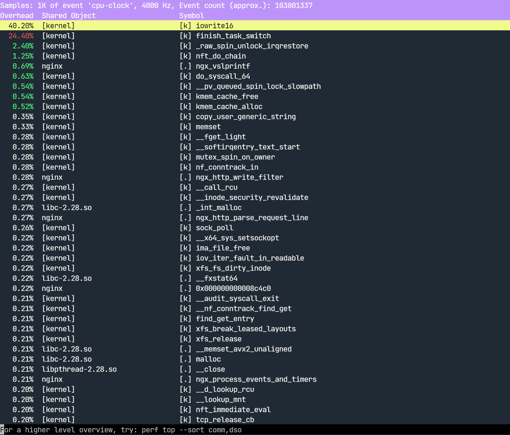
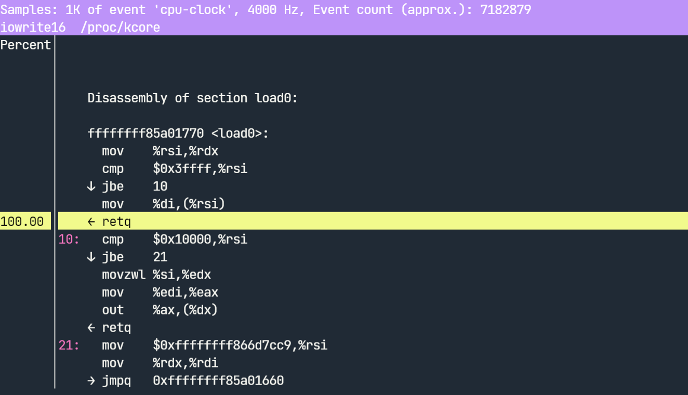

# 🔥 Linux 性能计数器 Perf

## 文档目录

- Perf 介绍与说明

## Perf 介绍与说明

- Linux 性能计数器（Performance Counters，`PCL`）是一种基于内核（`kernel-based`）的子系统，提供用于收集和分析性能数据的框架，它可用于监视处理器的性能。
- ✨ perf 是一个基于 `Linux 2.6+` 系统的分析工具，它抽象了在 Linux 中性能度量中 CPU 的硬件差异，提供一个简单的用户空间命令行界面，它基于内核的 **`perf_events`** 接口。
- Linux 内核可提供 `perf_event` 接口，它是一个用于在应用程序和内核之间传递性能数据的接口。
- 使用 PCL 和 perf_event 接口可以帮助应用程序更好地监视处理器性能，并提高系统的性能。

  > 具体来说，应用程序可以使用以下步骤来使用 PCL 和 perf_event 接口：  
  > 1. 使用 `pcl_register_event` 函数注册 PCL 事件
  > 2. 打开 `perf_event_device` 文件
  > 3. 使用 `perf_event_mmap` 函数将 `perf_event_device` 文件的内存映射到应用程序的内存中
  > 4. 使用 `perf_event_read` 函数从 `perf_event_device` 文件中读取事件数据
  > 5. 将事件数据转换为 perf_event 数据结构，并将它们传递给应用程序的 `perf_event_buffer`。
  > 以上 pcl_register_event 函数、perf_event_mmap 函数、perf_event_read 函数均为系统调用。

- perf 可定义一组常用性事件，并提供工具来列出事件或在报告中记录下来，供日后分析报告数据。
- 以下是来自性能优化大神 [Brendan](https://www.brendangregg.com/perf.html) 对于 perf 工具在各个维度的使用概括：
  
  

- 🚀 perf 框架参考 [Exploring USDT Probes on Linux](https://leezhenghui.github.io/linux/2019/03/05/exploring-usdt-on-linux.html)，此文档中对追踪系统（tracing system）具有较为整体的阐述。

  

- 关于 perf 中的事件（events）：
  
  - perf 工具支持一系列的可测量事件，该工具和底层内核接口可以测量来自不同来源的事件。
  
  - 1️⃣ 一些事件是纯粹的内核计数，在这种情况下的事件被称为 **软事件**（software events），如 context-switches、minor-faults 等。
  
  - 2️⃣ 另一个事件来源是处理器本身和它的性能监视单元（Performance Monitoring Unit，`PMU`）。它提供了一个事件列表来测量微体系结构的事件，如周期数（the number of cycles）、失效的指令（instructions retired）、L1 缓存未命中（L1 cache misses）等等。这些事件被称为 **PMU 硬件事件** 或简称为 **硬件事件**（hardware events），它们因处理器类型和型号而异。
  
  > 💥 注意：PMU 硬件事件在虚拟机内不可用，因此，perf 不能在虚拟机中用于硬件性能追踪，但是可直接安装运行于裸金属主机上。
  
  - 3️⃣ `perf_events` 接口还提供了一组通用的的硬件事件名称。在每个处理器，这些事件被映射到一个 CPU 的真实事件，若真实事件不存在则事件不能使用。可能会让人混淆，这些事件也被称为 **硬件事件** 或 **硬件缓存事件**。
  
  - 4️⃣ 最后，还有由内核 `ftrace` 基础实现的 **tracepoint 事件**。但只有 `2.6.3x` 和更新版本的内核才提供这些功能。

## Perf 子命令说明

- 常用的 perf 子命令包括 list、`stat`、`top`、record、report、archive 等。

## Perf top 子命令

- perf top 子命令：
  
  ```bash
  $ sudo perf top -g
  # 查看实时的全局性能计数器概览
  
  $ sudo perf top -p <pid>
  # 查看指定进程的性能计数器概览，包括程序自身的函数、库调用、系统调用或内核函数调用等，
  # 并且可选中其中的函数调用定位汇编指令在 CPU 中的资源消耗。
  ```
  
  以下示例使用 Nginx 作为 Web 服务端，如下 ab 命令压测显示的 nginx worker 进程在 perf 中的各函数调用与 `iowrite16` 内核函数的汇编指令：
  
  ```bash
  $ ab -n 10000 -c 500 http://servera.lab.example.com/index.html
  # -n 选项指定总请求次数，-c 选项指定请求的并发数。
  ```
  
  
  
  

- perf stat 子命令：
  
  - 功能：

    用于在运行指令时，监测并分析其统计结果。虽然 perf top 也可以指定 pid，但必须先启动程序才能查看信息，而 perf stat 能完整统计程序整个生命周期的信息。
  
  - 语法：

    ```bash
    $ perf stat [-e <EVENT> | --event=EVENT] [-a] <command>
    $ perf stat [-e <EVENT> | --event=EVENT] [-a] - <command> [<options>]
    $ perf stat [-e <EVENT> | --event=EVENT] [-a] record [-o file] - <command> [<options>]
    $ perf stat report [-i file]
    ```
  
  - 示例：

    ```bash
    $ sudo perf stat
      ^C  # Ctrl+C 键盘中断
       Performance counter stats for 'system wide':
    
             99,877.41 msec cpu-clock                 #    8.000 CPUs utilized          
                49,467      context-switches          #    0.495 K/sec                  
                 2,271      cpu-migrations            #    0.023 K/sec                  
                    32      page-faults               #    0.000 K/sec                  
         8,714,198,418      cycles                    #    0.087 GHz                      (50.02%)
                     0      stalled-cycles-frontend                                       (49.98%)
                     0      stalled-cycles-backend    #    0.00% backend cycles idle      (50.03%)
                     0      instructions              #    0.00  insn per cycle           (49.98%)
                     0      branches                  #    0.000 K/sec                    (50.02%)
                     0      branch-misses             #    0.00% of all branches          (49.97%)
    
          12.485261956 seconds time elapsed 
    # 查看系统全局（system wide）性能事件
    ```

    ```bash
    $ sudo perf stat -a sleep 10s
    # 系统全局范围中
    $ sudo perf stat \
      -e cycles,instructions,cache-references,cache-misses,bus-cycles \
      -a sleep 10s
    # -a 选项指定系统全局范围，-e 选项指定事件，在 10s 后完成系统所有 CPU 事件的收集。
    
    $ sudo perf stat \
      -e cpu-cycles,cycles,cpu-clock,task-clock \
      -e cpu-migrations,instructions,context-switches \
      -e L1-dcache-loads,L1-dcache-load-misses \
      -e L1-icache-loads,L1-icache-load-misses \
      -e branch-misses,branch-load-misses,branch-loads \
      -e cache-misses,cache-references \
      -e dTLB-load-misses,dTLB-loads \
      -e alignment-faults,page-faults \
      -e major-faults,minor-faults \
      -e emulation-faults
      ^C
    # 实时监控收集指定的事件
    
    ### 以下数据来源于网络（非上述命令输出），仅做示例。
         672,865,652      branch-misses                                                 (30.77%)
      42,350,535,495      cache-misses              #   15.496 % of all cache refs      (30.77%)
     273,295,562,408      cache-references          #  166.215 M/sec                    (30.77%)
    3,778,399,302,053     cpu-cycles                #    2.298 GHz                      (30.77%)
     829,980,435,349      instructions              #    0.22  insn per cycle           (30.77%)
                   0      alignment-faults          #    0.000 K/sec                  
           1,756,245      context-switches          #    0.001 M/sec                  
        1,644,230.53 msec cpu-clock                 #    4.000 CPUs utilized          
                 436      cpu-migrations            #    0.000 K/sec                  
                   0      dummy                     #    0.000 K/sec                  
                   0      emulation-faults          #    0.000 K/sec                  
                 941      major-faults              #    0.001 K/sec                  
               2,320      minor-faults              #    0.001 K/sec                  
               4,081      page-faults               #    0.002 K/sec                  
        1,644,230.50 msec task-clock                #    4.000 CPUs utilized          
      42,328,918,389      L1-dcache-load-misses     #   15.50% of all L1-dcache hits    (30.77%)
     273,031,826,149      L1-dcache-loads           #  166.054 M/sec                    (30.77%)
    3,778,361,474,614     L1-dcache-stores          # 2297.951 M/sec                    (30.77%)
       5,328,248,923      L1-icache-load-misses                                         (30.77%)
         673,894,585      branch-load-misses        #    0.410 M/sec                    (30.77%)
      40,049,919,326      branch-loads              #   24.358 M/sec                    (30.77%)
       1,428,531,103      dTLB-load-misses          #    0.59% of all dTLB cache hits   (30.77%)
     244,177,528,248      dTLB-loads                #  148.506 M/sec                    (30.77%)
    
     411.058928454 seconds time elapsed
    ```

    对于上述命令中部分选项的说明，如下所示：

    

    > 🔥 注意：以下所示的事件可能在不同的平台上会返回 `<not supported>`

    - cpu-cycles：

      只计算程序在 CPU 上执行的 CPU 周期数，即除去中断、异常等其他周期的 CPU 周期数。

    - cycles：

      程序执行期间的总 CPU 周期数，包括指令周期、浮点周期、访存周期、中断周期、异常周期等等。

    - cpu-clock：CPU 消耗的时间

    - task-clock (msec):

      CPU 处理 task 所消耗的时间，表示目标任务真正占用 CPU 的时间，单位 ms。`CPUs utilized` 表示 CPU 使用率，该值越高代表程序是 CPU bound（计算密集型）而非 IO bound（I/O密集型），除去等待 I/O 与其他阻塞操作的时间。

    - cpu-migrations：进程运行过程中从一个 CPU 迁移到另一个 CPU 的次数

    - `instructions`：

      执行的指令条数。insns per cycle：即 `IPC`，每个 CPU 周期执行的指令条数，IPC 比上面的 CPU 使用率更能说明 CPU 的使用情况（很多指令需要多个处理周期才能执行完毕），IPC 越大越好，说明程序充分利用了处理器的特征。

    - alignment-faults：

      统计内存对齐错误发生的次数，当访问的非对齐的内存地址时，内核会进行处理，已保存不会发生问题，但会降低性能。

    - branches：这段时间内发生分支预测的次数。现代的 CPU 都有分支预测方面的优化。

    - branch-instructions：分支预测成功次数

    - branch-misses：这段时间内分支预测失败的次数，该值越小越好。

    - cache-references：cache 命中次数

    - cache-misses：cache 失效次数

    - `context-switches`：

      上下文切换次数，前半部分是切换次数，后面是平均每秒发生次数（M 是 10^6 次方）。

    - L1-dcache-loads：L1 数据缓存读取次数

    - L1-dcache-load-missed：L1 数据缓存读取失败次数

    - LLC-loads：末级缓存读取次数

    - LLC-load-misses：末级缓存读取失败次数

    > LLC 表示 Last-Level Cache（最后一级缓存）是 CPU Cache 层级结构中的最后一级缓存，也称为智能缓存或共享缓存，有时也称为 L3 缓存。

    - major-faults：页错误，内存页已经被换出到硬盘上，需要将页面换入。

    - minor-faults：页错误，内存页在物理内存中，只是没有和逻辑页进行映射。

    - 💥 `page-faults`：

      缺页异常的次数。当程序请求的页面尚未建立、请求的页面不在物理内存中，或请求的页面虽然在内存中，但物理地址和虚拟地址的映射关系尚未建立时，都会触发一次缺页异常。另外 `TLB` 不命中，页面访问权限不匹配等情况也会触发缺页异常。

    - stalled-cycles-frontend 和 stalled-cycles-backend：CPU 停滞统计

    - XXX seconds time elapsed：程序持续时间

- perf record 与 report 子命令记录与报告事件：
  
  ```bash
  $ sudo perf record -o cs-syswide.data -e context-switches -a sleep 10s
  # 系统全局范围内记录 context-switches 事件，记录时间为 10s，并将结果写入指定文件。
  $ sudo perf report -i cs-syswide.data [--stdio]
  # 交互模式查看记录的事件
  # --stdio 选项：标准输出中查看事件
  ```