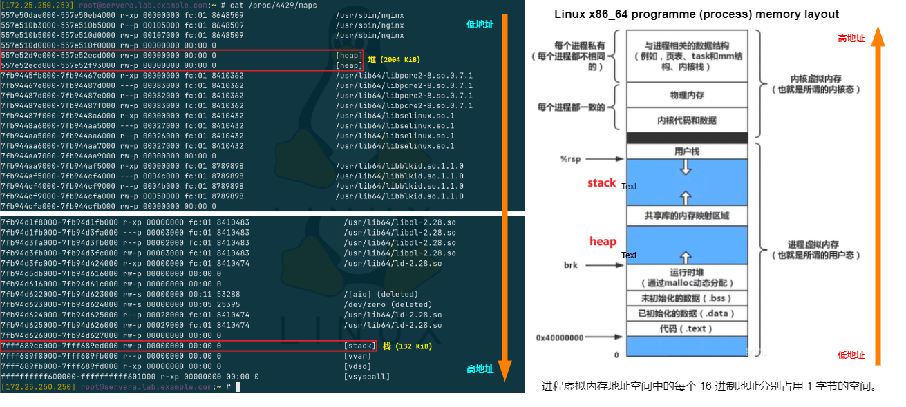

# Linux 系统性能优化探究

## 文档说明

- 以下示例均在 RHEL 8 中验证实现，若针对其他 Linux 发行版请自行测试。
- 该文档用于描述 Linux 中常用的系统监控与性能优化工具的功能与使用场景。
- 此文档在实践过程中将不断丰富及改进。

## 文档目录
- [Linux 系统性能优化探究](#linux-系统性能优化探究)
  - [文档说明](#文档说明)
  - [文档目录](#文档目录)
  - [🔬 1. 进程虚拟内存地址空间布局（layout）](#-1-进程虚拟内存地址空间布局layout)
  - [2. Linux 常用系统性能监控工具](#2-linux-常用系统性能监控工具)
    - [2.1 Linux 性能观测性工具图谱](#21-linux-性能观测性工具图谱)
    - [2.2 Linux 静态性能工具图谱](#22-linux-静态性能工具图谱)
    - [2.3 ps 命令详解](#23-ps-命令详解)
    - [2.4 ps 与 top 命令中虚拟内存与常驻物理内存的说明](#24-ps-与-top-命令中虚拟内存与常驻物理内存的说明)
    - [2.5 top 命令示例](#25-top-命令示例)
      - [2.5.1 交互模式](#251-交互模式)
      - [2.5.2 非交互模式](#252-非交互模式)
    - [2.6 htop 命令示例](#26-htop-命令示例)
    - [2.5 free 命令详解](#25-free-命令详解)
    - [2.6 vmstat 命令详解](#26-vmstat-命令详解)
    - [2.7 sysstat 软件包相关命令](#27-sysstat-软件包相关命令)
      - [2.7.1 mpstat 命令示例](#271-mpstat-命令示例)
      - [2.7.2 iostat 命令示例](#272-iostat-命令示例)
      - [2.7.3 pidstat 命令示例](#273-pidstat-命令示例)
      - [2.7.4 sar 命令示例](#274-sar-命令示例)
    - [2.8 Performance Co-Pilot (PCP) 组件使用](#28-performance-co-pilot-pcp-组件使用)
      - [2.8.1 PCP 相关命令示例](#281-pcp-相关命令示例)
      - [2.8.2 PCP 参考文档说明](#282-pcp-参考文档说明)
      - [2.8.3 📢 讨论：Linux 中 PCP 的 pmlogger 默认是采集 PCP 所有的性能指标吗？](#283--讨论linux-中-pcp-的-pmlogger-默认是采集-pcp-所有的性能指标吗)
      - [2.8.4 📢 讨论：是否可以自定义只需要的性能指标，并且采集的时间间隔能指定吗？](#284--讨论是否可以自定义只需要的性能指标并且采集的时间间隔能指定吗)
  - [🔥 3. Linux 系统资源限制 CGroup](#-3-linux-系统资源限制-cgroup)
  - [🔥 4. Linux 性能计数器 Perf](#-4-linux-性能计数器-perf)
  - [5. kernel 相关软件包下载](#5-kernel-相关软件包下载)
  - [6. 进程的调度与优先级](#6-进程的调度与优先级)
  - [CPU 三大架构：SMP、NUMA 与 MPP](#cpu-三大架构smpnuma-与-mpp)
  - [7. CPU 时钟周期、机器周期、指令周期的关系](#7-cpu-时钟周期机器周期指令周期的关系)
  - [8. x86\_64 架构的常用寄存器示例](#8-x86_64-架构的常用寄存器示例)
  - [9. CPU Cache 缓存架构](#9-cpu-cache-缓存架构)
  - [10. 参考链接](#10-参考链接)

## 🔬 1. 进程虚拟内存地址空间布局（layout）

- Linux 内核使用分段与分页机制实现进程虚拟内存地址、线性内存地址至物理内存地址的转换，而虚拟内存地址空间的分段信息可在 `/proc/<pid>/maps` 中确定，如下图所示。

  <center></center>
  
  `/proc/<pid>/maps` 中的 16 进制虚拟内存地址从显示的低地址位向高地址位扩展，并且在连续的地址空间之间为了保证数据安全性存在一定的 `gap` 区域，而右侧示意图中显示除了进程自身的虚拟内存地址空间外，还存在内核虚拟内存地址空间，两者共同协作完成进程所需执行的任务。

- 对于指定进程的全部状态信息可在 `/proc/<pid>/status` 文件中查看，如上述进程的栈（stack）大小为 132 KiB（占 33 个 page）。
  
  ```bash
  $ sudo grep VmStk /proc/4429/status
    VmStk:       132 kB
  ```

## 2. Linux 常用系统性能监控工具

> 📜 以下命令均可使用 man 命令查询详尽的使用说明

### 2.1 Linux 性能观测性工具图谱

<center></center>

### 2.2 Linux 静态性能工具图谱

<center></center>

### 2.3 ps 命令详解
  
```bash
### GNU 风格的命令行 ###
$ sudo pidof <process_name>
# 根据进程名称查找进程 ID
  
$ sudo ps -p $(pidof <process_name>)
# 查看相应进程的概要信息
$ sudo ps -p $(pidof nginx)
  PID TTY      STAT   TIME COMMAND
  865 ?        Ss     0:00 nginx: master process /usr/sbin/nginx
  866 ?        S      0:00 nginx: worker process
  867 ?        S      0:00 nginx: worker process 
# 查看 Nginx 相关进程的概要信息
  
$ sudo ps -p <pid> -o etime
# 查看指定进程自启动为止的消耗（elapsed）时间
$ sudo ps --forest -C <cmdlist>
# 查看指定命令列表的进程树 结构
$ sudo ps --forest -C nginx -o pid,ppid,cmd
# 查看 Nginx 进程的进程树与 pid、ppid 和 cmd
  
$ sudo ps -ef
$ sudo ps -efL
# 全格式输出系统上运行的所有进程，并显示各个进程的线程数（NLWP）。
# 注意：Linux 内核不区分进程与线程，将线程视为轻量级进程（LWP）。
$ sudo ps -L -C <process_name>
# 查看指定进程的线程信息
$ sudo ps -L [-p|p|-q|q] <pid>
# 查看指定进程的线程信息
$ sudo ps -U <user_name>
# 查看指定用户的进程信息
  
### BSD 风格命令行 ###
$ sudo ps aux
  USER       PID %CPU %MEM    VSZ   RSS TTY      STAT START   TIME COMMAND
  root         1  0.0  0.7 180608 13420 ?        Ss   Apr04   0:05 /usr/lib/systemd/systemd --switched-root --system --deserialize 18
  root         2  0.0  0.0      0     0 ?        S    Apr04   0:00 [kthreadd]
  root         3  0.0  0.0      0     0 ?        I<   Apr04   0:00 [rcu_gp]
  root         4  0.0  0.0      0     0 ?        I<   Apr04   0:00 [rcu_par_gp]
  root         6  0.0  0.0      0     0 ?        I<   Apr04   0:00 [kworker/0:0H-kblockd]
  root         8  0.0  0.0      0     0 ?        I<   Apr04   0:00 [mm_percpu_wq]
  root         9  0.0  0.0      0     0 ?        S    Apr04   0:01 [ksoftirqd/0]
  root        10  0.0  0.0      0     0 ?        I    Apr04   0:01 [rcu_sched]
  root        11  0.0  0.0      0     0 ?        S    Apr04   0:00 [migration/0]
  root        12  0.0  0.0      0     0 ?        S    Apr04   0:00 [watchdog/0]
  ...
# 查看所有用户及进程的扩展详情
# 使用 man ps 查看命令输出的 HEADER 详细说明
# 常见的 HEADER 说明：
#   USER：user，也称为 euser，即运行进程的有效用户 ID。
#   PID：pid，即进程 ID。
#   %CPU：%cpu，也称为 cputime 或 realtime ratio，即进程占所有进程的 CPU 使用时间百分比。
#   %MEM：%mem，即进程的常驻物理内存（resident set size）使用率。
#   VSZ：vsz，即进程的虚拟内存大小（单位为 KiB）。
#   RSS：rss，即进程的常驻内存大小（非 swapped 的物理内存大小），其单位为 KiB。
#   TTY：tname，即进程所在的终端，其中 "?" 代表进程无需运行终端。
#   STAT：stat，即进程的状态。
#   START：start_time，即进程启动的时间或日期。
#   TIME：time，即进程从启动到现在积累的 CPU 使用时间，格式为 "[DD-]HH:MM:SS"，该值逐渐累加。
#   CLS：cls，即进程的调度类别（见下文 "进程的调度与优先级说明"）。
#   COMMAND：comm，即进程的可执行程序名称。
  
$ sudo ps axum
# 查看系统上运行的所有进程，并在每个进程下显示该进程的所有线程。
$ sudo ps axl
# 长列表格式输出系统上运行的所有进程
$ sudo ps axjf
# 查看所有进程的进程树信息，与 pstree 命令类似。
  
$ sudo ps ax --format pid,%mem,comm --sort=-%mem
$ sudo ps axo pid,%mem,comm --sort=-%mem
# 查看进程以进程 ID、进程的物理内存使用率以及进程的可执行程序名称输出，并以物理内存使用率
# 的降序（从高到低）排序。
```
  
### 2.4 ps 与 top 命令中虚拟内存与常驻物理内存的说明

进程的 VSZ 与 RSS 在进程的 `/proc/<pid>/status` 中分别对应 `VmSize` 与 `VmRSS`，而 `VmRSS = RssAnon + RssFile`。
  
```bash
$ sudo cat /proc/4429/status
  ...
  VmSize:   149300 kB
  RssAnon:            3304 kB
  RssFile:            5320 kB
  ...
$ sudo ps axo pid,vsz,rss,comm | grep 4429
  4429 149300  8624 nginx
```
  
top 命令对 PID 4429 的输出如下所示，其中 `VIRT`（进程的虚拟内存）与 ps 命令的 VSZ 相同，`RES`（进程的常驻内存）与 ps 命令的 RSS 相同，SHR 与 `/proc/<pid>/status` 的 RssFile 相同。
  
```bash
$ top -n 1 -p 4429
  Tasks:   1 total,   0 running,   1 sleeping,   0 stopped,   0 zombie
  %Cpu(s):  0.0 us,  0.0 sy,  0.0 ni,100.0 id,  0.0 wa,  0.0 hi,  0.0 si,  0.0 st
  MiB Mem :   1828.8 total,   1268.2 free,    210.0 used,    350.7 buff/cache
  MiB Swap:      0.0 total,      0.0 free,      0.0 used.   1450.3 avail Mem
  
    PID USER      PR  NI    VIRT    RES    SHR S  %CPU  %MEM     TIME+ COMMAND
   4429 nginx     20   0  149300   8624   5320 S   0.0   0.5   0:01.04 nginx 
# top 命令执行 1 秒立即返回
```
  
通过 ps 与 top 命令可查看进程的虚拟内存大小，除此之外也可直接计算进程在虚拟内存中的分段范围而获得其虚拟内存的大小，在 Linux 中进程的虚拟内存分段的映射位于 `/proc/<pid>/maps` 文件中，计算方法如下所示：
  
```bash
$ sudo cat /proc/<pid>/maps | \
  awk '{print $1}' | \
  awk -F'[-]' '{ s=strtonum("0x"$1); e=strtonum("0x"$2); sum+=e-s } END { print sum/1024 }'
# 统计指定进程的虚拟内存地址空间中的地址数量，每个地址对应 1 字节。
# 以上命令返回的单位为 KiB
```

### 2.5 top 命令示例

top 命令具有 `交互式` 与 `非交互式` 模式，以下分别给出两种模式的使用示例：

#### 2.5.1 交互模式

```bash
$ top
top - 15:28:45 up 2 days, 16:03,  2 users,  load average: 0.16, 0.15, 0.11
Tasks: 395 total,   1 running, 394 sleeping,   0 stopped,   0 zombie
%Cpu(s):  0.2 us,  0.5 sy,  0.0 ni, 99.1 id,  0.0 wa,  0.2 hi,  0.1 si,  0.0 st
MiB Mem :  11966.5 total,    355.1 free,   8255.3 used,   3356.1 buff/cache
MiB Swap:   8063.0 total,   7446.4 free,    616.6 used.   2844.0 avail Mem

    PID USER      PR  NI    VIRT    RES    SHR S  %CPU  %MEM     TIME+ COMMAND
   2066 qemu      20   0 2812852 720908  21260 S   1.3   5.9  46:00.15 qemu-kvm
 152018 qemu      20   0 4198252 670024  21388 S   1.3   5.5  98:07.77 qemu-kvm
 151777 qemu      20   0 2936548 633020  21628 S   1.0   5.2  47:40.91 qemu-kvm
 151939 qemu      20   0 4641932   1.7g  21480 S   1.0  14.2  51:33.38 qemu-kvm
   1762 kiosk     20   0 4250616 301256 118868 S   0.7   2.5  21:15.58 gnome-shell
 151861 qemu      20   0 4208372   1.1g  21472 S   0.7   9.4  59:48.37 qemu-kvm
      1 root      20   0  261316  15448   9608 S   0.0   0.1   1:56.07 systemd
      2 root      20   0       0      0      0 S   0.0   0.0   0:00.21 kthreadd
      3 root       0 -20       0      0      0 I   0.0   0.0   0:00.00 rcu_gp
      4 root       0 -20       0      0      0 I   0.0   0.0   0:00.00 rcu_par_gp
...
# 直接运行，默认 3 秒刷新一次。

$ top -d <second>
# 指定间隔的秒数刷新一次

$ top -u <username>
# 只显示指定用户的进程列表刷新

$ top -p pid1,pid2,...
# 只显示指定进程的列表刷新
```

- `Shift + M`：根据 `RES` 常驻物理内存从大到小排序
- `Shift + N`：根据 `PID` 从大到小排序
- `Shift + T`：根据 `TIME+` 的 CPU 使用时间从大到小排序
- 💥 交互模式中的 `F` 键可选择更多的显示选项并用于排序

#### 2.5.2 非交互模式

```bash
$ sudo top -n <number>
# -n 选项：Number-of-interations，指定命令交互输出的次数。

$ sudo top -n 5 -d 1 > /path/to/file
# 每 1 秒刷新进程列表，刷新 5 次，但每次只显示一页结果，将其保存至指定文件中。

$ sudo top -b -n 5 -d 1 > /path/to/file
# 每 1 秒刷新进程列表，刷新 5 次，以批处理的形式保存所有进程列表至指定文件中。
```

<center></center>

### 2.6 htop 命令示例

htop 命令安装：

```bash
$ sudo cat > /etc/yum.repos.d/epel8.repo <<EOF
[epel8]
name = epel8 repository
baseurl = https://mirrors.tuna.tsinghua.edu.cn/epel/8/Everything/x86_64/
enabled = 1
gpgcheck = 0
EOF
# 配置 epel8 软件仓库

$ sudo dnf install -y htop
# htop 软件来源于 epel8 软件仓库
```

`htop` 命令可提供更加便捷与可视化的管理界面，可通过按键与鼠标点击操作。

<center></center>

### 2.5 free 命令详解

常用选项：

```plaintext
Usage:
 free [options]

Options:
 -b, --bytes         show output in bytes        # 十进制字节表示（bytes）
     --kilo          show output in kilobytes    # 十进制字节表示（kb/KB）
     --mega          show output in megabytes    # 十进制字节表示（mb/MB）
     --giga          show output in gigabytes    # 十进制字节表示（gb/GB）
     --tera          show output in terabytes    # 十进制字节表示（tb/TB）
     --peta          show output in petabytes    # 十进制字节表示（pb/PB）
 -k, --kibi          show output in kibibytes    # 二进制字节表示（kib/KiB）
 -m, --mebi          show output in mebibytes    # 二进制字节表示（mib/MiB）
 -g, --gibi          show output in gibibytes    # 二进制字节表示（gib/GiB）
     --tebi          show output in tebibytes    # 二进制字节表示（tib/TiB）
     --pebi          show output in pebibytes    # 二进制字节表示（pib/PiB）
 -h, --human         show human-readable output  # 以人类可读的方式输出
     --si            use powers of 1000 not 1024
 -l, --lohi          show detailed low and high memory statistics
 -t, --total         show total for RAM + swap             # 显示 RAM + sawp 总共的值
 -s N, --seconds N   repeat printing every N seconds       # 每隔 N 秒打印结果
 -c N, --count N     repeat printing N times, then exit    # 打印 N 次结果
 -w, --wide          wide output                           # 完整打印结果（buffer 与 cache 分开输出）

     --help     display this help and exit
 -V, --version  output version information and exit

For more details see free(1).
```

命令示例：

```bash
$ sudo free -m
$ sudo free -m -w
$ sudo free -m -w -s 3 -t 5
              total        used        free      shared     buffers       cache   available
Mem:          11966        7825         456         410           9        3675        3417
Swap:          8062         321        7741
...
# 每隔 3 秒打印以 MiB 为单位的结果，共采集 5 次。
```

| 字段名          | 含义说明 | /proc/meminfo 中的参数 |
| -------------- | ----- | ----- |
| **total**      | 物理内存或交换内存总容量 | MemTotal / SwapTotal |
| **used**       | 已使用的内存（不含缓存和缓冲区）。计算公式：`used = total - free - buff/cache`。| - |
| **free**       | 完全未被使用的内存 | MemFree / SwapFree |
| **shared**     | 被多个进程共享的内存（通常是 tmpfs）| Shmem |
| **buffers**    | 缓冲区的内存 | Buffers |
| **cache**      | 页缓存（page cache）与 slabs 使用的内存 | Cached + SReclaimable |
| **buff/cache** | 缓存（cache） + 缓冲区（buffer）总和，用于提升磁盘 I/O 性能。| - |
| **available**  | 可用于启动新程序的内存估算值（考虑了可回收的缓存）。**比 `free` 更准确**。| - |

⚠️ 重要：在 free 命令的输出中，相比 free 字段显示的 "完全未被使用的内存"，需更加关注 available 字段的值。`buff/cache` 与 `available` 列的值接近于 0，暗示系统可用内存极低！若 `available` 超过 `total` 的 20%，即使 `used` 接近于 `total`，这种状态也暗示系统是一个健康的系统（healthy system）。

### 2.6 vmstat 命令详解

- 功能：监控虚拟内存使用情况
- 来源：`procps-ng` 软件包  
- 该命令不带参数将显示自启动以来统计信息的平均值  
- 该命令具有多种统计汇总模式，包括 VM 模式（VM mode）、磁盘模式（disk mode）、磁盘分区模式（disk partition mode）与 slab 模式（slab mode）等，默认情况下以 VM 模式输出。 
- 默认情况下，命令输出的内存单位为 KiB，更改单位的选项：
  - `-S k` 选项：单位 KB
  - `-S m` 选项：单位 MB
  - `-S M` 选项：单位 MiB

  ```bash
  root@ceph-node0:~# vmstat -S M 2 5
  procs -----------memory---------- ---swap-- -----io---- -system-- ------cpu-----
   r  b   swpd   free   buff  cache   si   so    bi    bo   in   cs us sy id wa st
   1  0      0    121      9    160    0    0     7   120  188  276  0  0 99  0  0
   1  0      0    121      9    160    0    0     0    19  305  474  0  0 100  0  0
   0  0      0    121      9    160    0    0     0    19  328  462  0  1 99  0  0
   0  0      0    121      9    160    0    0     0    33  327  473  0  1 99  0  0
   0  0      0    120      9    160    0    0     0    39  351  514  0  0 100  0  0
  # 默认 VM 模式输出，单位为 MiB，每隔 2 秒采样，共采样 4 次。
  ```
  
- vmstat 命令 VM 模式输出的详细说明，如下所示：

<center></center>

<center></center>

### 2.7 sysstat 软件包相关命令

该软件包中主要包含的命令：`mpstat`、`iostat`、`pidstat`、`sar`

#### 2.7.1 mpstat 命令示例

功能：监控 CPU 的使用情况
    
> 注意：mpstat 命令将使用 `/proc/stat` 与 `/proc/interrupts` 文件进行检索，监控统计 CPU 的使用状态。

```bash
$ sudo mpstat -P { <cpu_list> | ALL } \
  -N { <node_list> | ALL } \
  <interval> <count>
# mpstat 命令查看指定 CPU 核心或 NUMA 节点的使用状态
    
$ sudo mpstat -P ALL 1 10
# 实时监控所有 CPU 核心的使用状态，每隔 1 秒采集样本共采集 10 次。
    
$ sudo mpstat -P 1 -N 0 -o JSON 2 5 > mpstat-dump.json
# 实时监控 1 号逻辑 CPU、0 号 NUMA 节点的 CPU 状态，每隔 2 秒采集样本共采集 5 次，
# 结果输出为指定 JSON 文件。
```

<center></center>

若需启用实时输出的高亮显示，可设置 `S_COLORS` 环境变量为 `always` 或 `auto`。
  
#### 2.7.2 iostat 命令示例

- 功能：监控磁盘的 I/O 使用情况
- iostat 命令使用内核性能计数器（`perf_event`）统计生成两类报告：CPU 使用报告、设备使用报告
- 常用选项：
  - -c 选项：显示 CPU 使用率报告
  - -d 选项：显示设备使用率报告
  - -x 选项：显示更多的 I/O 统计指标
  - -y 选项：省略自系统启动以来第一行的统计信息
  - -z 选项：省略统计无任何活动的设备
  - --human 选项：显示人类可读的容量格式

  ```bash
  $ sudo iostat 1 5
  # 每 1 秒采集样本共采集 5 次

  $ sudo iostat -cdyz --human 2 10 > /path/to/file
  # sysstat 软件包工具输出的第一行是自系统启动以来统计的平均值，此行可不考虑在内。
  # 每 2 秒采集样本共采集 10 次，实时监控 CPU 与磁盘设备的状态。
  # 输出中的 tps 事务数又称为 IOPS
  ```

  <center></center>

  ```bash
  $ sudo iostat -dtxyz --human 1 5
  Linux 4.18.0-305.el8.x86_64 (foundation0.ilt.example.com)       09/05/2025      _x86_64_        (4 CPU)

  09/05/2025 11:48:13 AM
  Device            r/s     w/s     rkB/s     wkB/s   rrqm/s   wrqm/s  %rrqm  %wrqm r_await w_await aqu-sz rareq-sz wareq-sz  svctm  %util
  sda              0.00   28.00      0.0k      1.5M     0.00     2.00   0.0%   6.7%    0.00    0.21   0.01     0.0k    53.3k   0.11   0.3%

  09/05/2025 11:48:14 AM
  Device            r/s     w/s     rkB/s     wkB/s   rrqm/s   wrqm/s  %rrqm  %wrqm r_await w_await aqu-sz rareq-sz wareq-sz  svctm  %util
  sda              0.00    1.00      0.0k      8.0k     0.00     0.00   0.0%   0.0%    0.00    0.00   0.00     0.0k     8.0k   1.00   0.1%
  ...
  # 每 1 秒采集磁盘样本，共采集 5 次，显示更多 I/O 统计指标。
  ```

  以上命令输出中的各参数如下所示：

  | 字段 | 含义（单位）| 简要说明 |
  | ----- | ----- | ----- |
  | **r/s**      | 每秒读 I/O 次数（read requests per second） | 读请求频率 |
  | **w/s**      | 每秒写 I/O 次数（write requests per second） | 写请求频率 |
  | **rkB/s**    | 每秒读数据量（kB） | 读吞吐 |
  | **wkB/s**    | 每秒写数据量（kB） | 写吞吐 |
  | **rrqm/s**   | 每秒合并的读请求数 | 读合并量 |
  | **wrqm/s**   | 每秒合并的写请求数 | 写合并量 |
  | **%rrqm**    | 读请求合并比例（%） | 读合并率 |
  | **%wrqm**    | 写请求合并比例（%） | 写合并率 |
  | **r\_await** | 读请求平均等待+服务时间（ms） | 读延迟 |
  | **w\_await** | 写请求平均等待+服务时间（ms） | 写延迟 |
  | **aqu-sz**   | 平均队列长度（活跃请求数） | 队列深度 |
  | **rareq-sz** | 平均读请求大小（kB） | 读块大小 |
  | **wareq-sz** | 平均写请求大小（kB） | 写块大小 |
  | **svctm**    | 平均服务时间（ms，已废弃） | 可忽略 |
  | **%util**    | 设备繁忙时间占比（%） | 磁盘饱和度 |

  参数性能参考：

    - 1️⃣ %util > 80% 且 r_await/w_await > 10 ms → 磁盘瓶颈。
    - 2️⃣ aqu-sz > 1 且 svctm 低 → 队列较深，磁盘还能承担负载。
    - 3️⃣ %rrqm/%wrqm 高 → 合并生效，CPU 省中断。
  
#### 2.7.3 pidstat 命令示例

- 功能：监控进程的使用情况
- 常用选项：
  - -p 选项：进程 PID
  - -t 选项：报告指定进程的线程统计情况
  - -u 选项：报告 CPU 使用率
  - -r 选项：报告页面错误（page faults）与内存使用率
  - -d 选项：报告磁盘统计情况
  - -w 选项：报告任务切换活动（进程的上下文切换）

```bash
$ sudo pidstat -p <pid> -t -u -r <interval> <count>
# 查看进程的状态统计信息

$ sudo pidstat -p <pid> -w <interval> <count>
# 查看指定进程的自愿与非自愿上下文切换的状态，指定时间间隔（秒）与采集数量。
# 重要指标：
#   1. cswch/s：每秒进程的自愿上下文切换（voluntary context switch）的总数。当一个任务因需要某种不可用的资源而受阻时，就会发生一种自愿的切换操作。
#   2. nvcswch/s：每秒进程的非自愿上下文切换（involuntary context switch）的总数。当一个任务在其所占用的时间片内完成执行后，却被迫放弃处理器时，就会发生一种非自愿的切换情况。
```
  
#### 2.7.4 sar 命令示例

- 功能：系统性能监控与报告工具
- sar 命令从内核性能计数器采集指标

<center></center>

- 常用选项：
  - -B 选项：报告 **页面级内存压力** 统计
  
    ```bash
    $ sudo sar -B 1 3
    Linux 4.18.0-305.el8.x86_64 (foundation0.ilt.example.com)       09/05/2025      _x86_64_        (4 CPU)

    08:31:42 PM  pgpgin/s pgpgout/s   fault/s  majflt/s  pgfree/s pgscank/s pgscand/s pgsteal/s    %vmeff
    08:31:43 PM      0.00      0.00     24.00      0.00    163.00      0.00      0.00      0.00      0.00
    08:31:44 PM      0.00      0.00  13558.00      0.00   2058.00      0.00      0.00      0.00      0.00
    08:31:45 PM      0.00     89.00  45575.00      2.00   7720.00      0.00      0.00      0.00      0.00
    Average:         0.00     29.67  19719.00      0.67   3313.67      0.00      0.00      0.00      0.00
    ```

    | 字段 | 含义（单位） | 内核源事件 | 简要说明 |
    | ----- | ----- | ----- | ----- |
    | **pgpgin/s**  | 每秒从块设备 **读** 的页数（4 KB 页）| pgpgin | 内存 **换入** 或 **文件映射读** 总量 |
    | **pgpgout/s** | 每秒向块设备 **写** 的页数（4 KB 页）| pgpgout | 内存 **换出** 或 **脏页回写** 总量 |
    | **fault/s**   | 每秒 **缺页异常** 次数（minor + major）| pgfault | 地址不存在的总次数 |
    | **majflt/s**  | 每秒 **大缺页**（需磁盘 I/O）次数 | pgmajfault | 真正去磁盘读页的次数 |
    | **pgfree/s**  | 每秒放入 **空闲链表** 的页数 | pgfree | 内核 **主动回收** 的页数 |
    | **pgscank/s** | 每秒 **kswapd** 扫描的页数 | pgscank | 后台回收线程工作量 |
    | **pgscand/s** | 每秒 **直接回收** 扫描的页数 | pgscand | 进程自己回收，**阻塞** |
    | **pgsteal/s** | 每秒 **被回收再利用** 的页数（从页缓存与 swap 缓存中回收）| pgsteal | 真正 **腾出来** 的页 |
    | **%vmeff**    | 回收效率 = pgsteal / (pgscank+pgscand) × 100 % | 手工算 | **越高越好**；< 30 % 说明扫描多、偷少，内存压力大 |

    参数性能参考：
    
      - 1️⃣ pgpgin/out 高 → 大量文件读写或 swap 换入换出。
      - 2️⃣ majflt 高 → 内存不足，频繁去磁盘读页。
      - 3️⃣ pgscand 高 → 进程同步回收，会阻塞业务。
      - 4️⃣ %vmeff < 30 → 回收效率低，内存已吃紧，考虑加内存或杀进程。

  - -b 选项：报告所有设备的 I/O 统计
  - -d 选项：报告每个块设备的磁盘 I/O 统计

    ```bash
    $ sudo sar -d 1 3
    ```

    | 字段 | 含义（单位） | 简要说明 |
    | ----- | ----- | ----- |
    | **tps**     | 每秒 I/O 请求数（合并后）| 磁盘 “事务” 频率 |
    | **rkB/s**   | 每秒读数据量（kB）| 读吞吐 |
    | **wkB/s**   | 每秒写数据量（kB）| 写吞吐 |
    | **areq-sz** | 平均每个 I/O 请求的大小（kB）| 块大小；越大越顺序 |
    | **aqu-sz**  | 平均活跃队列长度（即 **in-flight I/O 数**）| 队列深度；>1 表示队列积压 |
    | **await**   | 平均 I/O 响应时间（ms）= 队列 + 服务 | 用户可见延迟 |
    | **svctm**   | 平均 “服务” 时间（ms，已废弃）| 可忽略，仅保留兼容 |
    | **%util**   | 设备繁忙时间占比（%）| **磁盘饱和度**；≥ 80% 即瓶颈 |

    参数性能参考：

      - 1️⃣ %util ≥ 80% 且 await > 10 ms → 磁盘瓶颈。
      - 2️⃣ aqu-sz > 1 且 svctm 低 → 队列较深，磁盘还能承担负载。
      - 3️⃣ areq-sz 大 (>128 kB) → 顺序 I/O；小 (4 kB) → 随机 I/O。

  - -n 选项：报告网络统计（针对不同关键字的参数可参考 man sar）
  - -r 选项：报告 **系统级内存统计**

    ```bash
    $ sudo sar -r 1 5
    Linux 4.18.0-305.el8.x86_64 (foundation0.ilt.example.com)       09/05/2025      _x86_64_        (4 CPU)

    11:25:44 PM kbmemfree   kbavail kbmemused  %memused kbbuffers  kbcached  kbcommit   %commit  kbactive   kbinact   kbdirty
    11:25:45 PM    342612   2496800  11911092     97.20      8312   2855520  16613152     81.00   4265256   4723928        16
    11:25:46 PM    342612   2496800  11911092     97.20      8312   2855520  16613152     81.00   4265256   4723928        16
    11:25:47 PM    342612   2496800  11911092     97.20      8312   2855520  16613152     81.00   4265256   4723928        16
    11:25:48 PM    233788   2380588  12019916     98.09      8312   2852496  16735560     81.60   4250244   4843812        24
    11:25:49 PM    166660   2313464  12087044     98.64      8312   2852636  16835828     82.09   4250272   4918500      1524
    Average:       285657   2436890  11968047     97.67      8312   2854338  16682169     81.34   4259257   4786819       319
    ```

    | 字段 | 含义（单位：kB）| 简要说明 |
    | ----- | ----- | ----- |
    | **kbmemfree** | 完全未被使用的物理内存 | 传统 “空闲” 值 |
    | **kbavail**   | **应用程序能拿到的** 内存估算 | 接近于 `free -k` 的 **available** |
    | **kbmemused** | 已被用掉的物理内存 | `总内存 - kbmemfree` |
    | **%memused**  | 已用占比 | `kbmemused / 总内存 × 100%` |
    | **kbbuffers** | 块设备 **buffer** 缓存 | 旧式块层元数据缓存 |
    | **kbcached**  | **page cache** 文件系统缓存 | 可回收，不影响真正可用内存 |
    | **kbcommit**  | 当前已 **承诺** 的虚拟内存总量 | 所有进程 `malloc/mmap` 申请量 **上限** |
    | **%commit**   | 承诺占比 | `kbcommit / (总内存 + swap) × 100%`；> 100 % 会触发 OOM |
    | **kbactive**  | **活跃** LRU 链表页 | 最近被访问，**不易回收** |
    | **kbinact**   | **非活跃** LRU 链表页 | 一段时间未访问，**优先回收** |
    | **kbdirty**   | 等待回写的 **脏页** | 脏数据量; > 10 % 内存会触发后台写回 |

    参数性能参考：

      - 1️⃣ kbavail 低 → 程序快没钱了，先看缓存能否回收。
      - 2️⃣ %commit > 90 % → 虚拟内存快超售，可能 OOM。
      - 3️⃣ kbdirty 高 → 大量写，观测回写延迟是否飙高。

  - -q 选项：报告队列长度与负载
  - -o 选项：将输出写入指定文件，以二进制数据保存。
  - -f 选项：读取指定数据文件

### 2.8 Performance Co-Pilot (PCP) 组件使用

#### 2.8.1 PCP 相关命令示例

安装 PCP 组件：

```bash
$ sudo dnf install -y pcp pcp-gui pcp-system-tools
# 安装 PCP、PCP 图形化软件包与 PCP 系统工具包
$ sudo systemctl enable --now pmcd.service pmlogger.service
# 启动并开机自启 pmcd 与 pmlogger 守护进程
# pmlogger 服务将指标日志存储于 /var/log/pcp/pmlogger/<hostname>/ 目录中
```

PCP 命令行性能采集工具：pcp-system-tools 软件包安装于 `/usr/libexec/pcp/bin/` 目录中

```bash
$ export PATH=/usr/libexec/pcp/bin:$PATH
$ sudo pcp-free -m  #等价于 pcp free -m
                total        used        free      shared  buff/cache   available
  Mem:           7741        2621        1949         318        3169        4493
  Swap            511           0         511
$ 

$ pmstat -s <sample_number> -t <number>[seconds|minutes] 
# 高层次的系统性能查看工具，在指定的时间间隔内（默认 5 秒刷新一次），共统计指定次数（类似于 vmstat 命令）。
$ pmatop
# 实时刷新系统资源使用信息（类似于 top 命令）
```

pmval 命令行查询性能指标归档日志：

```bash
$ pminfo
# 查看 Co-Pilot 数据库中的性能指标的类型，可通过 pmval 命令列出数据库中的数据。
$ pminfo -dt <metrics_type>
# 查看指定指标类型的说明
$ pminfo -dt kernel.percpu.cpu.idle

$ pmval -s 5 -t 2 proc.nprocs
  metric:    proc.nprocs
  host:      servera.lab.example.com
  semantics: instantaneous value
  units:     none
  samples:   5
  interval:  2.00 sec
          111
          111
          111
          111
          111
# 实时刷新时间间隔 2 秒，共统计 5 次的瞬时进程数。
$ pmval -a /var/log/pcp/pmlogger/workstation.lab.example.com/20210609.14.52.0 <metrics_type>
# 查看默认指标数据归档文件中指定的指标类型日志
# -a 选项指定性能指标的归档日志
```

#### 2.8.2 PCP 参考文档说明

- PCP 软件包除提供命令行模式的性能指标输出外，还提供 `GUI` 图形化界面及 Web 图形化界面，并可与 `Grafana` 集成显示。
- 该软件包提供强大而丰富的系统性能监控指标与参数，关于 PCP 软件包及相关命令的使用方法，可参考如下 `Red Hat Access` 链接获取更为详细的技术指导：
  - [RHEL 7 性能监控之 PCP](http://www.361way.com/rhel7-pcp/5149.html)  
  - [How do I install Performance Co-Pilot (PCP) on my RHEL server to capture performance logs](https://access.redhat.com/solutions/1137023) 
  - 💪 [Index of Performance Co-Pilot (PCP) articles, solutions, tutorials and white papers](https://access.redhat.com/articles/1145953) 
  - [Interactive web interface for Performance Co-Pilot](https://access.redhat.com/articles/1378113) 
  - [Introduction to storage performance analysis with PCP](https://access.redhat.com/articles/2450251)
  - 📊 [Chapter 10. Setting up graphical representation of PCP metrics](https://access.redhat.com/documentation/en-us/red_hat_enterprise_linux/8/html/monitoring_and_managing_system_status_and_performance/setting-up-graphical-representation-of-pcp-metrics_monitoring-and-managing-system-status-and-performance#doc-wrapper)
  - 📊 [Visualizing system performance with RHEL 8 using Performance Co-Pilot (PCP) and Grafana (Part 1)](https://www.redhat.com/en/blog/visualizing-system-performance-rhel-8-using-performance-co-pilot-pcp-and-grafana-part-1)
  - 📊 [Visualizing system performance with RHEL 8 using Performance Co-Pilot (PCP) and Grafana (Part 2)](https://www.redhat.com/en/blog/visualizing-system-performance-rhel-8-using-performance-co-pilot-pcp-and-grafana-part-2)

#### 2.8.3 📢 讨论：Linux 中 PCP 的 pmlogger 默认是采集 PCP 所有的性能指标吗？

pmlogger 启动后只在 `/var/lib/pcp/config/pmlogger/config.default`（pmlogger 自动生成）中预先定义的一组 “默认指标”，并非采集 `pminfo` 命令返回的所有性能指标。

1️⃣ 自定义修改性能指标：

- 方式1：
      
```bash
$ sudo egrep '^\s+[a-z]' /var/lib/pcp/config/pmlogger/config.default | sed 's/^\t//'
# 过滤 PCP 默认收集的性能指标
# 注意：此配置文件可由 pmlogconf 命令更新并覆盖其中的配置，若通过手动方式更新其中自定义的性能指标，那么需注意备份此文件，防止 pmlogconf 命令的配置覆盖。

$ sudo vim /var/lib/pcp/config/pmlogger/config.default
  ...
  log advisory on default {
    ...
  }
  # 在对应组（group）中添加自定义的性能指标

$ sudo systemctl restart pmlogger.service
# 重启 pmlogger 服务
```

- 👍 方式2（推荐）：
  
```bash
$ sudo vim /var/lib/pcp/config/pmlogger/customized_metrics
  log advisory on default {
    mem.numa.util.dirty
    mem.numa.alloc.hit
  }
  # 创建自定义性能指标文件，文件名可自行指定，pmlogger 将只采集此文件中的性能指标。

  $ sudo vim /etc/pcp/pmlogger/control.d/local
    ...
    #LOCALHOSTNAME  y   n   PCP_LOG_DIR/pmlogger/LOCALHOSTNAME      -r -T24h10m -c config.default -v 100Mb
    LOCALHOSTNAME   y   n   PCP_LOG_DIR/pmlogger/LOCALHOSTNAME      -r -T24h10m -c customized_metrics -v 100Mb
    # 将 -c 选项指定的文件 config.default 修改为自定义文件 customized_metrics

  $ sudo systemctl restart pmlogger.service
  # 重启 pmlogger 服务
  ```

2️⃣ 交互式修改性能指标：

```bash
$ sudo pmlogconf -r /var/lib/pcp/config/pmlogger/config.default

Group: utilization per CPU
Log this group? [n] n

Group: utilization (usr, sys, idle, ...) over all CPUs
Log this group? [y] y
...
# 交互式指定所需的性能指标组
```

#### 2.8.4 📢 讨论：是否可以自定义只需要的性能指标，并且采集的时间间隔能指定吗？

- 调整采样的时间间隔依然可在 `/etc/pcp/pmlogger/control.d/local` 文件中调整

## 🔥 3. Linux 系统资源限制 CGroup

此部分内容请参看 [此链接](https://github.com/Alberthua-Perl/tech-docs/blob/master/Linux%20%E5%9F%BA%E7%A1%80%E4%B8%8E%E8%BF%9B%E9%98%B6/Linux%20%E7%B3%BB%E7%BB%9F%E8%B5%84%E6%BA%90%E9%99%90%E5%88%B6/Linux%20%E7%B3%BB%E7%BB%9F%E8%B5%84%E6%BA%90%E9%99%90%E5%88%B6.md)。

## 🔥 4. Linux 性能计数器 Perf

此部分内容请参看 [此链接](https://github.com/Alberthua-Perl/tech-docs/blob/master/Linux%20%E5%9F%BA%E7%A1%80%E4%B8%8E%E8%BF%9B%E9%98%B6/Linux%20%E6%80%A7%E8%83%BD%E5%88%86%E6%9E%90%E5%B7%A5%E5%85%B7%E4%B9%8B%20perf/Linux%20%E6%80%A7%E8%83%BD%E5%88%86%E6%9E%90%E5%B7%A5%E5%85%B7%E4%B9%8B%20perf.md)。

## 5. kernel 相关软件包下载

- 与系统诊断与优化的部分工具依赖内核的版本，如 perf、SystemTap 等，因此在使用此类工具时需安装内核相关的软件包，并且其版本必须与当前系统内核完全一致。
- 相关的内核软件包安装可参考 [How can I download or install kernel debuginfo packages for RHEL systems?](https://access.redhat.com/solutions/9907#masthead)

## 6. 进程的调度与优先级

- 📜 `man 7 sched` 命令查看进程调度的策略与系统调用
- Linux 中的进程调度策略：  
  - 实时调度策略（real-time scheduling policy）
    - 由实时调度策略调度的进程需在限制的时间内完成任务，常见的策略有 `FF`。
    - 实时调度的进程比非实时调度的进程获得更多的 CPU 使用时间，由于其需要在有限的时间内完成并返回。  
  - 非实时调度策略（non-real-time scheduling policy）
    常见的策略有 `TS`
- Linux 进程调度优先级的分类：
  
  
  
  - 系统优先级（system priority）  
  - 实时优先级（real-time priority）  
  - 过时的优先级（obsolete priority）：`/ˈɒbsəliːt/`
    该优先级类型为 `BSD` 风格类型，使用 ps 命令的 `l` 选项查看，其优先级的值与 `pri` 选项不同。
- Linux 中的上下文切换（context switch）：
  - 上下文切换的过程：

    

    

    - 当一个程序正在执行的过程中，中断（interrupt）或系统调用（system call）发生可以使得 CPU 的控制权从当前进程转移到操作系统内核。
    - 操作系统内核负责保存进程 $P_1$ 在 CPU 中的上下文到 $PCB_1$（PCB 即为进程的 `task_struct` 结构体）中。
    - 从 $PCB_2$ 取出进程 $P_2$ 的 CPU 上下文，将 CPU 控制权转移给进程 $P_2$， 开始执行进程 $P_2$ 的指令。  
  - 发生上下文切换的 3 中场景：
    - 1️⃣ 进程无法运行下去：
      如等待 io 完成，或者等待某个资源、某个事件等。
    - 2️⃣ 进程仍在运行，但内核不让它继续使用 CPU：
      如进程的时间片用完，或者优先级更高的进程抢占，因此该进程必须交出 CPU 的使用权。
    - 3️⃣ 进程还可运行，但其自身的算法决定主动交出 CPU 于别的进程：
      用户程序可以通过系统调用 `sched_yield()` 来交出 CPU，内核则可以通过函数 `cond_resched()` 或者 `yield()` 来做到。
  - 上下文切换又可分为：
    - 自愿上下文切换（voluntary /ˈvɒləntri/）
    - 非自愿上下文切换（involuntary）或强制切换 
  > 自愿上下文切换时进程不再处于运行状态，而非自愿上下文切换时进程仍处于运行状态。
  - 以上场景 1️⃣ 属于自愿上下文切换，而场景 2️⃣ 与 3️⃣ 属于非自愿上下文切换。
- ps 命令常用参数示例：
  
  ```bash
  $ sudo ps axo pid,pri,rtprio,ni,cls,cputime,psr,comm
      PID PRI RTPRio  NI CLS     TIME PSR COMMAND
        1  19      -   0  TS 00:00:10   0 systemd
        2  19      -   0  TS 00:00:00   1 kthreadd
        3  39      - -20  TS 00:00:00   0 rcu_gp
        4  39      - -20  TS 00:00:00   0 rcu_par_gp
        6  39      - -20  TS 00:00:00   0 kworker/0:0H-kblockd
        8  39      - -20  TS 00:00:00   0 mm_percpu_wq
        9  19      -   0  TS 00:00:00   0 ksoftirqd/0
       10  19      -   0  TS 00:00:01   1 rcu_sched
       11 139     99   -  FF 00:00:00   0 migration/0
       12 139     99   -  FF 00:00:00   0 watchdog/0
       13  19      -   0  TS 00:00:00   0 cpuhp/0
       14  19      -   0  TS 00:00:00   1 cpuhp/1
       15 139     99   -  FF 00:00:00   1 watchdog/1
       16 139     99   -  FF 00:00:00   1 migration/1 
       ...
       1677  19      -   0  TS 00:00:00   1 nginx
       1678  19      -   0  TS 00:00:00   0 nginx
       1679  19      -   0  TS 00:00:00   1 nginx
       ...
  # 查看系统所有进程的 PID、系统优先级、实时优先级、nice 值、cls 调度策略、
  # CPU 实际使用时间（realtime）、进程当前被分配的逻辑 CPU 与对应的命令
  
  $ cat /proc/<pid>/status
    ...
    voluntary_ctxt_switches:        1  # 自愿上下文切换数目
    nonvoluntary_ctxt_switches:     4  # 非自愿上下文切换数目
  # voluntary_ctxt_switches, nonvoluntary_ctxt_switches: since Linux 2.6.23
  # 以上数目是进程被调度运行后的累加值
  # 注意：
  #   自愿上下文切换数目占多数说明进程相对 CPU 的资源需求不高，而非自愿上下文切换数目较多
  #   的话，需考虑其对 CPU 的资源需求可能存在瓶颈，被内核强制调度切换。
  ```
  
  从上述 ps 命令的输出中可知：  
  - CLS 调度策略为 TS（SCHED_NORMAL）的进程不具有实时优先级（RTPRio）
  - ✨ 进程具有最高的实时优先级（99）而具有最低的系统优先级（139）彼此间不矛盾，因为实时优先级是进程在限定时间内需完成的任务可，需抢占 CPU 资源快速完成任务，而任务完成后不再占用 CPU 资源具有较低的系统的优先级，此类进程通常为内核进程。

## CPU 三大架构：SMP、NUMA 与 MPP

- `SMP`（Symmetric /sɪˈmetrɪk/ Multiprocessing，对称多处理器），顾名思义, 在 SMP 中所有的处理器都是对等的, 它们通过总线连接共享同一块物理内存，这也就导致了系统中所有资源（CPU、内存、io 等）都是共享的。当打开服务器的背板盖，如果发现有多个 CPU 的槽位，但是却连接到同一个内存插槽的位置，那一般就是 SMP 架构的服务器。日常中常见的 PC、笔记本、手机还有一些老旧的服务器都是此架构，其架构简单，但是拓展性能较差。SMP 架构在 Linux 中如下所示：

```bash
$ sudo ls -lhd /sys/devices/system/node/node*
  drwxr-xr-x. 4 root root 0 Sep  2 20:20 /sys/devices/system/node/node0
# 若只有一个 node0 的话，即为 SMP 架构。  
```

- `NUMA`（Non-Uniform Memory Access，非一致性内存访问），这种模型的目的是为了解决 SMP 扩容性差而提出的技术方案。也就是说，NUMA 相当于多个 CPU 的资源分开，以 `node` 为单位进行分割，每个 node 里有着独有的 core、内存等资源，这也就导致了 CPU 在性能使用上的提升，但是同样存在问题，即 2 个 node 之间的资源交互非常慢（remote node 访问效率），当 CPU 增多的情况下，性能提升的幅度并不是很高。所以可以看到明明有很多核心的服务器却只有 2 个 node。一般而言，NUMA 架构分配 2 或 4 个 node，这样 node 间的访问效率相对合适。

- `MPP`（Massive Parallel Processing），这个可以理解为刀片服务器，每个刀扇里的都是一台独立的 SMP 架构服务器，且每个刀扇之间均有高性能的网络设备进行交互，保证 SMP 服务器之间的数据传输性能。相比 NUMA 来说更适合大规模的计算，唯一不足的是，当其中的 SMP 节点增多的情况下，与之对应的计算管理系统也需要相对应的提高。

## 7. CPU 时钟周期、机器周期、指令周期的关系

- CPU 的最小时间单位是时钟周期，而一个机器周期包括若干个时钟周期，而指令周期，则包含若干个机器周期。
- 🤘 按粒度排序：**指令周期 > 机器周期 > 时钟周期**
- 时钟周期（Clock Cycle）： 
  - 时钟周期也称为 **振荡周期**，定义为 **振荡频率** 的倒数。  
  - 时钟周期是计算机中 CPU 的最基本、最小的时间单位。  
  - 在一个时钟周期内，CPU 仅完成一个最基本的动作。
- 机器周期（Machine Cycle）：  
  - 机器周期也称为 CPU 周期（CPU Cycle），在计算机中，为了便于管理，常把一条指令的执行过程划分为若干个阶段。 
  - 如，取指令、存储器（即主存）读、存储器写等，这每一项工作称为一个 **基本操作**（注意：每一个基本操作都是由若干 CPU 最基本的动作组成）。完成一个 **基本操作** 所需要的时间称为机器周期。通常用内存中读取一个指令的最短时间来规定 CPU 周期。
- 指令周期（Intruction Cycle）： 
  - 计算机从取指令到指令执行完毕的时间。
- 💻 一个完整的指令周期可包含以下五个阶段：
  
  
  
  - 取指令（Instruction Fetch）：
    - CPU 从指令寄存器指向的内存地址读取指令。
    - 指令寄存器也称为程序计数器（Program Counter，`PC`），其主要作用是 CPU 根据指令地址从内存里把具体的指令加载到指令寄存器中，并存储下一条要执行的指令在内存中的地址。当 CPU 执行完当前指令后，会从指令寄存器中读取下一条指令的地址，并将其加载到指令寄存器中，然后开始执行下一条指令。  
  - 指令译码（Instruction Decode）：
    CPU 解码取出的指令，并确定执行该指令所需要的操作。此阶段还会确定读取操作数的地址，并把它们传送到执行阶段。  
  - 执行指令（Execute）：
    CPU 执行指令并计算结果。操作数在指令译码阶段被读取并在执行阶段进行计算。 
  - 访问存储器（Memory Access）：
    若当前指令需要访问内存，则在该阶段中访问内存。 
  - 写回数据（Write Back）：
    最终计算结果被写回到 CPU 的寄存器或者内存。  
  - 以上五个阶段组成一个指令周期。需要注意的是，不是所有的指令都需要以上五个阶段全部执行，一些比较简单的指令可能只需要执行前三个或者前四个阶段。而有些复杂的指令可能需要多个指令周期才能完成。
- 对于一个指令周期来说，取出一条指令，然后执行它，至少需要两个 CPU 周期。取出指令至少需要一个 CPU 周期，执行至少也需要一个 CPU 周期，复杂的指令则需要更多的 CPU 周期。而一个 CPU 周期是若干时钟周期之和。
  
  

## 8. x86_64 架构的常用寄存器示例

x86_64 架构是 x86 架构的 64 位扩展，它包括了一些与 32 位版本不同的寄存器，以下列举了 x86_64 架构中常用寄存器的全称和简称：

- 通用寄存器 (General-Purpose Registers)：
  
  | 名称                                  | 功能                                             |
  | ------------------------------------ | ------------------------------------------------ |
  | **rax** (Accumulator Register)       | 累加器寄存器。常用于算术运算、函数返回值等。在乘法/除法等指令中，rax 还常作为隐含操作数。|
  | **rbx** (Base Register)              | 基址寄存器。传统上用作内存访问的基址，现代也常作为通用寄存器使用。|
  | **rcx** (Counter Register)           | 计数寄存器。常用于循环计数（如 `loop` 指令）、字符串操作（如 `rep` 前缀指令）等。|
  | **rdx** (Data Register)              | 数据寄存器。常用于算术运算、I/O 操作、乘法/除法中的高 32 位等。|
  | **rsi** (Source Index Register)      | 源变址寄存器。在字符串操作指令（如 `movs`, `lods` 等）中作为源地址指针。|
  | **rdi** (Destination Index Register) | 目的变址寄存器。在字符串操作指令（如 `movs`, `stos` 等）中作为目的地址指针。|
  | **rbp** (Base Pointer Register)      | 基址指针寄存器。常用于栈帧（stack frame）的基址，帮助访问函数参数和局部变量。|
  | **rsp** (Stack Pointer Register)     | 栈指针寄存器。始终指向当前栈顶，用于函数调用、参数传递、局部变量分配等。|
  | **r8–r15**                           | 新增的 8 个通用寄存器。没有特殊用途，主要用于存放通用数据，减少寄存器压力，提高性能。|

- 程序计数器 (Program Counter Registers, PC)：

  | 名称 | 功能 |
  | ----- | ----- |
  | rip (Instruction Pointer Register) | 存储 CPU 正在执行的指令的地址 |

  - 标志寄存器 (Flags Registers)：
    - RFlags (Flags Register)：
      存储 CPU 状态的二进制标志，包含了 x86_32 架构中的 EFlags 寄存器。  
  - 💪 控制寄存器 (Control Registers)：
    - CR0 (Control Register 0)：
      用于开启和关闭虚拟内存、保护模式和分页机制等功能的控制寄存器。
    - CR2 (Control Register 2)：
      存储最近一次的访问内存产生的缺页异常的地址值。
    - **`CR3`** (Control Register 3)：
      CR3 寄存器在 x86 架构中称为 **页表基址寄存器**（Page Table Base Register，`PTBR`），它存储的是操作系统在虚拟内存管理中的页表的基地址（起始地址）。页表基址寄存器是在页表实现中的核心组成部分，通过 PTBR 可以定位到页表在内存中的位置，使 CPU 能够正确地将虚拟地址转换为物理地址。在进程切换时，操作系统会更新 PTBR 中的值，以指向相应进程的页表（每个进程都有一个独立的页表）。
    - CR4 (Control Register 4)：
      用于激活一些高级的 CPU 功能，如调试寄存器、全局页面等。
    - CR8 (Control Register 8)：
      用于控制中断的优先级。
- 在 x86_64 架构中，32 位的寄存器名称的前缀由 E 改为 R，如，RAX、RBX、RCX 等。此外，x86_64 架构还引入了 8 个新增的通用寄存器 R8-R15。这些寄存器的作用和 32 位的通用寄存器一样，可以用于存储数据和进行各种运算。

## 9. CPU Cache 缓存架构

- 计算机存储体系整体分层示意：
  
  

- CPU Cache 缓存架构拓扑示例：  
  使用 `lstopo` 命令以获取如下拓扑，分别来自于 Intel Core i5 与 i7 处理器。
  
  
  
  
  
  
  
  ```bash
  $ sudo yum install -y hwloc-gui
  # 安装基于 GUI 的系统拓扑信息软件包
  
  $ sudo lstopo --logical --no-io
  Machine (9951MB total) + Package L#0
    NUMANode L#0 (9951MB)
    L3 L#0 (3072KB)
      L2 L#0 (256KB) + L1d L#0 (32KB) + L1i L#0 (32KB) + Core L#0 + PU L#0
      L2 L#1 (256KB) + L1d L#1 (32KB) + L1i L#1 (32KB) + Core L#1 + PU L#1
      L2 L#2 (256KB) + L1d L#2 (32KB) + L1i L#2 (32KB) + Core L#2 + PU L#2
      L2 L#3 (256KB) + L1d L#3 (32KB) + L1i L#3 (32KB) + Core L#3 + PU L#3
  # 查看主机的 CPU 逻辑拓扑信息
  
  $ sudo sudo lstopo --physical --no-io
  Machine (9951MB total) + Package P#0
    NUMANode P#0 (9951MB)
    L3 (3072KB)
      L2 (256KB) + L1d (32KB) + L1i (32KB) + Core P#0 + PU P#0
      L2 (256KB) + L1d (32KB) + L1i (32KB) + Core P#1 + PU P#1
      L2 (256KB) + L1d (32KB) + L1i (32KB) + Core P#2 + PU P#2
      L2 (256KB) + L1d (32KB) + L1i (32KB) + Core P#3 + PU P#3 
  # 查看主机的 CPU 物理拓扑信息
  
  $ sudo lstopo --no-io
  Machine (9951MB total) + Package L#0
    NUMANode L#0 (P#0 9951MB)
    L3 L#0 (3072KB)
      L2 L#0 (256KB) + L1d L#0 (32KB) + L1i L#0 (32KB) + Core L#0 + PU L#0 (P#0)
      L2 L#1 (256KB) + L1d L#1 (32KB) + L1i L#1 (32KB) + Core L#1 + PU L#1 (P#1)
      L2 L#2 (256KB) + L1d L#2 (32KB) + L1i L#2 (32KB) + Core L#2 + PU L#2 (P#2)
      L2 L#3 (256KB) + L1d L#3 (32KB) + L1i L#3 (32KB) + Core L#3 + PU L#3 (P#3) 
  # 查看主机的 CPU 逻辑与物理拓扑信息
  # 注意：
  #   PU 表示物理处理单元 (Pysical Processing Unit)，指的是映射到物理处理器的标识符。
  #   P# 表示处理器 (Package) 标识符，也是映射到物理处理器上的标识符。
  ```

- 使用 `valgrind` 命令测试程序的 CPU Cache 在 `L1` 缓存与 `LL` 缓存（最慢的一级缓存或最后一级缓存）中的命中率，为程序的优化提供相应线索：
  
  ```bash
  $ man valgrind
  # 查看 valgrind 命令的使用方法
  
  $ sudo valgrind --tool=cachegrind ./cache-test1
  ==1798== Cachegrind, a cache and branch-prediction profiler
  ==1798== Copyright (C) 2002-2017, and GNU GPL'd, by Nicholas Nethercote et al.
  ==1798== Using Valgrind-3.14.0 and LibVEX; rerun with -h for copyright info
  ==1798== Command: bin/cache-test1
  ==1798== 
  --1798-- warning: L3 cache found, using its data for the LL simulation.    # 使用 L3 缓存作为 LL 缓存
  Starting
  Finished
  ==1798== 
  ==1798== I   refs:      6,750,717,128    
  ==1798== I1  misses:            1,011    # L1 指令缓存未命中数
  ==1798== LLi misses:            1,002    # LL 指令缓存未命中数
  ==1798== I1  miss rate:          0.00%   # L1 指令缓存未命中率（I1 misses/I refs）
  ==1798== LLi miss rate:          0.00%   # LL 指令缓存未命中率（LLi miss rate/I refs）
  ==1798== 
  ==1798== D   refs:      3,937,858,532  (3,375,270,491 rd   + 562,588,041 wr)  
  ==1798== D1  misses:       35,159,402  (        2,516 rd   +  35,156,886 wr)  # L1 数据缓存未命中数
  ==1798== LLd misses:       35,158,984  (        2,126 rd   +  35,156,858 wr)  # LL 数据缓存未命中数 
  ==1798== D1  miss rate:           0.9% (          0.0%     +         6.2%  )  # L1 数据缓存未命中率（D1 misses/D refs）
  ==1798== LLd miss rate:           0.9% (          0.0%     +         6.2%  )  # LL 数据缓存未命中率（LLd misses/D refs）
  ==1798== 
  ==1798== LL refs:          35,160,413  (        3,527 rd   +  35,156,886 wr)
  ==1798== LL misses:        35,159,986  (        3,128 rd   +  35,156,858 wr)
  ==1798== LL miss rate:            0.3% (          0.0%     +         6.2%  )
  ```

- CPU Cache 缓存命中率的 C 程序代码示例：
  左侧为 cache1.c，右侧为 cache2.c。
  
  
  
  以上代码用以定义一个 7500 个行元素与 7500 个列元素的二维数组。左侧示例先定义行，在每行中以列进行递增，每行中的列元素的值是整型变量 `i`（行的索引号）与整型变量 `j`（列的索引号）的乘积，而右侧示例先定义列，在每列中以行进行递增。因此，两者编译后使用 valgrind 命令进行缓存命中率测试，结果如下所示：
  
  
  
  
  
  从测试结果可知 cache1 的 L1 数据写缓存未命中率（6.2%）明显低于 cache2 的（100.0%），其原因在于 CPU Cache 缓存以缓存行（Cache line）的方式进行存储，先定义行再以列进行递增的效率更高。

## 10. 参考链接

- USE 方法：
  - [Thinking Methodically about Performance. Brendan Gregg, Joyent](https://queue.acm.org/detail.cfm?id=2413037)
  - [The USE Method. Brendan Gregg](https://www.brendangregg.com/usemethod.html)
- 🚨 [Linux Performance Analysis in 60,000 Milliseconds](https://netflixtechblog.com/linux-performance-analysis-in-60-000-milliseconds-accc10403c55) 
- [如何理解 CPU steal time](https://www.cnblogs.com/my-show-time/p/15893877.html)
- ❤️ [Linux kernel profiling with perf](https://perf.wiki.kernel.org/index.php/Tutorial)
- [Linux 性能分析工具 Perf 简介](https://segmentfault.com/a/1190000021465563)
- [进程切换：自愿 (voluntary) 与强制 (involuntary)](http://linuxperf.com/?p=209)
