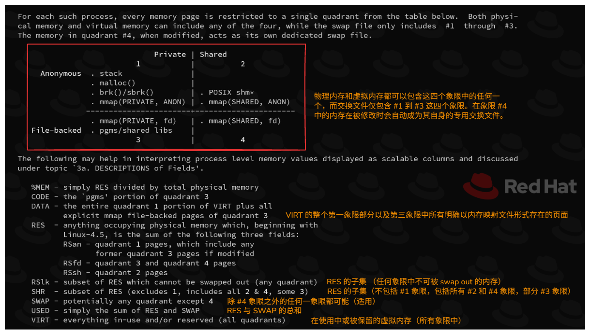
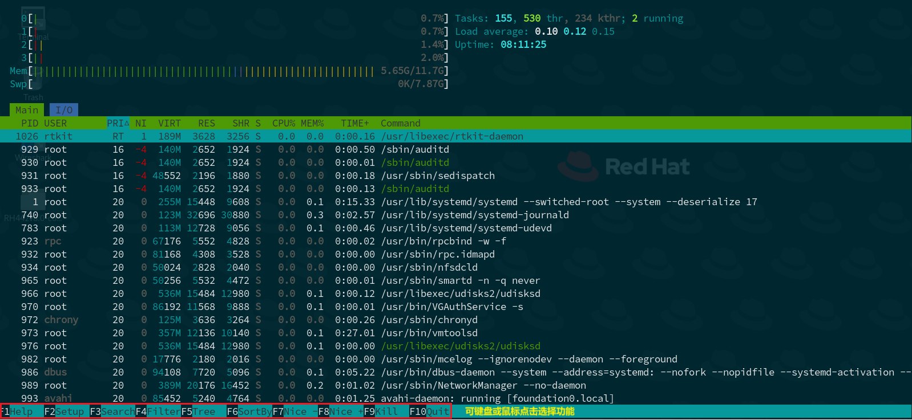
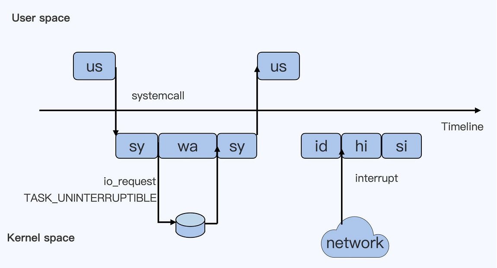
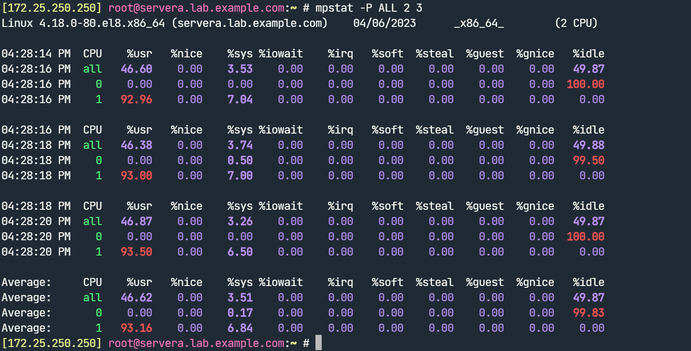
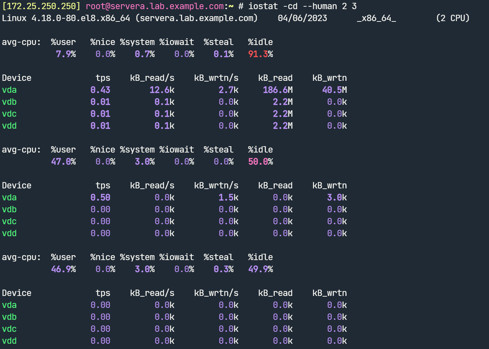
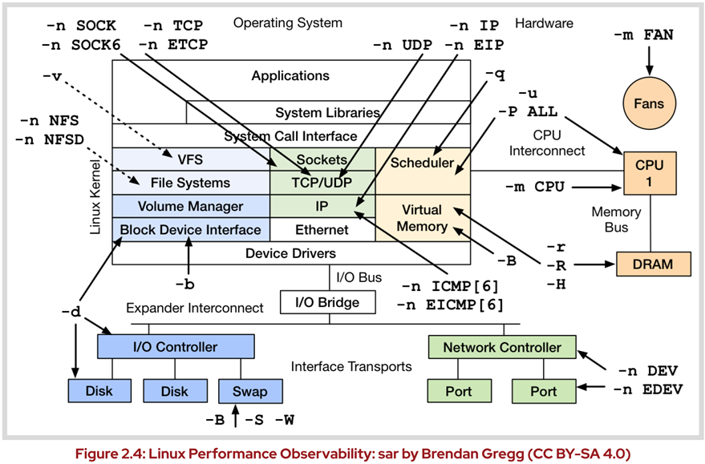
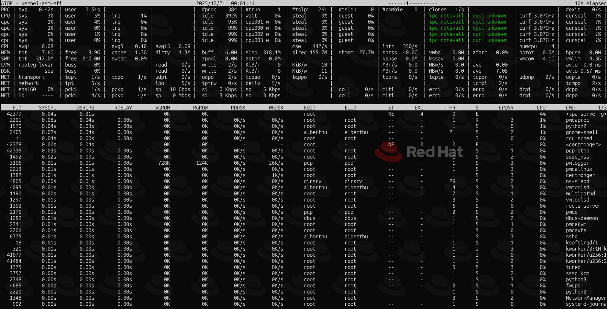
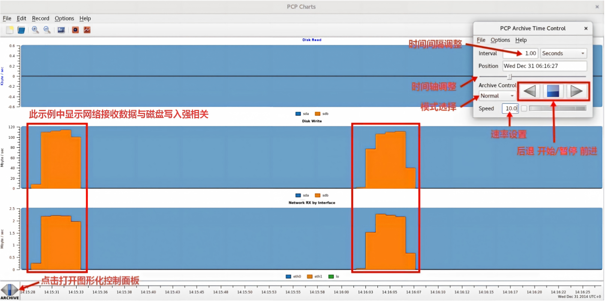

# 📐 Linux 系统性能优化探究 —— 命令集锦

## 1. ps 命令详解
  
```bash
### GNU 风格的命令行 ###
$ sudo pidof <process_name>
# 根据进程名称查找进程 ID
  
$ sudo ps -p $(pidof <process_name>)
# 查看相应进程的概要信息
$ sudo ps -p $(pidof nginx)
  PID TTY      STAT   TIME COMMAND
  865 ?        Ss     0:00 nginx: master process /usr/sbin/nginx
  866 ?        S      0:00 nginx: worker process
  867 ?        S      0:00 nginx: worker process 
# 查看 Nginx 相关进程的概要信息
  
$ sudo ps -p <pid> -o etime
# 查看指定进程自启动为止的消耗（elapsed）时间
$ sudo ps --forest -C <cmdlist>
# 查看指定命令列表的进程树 结构
$ sudo ps --forest -C nginx -o pid,ppid,cmd
# 查看 Nginx 进程的进程树与 pid、ppid 和 cmd
  
$ sudo ps -ef
$ sudo ps -efL
# 全格式输出系统上运行的所有进程，并显示各个进程的线程数（NLWP）。
# 注意：Linux 内核不区分进程与线程，将线程视为轻量级进程（LWP）。
$ sudo ps -L -C <process_name>
# 查看指定进程的线程信息
$ sudo ps -L [-p|p|-q|q] <pid>
# 查看指定进程的线程信息
$ sudo ps -U <user_name>
# 查看指定用户的进程信息
  
### BSD 风格命令行 ###
$ sudo ps aux
  USER       PID %CPU %MEM    VSZ   RSS TTY      STAT START   TIME COMMAND
  root         1  0.0  0.7 180608 13420 ?        Ss   Apr04   0:05 /usr/lib/systemd/systemd --switched-root --system --deserialize 18
  root         2  0.0  0.0      0     0 ?        S    Apr04   0:00 [kthreadd]
  root         3  0.0  0.0      0     0 ?        I<   Apr04   0:00 [rcu_gp]
  root         4  0.0  0.0      0     0 ?        I<   Apr04   0:00 [rcu_par_gp]
  root         6  0.0  0.0      0     0 ?        I<   Apr04   0:00 [kworker/0:0H-kblockd]
  root         8  0.0  0.0      0     0 ?        I<   Apr04   0:00 [mm_percpu_wq]
  root         9  0.0  0.0      0     0 ?        S    Apr04   0:01 [ksoftirqd/0]
  root        10  0.0  0.0      0     0 ?        I    Apr04   0:01 [rcu_sched]
  root        11  0.0  0.0      0     0 ?        S    Apr04   0:00 [migration/0]
  root        12  0.0  0.0      0     0 ?        S    Apr04   0:00 [watchdog/0]
  ...
# 查看所有用户及进程的扩展详情
# 使用 man ps 查看命令输出的 HEADER 详细说明
# 常见的 HEADER 说明：
#   USER：user，也称为 euser，即运行进程的有效用户 ID。
#   PID：pid，即进程 ID。
#   %CPU：%cpu，也称为 cputime 或 realtime ratio，即进程占所有进程的 CPU 使用时间百分比。
#   %MEM：%mem，即进程的常驻物理内存（resident set size）使用率。
#   VSZ：vsz，即进程的虚拟内存大小（单位为 KiB）。
#   RSS：rss，即进程的常驻内存大小（非 swapped 的物理内存大小），其单位为 KiB。
#   TTY：tname，即进程所在的终端，其中 "?" 代表进程无需运行终端。
#   STAT：stat，即进程的状态。
#   START：start_time，即进程启动的时间或日期。
#   TIME：time，即进程从启动到现在积累的 CPU 使用时间，格式为 "[DD-]HH:MM:SS"，该值逐渐累加。
#   CLS：cls，即进程的调度类别（见下文 "进程的调度与优先级说明"）。
#   COMMAND：comm，即进程的可执行程序名称。
  
$ sudo ps axum
# 查看系统上运行的所有进程，并在每个进程下显示该进程的所有线程。
$ sudo ps axl
# 长列表格式输出系统上运行的所有进程
$ sudo ps axjf
# 查看所有进程的进程树信息，与 pstree 命令类似。
  
$ sudo ps ax --format pid,%mem,comm --sort=-%mem
$ sudo ps axo pid,%mem,comm --sort=-%mem
# 查看进程以进程 ID、进程的物理内存使用率以及进程的可执行程序名称输出，并以物理内存使用率
# 的降序（从高到低）排序。
```
  
## 2. ps 与 top 命令中虚拟内存与常驻物理内存的说明

进程的 VSZ 与 RSS 在进程的 `/proc/<pid>/status` 中分别对应 `VmSize` 与 `VmRSS`，而 `VmRSS = RssAnon + RssFile`。
  
```bash
$ sudo cat /proc/4429/status
  ...
  VmSize:   149300 kB
  RssAnon:            3304 kB
  RssFile:            5320 kB
  ...
$ sudo ps axo pid,vsz,rss,comm | grep 4429
  4429 149300  8624 nginx
```
  
top 命令对 PID 4429 的输出如下所示，其中 `VIRT`（进程的虚拟内存）与 ps 命令的 VSZ 相同，`RES`（进程的常驻内存）与 ps 命令的 RSS 相同，SHR 与 `/proc/<pid>/status` 的 RssFile 相同。
  
```bash
$ top -n 1 -p 4429
  Tasks:   1 total,   0 running,   1 sleeping,   0 stopped,   0 zombie
  %Cpu(s):  0.0 us,  0.0 sy,  0.0 ni,100.0 id,  0.0 wa,  0.0 hi,  0.0 si,  0.0 st
  MiB Mem :   1828.8 total,   1268.2 free,    210.0 used,    350.7 buff/cache
  MiB Swap:      0.0 total,      0.0 free,      0.0 used.   1450.3 avail Mem
  
    PID USER      PR  NI    VIRT    RES    SHR S  %CPU  %MEM     TIME+ COMMAND
   4429 nginx     20   0  149300   8624   5320 S   0.0   0.5   0:01.04 nginx 
# top 命令执行 1 秒立即返回
```
  
通过 ps 与 top 命令可查看进程的虚拟内存大小，除此之外也可直接计算进程在虚拟内存中的分段范围而获得其虚拟内存的大小。此方法见 [Linux 用户空间进程虚拟内存布局（layout）](https://github.com/Alberthua-Perl/tech-docs/blob/master/Linux%20%E5%86%85%E6%A0%B8%E5%8E%9F%E7%90%86/Linux%20%E5%86%85%E6%A0%B8%E5%86%85%E5%AD%98%E7%AE%A1%E7%90%86%E9%9B%86%E9%94%A6/Linux%20%E5%86%85%E6%A0%B8%E5%86%85%E5%AD%98%E7%AE%A1%E7%90%86%E9%9B%86%E9%94%A6.md#-linux-%E7%94%A8%E6%88%B7%E7%A9%BA%E9%97%B4%E8%BF%9B%E7%A8%8B%E8%99%9A%E6%8B%9F%E5%86%85%E5%AD%98%E5%B8%83%E5%B1%80layout)。

## 3. top 命令示例

top 命令具有 `交互式` 与 `非交互式` 模式，以下分别给出两种模式的使用示例：

### 3.1 交互模式

```bash
$ top
top - 15:28:45 up 2 days, 16:03,  2 users,  load average: 0.16, 0.15, 0.11
Tasks: 395 total,   1 running, 394 sleeping,   0 stopped,   0 zombie
%Cpu(s):  0.2 us,  0.5 sy,  0.0 ni, 99.1 id,  0.0 wa,  0.2 hi,  0.1 si,  0.0 st
MiB Mem :  11966.5 total,    355.1 free,   8255.3 used,   3356.1 buff/cache
MiB Swap:   8063.0 total,   7446.4 free,    616.6 used.   2844.0 avail Mem

    PID USER      PR  NI    VIRT    RES    SHR S  %CPU  %MEM     TIME+ COMMAND
   2066 qemu      20   0 2812852 720908  21260 S   1.3   5.9  46:00.15 qemu-kvm
 152018 qemu      20   0 4198252 670024  21388 S   1.3   5.5  98:07.77 qemu-kvm
 151777 qemu      20   0 2936548 633020  21628 S   1.0   5.2  47:40.91 qemu-kvm
 151939 qemu      20   0 4641932   1.7g  21480 S   1.0  14.2  51:33.38 qemu-kvm
   1762 kiosk     20   0 4250616 301256 118868 S   0.7   2.5  21:15.58 gnome-shell
 151861 qemu      20   0 4208372   1.1g  21472 S   0.7   9.4  59:48.37 qemu-kvm
      1 root      20   0  261316  15448   9608 S   0.0   0.1   1:56.07 systemd
      2 root      20   0       0      0      0 S   0.0   0.0   0:00.21 kthreadd
      3 root       0 -20       0      0      0 I   0.0   0.0   0:00.00 rcu_gp
      4 root       0 -20       0      0      0 I   0.0   0.0   0:00.00 rcu_par_gp
...
# 直接运行，默认 3 秒刷新一次。

$ top -d <second>
# 指定间隔的秒数刷新一次

$ top -u <username>
# 只显示指定用户的进程列表刷新

$ top -p pid1,pid2,...
# 只显示指定进程的列表刷新
```

- `Shift + M`：根据 `RES` 常驻物理内存从大到小排序
- `Shift + N`：根据 `PID` 从大到小排序
- `Shift + T`：根据 `TIME+` 的 CPU 使用时间从大到小排序
- 💥 交互模式中的 `F` 键可选择更多的显示选项并用于排序

### 3.2 非交互模式

```bash
$ sudo top -n <number>
# -n 选项：Number-of-interations，指定命令交互输出的次数。

$ sudo top -n 5 -d 1 > /path/to/file
# 每 1 秒刷新进程列表，刷新 5 次，但每次只显示一页结果，将其保存至指定文件中。

$ sudo top -b -n 5 -d 1 > /path/to/file
# 每 1 秒刷新进程列表，刷新 5 次，以批处理的形式保存所有进程列表至指定文件中。
```



## 4. htop 命令示例

htop 命令安装：

```bash
$ sudo cat > /etc/yum.repos.d/epel8.repo <<EOF
[epel8]
name = epel8 repository
baseurl = https://mirrors.tuna.tsinghua.edu.cn/epel/8/Everything/x86_64/
enabled = 1
gpgcheck = 0
EOF
# 配置 epel8 软件仓库

$ sudo dnf install -y htop
# htop 软件来源于 epel8 软件仓库
```

`htop` 命令可提供更加便捷与可视化的管理界面，可通过按键与鼠标点击操作。



## 5. free 命令详解

常用选项：

```plaintext
Usage:
 free [options]

Options:
 -b, --bytes         show output in bytes        # 十进制字节表示（bytes）
     --kilo          show output in kilobytes    # 十进制字节表示（kb/KB）
     --mega          show output in megabytes    # 十进制字节表示（mb/MB）
     --giga          show output in gigabytes    # 十进制字节表示（gb/GB）
     --tera          show output in terabytes    # 十进制字节表示（tb/TB）
     --peta          show output in petabytes    # 十进制字节表示（pb/PB）
 -k, --kibi          show output in kibibytes    # 二进制字节表示（kib/KiB）
 -m, --mebi          show output in mebibytes    # 二进制字节表示（mib/MiB）
 -g, --gibi          show output in gibibytes    # 二进制字节表示（gib/GiB）
     --tebi          show output in tebibytes    # 二进制字节表示（tib/TiB）
     --pebi          show output in pebibytes    # 二进制字节表示（pib/PiB）
 -h, --human         show human-readable output  # 以人类可读的方式输出
     --si            use powers of 1000 not 1024
 -l, --lohi          show detailed low and high memory statistics
 -t, --total         show total for RAM + swap             # 显示 RAM + sawp 总共的值
 -s N, --seconds N   repeat printing every N seconds       # 每隔 N 秒打印结果
 -c N, --count N     repeat printing N times, then exit    # 打印 N 次结果
 -w, --wide          wide output                           # 完整打印结果（buffer 与 cache 分开输出）

     --help     display this help and exit
 -V, --version  output version information and exit

For more details see free(1).
```

命令示例：

```bash
$ sudo free -m
$ sudo free -m -w
$ sudo free -m -w -s 3 -t 5
              total        used        free      shared     buffers       cache   available
Mem:          11966        7825         456         410           9        3675        3417
Swap:          8062         321        7741
...
# 每隔 3 秒打印以 MiB 为单位的结果，共采集 5 次。
```

| 字段名          | 含义说明 | /proc/meminfo 中的参数 |
| -------------- | ----- | ----- |
| **total**      | 物理内存或交换内存总容量 | MemTotal / SwapTotal |
| **used**       | 已使用的内存（不含缓存和缓冲区）。计算公式：`used = total - free - buff/cache`。| - |
| **free**       | 完全未被使用的内存 | MemFree / SwapFree |
| **shared**     | 被多个进程共享的内存（通常是 tmpfs）| Shmem |
| **buffers**    | 缓冲区的内存 | Buffers |
| **cache**      | 页缓存（page cache）与 slabs 使用的内存 | Cached + SReclaimable |
| **buff/cache** | 缓存（cache） + 缓冲区（buffer）总和，用于提升磁盘 I/O 性能。| - |
| **available**  | 可用于启动新程序的内存估算值（考虑了可回收的缓存）。**比 `free` 更准确**。| - |

⚠️ 重要：在 free 命令的输出中，相比 free 字段显示的 "完全未被使用的内存"，需更加关注 available 字段的值。`buff/cache` 与 `available` 列的值接近于 0，暗示系统可用内存极低！若 `available` 超过 `total` 的 20%，即使 `used` 接近于 `total`，这种状态也暗示系统是一个健康的系统（healthy system）。

## 6. vmstat 命令详解

- 功能：监控虚拟内存使用情况
- 来源：`procps-ng` 软件包  
- 该命令不带参数将显示自启动以来统计信息的平均值  
- 该命令具有多种统计汇总模式，包括 VM 模式（VM mode）、磁盘模式（disk mode）、磁盘分区模式（disk partition mode）与 slab 模式（slab mode）等，默认情况下以 VM 模式输出。 
- 默认情况下，命令输出的内存单位为 KiB，更改单位的选项：
  - `-S k` 选项：单位 KB
  - `-S m` 选项：单位 MB
  - `-S M` 选项：单位 MiB

  ```bash
  root@ceph-node0:~# vmstat -S M 2 5
  procs -----------memory---------- ---swap-- -----io---- -system-- ------cpu-----
   r  b   swpd   free   buff  cache   si   so    bi    bo   in   cs us sy id wa st
   1  0      0    121      9    160    0    0     7   120  188  276  0  0 99  0  0
   1  0      0    121      9    160    0    0     0    19  305  474  0  0 100  0  0
   0  0      0    121      9    160    0    0     0    19  328  462  0  1 99  0  0
   0  0      0    121      9    160    0    0     0    33  327  473  0  1 99  0  0
   0  0      0    120      9    160    0    0     0    39  351  514  0  0 100  0  0
  # 默认 VM 模式输出，单位为 MiB，每隔 2 秒采样，共采样 4 次。
  ```
  
- vmstat 命令 VM 模式输出的详细说明，如下所示：

  | 类别 | 统计数据 | 定义 |
  | :----- | :----- | :----- |
  | **process** | r     | 等待运⾏时的进程数。 |
  |             | b     | **不可中断睡眠状态中的进程数。** |
  | **memory**  | swpd  | 交换空间中当前使⽤的内存量。 |
  |             | free  | 空闲（⽴即可⽤）内存量。 |
  |             | buff  | ⽤作缓冲区的内存量。 |
  |             | cache | ⽤作缓存区的内存量。 |
  | **swap**    | si    | 每秒换入的内存⻚数。 |
  |             | so    | 每秒换出的内存⻚数。 |
  | **io**      | bi    | 每秒从块设备接收的块数。 |
  |             | bo    | 每秒发送⾄块设备的块数。 |
  | **system**  | in    | **每秒引发的中断数。** |
  |             | cs    | **每秒上下⽂切换次数。** |
  | **cpu**     | us    | 运⾏⽤⼾空间代码所⽤时间占⽐。 |
  |             | sy    | 运⾏内核空间代码所⽤时间占⽐。 |
  |             | id    | 空闲时间占⽐。 |
  |             | wa    | **<font color=orange>等待 I/O 完成时被阻⽌的时间占⽐。</font>** |
  |             | st    | CPU 有⼀个进程准备运⾏，但 CPU 时间被⽀持相应虚拟机的虚拟机监控程序占⽤，该值代表占⽤时间百分⽐（通常因为 CPU 正被另⼀外来虚拟机占⽤）。 |

  > 📄 关于 steal 指标的说明：
  >
  > - steal 表示 “被偷走” 的时间，即物理机上的虚拟机（VM）已经准备好运行，但物理 CPU 被 hypervisor 拿去给其他虚拟机或自身任务使用的时间百分比，其中 hypervisor 可以是 KVM/QEMU、VMware ESX/vSphere、Xen、VirtualBox 等。可理解为，VM 需要 CPU 运行负载，但是物理机 CPU 被其他任务抢走了。
  > - steal 指标只在虚拟环境中才有意义，物理宿主机中该指标通常始终为 0，而在 VM 中才可能出现该指标。
  > - steal 高时，即使 us（用户态）和 sy（内核态）不高、id（空闲）看起来也不低，VM 中应用依然会觉得 “卡顿”，因为 CPU 时间片已被切走。
  > - steal 时间不算在空闲（id）里。如果 steal 是 10%，意味着你的 VM 损失了 10% 本该用于执行任务的 CPU 时间。
  > - **需要注意的是**：us=30, sy=10，表明 VM 实际在用 40% 的 CPU；id=50，表明还有一半空闲；但 st=10，表明有 10% 的时间 VM 被挂起，等着物理 CPU。VM 的实际有效 CPU 利用率 = 30 + 10 = 40%，而理论可用时间只有 90%（因为 10% 被偷了）。如果负载继续上升，性能会急剧恶化。
  > - **常见的引发 steal 指标升高的原因：**</br>
  > &emsp;&emsp;1. 超售（Oversubscription）：宿主机上开了太多 VM，vCPU 总数超过物理 CPU 核心数</br>
  > &emsp;&emsp;2. 邻居吵闹（Noisy Neighbor）：同一宿主机的其他 VM 突发高负载</br>
  > &emsp;&emsp;3. 宿主机自身负载高：hypervisor 或宿主机上的管理进程占用过多 CPU</br>
  > &emsp;&emsp;4. 云厂商的突发型实例：如 AWS T 系列、阿里云突发性能实例，CPU 积分耗尽后被限制

  深度睡眠不可中断进程示意，如下图所示：

  

## 7. sysstat 软件包相关命令

该软件包中主要包含的命令：`mpstat`、`iostat`、`pidstat`、`sar`

### 7.1 mpstat 命令示例

功能：监控 CPU 的使用情况

> 注意：mpstat 命令将使用 `/proc/stat` 与 `/proc/interrupts` 文件进行检索，监控统计 CPU 的使用状态。

```bash
$ sudo mpstat -P { <cpu_list> | ALL } \
  -N { <node_list> | ALL } \
  <interval> <count>
# mpstat 命令查看指定 CPU 核心或 NUMA 节点的使用状态
    
$ sudo mpstat -P ALL 1 10
# 实时监控所有 CPU 核心的使用状态，每隔 1 秒采集样本共采集 10 次。
    
$ sudo mpstat -P 1 -N 0 -o JSON 2 5 > mpstat-dump.json
# 实时监控 1 号逻辑 CPU、0 号 NUMA 节点的 CPU 状态，每隔 2 秒采集样本共采集 5 次，
# 结果输出为指定 JSON 文件。
```



若需启用实时输出的高亮显示，可设置 `S_COLORS` 环境变量为 `always` 或 `auto`。
  
### 7.2 iostat 命令示例

- 功能：监控磁盘的 I/O 使用情况
- iostat 命令使用内核性能计数器（`perf_event`）统计生成两类报告：CPU 使用报告、设备使用报告
- 常用选项：
  - -c 选项：显示 CPU 使用率报告
  - -d 选项：显示设备使用率报告
  - -x 选项：显示更多的 I/O 统计指标
  - -y 选项：省略自系统启动以来第一行的统计信息
  - -z 选项：省略统计无任何活动的设备
  - --human 选项：显示人类可读的容量格式

  ```bash
  $ sudo iostat 1 5
  # 每 1 秒采集样本共采集 5 次

  $ sudo iostat -cdyz --human 2 10 > /path/to/file
  # sysstat 软件包工具输出的第一行是自系统启动以来统计的平均值，此行可不考虑在内。
  # 每 2 秒采集样本共采集 10 次，实时监控 CPU 与磁盘设备的状态。
  # 输出中的 tps 事务数又称为 IOPS
  ```

  

  ```bash
  $ sudo iostat -dtxyz --human 1 5
  Linux 4.18.0-305.el8.x86_64 (foundation0.ilt.example.com)       09/05/2025      _x86_64_        (4 CPU)

  09/05/2025 11:48:13 AM
  Device            r/s     w/s     rkB/s     wkB/s   rrqm/s   wrqm/s  %rrqm  %wrqm r_await w_await aqu-sz rareq-sz wareq-sz  svctm  %util
  sda              0.00   28.00      0.0k      1.5M     0.00     2.00   0.0%   6.7%    0.00    0.21   0.01     0.0k    53.3k   0.11   0.3%

  09/05/2025 11:48:14 AM
  Device            r/s     w/s     rkB/s     wkB/s   rrqm/s   wrqm/s  %rrqm  %wrqm r_await w_await aqu-sz rareq-sz wareq-sz  svctm  %util
  sda              0.00    1.00      0.0k      8.0k     0.00     0.00   0.0%   0.0%    0.00    0.00   0.00     0.0k     8.0k   1.00   0.1%
  ...
  # 每 1 秒采集磁盘样本，共采集 5 次，显示更多 I/O 统计指标。
  ```

  以上命令输出中的各参数如下所示：

  | 字段 | 含义（单位）| 简要说明 |
  | ----- | ----- | ----- |
  | **r/s**      | 每秒读 I/O 次数（read requests per second） | 读请求频率 |
  | **w/s**      | 每秒写 I/O 次数（write requests per second） | 写请求频率 |
  | **rkB/s**    | 每秒读数据量（kB） | 读吞吐 |
  | **wkB/s**    | 每秒写数据量（kB） | 写吞吐 |
  | **rrqm/s**   | 每秒合并的读请求数 | 读合并量 |
  | **wrqm/s**   | 每秒合并的写请求数 | 写合并量 |
  | **%rrqm**    | 读请求合并比例（%） | 读合并率 |
  | **%wrqm**    | 写请求合并比例（%） | 写合并率 |
  | **r\_await** | 读请求平均等待+服务时间（ms） | 读延迟 |
  | **w\_await** | 写请求平均等待+服务时间（ms） | 写延迟 |
  | **aqu-sz**   | 平均队列长度（活跃请求数） | 队列深度 |
  | **rareq-sz** | 平均读请求大小（kB） | 读块大小 |
  | **wareq-sz** | 平均写请求大小（kB） | 写块大小 |
  | **svctm**    | 平均服务时间（ms，已废弃） | 可忽略 |
  | **%util**    | 设备繁忙时间占比（%） | 磁盘饱和度 |

  参数性能参考：

  1️⃣ %util > 80% 且 r_await/w_await > 10 ms → 磁盘瓶颈。</br>
  2️⃣ aqu-sz > 1 且 svctm 低 → 队列较深，磁盘还能承担负载。</br>
  3️⃣ %rrqm/%wrqm 高 → 合并生效，CPU 省中断。</br>
  
### 7.3 pidstat 命令示例

- 功能：监控进程的使用情况
- 常用选项：
  - -p 选项：进程 PID
  - -t 选项：报告指定进程的线程统计情况
  - -u 选项：报告 CPU 使用率
  - -r 选项：报告页面错误（page faults）与内存使用率
  - -d 选项：报告磁盘统计情况
  - -w 选项：报告任务切换活动（进程的上下文切换）

- 全局视角：快速定位候选进程

  ```bash
  ### 命令格式 ###
  $ pidstat <interval> <count>

  ### 示例 ###
  $ cores=$(lscpu | awk '/^CPU\(s\)/ { print $NF }')    # 正则表达式中 \ 表示括号本身（不是捕获分组）
  $ pidstat 1 5 | tail -n +2 | grep -Ev 'Average|Command' | sort -k9 -nr | awk -v cores="$cores" 'BEGIN{ print "%CPU  Command" }{ if ($9>cores) print $9"  "$NF }'
  %CPU  Command
  4.95  qemu-kvm
  4.85  qemu-kvm
  # 语法点：
  #   tail -n +2：从开头第二行开始显示
  #   sort -k9 -nr：根据第9列，按照数值大小反向排序（从大到小）
  #   -v cores="$cores"：bash 中的变量传递
  ```

- 进程视角：进程的 CPU、内存、磁盘状态统计

  ```bash
  ### 命令格式 ###
  $ pidstat -p <pid> -t -u -r -d <interval> <count>

  $ pidstat -p <pid> -w <interval> <count>
  # 查看指定进程的自愿与非自愿上下文切换的状态，指定时间间隔（秒）与采集数量。
  # 重要指标：
  #   1. cswch/s：每秒进程的自愿上下文切换（voluntary context switch）的总数。当一个任务因需要某种不可用的资源而受阻时，就会发生一种自愿的切换操作。
  #   2. nvcswch/s：每秒进程的非自愿上下文切换（involuntary context switch）的总数。当一个任务在其所占用的时间片内完成执行后，却被迫放弃处理器时，就会发生一种非自愿的切换情况。

  ### 示例 ###
  $ pidstat -p $(pidof prometheus) -turd 1 5
  ```
  
### 7.4 sar 命令示例

- 功能：系统性能监控与报告工具
- sar 命令从内核性能计数器采集指标

  

- 常用选项：
  - -B 选项：报告 **页面级内存压力** 统计
  
    ```bash
    $ sudo sar -B 1 3
    Linux 4.18.0-305.el8.x86_64 (foundation0.ilt.example.com)       09/05/2025      _x86_64_        (4 CPU)

    08:31:42 PM  pgpgin/s pgpgout/s   fault/s  majflt/s  pgfree/s pgscank/s pgscand/s pgsteal/s    %vmeff
    08:31:43 PM      0.00      0.00     24.00      0.00    163.00      0.00      0.00      0.00      0.00
    08:31:44 PM      0.00      0.00  13558.00      0.00   2058.00      0.00      0.00      0.00      0.00
    08:31:45 PM      0.00     89.00  45575.00      2.00   7720.00      0.00      0.00      0.00      0.00
    Average:         0.00     29.67  19719.00      0.67   3313.67      0.00      0.00      0.00      0.00
    ```

    | 字段 | 含义（单位） | 内核源事件 | 简要说明 |
    | ----- | ----- | ----- | ----- |
    | **pgpgin/s**  | 每秒从块设备 **读** 的页数（4 KB 页）| pgpgin | 内存 **换入** 或 **文件映射读** 总量 |
    | **pgpgout/s** | 每秒向块设备 **写** 的页数（4 KB 页）| pgpgout | 内存 **换出** 或 **脏页回写** 总量 |
    | **fault/s**   | 每秒 **缺页异常** 次数（minor + major）| pgfault | 地址不存在的总次数 |
    | **majflt/s**  | 每秒 **大缺页**（需磁盘 I/O）次数 | pgmajfault | 真正去磁盘读页的次数 |
    | **pgfree/s**  | 每秒放入 **空闲链表** 的页数 | pgfree | 内核 **主动回收** 的页数 |
    | **pgscank/s** | 每秒 **kswapd** 扫描的页数 | pgscank | 后台回收线程工作量 |
    | **pgscand/s** | 每秒 **直接回收** 扫描的页数 | pgscand | 进程自己回收，**阻塞** |
    | **pgsteal/s** | 每秒 **被回收再利用** 的页数（从页缓存与 swap 缓存中回收）| pgsteal | 真正 **腾出来** 的页 |
    | **%vmeff**    | 回收效率 = pgsteal / (pgscank+pgscand) × 100 % | 手工算 | **越高越好**；< 30 % 说明扫描多、偷少，内存压力大 |

    参数性能参考：

    1️⃣ pgpgin/out 高 → 大量文件读写或 swap 换入换出。</br>
    2️⃣ majflt 高 → 内存不足，频繁去磁盘读页。</br>
    3️⃣ pgscand 高 → 进程同步回收，会阻塞业务。</br>
    4️⃣ %vmeff < 30 → 回收效率低，内存已吃紧，考虑加内存或杀进程。</br>

  - -b 选项：报告所有设备的 I/O 统计
  - -d 选项：报告每个块设备的磁盘 I/O 统计

    ```bash
    $ sudo sar -d 1 3
    ```

    | 字段 | 含义（单位） | 简要说明 |
    | ----- | ----- | ----- |
    | **tps**     | 每秒 I/O 请求数（合并后）| 磁盘 “事务” 频率 |
    | **rkB/s**   | 每秒读数据量（kB）| 读吞吐 |
    | **wkB/s**   | 每秒写数据量（kB）| 写吞吐 |
    | **areq-sz** | 平均每个 I/O 请求的大小（kB）| 块大小；越大越顺序 |
    | **aqu-sz**  | 平均活跃队列长度（即 **in-flight I/O 数**）| 队列深度；>1 表示队列积压 |
    | **await**   | 平均 I/O 响应时间（ms）= 队列 + 服务 | 用户可见延迟 |
    | **svctm**   | 平均 “服务” 时间（ms，已废弃）| 可忽略，仅保留兼容 |
    | **%util**   | 设备繁忙时间占比（%）| **磁盘饱和度**；≥ 80% 即瓶颈 |

    参数性能参考：

    1️⃣ %util ≥ 80% 且 await > 10 ms → 磁盘瓶颈。</br>
    2️⃣ aqu-sz > 1 且 svctm 低 → 队列较深，磁盘还能承担负载。</br>
    3️⃣ areq-sz 大 (>128 kB) → 顺序 I/O；小 (4 kB) → 随机 I/O。</br>

  - -n 选项：报告网络统计（针对不同关键字的参数可参考 man sar）
  - -r 选项：报告 **系统级内存统计**

    ```bash
    $ sudo sar -r 1 5
    Linux 4.18.0-305.el8.x86_64 (foundation0.ilt.example.com)       09/05/2025      _x86_64_        (4 CPU)

    11:25:44 PM kbmemfree   kbavail kbmemused  %memused kbbuffers  kbcached  kbcommit   %commit  kbactive   kbinact   kbdirty
    11:25:45 PM    342612   2496800  11911092     97.20      8312   2855520  16613152     81.00   4265256   4723928        16
    11:25:46 PM    342612   2496800  11911092     97.20      8312   2855520  16613152     81.00   4265256   4723928        16
    11:25:47 PM    342612   2496800  11911092     97.20      8312   2855520  16613152     81.00   4265256   4723928        16
    11:25:48 PM    233788   2380588  12019916     98.09      8312   2852496  16735560     81.60   4250244   4843812        24
    11:25:49 PM    166660   2313464  12087044     98.64      8312   2852636  16835828     82.09   4250272   4918500      1524
    Average:       285657   2436890  11968047     97.67      8312   2854338  16682169     81.34   4259257   4786819       319
    ```

    | 字段 | 含义（单位：kB）| 简要说明 |
    | ----- | ----- | ----- |
    | **kbmemfree** | 完全未被使用的物理内存 | 传统 “空闲” 值 |
    | **kbavail**   | **应用程序能拿到的** 内存估算 | 接近于 `free -k` 的 **available** |
    | **kbmemused** | 已被用掉的物理内存 | `总内存 - kbmemfree` |
    | **%memused**  | 已用占比 | `kbmemused / 总内存 × 100%` |
    | **kbbuffers** | 块设备 **buffer** 缓存 | 旧式块层元数据缓存 |
    | **kbcached**  | **page cache** 文件系统缓存 | 可回收，不影响真正可用内存 |
    | **kbcommit**  | 当前已 **承诺** 的虚拟内存总量 | 所有进程 `malloc/mmap` 申请量 **上限** |
    | **%commit**   | 承诺占比 | `kbcommit / (总内存 + swap) × 100%`；> 100 % 会触发 OOM |
    | **kbactive**  | **活跃** LRU 链表页 | 最近被访问，**不易回收** |
    | **kbinact**   | **非活跃** LRU 链表页 | 一段时间未访问，**优先回收** |
    | **kbdirty**   | 等待回写的 **脏页** | 脏数据量; > 10 % 内存会触发后台写回 |

    参数性能参考：

    1️⃣ kbavail 低 → 程序快没钱了，先看缓存能否回收。</br>
    2️⃣ %commit > 90 % → 虚拟内存快超售，可能 OOM。</br>
    3️⃣ kbdirty 高 → 大量写，观测回写延迟是否飙高。</br>

  - -q 选项：报告队列长度与负载
  - -o 选项：将输出写入指定文件，以二进制数据保存。
  - -f 选项：读取指定数据文件

## 8. Performance Co-Pilot (PCP) 组件使用

### 8.1 PCP 实时性能监测

安装 PCP 组件：

```bash
$ sudo dnf install -y pcp pcp-gui pcp-system-tools
# 安装 PCP、PCP 图形化软件包与 PCP 系统工具包
$ sudo systemctl enable --now pmcd.service pmlogger.service
# 启动并开机自启 pmcd 与 pmlogger 守护进程
# pmlogger 服务将指标日志存储于 /var/log/pcp/pmlogger/<hostname>/ 目录中
```

PCP 命令行性能采集工具：pcp-system-tools 软件包安装于 `/usr/libexec/pcp/bin/` 目录中：

```bash
$ export PATH=/usr/libexec/pcp/bin:$PATH
```

**pcp-free 命令**：等价于 pcp free -m 或 free -m

```bash
$ sudo pcp-free -m 
                total        used        free      shared  buff/cache   available
  Mem:           7741        2621        1949         318        3169        4493
  Swap            511           0         511
```

**pcp-dstat 命令**：等价于 pcp dstat 或 dstat

```bash
$ sudo pcp-dstat [--time|--sys|--cpu|--page|--disk|--net] <delay> <count>
# 指定间隔时间（秒）与采集样本数进行指标采集
$ sudo pcp-dstat --time --sys --cpu --page --disk --net 1 5
----system---- ---system-- ----total-usage---- ---paging-- -dsk/total- -net/total-
     time     | int   csw |usr sys idl wai stl|  in   out | read  writ| recv  send
20-12 23:47:44|           |                   |           |           |
20-12 23:47:45| 214   369 |  0   0  99   0   0|   0     0 |   0     0 |  63B  867B
20-12 23:47:46| 219   356 |  0   0  99   0   0|   0     0 |   0     0 |  64B  331B
20-12 23:47:47| 190   317 |  0   0  99   0   0|   0     0 |   0     0 |  64B  331B
20-12 23:47:48| 372   379 |  2   1  96   0   0|   0     0 |   0    16k|  64B  332B
20-12 23:47:49| 214   323 |  1   0  99   0   0|   0     0 |   0     0 |  64B  339B
```

**pcp-atop 命令**：等价于 atop 命令

```bash
$ pcp-atop
# 实时刷新系统资源使用信息
```



**pmstat 命令**：等价于 vmstat 命令

```bash
$ pmstat -t <interval>[seconds|minutes] -s <count>
# 高层次的系统性能查看工具，在指定的时间间隔内（默认 5 秒刷新一次）。
$ pmstat -t 2s -s 5
@ Sat Dec 20 23:55:38 2025
 loadavg                      memory      swap        io    system         cpu
   1 min   swpd   free   buff  cache   pi   po   bi   bo   in   cs  us  sy  id
    0.08      0  4041m   6176  1374m    0    0    0    0  199  344   0   0 100
    0.07      0  4041m   6176  1374m    0    0    0    0  223  357   0   1  99
    0.07      0  4041m   6176  1374m    0    0    0   23  297  403   0   0  99
    0.07      0  4041m   6176  1374m    0    0    0    0  229  350   0   1  99
    0.39      0  4041m   6176  1374m    0    0    0    3  215  340   0   0  99
# 指定 2 秒，采集 5 次样本。
```

**pmcollectl 命令**：Python 程序性能统计接口

```bash
$ pmcollectl -c 5 -i 2    # 间隔2秒，统计5次。
#<--------CPU--------><----------Disks-----------><----------Network---------->
#cpu sys inter  ctxsw KBRead  Reads KBWrit Writes KBIn  PktIn  KBOut  PktOut
   3   2   470    609     0      0      0      0   19     30     17     20
   2   1   453    578     0      0      0      0   35    139     20    126
   3   2   437    583     0      0      0      0   15     19     15     17
   3   2   367    527     0      0    113     12    0      2      0      2
   2   1   398    521     0      0      0      0    6     74      6     74
```

### 8.2 PCP 性能指标查询

pmval 命令查询性能指标归档日志：

```bash
$ pminfo
# 查看 Co-Pilot 数据库中的性能指标的类型，可通过 pmval 命令列出数据库中的数据。

$ pminfo -dt <metrics_type>
# 查看指定指标类型的说明
$ pminfo -dt kernel.percpu.cpu.idle

$ pmval -s 5 -t 2 proc.nprocs
  metric:    proc.nprocs
  host:      servera.lab.example.com
  semantics: instantaneous value
  units:     none
  samples:   5
  interval:  2.00 sec
          111
          111
          111
          111
          111
# 实时刷新时间间隔 2 秒，共统计 5 次的瞬时进程数。

$ pmval -a /var/log/pcp/pmlogger/servera.lab.example.com/20210609.14.52.0 \
  -S '@ Wed Jun 09 08:10:00 2021' -T '@ Wed Jun 09 22:19:00 2021' \
  kernel.all.load
# pmlogger 归档日志路径：/var/log/pcp/pmlogger/<fqdn>/xxxxxxxx.xx.xx.x
# 查看默认指标数据归档文件中指定的指标类型日志
# -a 选项指定性能指标的归档日志
```

### 8.3 PCP 图形实用程序绘制性能指标

PCP 图形实用程序 pmchart可根据日志归档文件查询历史性能指标，以及实时性能指标。pmchart 查询历史性能指标需要提前定义查询配置文件，用以配置图形界面显示格式，如下所示：

方式 1️⃣：统计 CPU 相关性能指标，文件名 cpu-util.conf。

```plaintext
#kmchart
version 1

chart title "CPU Utilization" style stacking
    plot legend "User" color #2ca02c metric kernel.all.cpu.user
    plot legend "System" color #ff7f0e metric kernel.all.cpu.sys
    plot legend "Idle" color #1f77b4 metric kernel.all.cpu.idle
    plot legend "Process" color #ff0404 metric kernel.all.nprocs
```

方式 2️⃣：统计网络与磁盘的 I/O 吞吐，文件名 net-disk-usage.conf。

```plaintext
#kmchart
version 1

chart title "Disk Read" style stacking    #柱状图表示
#chart title "Disk Read" style plot    #折线图表示
    plot legend "sda" color #1f77b4 metric disk.dev.read_bytes instance "sda"
    plot legend "sdb" color #ff7f0e metric disk.dev.read_bytes instance "sdb"

chart title "Disk Write" style stacking    #柱状图表示
#chart title "Disk Write" style plot    #折线图表示
    plot legend "sda" color #1f77b4 metric disk.dev.write_bytes instance "sda"
    plot legend "sdb" color #ff7f0e metric disk.dev.write_bytes instance "sdb"

#chart title "Network RX by Interface" style plot
chart title "Network RX by Interface" style stacking
    plot legend "eth0" color #1f77b4 metric network.interface.in.bytes instance "eth0"
    plot legend "eth1" color #ff7f0e metric network.interface.in.bytes instance "eth1"
    plot legend "lo"   color #2ca02c metric network.interface.in.bytes instance "lo"
```

> 💥 注意：需要根据实际主机节点上的情况替换对应字段，如 sda、sdb、eth0、eth1 等。

```bash
$ pmchart -a /var/log/pcp/pmlogger/foundation0.ilt.example.com/20260830.00.10.0 -c pcp-view-examples/net-disk-usage.conf &
# GUI 模式：根据归档的性能指标日志文件与 pmchart 配置文件绘制图像
```



### 8.4 📢 讨论：Linux 中 PCP 的 pmlogger 默认是采集 PCP 所有的性能指标吗？

pmlogger 启动后只在 `/var/lib/pcp/config/pmlogger/config.default`（pmlogger 自动生成）中预先定义的一组 “默认指标”，并非采集 `pminfo` 命令返回的所有性能指标。

1️⃣ 自定义修改性能指标：

- 方式1：

  ```bash
  $ sudo egrep '^\s+[a-z]' /var/lib/pcp/config/pmlogger/config.default | sed 's/^\t//'
  # 过滤 PCP 默认收集的性能指标
  # 注意：此配置文件可由 pmlogconf 命令更新并覆盖其中的配置，若通过手动方式更新其中自定义的性能指标，那么需注意备份此文件，防止 pmlogconf 命令的配置覆盖。

  $ sudo vim /var/lib/pcp/config/pmlogger/config.default
    ...
    log advisory on default {
      ...
    }
    # 在对应组（group）中添加自定义的性能指标

  $ sudo systemctl restart pmlogger.service
  # 重启 pmlogger 服务
  ```

- 👍 方式2（推荐）：
  
  ```bash
  $ sudo vim /var/lib/pcp/config/pmlogger/customized_metrics
    log advisory on default {
      mem.numa.util.dirty
      mem.numa.alloc.hit
    }
    # 创建自定义性能指标文件，文件名可自行指定，pmlogger 将只采集此文件中的性能指标。

    $ sudo vim /etc/pcp/pmlogger/control.d/local
      ...
      #LOCALHOSTNAME  y   n   PCP_LOG_DIR/pmlogger/LOCALHOSTNAME      -r -T24h10m -c config.default -v 100Mb
      LOCALHOSTNAME   y   n   PCP_LOG_DIR/pmlogger/LOCALHOSTNAME      -r -T24h10m -c customized_metrics -v 100Mb
      # 将 -c 选项指定的文件 config.default 修改为自定义文件 customized_metrics

    $ sudo systemctl restart pmlogger.service
    # 重启 pmlogger 服务
    ```

2️⃣ 交互式修改性能指标：

  ```bash
  $ sudo pmlogconf -r /var/lib/pcp/config/pmlogger/config.default

  Group: utilization per CPU
  Log this group? [n] n

  Group: utilization (usr, sys, idle, ...) over all CPUs
  Log this group? [y] y
  ...
  # 交互式指定所需的性能指标组
  ```

### 8.5 📢 讨论：是否可以自定义只需要的性能指标，并且采集的时间间隔能指定吗？

调整采样的时间间隔依然可在 `/etc/pcp/pmlogger/control.d/local` 文件中调整

### 8.6 PCP 参考文档说明

- 💪 [Index of Performance Co-Pilot (PCP) articles, solutions, tutorials and white papers](https://access.redhat.com/articles/1145953)
- ☺️ [Performance Co-Pilot (PCP) Data Sheet](https://access.redhat.com/articles/3119481)
- [How do I install Performance Co-Pilot (PCP) on my RHEL server to capture performance logs](https://access.redhat.com/solutions/1137023)
- [Side-by-side comparison of PCP tools with legacy tools](https://access.redhat.com/articles/2372811)
- [Interactive web interface for Performance Co-Pilot](https://access.redhat.com/articles/1378113)
- 📊 [Visualizing system performance with RHEL 8 using Performance Co-Pilot (PCP) and Grafana (Part 1)](https://www.redhat.com/en/blog/visualizing-system-performance-rhel-8-using-performance-co-pilot-pcp-and-grafana-part-1)
- 📊 [Visualizing system performance with RHEL 8 using Performance Co-Pilot (PCP) and Grafana (Part 2)](https://www.redhat.com/en/blog/visualizing-system-performance-rhel-8-using-performance-co-pilot-pcp-and-grafana-part-2)
- [Chapter 10. Setting up graphical representation of PCP metrics](https://access.redhat.com/documentation/en-us/red_hat_enterprise_linux/8/html/monitoring_and_managing_system_status_and_performance/setting-up-graphical-representation-of-pcp-metrics_monitoring-and-managing-system-status-and-performance#doc-wrapper)
- [Introduction to storage performance analysis with PCP](https://access.redhat.com/articles/2450251)
