# ⚗️ Linux 系统性能优化白皮书

## 文档说明

- 以下示例均在 RHEL 8 中验证实现，若针对其他 Linux 发行版请自行测试。
- 此文档用于描述 Linux 中常用的系统监控与性能优化工具的功能与使用场景。

## 文档目录

- [⚗️ Linux 系统性能优化白皮书](#️-linux-系统性能优化白皮书)
  - [文档说明](#文档说明)
  - [文档目录](#文档目录)
  - [🛠️ 1. Linux 常用系统性能监控工具](#️-1-linux-常用系统性能监控工具)
    - [1.1 Linux 性能观测性工具图谱](#11-linux-性能观测性工具图谱)
    - [1.2 Linux 静态性能工具图谱](#12-linux-静态性能工具图谱)
    - [📐 1.3 Linux 系统性能优化探究：命令集锦](#-13-linux-系统性能优化探究命令集锦)
  - [🚧 2. Linux 系统资源限制 CGroup](#-2-linux-系统资源限制-cgroup)
  - [🚀 3. Linux 性能分析工具之 Perf](#-3-linux-性能分析工具之-perf)
  - [🌰 4. kernel 相关软件包下载](#-4-kernel-相关软件包下载)
  - [5. 优化 CPU 利用](#5-优化-cpu-利用)
    - [🧩 5.1 CPU 三大架构：SMP、NUMA 与 MPP](#-51-cpu-三大架构smpnuma-与-mpp)
    - [⏳ 5.2 CPU 时钟周期、机器周期、指令周期的关系](#-52-cpu-时钟周期机器周期指令周期的关系)
    - [💾 5.3 x86\_64 架构的常用寄存器示例](#-53-x86_64-架构的常用寄存器示例)
      - [5.3.1 通用寄存器（General-Purpose Registers）](#531-通用寄存器general-purpose-registers)
      - [5.3.2 程序计数器（Program Counter Registers, PC）](#532-程序计数器program-counter-registers-pc)
      - [5.3.3 标志寄存器（Flags Registers）](#533-标志寄存器flags-registers)
    - [⏱️ 5.4 进程的调度与优先级](#️-54-进程的调度与优先级)
      - [5.4.1 常用 CPU 调度 man 手册](#541-常用-cpu-调度-man-手册)
      - [5.4.2 Linux 中的进程调度策略](#542-linux-中的进程调度策略)
      - [5.4.3 Linux 进程调度优先级的分类](#543-linux-进程调度优先级的分类)
      - [5.4.4 Linux 中的上下文切换（context switch）](#544-linux-中的上下文切换context-switch)
      - [5.4.5 设置进程的调度选项](#545-设置进程的调度选项)
    - [📼 5.5 CPU Cache 缓存架构](#-55-cpu-cache-缓存架构)
    - [🏆 5.6 Linux CPU 性能优化实战：从应用、GCC、调度器到 CPU 绑定与内存分配器](#-56-linux-cpu-性能优化实战从应用gcc调度器到-cpu-绑定与内存分配器)
  - [🪛 6. 调优内存使用](#-6-调优内存使用)
    - [🔬 6.1 Linux 用户空间进程虚拟内存布局（layout）](#-61-linux-用户空间进程虚拟内存布局layout)
    - [🔥 6.2 Linux 内核内存管理集锦](#-62-linux-内核内存管理集锦)
    - [💪 6.3 Linux 内存管理全景图V2.0](#-63-linux-内存管理全景图v20)
  - [💡 7. /proc 伪文件系统释义](#-7-proc-伪文件系统释义)
  - [🆒 8. systemd drop-in 文件系统性能设置](#-8-systemd-drop-in-文件系统性能设置)
  - [🧬 9. eBPF 的 BCC 工具集运行示例](#-9-ebpf-的-bcc-工具集运行示例)
    - [9.1 BPF 编译器集合简介](#91-bpf-编译器集合简介)
    - [9.2 常见 BCC 工具](#92-常见-bcc-工具)
  - [⚕️ 10. Linux 磁盘性能测试：FIO \& smartctl](#️-10-linux-磁盘性能测试fio--smartctl)
  - [📚 参考链接](#-参考链接)

## 🛠️ 1. Linux 常用系统性能监控工具

> 📜 以下命令均可使用 man 命令查询详尽的使用说明

### 1.1 Linux 性能观测性工具图谱

<center>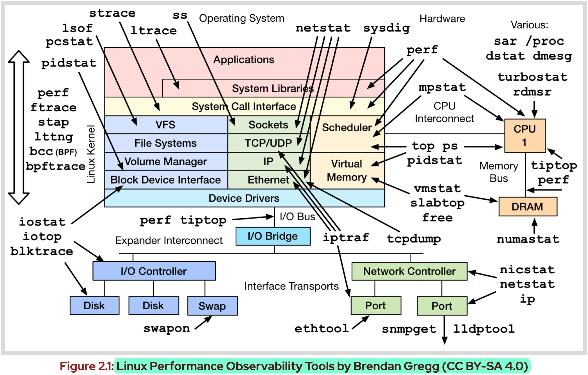</center>

### 1.2 Linux 静态性能工具图谱

<center>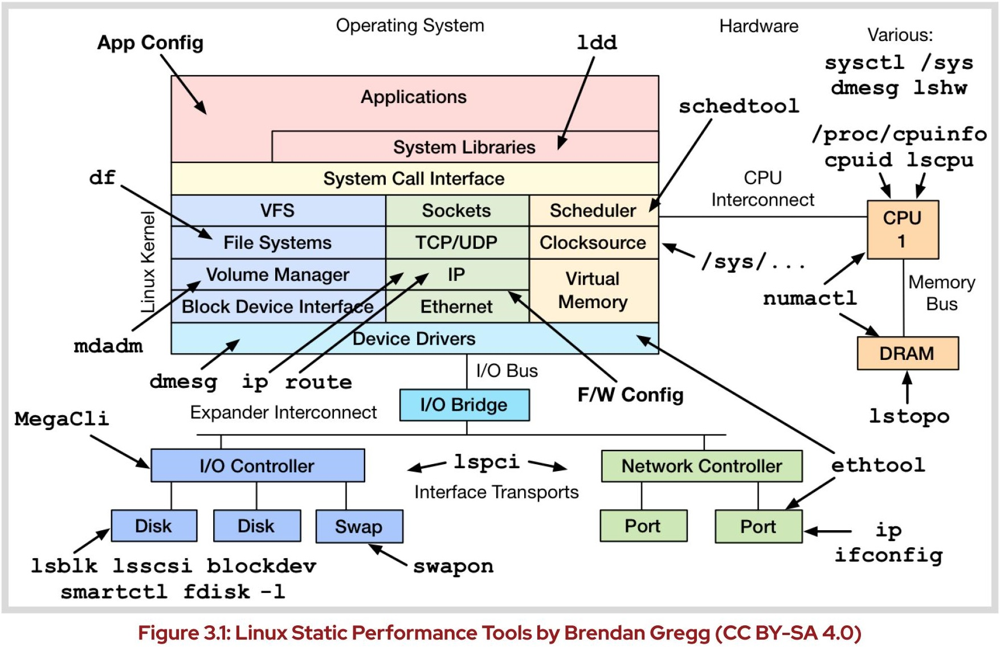</center>

### 📐 1.3 [Linux 系统性能优化探究：命令集锦](https://github.com/Alberthua-Perl/tech-docs/blob/master/Linux%20%E5%9F%BA%E7%A1%80%E4%B8%8E%E8%BF%9B%E9%98%B6/Linux%20%E7%B3%BB%E7%BB%9F%E6%80%A7%E8%83%BD%E4%BC%98%E5%8C%96%E7%99%BD%E7%9A%AE%E4%B9%A6/Linux%20%E7%B3%BB%E7%BB%9F%E6%80%A7%E8%83%BD%E4%BC%98%E5%8C%96%E6%8E%A2%E7%A9%B6%EF%BC%9A%E5%91%BD%E4%BB%A4%E9%9B%86%E9%94%A6.md)

## 🚧 2. [Linux 系统资源限制 CGroup](https://github.com/Alberthua-Perl/tech-docs/blob/master/Linux%20%E5%9F%BA%E7%A1%80%E4%B8%8E%E8%BF%9B%E9%98%B6/Linux%20%E7%B3%BB%E7%BB%9F%E8%B5%84%E6%BA%90%E9%99%90%E5%88%B6/Linux%20%E7%B3%BB%E7%BB%9F%E8%B5%84%E6%BA%90%E9%99%90%E5%88%B6.md)

## 🚀 3. [Linux 性能分析工具之 Perf](https://github.com/Alberthua-Perl/tech-docs/blob/master/Linux%20%E5%9F%BA%E7%A1%80%E4%B8%8E%E8%BF%9B%E9%98%B6/Linux%20%E6%80%A7%E8%83%BD%E5%88%86%E6%9E%90%E5%B7%A5%E5%85%B7%E4%B9%8B%20perf/Linux%20%E6%80%A7%E8%83%BD%E5%88%86%E6%9E%90%E5%B7%A5%E5%85%B7%E4%B9%8B%20perf.md)

## 🌰 4. kernel 相关软件包下载

- 与系统诊断与优化的部分工具依赖内核的版本，如 perf、SystemTap 等，因此在使用此类工具时需安装内核相关的软件包，并且其版本必须与当前系统内核完全一致。
- 相关的内核软件包安装可参考 [How can I download or install kernel debuginfo packages for RHEL systems?](https://access.redhat.com/solutions/9907#masthead)

## 5. 优化 CPU 利用

### 🧩 5.1 CPU 三大架构：SMP、NUMA 与 MPP

- `SMP`（Symmetric /sɪˈmetrɪk/ Multiprocessing，对称多处理器），顾名思义, 在 SMP 中所有的处理器都是对等的, 它们通过总线连接共享同一块物理内存，这也就导致了系统中所有资源（CPU、内存、io 等）都是共享的。当打开服务器的背板盖，如果发现有多个 CPU 的槽位，但是却连接到同一个内存插槽的位置，那一般就是 SMP 架构的服务器。日常中常见的 PC、笔记本、手机还有一些老旧的服务器都是此架构，其架构简单，但是拓展性能较差。SMP 架构在 Linux 中如下所示：

  ```bash
  $ sudo ls -lhd /sys/devices/system/node/node*
    drwxr-xr-x. 4 root root 0 Sep  2 20:20 /sys/devices/system/node/node0
  # 若只有一个 node0 的话，即为 SMP 架构。  
  ```

- `NUMA`（Non-Uniform Memory Access，非一致性内存访问），这种模型的目的是为了解决 SMP 扩容性差而提出的技术方案。也就是说，NUMA 相当于多个 CPU 的资源分开，以 `node` 为单位进行分割，每个 node 里有着独有的 core、内存等资源，这也就导致了 CPU 在性能使用上的提升，但是同样存在问题，即 2 个 node 之间的资源交互非常慢（remote node 访问效率），当 CPU 增多的情况下，性能提升的幅度并不是很高。所以可以看到明明有很多核心的服务器却只有 2 个 node。一般而言，NUMA 架构分配 2 或 4 个 node，这样 node 间的访问效率相对合适。

- `MPP`（Massive Parallel Processing），这个可以理解为刀片服务器，每个刀扇里的都是一台独立的 SMP 架构服务器，且每个刀扇之间均有高性能的网络设备进行交互，保证 SMP 服务器之间的数据传输性能。相比 NUMA 来说更适合大规模的计算，唯一不足的是，当其中的 SMP 节点增多的情况下，与之对应的计算管理系统也需要相对应的提高。

### ⏳ 5.2 CPU 时钟周期、机器周期、指令周期的关系

> 注意：以下描述对 8/16 位经典 CPU（8085/8051/8086）准确，但对现代 x86-64/ARM 已过时；现代 CPU 只有 **时钟周期** 是固定基准，指令延迟高度可变，"机器周期" 概念被 **流水线阶段 + 乱序调度** 取代。

- CPU 的最小时间单位是时钟周期，而一个机器周期包括若干个时钟周期，而指令周期，则包含若干个机器周期。
- 按粒度排序：**指令周期 > 机器周期 > 时钟周期**
- 时钟周期（Clock Cycle）：
  - 时钟周期也称为 **振荡周期**，定义为 **振荡频率** 的倒数，即 3 GHz → 0.33 ns。
  - 时钟周期是计算机中 CPU 的最基本、最小的时间单位。  
  - 在一个时钟周期内，CPU 仅完成一个最基本的动作。
- 机器周期（Machine Cycle）：  
  - 机器周期也称为 CPU 周期（CPU Cycle），在计算机中，为了便于管理，常把一条指令的执行过程划分为若干个阶段。
  - 如，取指令、存储器（即主存）读、存储器写等，这每一项工作称为一个基本操作（注意：每一个基本操作都是由若干 CPU 最基本的动作组成）。完成一个基本操作所需要的时间称为机器周期。通常用内存中读取一个指令的最短时间来规定 CPU 周期。
- 指令周期（Intruction Cycle）：
  - 计算机从取指令到指令执行完毕的时间。
- 💻 一个完整的指令周期可包含以下五个阶段：
  
  <center>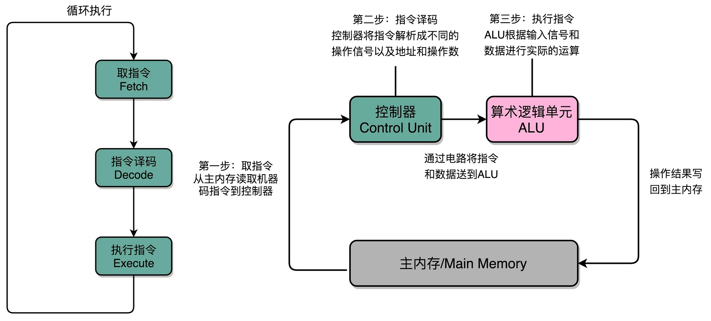</center>
  
  - 取指令（Instruction Fetch）：
    - CPU 从指令寄存器指向的内存地址读取指令。
    - 指令寄存器也称为程序计数器（Program Counter，`PC`），其主要作用是 CPU 根据指令地址从内存里把具体的指令加载到指令寄存器中，并存储下一条要执行的指令在内存中的地址。当 CPU 执行完当前指令后，会从指令寄存器中读取下一条指令的地址，并将其加载到指令寄存器中，然后开始执行下一条指令。  
  - 指令译码（Instruction Decode）：
    - CPU 解码取出的指令，并确定执行该指令所需要的操作。此阶段还会确定读取操作数的地址，并把它们传送到执行阶段。  
  - 执行指令（Execute）：
    - CPU 执行指令并计算结果。操作数在指令译码阶段被读取并在执行阶段进行计算。
  - 访问存储器（Memory Access）：
    - 若当前指令需要访问内存，则在该阶段中访问内存。
  - 写回数据（Write Back）：
    - 最终计算结果被写回到 CPU 的寄存器或者内存。  
  - 以上五个阶段组成一个指令周期。需要注意的是，不是所有的指令都需要以上五个阶段全部执行，一些比较简单的指令可能只需要执行前三个或者前四个阶段。而有些复杂的指令可能需要多个指令周期才能完成。
- 对于一个指令周期来说，取出一条指令，然后执行它，至少需要两个 CPU 周期。取出指令至少需要一个 CPU 周期，执行至少也需要一个 CPU 周期，复杂的指令则需要更多的 CPU 周期。而一个 CPU 周期是若干时钟周期之和。
  
  <center>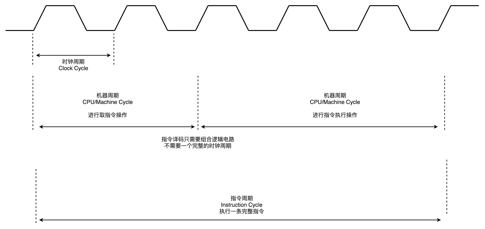</center>

### 💾 5.3 x86_64 架构的常用寄存器示例

x86_64 架构是 x86 架构的 64 位扩展，它包括了一些与 32 位版本不同的寄存器。

#### 5.3.1 通用寄存器（General-Purpose Registers）
  
| 名称 | 功能 |
| ----- | ----- |
| **RAX** (Accumulator Register) | 累加器寄存器。常用于算术运算、函数返回值等。在乘法/除法等指令中，rax 还常作为隐含操作数。 |
| **RBX** (Base Register) | 基址寄存器。传统上用作内存访问的基址，现代也常作为通用寄存器使用。 |
| **RCX** (Counter Register) | 计数寄存器。常用于循环计数（如 `loop` 指令）、字符串操作（如 `rep` 前缀指令）等。 |
| **RDX** (Data Register) | 数据寄存器。常用于算术运算、I/O 操作、乘法/除法中的高 32 位等。 |
| **RSI** (Source Index Register) | 源变址寄存器。在字符串操作指令（如 `movs`, `lods` 等）中作为源地址指针。 |
| **RDI** (Destination Index Register) | 目的变址寄存器。在字符串操作指令（如 `movs`, `stos` 等）中作为目的地址指针。 |
| **<font color=orange>RBP</font>** (Base Pointer Register) | **基址指针寄存器**。常用于栈帧（stack frame）的基址，帮助访问函数参数和局部变量。 |
| **<font color=orange>RSP</font>** (Stack Pointer Register) | **栈指针寄存器**。始终指向当前栈顶，用于函数调用、参数传递、局部变量分配等。 |
| **R8–R15** | 新增的 8 个通用寄存器。没有特殊用途，主要用于存放通用数据，减少寄存器压力，提高性能。 |

#### 5.3.2 程序计数器（Program Counter Registers, PC）

| 名称 | 功能 |
| ----- | ----- |
| **<font color=orange>RIP</font>** (Instruction Pointer Register) | 下一条指令的虚拟内存地址 |

#### 5.3.3 标志寄存器（Flags Registers）

- RFlags (Flags Register)：存储 CPU 状态的二进制标志，包含了 x86_32 架构中的 EFlags 寄存器。  
- 控制寄存器 (Control Registers)：
  - CR0 (Control Register 0)：用于开启和关闭虚拟内存、保护模式和分页机制等功能的控制寄存器。
  - CR2 (Control Register 2)：存储最近一次的访问内存产生的缺页异常的地址值。
  - **`CR3`** (Control Register 3)：在 x86 架构中称为 **页表基址寄存器**（Page Table Base Register，`PTBR`），它存储的是操作系统在虚拟内存管理中的页表的基地址（起始地址）。页表基址寄存器是在页表实现中的核心组成部分，通过 PTBR 可以定位到页表在内存中的位置，使 CPU 能够正确地将虚拟地址转换为物理地址。在进程切换时，操作系统会更新 PTBR 中的值，以指向相应进程的页表（每个进程都有一个独立的页表）。
  - CR4 (Control Register 4)：用于激活一些高级的 CPU 功能，如调试寄存器、全局页面等。
  - CR8 (Control Register 8)：用于控制中断的优先级。
- 在 x86_64 架构中，32 位的寄存器名称的前缀由 E 改为 R，如，RAX、RBX、RCX 等。此外，x86_64 架构还引入了 8 个新增的通用寄存器 R8-R15。这些寄存器的作用和 32 位的通用寄存器一样，可以用于存储数据和进行各种运算。

### ⏱️ 5.4 进程的调度与优先级

#### 5.4.1 常用 CPU 调度 man 手册

- **`sched (7)`**：查看 CPU 调度总览（含系统调用、调度策略等）
- `sched_setscheduler (2)`：设置与获取调度策略与参数
- `systemd.exec (5)`：systemd 执行环境配置文档
- `chrt (1)`：操作进程实时调度属性
- `tuna (8)`：更改应用与内核线程属性

#### 5.4.2 Linux 中的进程调度策略

| 类别 | 内核源代码 | 策略 |
| ----- | ----- | ----- |
| 实时调度程序 | `linux/kernel/sched/rt.c` | SCHED_FIFO <br> SCHED_RR |
| 完全公平调度程序（CFS） | `linux/kernel/sched/fair.c` | SCHED_NORMAL（也称为 SCHED_OTHER）<br> SCHED_BATCH <br> SCHED_IDLE |
| 截⽌时间调度程序 | `linux/kernel/sched/deadline.c` | SCHED_DEADLINE |

实时调度策略（real-time scheduling policy）：

- 由实时调度策略调度的进程需在限制的时间内完成任务，常见的策略有 **`FF`**。
- 实时调度的进程比非实时调度的进程获得更多的 CPU 使用时间，由于其需要在有限的时间内完成并返回。

非实时调度策略（non-real-time scheduling policy）：常见的策略有 **`TS`**

#### 5.4.3 Linux 进程调度优先级的分类
  
<center>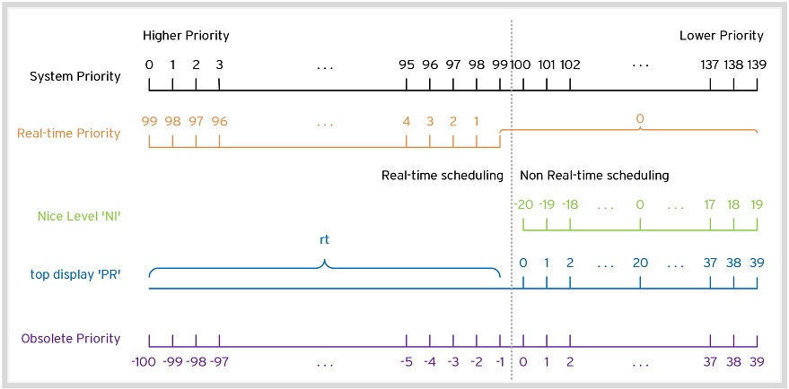</center>
  
- 系统优先级（system priority）  
- 实时优先级（real-time priority）  
- 过时的优先级（obsolete priority）：`/ˈɒbsəliːt/`，该优先级类型为 `BSD` 风格类型，使用 ps 命令的 `l` 选项查看，其优先级的值与 `pri` 选项不同。

#### 5.4.4 Linux 中的上下文切换（context switch）

- 上下文切换的过程：

  <center>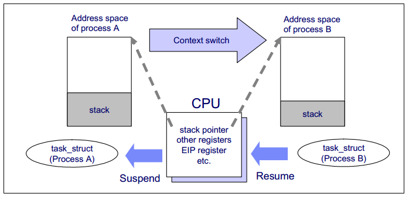</center>

  <center>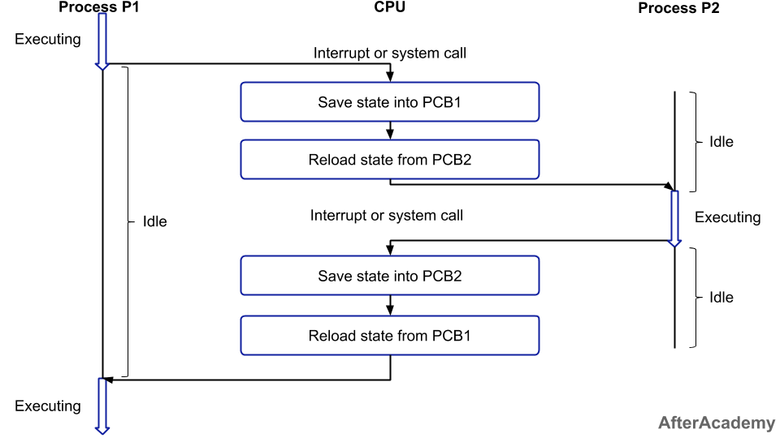</center>

  - 当一个程序正在执行的过程中，中断（interrupt）或系统调用（system call）发生可以使得 CPU 的控制权从当前进程转移到操作系统内核。
  - 操作系统内核负责保存进程 $P_1$ 在 CPU 中的上下文到 $PCB_1$（PCB 即为进程的 `task_struct` 结构体）中。
  - 从 $PCB_2$ 取出进程 $P_2$ 的 CPU 上下文，将 CPU 控制权转移给进程 $P_2$， 开始执行进程 $P_2$ 的指令。  
- 发生上下文切换的 3 中场景：
  - 1️⃣ 进程无法运行下去：如等待 io 完成，或者等待某个资源、某个事件等。
  - 2️⃣ 进程仍在运行，但内核不让它继续使用 CPU：如进程的时间片用完，或者优先级更高的进程抢占，因此该进程必须交出 CPU 的使用权。
  - 3️⃣ 进程还可运行，但其自身的算法决定主动交出 CPU 于别的进程：用户程序可以通过系统调用 `sched_yield()` 来交出 CPU，内核则可以通过函数 `cond_resched()` 或者 `yield()` 来做到。
- 上下文切换又可分为：
  - 自愿上下文切换（voluntary /ˈvɒləntri/）
  - 非自愿上下文切换（involuntary）或强制切换：自愿上下文切换时进程不再处于运行状态，而非自愿上下文切换时进程仍处于运行状态。
  - 以上场景 1️⃣ 属于自愿上下文切换，而场景 2️⃣ 与 3️⃣ 属于非自愿上下文切换。
  
    ```bash
    $ sudo ps axo pid,pri,rtprio,ni,cls,cputime,psr,comm
      PID PRI RTPRio  NI CLS     TIME PSR COMMAND
        1  19      -   0  TS 00:00:10   0 systemd
        2  19      -   0  TS 00:00:00   1 kthreadd
        3  39      - -20  TS 00:00:00   0 rcu_gp
        4  39      - -20  TS 00:00:00   0 rcu_par_gp
        6  39      - -20  TS 00:00:00   0 kworker/0:0H-kblockd
        8  39      - -20  TS 00:00:00   0 mm_percpu_wq
        9  19      -   0  TS 00:00:00   0 ksoftirqd/0
       10  19      -   0  TS 00:00:01   1 rcu_sched
       11 139     99   -  FF 00:00:00   0 migration/0
       12 139     99   -  FF 00:00:00   0 watchdog/0
       13  19      -   0  TS 00:00:00   0 cpuhp/0
       14  19      -   0  TS 00:00:00   1 cpuhp/1
       15 139     99   -  FF 00:00:00   1 watchdog/1
       16 139     99   -  FF 00:00:00   1 migration/1 
       ...
       1677  19      -   0  TS 00:00:00   1 nginx
       1678  19      -   0  TS 00:00:00   0 nginx
       1679  19      -   0  TS 00:00:00   1 nginx
       ...
    # 查看系统所有进程的 PID、系统优先级、实时优先级、nice 值、cls 调度策略、
    # CPU 实际使用时间（realtime）、进程当前被分配的逻辑 CPU 与对应的命令

    $ cat /proc/<pid>/status
      ...
      voluntary_ctxt_switches:        1  # 自愿上下文切换数目
      nonvoluntary_ctxt_switches:     4  # 非自愿上下文切换数目
    # voluntary_ctxt_switches, nonvoluntary_ctxt_switches: since Linux 2.6.23
    # 以上数目是进程被调度运行后的累加值
    # 注意：
    #   自愿上下文切换数目占多数说明进程相对 CPU 的资源需求不高，而非自愿上下文切换数目较多
    #   的话，需考虑其对 CPU 的资源需求可能存在瓶颈，被内核强制调度切换。
    ```
  
  从上述 ps 命令的输出中可知：  
  - CLS 调度策略为 TS（SCHED_NORMAL）的进程不具有实时优先级（RTPRio）
  - ✨ 进程具有最高的实时优先级（99）而具有最低的系统优先级（139）彼此间不矛盾，因为实时优先级是进程在限定时间内需完成的任务可，需抢占 CPU 资源快速完成任务，而任务完成后不再占用 CPU 资源具有较低的系统的优先级，此类进程通常为内核进程。

#### 5.4.5 设置进程的调度选项

- Linux 为管理调度程序参数提供了⼀系列系统调⽤，其允许操作进程优先级、调度策略和处理器关联，从⽽将处理器让给其他任务。
- 应⽤以编程⽅式使⽤  **`sched_setscheduler()`** 和 **`sched_getscheduler()`** 系统调⽤来设置和获取指定调度策略和进程的实时优先
级。sched_setscheduler (2) man page 提供有关 sched_setscheduler() 和 sched_getscheduler() 系统调⽤的信息。
- RHEL 为管理员提供了两种不同⽅法来配置和观察 **进程调度程序配置**： **`chrt`** 命令和 **`tuna`** 接⼝

### 📼 5.5 CPU Cache 缓存架构

所谓程序局部性原理，分两条：时间局部性（刚用过的数据很快还会再用）和空间局部性（用了某个地址，它旁边的地址大概率也会被用到）。正因为这两条规律，缓存这种"小而快"的设计才玩得转——把热数据留在上层，CPU 大多数时候都能命中，不必老跑主存。

- 计算机存储体系整体分层示意：
  
  <center>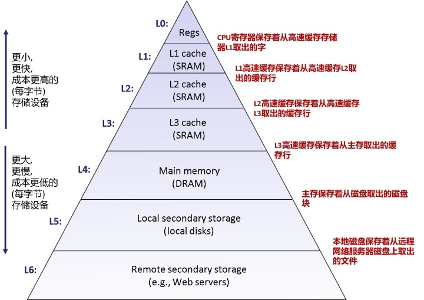</center>

- CPU Cache 缓存架构拓扑示例：  
  使用 `lstopo` 命令以获取如下拓扑，分别来自于 Intel Core i5 与 i7 处理器。
  
  <center>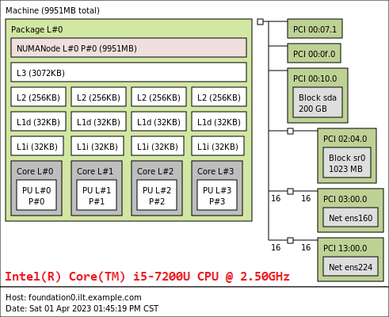</center>
  
  <center>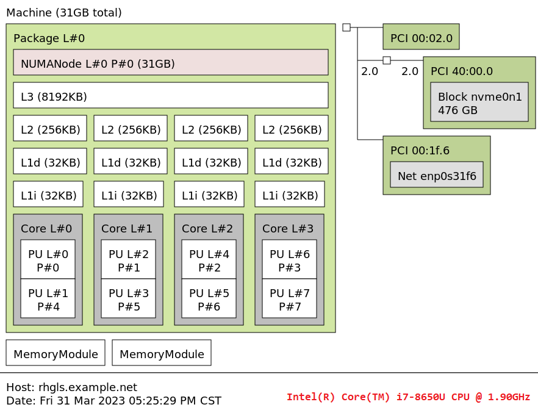</center>
  
  <center>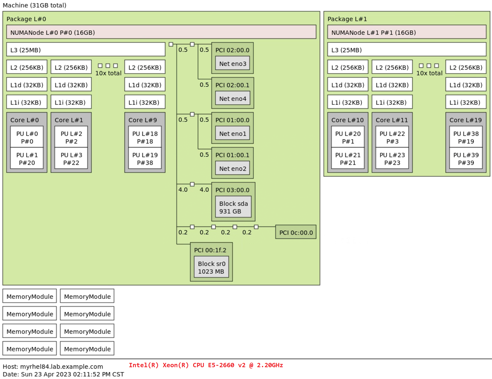</center>
  
  ```bash
  $ sudo yum install -y hwloc-gui
  # 安装基于 GUI 的系统拓扑信息软件包
  
  $ sudo lstopo --logical --no-io
  Machine (9951MB total) + Package L#0
    NUMANode L#0 (9951MB)
    L3 L#0 (3072KB)
      L2 L#0 (256KB) + L1d L#0 (32KB) + L1i L#0 (32KB) + Core L#0 + PU L#0
      L2 L#1 (256KB) + L1d L#1 (32KB) + L1i L#1 (32KB) + Core L#1 + PU L#1
      L2 L#2 (256KB) + L1d L#2 (32KB) + L1i L#2 (32KB) + Core L#2 + PU L#2
      L2 L#3 (256KB) + L1d L#3 (32KB) + L1i L#3 (32KB) + Core L#3 + PU L#3
  # 查看主机的 CPU 逻辑拓扑信息
  
  $ sudo sudo lstopo --physical --no-io
  Machine (9951MB total) + Package P#0
    NUMANode P#0 (9951MB)
    L3 (3072KB)
      L2 (256KB) + L1d (32KB) + L1i (32KB) + Core P#0 + PU P#0
      L2 (256KB) + L1d (32KB) + L1i (32KB) + Core P#1 + PU P#1
      L2 (256KB) + L1d (32KB) + L1i (32KB) + Core P#2 + PU P#2
      L2 (256KB) + L1d (32KB) + L1i (32KB) + Core P#3 + PU P#3 
  # 查看主机的 CPU 物理拓扑信息
  
  $ sudo lstopo --no-io
  Machine (9951MB total) + Package L#0
    NUMANode L#0 (P#0 9951MB)
    L3 L#0 (3072KB)
      L2 L#0 (256KB) + L1d L#0 (32KB) + L1i L#0 (32KB) + Core L#0 + PU L#0 (P#0)
      L2 L#1 (256KB) + L1d L#1 (32KB) + L1i L#1 (32KB) + Core L#1 + PU L#1 (P#1)
      L2 L#2 (256KB) + L1d L#2 (32KB) + L1i L#2 (32KB) + Core L#2 + PU L#2 (P#2)
      L2 L#3 (256KB) + L1d L#3 (32KB) + L1i L#3 (32KB) + Core L#3 + PU L#3 (P#3) 
  # 查看主机的 CPU 逻辑与物理拓扑信息
  # 注意：
  #   PU 表示物理处理单元 (Pysical Processing Unit)，指的是映射到物理处理器的标识符。
  #   P# 表示处理器 (Package) 标识符，也是映射到物理处理器上的标识符。
  ```

- 使用 `valgrind` 命令测试程序的 CPU Cache 在 `L1` 缓存与 `LL` 缓存（最慢的一级缓存或最后一级缓存）中的命中率，为程序的优化提供相应线索：
  
  ```bash
  $ man valgrind
  # 查看 valgrind 命令的使用方法
  
  $ sudo valgrind --tool=cachegrind ./cache-test1
  ==1798== Cachegrind, a cache and branch-prediction profiler
  ==1798== Copyright (C) 2002-2017, and GNU GPL'd, by Nicholas Nethercote et al.
  ==1798== Using Valgrind-3.14.0 and LibVEX; rerun with -h for copyright info
  ==1798== Command: bin/cache-test1
  ==1798== 
  --1798-- warning: L3 cache found, using its data for the LL simulation.    # 使用 L3 缓存作为 LL 缓存
  Starting
  Finished
  ==1798== 
  ==1798== I   refs:      6,750,717,128    
  ==1798== I1  misses:            1,011    # L1 指令缓存未命中数
  ==1798== LLi misses:            1,002    # LL 指令缓存未命中数
  ==1798== I1  miss rate:          0.00%   # L1 指令缓存未命中率（I1 misses/I refs）
  ==1798== LLi miss rate:          0.00%   # LL 指令缓存未命中率（LLi miss rate/I refs）
  ==1798== 
  ==1798== D   refs:      3,937,858,532  (3,375,270,491 rd   + 562,588,041 wr)  
  ==1798== D1  misses:       35,159,402  (        2,516 rd   +  35,156,886 wr)  # L1 数据缓存未命中数
  ==1798== LLd misses:       35,158,984  (        2,126 rd   +  35,156,858 wr)  # LL 数据缓存未命中数 
  ==1798== D1  miss rate:           0.9% (          0.0%     +         6.2%  )  # L1 数据缓存未命中率（D1 misses/D refs）
  ==1798== LLd miss rate:           0.9% (          0.0%     +         6.2%  )  # LL 数据缓存未命中率（LLd misses/D refs）
  ==1798== 
  ==1798== LL refs:          35,160,413  (        3,527 rd   +  35,156,886 wr)
  ==1798== LL misses:        35,159,986  (        3,128 rd   +  35,156,858 wr)
  ==1798== LL miss rate:            0.3% (          0.0%     +         6.2%  )
  ```

- CPU Cache 缓存命中率的 C 程序代码示例：
  左侧为 cache1.c，右侧为 cache2.c。
  
  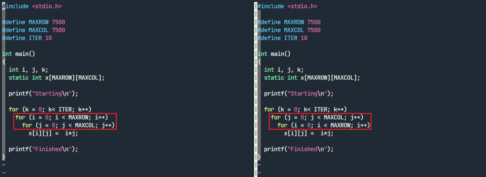
  
  以上代码用以定义一个 7500 个行元素与 7500 个列元素的二维数组。左侧示例先定义行，在每行中以列进行递增，每行中的列元素的值是整型变量 `i`（行的索引号）与整型变量 `j`（列的索引号）的乘积，而右侧示例先定义列，在每列中以行进行递增。因此，两者编译后使用 valgrind 命令进行缓存命中率测试，结果如下所示：
  
  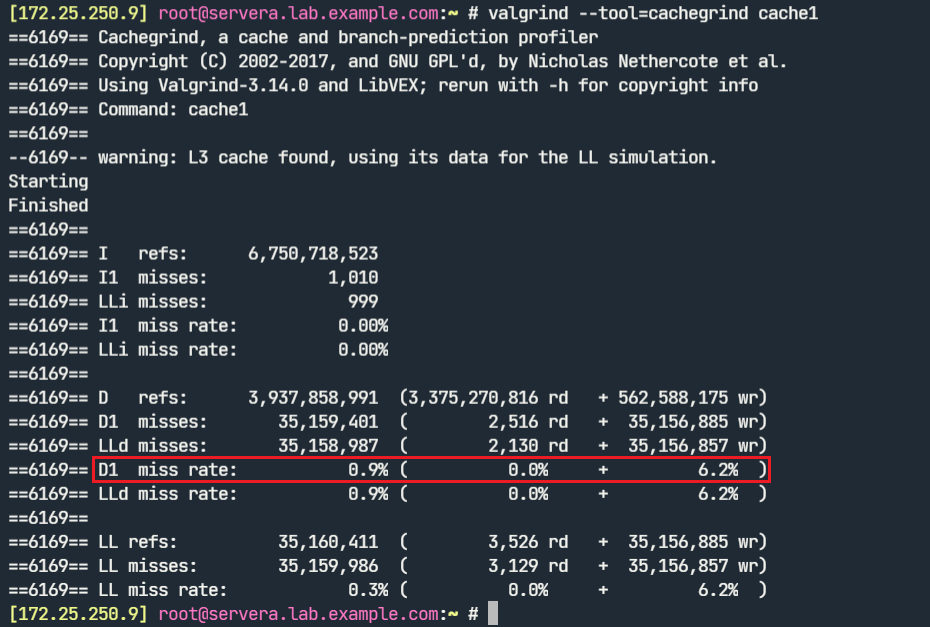
  
  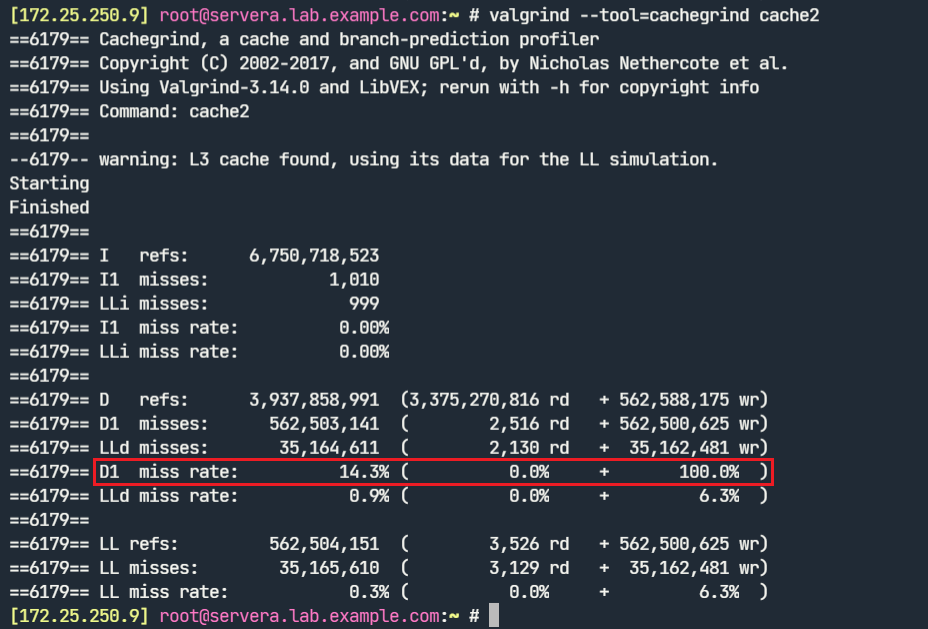
  
  从测试结果可知 cache1 的 L1 数据写缓存未命中率（6.2%）明显低于 cache2 的（100.0%），其原因在于 CPU Cache 缓存以缓存行（Cache line）的方式进行存储，先定义行再以列进行递增的效率更高。

### 🏆 5.6 [Linux CPU 性能优化实战：从应用、GCC、调度器到 CPU 绑定与内存分配器](https://github.com/Alberthua-Perl/tech-docs/blob/master/Linux%20%E5%9F%BA%E7%A1%80%E4%B8%8E%E8%BF%9B%E9%98%B6/Linux%20%E7%B3%BB%E7%BB%9F%E6%80%A7%E8%83%BD%E4%BC%98%E5%8C%96%E7%99%BD%E7%9A%AE%E4%B9%A6/Linux%20CPU%20%E6%80%A7%E8%83%BD%E4%BC%98%E5%8C%96%E5%AE%9E%E6%88%98%EF%BC%9A%E4%BB%8E%E5%BA%94%E7%94%A8%E3%80%81GCC%E3%80%81%E8%B0%83%E5%BA%A6%E5%99%A8%E5%88%B0%20CPU%20%E7%BB%91%E5%AE%9A%E4%B8%8E%E5%86%85%E5%AD%98%E5%88%86%E9%85%8D%E5%99%A8/Linux%20CPU%20%E6%80%A7%E8%83%BD%E4%BC%98%E5%8C%96%E5%AE%9E%E6%88%98%EF%BC%9A%E4%BB%8E%E5%BA%94%E7%94%A8%E3%80%81GCC%E3%80%81%E8%B0%83%E5%BA%A6%E5%99%A8%E5%88%B0%20CPU%20%E7%BB%91%E5%AE%9A%E4%B8%8E%E5%86%85%E5%AD%98%E5%88%86%E9%85%8D%E5%99%A8.md)

## 🪛 6. 调优内存使用

### 🔬 6.1 [Linux 用户空间进程虚拟内存布局（layout）](https://github.com/Alberthua-Perl/tech-docs/blob/master/Linux%20%E5%86%85%E6%A0%B8%E5%8E%9F%E7%90%86/Linux%20%E5%86%85%E6%A0%B8%E5%86%85%E5%AD%98%E7%AE%A1%E7%90%86%E9%9B%86%E9%94%A6/Linux%20%E5%86%85%E6%A0%B8%E5%86%85%E5%AD%98%E7%AE%A1%E7%90%86%E9%9B%86%E9%94%A6.md#-linux-%E7%94%A8%E6%88%B7%E7%A9%BA%E9%97%B4%E8%BF%9B%E7%A8%8B%E8%99%9A%E6%8B%9F%E5%86%85%E5%AD%98%E5%B8%83%E5%B1%80layout)

### 🔥 6.2 [Linux 内核内存管理集锦](https://github.com/Alberthua-Perl/tech-docs/blob/master/Linux%20%E5%86%85%E6%A0%B8%E5%8E%9F%E7%90%86/Linux%20%E5%86%85%E6%A0%B8%E5%86%85%E5%AD%98%E7%AE%A1%E7%90%86%E9%9B%86%E9%94%A6/Linux%20%E5%86%85%E6%A0%B8%E5%86%85%E5%AD%98%E7%AE%A1%E7%90%86%E9%9B%86%E9%94%A6.md)

- 为了使⽤⼤⻚⾯，进程必须使⽤ **`mmap()`** 系统调⽤或 **`shmat()`** 和 **`shmget()`** 系统调⽤来请求⼤⻚⾯。
- 如果进程使⽤ mmap() 系统调⽤，那么需要挂载 **`hugetlbfs`** ⽂件系统。
- NUMA 系统上的大页面数量定义：`/sys/devices/system/node/nodeX/hugepages/hugepages-2048kB/nr_hugepages`
- NUMA 系统中 /proc/meminfo 中的大页内存是各个 node 内存节点的整体效应

### 💪 6.3 [Linux 内存管理全景图V2.0](https://github.com/Alberthua-Perl/tech-docs/blob/master/Linux%20%E5%86%85%E6%A0%B8%E5%8E%9F%E7%90%86/Linux%20%E5%86%85%E6%A0%B8%E5%86%85%E5%AD%98%E7%AE%A1%E7%90%86%E9%9B%86%E9%94%A6/images/Linux%20%E5%86%85%E5%AD%98%E7%AE%A1%E7%90%86%E5%85%A8%E6%99%AF%E5%9B%BEV2.0.png)

## 💡 7. [/proc 伪文件系统释义](https://github.com/Alberthua-Perl/tech-docs/blob/master/Linux%20%E5%9F%BA%E7%A1%80%E4%B8%8E%E8%BF%9B%E9%98%B6/Linux%20%E7%B3%BB%E7%BB%9F%E6%80%A7%E8%83%BD%E4%BC%98%E5%8C%96%E7%99%BD%E7%9A%AE%E4%B9%A6/proc%20%E4%BC%AA%E6%96%87%E4%BB%B6%E7%B3%BB%E7%BB%9F%E9%87%8A%E4%B9%89.md)

## 🆒 8. systemd drop-in 文件系统性能设置

以 HAProxy 守护进程为例，演示可通过 drop-in 文件实现的设置：

```ini
$ sudo vim /etc/systemd/system/haproxy.slice
[Unit]
Description=HAProxy Slice

[Slice]
### CPU 使用时间与亲和性
CPUAccounting=yes
CPUQuota=50%
LimitCPU=120
CPUAffinity=0-1
LimitNOFILE=32

### 内存容量限制
MemoryAccounting=yes
MemoryLimit=104857600

### 进程调度调整
#Nice=
# 设置服务的默认 nice 级别
# 将 nice 级别设置为介于 -20（最⾼优先级）⾄ 19（最低优先级）之间的⼀个数值

CPUSchedulingPolicy=rr
# 设置服务的 CPU 调度策略
# 将策略设置为以下其中⼀个值：other、batch、idle、fifo 和 rr

CPUSchedulingPriority=10
# 设置此服务的 CPU 调度优先级，优先级范围取决于所选的调度策略。
# 对于实时调度策略，可将此值设置为介于 1（最低优先级）和 99（最⾼优先级）之间的数值。
# 注意：Nice、CPUSchedulingPolicy 和 CPUSchedulingPriority 指令不能通过 systemctl set-property 动态更改。

### OOM-Killer 调整值
OOMScoreAdjust=-1000
# OOM-Killer 终止进程倾向性，取值介于 -1000（最低优先级）和 1000（最高优先级）之间的数值
# 数值越高越容易被杀死
```

## 🧬 9. eBPF 的 BCC 工具集运行示例

### 9.1 BPF 编译器集合简介

编写 eBPF 程序需要从内核源编译和链接到 eBPF 库。这对于内核开发⼈员⽽⾔⾮常友好，但对于其他⽤⼾（例如在⽣产系统上⼯作的⼈员），使⽤预先存在的程序可能是更实际的⽅法。BCC 由编写程序所需的组件组成，也提供了⽰例程序以及⽤于调试和诊断性能问题的预先存在的⼯具。安装方法如下：

```bash
$ sudo dnf install -y bcc-tools
$ sudo ls /usr/share/bcc/tools
# 安装 bcc-tools 工具集
```

### 9.2 常见 BCC 工具

- `execsnoop`：只捕获执行了新程序的进程，即调用了 `execve()`，而不捕获单纯 fork 出来的子进程。。比如，execsnoop 跟踪 execve() 系统调⽤并显⽰参数和返回值的详细信息。它将采集 `fork->exec` 序列中的新进程，但不包括只 fork() 不 exec() 的应⽤，如⼯作器进程。
- `opensnoop`：跟踪系统范围内的 open() 系统调⽤，并显⽰进程名称和路径名称详细信息。opensnoop 对于在应⽤启动期间发现配置和⽇志⽂件⾮常有⽤。
- `xfsslower`：显示 XFS 读取、写⼊、打开和 fsync，⽐ 10 ms 的默认阈值要慢。
- `biolatency`：
- `biosnoop`：
- `cachestat`：
- `gethostlatency`：

## ⚕️ 10. [Linux 磁盘性能测试：FIO & smartctl](https://github.com/Alberthua-Perl/tech-docs/blob/master/Linux%20%E5%9F%BA%E7%A1%80%E4%B8%8E%E8%BF%9B%E9%98%B6/Linux%20%E7%A3%81%E7%9B%98%E6%80%A7%E8%83%BD%E6%B5%8B%E8%AF%95/Linux%20%E7%A3%81%E7%9B%98%E6%80%A7%E8%83%BD%E6%B5%8B%E8%AF%95.md)

## 📚 参考链接

- USE 方法：
  - [Thinking Methodically about Performance. Brendan Gregg, Joyent](https://queue.acm.org/detail.cfm?id=2413037)
  - [The USE Method. Brendan Gregg](https://www.brendangregg.com/usemethod.html)
- 🚨 [Linux Performance Analysis in 60,000 Milliseconds](https://netflixtechblog.com/linux-performance-analysis-in-60-000-milliseconds-accc10403c55) 
- [如何理解 CPU steal time](https://www.cnblogs.com/my-show-time/p/15893877.html)
- ❤️ [Linux kernel profiling with perf](https://perf.wiki.kernel.org/index.php/Tutorial)
- [Linux 性能分析工具 Perf 简介](https://segmentfault.com/a/1190000021465563)
- [进程切换：自愿 (voluntary) 与强制 (involuntary)](http://linuxperf.com/?p=209)
- [Deadline scheduling part 1 — overview and theory | LWN.net](https://lwn.net/Articles/743740/)
- 🐝 [什么是 eBPF ？| eBPF 文档](https://ebpf.io/zh-hans/what-is-ebpf/)
