# Linux 系统资源限制

## 文档说明

此文档中使用的 OS 版本为 `RHEL 6.x/7.x/8.x`，其他 Linux 发行版可自行测试。

## 文档目录

- [Linux 系统资源限制](#linux-系统资源限制)
  - [文档说明](#文档说明)
  - [文档目录](#文档目录)
  - [1. Linux 系统资源限制的级别](#1-linux-系统资源限制的级别)
  - [2. 使用 limit 针对不同用户限制系统资源](#2-使用-limit-针对不同用户限制系统资源)
  - [3. 使用 systemd 服务限制系统资源](#3-使用-systemd-服务限制系统资源)
  - [🔥 4. CGroup 对系统的资源限制](#-4-cgroup-对系统的资源限制)
    - [4.1 CGroup 版本变迁](#41-cgroup-版本变迁)
    - [4.2 CGroup v1 的层次结构](#42-cgroup-v1-的层次结构)
    - [4.3 CGroup 与 systemd 的联系](#43-cgroup-与-systemd-的联系)
    - [4.4 CGroup 版本查看与切换](#44-cgroup-版本查看与切换)
    - [4.5 使用 libcgroup-tools 工具管理 CGroup](#45-使用-libcgroup-tools-工具管理-cgroup)
      - [4.5.1 查看 CGroup 列表信息](#451-查看-cgroup-列表信息)
      - [👏 4.5.2 完整的 CGroup 限制进程的生命周期](#-452-完整的-cgroup-限制进程的生命周期)
    - [4.6 使用 systemd 相关工具查看 CGroup 的整体信息](#46-使用-systemd-相关工具查看-cgroup-的整体信息)
  - [🚧 5. CGroup 实施资源限制示例](#-5-cgroup-实施资源限制示例)
    - [5.1 示例 1️⃣：使用 `systemctl set-property` 命令指定资源限制参数](#51-示例-1️⃣使用-systemctl-set-property-命令指定资源限制参数)
    - [5.2 示例 2️⃣：`CPUShares` 参数对 CPU 相对使用时间的影响](#52-示例-2️⃣cpushares-参数对-cpu-相对使用时间的影响)
    - [5.3 示例 3️⃣：`CPUQuota` 参数对 CPU 绝对使用时间的影响](#53-示例-3️⃣cpuquota-参数对-cpu-绝对使用时间的影响)
    - [5.4 示例 4️⃣：使用 cgroup 的 `cpuset` 限定进程运行于指定 CPU 与 NUMA 内存节点上](#54-示例-4️⃣使用-cgroup-的-cpuset-限定进程运行于指定-cpu-与-numa-内存节点上)
  - [💪 6. 常用的 systemd 单元文件参数说明](#-6-常用的-systemd-单元文件参数说明)
  - [7. 参考链接](#7-参考链接)

## 1. Linux 系统资源限制的级别

- 系统级别（kernel level）：Linux 内核参数对系统全局资源的限制，如 `fs.file-max`、`fs.file-nr` 等。
- 进程级别（process level）：资源限制配置文件与 `ulimit` 命令对用户资源的限制。

## 2. 使用 limit 针对不同用户限制系统资源

- RHEL 6.x/7.x 中的用户级系统资源限制由 PAM 中的 `pam_limits.so` 模块实现。
- `/etc/security/limits.d/[20|90]-nproc.conf` 与 `/etc/security/limits.conf` 为该模块的配置文件。
- 确保用户登录的 PAM 配置文件 `/etc/pam.d/login` 中包含 pam_limits.so 模块（`system-auth` 中已包含）。
- ✨ RHEL 8.x 中 /etc/pam.d/system-auth 文件中也使用 pam_limit.so 模块实现系统资源限制，该模块同样使用 /etc/security/limits.conf 与 /etc/security/limits.d/*.conf 作为配置文件，读取其中的配置信息以实现限制。
- 对 Linux 资源限制可使用如上配置文件的方式或 ulimit 命令行的方式实现。
- 配置文件的方式：
  - Linux 资源限制的主配置文件：

    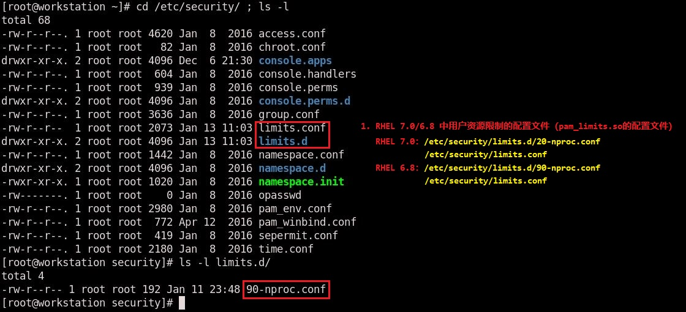

    - RHEL 7.x 中的配置文件：
      - /etc/security/limits.d/20-nproc.conf
      - /etc/security/limits.conf
    - RHEL 6.x 中的配置文件：
      - /etc/security/limits.d/90-nproc.conf
      - /etc/security/limits.conf
  - /etc/security/limits.conf 配置文件中的字段说明：

    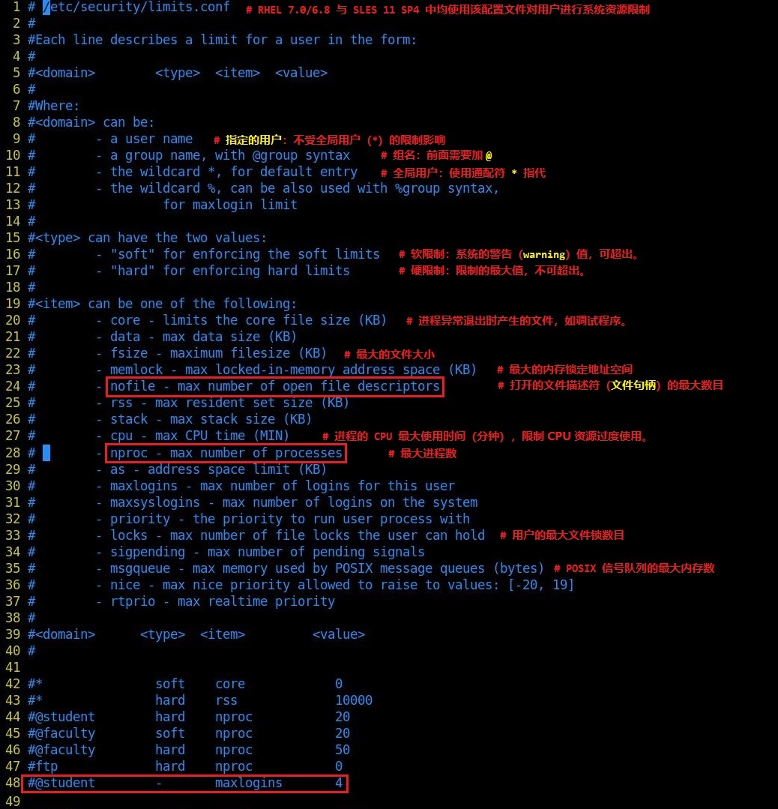

    - `domain` ：用户分类
      - 超级用户（root）
      - 全局用户（*）
      - 指定用户/组
    - `type` ：类型
      - `soft` ：软限制，即超出该限制系统发出警告。
      - `hard` ：硬限制，即限制的最大值。
      - `-` ：同时设置了 soft 与 hard 值。

    > 💥 注意：
    >
    > 1. SLES 11 SP4 只有该配置文件限制用户的系统资源，配置方式相同！
    > 2. 非 root 用户可以配置软限制，而具备 root 权限的用户可修改硬限制。
    > 3. 一般情况下，软限制的配置不超过硬限制的配置。
  
  - `/etc/security/limits.d/[20|90]-nproc.conf`：针对用户 nproc 最大进程数的限制，在 RHEL 5.x 中不存在。
  - `/etc/security/limits.d/[20|90]-nproc.conf` 优先级大于 `/etc/security/limits.conf`
  - 关于以上两个配置文件的重要说明：
    - 若 [20|90]-nproc.conf 中，root、全局用户、指定用户的 soft 值小于 limits.conf 中相应用户的 hard 值，那么 root、全局用户、指定用户均使用 [20|90]-nproc.conf 中的 soft 值。
    - 若 [20|90]-nproc.conf 中, root、全局用户、指定用户的 soft 值（可设置为 unlimited）大于 limits.conf 中相应用户的 hard 值，那么 root、全局用户、指定用户使用 limits.conf 中的 hard 值。
    - ✨ [20|90]-nproc.conf 具有优先权，而 limits.conf 具有决定权。
    - 👉 指定用户/组不受全局用户限制的影响。
    - 可将 /etc/security/limits.d/[20|90]-nproc.conf 移除, 只由 limits.conf 进行限制，降低配置复杂度。
    - 其他限制选项不受 [20|90]-nproc.conf 影响。
    - 示例 1：

      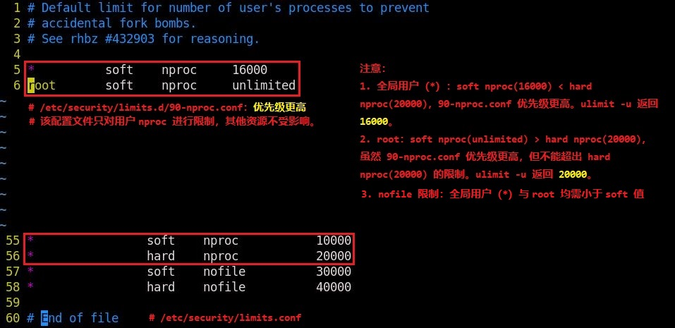

      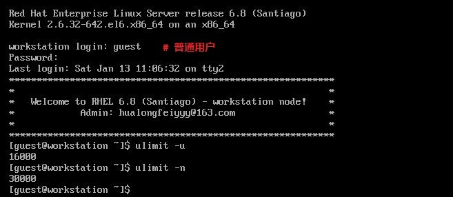

      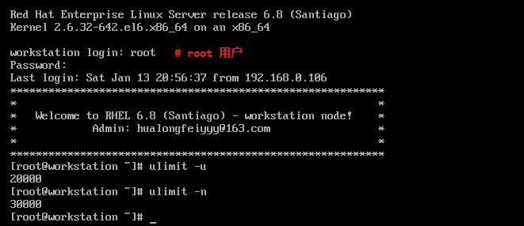

    - 示例 2：

      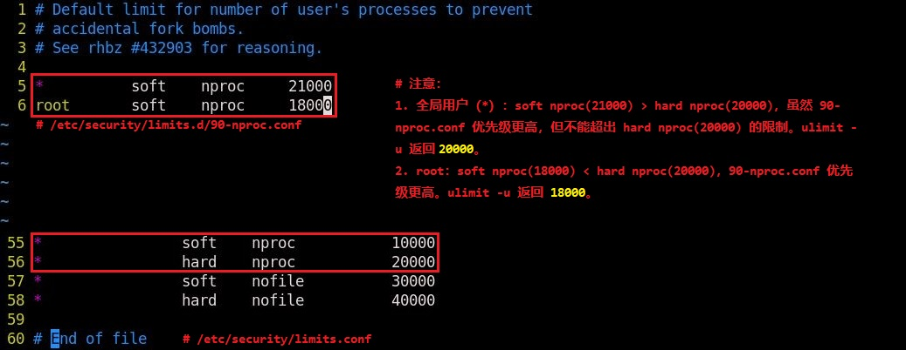

      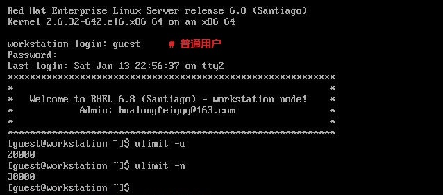

      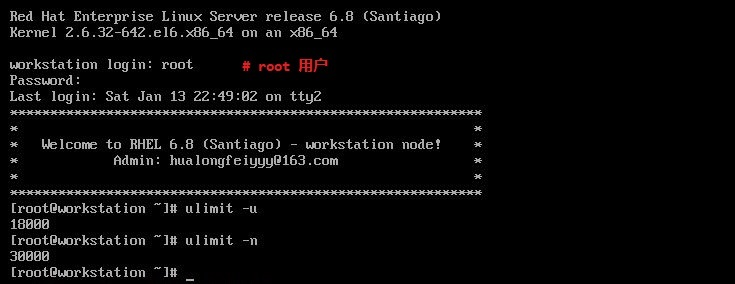

    - 示例 3：

      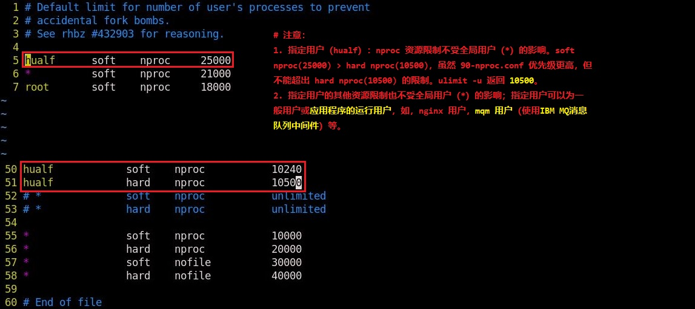

      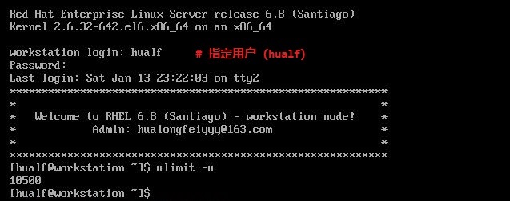

    - 示例 4：

      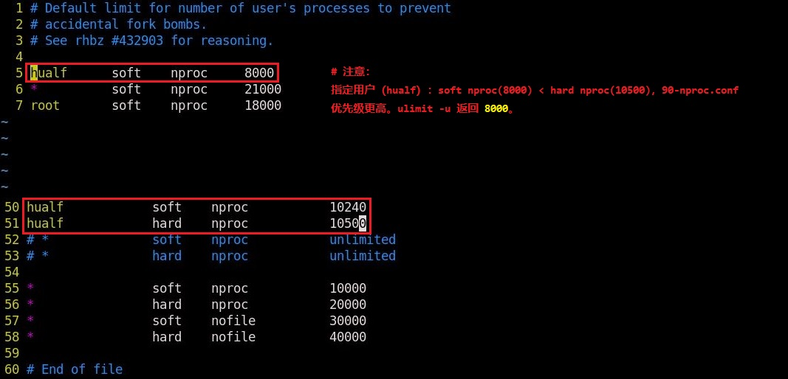

      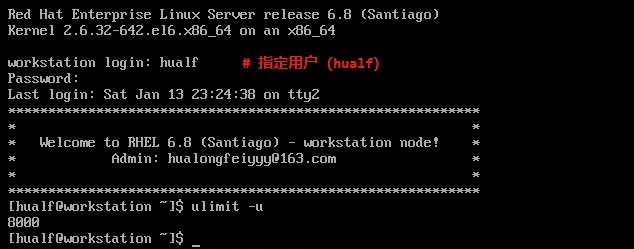

- ulimit 命令行的方式：
  - ulimit 命令能临时使当前登录用户的 shell 环境资源限制立即生效，但仅对当前环境有效，退出重新登陆后将失效。
  - 可将指定用户的 ulimit 命令写入 `$HOME/.bash_profile` 中，实现永久资源限制。
  - ulimit 命令常用选项：

    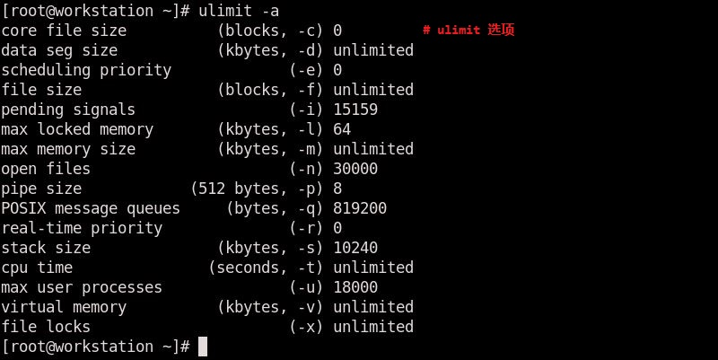

    ```bash
    # ulimit 命令常用选项：
    -H                 设置用户 shell 环境的资源硬限制
    -S                 设置用户 shell 环境的资源软限制
                       若 -H 与 -S 同时指定或不指定，两者默认设置为相同的值。
    -a                 查看用户 shell 环境的当前全部资源限制
    -n [<file_handle_num>]
                       查看或设置打开的文件句柄的最大数量
    -u [<proc_num>]    查看或设置用户的最大可用进程数
    -T <thread_num>    设置用户的最大线程数
    ```

## 3. 使用 systemd 服务限制系统资源

- 在 RHEL 7.x/8.x 中关于 systemd 服务配置的文件位于：
  - 1️⃣ `/etc/systemd/system/*.service.d/*.conf` 配置文件：
    该目录中的配置文件以文件开头的字母数字顺序开始解析，具有最高配置优先级。
  - 2️⃣ `/etc/systemd/system/*.service` 单元文件：
    服务的 systemd 置入（drop-in）文件
  - 3️⃣ `/usr/lib/systemd/system/*.service` 单元文件：
    默认的服务配置单元文件，该文件在服务更新升级过程中自动更新，若手动修改该文件可能导致配置丢失。因此，将自定义配置写入 /etc/systemd/system/*.service 文件中可解决此问题。
- systemd 服务限制系统资源示例：
  - 示例 1：</br>

    1️⃣ **限制 sha1sum 进程终止前的最大 CPU 使用时间**

    ```bash
    $ sudo vim /etc/systemd/system/sha1sum.service
      [Unit]
      Description=Test sha1sum service cpulimit

      [Service]
      ExecStart=/usr/bin/sha1sum /dev/zero

      [Install]
      WantedBy=multi-user.target

    $ sudo vim /etc/systemd/system/sha1sum.service.d/10-cpulimits.conf
      [Service]
      LimitCPU=30
      # sha1sum 进程将持续运行，该参数将限制进程运行 30s 后退出。

    $ sudo vim /etc/systemd/system/sha1sum.timer
      [Unit]
      Description=Start sha1sum service every 1 minute

      [Timer]
      OnCalendar=*:00/01

      [Install]
      WantedBy=sha1sum.service  #启动 sha1sum.service
      # 由于 sha1sum.service 在 LimitCPU=30 的作用下，在启动后的 30 秒将停止运行。而 timer 计时器将在 30 秒后再次启动此服务。
      # 即，每分钟启动此服务。

    $ sudo systemctl daemon-reload
    $ sudo systemctl enable --now sha1sum.service
    # 该守护进程在运行 30s 后收到 SIGTERM 信号后自动终止
    $ sudo systemctl enable --now sha1sum.timer
    $ watch -cd systemctl status sha1sum.service
    ```

    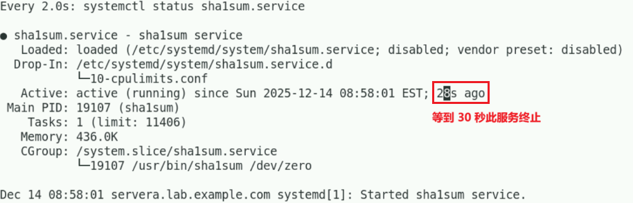

    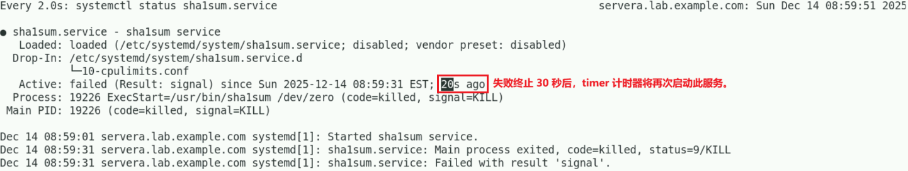

    2️⃣ **限制 Nginx 服务终止前的最大 CPU 使用时间**

    ```bash
    $ sudo vim /etc/systemd/system/nginx.service.d/10-cpulimits.conf
      [Service]
      LimitCPU=30  # 限制服务终止前的最大 CPU 使用时间
    $ sudo systemctl daemon-reload
    $ sudo systemctl cat nginx.service
    # 确认 nginx 服务单元文件已加载配置
    ```
  
  - 示例 2：
    设定 Nginx 服务对逻辑 CPU 核心的亲和性（affinity），关于 cgroup 限制进程在不同的逻辑 CPU 核心与 NUMA 内存节点的方式见下文。

    ```bash
    $ sudo vim /etc/systemd/system/nginx.service.d/20-CPUAffinity.conf
      [Service]
      CPUAffinity=<logical_cpu_list>
    # 指定逻辑 CPU 核心编号列表将相关进程 pin 在对应核心上，该列表可用空白或逗号分隔。
    $ sudo systemctl daemon-reload
    $ sudo systemctl restart nginx.service
    ```

- 关于更多的 `Limit*=` 配置信息可参考如下命令：
  
  ```bash
  $ man 5 systemd.exec
  # 搜索 Limit* 查看相关类型的限制 
  $ man 2 setrlimit
  # 查看获取与设置资源限制的系统调用方法（getrlimit、setrlimit 与 prlimit）
  ```

## 🔥 4. CGroup 对系统的资源限制

### 4.1 CGroup 版本变迁

- 控制组（control group）也被称为 `CGroup` 或 `cgroup`，来源于 Google 创建的 Process Containers 工具，主要用于对系统资源的使用限制管理。
- cgroup 的版本变迁：
  - cgroup v2 自 Linux 内核 4.5 版本加入支持，但并未作为默认使用，系统默认仍然使用 cgroup v1 版本。
  - RHEL/Alma Linux 8 默认内核 4.18 支持 cgoup v2，但默认仍然为 [v1](https://www.kernel.org/doc/Documentation/cgroup-v1/) 版本。
  - 🚀 RHEL/Alma Linux 9 默认内核 5.14 支持 cgroup v2，并且默认为 [v2](https://www.kernel.org/doc/Documentation/cgroup-v2.txt) 版本。
  - Linux 各发行版将 cgroup v2 作为默认的情况如下：
    - Container-Optimized OS（从 M97 开始）
    - Ubuntu（从 21.10 开始，推荐 22.04+）
    - Debian GNU/Linux（从 Debian 11 Bullseye 开始）
    - Fedora（从 31 开始）
    - Arch Linux（从 2021 年 4 月开始）
    - RHEL 和类似 RHEL 的发行版（从 9 开始）

> 注意：以下采用 cgroup v1 版本介绍

### 4.2 CGroup v1 的层次结构

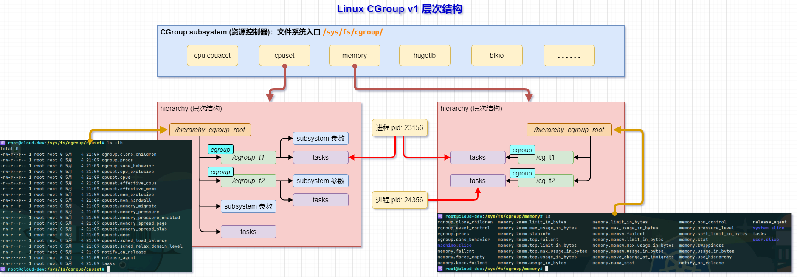
  
> 图注：**<font color=blue>cgroup 对应的目录在创建之初将自动创建各类子系统参数</font>**
  
- cgroup（control group）是 Linux 内核机制，通过伪文件系统向用户空间暴露接口，默认挂载于 /sys/fs/cgroup/（v1 与 v2 均支持）。
- subsystem（资源控制器）是内核功能模块，负责在 cgroup 节点上执行资源限制、审计或隔离操作（如 CPU、内存、IO 等）。其数量随内核版本变化，并非固定值。
- hierarchy（层次结构）在 cgroup v1 中允许多棵树，每棵树可绑定一个或多个 subsystem；在 cgroup v2 中，系统只有一棵统一的 hierarchy，所有 subsystem 都在这同一棵树上管理。现代发行版（RHEL 8+、Ubuntu 22.04+ 等）已默认采用 cgroup v2。
- systemd 在 cgroup v1 中会利用不绑定 subsystem 的 hierarchy 进行纯进程分组；在 cgroup v2 中则统一使用单棵树进行服务层级管理。

### 4.3 CGroup 与 systemd 的联系

- 在 `CentOS 7/8` 系统中（包括 Red Hat Enterprise Linux 7/8），通过将 cgroup 层次结构与 systemd 单位树捆绑，可以把资源管理设置从进程级别移至应用程序级别。默认情况下，systemd 会自动创建 `slice`、`scope` 和 `service` 单位的层级，来为 cgroup 树提供统一结构。可以通过 systemctl 命令创建自定义 slice 进一步修改此结构。
- 🧩 若将系统的资源看成一块馅饼，那么所有资源默认会被划分为 3 个等份的 cgroup：`System`、`User` 和 `Machine`。
- 🧩 每一个 cgroup 都是一个 `slice`，每个 slice 都可以有自己的子 slice：

  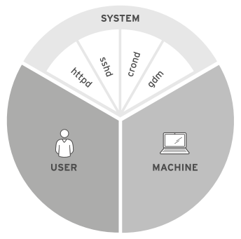

### 4.4 CGroup 版本查看与切换

```bash
### cgroup 的版本说明
$ sudo cat /etc/redhat-release 
  Red Hat Enterprise Linux release 8.2 (Ootpa)
$ sudo uname -r
  4.18.0-193.el8.x86_64
$ sudo stat -fc %T /sys/fs/cgroup/
  tmpfs
# 查看当前的 cgroup 版本，tmpfs 为 v1 版本，而 cgroup2fs 为 v2 版本。
$ sudo grep cgroup /proc/filesystems
  nodev   cgroup
  nodev   cgroup2
# 查看当前系统支持的 cgroup 的版本，v1 与 v2 版本均支持，但默认使用 v1 版本。

### cgroup 的版本切换
$ sudo grubby --update-kernel=ALL --args=systemd.unified_cgroup_hierarchy=1
# 修改 grub2 引导参数使 systemd 在启动时挂载使用 cgroup-v2 版本
$ sudo reboot
# 重启系统使配置生效
# 注意：
#   1. 若要回退使用 cgroup-v1 版本，修改 systemd.unified_cgroup_hierarchy=0。
#   2. 内核中完全启用了 cgroup-v1 和 cgroup-v2。
#   3. 从内核的角度来看，没有默认的 cgroup 版本，并且由 systemd 决定在启动时挂载。
```

### 4.5 使用 libcgroup-tools 工具管理 CGroup

#### 4.5.1 查看 CGroup 列表信息

```bash
$ sudo yum install -y libcgroup-tools
# 安装 libcgroup-tools 软件包
$ sudo lscgroup
  ...
  cpu,cpuacct:/user.slice
  cpu,cpuacct:/system.slice
  cpu,cpuacct:/machine.slice
  ...
  devices:/user.slice
  devices:/system.slice
  devices:/system.slice/irqbalance.service
  ...
  pids:/user.slice
  pids:/user.slice/user-42.slice
  pids:/user.slice/user-42.slice/session-c1.scope
  ...
# 查看 cgroup 列表，输出格式为 <controllers>:<path>。
# <controllers> 为 cgroup 的子系统类型，<path> 为子系统与 systemd 结合后 cgroup 
# 配置参数所在的路径。 
  
$ sudo cat /proc/cgroups 
  #subsys_name    hierarchy       num_cgroups     enabled
  cpuset  11      5       1
  cpu     2       7       1
  cpuacct 2       7       1
  blkio   8       5       1
  memory  10      119     1
  devices 7       62      1
  freezer 12      3       1
  net_cls 5       3       1
  perf_event      6       3       1
  net_prio        5       3       1
  hugetlb 3       1       1
  pids    9       79      1
  rdma    4       1       1
# 查看 cgroup 的整体信息

# 第一列：子系统名称
# 第二列：subsystem 所关联到的 cgroup 树的 ID，若多个 subsystem 关联到同一棵 cgroup 树，那么它们的这个字段将一致，比如此处的 cpu 和 cpuacct 就一致，表明它们绑定到了同一棵树。若出现下面的情况，该字段将为 0：
#   1. 当前 subsystem 没有和任何 cgroup 树绑定
#   2. 当前 subsystem 已经和 cgroup v2 的树绑定
#   3. 当前 subsystem 没有被内核开启
# 第三列：subsystem 所关联的 cgroup 树中进程组的个数，也即树上节点的个数。
#   sudo lscgroup | grep <subsys_name> | wc -l
#   统计每种子系统绑定的 cgroup 树中进程组的个数（与此列相同）
# 第四列：1 表示开启，0 表示未开启（可以通过设置内核的启动参数 cgroup_disable 来控制 subsystem 的开启)。
```

#### 👏 4.5.2 完整的 CGroup 限制进程的生命周期

请注意，使用 systemd 管理的进程切勿直接使用 libcgroup-tools 工具，因为 systemd 在 cgroup v1 中作为单独的 subsystem 管理，而直接采用 libcgroup-tools 工具会将进程单独置于其他 subsystem 中，两者产生冲突。

```bash
# ========== 创建 ==========
# 在 cpu 和 memory 层级创建 /goapp
$ sudo cgcreate -g cpu,memory:/goapp

# 设置资源限制
$ sudo cgset -r cpu.shares=512 goapp
$ sudo cgset -r memory.limit_in_bytes=100M goapp

# 将已有进程移入
$ sudo cgclassify -g cpu,memory:/goapp $(pidof goStdinBufio)    # 方式1：在另一终端中启动了 goStdinBufio 程序

# 方式2：直接使用 cgexec 运行程序
$ sudo cgexec -g cpu,memory:/goapp /home/kiosk/backup/utils/goStdinBufio

# ========== 查看 ==========
# 已创建 goapp 子控制组
$ sudo lscgroup | grep goapp
memory:/goapp
cpu,cpuacct:/goapp

# goapp 子控制组中设置了限制参数
$ sudo cat /sys/fs/cgroup/cpu/goapp/cpu.shares
512
$ sudo cat /sys/fs/cgroup/memory/goapp/memory.limit_in_bytes
104857600

# 限制的进程绑定了子控制组
$ sudo cat /proc/37410/cgroup | grep goapp
4:cpu,cpuacct:/goapp
3:memory:/goapp

# ========== 删除 ==========
# 先确保没有进程在运行（或已移出）
$ sudo cgdelete -g cpu,memory:/goapp
$ sudo lscgroup | grep goapp
```

### 4.6 使用 systemd 相关工具查看 CGroup 的整体信息
  
```bash
$ sudo systemd-cgtop
# 查看 cgroup 的整体概况，包括任务数（tasks）、CPU 使用率、内存使用情况、每秒 I/O 等。
# 可使用 "?" 获取交互式帮助
```
  
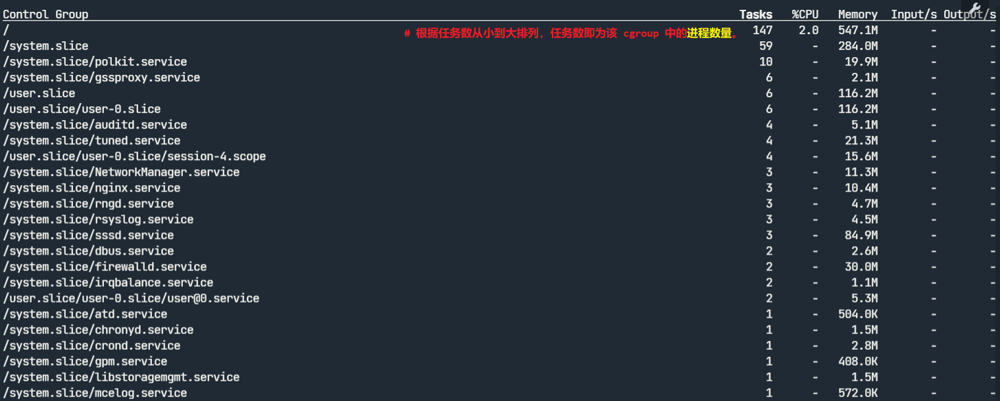
  
```bash
$ sudo systemd-cgls -k
# 查看包括内核线程在内的 cgroup 列表，返回结果以通过每种子系统进行分类。
$ sudo systemd-cgls <subsys_name>
# 查看指定子系统中的 cgroup 列表信息
```

查看指定进程的 cgroup 信息：
  
```bash
$ sudo cat /proc/<pid>/cgroup
```
  
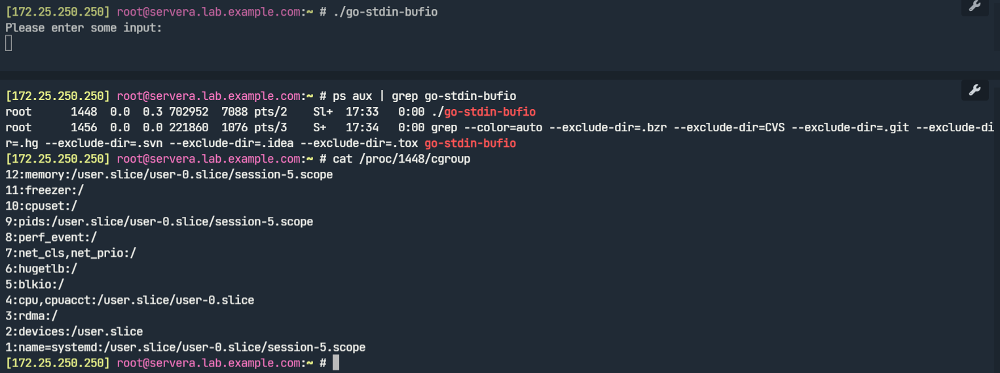

## 🚧 5. CGroup 实施资源限制示例

用于控制资源限制的机制称为强制限制（enforcing limits）。使用 systemd 与 cgroup 层次结构绑定后，对 cgroup 的管理可在应用程序级别实现。

### 5.1 示例 1️⃣：使用 `systemctl set-property` 命令指定资源限制参数

该命令所做的更改将立即应用并持久存储。若使用 `--runtime` 选项，更改也将立即应用，但在 `systemctl daemon-reload` 命令执行后将恢复为原先更改的值。
  
```bash
$ man 5 systemd.resource-control
# 查看资源限制参数的详细信息
$ systemctl set-property nginx.service MemoryAccounting=yes
$ systemctl set-property nginx.service MemoryLimit=1024M
$ cat /sys/fs/cgroup/memory/system.slice/nginx.service/memory.limit_in_bytes
  1073741824
# 限制内存使用最大 1 GiB
```
  
通过以上命令配置的参数将持久化写入 `/etc/systemd/system.control/*.service.d/` 目录的对应文件中。

### 5.2 示例 2️⃣：`CPUShares` 参数对 CPU 相对使用时间的影响

以下创建 foo.service 服务以使用约 50% CPU 时间，再创建 tom 与 jack 用户并设置其 CPUShares 权重，观察由 system.slice 控制组与 user.slice 控制组限制的进程在 CPU 相对使用时间上的变化差异。
  
```bash
### 配置 system.slice/foo.service 的资源限制
$ sudo vim /etc/systemd/system/foo.service
  [Unit]
  Description=The foo service that does nothing useful
  After=remote-fs.target nss-lookup.target
  
  [Service]
  ExecStart=/usr/bin/sha1sum /dev/zero
  ExecStop=/bin/kill -WINCH ${MAINPID}
  
  [Install]
  WantedBy=multi-user.target
# 创建 foo.service 服务单元文件
  
$ sudo mkdir /etc/systemd/system/foo.service.d
$ sudo vim /etc/systemd/system/foo.service.d/50-CPULimits.conf
  [Service]
  CPUAccounting=yes
  CPUShares=2048
$ sudo systemctl daemon-reload
# 配置 foo.service 的 CPUShares 权重并重载服务配置
$ sudo systemctl start foo.service
  
### 配置 user.slice 中相应用户的资源限制
$ id tom
  uid=1001(tom) gid=1001(tom) groups=1001(tom)
$ id jack
  uid=1002(jack) gid=1002(jack) groups=1002(jack)
$ sudo systemctl set-property user-1001.slice CPUShares=256
$ sudo cat /sys/fs/cgroup/cpu/user.slice/user-1001.slice/cpu.shares
  256
$ sudo systemctl set-property user-1002.slice CPUShares=1024
$ sudo cat /sys/fs/cgroup/cpu/user.slice/user-1002.slice/cpu.shares
  1024
# 通过 systemctl 命令行配置的参数写入至 cgroup 的指定文件中
```
  
分别使用 tom 与 jack 用户登录系统，并分别运行 `sha1sum /dev/zero` 命令，查看此时系统的 `top` 命令输出（单核 CPU 的主机）：
  
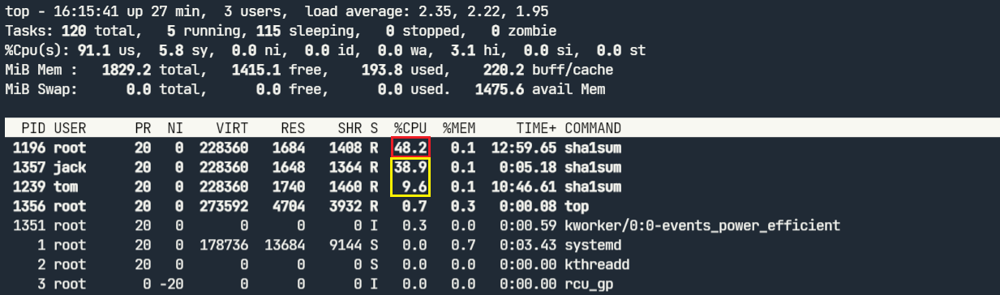
  
双核 CPU 的主机输出：
  
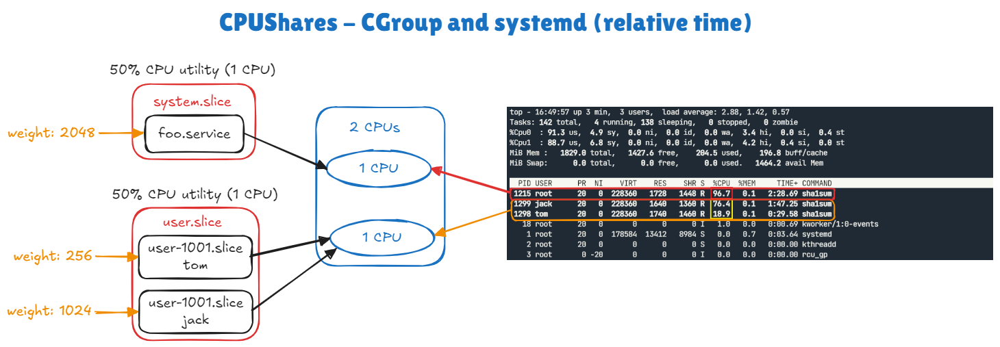
  
如上所示，system.slice 控制组中的 foo.service 服务与 user.slice 控制组中的 tom、jack 用户运行的进程总共分别具有约 50% CPU 时间，而 tom 与 jack 用户在 user.slice 控制组内受到 CPUShares 权重的影响，jack 的权重是 tom 的 4 倍，因此在 CPU 繁忙的情况下显示上图中的结果，而双核 CPU 主机中只是进程将使用单个核心约 100%，CPUShares 权重对 CPU 时间的影响与单核 CPU 的情况下类似。</br>

但是，请记住 CPUShares 最多只能使用单核 CPU，无论其至调整的多大，%CPU 也只能最大到 100%！

### 5.3 示例 3️⃣：`CPUQuota` 参数对 CPU 绝对使用时间的影响

若要严格控制 CPU 资源，设置 CPU 资源的使用上限，即不管 CPU 是否繁忙，对 CPU 资源的使用都不能超过这个上限，可以通过 `CPUQuota` 参数来设置。同样使用示例 2 中的环境，设置 tom 用户的 CPUQuota 参数为 5%，并关闭 foo.service 服务，结果显示 tom 用户的 %CPU 始终约为 5%。
  
```bash
$ sudo systemctl set-property user-1001.slice CPUQuota=5%
```
  
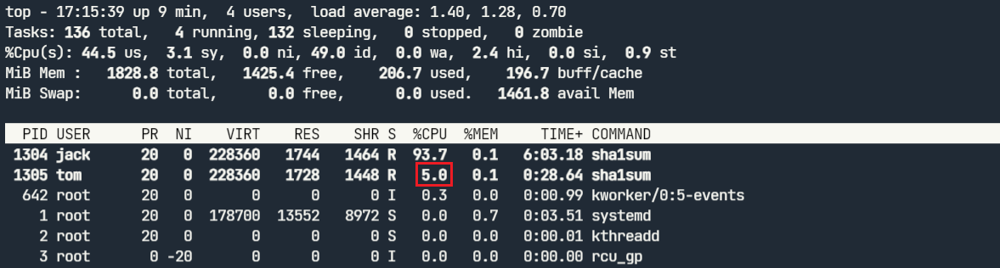
  
CPUQuota 参数支持多核 CPU，可设置为 `CPUQuota=200%` 以使用 2 个 CPU 核心，至于是否能完全使用需考虑程序设计问题。

📚 关于两个强制使用 CPU 的 cgroup 配置参数：

- cpu.cfs_period_us：此参数可设定重新分配 cgroup 可用 CPU 资源的时间间隔，单位是微秒（us）。
- cpu.cfs_quota_us：此参数可以设定在某一阶段（由 cpu.cfs_period_us 规定）某个 cgroup 中所有任务可运行的时间总量，单位为微秒（µs，这里以 "us" 表示）。一旦 cgroup 中任务用完按配额分得的时间，它们就会被在此阶段的时间提醒限制流量，并在进入下阶段前禁止运行。若 cgroup 中任务在每 1 秒内有 0.2 秒，可对单独 CPU 进行存取，请将 cpu.cfs_quota_us 设定为 200000，cpu.cfs_period_us 设定为 1000000。请注意，配额和时间段参数都根据 CPU 来操作。例如，若要让一个进程完全利用两个 CPU，将 cpu.cfs_quota_us 设定为 200000（0.2 秒），cpu.cfs_period_us 设定为 100000（0.1 秒）。默认的 cpu.fs_quota_us 的值为 -1，表示 cgroup 不需遵循任何 CPU 时间限制（root cgroup 除外）。

### 5.4 示例 4️⃣：使用 cgroup 的 `cpuset` 限定进程运行于指定 CPU 与 NUMA 内存节点上

目前 systemd service 单元不能直接管理 cpuset 控制器（cpuset 子系统），因此，cpuset 控制器可通过手动管理或使用 `libcgroup-tools` 软件包管理。以下直接配置 cgroup 与 systemd service 单元以此限制 nginx 进程运行于 1 号逻辑 CPU 与 0 号 NUMA 内存节点。
  
```bash
$ sudo vim /usr/local/bin/cpuset0
#!/bin/bash
mkdir -p /sys/fs/cgroup/cpuset/cpuset0  
echo 1 > /sys/fs/cgroup/cpuset/cpuset0/cpuset.cpus  # 指定运行的逻辑 CPU 编号，可用 "-" 指定范围。
echo 0 > /sys/fs/cgroup/cpuset/cpuset0/cpuset.mems  # 指定运行的 NUMA 内存节点编号
for PID in $(pgrep nginx); do
  echo ${PID} > /sys/fs/cgroup/cpuset/cpuset0/tasks  # 将 nginx 进程添加至限制的 tasks 中  
done  
  
$ sudo chmod +x /usr/local/bin/cpuset0
# 必须赋予可执行权限，否则重启 nginx 进程将失败！
$ cat /etc/systemd/system/nginx.service.d/cpuset.conf 
  [Service]
  ExecStartPost=/usr/local/bin/cpuset0
$ sudo systemctl daemon-reload
$ sudo systemctl restart nginx.service
$ sudo pgrep nginx
  1677
  1678
  1679
$ sudo egrep "Cpus*|Mem*" /proc/167*/status
  /proc/1677/status:Cpus_allowed: 2
  /proc/1677/status:Cpus_allowed_list:    1
  /proc/1677/status:Mems_allowed: 00000000,00000000,00000000,00000000,00000000,00000000,
  00000000,00000000,00000000,00000000,00000000,00000000,00000000,00000000,00000000,00000000,
  00000000,00000000,00000000,00000000,00000000,00000000,00000000,00000000,00000000,00000000,
  00000000,00000000,00000000,00000000,00000000,00000001
  /proc/1677/status:Mems_allowed_list:    0
  /proc/1678/status:Cpus_allowed: 2
  /proc/1678/status:Cpus_allowed_list:    1
  /proc/1678/status:Mems_allowed: 00000000,00000000,00000000,00000000,00000000,00000000,
  00000000,00000000,00000000,00000000,00000000,00000000,00000000,00000000,00000000,00000000,
  00000000,00000000,00000000,00000000,00000000,00000000,00000000,00000000,00000000,00000000,
  00000000,00000000,00000000,00000000,00000000,00000001
  /proc/1678/status:Mems_allowed_list:    0
  /proc/1679/status:Cpus_allowed: 2
  /proc/1679/status:Cpus_allowed_list:    1
  /proc/1679/status:Mems_allowed: 00000000,00000000,00000000,00000000,00000000,00000000,
  00000000,00000000,00000000,00000000,00000000,00000000,00000000,00000000,00000000,00000000,
  00000000,00000000,00000000,00000000,00000000,00000000,00000000,00000000,00000000,00000000,
  00000000,00000000,00000000,00000000,00000000,00000001
  /proc/1679/status:Mems_allowed_list:    0 
# nginx 进程已调度至 cpu1 上
```
  
🔥 建议：在生产环境中使用 systemd 命令行的方式配置限制资源使用而尽可能不要直接操作 cgroup 的文件系统接口 `/sys/fs/cgroup/`。

> 实践：如何直接操作 /sys/fs/cgroup/ 文件系统以实现对指定进程的资源限制？

## 💪 6. 常用的 systemd 单元文件参数说明
  
```bash
$ man 5 systemd.resource-control
# 查看 systemd 资源控制单元配置
$ man 5 systemd.exec
# 查看 systemd 执行环境单元配置
# 注意：可查找 LimitRSS 限制物理内存，LimitAS 限制虚拟内存。
$ man 5 systemd.service
# 查看 systemd 服务单元配置
```

## 7. 参考链接

- [控制组群（Cgroup）简介](https://access.redhat.com/documentation/zh-cn/red_hat_enterprise_linux/6/html/resource_management_guide/ch01)
- [Enable cgroup v2 on RHEL8](https://access.redhat.com/solutions/6898151)
- [12.3. 内核的显著变化 Red Hat Enterprise Linux 9](https://access.redhat.com/documentation/zh-cn/red_hat_enterprise_linux/9/html/considerations_in_adopting_rhel_9/ref_changes-to-kernel_assembly_kernel)
- [Kubernetes 架构 - 关于 cgroup v2](https://www.oomspot.com//post/kubernetesjiagouguanyucgroupv2)
