# Linux 网络配置与调试

## 文档说明

- 该文档侧重于 Linux 物理服务器的网络配置与基本调试，Linux 虚拟机同样可采用类似的配置与调试方式。
- 以下场景中涉及的 OS 版本包括 `RHEL 6.x` 与 `RHEL 7.x`，其他 OS 发行版可自行参考测试。
- 文中提及的网口默认情况下为物理网口。

## 文档目录

- [Linux 网络配置与调试](#linux-网络配置与调试)
  - [文档说明](#文档说明)
  - [文档目录](#文档目录)
  - [常见网线分类与应用场景](#常见网线分类与应用场景)
  - [物理网卡基础概念与分类](#物理网卡基础概念与分类)
  - [RJ45 网口指示灯含义](#rj45-网口指示灯含义)
  - [Linux 实时更改主机名](#linux-实时更改主机名)
  - [net-tools 软件包相关命令](#net-tools-软件包相关命令)
  - [网口配置文件注意事项](#网口配置文件注意事项)
  - [案例：RHEL 6.x 物理机 IP 配置后无法 ping 通网关排查](#案例rhel-6x-物理机-ip-配置后无法-ping-通网关排查)
  - [关于网口配置的额外说明](#关于网口配置的额外说明)
  - [关于网口调试的相关操作](#关于网口调试的相关操作)
  - [RHEL 7.x 更改网口 MAC 地址](#rhel-7x-更改网口-mac-地址)

## 常见网线分类与应用场景

- 网线性能影响因素：串扰、衰减、信噪比
- 组建千兆以太网至少使用 `超 5 类线`，最好使用 `6 类线`，若传输距离超过百米以上，使用 6 类线以上类型。
- 网线的材质：全铜、无氧铜
- 全铜材质网线主要是青铜，电阻较高。
- 无氧铜材质网线含铜度高达 `99.9%`，杂质非常低，国标超 5 类线以上都是无氧铜。
  
  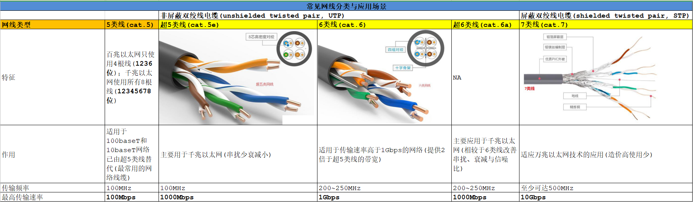

- RJ45 网线水晶头制作标准：  
  - `T568A`：绿白、绿、橙白、蓝、蓝白、橙、棕白、棕  
  - `T568B`：橙白、橙、绿白、蓝、蓝白、绿、棕白、棕
- 直连互联法：网线两端同时使用 T568A 或 T568B 制作标准，常用于计算机、交换机与路由器之间的互联。
- 交叉互联法：网线两端分别使用 T568A 与 T568B 制作标准，常用于计算机与计算机互联。
  
  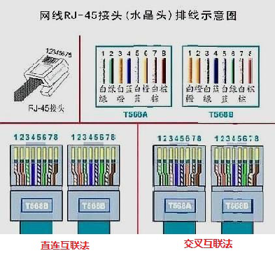

## 物理网卡基础概念与分类

- 以太网卡（Ethernet Adapter）：
  - 传输协议为 `TCP/IP` 协议，通过光纤线缆或双绞线与带电口或光口的以太网交换机连接。
  - 接口类型：
    - 光口：一般都是通过光纤线缆来进行数据传输，接口模块一般为 `SFP` 与 `SFP+`，对应的接口为 `SC`、`ST` 和 `LC`。
    - 电口：目前常用接口类型为 `RJ45`，用来与双绞线连接。
  - 🚀 千兆以太网卡：
    - 电口（RJ45 接口）
    - 常见产品：

      `Broadcom Corporation NetXtreme BCM5719 Gigabit Ethernet PCIe x4 (4 ports)`

      
  
  - 光纤千兆以太网卡：光口（光电转换模块或称光模块）
  - 万兆以太网卡：电口（RJ45 接口）

    
  
  - 🚀 光纤万兆以太网卡：光口（光电转换模块或称光模块）
    - 常见产品：
      - `Intel Corporation 82599ES 10-Gigabit SFI/SFP+ Network Connection (2 ports)`
      - `Intel Corporation Ethernet Controller X710 for 10GbE SFP+ (2 ports)`
      - `Intel XXV710 PCIe x8 Dual Port 25G SFP+ Server Card`：
        - 双光口 25 Gbps 网卡（单口最大支持 `25 Gbps`）
        - 该网卡驱动为 `i40e`，该驱动最大支持的网络速率为 `40 Gbps`，双光口跑满速率理论可到 50 Gbps，但是由于网卡芯片支持最多不超过 40 Gbps，因此实际速率不超过该值。

        > 👉 网卡芯片处理能力提供的是这张网卡所有端口的总和能力，所以即使一张网卡有两个 25G 口，但是芯片只有 40G 处理能力的话，这张卡的两个端口是无法双向跑满的。

    - ✅ 注意:
      - 区分物理服务器主板上所支持的不同 `PCIe` 接口类型，即 x1、x4、x8、x16。
      - 不同光纤万兆以太网卡所使用的光电转换模块有所区别，即 SFP 或 SFP+ 光模块。
      - `SFP/SFP+` 光模块: 光纤 LC 接口、支持发射（TX）与接收（RX）。

    

    
  
  - 千兆以太网卡与光纤万兆以太网卡示例：`Lenovo System x3650 M5 Server`

    

- FC 网卡（Fibre Channel Host Bus Adapter，`FC HBA`）：
  - 一般也叫光纤网卡，传输协议为光纤通道协议，一般通过光纤线缆与外接 `SAN` 存储用的光纤通道交换机连接，其接口类型分为光口与电口。
  - 光口一般都是通过光纤线缆来进行数据传输，接口模块一般为 SFP 与 SFP+，对应的接口为 SC、ST 和 LC。
  - 电口的接口类型一般为 `DB9` 针或 `HSSDC`。
  - `Emulex FC HBA` 示意：

    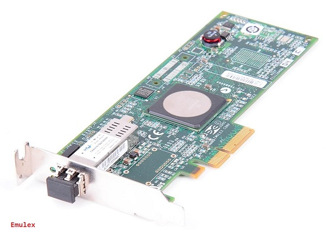
  
  - 🚀 常见 FC HBA 卡驱动：
    - Qlogic HBA：`qla2xxxx/qla4xxxx` 驱动（内核模块）
    - Emulex HBA：`lpfc` 驱动（内核模块）
- iSCSI 网卡（iSCSI HBA）：
  - 传输 `iSCSI` 协议，接口类型为 RJ45。 
  - iSCSI HBA 也可作为普通以太网卡使用，但成本过高。

    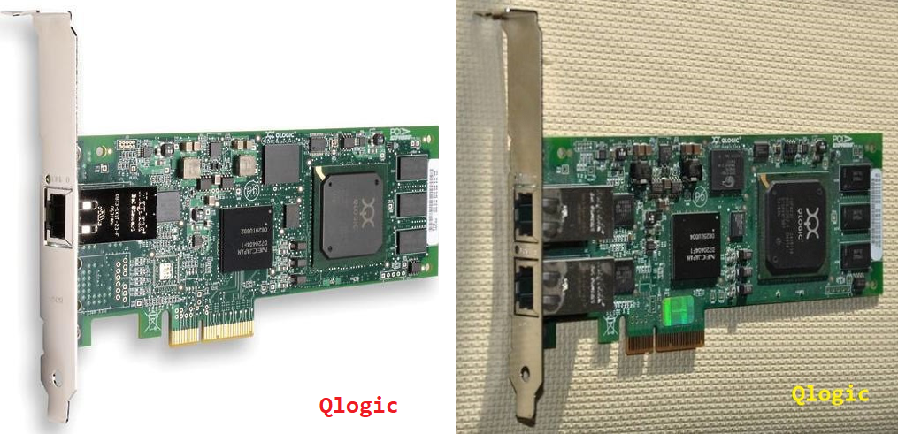

## RJ45 网口指示灯含义

- 指示灯分类：
  - 连接状态指示灯（Link）：连接成功呈绿色且常亮，未连接成功呈不亮。
  - 信号传输指示灯（Act）：呈黄色且不停闪烁，不亮或者不闪烁为无信号传输。

    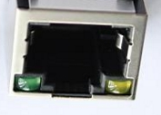

- 百兆网口：
  - 左绿常亮且右黄闪烁，表示连接成功且有信号传输。
- 千兆网口：
  - 左绿常亮且右黄闪烁，表示千兆连接成功且有信号传输。
  - 左黄常亮且右黄闪烁，表示百兆连接成功且有信号传输。

> 👉 注意：指示灯状态有时依赖特定的硬件类型来决定！

## Linux 实时更改主机名

- RHEL 6.x 主机名配置文件：/etc/sysconfig/network
- RHEL 7.x/8.x 主机名配置文件：/etc/hostname
- SLES 11 SP4 主机名配置文件：/etc/HOSTNAME
- SLES 12 SP3 主机名配置文件：/etc/HOSTNAME -> /etc/hostname（软链接）
- Linux 主机名长度限制：最大 `255` 字符
- 系统使用如上配置文件可永久更改主机名，也可使用如下命令实时生效主机名：
  - 临时更改主机名，重启后失效：

    ```bash
    ### 方法 1 ###
    $ sudo hostname <hostname>
    # 实时更新主机名，重启后失效。
    
    ### 方法 2 ###
    $ sudo sysctl kernel.hostname=<hostname>
    # 更改系统主机名内核参数实时更新同步主机名，重启后失效。
    
    ### 方法 3 ###
    $ sudo echo <hostname> > /proc/sys/kernel/hostname
    # 更改系统主机名内核参数实时更新同步主机名，重启后失效。 
    ```
  
  - 永久更改主机名，重启后依然生效：

    ```bash
    ### 方法 1 ###
    $ sudo hostnamectl set-hostname <hostname>
    # 更改系统主机名实时生效，重启后依然生效。
    
    ### 方法 2 ###
    $ sudo echo <hostname> > /etc/hostname
    $ sudo echo <hostname> > /proc/sys/kernel/hostname
    # 更改主机名配置文件，并同步主机名内核参数，使其实时生效。
    ```
  
  - 命令执行如下所示：

    

## net-tools 软件包相关命令

> 💥 该软件包已不再提供维护，可使用 ip 命令替代 ifconfig 命令！

- 临时配置网络接口并激活，重启网络或再次开机后将失效，常用于临时性测试。
  
  ```bash
  $ sudo ifconfig eth0 182.241.91.25/24 up
  ```

- 临时配置添加 139 网段，常用于临时性测试。
  
  ```bash
  $ sudo route add -net 139.0.0.0 netmask 255.0.0.0 gw 139.241.91.1 dev eth0
  ```

- 👉 配置虚拟网络子接口：
  
  ```bash
  $ sudo ifconfig ens3:0 10.5.34.159 netmask 255.255.255.0 up
  # 临时配置网络接口 ens3 虚拟网络子接口的 IP 地址并将其激活，重启网络或重启系统后将失效。
  # 可将其写入 /etc/rc.d/rc.local 脚本中，添加可执行权限，实现开机自启动，但重启网络后失效。
  # 注意： 
  #   ethX:n：表示网络接口 ethX 的第 n 个虚拟网络子接口，可配置 IP。
  #   ethX.n：表示网络接口 ethX 的第 n 个虚拟 VLAN 网络子接口。
  ```
  
  

## 网口配置文件注意事项

- RHEL 6.x/7.x：
  - `/usr/share/doc/initscripts-*/sysconfig.txt` 说明文件：包含 ifcfg-ethX 的配置参数说明
  - `/etc/sysconfig/network-scripts/ifcfg-ethX` 配置文件：
    - DEFROUTE=[yes|no]，该参数指定默认路由接口（默认为 `yes`）。
    - 配置网口配置文件时需查看是否具有该参数，否则在静态路由表中将出现多条默认路由，这在生产环境中是不允许的！
  - `/etc/sysconfig/network-scripts/route-ethX` 配置文件：
    - 该配置文件中可同时配置多条路由，即同一网络接口可配置多个 IP 地址，因此可具有多条路由。
    - ✅ 但一旦针对某个 IP 的流量增大时，该网络接口负载升高，不建议在同一网络接口上配置多个 IP 地址。
- SLES 11 SP4/SLES 12 SP3：
  - routes 配置文件：包括所有网络接口的路由，或该配置文件为空，各网络接口的路由分别在各自 `ifroute-ethX` 中定义。
  - ifroute-ethX 配置文件：各网络接口的路由配置文件，若 routes 配置文件中未定义，可在该配置文件中定义路由。

## 案例：RHEL 6.x 物理机 IP 配置后无法 ping 通网关排查

- 问题描述:
  - 大数据平台 RHEL 6.8 系统安装后，139 带外网段与 182 对外服务网段 IP 均已配置。
  - 使用配置的 IP 地址无法 ping 通相应网关。
- 原因分析：
  - 硬件层面：相应网络接口与网线是否松动
  - 网络层面：相应网线与交换机（VLAN）或路由器是否连接错误，可查看交换机或路由器是否能接收到主机 ping 发送的数据包，以及 MAC 表中是否学习到相应的网络接口 `MAC` 地址与 `IP` 地址的对应信息。
  - 系统层面：系统未激活相应物理网络接口，或网络接口与路由配置存在问题。
- 排查过程：
  
  ```bash
  $ sudo /etc/init.d/NetworkManager stop
  $ sudo chkconfig --level 35 NetworkManager off
  # 关闭并取消 NetworkManager 服务开机自启动，防止干扰 network 服务。    
  
  $ sudo ip address show
  # 查看系统全部的可用网络接口及状态，可区分激活与未激活的网络接口。
  
  $ sudo ethtool eth0
    Speed: 1000Mb/s
    # 当前支持的网络速率为 1000Mb/s（千兆，125MB/s） -> 10000Mb/s（万兆，1250MB/s）
    Link detected: yes    
    # 系统已检测到网卡，网络接口与网线连接正常。
    # 查看需配置相应 IP 的网络接口参数，如下所示，该物理网络接口类型为光纤万兆口。
    # 若显示 Link detected: no，表明网络接口与网线连接异常，物理机背板上网络接口处
    # LED 灯可能闪烁黄灯，需检查物理连接状态。
  ```
  
  此次配置过程中系统层面，无论 IP 地址与路由信息均以配置正确，经过与网络部协商与配合，发现上游交换机端口未配置正确 `VLAN` 导致的通信异常，配置正确后即解决问题。

## 关于网口配置的额外说明

- 网口的工作模式配置，如下所示：
  - 物理网口的硬件信息，如下所示：

    
  
  - 以上输出中 `Speed` 参数表示当前支持的网络速率，但该网口也可支持其他网络速率。
    - 影响 Speed 参数的因素：上游交换机对网络速率限流，如将 `1000Mb/s` 限流至 `10Mb/s`，该场景在某次项目中某银行数据中心的集团门户网站节点上出现过。
    - 可配置物理网络接口为自适应（`auto-negotiation`）模式，自动识别网络速率，也可直接配置物理网络接口的 speed 参数来调整支持的网络速率。
  - 物理网口的重要参数：
    - 支持的网络速率：10Mb、100Mb、1000Mb、10000Mb
    - 工作模式：半双工模式（Half）、全双工模式（Full）
    - 自适应模式（自协商模式）
    - 配置方式：

      ```bash
      ### 方法 1 ###
      $ sudo ethtool -s <interface> speed [10|100] duplex full autoneg off
      # 命令行手动配置实时生效，但系统重启后将失效。
      
      ### 方法 2 ###
      $ sudo vim /etc/sysconfig/network-scripts/ifcfg-<interface>
        ...
        ETHTOOL_OPTS="speed [10|100] duplex full autoneg off"
        # RHEL 6.8/7.x
        ETHTOOL_OPTIONS='speed [10|100] duplex full autoneg off'  
        # SLES 12 SP3
        # 配置物理接口参数：网络速率 10 或 100Mb/s、全双工模式、关闭自适应模式。
        # 根据 IEEE 802.3-2002 规定，使用千兆网络时，必须开启自适应模式，不能关闭。
      # 网口配置文件中永久配置，系统重启依然生效。
      ```

      

    - 端到端网络工作模式，如下所示：

      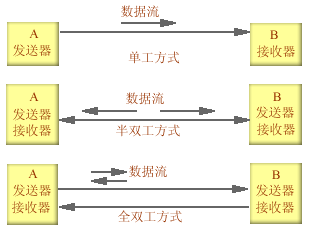

- 🚀 光纤万兆以太网卡双网口绑定：
  - 将两块不同万兆网卡上的两个不同的光纤万兆网口进行绑定，防止因一块网卡故障而导致的绑定失效。
  - 可根据不同网口的 MAC 地址判断不同网口是否在同一物理网卡上。

    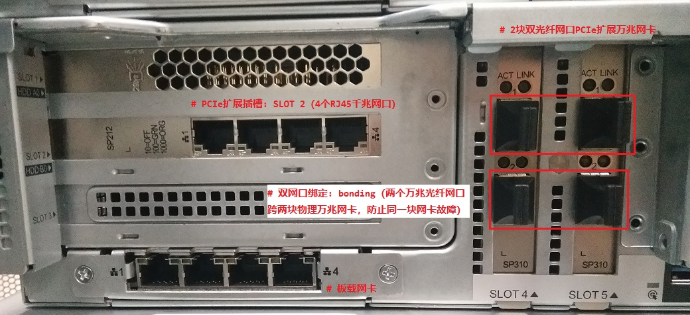

- 查看系统上指定物理网口的 PCI 信息：
  
  物理网口的 PCI 地址可通过 `dmesg` 命令在系统开机引导过程中的硬件加载信息中查询，也可通过 `lshw` 命令查看具体硬件的 PCI 信息，如下所示：
  
  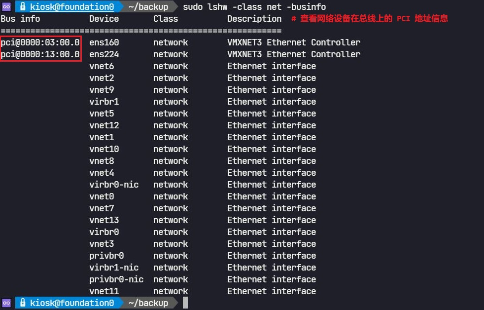
  
  根据 PCI 地址通过 `lspci` 命令查询指定硬件更为详细的信息，如下所示：
  
  ```bash
  $ sudo lspci -v -k -nn -s <bus>:<slot>.<function>
  # 以上 lspci 命令行选项，如下所示：
  #   -v   查看命令行输出的详细信息
  #   -k   查看该设备的 kernel 内核驱动
  #   -nn  查看该设备的文本输出信息与数值 ID 信息
  #   -s   查看该设备的所在 PCI 槽位信息
  ```
  
  

- 查看指定网口的环形缓冲区大小（`ring buffer`）：
  
  ```bash
  $ sudo ethtool --show-ring <interface>
  ```
  
  

## 关于网口调试的相关操作

- 若根据物理硬件信息，无法在物理服务器上查看网口信息，可使用如下命令查看开机过程中网口的加载状态，可能由于网卡驱动问题而导致无法正常加载。
  
  ```bash
  $ sudo dmesg | grep -E -i 'Ethernet|eth'
  ```

- 查看所有网口的状态：当前支持的网络速率、网线连接状态等
  
  ```bash
  $ for i in $(seq 0 11); do \
    ip link set eth$i down; sleep 10s; \
    ip link set eth$i up; sleep 10s; \
    echo "--- eth$i ---"; \
    ethtool eth$i | grep -E "Speed:|Link detected:"; \
  done
  ```

> 💥 注意：激活或宕掉网口需要一定时间，查看网口状态应隔一段时间！

- 临时性设置 IP 地址与静态路由的调试：
  
  ```bash
  $ sudo ip address add 139.99.40.88/24 dev eth0 up
  # 配置网口 eth0 临时 IP 地址进行网络连通性测试
  $ sudo route add -net 139.0.0.0 netmask 255.0.0.0 gw 139.99.40.1 dev eth0
  $ sudo ip route add 139.0.0.0/8 via 139.99.40.1 dev eth0
  # 两种方法：配置网口 eth0 临时路由进行网络连通性测试
  ```
  
  - 💥 若只配置一个或少数网口的 IP 或路由时，在配置完相应配置文件后，使用 `ifup ethX` 或 `ifdown ethX` 即可，将对网口的操作粒度降到最低。
  - 若将整个网络服务重启，若在配置过程中存在错误的话，将导致网络无法重启，造成 `SSH` 连接断开或业务中断！
  - 推荐做法：在配置相应网口 IP 时，先临时配置 IP，连通性测试通过后再写入配置文件。
  - 配置完 IP 地址与路由进行 ping 测试时，若发现无法 ping 通网关，可尝试 ping 同一广播域中的主机（保持长 ping），如果网络调试正确即可显示响应！
- 在某些需求中，需将 `RHEL 7.x` 中的随固件生成的网口名称更改为形如 `ethX` 的网口名称，实现方法如下所示：
  - RHEL 6.x：

    > 👉 作为配置参考回顾 RHEL 6.x 中的实现方法。

    - `/etc/udev/rules.d/70-persistent-net.rules`：绑定网口名称与物理 MAC 地址
    - 若该配置文件中将同一网络接口绑定不同的物理 MAC 地址，重启网络子系统后，该网口名称将报错，返回为 `renameX` 名称。

      
  
  - 🚀 RHEL 7.x：
    - 由于在 RHEL 7.x 中网口根据固件属性进行命名与硬件 MAC 地址绑定，避免因形如 ethX 的网口在每次重启后与硬件 MAC 地址不对应情况出现。
    - 若物理服务器中安装 RHEL 7.x，需将网口名称更改为形如 ethX 的话，在 `/etc/default/grub` 中配置参数 `net.ifnames=0 biosdevname=0` 后，重启系统后依然无法将更改的 ethX 物理网口名称与硬件 MAC 地址绑定，可执行下一步操作。
    - 可直接创建配置文件 `ifcfg-ethX`，并将硬件 MAC 地址一同写入该配置文件中进行绑定，重启系统使其生效。
    - 💥 但请注意，以上方法在绝大多数物理服务器上均做过尝试，如 HPE、Huawei、H3C、Dell 等，只能将数个网口中的一部分使 ethX 成功命名，且在系统重启后依然与硬件 MAC 地址绑定，其余的网口并未生效，而在 `VMware` 虚拟机与 `KVM` 虚拟机中尝试绑定均可成功实现！

      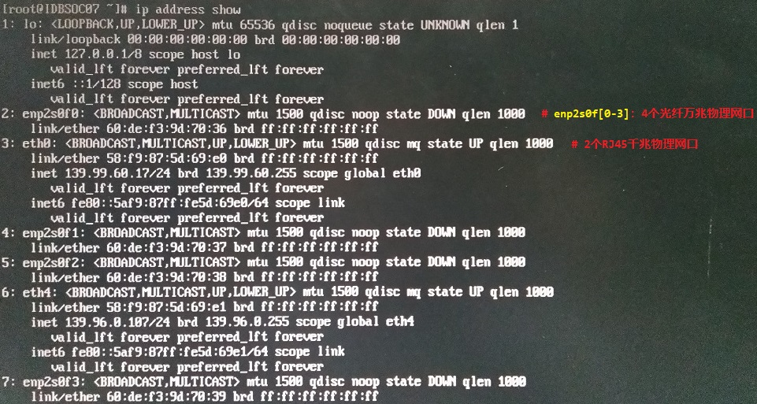

      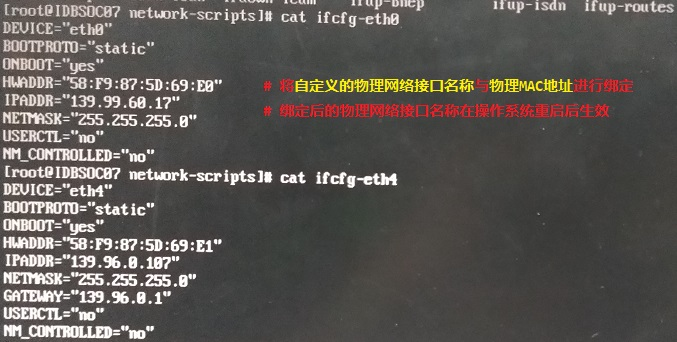

## RHEL 7.x 更改网口 MAC 地址

- `HWADDR` 与 `MACADDR` 相区别：
  
  HWADDR 可使用 dmesg 命令进行查看，为真正的网口 MAC 地址。
  
  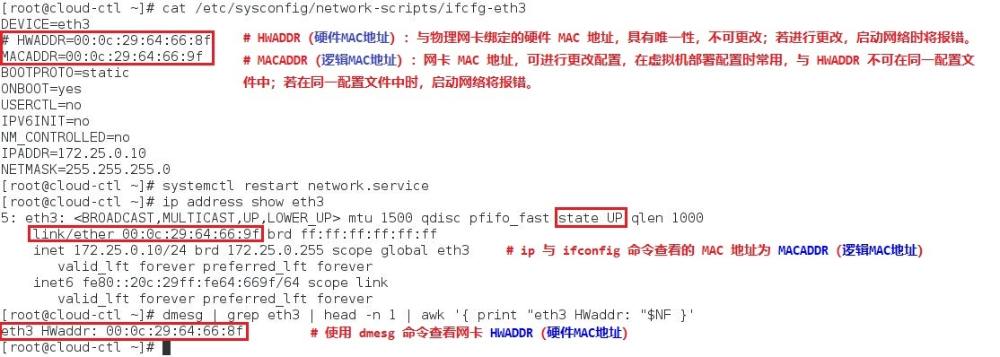

- 查看网口实际使用的 MAC 地址：
  
  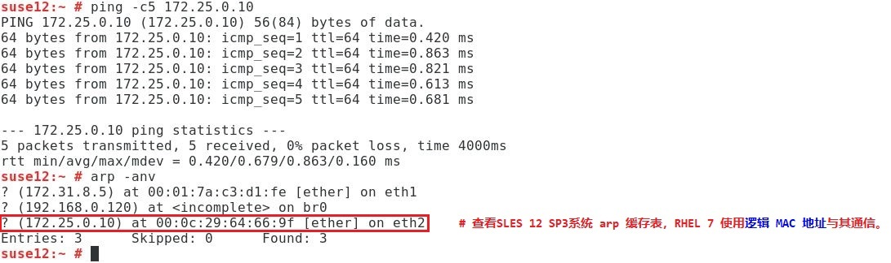
