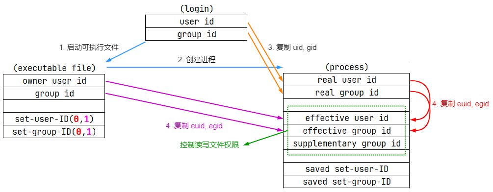

# 🔐 Linux 进程权限的各类 UID 探讨

## 文档说明

- 各版本对应：
  
  | OS 版本 | 内核版本 | 是否测试 |
  | ----- | ----- | ----- |
  | Red Hat Enterprise Linux release 9.2 (Plow) | 5.14.0-284.25.1.el9_2.x86_64 | 本文实验测试 |
  | Ubuntu 20.04.3 LTS | 5.15.0-57-generic | 已测试通过（未列出） |

- Linux 中各类 UID 的联系与区别对于理解进程权限与 Audit 审计系统发挥至关重要的作用，这些 UID 作为进程凭证。
- ✍ 可参考 `man 7 credentials` 手册中的说明加以理解。
- 术语说明：
  - set-user-ID 程序、set-group-ID 程序与 SUID 程序都是指设置了 suid 权限位的程序
  - set-user-ID 权限位与 suid 权限位相同

## 文档目录

- [🔐 Linux 进程权限的各类 UID 探讨](#-linux-进程权限的各类-uid-探讨)
  - [文档说明](#文档说明)
  - [文档目录](#文档目录)
  - [1. 各类 UID 的解析](#1-各类-uid-的解析)
    - [1.1 user ID（uid）](#11-user-iduid)
    - [1.2 Real user ID（ruid）](#12-real-user-idruid)
    - [1.3 Effective user ID（euid）](#13-effective-user-ideuid)
    - [1.4 Saved set-user-ID](#14-saved-set-user-id)
    - [1.5 Audit user ID（auid）](#15-audit-user-idauid)
  - [2. ruid、euid 与 Saved set-user-ID 间的关系](#2-ruideuid-与-saved-set-user-id-间的关系)
    - [2.1 进程启动过程中三者的赋值关系](#21-进程启动过程中三者的赋值关系)
    - [2.2 三种 UID 变化关系总结](#22-三种-uid-变化关系总结)
  - [⚗️ 3. ruid 与 euid 的验证实例](#️-3-ruid-与-euid-的验证实例)
    - [3.1 创建与修改文件属组及权限](#31-创建与修改文件属组及权限)
    - [3.2 system 函数与 set-user-ID 权限位对文件读取的影响](#32-system-函数与-set-user-id-权限位对文件读取的影响)
    - [3.3 Linux 中 SUID 程序与 system() 函数的安全机制讨论](#33-linux-中-suid-程序与-system-函数的安全机制讨论)
    - [3.4 fopen/fread 函数与 set-user-ID 权限位对文件读取的影响](#34-fopenfread-函数与-set-user-id-权限位对文件读取的影响)
  - [各类 UID 在 Audit 审计系统中的说明](#各类-uid-在-audit-审计系统中的说明)
  - [参考链接](#参考链接)

## 1. 各类 UID 的解析

### 1.1 user ID（uid）

- 常规 Linux 用户 ID；
- 作为系统中用户的唯一识别符，通常与 ruid 等同。

### 1.2 Real user ID（ruid）

- 真实用户 ID；
- **ruid 为当前进程的用户 ID，即调用此可执行文件的用户；**
- 注意：一般情况下，最初登录 Shell 的 user ID 与 ruid 相同，但是此登录用户可能通过 su 切换为其他非特权用户或特权用户，此时的 ruid 为切换后的用户 uid，与最初的登录 user ID 不同。

### 1.3 Effective user ID（euid）

- 有效用户 ID；
- **euid 被内核使用确定进程可访问资源的权限，进程的权限由 euid 来决定；**
- 通常而言，进程的 ruid 与 euid 保持一致；
- euid 临时存储了另一个用户的 UID；
- 🚀 euid 在 **执行** set-user-ID 程序或 set-group-ID 程序时被修改：当可执行文件设置了 set-user-ID 权限位，内核会在程序加载时将 euid 更改为文件所有者的 UID；未设置该权限位的可执行文件，euid 保持与 ruid 一致。此外，进程也可以通过 setuid() 等系统调用来 **显式修改** euid。

### 1.4 Saved set-user-ID

- 保存设置用户 ID；
- 🚀 该 ID 相当于一个 `buffer`，在进程启动后，它会从 euid 拷贝信息到自身。对于非 root 用户，可以在未来使用 setuid() 系统调用来将 euid 设置成为 ruid 和 saved set-user-ID 中的任何一个。但是非 root 用户是不允许用 setuid() 将 euid 设置成为任何第三个 user ID。

### 1.5 Audit user ID（auid）

- 审计用户 ID，用于记录 Linux Audit 审计系统中的用户标识；
- auid 为最初登录 Shell 的的用户 ID。

## 2. ruid、euid 与 Saved set-user-ID 间的关系

### 2.1 进程启动过程中三者的赋值关系
  
<center></center>
  
- 1️⃣2️⃣ 假定最初登录 Shell 的用户启动运行可执行文件，启动进程。  
- 3️⃣ 设置进程的 ruid/rgid 为当前用户的 uid/gid  
- 4️⃣ 设置进程的 euid/egid，根据可执行文件的 set-user-ID 与 set-group-ID 权限位进行设置，图中 **<font color=red>红色 0</font>** 表示关闭，**<font color=purple>紫色 1</font>** 表示开启。为 1 时，将进程的 euid/egid 设置为可执行文件的 uid/gid，否则从 ruid/rgid 拷贝。

### 2.2 三种 UID 变化关系总结
  
| ID 类型 | set-user-ID 权限位关闭 | set-user-ID 权限位开启 |
| ----- | ----- | ----- |
| Real user ID | 不变 | 不变 |
| Effective user ID | 不变 | **<font color=orange>内核设置为可执行文件的 user ID</font>** |
| Saved set-user-ID | 复制 Effective user ID | 复制 Effective user ID |

## ⚗️ 3. ruid 与 euid 的验证实例

### 3.1 创建与修改文件属组及权限

```bash
[student@serverc ~]$ sudo echo "Test" > file-read-only-by-devops
[student@serverc ~]$ sudo cat file-read-only-by-devops
Test
# 创建测试用文件

[student@serverc ~]$ sudo chown devops:devops file-read-only-by-devops
[student@serverc ~]$ sudo chmod 0400 file-read-only-by-devops
# 更改文件属组与权限

[student@serverc ~]$ ls -lh
total 12K
-r--------. 1 devops  devops    5 Mar 21 10:17 file-read-only-by-devops    # 文件仅 devops 用户可读
-rw-r--r--. 1 student student 603 Mar 21 10:16 process_cred_sample.c
-rw-r--r--. 1 student student 889 Mar 21 10:04 process_cred_sample_adv.c
```

[process_cred_sample.c](https://github.com/Alberthua-Perl/sc-col/blob/master/diff-uid-test/process_cred_sample.c) 程序如下所示：
  
```c
#define _GNU_SOURCE
#include <stdio.h>
#include <stdlib.h>
#include <unistd.h>
#include <sys/types.h>
  
int main()
{
    uid_t ruid, euid, suid;
    getresuid(&ruid, &euid, &suid);
    printf("RUID: %d, EUID: %d, SUID: %d\n", ruid, euid, suid);
    system("cat file-read-only-by-devops");    //file read-only by devops: -r-------- devops devops

    setreuid(geteuid(), geteuid());            //use euid to set ruid
    getresuid(&ruid, &euid, &suid);
    printf("RUID: %d, EUID: %d, SUID: %d\n", ruid, euid, suid);
    system("cat file-read-only-by-devops");   //file read-only by devops: -r-------- devops devops

    return 0;
}
```

### 3.2 system 函数与 set-user-ID 权限位对文件读取的影响
  
```bash
[student@serverc ~]$ id -u student    # 查看 student 用户
1000
[student@serverc ~]$ id -u devops     # 查看 devops 用户
1001
[student@serverc ~]$ sudo dnf install -y gcc
[student@serverc ~]$ gcc -o process_cred_sample process_cred_sample.c
[student@serverc ~]$ sudo chown devops:student process_cred_sample    # 重点1：更改可执行文件所有者为 devops
[student@serverc ~]$ sudo chmod u+s process_cred_sample               # 重点2：添加可执行文件的 set-user-ID 权限位
[student@serverc ~]$ ls -lh process_cred_sample
-rwsr-xr-x 1 devops student 26K Mar 21 23:08 process_cred_sample
[student@serverc ~]$ ls -lhd /home/student/
drwx------. 3 student student 4.0K Mar 21 10:51 /home/student/
[student@serverc ~]$ chmod 0775 /home/student/    # 重点3：由于 student 用户家目录不具有其他用户的访问权限，devops 用户无法读取其中的文件，因此，更改权限为 0775。
[student@serverc ~]$ ls -lhd /home/student/
drwxrwxr-x. 3 student student 4.0K Mar 21 10:51 /home/student/

[student@serverc ~]$ ./process_cred_sample
RUID: 1000, EUID: 1001, SUID: 1001
cat: file-read-only-by-devops: Permission denied    # 第一次输出
RUID: 1001, EUID: 1001, SUID: 1001
Test    # 第二次输出
```
  
🤔 结果解读：以上程序第一次输出通过 system() 函数以及 `cat file-read-only-by-devops` 此 shell 作为实参，虽然通过 set-user-ID 权限位设置了 euid(1001)，但即便如此，system() 函数调用的 shell 也无法继承提权后的 euid(1001)，此 euid 在调用的 shell 中被重置为 ruid(1000) 的值，因此无权读取 devops 用户的文件而最终返回 **Permission denied**（见 3.3 节）。第二次输出使用 setreuid() 系统调用，将 euid(1001) 的值代替 ruid(1001) 的值作为参数传入，因此 ruid 也返回 1001，即使依然使用 system() 函数调用 shell，此时的 euid(1001) 等于 ruid(1001)，该进程可读取 devops 用户所有的文件内容。但请注意的是，此时的 ruid(1001) 是 setreuid() 系统调用的 **显式设置**。

### 3.3 Linux 中 SUID 程序与 system() 函数的安全机制讨论

`man bash` 手册中 **INVOCATION** 部分对 ruid 与 euid 设置的描述：

```plaintext
If the shell is started with the effective user (group) id not equal to the real user (group) id, and the -p option is not supplied, no startup files are read, shell functions are  not  inherited from  the  environment, the SHELLOPTS, BASHOPTS, CDPATH, and GLOBIGNORE variables, if they appear in the environment, are ignored, and the effective user id is set to the real user id.  If the -p option is supplied at invocation, the startup behavior is the same, but the effective user id is not reset.

如果启动 shell 时有效用户（组）ID 不等于实际用户（组）ID，且未使用 -p 选项，则不会读取启动文件，shell 函数不会从环境继承，SHELLOPTS、BASHOPTS、CDPATH 和 GLOBIGNORE 变量（如果存在于环境中）将被忽略，并且有效用户 ID 将设置为实际用户 ID。如果在调用时使用 -p 选项，则启动行为相同，但有效用户 ID 不会被重置。
```

上述程序启动与各 UID 设置过程：

```plaintext
SUID 程序启动时：
    RUID=1000 (student) ← 真实身份
    EUID=1001 (devops)  ← 提升后的有效身份（可以读文件）
            ↓
    system("/bin/sh -c 'cat ...'")
            ↓
    /bin/sh 启动时检测到 RUID ≠ EUID
            ↓
    自动执行 setuid(RUID)，丢弃特权
            ↓
    shell 内：RUID=1000, EUID=1000
            ↓
    cat 以 EUID=1000 运行
            ↓
    无法读取 devops (UID 1001) 的文件 → Permission denied
```

### 3.4 fopen/fread 函数与 set-user-ID 权限位对文件读取的影响

从以上程序可知，如果要替换 system() 函数在原程序中直接打开并读取文件，可使用 `fopen()` 与 `fread()` 函数。将以上源码改名为 [process_cred_sample_adv.c](https://github.com/Alberthua-Perl/sc-col/blob/master/diff-uid-test/process_cred_sample_adv.c) 程序：
  
```c
#define _GNU_SOURCE
#include <stdio.h>
#include <stdlib.h>
#include <string.h>
#include <unistd.h>
#include <sys/types.h>
  
#define BUFF_SIZE 100
  
void read_file() {
    FILE *fp;
    char buffer[BUFF_SIZE];
  
    /* Open file for both reading and writing */
    fp = fopen("file-read-only-by-sysadmin", "r");
    /* Read and display data */
    fread(buffer, BUFF_SIZE - 1, sizeof(char), fp);
    printf("%s\n", buffer);
    fclose(fp);
}
  
int main()
{
    uid_t ruid, euid, suid;
    getresuid(&ruid, &euid, &suid);
    printf("RUID: %d, EUID: %d, SUID: %d\n", ruid, euid, suid);
    read_file();    //file read-only by devops: -r-------- devops devops

    setreuid(geteuid(), geteuid());
    getresuid(&ruid, &euid, &suid);
    printf("RUID: %d, EUID: %d, SUID: %d\n", ruid, euid, suid);
    read_file();    //file read-only by devops: -r-------- devops devops

    return 0;
}
```
  
```bash
[student@serverc ~]$ gcc -o process_cred_sample_adv process_cred_sample_adv.c
[student@serverc ~]$ sudo chown devops:student process_cred_sample_adv    # 重点1
[student@serverc ~]$ sudo chmod u+s process_cred_sample_adv               # 重点2
[student@serverc ~]$ ls -lh
total 68K
-r--------. 1 devops  devops    5 Mar 21 10:17 file-read-only-by-devops
-rwsr-xr-x  1 devops  student 26K Mar 21 23:08 process_cred_sample
-rw-r--r--  1 student student 618 Mar 22 08:38 process_cred_sample.c
-rwsr-xr-x  1 devops  student 26K Mar 22 10:28 process_cred_sample_adv
-rw-r--r--  1 student student 879 Mar 22 10:28 process_cred_sample_adv.c
[student@serverc ~]$ ./process_cred_sample_adv
RUID: 1000, EUID: 1001, SUID: 1001    # 第一次输出
Test

RUID: 1001, EUID: 1001, SUID: 1001    # 第二次输出
Test
```
  
🤔 结果解读：以上程序第一次输出由于直接使用 fopen() 与 fread() 函数且 euid 更改为 1001，可读取对应文件的内容，而第二次输出通过 setreuid() 系统调用将 ruid 与 euid 都设置为 1001，也可读取对应文件的内容，因此，**<font color=orange>对于系统资源的访问取决于 euid</font>**。

## 各类 UID 在 Audit 审计系统中的说明

请参考 [5.2 审计字段各类 uid 的探讨](https://github.com/Alberthua-Perl/tech-docs/blob/master/Linux%20%E5%9F%BA%E7%A1%80%E4%B8%8E%E8%BF%9B%E9%98%B6/Linux%20%E4%B8%AD%E4%BD%BF%E7%94%A8%20AUDIT%20%E8%AE%B0%E5%BD%95%E7%B3%BB%E7%BB%9F%E4%BA%8B%E4%BB%B6/Linux%20%E4%B8%AD%E4%BD%BF%E7%94%A8%20AUDIT%20%E8%AE%B0%E5%BD%95%E7%B3%BB%E7%BB%9F%E4%BA%8B%E4%BB%B6.md#-52-%E5%AE%A1%E8%AE%A1%E5%AD%97%E6%AE%B5%E5%90%84%E7%B1%BB-uid-%E7%9A%84%E6%8E%A2%E8%AE%A8)

## 参考链接

- [credentials(7) - Linux man page](https://linux.die.net/man/7/credentials)
- [setreuid(2) - Linux manual page](https://man7.org/linux/man-pages/man2/setregid.2.html)
- [Difference between Real User ID, Effective User ID and Saved User ID](https://stackoverflow.com/questions/32455684/difference-between-real-user-id-effective-user-id-and-saved-user-id)
- [深刻理解 - real user id, effective user id, saved user id in Linux](https://blog.csdn.net/fmeng23/article/details/23115989?spm=1001.2101.3001.6650.4&utm_medium=distribute.pc_relevant.none-task-blog-2%7Edefault%7ECTRLIST%7ERate-4-23115989-blog-40857821.pc_relevant_default&depth_1-utm_source=distribute.pc_relevant.none-task-blog-2%7Edefault%7ECTRLIST%7ERate-4-23115989-blog-40857821.pc_relevant_default&utm_relevant_index=5)
- ❤️[《Linux/Unix 系统编程手册》（上册）- 第9章 进程凭证（提取码：wop8）](https://pan.baidu.com/s/1DX8AEVBqepVDp3tiR06nBQ)
- [ruid, euid, suid usage in Linux](https://mudongliang.github.io/2020/09/17/ruid-euid-suid-usage-in-linux.html)
