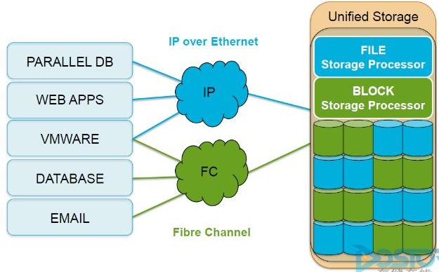
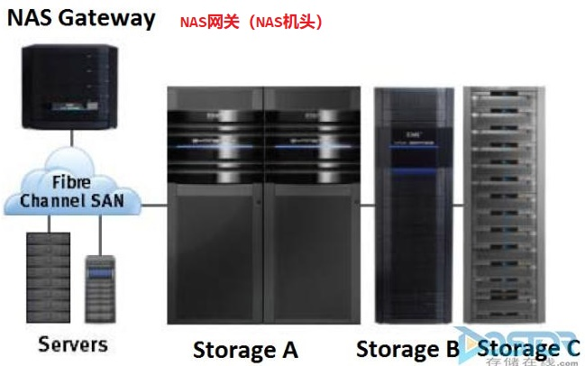
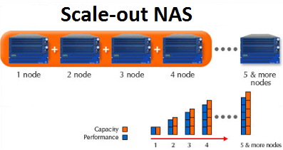

# NAS 存储实现类型对比

- NAS 主要有三种类型的实现：
  - 统一式、网关式、横向扩展式（scale-out）
  - 统一式 NAS 使用统一的存储平台将基于 NAS 和基于 SAN 的数据访问合并，提供了可以同时管理两种环境的统一管理界面。
  - 网关式 NAS 使用外部存储来存取数据，网关式 NAS 和存储的管理操作是分开的。
  - 横向扩展式（scale-out）NAS 可组合多个节点，形成一个集群 NAS 系统。
- 统一式 NAS：
  - 统一式 NAS 提供文件服务，同时负责存储文件数据，并提供块数据访问。
  - 它支持用于文件访问的 CIFS 和 NFS 协议，以及用于块级访问的 SCSI 和 FC 协议。
  - 因为基于 NAS 和基于 SAN 的访问合并到同一个存储平台，统一式 NAS 降低了企业的基础设施成本和管理成本。
  - 统一式 NAS 的一个系统中包括了一个或多个 NAS 头及存储。
  - NAS 头与存储控制器连接，提供到存储的访问。
  - 存储控制器提供了与 iSCSI 和 FC 主机的连接。
  - 存储可使用不同的磁盘类型（如 SAS、SATA、FC 和闪存盘），以满足不同的负载需求。
  - 统一式 NAS 连接示例：

    

- 网关式 NAS：
  - 网关式 NAS 设备包含一个或多个 NAS 头，使用外部存储或者独立管理的存储。
  - 与统一式 NAS 相似，存储是与其他使用块级 I/O 的应用共享的。
  - 这种解决方案的管理功能比统一存储复杂，因为 NAS 头和存储器的管理任务是分开的。
  - 网关式 NAS 解决方案可以利用 FC 基础设施，如交换机等，访问 SAN 存储阵列或直连式存储阵列。
  - 网关式 NAS 的扩展性比统一 NAS 好，因为 NAS 头和存储阵列可以独立地根据需求进行扩展升级。如，可以通过增加 NAS 头的方式提升 NAS 设备的性能。
  - 当存储容量达到上限时，网关 NAS 设备可以独立于 NAS 头对 SAN 进行扩展，增加存储容量。
  - 网关式 NAS 通过在 SAN 环境中进行存储共享，提高了存储资源的利用率。
  - 网关式 NAS 连接示例：

    

- 横向扩展式（scale-out）NAS：
  - 统一式 NAS 和网关式 NAS 实现都提供了一定的扩展性能，可以在数据增长和性能需求提高时对资源进行扩展。
  - 对 NAS 设备进行扩展主要涉及增加 CPU、内存和存储容量。
  - 扩展性受制于 NAS 设备对后续增加 NAS 头和存储容量的支持能力，即纵向扩展（scale-up）受限。
  - 横向扩展式（scale-out）NAS 可组合多个节点，形成一个集群 NAS 系统。
  - 只需要向集群 NAS 架构中添加节点即可实现资源的扩展。
  - 整个集群可看作是一个 NAS 设备，资源是集中管理的。
  - 在需要扩大容量或提高性能的时候，可向集群中添加节点，这不会造成停机下线的情况。
  - 横向扩展式 NAS 可以集合许多性能和可用性中等的节点，形成集群系统拥有更好的总体性能和可用性。
  - 它还有易使用、陈本低以及理论上可无限扩展的优势。
  - 横向扩展式（scale-out）NAS 在集群中的所有节点上创建了一个单一文件系统。
  - 节点的所有信息都可以彼此共享，因此连接到任何节点的客户端都可以访问整个文件系统。
  - 集群 NAS 将数据在所有节点间分条，同时使用镜像或校验方式进行数据保护。
  - 数据从客户端发送到集群时，数据被分割，并行分配给不同节点。
  - 当客户端发送文件读取请求时，集群 NAS 从多个节点获取相应的块，将它们组合成文件，然后将文件发给客户端。
  - 随着节点的增加，文件系统实现动态扩展，数据在节点之间均衡分布。
  - 每个增加的节点都增加了整个集群的存储、内存、CPU 和网络能力。
  - 因此，整个集群的性能都得到提升。
  - 横向扩展式（scale-out）NAS 适合解决企业和客户当前面临的大数据问题。
  - 它统一管理和存储高速增长的数据，同时又十分灵活，能满足各种性能需求。
  - 横向扩展式（scale-out）NAS 连接示例：

    
