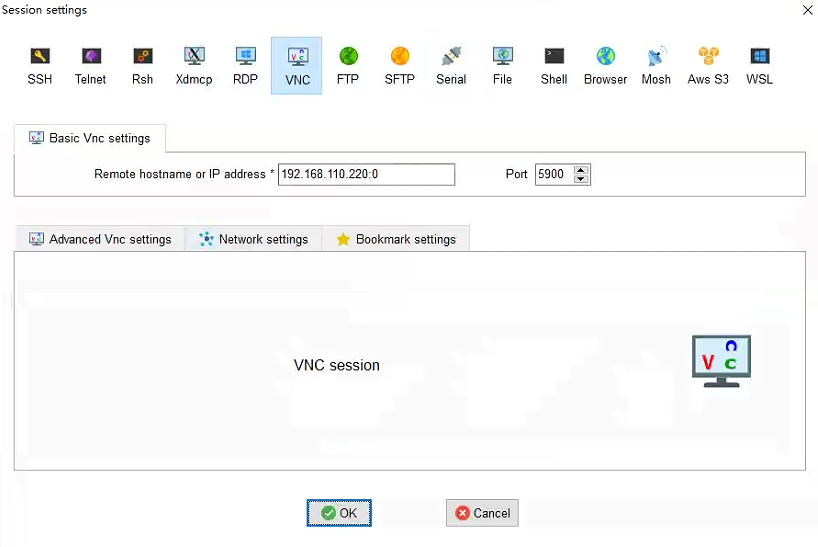
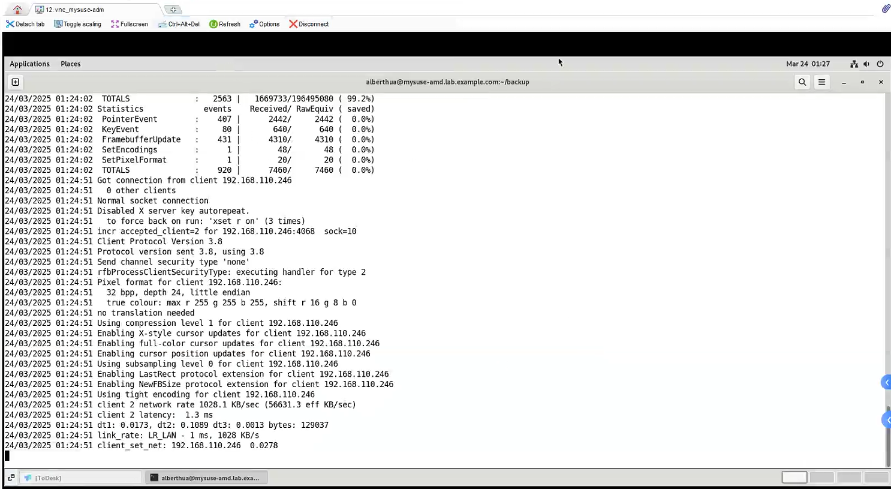

# 🦎 RHEL9.3 与 SLE15SP6 系统使用对比

## 文档说明 & 实验环境

- 该文档用于说明 SLE15SP6 在使用上与 RHEL9.3 的差异点，主要侧重于 `SLE15SP6`。
- 实验环境：
  - 操作系统：`SUSE Linux Enterprise Server 15 SP6`
  - 主机名：`mysle15sp6`
  - 硬件资源：2C4G
  - 网卡接口：
    - 外网连接：`192.168.110.X/24`，网关 `192.168.110.1/24`
    - 内网测试：`172.24.10.X/24`，网关 `172.24.10.1/24`
    - 💥 注意：以上网络信息需根据自身实际条件进行更改！
  - 用户/密码：
    - devops/redhat（具有 sudo 提权的权限）
    - root/redhat
- 💪 友情链接：
  - [Linux 基础命令快速入门](https://github.com/Alberthua-Perl/tech-docs/blob/master/Linux%20%E5%9F%BA%E7%A1%80%E4%B8%8E%E8%BF%9B%E9%98%B6/Linux%20%E5%9F%BA%E7%A1%80%E5%91%BD%E4%BB%A4%E5%BF%AB%E9%80%9F%E5%85%A5%E9%97%A8.md)
  - [SUSE Linux Enterprise Server 文档](https://documentation.suse.com/zh-cn/sles/15-SP6/html/SLES-all/index.html)

## 文档目录

- [系统管理与配置](#系统管理与配置)
  - [用户创建说明](#用户创建说明)
  - [关于 /etc/sudoers.d/* 文件的说明](#关于-etcsudoersd-文件的说明)
  - [配置离线 Zypper 软件源](#配置离线-zypper-软件源)
  - [网络基本配置](#网络基本配置)
  - [容器与镜像管理](#容器与镜像管理)
- [服务部署与管理](#服务部署与管理)
  - [vncserver 部署与 VNC 客户端连接](#vncserver-部署与-vnc-客户端连接)
  - [Apache2 HTTPD Server 部署](#apache2-httpd-server-部署)

## 系统管理与配置

### 用户创建说明

`/etc/login.defs` 中定义创建新用户默认不创建家目录，即 `CREATE_HOME  no`，可将其修改为 `yes` 后，重新创建用户，即可在 /home 目录下自动生成用户家目录。也可使用以下命令指定用户家目录：

```bash
## 指定用户家目录、UID 与登录的 Shell 类型
mysle15sp6:~ # useradd -m -d /opt/appuser0 -u 1100 -s /bin/zsh appuser0

## 创建用户密码（passwd 命令不支持 --stdin 选项）
mysle15sp6:~ # passwd appuser0
New password: 
BAD PASSWORD: it is based on a dictionary word
BAD PASSWORD: is too simple
Retype new password: 
passwd: password updated successfully

## 用户家目录中自动创建环境文件与目录
mysle15sp6:~ # ls -alh /opt/appuser0/  
total 36K
drwxr-xr-x 8 appuser0 users  249 Feb 28 23:03 .
drwxr-xr-x 5 root     root    54 Feb 28 23:03 ..
-rw------- 1 appuser0 users    0 May 19  1996 .bash_history
-rw-r--r-- 1 appuser0 users 1.2K May  7  2022 .bashrc
drwx------ 2 appuser0 users    6 Mar 15  2022 .cache
drwx------ 3 appuser0 users   23 Dec 19 22:22 .config
-rw-r--r-- 1 appuser0 users 1.6K Apr  9  2018 .emacs
drwxr-xr-x 2 appuser0 users    6 Mar 15  2022 .fonts
-rw-r--r-- 1 appuser0 users   73 May 26  2018 .i18n
-rw-r--r-- 1 appuser0 users  861 Apr  9  2018 .inputrc
drwx------ 2 appuser0 users    6 Mar 15  2022 .local
-rw-r--r-- 1 appuser0 users 5.4K May  9  2024 .muttrc
-rw-r--r-- 1 appuser0 users 1.1K May  7  2022 .profile
-rw-r--r-- 1 appuser0 users 2.0K May 26  2018 .xim.template
-rwxr-xr-x 1 appuser0 users 1.1K May  5  2019 .xinitrc.template
drwxr-xr-x 2 appuser0 users    6 Mar 15  2022 bin
drwxr-xr-x 2 appuser0 users   24 Dec 19 22:18 public_html
```

在一些场景中，需要验证设置的用户密码是否符合预期，可使用以下[脚本](https://github.com/Alberthua-Perl/tech-docs/blob/master/Linux%20%E5%9F%BA%E7%A1%80%E4%B8%8E%E8%BF%9B%E9%98%B6/RHEL9.3%20%E4%B8%8E%20SLE15SP6%20%E7%B3%BB%E7%BB%9F%E4%BD%BF%E7%94%A8%E5%AF%B9%E6%AF%94/verify_passwd.sh)验证 `已设置密码` 与 `预设置密码` 的**一致性**：

```bash
#!/bin/bash

echo -e "\n***** VERIFY PASSWORD CONSISTENCY *****"
##输入待验证的用户
read -p "Please type user name: " USER
##输入待验证的明文密码
##read 命令的 -s 选项将隐藏输入的明文密码
read -s -p "Please type user password: " PASSWORD

#提取用户的密码字段（已设置密码）
SHADOW=$(grep ${USER} /etc/shadow | cut -d ':' -f 2)
echo -e "\nShadow of ${USER}: ${SHADOW}"

#提取用户密码中的 salt 值
SALT=$(grep ${USER} /etc/shadow | cut -d ':' -f 2 | cut -d '$' -f 3)
echo "Salt of previous shadow: ${SALT}"
#使用明文密码与 salt 值生成密码（预设置密码）
CRYPT=$(perl -e "print crypt("${PASSWORD}", q(\$6\$$SALT))")
echo "Crypted password is: ${CRYPT}"

#比较已设置密码与预设置密码的一致性
[[ $SHADOW == $CRYPT ]] && echo "Setup password correctly!"
```

以下为验证 `julia` 用户设置密码一致性的示例：

```bash
mysle15sp6:~ # sh ./verify_passwd.sh

***** VERIFY PASSWORD CONSISTENCY *****
Please type user name: julia
Please type user password: 
Shadow of julia: $6$Xx7wjaTBPW/7xdm1$mamKWKoSTfliU01XUQFDsmDYXelpoyoYxB.2YLbzmnzsIr7nn1FAfP0iZqBtyiQ5L9dYQQu8A55jb/HUI4.V/.
Salt of previous shadow: Xx7wjaTBPW/7xdm1
Crypted password is: $6$Xx7wjaTBPW/7xdm1$mamKWKoSTfliU01XUQFDsmDYXelpoyoYxB.2YLbzmnzsIr7nn1FAfP0iZqBtyiQ5L9dYQQu8A55jb/HUI4.V/.
Setup password correctly!
```

### 关于 /etc/sudoers.d/* 文件的说明

以 `/etc/sudoers.d/devops` 文件为例：`devops  ALL=(ALL)  NOPASSWD: ALL`

- 第一个表示用户名，如 root、devops 等。
- 第二个等号左边的 ALL 表示允许从任何主机登录当前的用户账户。
- 第二个等号右边的 ALL 表示该行行首第一个的用户可以切换到系统中任何一个其他用户。
- 第三个行尾的 ALL 表示当前行首的用户能以 root 用户的身份执行任何命令。

### 配置离线 Zypper 软件源

SLES 系统中依然延用 `RPM` 管理软件包的方式，但是解决软件包依赖性问题不再使用 `Yum`，而使用 `Zypper` 工具进行管理。以下示例中，已预先将 SLE15SP6 的 iso 文件挂载于部署了 Apache HTTPD 服务的节点目录上，因此，该 iso 文件中的所有软件源可基于 HTTP 共享。

```bash
mysle15sp6:~ # cd /etc/zypp/repos.d/    #切换至 zypper 软件源配置目录
mysle15sp6:/etc/zypp/repos.d # ls -lh
total 48K
-rw-r--r-- 1 root root  183 Dec 20 18:02 Basesystem-Module_15.6-0.repo
-rw-r--r-- 1 root root  183 Dec 20 18:02 Containers-Module_15.6-0.repo
-rw-r--r-- 1 root root  213 Dec 20 18:02 Desktop-Applications-Module_15.6-0.repo
-rw-r--r-- 1 root root  204 Dec 20 18:02 Development-Tools-Module_15.6-0.repo
-rw-r--r-- 1 root root  171 Dec 20 18:02 Legacy-Module_15.6-0.repo
-rw-r--r-- 1 root root  175 Dec 20 18:02 Python-3-Module_15.6-0.repo
-rw-r--r-- 1 root root  155 Dec 20 18:02 SLEHA15-SP6_15.6-0.repo
-rw-r--r-- 1 root root  180 Dec 20 18:02 SLES15-SP6-15.6-0.repo
-rw-r--r-- 1 root root  155 Dec 20 18:02 SLEWE15-SP6_15.6-0.repo
-rw-r--r-- 1 root root  210 Dec 20 18:02 Server-Applications-Module_15.6-0.repo
-rw-r--r-- 1 root root  192 Dec 20 18:02 Web-Scripting-Module_15.6-0.repo
mysle15sp6:/etc/zypp/repos.d # vim Basesystem-Module_15.6-0.repo    #repo 文件示例（可使用类似语法配置其他源）
[Basesystem-Module_15.6-0]
name=sle-module-basesystem
enabled=1
autorefresh=0
baseurl=http://192.168.110.237/sle-15-sp6-local-full/    #指定软件源的 URL 地址
path=/Module-Basesystem                                  #URL 地址中的指定子目录
type=rpm-md
keeppackages=0
mysle15sp6:/etc/zypp/repos.d # zypper lr                 #查看配置的软件源（启用或未启用）         
Repository priorities in effect:                                                                                  (See 'zypper lr -P' for details)
      99 (default priority) : 10 repositories
     100 (lowered priority) :  1 repository

#  | Alias                              | Name                            | Enabled | GPG Check | Refresh
---+------------------------------------+---------------------------------+---------+-----------+--------
 1 | Basesystem-Module_15.6-0           | sle-module-basesystem           | Yes     | (r ) Yes  | No
 2 | Containers-Module_15.6-0           | sle-module-containers           | Yes     | (r ) Yes  | No
 3 | Desktop-Applications-Module_15.6-0 | sle-module-desktop-applications | Yes     | (r ) Yes  | No
 4 | Development-Tools-Module_15.6-0    | sle-module-development-tools    | Yes     | (r ) Yes  | No
 5 | Legacy-Module_15.6-0               | sle-module-legacy               | Yes     | (r ) Yes  | No
 6 | Python-3-Module_15.6-0             | sle-module-python3              | Yes     | (r ) Yes  | No
 7 | SLEHA15-SP6_15.6-0                 | sle-ha                          | Yes     | (r ) Yes  | No
 8 | SLES15-SP6-15.6-0                  | SLES15-SP6-15.6-0               | Yes     | (r ) Yes  | No
 9 | SLEWE15-SP6_15.6-0                 | sle-we                          | Yes     | (r ) Yes  | No
10 | Server-Applications-Module_15.6-0  | sle-module-server-applications  | Yes     | (r ) Yes  | No
11 | Web-Scripting-Module_15.6-0        | sle-module-web-scripting        | Yes     | (r ) Yes  | No

## 精确搜索软件源中指定的软件包，如 zypper search-packages pcp。
mysle15sp6:~ # zypper search-packages <package_name>

## 泛匹配搜索指定的软件包，如 zypper search 'pcp*'。
mysle15sp6:~ # zypper search <package_pattern>

## 安装指定的软件包，如 zypper install -y pcp。
mysle15sp6:~ # zypper install -y <package_name>

## 移除指定的软件包，如 zypper remove -y pcp。
mysle15sp6:~ # zypper remove -y <package_name>
```

👉 SLE15SP6 发行版对应 `OpenSUSE Leap 15.6` 发行版，因此，可使用 OpenSUSE 的在线软件源对原生 iso 进行扩充。
👉 可供参考的 `repository` 文件：

- [OpenSUSE-Leap_15.6-online.repo](https://github.com/Alberthua-Perl/sc-col/blob/master/dnf-repo/OpenSUSE-Leap_15.6-online.repo)
- [OpenSUSE-Leap_15.6-python311.repo](https://github.com/Alberthua-Perl/sc-col/blob/master/dnf-repo/OpenSUSE-Leap_15.6-python311.repo)

执行以下命令刷新新添加的软件源：

```bash
mysuse:/etc/zypp/repos.d # ls -lh OpenSUSE-Leap_15.6-online.repo  #新添加的 OpenSUSE 在线软件源
-rw-r--r-- 1 root root 2.2K Mar 10 22:48 OpenSUSE-Leap_15.6-online.repo
mysuse:/etc/zypp/repos.d # zypper refresh  #刷新所有软件源，更新软件源元数据。
mysuse:/etc/zypp/repos.d # zypper search-packages htop
Following packages were found in following modules:

Package          Module or Repository                         SUSEConnect Activation Command
---------------- -------------------------------------------- --------------------------------------------
htop             SUSE Package Hub (PackageHub/15.6/x86_64)    SUSEConnect --product PackageHub/15.6/x86_64
htop-debuginfo   Available in repo OpenSUSE-Leap_15.6-Debug
htop-debugsource Available in repo OpenSUSE-Leap_15.6-Debug
htop             Available in repo OpenSUSE-Leap_15.6-OSS
srcpackage:htop  Available in repo OpenSUSE-Leap_15.6-Src-OSS

To activate the respective module or product, use SUSEConnect --product.
Use SUSEConnect --help for more details.

mysuse:/etc/zypp/repos.d # zypper install htop  #从 OpenSUSE 软件源安装 htop
Loading repository data...
Reading installed packages...
Resolving package dependencies...
...
```

📚 更多关于 Zypper 的命令示例可参考[Zypper-cheet-sheet](https://github.com/Alberthua-Perl/tech-docs/blob/master/Linux%20%E5%9F%BA%E7%A1%80%E4%B8%8E%E8%BF%9B%E9%98%B6/RHEL9.3%20%E4%B8%8E%20SLE15SP6%20%E7%B3%BB%E7%BB%9F%E4%BD%BF%E7%94%A8%E5%AF%B9%E6%AF%94/Zypper-cheat-sheet.pdf)。

### 网络基本配置

SLES15 中同时支持 `NetworkManager` 服务与 `Wicked` 服务用于网络管理。SUSE 选择 `wicked` 作为 SLES 15 的网络管理工具，是为了在服务器环境中提供**高性能**、**可靠性**和**现代化架构**支持，同时保持与 SUSE 生态的无缝集成。对于习惯传统工具的用户，可通过学习其配置语法（兼容旧格式）快速上手（`man 5 ifcfg`）。若需图形界面，仍可通过 `YaST` 或手动安装 `NetworkManager` 辅助管理。

常见的 wicked 使用方法如下所示：

```bash
## 确认 Wicked 服务正确运行
## 注意：Wicked 服务正常运行才可执行 wicked 客户端命令！
mysle15sp6:~ # systemctl status wicked.service 
● wicked.service - wicked managed network interfaces
     Loaded: loaded (/usr/lib/systemd/system/wicked.service; enabled; preset: disabled)
     Active: active (exited) since Sun 2025-03-02 09:43:13 CST; 6h ago
    Process: 1108 ExecStart=/usr/sbin/wicked --systemd ifup all (code=exited, status=0/SUCCESS)
   Main PID: 1108 (code=exited, status=0/SUCCESS)
        CPU: 25ms

Mar 02 09:43:07 mysle15sp6 systemd[1]: Starting wicked managed network interfaces...
Mar 02 09:43:13 mysle15sp6 wicked[1108]: lo              up
Mar 02 09:43:13 mysle15sp6 wicked[1108]: eth0            up
Mar 02 09:43:13 mysle15sp6 systemd[1]: Finished wicked managed network interfaces.

## 切换至默认网络服务配置目录 /etc/sysconfig/network/
mysle15sp6:~ # cd /etc/sysconfig/network/
mysle15sp6:/etc/sysconfig/network # ls
config  dhcp  if-down.d  if-up.d  ifcfg-eth0  ifcfg-eth0.bak  ifcfg-eth1  ifcfg-lo  ifcfg.template  providers  routes  scripts

## 编辑 ifcfg-* 传统网络配置文件（wicked 兼容此类文件）
mysle15sp6:/etc/sysconfig/network # vim ifcfg-eth0    #外网连接
#Note: run `man 5 ifcfg` to verify all arguments
#BOOTPROTO='dhcp'
IPADDR=192.168.110.129    #设置 IPv4 地址
NETMASK=255.255.255.0     #设置子网掩码
BOOTPROTO='static'        #设置静态地址
STARTMODE='auto'          #设置网口开机自启
ZONE=public
mysle15sp6:/etc/sysconfig/network # vim ifcfg-eth1    #内网测试
#BOOTPROTO='dhcp'
IPADDR=172.24.10.30
NETMASK=255.255.255.0
BOOTPROTO='static'
STARTMODE='auto'
ZONE=public

## 编辑系统静态路由表
## 以下文件格式为：<network_address>  <gateway>  <netmask>  <ifname>
mysle15sp6:/etc/sysconfig/network # vim routes 
default  192.168.110.1  -  eth0
172.24.10.0  172.24.10.1  255.255.255.255  eth1

## 指定网络配置目录启用指定网络接口（compat 为 ifconfig 类型）
mysle15sp6:/etc/sysconfig/network # wicked ifup --ifconfig compat:/etc/sysconfig/network/ eth1
eth1            up

## 查看所有网络接口信息
mysle15sp6:~ # wicked show all  
lo              up
      link:     #1, state up
      type:     loopback
      config:   compat:suse:/etc/sysconfig/network/ifcfg-lo
      leases:   ipv4 static granted
      leases:   ipv6 static granted
      addr:     ipv4 127.0.0.1/8 [static]
      addr:     ipv6 ::1/128 [static]

eth0            up
      link:     #2, state up, mtu 1500
      type:     ethernet, hwaddr 52:54:00:a2:6f:93
      config:   compat:suse:/etc/sysconfig/network/ifcfg-eth0
      leases:   ipv4 static granted
      addr:     ipv4 192.168.110.129/24 [static]
      route:    ipv4 default via 192.168.110.1 proto boot

eth1            up
      link:     #3, state up, mtu 1500
      type:     ethernet, hwaddr 52:54:00:e5:34:de
      config:   compat:suse:/etc/sysconfig/network/ifcfg-eth1
      leases:   ipv4 static granted
      addr:     ipv4 172.24.10.30/24 [static]
      route:    ipv4 172.24.10.0/32 via 172.24.10.1 proto boot

## 静态路由表
mysle15sp6:/etc/sysconfig/network # ip route show
default via 192.168.110.1 dev eth0 
172.24.10.0 via 172.24.10.1 dev eth1 
172.24.10.0/24 dev eth1 proto kernel scope link src 172.24.10.30 
192.168.110.0/24 dev eth0 proto kernel scope link src 192.168.110.129

## 禁用指定网络接口
mysle15sp6:/etc/sysconfig/network # wicked ifdown eth1
eth1            device-ready
```

📚 NetworkManager 可在服务器环境与桌面环境中使用，支持命令行模式与图形化模式。在 RHEL9.3 中默认使用该组件用于网络配置管理，关于 `NetworkManager` 的相关配置可参考以下文档：

- [RedHat doc: Configuring and managing networking](https://docs.redhat.com/en/documentation/red_hat_enterprise_linux/9/html-single/configuring_and_managing_networking/index#proc_customizing-the-prefix-for-ethernet-interfaces-during-installation_consistent-network-interface-device-naming)
- [RHEL 9 networking: Say goodbye to ifcfg-files, and hello to keyfiles](https://www.redhat.com/en/blog/rhel-9-networking-say-goodbye-ifcfg-files-and-hello-keyfiles)。

配置 DNS 动态解析文件：

```bash
mysuse-amd:~ # vim /etc/sysconfig/network/config
...
NETCONFIG_DNS_STATIC_SERVERS="8.8.8.8"  #指定上游 DNS 名称服务器（根据实际情况替换即可）
...

mysuse-amd:~ # netconfig update  #netconfig 命令将配置更新至 /etc/resolv.conf（手动修改无效）
mysuse-amd:~ # tail -n3 /etc/resolv.conf 
### Call "netconfig update -f" to force adjusting of /etc/resolv.conf.
search lab.example.com
nameserver 8.8.8.8
```

### 容器与镜像管理

SLES15 安装 iso 中的软件源提供 `Docker` 与 `Podman` 的软件仓库，因此，可兼容这两种容器运行时，具体使用哪种根据用户的实际情况而定。此处，笔者使用 Podman 容器运行时进行测试。

```bash
devops@mysle15sp6:~> sudo zypper search-packages docker
devops@mysle15sp6:~> sudo zypper search-packages podman
devops@mysle15sp6:~> sudo zypper install -y podman

## 使用 Podman 的 rootless 模式
devops@mysle15sp6:~> podman version
Client:       Podman Engine
Version:      4.8.3
API Version:  4.8.3
Go Version:   go1.21.8
Built:        Tue Mar 19 20:00:00 2024
OS/Arch:      linux/amd64
```

由于目前无法在国内直接从[DockerHub](https://hub.docker.com/)拉取容器镜像，若直接拉取镜像返回连接拒绝或超时，导致无法正常运行所需容器。因此，需添加相关的代理来解决此问题：

```bash
devops@mysle15sp6:~> vim ~/.profile
...
### Setup Podman Proxy                          
export HTTP_PROXY=socks5://192.168.110.246:7890    #此地址与端口为已配置的 Clash 代理
export HTTPS_PROXY=socks5://192.168.110.246:7890

## 加载 devops 用户的环境变量
devops@mysle15sp6:~> source ~/.profile
## 拉取 docker.io 与 quay.io 中的容器镜像
devops@mysle15sp6:~> podman pull docker.io/library/alpine:3.21.3
Trying to pull docker.io/library/alpine:3.21.3...
Getting image source signatures
Copying blob f18232174bc9 done   | 
Copying config aded1e1a5b done   | 
Writing manifest to image destination
aded1e1a5b3705116fa0a92ba074a5e0b0031647d9c315983ccba2ee5428ec8b
devops@mysle15sp6:~> podman pull quay.io/alberthua/ubi8-debug:1.0
Trying to pull quay.io/alberthua/ubi8-debug:1.0...
Getting image source signatures
Copying blob 0a9762cca1f6 done   | 
Copying blob 20270d11ada0 done   | 
Copying config 1f683268b4 done   | 
Writing manifest to image destination
1f683268b4a269966d970df218df0e3412a1dd4210e13c954b7ede0aa4200125
## 查看本地缓存中的容器镜像
devops@mysle15sp6:~> podman images
REPOSITORY                    TAG         IMAGE ID      CREATED        SIZE
docker.io/library/alpine      3.21.3      aded1e1a5b37  2 weeks ago    8.13 MB
quay.io/alberthua/ubi8-debug  1.0         1f683268b4a2  20 months ago  309 MB
```

📚 有关 Podman 更多的技术背景与使用方法可参考以下链接：

- [Podman 容器原理与使用（1）](https://github.com/Alberthua-Perl/tech-docs/blob/master/%E5%AE%B9%E5%99%A8%E6%8A%80%E6%9C%AF%E5%8E%9F%E7%90%86%E4%B8%8E%E5%AE%9E%E8%B7%B5/Podman%20%E5%AE%B9%E5%99%A8%E5%8E%9F%E7%90%86%E4%B8%8E%E4%BD%BF%E7%94%A8%EF%BC%881%EF%BC%89.md)
- [Podman 容器原理与使用（2）](https://github.com/Alberthua-Perl/tech-docs/blob/master/%E5%AE%B9%E5%99%A8%E6%8A%80%E6%9C%AF%E5%8E%9F%E7%90%86%E4%B8%8E%E5%AE%9E%E8%B7%B5/Podman%20%E5%AE%B9%E5%99%A8%E5%8E%9F%E7%90%86%E4%B8%8E%E4%BD%BF%E7%94%A8%EF%BC%882%EF%BC%89.md)

若使用 Docker 容器运行时，可更新以下配置：

```bash
mysle15sp6:~ # vim /usr/lib/systemd/system/docker.service
[Service]
...
#StartLimitInterval=60s
StartLimitInterval=5s    #重置 docker 服务重启时间间隔
Environment="HTTP_PROXY=socks5://192.168.110.246:7890"    #设置 docker 代理地址与端口（用以拉取 docker.io 中的容器镜像）
Environment="HTTPS_PROXY=socks5://192.168.110.246:7890"
```

## 服务部署与管理

### vncserver 部署与 VNC 客户端连接

常见的 `vncserver` 服务端软件包括 `tigervnc-server`（RHEL 中常用）、`x11vnc`（SUSE 中常用） 等。如下所示，SLE15SP6 中安装部署 x11vnc，并在 VNC 客户端使用 `MobaXterm` 工具连接 x11vnc 服务端。

```bash
alberthua@mysuse-amd:~> sudo zypper install -y x11vnc
# 安装 x11vnc 软件包
alberthua@mysuse-amd:~> x11vnc -storepasswd
# 在当前普通用户下设置登录 vncserver 的密码
Enter VNC password: 
Verify password:    
Write password to /home/alberthua/.vnc/passwd?  [y]/n y
Password written to: /home/alberthua/.vnc/passwd
alberthua@mysuse-amd:~> x11vnc -display :0 -forever -usepw -noxdamage
# 以普通用户身份前台运行 vncserver
# -display 选项：显示编号。若当前的显示编号已被使用，可顺延编号使用。
# -forever 选项：表示 x11vnc 服务器会持续运行，即使客户端断开连接也不会自动退出。它会一直监听连接请求，直到手动停止服务器。
# -usepw 选项：使用用户设置的 VNC 登录密码登录
# -noxdamage 选项：用于禁止 x11vnc 服务器对 X 服务器的损坏事件进行检测和处理。损坏事件通常是指 X 服务器上的某些区域需要重绘或更新。

alberthua@mysuse-amd:~> sudo ss -tunlp | grep x11vnc  
tcp   LISTEN 0      32           0.0.0.0:5900       0.0.0.0:*    users:(("x11vnc",pid=5128,fd=8))                                                                                                                 
tcp   LISTEN 0      32              [::]:5900          [::]:*    users:(("x11vnc",pid=5128,fd=9))
# x11vnc 监听的端口号与显示编号
```

MobaXterm 使用 VNC 客户端的方式：



如上图所示，`Remote hostname or IP address` 填写 vncserver 的主机名或 IP 地址及对应的显示编号（Display Number），`Port` 端口始终填写 `5900`，用户的通过显示编号进行区别。不同用户可以启动各自的 VNC 实例，设置自身的登录密码。



### Apache2 HTTPD Server 部署

在 RHEL 中常用的 HTTPD 服务器软件包名为 `httpd`，而 SUSE 中的软件包名为 `apach2`（与 Debian 及 Ubuntu 中相同）。

Apache2 的主配置文件与目录：

- 主配置目录：`/etc/apache2/`
- 主配置文件：`/etc/apache2/httpd.conf` 与 `/etc/apache2/default-server.conf`
- 虚拟主机配置目录：`/etc/apache2/vhosts.d/`
- 默认根目录：`/srv/www/htdocs/`

```bash
alberthua@mysuse-amd:~> sudo zypper install -y apache2
alberthua@mysuse-amd:~> rpm -q --info apache2

alberthua@mysuse-amd:~> su -
mysuse-amd:~ # cd /etc/apache2/vhosts.d/
mysuse-amd:/etc/apache2/vhosts.d # vim materials.conf  #创建虚拟主机配置文件
<VirtualHost *:80>  #服务监听的端口
    ServerName mysuse-amd.lab.example.com  #基于域名的虚拟主机
    DocumentRoot "/srv/www/htdocs"  #站点根目录
    HostnameLookups Off
    <Directory "/srv/www/htdocs">  #设置根目录的访问权限与访问模式
        Options indexes FollowSymLinks  #允许查看目录中的子目录
        <IfModule !mod_access_compat.c>
            Require all granted
        </IfModule>
        <IfModule mod_access_compat.c>
            Order allow,deny
            Allow from all
        </IfModule>
    </Directory>
</VirtualHost>

mysuse-amd:/etc/apache2/vhosts.d # cd /srv/www/htdocs/
mysuse-amd:/srv/www/htdocs # vim index.html 
<b>Welcome Page for Apache2</b>

mysuse-amd:/srv/www/htdocs # systemctl restart apache2.service  #启动 apache2 服务
mysuse-amd:/srv/www/htdocs # ss -tunlp | grep httpd
tcp   LISTEN 0      4096               *:80               *:*    users:(("httpd-prefork",pid=42612,fd=4),("httpd-prefork",pid=42611,fd=4),("httpd-prefork",pid=42610,fd=4),("httpd-prefork",pid=42609,fd=4),("httpd-prefork",pid=42608,fd=4),("httpd-prefork",pid=42588,fd=4))
mysuse-amd:/srv/www/htdocs # curl http://mysuse-amd.lab.example.com  #验证是否可访问站点
<b>Welcome Page for Apache2</b>
```

关于 Apache2 HTTPD Server 更多的具体内容可参考以下文档：

- [SUSE Linux Enterprise Server 文档：42 Apache HTTP 服务器](https://documentation.suse.com/zh-cn/sles/15-SP6/html/SLES-all/cha-apache2.html)
- [Apache HTTP Server 原理与常用配置实现](https://github.com/Alberthua-Perl/tech-docs/blob/master/Linux%20%E5%9F%BA%E7%A1%80%E4%B8%8E%E8%BF%9B%E9%98%B6/Apache%20HTTP%20Server%20%20%E5%8E%9F%E7%90%86%E4%B8%8E%E5%B8%B8%E7%94%A8%E9%85%8D%E7%BD%AE%E5%AE%9E%E7%8E%B0.md)
