# SAN 与 iSCSI 存储相关

## 文档说明

- 该文档为 SAN 与 iSCSI 存储相关原理与操作汇总。

## 文档目录

- SAN 存储介绍
- iSCSI 原理概述
- iSCSI 相关术语
- 🧪 iSCSI target 与 initiator 部署与配置
- iSCSI 服务端 target 配置示例
- iSCSI 与 IP SAN 的区别
- SAN 存储使用配置注意（FC SAN）
- SAN FC HBA 卡基础
- SAN 多路径连接示意
- 📚 案例：EMC SAN 共享存储识别与 multipath 部署
- 📚 案例：使用 Huawei OceanStor SAN 存储在线 LVM 扩容
- 📚 案例：Qlogic FC HBA 卡队列深度骤降导致数据库物理机宕机示例

## SAN 存储介绍

- SAN：`Storage Area Network`，存储区域网络。
- 根据数据传输过程采用的协议划分：`FC SAN`、`IP SAN`、`IB SAN`
  
  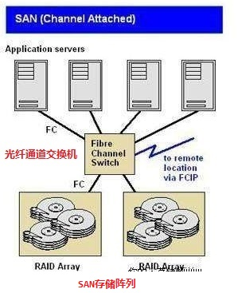

## iSCSI 原理概述

- `iSCSI`（internet SCSI）是 IP SAN 的一种实现方式。
- iSCSI 实现的不同方式：
  - 软件实现方式：
    - iSCSI 客户端安装 `iscsi-initiator-utils` 软件包用于解析 iSCSI 协议。
    - 该软件安装后，需要占用服务器 CPU 来处理 iSCSI 协议封装为 TCP/IP 协议，这将降低服务器的计算能力。
    - 但该方法实现简单，价格低廉，无需使用特别的硬件设备。

    > 👉 对于物理服务器网卡而言，常规网卡驱动只能识别和处理 TCP/IP 包，要将 SCSI 设备、命令和数据打包成标准 TCP/IP 包，就需要一个软件来实现，这个软件就是 iscsi-initiator 软件。
  
  - 硬件实现方式：
    - iSCSI 客户端可使用 `TOE` 网卡，因此 iscsi-initiator 软件封装 iSCSI 协议，再由 TOE 网卡进一步封装为 TCP/IP 协议，但封装 iSCSI 协议依然由 CPU 完成。
    - 当然，除了 TOE 网卡外，iSCSI 客户端也可直接使用 `iSCSI HBA` 卡，无需安装 iscsi-initiator 软件，由 iSCSI HBA 卡直接封装 iSCSI 协议、TCP/IP 协议等，大大降低 CPU 工作负载，但该方法成本较高。

    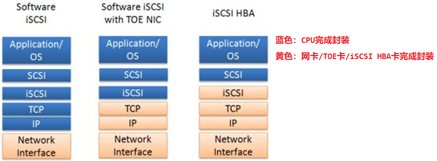

    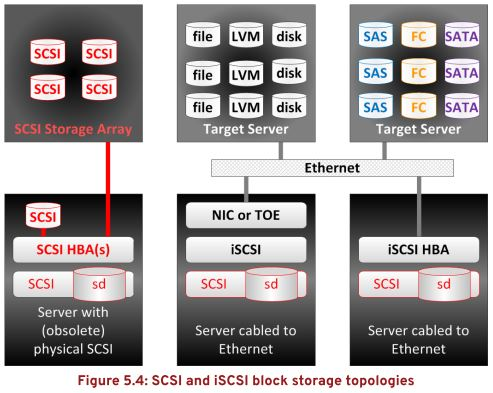

- iSCSI 协议的封包与解包过程：
  - iSCSI 数据包结构：

    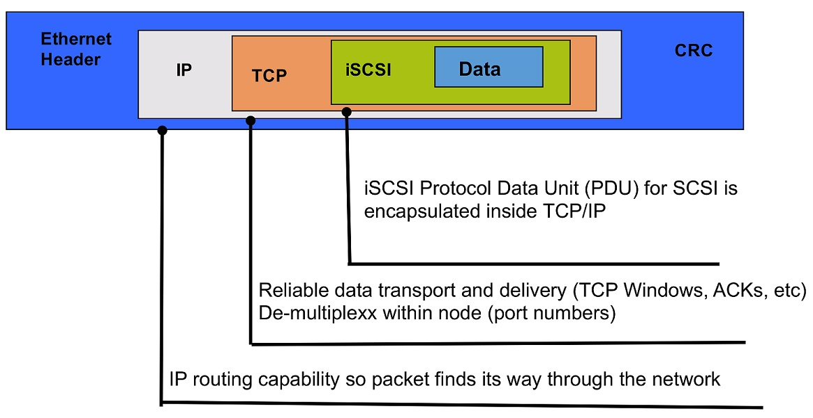
  
  - iSCSI 客户端与服务端都使用 iSCSI HBA 进行封包与解包：

    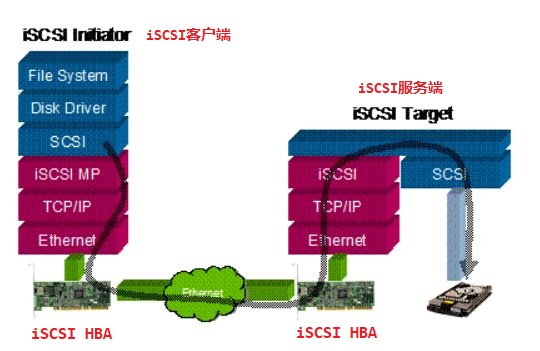

- iSCSI 工作流程：
  - 当 iSCSI 客户端应用程序发出数据读写请求后，操作系统会生成一个相应的 SCSI 指令。
  - 该 SCSI 指令在 iSCSI initiator 层被封装成 iSCSI 消息包并通过 TCP/IP 传送到网卡设备。
  - 通过网络 iSCSI 服务端逐层解开 iSCSI 消息包，得到 SCSI 指令的内容，然后传送给 SCSI 设备执行。
- iSCSI 服务端共享的块设备，如磁盘分区、LVM等，均可共享给多个 iSCSI 客户端。
- 💥 务必注意：

  若一个节点挂载了共享的 iSCSI 块设备 /dev/sdc1，在节点上显示为 `/dev/sdb`，并格式化创建文件系统后，挂载于该节点。然后，若当该块设备被共享于另一节点上，显示为 /dev/sdc 时，可直接挂载，因为该块设备已在前一节点上创建文件系统，所以直接挂载写入数据即可，**切不可再格式化**，导致数据的丢失！

> 👉 注意：不同客户端使用相同的 iSCSI 共享存储，在 HA 场景中常用。

## iSCSI 相关术语

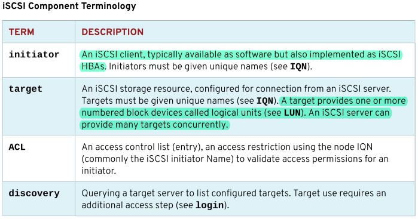

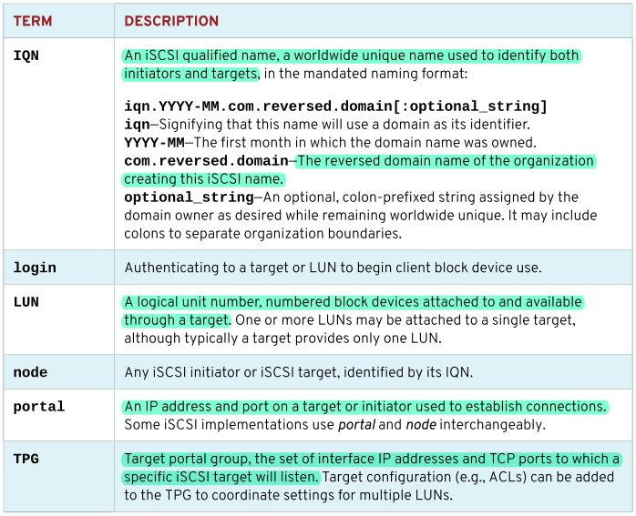

## 🧪 iSCSI target 与 initiator 部署与配置

- iSCSI target 的部署可使用 `targetcli shell` 交互式命令行或 `targetcli` 命令行直接部署。
- 该示例使用 targetcli 命令行直接部署，并对其中一个 target 启用 `CHAP` 单向会话（`session`）认证。
- CHAP 认证包括：
  - `discovery` 阶段的单向与双向认证
  - `session` 阶段的单向与双向认证
- 🚀 discovery 与 session 的认证方式可只使用其中一种，或两种认证同时使用。
  
  ```bash
  # ---------- iSCSI target 部署与配置 ----------
  $ ls -lh /srv/iscsi/backingstore*
    -rw-r--r--. 1 root root 1.0G Jun 24 22:10 /srv/iscsi/backingstore
    -rw-r--r--. 1 root root 1.0G Jun 24 22:22 /srv/iscsi/backingstore-mirror
  # 查看可作为 iSCSI target 后端存储的设备  
  $ qemu-img info /srv/iscsi/backingstore
    image: /srv/iscsi/backingstore
    file format: raw
    virtual size: 1.0G (1073741824 bytes)
    disk size: 0
  # 以上两个文件为 QEMU raw 格式的磁盘镜像，使用 raw 格式的磁盘镜像作为后端存储。
  
  $ yum install -y targetcli
  # 安装 targetcli 软件包以提供 iSCSI target
  $ systemctl enable --now target.service
  # 启动 target 守护进程
  
  $ targetcli /backstores/fileio create storage-mirror /srv/iscsi/backingstore-mirror
  # 由于该存储由文件（raw 磁盘镜像）提供，所以使用 fileio 创建 iSCSI target 后端存储。 
  $ targetcli /iscsi create iqn.2016-01.com.example.lab:iscsistorage-mirror
  # 创建 iSCSI target 的 IQN
  $ targetcli /iscsi/iqn.2016-01.com.example.lab:iscsistorage-mirror/tpg1/luns \
    create /backstores/fileio/storage-mirror
  # 创建 iSCSI target 的 LUN，映射为之前创建的后端存储。  
  $ targetcli /iscsi/iqn.2016-01.com.example.lab:iscsistorage-mirror/tpg1/acls \
    create iqn.2016-01.com.example.lab:serverb
  # 创建 iSCSI target 的 ACL，允许 serverb 作为 iSCSI initiator 发现该 target 并且登录。 
  
  $ targetcli ls
    o- / ...................................................................................... [...]
    o- backstores ............................................................................. [...]
    | o- block ................................................................. [Storage Objects: 0]
    | o- fileio ................................................................ [Storage Objects: 2]
    | | o- storage .......................... [/srv/iscsi/backingstore (1.0GiB) write-back activated]
    | | o- storage-mirror ............ [/srv/iscsi/backingstore-mirror (1.0GiB) write-back activated]
    | o- pscsi ................................................................. [Storage Objects: 0]
    | o- ramdis................................................................. [Storage Objects: 0]
    o- iscsi ........................................................................... [Targets: 2]
    | o- iqn.2016-01.com.example.lab:iscsistorage ......................................... [TPGs: 1]
    | | o- tpg1 .............................................................. [no-gen-acls, no-auth]
    | |   o- acls ......................................................................... [ACLs: 1]
    | |   | o- iqn.2016-01.com.example.lab:servera ................................. [Mapped LUNs: 1]
    | |   |   o- mapped_lun0 ............................................. [lun0 fileio/storage (rw)]
    | |   o- luns ......................................................................... [LUNs: 1]
    | |   | o- lun0 ...................................... [fileio/storage (/srv/iscsi/backingstore)]
    | |   o- portals ................................................................... [Portals: 1]
    | |     o- 0.0.0.0:3260 .................................................................... [OK]
    | o- iqn.2016-01.com.example.lab:iscsistorage-mirror .................................. [TPGs: 1]
    |   o- tpg1 .............................................................. [no-gen-acls, no-auth]
    |     o- acls ......................................................................... [ACLs: 1]
    |     | o- iqn.2016-01.com.example.lab:serverb ................................. [Mapped LUNs: 1]
    |     |   o- mapped_lun0 ...................................... [lun0 fileio/storage-mirror (rw)]
    |     o- luns ......................................................................... [LUNs: 1]
    |     | o- lun0 ........................ [fileio/storage-mirror (/srv/iscsi/backingstore-mirror)]
    |     o- portals ................................................................... [Portals: 1]
    |       o- 0.0.0.0:3260 .................................................................... [OK]
    o- loopback ........................................................................ [Targets: 0]
  # iqn.2016-01.com.example.lab:iscsistorage target：ACL 已创建如下的 CHAP 单向 session 认证
  # iqn.2016-01.com.example.lab:iscsistorage-mirror target：未创建任何 CHAP 认证
  
  # ---------- iSCSI target 部署 CHAP 单向 session 认证 ----------
  $ targetcli \
    /iscsi/iqn.2016-01.com.example.lab:iscsistorage/tpg1/acls/iqn.2016-01.com.example.lab:servera \
    set auth userid=jayne
  $ targetcli \
    /iscsi/iqn.2016-01.com.example.lab:iscsistorage/tpg1/acls/iqn.2016-01.com.example.lab:servera \
    set auth password=shiny
  # 若需将 CHAP 单向 session 认证用户与密码删除，将其设置为空字符串（''）即可。
  $ targetcli \
    /iscsi/iqn.2016-01.com.example.lab:iscsistorage/tpg1/acls/iqn.2016-01.com.example.lab:servera \
    get auth
  # 查看指定 iSCSI target ACL 的 CHAP 认证列表   
  
  # ---------- iSCSI initiator 部署与配置 ----------
  $ yum install -y iscsi-initiator-utils
  # 安装 iscsi-initiator-utils 软件包
  $ systemctl enable --now iscsid.service
  $ vim /etc/iscsi/initiatorname.iscsi
    InitiatorName=iqn.2016-01.com.example.lab:servera
  # 设置 iSCSI initiator 的 IQN
  $ vim /etc/iscsi/iscsid.conf
    ...
    # To enable CHAP authentication set node.session.auth.authmethod
    # to CHAP. The default is None.
    node.session.auth.authmethod = CHAP
  
    # To set a CHAP username and password for initiator
    # authentication by the target(s), uncomment the following lines:
    node.session.auth.username = jayne
    node.session.auth.password = shiny
  # iSCSI initiator 启用 CHAP 单向 session 认证，与 iSCSI target 中的用户配置一致。
  # 注意：
  #   $ iscsiadm -m node -T iqn.2016-01.com.example.lab:iscsistorage -o update \
  #     -n node.session.auth.authmethod -v [None|CHAP] -p <target_server_ip>:<port>
  #   # 更新指定的 iSCSI target 的配置参数
  #   # 参数位于 /var/lib/iscsi/nodes/<target>/<target_server_ip>,<port>/ 目录
  $ systemctl restart iscsid.service
  # 重启 iscsid 守护进程使配置生效
  
  $ iscsiadm -m discovery -t sendtargets -p 172.25.250.254:3260
    172.25.250.254:3260,1 iqn.2016-01.com.example.lab:iscsistorage
    172.25.250.254:3260,1 iqn.2016-01.com.example.lab:iscsistorage-mirror
  # 发现 172.25.250.254:3260 portal 上的 iSCSI target
  
  $ iscsiadm -m node
    172.25.250.254:3260,1 iqn.2016-01.com.example.lab:iscsistorage
    172.25.250.254:3260,1 iqn.2016-01.com.example.lab:iscsistorage-mirror
  # 查看已发现的 iSCSI target
  # 注意：
  #   $ iscsiadm -m node -o delete <target_server_ip>:<port>
  #   # 删除指定的已发现的 iSCSI target，该 target 将在 /var/lib/iscsi/nodes/ 目录中删除。
  $ ls -lh /var/lib/iscsi/nodes/
    total 0
    drw-------. 3 root root 34 Jun 25 01:30 iqn.2016-01.com.example.lab:iscsistorage
    drw-------. 3 root root 34 Jun 25 01:30 iqn.2016-01.com.example.lab:iscsistorage-mirror
  # iscsiadm 的 discovery 模式执行后将在该目录中存储 target 的信息
  
  $ iscsiadm -m node -T iqn.2016-01.com.example.lab:iscsistorage -p 172.25.250.254:3260 --login [-d8]
    Logging in to [iface: default, target: iqn.2016-01.com.example.lab:iscsistorage, 
    portal: 172.25.250.254,3260] (multiple)
    Login to [iface: default, target: iqn.2016-01.com.example.lab:iscsistorage, 
    portal: 172.25.250.254,3260] successful.
  # 登录该 iSCSI target 时将使用 CHAP 认证
  # -d8 选项为启用 login 的 debug 模式
  $ iscsiadm -m session
    tcp: [7] 172.25.250.254:3260,1 iqn.2016-01.com.example.lab:iscsistorage (non-flash)
  # 查看当前连接登录的 iSCSI target
  
  $ lsblk
    NAME   MAJ:MIN RM SIZE RO TYPE MOUNTPOINT
    sda      8:0    0   1G  0 disk
    sr0     11:0    1   1M  0 rom
    vda    253:0    0  10G  0 disk
    └─vda1 253:1    0  10G  0 part /
    vdb    253:16   0   1G  0 disk
  # 扫描发现新的磁盘设备
  
  $ iscsiadm -m node -T iqn.2016-01.com.example.lab:iscsistorage -p 172.25.250.254:3260 --logout
    Logging out of session [sid: 6, target: iqn.2016-01.com.example.lab:iscsistorage, 
    portal: 172.25.250.254,3260]
    Logout of [sid: 6, target: iqn.2016-01.com.example.lab:iscsistorage, 
    portal: 172.25.250.254,3260] successful.
  # 登出该 iSCSI target  
  ```

## iSCSI 服务端 target 配置示例

- 如下所示，已配置的 iSCSI 服务端 target 示例：
  
  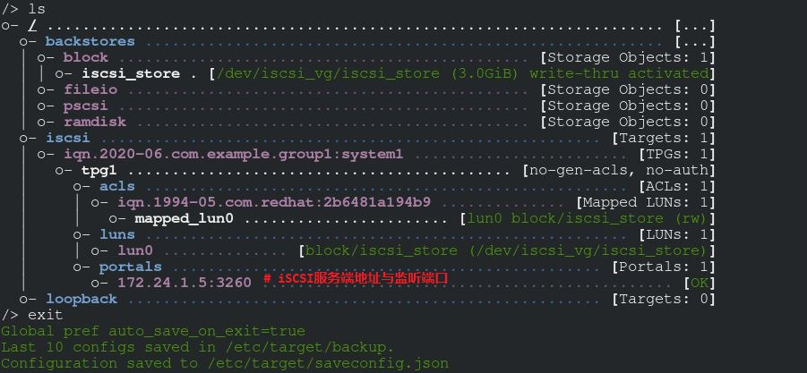

- 💥 由于客户端 /etc/fstab 文件中未添加 `_netdev` 选项而造成客户端系统无法正常启动，进入维护状态。
- 如下所示，RHEL 6.8 中的错误引导过程：
  
  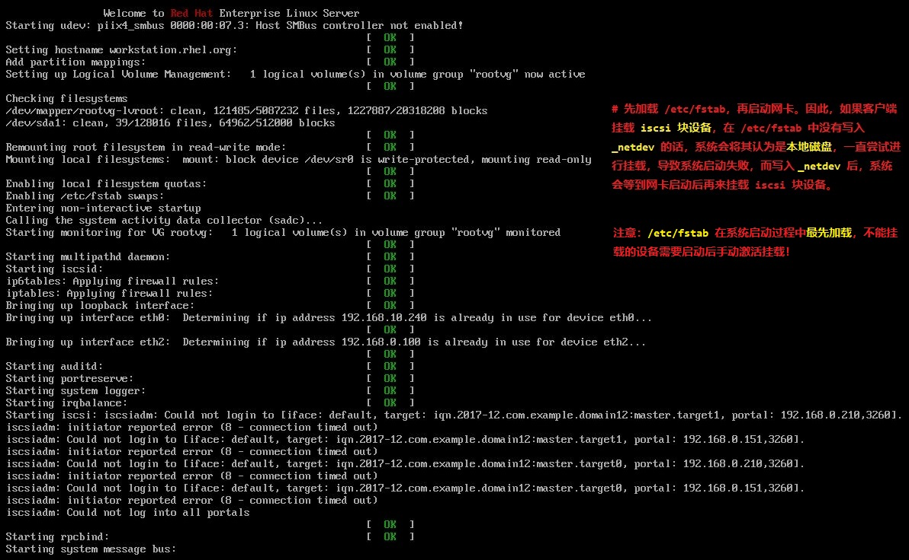

## iSCSI 与 IP SAN 的区别

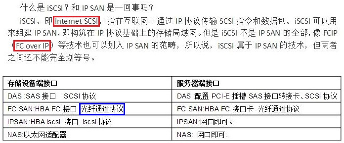

## SAN 存储使用配置注意（FC SAN）

- 物理服务器在 FC HBA 卡安装后，若系统已集成 FC HBA 卡驱动程序，将自动加载相应驱动模块识别 FC HBA 卡，若系统未集成相应的 FC HBA 卡驱动程序，需下载并安装相应驱动程序后，才能识别 FC HBA 卡。
- FC HBA 卡识别并加载后，可通过磁盘热添加即可识别 SAN 磁盘，无需多路径软件支持。
- 多路径软件功能：SAN 存储上的相同磁盘由于多链路原因，在物理服务器上映射为多块磁盘，需进行 `盘符归并` 与 `链路负载均衡`。

## SAN FC HBA 卡基础

- FC HBA：`Fibre Channel Host Bus Adapter`，光纤通道主机适配器，简称为光纤适配器（FC 网卡）。
- FC HBA 卡与以太网卡的物理 MAC 地址一样，同样具有一种唯一的标识，即 `WWN`（World Wide Name）。
- FC HBA 卡的 WWN 有两种：
  - `WWNN`：Node WWN，每块 FC HBA 卡的唯一标识，可根据 WWNN 判断 FC HBA 卡数量。
  - `WWPN`：Port WWN，每块 FC HBA 卡的每个光纤链路端口的唯一标识，大多数情况下通过该 WWPN 标识进行通信。
- 可通过如下命令于系统上查询：
  
  ```bash
  $ cat /sys/class/fc_host/hostX/port_name
  # 查看系统中各 FC HBA 卡的 WWPN 号，其中 X 的数量代表 FC HBA 卡的光纤链路端口数量。
  $ cat /proc/scsi/qla2xxx/X
  # 查看系统中各 FC HBA 卡的状态，包括 WWPN 号与 WWNN 号。
  ```

## SAN 多路径连接示意

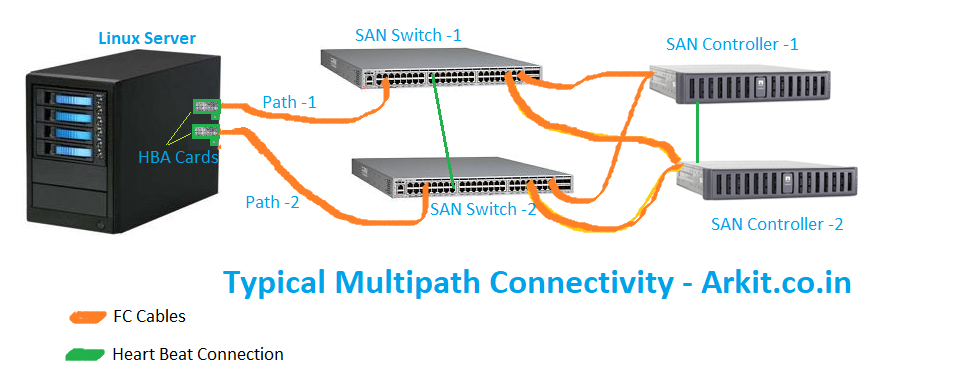

## 📚 案例：EMC SAN 共享存储识别与 multipath 部署

- 由于业务需要将 2 台 Huawei 物理主机与备机配置成为 HA 集群，另需将 `EMC SAN` 共享存储能被主机与备机挂载使用，以便在 HA 切换时能将主机数据共享给备机，实现块设备共享。

> 该场景下使用的 HA 组件为商用的赛门铁克 VCS 平台。

- 2 台 Huawei 物理主机与备机共同使用 EMC SAN 共享磁盘，并使用 `multipath` 多路径进行盘符归并与链路负载均衡。
- 2 台 Huawei 物理主机与备机 OS 环境：Huawei FushionServer 2288H V5 服务器、RHEL6.9
  
  ```bash
  $ dmesg | less
  # 查看系统开机过程中 FC HBA 卡的相关信息
  ```
  
  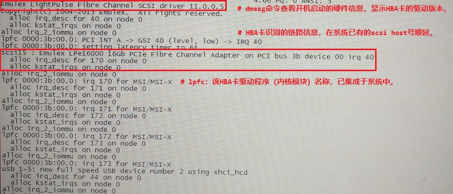
  
  ```bash
  $ modinfo lpfc
  # 查看该型号的 FC HBA 卡驱动程序（内核模块）信息，该模块在开机过程中已成功加载。
  ```
  
  
  
  ```bash
  $ cd /sys/class/fc_host; ls -lh
  $ cd hostX; ls -lh
  # 查看系统识别的 FC HBA 卡光纤链路信息
  ```
  
  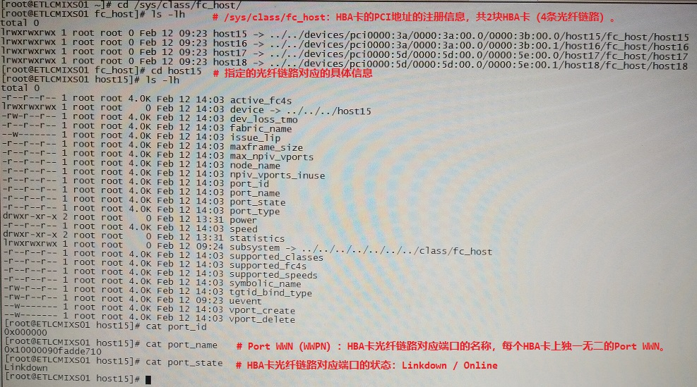
  
  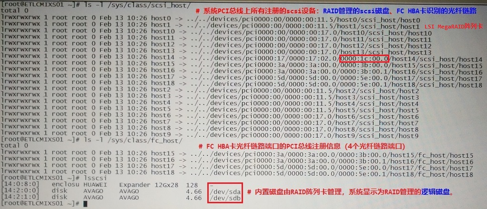
  
  ```bash
  $ for i in $(seq 0 X); do echo "- - -" > /sys/class/scsi_hosts/host$i/scan; done
  # 扫描系统上已热添加的 SAN 存储磁盘
  
  $ yum install -y device-mapper-multipath
  $ modprobe -v dm_multipath
  # 加载 multipath 多路径内核模块
  
  $ /etc/init.d/multipathd start
  # 启动 multipathd 多路径守护进程
  $ chkconfig --level 35 multipathd on
  $ multipath -ll
  # 首次查看 multipath 多路径时，由于未配置配置文件，将所有设备列入黑名单而报错。
  # 可重新拷贝配置文件进行配置更新
  $ cp -av /usr/share/doc/device-mapper-multipath-0.4.9/multipath.conf /etc/multipath.conf
  # 拷贝 multipath 多路径配置文件
  $ grep -Ev '^#|^$' /etc/multipath.conf
    defaults {
        user_friendly_names yes
   }
  
  $ /etc/init.d/multipathd restart
  # 重启 multipathd 多路径守护进程即可归并 EMC SAN 共享磁盘盘符
  # 注意：multipathd 守护进程可侦测到由 Linkdown 状态转变为 Online 状态的光纤链路。
  
  $ multipath -ll
  # 查看盘符归并后的多路径状态
  ```
  
  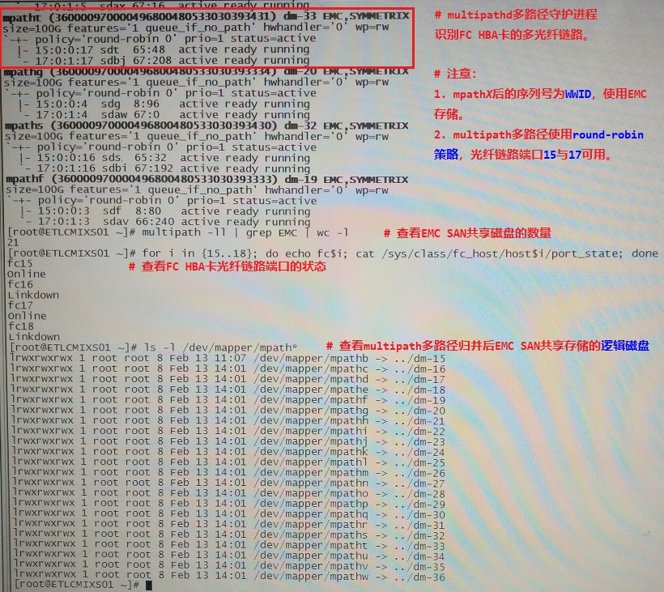

## 📚 案例：使用 Huawei OceanStor SAN 存储在线 LVM 扩容

- SLES 11 SP4 中的实施方法：
  - 使用系统原生多路径软件 `multipath-tools` 查看 SAN 存储磁盘
  - RHEL 6.x/7.x 多路径软件：`device-mapper-multipath`
  - 操作过程如下所示：

    ```bash
    $ pvs
    # 查看系统上已创建 PV 的磁盘       
    $ for i in $(seq 0 X); do echo "- - -" > /sys/class/scsi_hosts/host$i/scan; done
    # 扫描系统上已热添加的 SAN 存储磁盘
    $ multipath -ll | grep -E '^mpath'
    # 查看系统上已映射到的多路径 SAN 存储磁盘的盘符
    ```

    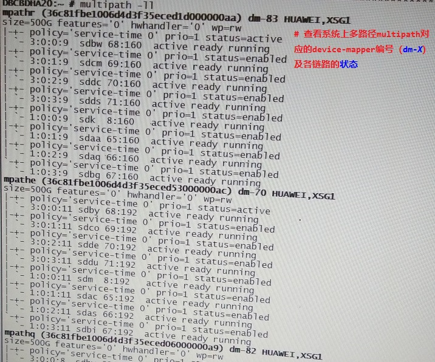

    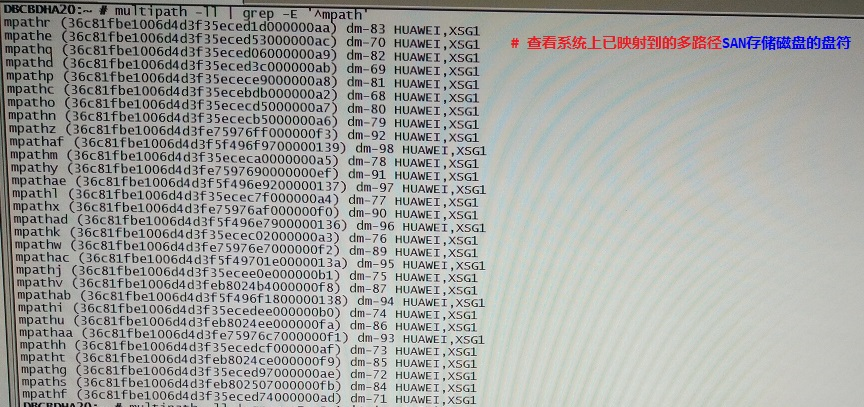

    ```bash
    $ ls -l /dev/mappper/mpath*
    # 查看 SAN 存储磁盘对应的多路径盘符    
    
    # 注意： 
    # 1. 系统上已使用的磁盘均直接将其创建为 PV。
    # 2. 将上述命令的返回结果进行对比，以确定新的 SAN 存储磁盘的盘符（mpathX）。
    
    $ pvcreate /dev/mapper/mpathX
    # 创建 SAN 存储磁盘 PV
    $ vgextend <vgname> /dev/mapper/mpathX
    $ lvextend -L +n[G|T] <vgname> -n <lvname>
    # 扩容相应 VG 与 LV 容量
    ```

- SLES 12 SP3 中的实施方法：
  - 系统原生多路径软件 multipath-tools 无法识别 SAN 存储磁盘，考虑是否具有相应的多路径存储驱动软件！
  - 使用 OceanStor 对应的多路径存储驱动软件 `UlrtaPath` 查看 SAN 存储磁盘的盘符。

    ```bash
    $ upadmin
    # 调用 OceanStor UltraPath 交互式命令行
    UltraPath CLI #0 >show vlun
    # 查看系统上已映射到的 SAN 存储磁盘的盘符
    UltraPath CLI #1 >show path
    # 查看多路径的各链路状态
    UltraPath CLI #2 >quit
    # 退出 OceanStor UltraPath 交互式命令行
    ```

    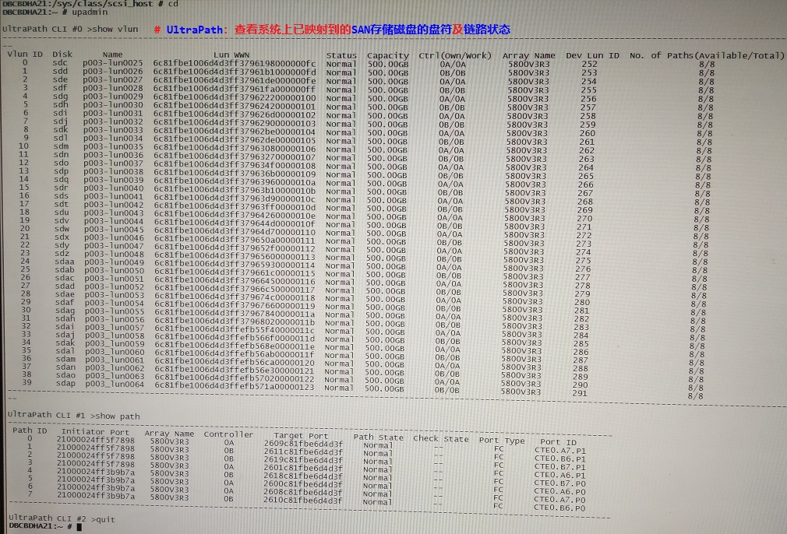

- 以上两种场景的难点在于寻找出新添加的 SAN 盘与对应的归并的逻辑盘符，主要将其找出即可非常方便的进行逻辑卷的动态扩容！

## 📚 案例：Qlogic FC HBA 卡队列深度骤降导致数据库物理机宕机

- 问题描述：
  - DB2 数据库物理机使用 FC HBA 卡与后端 Huawei OceanStor SAN 存储通信，存储 DB2 数据库业务数据。
  - 系统日志显示 FC HBA 卡队列深度骤降，并且系统宕机后手动重启。
- 原因分析：
  - SLES 官网对 `Ramping down` 的说明：
    - Ramping down 是 `qla2xxx FC HBA` 卡驱动的特性。
    - 该现象说明存储服务端的 I/O 请求队列已满，qla2xxx FC HBA卡驱动将降低 I/O 并发请求发送至存储服务端。

      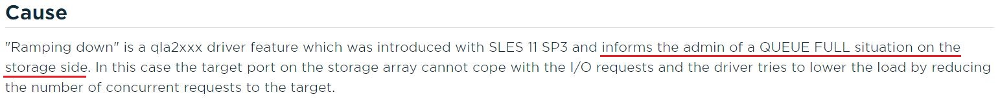
  
  - 系统日志信息显示 FC HBA 卡队列深度骤降并持续较长时间，说明 DB2 数据库 I/O 请求持续增高，使得 FC HBA 卡持续发送 I/O 并发请求至存储服务端，而导致 DB2 数据库物理机宕机！

    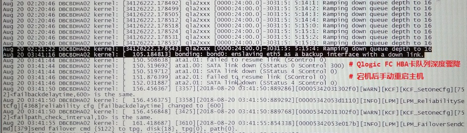
