# VMware Workstation 15 虚拟机迁移 ESXi 6.7.0 实施方法

## 文档说明

- VMware Workstation 版本：VMware workstation 15.1.0
- ESXi 版本：ESXi 6.7.0
- 该文档用于 RH199 与 RH294 课程培训环境的 all-in-one vmdk 磁盘迁移至 `EXSi 6.7.0` 环境的实施方法。

## 虚拟机迁移的背景情况

- 由于早期部署培训环境使用 VMware Workstation 的单磁盘多文件形式存储 vmdk 磁盘文件，为了便于共享与拷贝已将所有 vmdk 合并为单一 vmdk 磁盘文件，可直接使用该文件部署培训环境虚拟机。
- 但由于 workstation 与 esxi 的兼容性问题，使用 `ovf` 模板导出与导入及修改兼容性的方式在 esxi 环境中始终无法正确开启虚拟机，因此尝试转换 vmdk 磁盘文件格式的方式在 esxi 环境中创建与启动虚拟机。

## 虚拟机迁移实施方法

- 确认 esxi 版本，如下所示：
  
  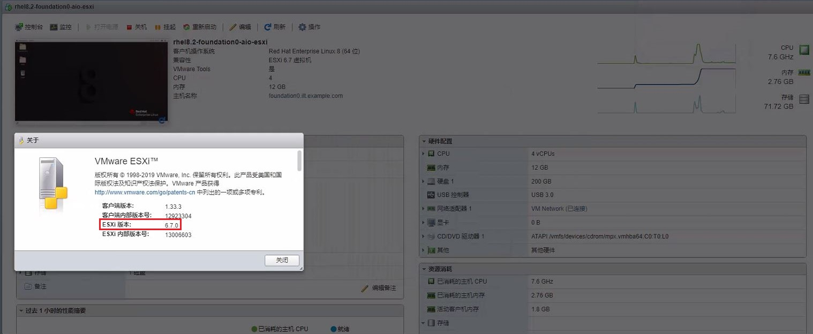

- 需开启 esxi 的 `troubleshooting SSH` 远程登录功能，用于 SSH 登录 esxi 主机。
- 若已将 `rhel8.2-foundation0-aio.vmdk` 磁盘文件上传至 esxi 环境中，需确认其所在的数据存储路径，笔者所用的为 `datastore1`，可根据实际情况进行更改，如下所示执行命令：
  
  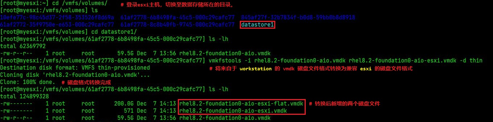

- vmdk 磁盘格式转换成功后，即可创建新的虚拟机。
- 创建新虚拟机的方法，如下所示：
  
  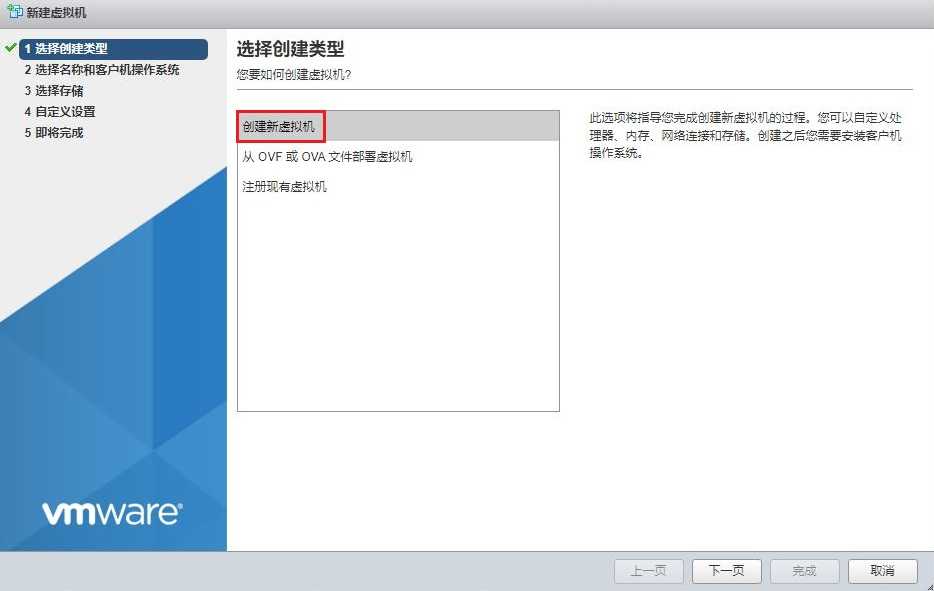
  
  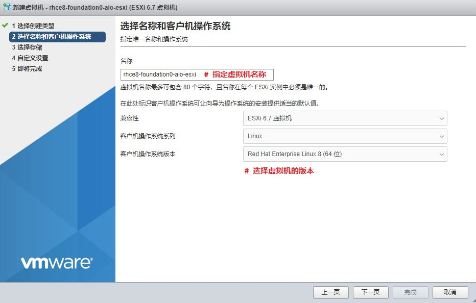
  
  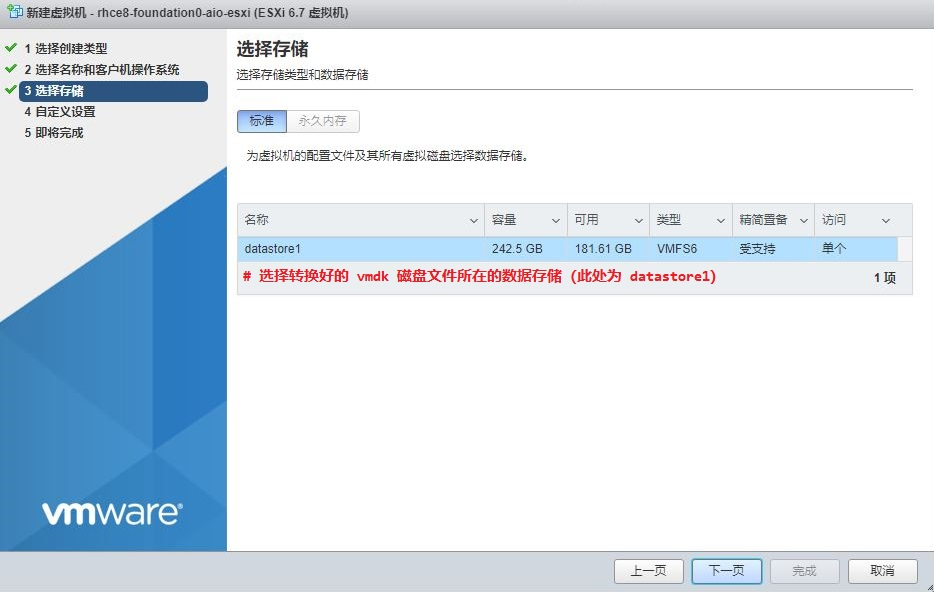
  
  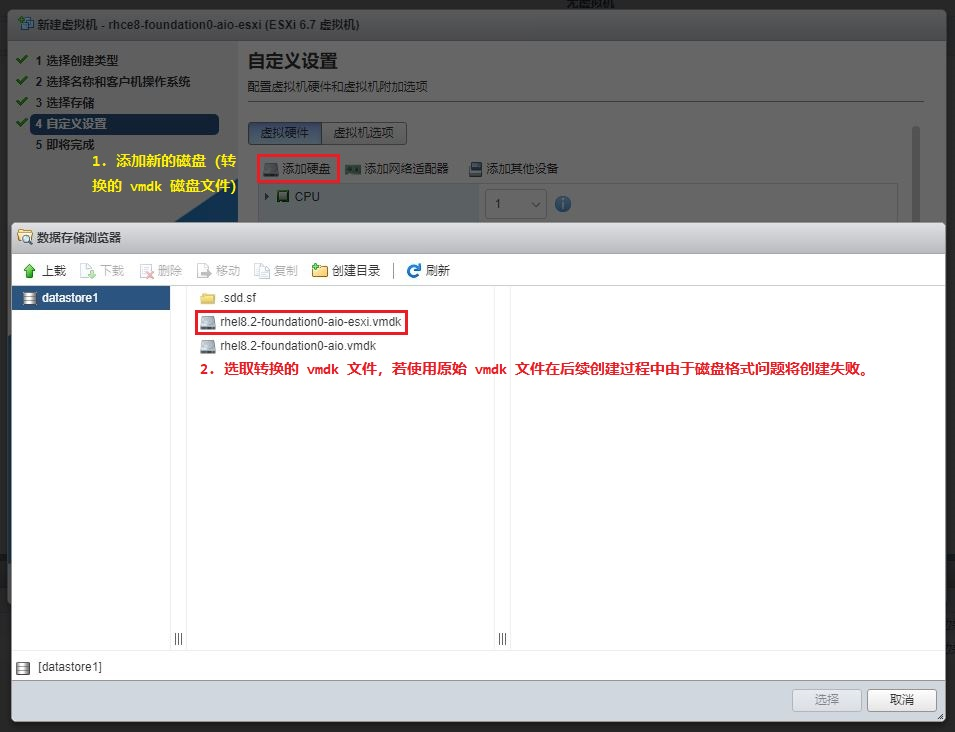
  
  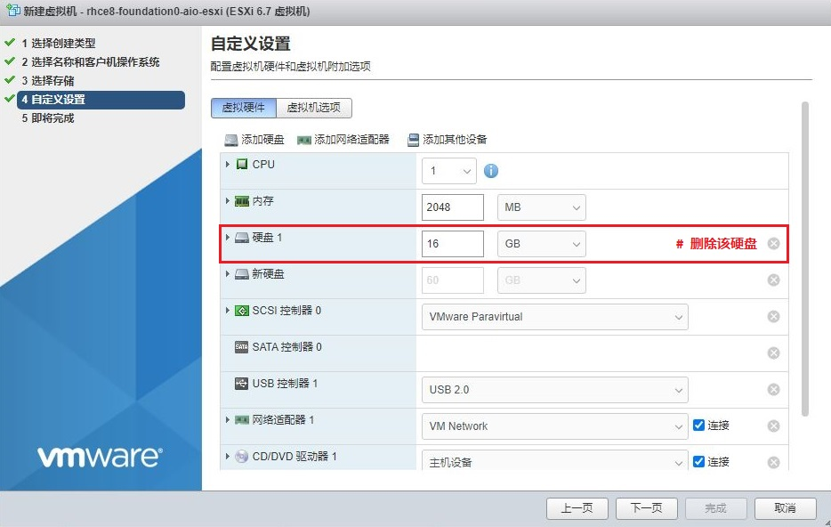
  
  > 📌注意：由于培训环境将直接使用转换后的 vmdk 磁盘文件，默认创建的硬盘 1 可直接删除，不再使用。
  
  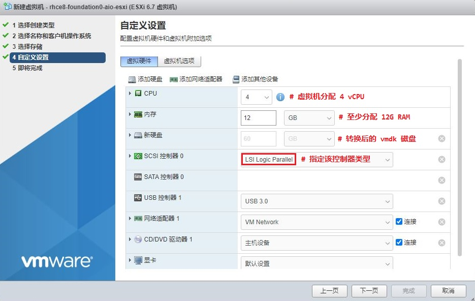
  
  > 💥注意：
  >
  > 1. 由于培训环境中需运行 `Quay` 容器镜像仓库消耗较多 RAM 资源，因此至少需分配 12G 内存。
  > 2. SCSI 控制器类型笔者环境中使用 `LSI Logic Parallel`，若选取与虚拟机不匹配的控制器类型将无法启动。
  > 3. 可根据实际 esxi 环境进行选取与测试，若虚拟机无法启动，调整 SCSI 控制器类型再进行尝试。
  
  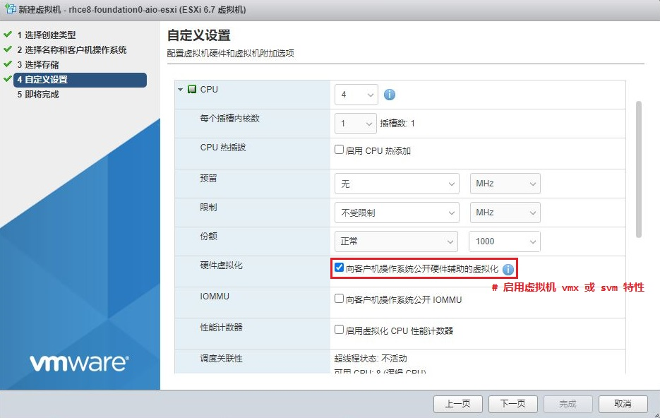
  
  > 💥注意：由于培训环境虚拟机中还嵌套有 `KVM` 虚拟机，因此必须启用虚拟机的 CPU 虚拟化功能。
  
  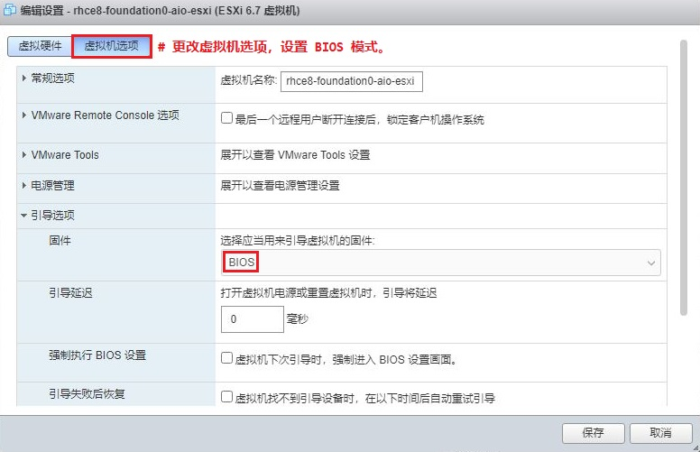
  
  > 💥注意：虚拟机使用 `BIOS` 引导方式启动，需更改默认的 `EFI` 引导选项，否则无法正常启动。
  
  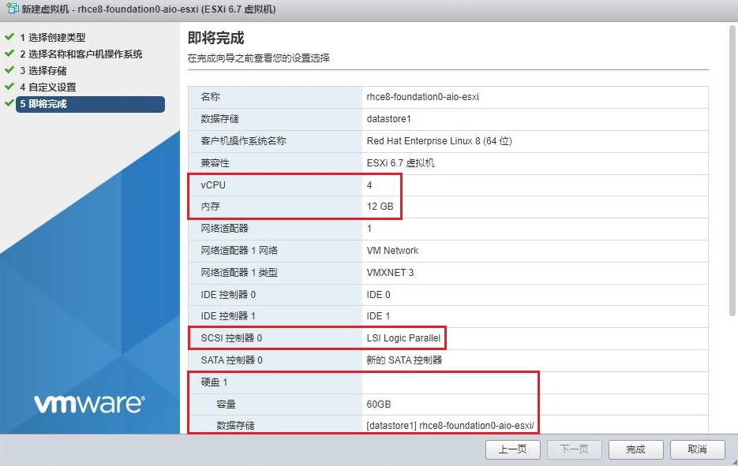
  
  > 👉重要提示：
  >
  > 1. 请确保上图中 vCPU、内存、SCSI 控制器与硬盘是否设置正确。
  > 2. 由于笔者使用的环境中未连接外部网络，所以未配置额外的网卡，可根据实际需求给虚拟机添加网卡，供外部连接。

- 创建成功后，启动虚拟机测试是否可运行内部嵌套的 KVM 虚拟机：
  `Intel CPU` 平台的 esxi 环境一般情况下不会出现 CPU 的嵌套虚拟化问题，由于笔者使用的环境运行于 `AMD CPU` 平台上，所以出现以下报错，若您在使用过程中也有同样的报错，可参考以下可选步骤：
  
  > 📝 相关登录的用户名/密码：kiosk/redhat、root/Asimov
  
  - 可选步骤 1：虚拟机正常启动后，可使用如下命令查看是否支持 `vmx` 或 `svm` 的 CPU 虚拟化，确保嵌套的 KVM 虚拟机可运行：

    ```bash
    $ lscpu | egrep "vmx|svm"
    # 查看 CPU 是否支持 Intel vmx 或 AMD svm 虚拟化特性
    ```

    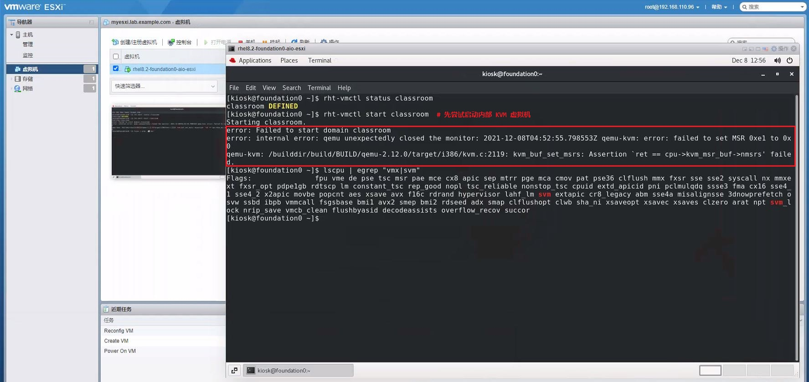
  
  - 可选步骤 2：出现上图中红框内报错，可使用以下方法解决：

    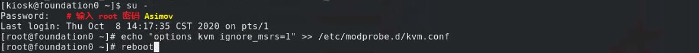

- 虚拟机再次重启后，使用 kiosk 用户登录，执行图中命令即可启动培训环境中的所有 KVM 虚拟机，若无报错，即培训环境虚拟机部署成功。
  
  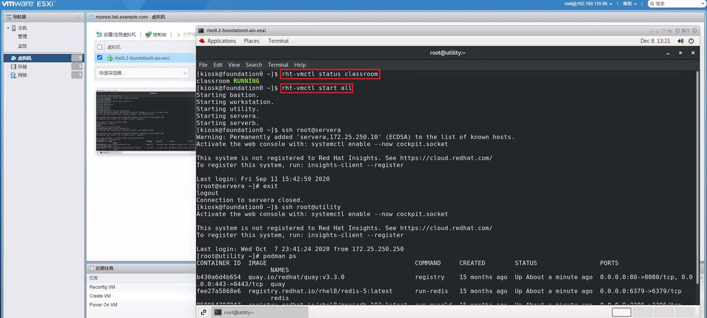
