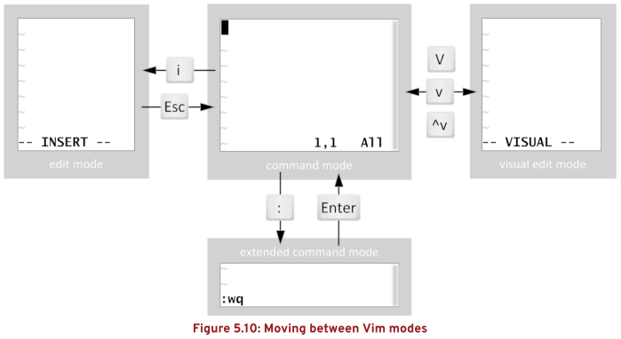

# Vim 常用方法汇总

## 文档目录

- Vim 的运行模式
- Vim 命令模式指令
- Vim 扩展命令模式常用指令
- Vim 常用插件示例

## Vim 的运行模式



- 命令模式：command 模式
- 扩展命令模式：extended command 模式
- 编辑模式：edit 模式
- 可视模式：visual edit 模式

## Vim 命令模式指令

```vim
d$：删除光标处至行末
dG：删除光标处至文末
Ctrl + r：恢复撤销
```

Vim 中多窗格之间的跳转可使用以下方法：


## Vim 扩展命令模式常用指令

- 扩展命令模式中的指令可写入 `$HOME/.vimrc` 中实现持久化的生效。
- `$HOME/.vimrc` 配置文件常用指令：使用开头双引号 `"` 进行注释
  
  ```vim
  %：表示全文匹配
  m,n：表示数字范围
  ^：表示行首
  $：表示行末
  \s：表示空白（空格或制表符）
  +：表示前者出现一次或多次
  
  autocmd FileType yaml setlocal ai ts=2 sw=2 et
  "自动识别 YAML 文件，tab 缩进 2 个空格。
  
  w !sudo tee %
  "强制编辑 readonly 的文件，该用户必须具备 sudo 权限。
  
  set nu
  "设置行号
  set tabstop=<num>
  "制表符设置为 n 个空格
  colorscheme torte
  "设置配色方案为 torte
  set cursorline
  "设置光标所在行具有下划线
  set cursorcolumn
  "设置光标所在列具有垂直对齐线
  
  set list
  "查看特殊字符
  set nolist
  "取消查看特殊字符
  set paste
  "解决粘贴 YAML 格式文件时格式混乱现象
  
  g/^\s*$/d
  "删除所有空行
  m,n s/^/  /
  "在第 m 行与第 n 行之间的行开头添加若干空格
  m,n s/^/# /g
  "在第 m 行与第 n 行间的开头添加 # 号与空格
  %s/<replace1>/<replace2>/g
  "在全文范围内使用 replace2 替换 replace1
  m,n d
  "删除第 m 行到第 n 行的内容
  ```

## Vim 常用插件

- `NERDTree` 插件：Vim 左侧显示目录，右侧显示内容的布局。
  
  
  
  ```bash
  $ wget http://www.vim.org/scripts/download_script.php?src_id=17123 \
    -O nerdtree.zip 
  # 下载 nerdtree 插件压缩文件
  $ unzip nerdtree.zip
  # 解压文件
  $ mkdir -p ~/.vim/{plugin,doc}
  # 在家目录中创建 .vim/{plugin,doc}
  $ cp plugin/NERD_tree.vim ~/.vim/plugin/
  $ cp doc/NERD_tree.txt ~/.vim/doc/
  # 复制两个文件
  # 安装好后，打开 vim，扩展命令模式中输入 :NERDTree，即可看到 NERDTree 效果。
  ```
  
  ```vim
  $ vim ~/.vimrc
    " 设置 NerdTree，使用 F3 按键启用与关闭。
    map <F3> :NERDTreeMirror<CR>
    map <F3> :NERDTreeToggle<CR>
    " 使用 vim 自动进入 NERTree
    autocmd VimEnter * NERDTree  
  ```
