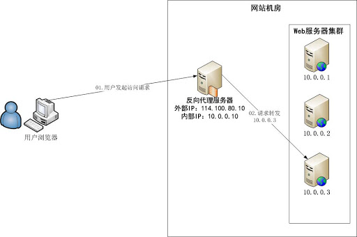
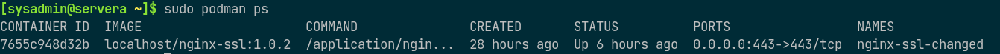

# Apache HTTP Server 原理与常用配置实现

## 文档说明

- OS 版本：CentOS Linux release 7.7.1908 (Core)
- Apache HTTPD 服务相关软件包：httpd-2.4.6-90.el7.centos.x86_64
- 👉 其中 httpd 的虚拟主机配置文件最终参考见该 [链接](https://github.com/Alberthua-Perl/sc-col/blob/master/httpd-auth-ssl-proxy/apache-httpd/http-vhost-ssl.conf)，`.htaccess` 的最终参考见该 [链接](https://github.com/Alberthua-Perl/sc-col/blob/master/httpd-auth-ssl-proxy/apache-httpd/.htaccess)。

## 文档目录

- [Apache HTTP Server 原理与常用配置实现](#apache-http-server-原理与常用配置实现)
  - [文档说明](#文档说明)
  - [文档目录](#文档目录)
  - [Apache HTTP Server 概述](#apache-http-server-概述)
  - [Apache HTTP Server 特点](#apache-http-server-特点)
  - [Apache HTTP Server 架构与层次结构](#apache-http-server-架构与层次结构)
  - [Apache HTTP Server 的工作模式](#apache-http-server-的工作模式)
  - [Apache HTTP Server 安装与配置信息](#apache-http-server-安装与配置信息)
  - [Apache HTTP Server 虚拟主机配置](#apache-http-server-虚拟主机配置)
    - [Apache HTTP Server 访问控制：](#apache-http-server-访问控制)
    - [Apache HTTP Server 用户认证授权：](#apache-http-server-用户认证授权)
    - [Apache HTTP Server 的 SSL 安全连接：](#apache-http-server-的-ssl-安全连接)
    - [Apache HTTP Server 与 CGI 脚本：](#apache-http-server-与-cgi-脚本)
    - [🤘 Apache HTTP Server 实现反向代理：](#-apache-http-server-实现反向代理)
    - [Apache HTTP Server 优化思路：](#apache-http-server-优化思路)
    - [Apache Web 页面异常示例：](#apache-web-页面异常示例)
    - [参考链接：](#参考链接)

## Apache HTTP Server 概述

- 20 世纪 90 年代初，由美国国家超级计算机应用中心 NCSA 开发。
- 1995 年开源社区发布 Apache（A Patchy Server）。
- Apache 与 Nginx 是世界上使用率极高的 Web 服务器软件。
- Apache 可以运行在几乎所有广泛使用的计算机平台上，由于其跨平台和安全性被广泛使用，是最流行的 Web 服务器端软件之一。
- 它快速、可靠并且可通过简单的 API 扩充，将 Perl、Python 等解释器编译到服务器中。
- 后来逐步扩充到各种 Unix 系统中，尤其对 Linux 的支持相当完美。
- Apache 有多种产品，可以支持 SSL 技术，支持多个虚拟主机等。
- Apache 是以进程为基础的架构，进程要比线程消耗更多的系统开支，不太适合于多处理器环境。
- 因此，在 Apache Web 站点扩容时，通常是增加服务器或扩充群集节点而不是增加处理器。
- 世界上很多著名的网站如 Amazon、Yahoo!、W3 Consortium、Financial Times 等都是 Apache 的产物，它的成功之处主要在于它的源代码开放、有一支开放的开发队伍、支持跨平台的应用（可以运行在几乎所有的 Unix、Windows、Linux 系统平台上）以及它的可移植性等方面。
- 但随着 Nginx 的功能逐渐成熟完善，新的功能特性不断涌现，并以其高性能的并发处理能力，对 Apache 具有后来居上，赶超之势。
- ✨ 截止 2020 年 2月，Nginx 的市场占有率首次超过 Apache！
- 2021 年 1 月的 Web 服务器市场占有率调查统计：
  
  

> 名词说明：
>
> 1. `ASF`（Apache Software Foundation）：Apache 软件基金会
>
> 2. `FSF`（Free Software Foundation）：自由软件基金会

## Apache HTTP Server 特点

- 支持多计算机平台
- Apache 支持 `HTTP/1.1` 协议，并与 `HTTP/1.0` 协议向后兼容，并为新协议做好准备。
- 配置文件简单，易操作。
- 支持多种方式的 HTTP 认证
- 支持特定的 Web 目录修改
- 支持 `CGI` 脚本，如 `Perl`、`PHP` 等。
- 支持 `FastCGI`
- 支持安全 Socket 层（`SSL`）
- 支持服务器端包含指令（`SSI`）
- 支持反向代理
- 支持虚拟主机：
  - 通过在一台服务器上使用不同的域名来提供多个 HTTP 服务
  - 👉 Apache 支持基于 IP、域名和端口号三种类型的虚拟主机服务
- 支持实时监视服务器状态和定制服务器日志
- 跟踪用户会话：当用户浏览基于 Apache 的 Web 站点时，可通过 `mod_usertrack` 模块对其进行跟踪。
- 支持动态共享对象（dynamic shared object，`DSO`）：Apache 的模块可在运行时动态加载，即这些模块可以被载入服务器进程空间，从而减少系统的内存开销。
- 支持多进程：当负载增加时，服务器会快速生成子进程来处理，从而提高系统的响应能力。
- 🚀 支持多线程和多进程混合模型的 `MPM`（multiprocess model）
- 高度模块化架构
- 支持第三方软件开发商提供的功能模块：如 Apache 加载 `mod_jserv` 模块后可以支持 `Java Servlet`，这样就可运行 Java 程序。

## Apache HTTP Server 架构与层次结构

- 操作系统层：
  - Apache 归根结底是建立在操作系统的普通应用程序，因此必须使用操作系统本身提供的底层功能，如进程和线程、进程和线程间的通信、网络套接字通信、文件系统等。
  - 目前 Apache 可支持的操作系统：Linux、Unix、Windows、MacOS、NetWare、OS/2
- 可移植运行库层：
  - 早期的 Apache 只用于 Unix 系统，后来为了能够跨平台使用，不同的操作系统提供的底层 API 不同，甚至存在很大差异，需要隐藏不同操作系统的 API 细节问题，对所有的操作系统，提供一个完全相同的函数接口。
  - 🚀 从 Apache 2.0 开始将专门封装不同操作系统 API 的任务独立出来形成新的项目，称为 `APR`（Apache Portable Runtime libraries）。
  - 该项目主要为上层的应用程序提供一个可跨多操作系统平台使用的底层支持接口库。
- Apache 核心功能层：
  - 该层为 Apache 的核心部分，用来实现 Apache 的基本功能以及对其他模块的支持调用等。
  - 该层包括两个部分：Apache 核心程序、Apache 核心模块
  - 1️⃣ Apache 核心程序：主要实现 Apache 作为 HTTP 服务器的基本功能
    - 启动、停止和重启 Apache
    - 处理配置文件，如 httpd.conf 等所有的配置文件。
    - 接受和处理 HTTP 连接
    - 读取 HTTP 请求并对请求进行处理
    - 处理 HTTP 协议
  - 2️⃣ Apache 核心模块：
    - Apache 只是一个 HTTP 服务器，本身只有很简单的上述基本功能，为了完成其他功能则需要开发相应的模块。
    - 为了最大程度的将核心功能与模块解耦，Apache 采用了对模块进行载入的方式，若需要启用某些模块，则只需要编辑相应的配置文件将该模块载入。
    - Apache 在启动时读取配置文件进行处理，读取到配置指令 `LoadModule`，然后执行 `mod_so` 模块中的该指令对应的指令处理函数，将模块载入进来即可。
    - Apache 的核心模块则提供了这些扩展功能。
- Apache 可选功能层：可选功能层指所有的非核心模块的其他 Apache 模块，实际上对于服务器端开发通常指的就是这个层，开发者开发自己相应的模块。
- 第三方支持库：Apache 的模块开发中使用到了第三方的开发库，如 `mod_ssl` 模块使用了 `OpenSSL`，`mod_perl` 模块使用了 `Perl` 开发库等。
  
  
  
  

> 💥 注意：
>
> 1. Apache 核心模块与可选模块的接口完全相同，对于 Apache 核心而言完全相同。
>
> 2. 核心模块和非核心模块的唯一区别在于加载的时间不同，核心模块通常必须静态加载，而非核心模块既可以静态加载，也可以动态加载。

## Apache HTTP Server 的工作模式

- Apache HTTP Server（httpd-2.4.x）支持多种 `MPM`，包括 prefork、worker、event。
- 1️⃣ `prefork MPM`：
  - 预派生模式：由主控制进程生成多个子进程，使用 `select` 模型，最大并发 1024 个进程。
  - 这样做是为了减少频繁创建和销毁进程的开销。
  - 每个子进程只有一个线程，在一个时间点内，只能处理一个请求。
  - 可以设置最大和最小进程数，是最古老的一种模式，也是最稳定的模式，适用于访问量不是很大的场景。
  - 优点：
    - 成熟稳定，兼容所有新老模块。
    - 同时，不需要担心线程安全的问题。
  - 缺点：
    - 运行慢
    - 占用更多内存
    - 不适用于高并发场景
  - 工作原理：

    

- 2️⃣ `worker MPM`：
  - 多进程和多线程混合的模型
  - 由一个控制进程启动多个子进程，每个子进程中包含固定的线程，使用线程来处理请求。
  - 当线程不够使用时会再启动一个新的子进程，然后在进程中再启动线程处理请求，由于其使用了线程处理请求，因此可以承受更高的并发。
  - 优点：
    - 相比 prefork 占用的内存较少，可以同时处理更多的请求。
  - 缺点：
    - 使用 `keep-alive` 的长连接方式，某个线程会一直被占据，即使没有传输数据，也需要一直等待到超时才会被释放。
    - 若过多的线程被这样占据，也会导致在高并发场景下的无服务线程可用，该问题在 prefork 模式下同样会发生。
  - 工作原理：

    

- 3️⃣ `event MPM`：
  - 🚀 Apache 中最新的模式，属于事件驱动模型（`epoll`）。
  - 每个进程中的多个线程分别响应多个请求，在当前版本中已是稳定可用的模式（GA）。
  - 它和 worker 模式很像，最大的区别在于，解决了 keep-alive 场景下，长期被占用的线程资源浪费问题。如，某些线程由于处于 keep-alive 状态，空挂着等待，中间几乎没有请求过来，甚至等到超时。
  - event MPM 中有一个专门的线程来管理这些 keep-alive 类型的线程，当有真实请求过来时，将请求传递给工作线程，执行完毕后，又允许它释放，这样增强了高并发场景下的请求处理能力。
  - event MPM 只在有数据发送的时候才开始建立连接，连接请求才会触发工作线程，即使用了 TCP 延迟接受连接选项 `TCP_DEFER_ACCEPT`，加了该选项后，若客户端只进行 TCP 连接，不发送请求，则不会触发 `Accept` 操作，也就不会触发工作线程去干活，进行了简单的防攻击（TCP 连接）。
  - 优点：
    - 单线程响应多请求，占据更少的内存，高并发下表现更优秀。
    - event MPM 会有一个专门的线程管理 keep-alive 类型的线程，当有真实请求过来的时候，将请求传递给工作线程，执行完毕后，又允许它释放。
  - 缺点：
    - 没有线程安全控制
    - 不能在 `HTTPS` 下工作
- httpd 状态检查：
  
  ```bash
  $ sudo httpd -V
  # 查看 Apache HTTP 服务的编译配置
  ```
  
  
  
  ```bash
  $ sudo httpd -t
  # 检查配置文件语法
  
  $ sudo vim /etc/httpd/conf.modules.d/00-mpm.conf
  # 查看 Apache HTTP 服务的 MPM 配置文件
  # 可注释相应 MPM 模块，再重启 httpd 服务即可切换工作模式。
  ```
  
  

## Apache HTTP Server 安装与配置信息

- Apache HTTP Server 的安装方式：yum 源 rpm 软件包安装、源码编译安装
- 此次使用 rpm 软件包方式安装
- Apache HTTP Server 的服务名称为 httpd，其中 Apache 的核心功能与扩展功能均通过模块（module）来实现，若使用源码编译安装，需特别注意模块的加载。
- 实验节点环境说明：
  
  
  
  - 除 Apache 反向代理功能外，servera 具有 Apache HTTP Server 的其他功能。
  - serverb 作为 Apache 反向代理服务器，servera 与 base-server 作为后端服务端运行 nginx-ssl 容器。
- 安装相关命令：
  
  ```bash
  $ sudo yum install -y httpd httpd-manual
  # 安装 httpd 相关软件包与 httpd 离线帮助手册，包括 apr、apr-util、pcre、zlib 等。
  $ sudo systemctl enable httpd.service
  $ sudo systemctl start httpd.service
  # 启动 httpd 服务，并设置开机自启动。
  $ sudo apachectl status
  # 查看 httpd 服务状态
  ```

- httpd 服务默认目录与文件：
  - 服务单元文件（unit file）：`/usr/lib/systemd/system/httpd.service`
  - 服务环境文件：`/etc/sysconfig/httpd`
  - 服务目录：`/etc/httpd/`
  - 主配置文件：
    - `/etc/httpd/conf/httpd.conf`
    - `/etc/httpd/conf.d/*.conf`
  - 站点网页根目录：`/var/www/html/`
  - 模块目录：
    - `/etc/httpd/modules/`
    - `/usr/lib64/httpd/modules/`
  - 主程序文件：`/usr/sbin/httpd`
  - 访问日志与错误日志：
    - `/var/log/httpd/access_log`
    - `/var/log/httpd/error_log`
  - 常用离线参考文档：`/usr/share/doc/httpd-2.4.6/*`
  
  > 该目录中的文档定义了 httpd 服务支持的默认配置、MPM、语言、模块等信息。

- httpd 服务主配置文件中的信息：
  - 注释行信息：使用 `#` 号开头进行注释
  - 全局配置：
    - 全局性的配置参数，可作用于对所有的子站点，既保证了子站点的正常访问，也有效减少频繁写入重复参数的工作量。
    - 主配置文件中的常用全局配置参数：

      
  
  - 区域配置：单独针对于每个独立的子站点进行设置

## Apache HTTP Server 虚拟主机配置

- 若每台运行 Linux 系统的服务器上只能运行一个网站，那么将承担高昂的服务器租赁费用，这显然也会造成硬件资源的浪费。
- 在虚拟专用服务器（Virtual Private Server，`VPS`）与云计算技术诞生以前，IDC 服务供应商为了能够更充分地利用服务器资源，同时也为了降低购买门槛，于是纷纷启用了虚拟主机功能。
- 利用虚拟主机功能，可以把一台处于运行状态的物理服务器分割成多个 "虚拟的服务器"。
- 但是，该技术无法实现目前云主机技术的硬件资源隔离，让这些虚拟的服务器共同使用物理服务器的硬件资源，供应商只能限制硬盘的使用空间大小。
- 出于各种考虑的因素（主要是价格低廉），目前依然有很多企业或个人站长在使用虚拟主机的形式来部署网站。
- Apache 的虚拟主机功能是服务器基于用户请求的不同 IP 地址、主机域名或端口号，实现提供多个网站同时为外部提供访问服务的技术。
- 用户请求的资源不同，最终获取到的网页内容也各不相同。
- 1️⃣ **基于 IP 地址的虚拟主机**：
  - 若一台服务器有多个 IP 地址，而且每个 IP 地址与服务器上部署的每个网站一一对应，这样当用户请求访问不同的 IP 地址时，会访问到不同网站的页面资源。
  - 这种方式提供虚拟网站主机功能最常见。
  - 配置方法如下所示：

    ```bash
    $ sudo ip address ahow
    # 查看 Apache HTTP Server 的 IP 地址
    ```

    

    ```bash
    $ sudo mkdir -p /webapp/data/site-{221,225,226}
    $ sudo echo "Site IP address: 10.197.11.221" > \
      /webapp/data/site-221/index.html
    $ sudo echo "Site IP address: 10.197.11.225" > \
      /webapp/data/site-225/index.html
    $ sudo echo "Site IP address: 10.197.11.226" > \
      /webapp/data/site-226/index.html
    # 创建自定义的网站数据目录路径与首页文件
    
    $ sudo vim /etc/httpd/conf.d/vhost-ip-based.conf
    # 创建基于 IP 地址的虚拟主机配置文件
    ```

    

    👉 以上文件可参考该 [GitHub 链接](https://github.com/Alberthua-Perl/sc-col/blob/master/httpd-auth-ssl-proxy/apache-httpd/vhost-ip-based.conf)。

    🏷 基于 IP 地址的虚拟主机可省略 `ServerName` 参数，不影响外部访问。

    ```bash
    $ sudo systemctl restart httpd.service
    $ sudo semanage fcontext -a -t httpd_sys_content_t '/webapp/data(/.*)?'
    # 设置自定义的网站数据目录的 SELinux 文件类型上下文为 httpd_sys_content_t，
    # 使得该目录及其中的子目录与文件可被 httpd 服务所使用。
    $ sudo restorecon -Rv /webapp/data
    # 持久存储该目录的 SELinux 文件类型上下文
    
    $ sudo firewall-cmd --permanent --add-service=http
    # firewall 防火墙中放行 httpd 服务
    $ sudo firewall-cmd --reload
    # 重载 firewalld 服务，使配置生效。
    ```

    可在其他节点访问以上站点进行测试：

    

- 2️⃣ **基于域名（名称）的虚拟主机：**
  - 当服务器无法为每个站点都分配一个独立 IP 地址的时候，可以尝试让 Apache 自动识别用户请求的域名，从而根据不同的域名请求来传输不同的内容。
  - 在这种情况下的配置更加简单，只需要保证位于生产环境中的服务器上有一个可用的 IP 地址（以 10.197.11.221 为例）。
  - 配置方法如下所示：

    ```bash
    $ sudo mkdir /webapp/data/{www,cloud,bbs}
    $ sudo echo "Domain name: www.lab.example.com" > \
      /webapp/data/www/index.html
    $ sudo echo "Domain name: cloud.lab.example.com" > \
      /webapp/data/cloud/index.html
    $ sudo echo "Domain name: bbs.lab.example.com" > \
      /webapp/data/bbs/index.html
    # 创建自定义的网站数据目录路径与首页文件
    
    $ sudo vim /etc/httpd/conf.d/vhost-domainname-based.conf
    # 创建基于域名的虚拟主机配置文件
    ```

    

    👉 以上文件可参考该 [GitHub 链接](https://github.com/Alberthua-Perl/sc-col/blob/master/httpd-auth-ssl-proxy/apache-httpd/vhost-domainname-based.conf)。

    🏷 基于域名（名称）的虚拟主机可能使用所在服务器上的相同 IP 地址与端口，必须使用 `ServerName` 参数将其区分，否则访问流量将随机定向至其中任意一个虚拟主机！

    ```bash
    $ sudo systemctl restart httpd.service
    # 重启 httpd 服务使配置生效
    ```

    可在其他节点访问以上站点进行测试：

    

- 3️⃣ **基于端口的虚拟主机：**
  - 基于端口的虚拟主机功能可以让用户通过指定的端口来访问服务器上的网站资源。
  - 在使用 Apache 配置虚拟主机功能时，最复杂的是基于端口的配置方式。
  - 需考虑 httpd 服务的配置，还需要考虑 SELinux 对新开设端口的监控。
  - 一般来说，使用 80、443、8080 等端口来提供网站访问服务比较合理。
  - 💥 若使用其他端口则会受到 SELinux 的限制。
  - 配置方法如下所示：

    ```bash
    $ sudo mkdir /webapp/data/port-{8880,8882}
    $ sudo echo "Port: 8880" > /webapp/data/port-8880/index.html
    $ sudo echo "Port: 8882" > /webapp/data/port-8882/index.html
    # 创建自定义的网站数据目录路径与首页文件
    
    $ sudo vim /etc/httpd/conf.d/vhost-port-based.conf
    # 创建基于端口的虚拟主机配置文件
    ```

    

    👉 以上文件可参考该 [GitHub 链接](https://github.com/Alberthua-Perl/sc-col/blob/master/httpd-auth-ssl-proxy/apache-httpd/vhost-port-based.conf)。

    🏷 基于端口的虚拟主机根据端口区分使用相同 IP 的虚拟主机，ServerName 参数可省略。

    ```bash
    $ sudo systemctl restart httpd.service
    # 重启 httpd 服务使配置生效，但由于端口被 SELinux 限制而重启报错。
    ```

    

    ```bash
    $ sudo semanage port -a -t http_port_t -p tcp 8880
    $ sudo semanage port -a -t http_port_t -p tcp 8882
    # 将自定义端口添加至 SELinux 规则中
    
    $ sudo firewall-cmd --permanent --add-port={8880/tcp,8882/tcp}
    # firewalld 防火墙中放行 TCP 8880 与 TCP 8882 端口
    $ sudo firewall-cmd --reload
    # 重载 firewalld 服务，使配置生效。可在其他节点访问以上站点进行测试：
    ```

    

### Apache HTTP Server 访问控制：

- Apache 实现访问控制的方式：
  
  - 基于源主机名
  
  - 基于源 IP 地址
  
  - 基于源主机的浏览器特征

- Apache 2.2.x 版本中通过 `Allow` 指令允许某个主机访问服务器上的网站资源，通过 `Deny` 指令实现禁止访问。

- 在允许或禁止访问网站资源时，还会用到 `Order` 指令，该指令用来定义 Allow 或 Deny 指令起作用的顺序，其匹配原则是按照顺序进行匹配，若匹配成功则执行后面的默认指令。

- Apache 2.2.x 的访问控制语法：
  
  - `Order allow,deny`：相当于定义白名单，即先允许后禁止。
  
  - `Order deny,allow`：相当于定义黑名单，即先禁止后允许。
  
  - allow 与 deny 可忽略大小写，但两者间只能有逗号，不可有空格，否则语法报错！

- 相关模块：`mod_authz_core`、`mod_authz_host`
  
  

- 配置方法如下所示：
  
  - 基于源主机的浏览器特征：
    
    ```bash
    $ sudo vim /etc/httpd/conf.d/http-vhost.conf
    ```
    
    
    
    使用不同客户端测试：
    
    Chrome 与 Firefox 客户端均可访问资源，而 curl 命令行客户端被拒绝访问。
    
    
    
    
    
    
  
  - 基于源 IP 地址：
    
    ```bash
    $ sudo vim /etc/httpd/conf.d/http-vhost.conf
    ```
    
    
    
    🏷 可允许放行具体的 IP 地址、网段、域名等。
    
    使用不同客户端测试：
    
    10.197.11.222 可访问资源，而10.197.11.204 拒绝访问。
    
    
    
    
  
  > 💥 注意：
  > 
  > 1. 使用 Apache 访问控制语法时，需注意 2.2.x 版本与 2.4.x 版本的语法兼容性问题。
  > 
  > 2. 关于 Apache 2.4.x 版本访问控制语法可参考以下关于 SSL 配置部分！

### Apache HTTP Server 用户认证授权：

- Apache 用户认证的实现方式：
  
  - **`Basic` 认证：**
    
    - Basic 认证的方式：
      
      - 基于密码文件
      
      - 基于 `SDBM` 文件型数据库
    
    - Basic 认证的过程：
      
      - 在 HTTP 协议进行通信的过程中，HTTP 协议定义了基本认证过程以允许 HTTP 服务器对 Web 浏览器进行用户身份认证的方法。
      
      - 当客户端向 HTTP 服务器进行数据请求时，若客户端未被认证，则 HTTP 服务器将通过基本认证过程（basic）对客户端的用户名和密码进行验证，确定用户是否合法。
      
      - 客户端在接收到 HTTP 服务器的身份认证要求后，会提示用户输入用户名和密码，然后将用户名和密码以 `BASE64` 加密，加密后的密文将附加于请求信息中，如当用户名为 Joe，密码为 123456 时，客户端将用户名和密码用 ":" 合并，并将合并后的字符串用 BASE64 加密为密文，并于每次请求数据时，将密文附加于请求头（`Request Header`）中。
      
      - HTTP 服务器在每次收到请求包后，根据协议取得客户端附加的用户信息（BASE64 加密的用户名和密码），解开请求包，对用户名及密码进行验证。
      
      - 若用户名和密码正确，则根据客户端请求，返回客户端所需要的数据；否则，返回错误代码或重新要求客户端提供用户名和密码。
      
      > 💥 注意：Basic 认证的两种方式均使用 BASE64 加密！  
    
    - Basic 认证的优缺点：
      
      - HTTP 基本认证的目标是提供简单的用户验证功能，其认证过程简单明了，适合于对安全性要求不高的系统或设备中，如所用路由器的配置页面的认证，几乎都采取了该方式。
      
      - 缺点是没有灵活可靠的认证策略，如无法提供域（domain 或 realm）认证功能。
      
      - 另外，BASE64 的加密强度非常低，在 tcpdump 命令或 Wireshark 抓包过程中即可查看到明文密码信息。
      
      - 当然，HTTP 基本认证系统也可以与 `SSL` 或者 `Kerberos` 结合，实现安全性能较高（相对）的认证系统。
  
  - **`Digest` 认证：**
    
    - Digest 认证是将客户端输入的用户名和密码以 `MD5` 摘要算法进行加密传输，再与 HTTP 服务器本地的相应用户名、密码与 realm 做比对，实现用户认证。
    
    - 该认证方式较 Basic 认证方式安全性高，使用抓包工具不可查看到明文密码。
    
    - 相关模块：
      
      

- **基于密码文件的 Basic 认证实现：**
  
  - 使用 `htpasswd` 命令与自定义密码文件来实现 Basic 认证，该方式最为简单。
  
  - 配置方式如下所示：
    
    ```bash
    $ sudo vim /etc/httpd/conf.d/http-vhost.conf
    # 更改 <Directory> 容器中的 AllowOverride 参数值为 AuthConfig，.htaccess
    # 文件中的参数可覆盖其中的配置。
    ```
    
    
    
    ```bash
    $ sudo vim /webapp/data/learnpath/.htaccess
    # 创建 .htaccess 文件使其覆盖虚拟机配置文件的参数
    ```
    
    
    
    ```bash
    $ sudo htpasswd -b -c /webapp/data/learnpath/.auth_basic foo redhat
    # 创建 Basic 认证密码文件与 foo 用户，该文件又称为 .htpasswd 文件。
    $ sudo htpasswd -b bar redhat
    # 创建 Basic 认证密码文件后无需再次指定，可直接创建 bar 用户。
    ```
    
    
    
    🏷 htpasswd 命令默认使用MD5对明文密码加密！
    
    ```bash
    $ sudo systemctl restart httpd.service
    # 重启 httpd 服务使配置生效
    ```
  
  - 使用客户端测试：
    
    ```bash
    $ curl -I -x 10.197.11.221:80 http://learnpath.lab.example.com
    # 若未指定 Basic 认证的用户名与密码，返回码为 "401 Unauthorized"。
    
    $ curl -I -x 10.197.11.221:80 -u foo:redhat \
      http://learnpath.lab.example.com
    # 指定 Basic 认证的用户名与密码，即可完成认证返回结果。
    ```
    
    

    也打开浏览器输入指定URL后即可弹出用户认证窗口。
    
    
  
  - Wireshark 抓包验证：
    
    - 客户端对与 HTTP 服务器通信的指定网口抓包：
      
      ```bash
      $ sudo tcpdump -i br0 -w http_basic_file.pcap
      ```
    
    - 使用 Wireshark 查看数据包状态：
      
      
      
      

- **基于 SDBM 文件型数据库的 Basic 认证实现：**
  
  - 该方式的配置使用方法与基于密码文件的认证方式相类似，区别在于使用 `htdbm` 命名与 `SDBM` 文件型数据库存储用户和密码信息。
  
  - 配置方法如下所示：
    
    ```bash
    $ sudo vim /webapp/data/learnpath/.htaccess
    ```
    
    
    
    ```bash
    $ sudo htdbm -c /webapp/data/learnpath/.auth_dbm albert
    # 创建 Basic 认证 SDBM 数据库文件与 albert 用户，命令行交互式输入密码。
    
    $ sudo systemctl restart httpd.service
    # 重启 httpd 服务使配置生效
    ```
  
  - 使用客户端测试：
    
    打开浏览器输入指定 URL 后即可弹出用户认证窗口
    
    
  
  - Wireshark 抓包验证：
    
    - 客户端对与 HTTP 服务器通信的指定网口抓包：
      
      ```bash
      $ sudo tcpdump -i br0 -w http_basic_dbm.pcap
      ```
    
    - 使用 Wireshark 查看数据包状态：
      
      

- **Digest 认证实现：**
  
  - 配置方式如下所示：
    
    ```bash
    $ sudo vim /webapp/data/learnpath/.htaccess
    ```
    
    
    
    ```bash
    $ sudo htdigest -c /webapp/data/learnpath/.auth_digest \
      "Learnpath user auth" developer0
    # 创建 Digest 认证的文件，需指定 realm 名称（AuthName）与用户名，命令行上交互式
    # 输入密码。
    
    $ sudo systemctl restart httpd.service
    # 重启 httpd 服务使配置生效
    ```
  
  - 使用客户端测试：
    
    打开浏览器输入指定 URL 后即可弹出用户认证窗口
    
    
  
  - Wireshark 抓包验证：
    
    - 客户端对与 HTTP 服务器通信的指定网口抓包：
      
      ```bash
      $ sudo tcpdump -i br0 -w http_digest.pcap
      ```
    
    - 使用 Wireshark 查看数据包状态：
      
      

- 🚀 用户认证授权注意要点：
  
  - `.htaccess` 文件中可同时定义以上三种认证方式，且优先级从 Digest 认证、基于 SDBM 
    
    文件型数据库的 Basic 认证、基于密码文件的 Basic 认证依次降低。
  
  - 在容器中可同时指定三种认证方式创建的认证用户，启用对应的认证方式，将使用对应的用户。
  
  - 可同时使用用户认证以及访问控制对虚拟主机的资源访问。
  
  - Apache 2.2.x 版本中的语法：
    
    - `Satisfy any` 指令：只要其中一种通过认证即能访问相应资源
    
    - `Satisfy all` 指令：只有两种都满足要求才能访问相应资源
    
    

### Apache HTTP Server 的 SSL 安全连接：

- 📚 关于 `SSL/TLS` 原理的内容，请参看 [一文厘清 HTTPS 原理与应用](https://github.com/Alberthua-Perl/tech-docs/blob/master/Linux%20%E7%9A%84%E5%9F%BA%E7%A1%80%E4%B8%8E%E8%BF%9B%E9%98%B6/%E4%B8%80%E6%96%87%E5%8E%98%E6%B8%85%20HTTPS%20%E5%8E%9F%E7%90%86%E4%B8%8E%E5%BA%94%E7%94%A8.md) 文档。

- 此次 Apache HTTP Server 的 SSL 安全连接配置包括：
  
  SSL 安全连接 + Digest 认证方式的用户认证 + 基于 IP 的访问控制

- 相关模块：`mod_ssl`

- 配置方式如下所示：
  
  ```bash
  $ sudo yum install -y mod_ssl
  # 安装 mod_ssl 模块实现 Apache 与 OpenSSL 间调用
  ```
  
  
  
  ```bash
  $ sudo vim create-ssl-certs.sh
  # 创建 CA 根证书与服务端私钥及证书
  ```
  
  ```bash
  #!/bin/bash
  # 
  # used to create CA signed certification
  # created by hualongfeiyyy@163.com on 2023-01-02
  #
  
  openssl genrsa -out CA-center.key 2048
  #openssl req -new -key CA-center.key -out CA-center.csr
  # create CA-center.csr used to signed CA-center.crt
  # also use following command directly to signed CA-center.crt
  openssl req -key CA-center.key \
    -subj "/C=CN/ST=Shanghai/L=Shanghai/O=RedHat/OU=GLS/CN=CA-center.lab.example.com" \
      -new -x509 -days 3650 -out CA-center.crt
  # create CA key and CA root certification
  
  openssl genrsa -out server.key 2048
  openssl req -key server.key \
    -subj "/C=CN/ST=Shanghai/L=Shanghai/O=RedHat/OU=GLS/CN=cloud-ctl.lab.example.com" \
      -new -out server.csr
  openssl x509 -req -in server.csr \
    -CAkey CA-center.key -CA CA-center.crt -CAcreateserial -days 3650 -out server.crt
  # use CA key singed server certification
  ```
  
  👉 上述脚本可参考此 [GitHub 链接](https://github.com/Alberthua-Perl/sc-col/blob/master/shell-examples/create-ssl-certs.sh)。
  
  ```bash
  $ sudo cp ca.crt server.crt /etc/pki/tls/certs/
  $ sudo cp server.key /etc/pki/tls/private/
  # 拷贝生成的 CA 根证书与服务端私钥及证书至系统指定目录
  
  $ sudo vim /etc/httpd/conf.d/http-vhost-ssl.conf
  # 配置虚拟主机 SSL 安全连接
  ```
  
  
  
  ```bash
  $ sudo vim /webapp/data/learnpath/.htaccess
  # 创建 .htaccess 文件定义 Digest 方式的用户认证、基于 IP 的访问控制等，
  # 将其与虚拟主机配置文件解耦，AuthOverride AuthConfig 指令将引用该文件。
  ```
  
  
  
  💥 注意：
  
  Apache 2.4.x 访问控制语法，如下所示：
  
  - `<RequireAll>`：只有其中的所有指令都满足匹配规则时，才能访问相应的资源。一般与 Require all granted 指令合用。
  
  - `<RequireAny>`：只要其中任意一个指令满足匹配规则时，就能访问相应的资源。一般与 Require all denied 指令合用。

- 使用不同客户端测试：
  
  - 从 IP 地址为 10.197.11.220 客户端的浏览器访问网站，先执行 HTTPS 认证，再进入访问控制，由于 `.htaccess` 文件中拒绝该 IP，因此无法访问。
    
    
  
  - 服务端错误日志 `/etc/httpd/logs/*-error_ssl_log` 中显示：
    
    
  
  - 从 IP 地址为 10.197.11.222 客户端使用 `curl` 命令行访问网站，提供 Digest 认证需要的用户名与密码，该 IP 地址允许访问网站。
    
    ```bash
    $ curl -I -k --digest -u developer0:redhat \
      https://learnpath.lab.example.com
    # 只查看通过 Digest 认证的用户的响应包头部信息
    ```
    
    
    
    根据 `.htaccess` 文件中禁用的 IP 地址，使用其他 IP 地址进行访问测试。
    
    
    
    

### Apache HTTP Server 与 CGI 脚本：

- `CGI`（Common Gateway Interface）：通用网关接口

- CGI 脚本是任何运行在 Web 服务器上的程序。

- CGI 脚本可以是编译的二进制程序、其他可执行文件（Shell、Perl、Python、PHP 脚本等）或批处理文件（batch），将其统称为脚本（scripts）。

- CGI 脚本由浏览器的输入触发，该脚本通常作为 Web 服务器和系统中其他程序（如数据库）之间的桥梁。

- CGI 脚本与 HTTP 服务器关系示意：发送 HTTP 请求前必须先创建 TCP 连接，完成 TCP 三次握手。
  
  
  
  
  
  

- CGI 脚本在 Apache HTTP Server 中具有多种实现方式，包括 Shell、Perl、Python、PHP 脚本等，以下使用 Shell 与 Perl 脚本为例加以说明。

- 相关模块：`mod_cgi`

- 配置方法如下所示：
  
  ```bash
  $ sudo cat /etc/httpd/conf.modules.d/01-cgi.conf
  # 查看 CGI 模块是否加载
  ```
  
  
  
  ```bash
  $ sudo vim /etc/httpd/conf.d/http-vhost.conf
  # 配置虚拟主机 CGI 相关参数
  ```
  
  
  
  ```bash
  $ sudo mkdir /webapp/data/learnpath/cgi-bin/
  $ sudo chcon -Rt httpd_sys_script_exec_t '/webapp/data/learnpath/cgi-bin(/.*)?'  
  # 设置指定 CGI 脚本所在目录的 SELinux 文件类型上下文为 httpd_sys_script_exec_t，
  # 确保 CGI 脚本具有正确的运行权限，否则 SELinux 将拒绝执行 CGI 脚本。
  ```
  
  💥 注意：该目录中的所有脚本都必须赋予可执行权限 `chmod a+x *`，否则访问时报错！
  
  
  
  在 /etc/httpd/logs/*-error_log 中的报错日志，如下所示：
  
  

- Shell CGI 脚本示例：
  
  1️⃣ 示例 1：
  
  ```bash
  $ sudo vim /webapp/data/learnpath/cgi-bin/client-status.cgi
  # 获取客户端代理引擎
  ```
  
  ```bash
  #!/bin/bash
  
  echo "Content-type: text/html"
  echo ""
  # Note: the previous blank line MUST be added following first line.
  
  echo "Hello World!<br>"
  echo "<br>"
  # Use <br> to be blank line not "\n".
  # netstat -ntl
  # Previous command ERROR: Permission denied.
  
  echo "Client agent is: <font color="#FF00FF">$HTTP_USER_AGENT</font>"
  # HTTP_USER_AGENT is apache environment variable.
  ```
  
  👉 上述脚本可参考此 [GitHub 链接](https://github.com/Alberthua-Perl/sc-col/blob/master/httpd-auth-ssl-proxy/apache-httpd/cgi-bin/client-status.cgi)。
  
  2️⃣ 示例 2：
  
  ```bash
  $ sudo vim /webapp/data/learnpath/search.html
  <html>
      <body>
          <h1>Welcome to user query system!</h1>
          <form action="https://learnpath.lab.example.com/cgi-bin/search.cgi" method="get">
              <p>User account: <input type="text" name="fname1" /></p>
              <p>User password: <input type="text" name="fname2" /></p>
              <input type="submit" value="Submit" />
          </form>
      </body>
  </html>
  ```
  
  ```bash
  $ sudo vim /webapp/data/learnpath/cgi-bin/search.cgi
  # 用户获取查询结果
  ```
  
  ```bash
  #!/bin/bash
  
  echo "Content-type: text/html"
  echo ""
  
  echo "REQUEST_URI: $REQUEST_URI<br>"
  USER=$(echo $REQUEST_URI | awk -F "=|&" '{print $2}')
  PASSWD=$(echo $REQUEST_URI | awk -F "=|&" '{print $4}')
  
  echo "User account: $USER<br>"
  echo "User password: $PASSWD<br>"
  
  echo "<br>"
  echo "========== Apache Environment Variable List ==========<br>"
  
  /bin/cat << EOF
  <html>
      <head>
          <title>CGI test result page</title>
      </head>
      <body text="#090909">
          <p>
              <font size="5">
              <pre>
  EOF
  
  /bin/env
  
  CAT << EOF
              </pre>
              </font>
          <p>
      </body>
  </html>
  EOF
  ```
  
  👉 上述 HTML 文件与脚本可分别参考 [链接1](https://github.com/Alberthua-Perl/sc-col/blob/master/httpd-auth-ssl-proxy/apache-httpd/search.html) 与 [链接2](https://github.com/Alberthua-Perl/sc-col/blob/master/httpd-auth-ssl-proxy/apache-httpd/cgi-bin/search.cgi)。

- Perl CGI 脚本示例：
  
  1️⃣ 示例 1：
  
  ```bash
  $ sudo yum install -y perl-CGI
  # perl-CGI 软件包用以支持 Perl CGI 脚本的实现
  ```
  
  ```bash
  $ sudo vim /webapp/data/learnpath/cgi-bin/apache-env-var.pl
  # 查看 Apache 的环境变量
  ```
  
  ```perl
  #!/usr/bin/perl
  
  use strict;
  use warnings;
  
  print "Content-type: text/html\n\n";
  # Must be added one blank line after Content-type to use "\n\n".
  foreach my $key (keys %ENV) {
    print "$key --> $ENV{$key}<br>";
    # Use <br> tag like the action of "\n", not to use "\n".
  }
  ```
  
  👉 上述脚本可参考此 [GitHub 链接](https://github.com/Alberthua-Perl/sc-col/blob/master/httpd-auth-ssl-proxy/apache-httpd/cgi-bin/apache-env-var.pl)。
  
  2️⃣ 示例 2：
  
  ```bash
  $ sudo vim /webapp/data/learnpath/cgi-bin/timestap.pl
  # 获取系统的当前时间戳
  ```
  
  ```perl
  #!/usr/bin/perl
  
  use warnings;
  use strict;
  use CGI qw(:standard);
  
  print header;
  my $now_time = localtime();
  print "<b>Hello, CGI using Perl!</b><br><br>It's $now_time now<br>";
  ```
  
  👉 上述脚本可参考此 [GitHub 链接](https://github.com/Alberthua-Perl/sc-col/blob/master/httpd-auth-ssl-proxy/apache-httpd/cgi-bin/timestap.pl)。

### 🤘 Apache HTTP Server 实现反向代理：

- 正向代理（forward proxy）：
  
  - 位于客户端和目标服务器之间的服务器（代理服务器），为了从目标服务器取得内容，客户端向代理服务器发送一个请求并指定目标，然后代理服务器向目标服务器转交请求并将获得的内容返回给客户端。
  
  - 正向代理的作用：
    
    - 突破访问限制：访问原来无法访问的资源，如 Google。
    
    - 提高访问速率：可作为缓存，加速访问资源。
    
    - 对客户端进行访问授权。
    
    - 隐藏客户端真实 IP：客户端可隐藏自己的真实 IP 地址，免受攻击。 
  
  - 正向代理示意如下：
    
    
    
    - 正向代理服务器可位于数据中心或公司防火墙内部，将内部流量转发至外部网络。
    
    - 正向代理服务器也可位于互联网中，实现用户对特定资源的访问。

- 反向代理（reverse proxy）：
  
  - 反向代理服务器来接受 Internet 上的连接请求，然后将请求转发给内部网络中的服务器，并将从服务器上得到的结果返回给 Internet 上请求连接的客户端，此时代理服务器对外就表现为一个服务器。
  
  - 反向代理的作用：   
    
    - 保证内网的安全，阻止 Web 攻击。大型网站通常将反向代理作为公网访问地址，Web 服务器作为内网。
    
    - 负载均衡通过反向代理的方式实现，可优化网站的负载。
  
  - 反向代理示意如下：
    
    

- 正向代理与反向代理比较：
  
  
  
  - 正向代理即客户端代理，代理客户端，实际发起请求的客户端对服务端透明。
  
  - 反向代理即服务端代理，代理服务端，服务端对实际发起请求的客户端透明。

- 相关模块：
  
  

- Apache 反向代理配置方式：
  
  ```bash
  $ sudo yum install -y httpd
  # 安装 httpd 相关软件包，包括 apr、apr-util、pcre、zlib 等。
  
  $ sudo vim /etc/httpd/conf.d/http-proxy.conf
  # 配置 Apache 反向代理与负载均衡配置文件
  ```
  
  
  
  👉 以上文件可参考该 [GitHub 链接](https://github.com/Alberthua-Perl/sc-col/blob/master/httpd-auth-ssl-proxy/apache-httpd/http-proxy.conf)。
  
  💥 注意：需提前创建 CA 证书与私钥，以供基于 SSL 的 Apache reverse proxy 使用。
  
  ```bash
  $ sudo cat /etc/httpd/conf.modules.d/00-proxy.conf
  # 查看 Apache reverse proxy 相关的模块
  ```
  
  
  
  ```bash
  $ sudo apachectl restart
  # 重启 httpd 服务使配置生效
  ```
  
  💥 注意：该 Apache reverse proxy 的后端 Web 服务器为基于 SSL 的 Nginx podman 容器，分别运行于 base-server 与 servera 节点上。
  
  
  
  

- 使用客户端浏览器测试：
  
  刷新 `https://10.197.11.222` 页面，确认负载均衡是否实现。
  
  
  
  

- Apache 反向代理配置报错：
  
  `ProxyPass` 与 `ProxyPassReverse` 指令中的 `balancer` 末尾必须跟上 `/`，否则反向代理服务无法实现，error_log 中报错如下所示：
  
  

- 🚀 客户端、Apache reverse proxy 与后端 Web 服务器间报文分析：
  
  - 打开客户端浏览器，对客户端相应网络接口使用 Wireshark 抓包，同时刷新 Web 页面获得反向代理服务器与后端 Web 服务器的数据报文。
  
  - 客户端：10.197.11.220
    
    反向代理服务器：10.197.11.222:443
    
    后端Web服务器：10.197.11.221:443
  
  - Wireshark 中可支持的 Filter 过滤条件示例：
    
    - 协议类型：tcp、ssl
    
    - IP 地址：**`ip.src == <ip_address> [or|and] ip.dst == <ip_address>`**
    
    

### Apache HTTP Server 优化思路：

- Apache 长连接优化

- Apache 静态缓存

- Apache deflate 压缩

- Apache 下载限速

- Apache 单个 IP 连接并发数限制（防止 DDoS 攻击）

- Apache ab 压力测试

### Apache Web 页面异常示例：

- Web 页面乱码无法显示中文：
  
  - Web 页面的中文显示取决于浏览器所支持的编码方式与服务端设置的 Web 页面编码。    
  
  - 可设置全局指令 `AddDefaultCharset off`，以关闭服务端默认的 `UTF-8` 编码，若强制为 UTF-8，浏览器兼容的是其他编码方式依然无法显示，并且服务端 `<Directory>` 容器中可添加 `IndexOptions Charset=UTF-8` 指令，使子目录中也可显示中文。
  
  - 若依然不可显示中文，考虑是否使用 `GBK` 编码方式。

- Web 页面图片显示不全：
  
  - 从 Windows 中导出的 html 文件中引用相应的图片文件，但由于扩展名在 Apache 中不支持，导致无法在 Web 页面中显示。
  
  - 可查找相应无法显示的图片，根据 Apache 支持的文件扩展名文件 `/etc/mime.types` 更改图片的扩展名，更改后再更新 html 中引用的图片链接即可正常显示。
    
    
    
    

### 参考链接：

- [Netcraft 官网](https://news.netcraft.com/archives/category/web-server-survey/)

- [Apache HTTP 服务器 2.4 文档](https://httpd.apache.org/docs/2.4/)

- [Apache 2.2.x 与 2.4.x 的版本差异](http://httpd.apache.org/docs/2.4/upgrading.html)

- [Apache 系列之 1 - Apache 框架介绍](https://www.tianmaying.com/tutorial/ApacheModule)

- [Apache 全解（四）- 工作模式与配置文件](https://www.pever.cn/947/)

- [使用 Apache 服务部署静态网站](https://www.linuxprobe.com/chapter-10.html)

- [Apache 访问控制](https://www.cnblogs.com/centos2017/p/7896770.html)

- [Apache 的访问控制](https://blog.51cto.com/13434336/2092721)

- [HTTP 使用 BASIC 认证的原理及实现方法](http://blog.itpub.net/23071790/viewspace-709367/)

- [Apache HTTP 服务器之认证与授权](https://blog.51cto.com/wangweiak47/1615146)

- [Apache 的用户认证](https://www.cnblogs.com/yandufeng/p/5092366.html)

- [Apache 编写 CGI 脚本](https://blog.csdn.net/qq_38228830/article/details/82748078)

- [CGI Shell scripts and ISINDEX](http://www.yolinux.com/TUTORIALS/LinuxTutorialCgiShellScript.html)
