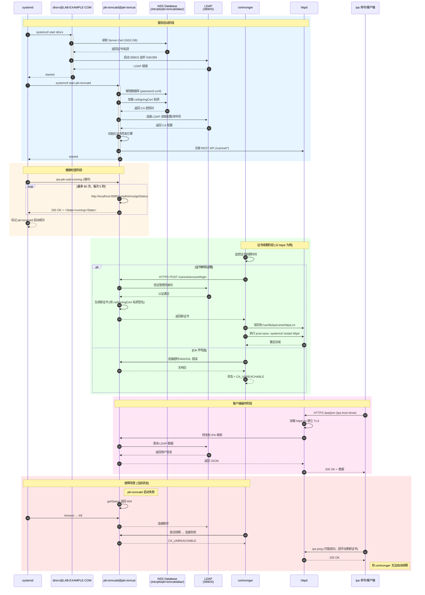

# FreeIPA 与 IdM 故障排查

## 文档说明

## 文档目录

- [FreeIPA 与 IdM 故障排查](#freeipa-与-idm-故障排查)
  - [文档说明](#文档说明)
  - [文档目录](#文档目录)
  - [定位 IdM 平台中的各类主体（principle）](#定位-idm-平台中的各类主体principle)
  - [IdM 中的证书认证体系](#idm-中的证书认证体系)
    - [NSS 数据库（SQLite3）与各类证书](#nss-数据库sqlite3与各类证书)
    - [IdM 中各组件调用关系](#idm-中各组件调用关系)
      - [组件名称与功能介绍](#组件名称与功能介绍)
      - [组件间的强依赖关系说明](#组件间的强依赖关系说明)
      - [🎯 pki-tomcatd、dirsrv、httpd 与 certmonger 间的调用关系](#-pki-tomcatddirsrvhttpd-与-certmonger-间的调用关系)
  - [场景1：手动签发修复过期的 httpd 证书](#场景1手动签发修复过期的-httpd-证书)
  - [场景2：手动签发修复过期的 dirsrv 证书](#场景2手动签发修复过期的-dirsrv-证书)

## 定位 IdM 平台中的各类主体（principle）

```bash
ipa host-show servera.lab.example.com
# 查看主机的 HPN
# 输出包含: Principal name: HOST/servera.lab.example.com@LAB.EXAMPLE.COM

ipa service-find --host serverb.lab.example.com
# HTTP/serverb.lab.example.com@LAB.EXAMPLE.COM
# LDAP/serverb.lab.example.com@LAB.EXAMPLE.COM
# 查看某主机上的 SPN

klist -k /etc/krb5.keytab
# Keytab name: FILE:/etc/krb5.keytab
# KVNO Principal
# ---- --------------------------------------------------------------------------
#    2 HOST/servera.lab.example.com@LAB.EXAMPLE.COM
#    2 HOST/servera.lab.example.com@LAB.EXAMPLE.COM
#    2 HOST/servera.lab.example.com@LAB.EXAMPLE.COM
# 查看 keytab 中的主体
```

## IdM 中的证书认证体系

### NSS 数据库（SQLite3）与各类证书

| 路径 | 类型/格式 | 说明 | 来源 |
| ----- | ----- | ----- | ----- |
| `/etc/pki/pki-tomcat/alias` | NSS 数据库 | Dogtag 的 NSS 数据库 | - |
| `/etc/dirsrv/slapd-LAB-EXAMPLE-COM/` | NSS 数据库 | dirsrv 的 NSS 数据库（含 Server-Cert） | - |
| `/var/lib/ipa/certs/ca.crt` | PEM | IPA 服务端的 CA 根证书 | 手动从 NSS 数据库导出 |
| `/var/lib/ipa/private/ca.key` | PEM | IPA 服务端 CA 根证书私钥 | 手动从 NSS 数据库导出 |
| `/etc/ipa/ca.crt` | PEM | IPA 客户端分发 CA 根证书 | `ipa-client-install` 从服务器下载 |
| `/var/lib/ipa/certs/httpd.crt` | PEM | **httpd 的服务器证书**（终端实体） | IPA 预安装/Dogtag 签发 |
| `/var/lib/ipa/private/httpd.key` | PEM | **httpd 的服务器证书私钥** | IPA 预安装 |
| `/var/kerberos/krb5kdc/kdc.crt` | PEM | KDC 的 PKINIT 证书 | IPA 预安装/Dogtag 签发 |
| `/var/kerberos/krb5kdc/kdc.key` | PEM | KDC 证书私钥 | IPA 预安装 |

### IdM 中各组件调用关系

#### 组件名称与功能介绍

| 服务名称 | 组件名称 | 功能 |
| ----- | ----- | ----- |
| `389DS` | dirsrv@LAB-EXAMPLE.COM.service (ns-slapd) | 目录服务器 |
| `Dogtag` | pki-tomcatd.service | IPA 证书管理中心 |
| `certmonger` | certmonger.service | NSS 数据库中证书有效性追踪 |

pki-tomcatd@pki-tomcat.service 服务内部调用过程，如下所示：

```plain
pki-tomcatd@pki-tomcat.service 启动:
    │
    ├── ExecStartPre: pki-server upgrade/migrate
    │
    ├── ExecStartPre: pkidaemon start pki-tomcat
    │
    ├── ExecStart: 启动 Tomcat + 部署 PKI WAR → 如果连接 LDAP 失败，服务将无法启动！
    │
    └── ExecStartPost: ipa-pki-wait-running
                       │
                       └── 循环调用 ──→ http://localhost:8080/ca/admin/ca/getStatus
                                          │
                                          └── 返回 200 + "running" → 服务启动成功
                                          └── 返回 404/500 → 继续等待或超时失败（如果 tomcat 服务启动失败，此步报错循环出现，如下图所示）
```

#### 组件间的强依赖关系说明

pki-tomcatd@pki-tomcat.service 强依赖 dirsrv@LAB-EXAMPLE-COM.service，因此 pki-tomcatd 由于验证 dirsrv@LAB-EXAMPLE-COM.service 证书失败而导致 pki-tomcatd 无法启动，依赖链条如下所示：

```text
  依赖链条
                                                         
  dirsrv Server-Cert 过期 (2026-05-11)
       │
       ▼
  dirsrv LDAPS (636) / STARTTLS 证书验证失败
       │
       ▼
  pki-tomcatd 启动时连接 LDAP 失败
       │
       ▼
  pki-tomcatd 无法读取 CA 配置/序列号
       │
       ▼
  PKI 应用 (WAR) 部署失败或初始化失败
       │
       ▼
  Tomcat 8080 端口未监听
       │
       ▼
  ipa-pki-wait-running 连接 8080 被拒绝 (Connection refused)
       │
       ▼
  systemd 判定 pki-tomcatd 启动超时失败
```

如前文所述，下图为 pki-tomcatd 服务启动失败后，ipa-pki-wait-running 持续报错日志：

```bash
$ sudo journalctl -xe -u pki-tomcatd@pki-tomcat.service | grep -E "wait-running|getStatus|404" | less
# 查看服务报错日志
```


#### 🎯 pki-tomcatd、dirsrv、httpd 与 certmonger 间的调用关系



## 场景1：手动签发修复过期的 httpd 证书

1. 手动创建 httpd 的证书签名请求：

```bash
$ sudo ipa-getcert list
# 获取 certmonger 追踪管理的证书信息，输出中包含 pinfile 文件路径。

$ sudo openssl req -new \
  -key /var/lib/ipa/private/httpd.key \
  -out /tmp/httpd.csr \
  -passin file:/var/lib/ipa/passwds/utility.lab.example.com-443-RSA \
  -subj "/CN=utility.lab.example.com/O=LAB.EXAMPLE.COM" \
  -addext "subjectAltName=DNS:utility.lab.example.com,DNS:ipa-ca.lab.example.com"
```

2. 手动导出 Dogtag 的 NSS 数据库中的 CA 证书与 CA 私钥：

```bash
### 1. 导出 CA 证书（公钥）
$ sudo certutil -L -d /etc/pki/pki-tomcat/alias/
# 返回 caSigningCert cert-pki-ca

$ sudo certutil -L -d /etc/pki/pki-tomcat/alias/ \
  -n "caSigningCert cert-pki-ca" \
  -a \
  -o /var/lib/ipa/certs/ca.crt

### 2. 导出 CA 私钥
$ NSS_PASSWD=$(awk -F'=' '$1 == "internal" { print $2 }' /etc/pki/pki-tomcat/password.conf)
$ echo $NSS_PASSWD
# 返回 Dogtag 的 NSS 数据库密码
$ sudo pk12util -d /etc/pki/pki-tomcat/alias/ -n "caSigningCert cert-pki-ca" -o /tmp/ca.p12
Enter Password or Pin for "NSS Certificate DB": <NSS_PASSWD>
Enter password for PKSC12 file: <customized_by_yourself>
Re-enter password: <customized_by_yourself>
pk12util: PKCS12 EXPORT SUCCESSFUL

$ sudo openssl pkcs12 -in /tmp/ca.p12 -nocerts -nodes -out /var/lib/ipa/private/ca.key
Enter Import Password: <NSS_PASSWD>

$ sudo chown root:root /var/lib/ipa/private/ca.key
$ sudo chmod 0600 /var/lib/ipa/private/ca.key
```

3. 手动创建 httpd 证书：

```bash
$ sudo openssl x509 -req \
  -in /tmp/httpd.csr \
  -CA /var/lib/ipa/certs/ca.crt \
  -CAkey /var/lib/ipa/private/ca.key \
  -CAcreateserial \
  -out /var/lib/ipa/certs/httpd.crt \
  -days 365 \
  -sha256 \
  -extfile <(printf "subjectAltName=DNS:utility.lab.example.com,DNS:ipa-ca.lab.example.com")
# 使用 /var/lib/ipa/private/ca.key 签发新证书

$ sudo openssl verify -CAfile /var/lib/ipa/certs/ca.crt /var/lib/ipa/certs/httpd.crt
/var/lib/ipa/certs/httpd.crt: OK
# 验证证书间的证书链

$ sudo cp /var/lib/ipa/certs/ca.crt /etc/ipa/ca.crt
$ sudo cp /var/lib/ipa/certs/ca.crt /etc/pki/ca-trust/source/anchors/ipa-ca.crt
$ sudo update-ca-trust
# 更新 IPA 客户端 CA 根证书

$ sudo ipa host-find utility.lab.example.com
$ sudo ipa ping
# 验证与 IdM 的连通性
# 注意：ipa 命令使用系统 CA 信任库 /etc/pki/ca-trust/source/anchors/ipa-ca.crt
```

## 场景2：手动签发修复过期的 dirsrv 证书

1. 确认当前证书状态

```bash
# 查看 dirsrv NSS 数据库中的证书
$ sudo certutil -L -d /etc/dirsrv/slapd-LAB-EXAMPLE-COM/

# 查看 Server-Cert 详情
$ sudo certutil -L -d /etc/dirsrv/slapd-LAB-EXAMPLE-COM/ -n "Server-Cert"
```

2. 生成新的 CSR

```bash
# 生成 CSR（从 NSS 数据库中的现有私钥）
$ sudo certutil -R -d /etc/dirsrv/slapd-LAB-EXAMPLE-COM/ \
  -s "CN=utility.lab.example.com,O=LAB.EXAMPLE.COM" \
  -o /tmp/dirsrv.csr \
  -a \
  -g 2048
### 需要输入 60 位作为随机种子 ###
```

3. 用 CA 签发新证书

```bash
# 使用已有的 CA 证书和私钥签发
$ sudo openssl x509 -req \
  -in /tmp/dirsrv.csr \
  -CA /var/lib/ipa/certs/ca.crt \
  -CAkey /var/lib/ipa/private/ca.key \
  -CAcreateserial \
  -out /tmp/dirsrv.crt \
  -days 365 \
  -sha256 \
  -extfile <(printf "subjectAltName=DNS:utility.lab.example.com")
```

4. 替换 NSS 数据库中的旧证书

```bash
# 1. 先删除旧证书（保留私钥）
$ sudo certutil -D -d /etc/dirsrv/slapd-LAB-EXAMPLE-COM/ -n "Server-Cert"

# 2. 导入新证书
$ sudo certutil -A -d /etc/dirsrv/slapd-LAB-EXAMPLE-COM/ \
  -n "Server-Cert" \
  -t "u,u,u" \
  -i /tmp/dirsrv.crt

# 3. 验证导入成功
$ sudo certutil -L -d /etc/dirsrv/slapd-LAB-EXAMPLE-COM/ -n "Server-Cert"
```

5. 重启 dirsrv 并验证

```bash
# 重启 dirsrv
$ sudo systemctl restart dirsrv@LAB-EXAMPLE-COM

# 检查状态
$ sudo systemctl status dirsrv@LAB-EXAMPLE-COM

# 测试 LDAPS 连接
$ sudo ldapsearch -x -H ldaps://utility.lab.example.com -b "" -s base

# 或本地测试
$ sudo ldapsearch -x -H ldaps://localhost:636 -b "cn=config" -s base
```

6. 验证证书有效期

```bash
# 从 NSS 数据库导出验证
$ sudo certutil -L -d /etc/dirsrv/slapd-LAB-EXAMPLE-COM/ -n "Server-Cert" -a | \
  openssl x509 -noout -dates -subject
```
