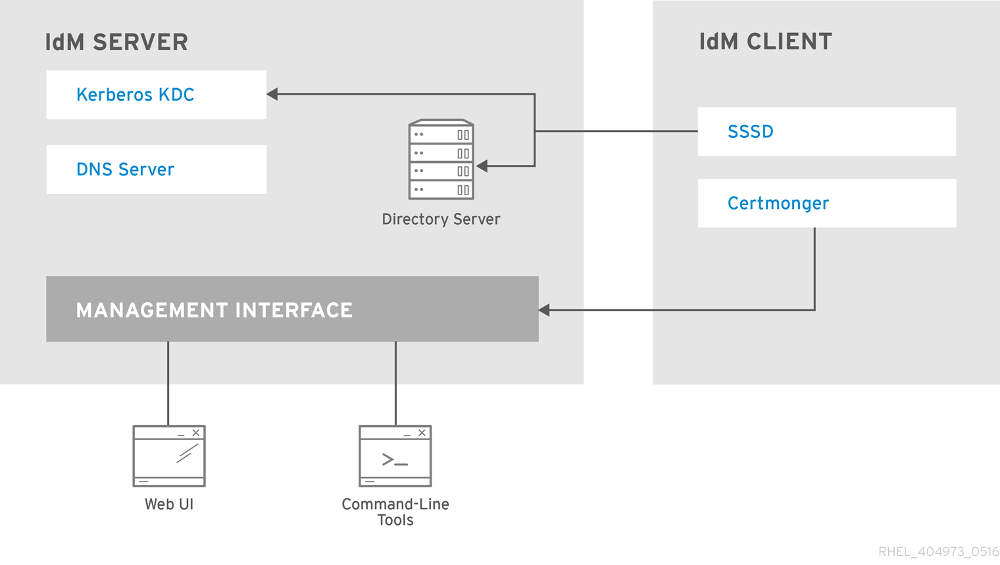
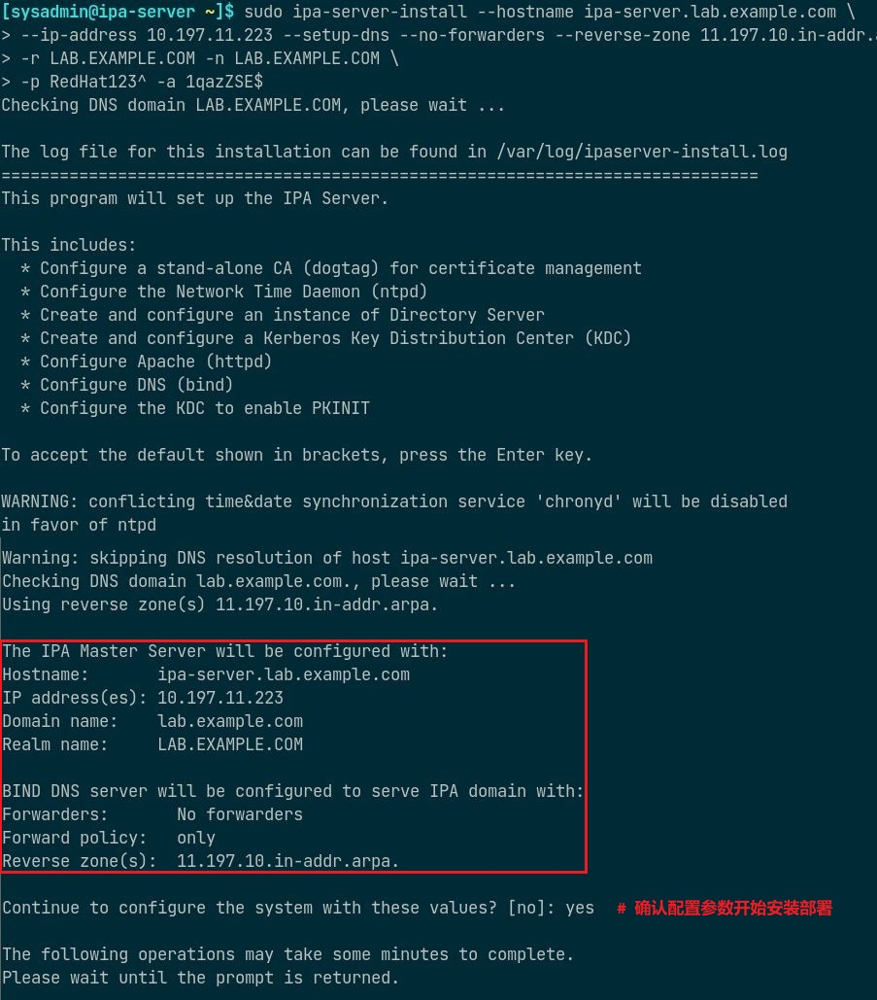
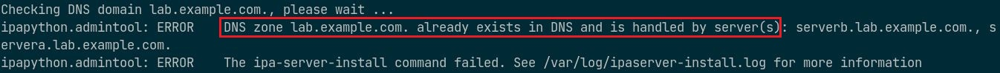
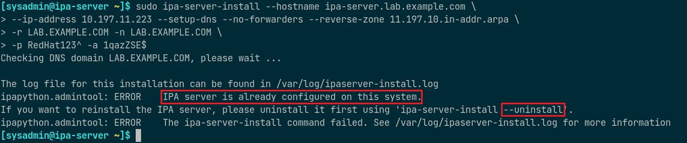
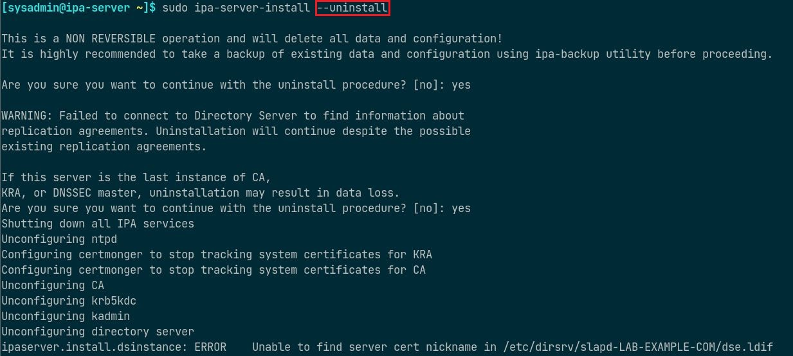
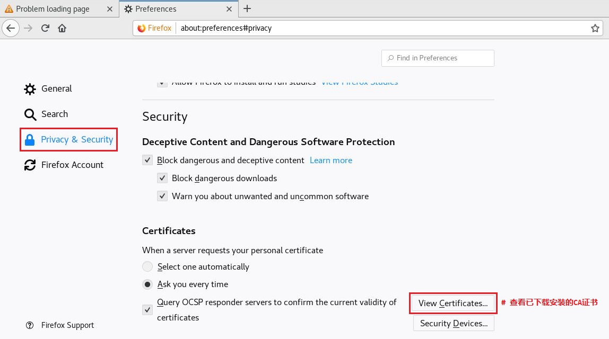
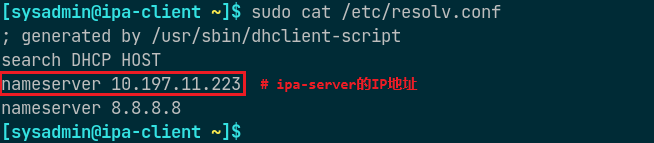
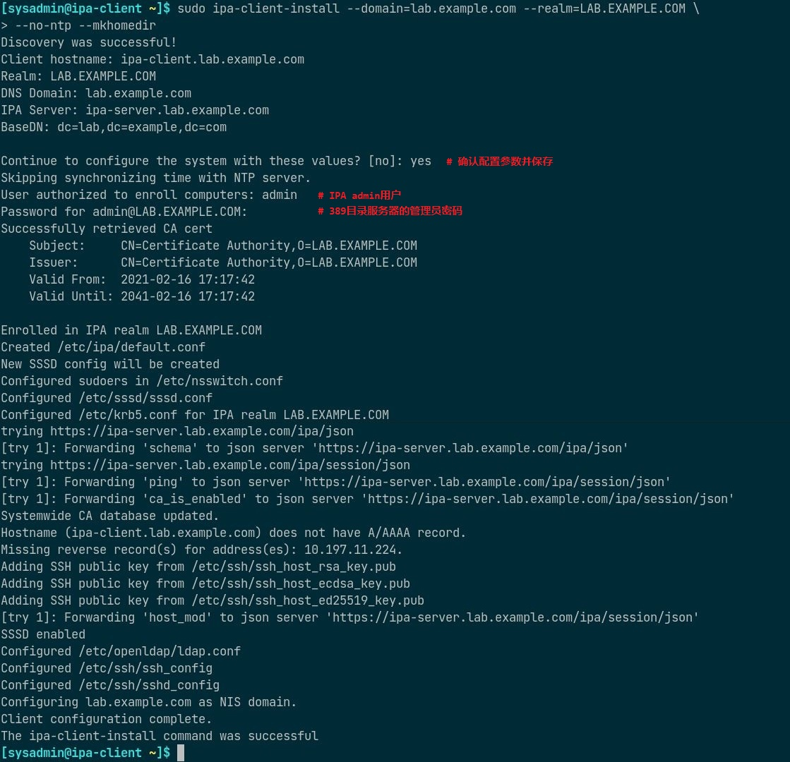
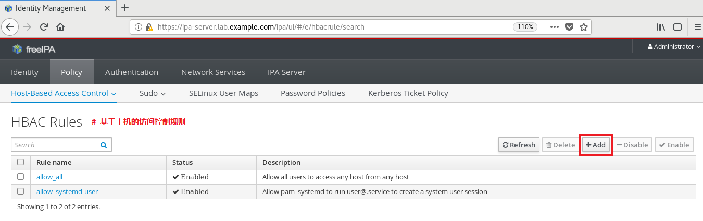

# FreeIPA 基本概念与部署

## 文档说明

- OS 版本：Red Hat Enterprise Linux release 9.1 (Plow)
- FreeIPA 相关软件包版本：  
  - ipa-server-common-4.10.0-6.el9.noarch
  - ipa-server-4.10.0-6.el9.x86_64
  - ipa-server-dns-4.10.0-6.el9.noarch
  - ipa-client-common-4.10.0-6.el9.noarch
  - ipa-client-4.10.0-6.el9.x86_64

## 文档目录
- [FreeIPA 基本概念与部署](#freeipa-基本概念与部署)
  - [文档说明](#文档说明)
  - [文档目录](#文档目录)
  - [FreeIPA 基础概要](#freeipa-基础概要)
  - [FreeIPA 节点角色与逻辑架构](#freeipa-节点角色与逻辑架构)
  - [FreeIPA 部署：服务端](#freeipa-部署服务端)
  - [查看与调试部署过程中的问题](#查看与调试部署过程中的问题)
  - [部署后命令行验证](#部署后命令行验证)
  - [部署后 Web 登录验证](#部署后-web-登录验证)
  - [添加 FreeIPA 客户端主机](#添加-freeipa-客户端主机)
  - [添加域用户与设置策略](#添加域用户与设置策略)
  - [参考链接](#参考链接)

## FreeIPA 基础概要

- Red Hat Identity Management（`IdM`）身份验证解决方案，基于上游开源项目 `FreeIPA`。
- FreeIPA 是用于 Linux/Unix 环境的开源身份管理系统，它提供集中式帐户管理和身份验证，类似于 `Microsoft Active Directory` 或 `OpenLDAP`。
- FreeIPA 本身不提供具体功能，而是整合了以下组件：
  - 👉 `389-ds-base` 软件包：389 目录服务器（LDAP）作为数据存储后端
  - 👉 `krb5-server` 软件包：MIT Kerberos KDC 作为前端验证服务
  - 👉 `dogtag` 相关软件包：CA 证书系统
  - ipa-server-dns 软件包：服务端、副本端、客户端的主机识别
  - Apache 与 Tomcat 相关软件包：提供 Web UI 管理界面
  - 👉 `sssd` 相关软件包：系统安全服务（system security service）守护进程
  - ntp 或 chrony 相关软件包：网络时间同步服务
  - ipa 统一的命令行管理身份验证系统
- 该身份验证系统存储的是主机名（域名）、IP 地址、用户名、密码等，以读为主，因此非常适合LDAP 的特性。
- 其主要功能包括：
  - 身份识别与验证：机器、用户、虚拟机、组、身份验证凭据
  - 策略：配置设置、访问控制信息
  - 审计跟踪：事件、日志、分析

## FreeIPA 节点角色与逻辑架构

- FreeIPA 中具有 3 种节点角色：
  - 服务端（server）：管理域成员使用的所有服务
  - 副本端（replica）：服务端的拷贝，一旦安装部署其功能与服务端相同。
  - 客户端（client）：属于 Kerberos 域，接收服务端发布的证书与 `ticket`，并且可使用集中的验证与授权服务。
- 服务端与副本端之间的通信：
  
  

- 客户端与服务端之间的通信：
  
  

- FreeIPA 的逻辑架构与组件：
  
  
  
  

## FreeIPA 部署：服务端

- `ipa-server` 节点角色：
  - 主机域名：ipa-server.lab.example.com
  - IP 地址：10.197.11.223/24
- `ipa-client` 节点角色：
  - 主机域名：ipa-client.lab.example.com
  - IP 地址：10.197.11.224/24
- ipa-server-install 默认使用的 DNS 转发器查找顺序：
  - `--forwarder` 选项指定 forwarder 的 IP 地址，安装程序通过此 IP 地址查找根 SOA（. SOA），如果未能查询到，则返回类似如下报错：

    ```bash
    ...
    Checking DNS domain lab.example.com., please wait ...
    Checking DNS forwarders, please wait ...
    DNS server 172.25.250.254: query '. SOA': All nameservers failed to answer the query . IN SOA: Server 172.25.250.254 UDP port 53 answered SERVFAIL
    DNS server 172.25.250.254: query '. SOA': All nameservers failed to answer the query . IN SOA: Server 172.25.250.254 UDP port 53 answered SERVFAIL
    ...
    ```

    因此，如果能查询到根 SOA 就能继续执行安装程序，最直接的解决方式是让部署的节点连接外部网络，完成根 SOA 的查询。如果不使用 forwarder，可直接使用 `--no-forwarder` 选项。

  - 未指定 `--forwarder` 选项，则读取系统 /etc/resolv.conf 第一个 nameserver。
  - 以上均不存在，则使用本机 dnsmasq/BIND 缓存。
- 服务端的部署方式：
  - 1️⃣ `ipa-server-install` 交互式命令行安装：/etc/resolv.conf 中的 nameserver 作为 forwarder

    

  - 2️⃣ `ipa-server-install` 非交互式命令行安装：`--no-forwarder` 选项不使用 forwarder
      
    ```bash
    $ sudo yum install -y ipa-server ipa-server-dns
  
    $ sudo ipa-server-install \
      --hostname <fqdn> \
      --ip-address <ipa_server_ip_address> \
      --setup-dns \
      --no-forwarders \
      --reverse-zone <reverse_dns_zone> \
      --realm <kerberos_realm_name> \
      --domain <primary_dns_domain_name> \
      --no-ntp \
      --unattended \
      --ds-password <directory_manager_password> \
      --admin-password <kerberos_admin_password>
    ```
  
    

- 服务端部署日志可查看：`/var/log/ipaserver-install.log`

## 查看与调试部署过程中的问题

- 若指定 forwarder，该 forwarder 不可配置有相同域名的 zone 区域数据，否则安装报错失败！
    
  
  
- 若 ipa-server-install 命令安装时卡住或被中断，重新执行该命令时将报错，需先执行卸载操作，再重新安装！
    
  

- 卸载 ipa-server：
    
  ```bash
  $ sudo ipa-server-install --uninstall
  ```
    
  
  
- 查看 DNS 静态与动态解析文件：
    
  ```bash
  $ sudo cat /etc/hosts
  $ sudo cat /etc/resolv.conf
  ```
    
  
  
## 部署后命令行验证
    
```bash
$ sudo ipactl status
Directory Service: RUNNING
krb5kdc Service: RUNNING
kadmin Service: RUNNING
named Service: RUNNING
httpd Service: RUNNING
ipa-custodia Service: RUNNING
pki-tomcatd Service: RUNNING
ipa-otpd Service: RUNNING
ipa-dnskeysyncd Service: RUNNING
ipa: INFO: The ipactl command was successful
# 查看 ipa-server 的各服务组件的运行状态
# 也可使用 start、stop、restart 子命令以控制 ipa-server 各服务
    
$ sudo kinit admin
# 部署完成后，测试部署是否成功。
# 获取 IPA admin 的认证 token，以执行相关 ipa 命令。
    
$ sudo ipa user-find admin
# 查看 admin 域用户的概要信息
```
    

    
```bash
$ sudo firewall-cmd --permanent \
  --add-port={80/tcp,443/tcp,389/tcp,636/tcp,88/tcp,464/tcp,53/tcp,88/udp,464/udp,53/udp,123/udp}
$ sudo firewall-cmd --reload
# 添加 ipa-server 所需放行的端口并重载 firewall 规则
```

## 部署后 Web 登录验证

- 在浏览器地址栏中输入 ipa-server 的 IP 地址，将自动转换为域名并返回登录界面。
- 用户名为 `admin`，密码为 `1qazZSE$`。
  
  

- 有时浏览器由于之前登陆过相同域名的主机获取过 CA 证书，再次登录相同域名的主机将无法认证通过新的 CA 证书，此时需清理浏览器缓存中 CA 证书，将其删除后即可访问。
  
  
  
  

## 添加 FreeIPA 客户端主机

```bash
$ sudo yum install -y ipa-client
$ sudo cat /etc/resolv.conf
# 配置 ipa-client 主机的 DNS 为 ipa-server 的 IP 地址
```



```bash
$ sudo ipa-client-install \
  --domain=<primary_dns_domain_name> \
  --realm=<kerberos_realm_name> \
  --no-ntp \
  --mkhomedir
# 添加 ipa-client 主机被 ipa-server 接管
# --no-ntp 选项为不配置时间同步，--mkhomedir 选项为首次登录主机时创建家目录。
```



ipa-client 主机添加成功后，在浏览器中可查看该客户端主机。


## 添加域用户与设置策略

- 打开浏览器点击 "Identity" -> "Users"，再点击 "+Add" 创建新的域用户。
  
  
  
  
  
  

- 点击 "Policy" -> "Host-Based Access Control"，再点击需要设置的 `HBAC` 规则名称或创建新的 `HBAC` 规则。
  
  
  
  

- 再点击新创建的 HBAC 规则定义各规则项。
  
  
  
  
  
  

- 可使用该域用户 SSH 登录设置的节点，如下所示：
  
  

## 参考链接

- [AD user unable to login with error : pam_sss(sshd:auth): authentication failure - Red Hat Customer Portal](https://access.redhat.com/solutions/7004011)
- [Active Directory User failed to login with Error: pam_sss(sshd:account): Access denied - Red Hat Customer Portal](https://access.redhat.com/solutions/2187581)
