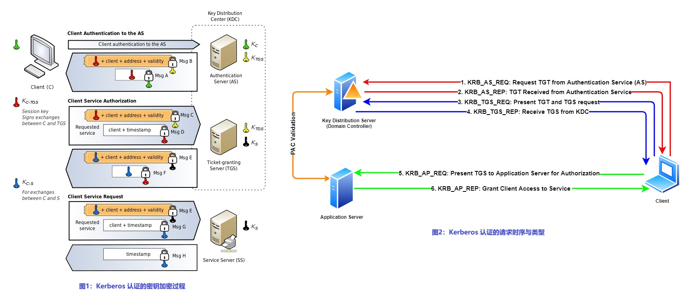
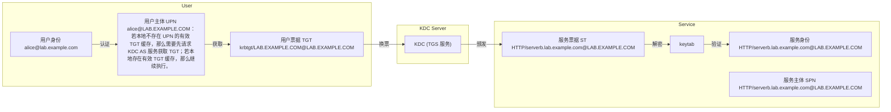
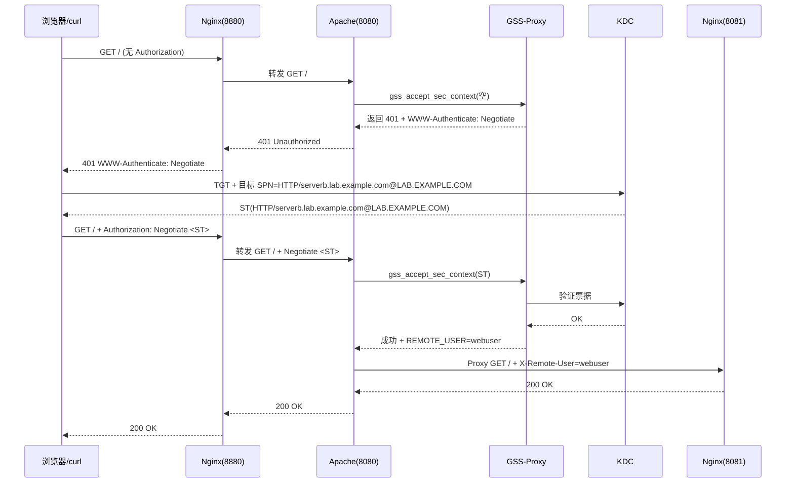

# 🪪 Kerberos 认证原理与集成

## 文档说明

- 实验环境：
  - OS 版本：`Red Hat Enterprise Linux release 8.4 (Ootpa)`
  - Kerberos 版本：
    - krb5-workstation-1.18.2-8.el8.x86_64
    - krb5-server-1.18.2-8.el8.x86_64
    - krb5-libs-1.18.2-8.el8.x86_64
- 实验节点：
  
  | Hostname | Role | Other Services |
  | ----- | ----- | ----- |
  | servera.lab.example.com | Kerberos Server (KDC) | N/A |
  | serverb.lab.example.com | Kerberos Client | Apache HTTPD (GSS-Proxy) & Nginx (Reverse Proxy) |
  | workstation.lab.example.com | Kerberos Client | N/A |

## 文档目录

- [🪪 Kerberos 认证原理与集成](#-kerberos-认证原理与集成)
  - [文档说明](#文档说明)
  - [文档目录](#文档目录)
  - [1. Kerberos 核心概念](#1-kerberos-核心概念)
    - [1.1 Kerberos Principals（主体）](#11-kerberos-principals主体)
    - [1.2 常见的 SPN 前缀](#12-常见的-spn-前缀)
  - [2. Kerberos 认证原理](#2-kerberos-认证原理)
    - [2.1 Kerberos 认证过程与密钥加密过程](#21-kerberos-认证过程与密钥加密过程)
    - [2.2 Kerberos 认证过程中 principal 类型的变化](#22-kerberos-认证过程中-principal-类型的变化)
    - [🔥 2.3 为什么通过 kadmin.local 命令行创建 principal 后，依然无法在 Web 页面上显示用户已创建？](#-23-为什么通过-kadminlocal-命令行创建-principal-后依然无法在-web-页面上显示用户已创建)
  - [3. Kerberos Server (KDC) 服务端部署](#3-kerberos-server-kdc-服务端部署)
  - [4. 管理 Kerberos Principals](#4-管理-kerberos-principals)
    - [4.1 创建新的 principal](#41-创建新的-principal)
    - [4.2 删除已创建的 principal](#42-删除已创建的-principal)
  - [🎯 5. Kerberos 客户端对接 KDC 与 SSO 验证](#-5-kerberos-客户端对接-kdc-与-sso-验证)
  - [6. 示例：实现访问 Kerberos SSO 认证的 Web 服务方式](#6-示例实现访问-kerberos-sso-认证的-web-服务方式)
    - [6.1 方法1：Nginx 反向代理 + Apache mod\_auth\_gssapi 模块](#61-方法1nginx-反向代理--apache-mod_auth_gssapi-模块)
      - [6.1.1 步骤1：Nginx 反向代理配置](#611-步骤1nginx-反向代理配置)
      - [6.2.2 步骤2：安装与配置 mod\_auth\_gssapi 模块](#622-步骤2安装与配置-mod_auth_gssapi-模块)
      - [6.2.3 安装与配置 GSS-Proxy](#623-安装与配置-gss-proxy)
    - [6.2 方法2：Nginx ngx\_http\_auth\_gssapi 模块](#62-方法2nginx-ngx_http_auth_gssapi-模块)
  - [参考链接](#参考链接)
  - [待解决问题](#待解决问题)

## 1. Kerberos 核心概念

### 1.1 Kerberos Principals（主体）

- Kerberos principals 是 Kerberos 认证系统中用于唯一标识实体（如用户、服务或主机）的名称。它通常采用 `primary[/instance]@REALM` 的格式，其中 ‌primary‌ 表示主体的基本名称（如用户名或 host），‌instance‌ 是可选的实例部分用于进一步区分（例如 admin），‌REALM‌ 是大写的 Kerberos 领域名称，类似于域名。‌
- Kerberos 里只有两种 principal 类型，区别完全体现在 **命名格式** 和 **用途**，协议本身没有额外的类型字段。

| 名称 | 格式 | 作用 | 示例 |
| ----- | ----- | ----- | ----- |
| **User Principal（UPN）** | `用户名@REALM` | 代表 **人**（用户、管理员、机器人），用于人认证（密码/TGT） | `alice@LAB.EXAMPLE.COM` |
| **Host Principal（HPN）** | `HOST/主机名@REALM` | 代表 **主机本身**（服务器、工作站、节点），用于主机加入域、验证主机身份、SSSD/LDAP 绑定 | `HOST/servera.lab.example.com@LAB.EXAMPLE.COM` |
| **Service Principal（SPN）** | `服务/主机名@REALM` | 代表 **运行在主机上的服务实例**（HTTP、LDAP、SSH、CIFS 等），用于服务认证（客户端申请服务票据） | `HTTP/serverb.lab.example.com@LAB.EXAMPLE.COM` |

### 1.2 常见的 SPN 前缀

| 前缀 | 服务 | 典型 SPN |
| ----- | ----- | ----- |
| `HTTP/` | Web 服务器 | `HTTP/www.lab.example.com@LAB.EXAMPLE.COM` |
| `ldap/` | 目录服务器 | `ldap/dc.lab.example.com@LAB.EXAMPLE.COM` |
| `host/` | 主机通用 | `host/serverb.lab.example.com@LAB.EXAMPLE.COM` |
| `nfs/` | NFS 服务器 | `nfs/nfs.lab.example.com@LAB.EXAMPLE.COM` |
| `postgres/` | PostgreSQL | `postgres/db.lab.example.com@LAB.EXAMPLE.COM` |

## 2. Kerberos 认证原理

### 2.1 Kerberos 认证过程与密钥加密过程

如下图：客户端请求 TGT、TGS 与服务的过程中密钥加密的变化

<center></center>

### 2.2 Kerberos 认证过程中 principal 类型的变化



### 🔥 2.3 为什么通过 kadmin.local 命令行创建 principal 后，依然无法在 Web 页面上显示用户已创建？

FreeIPA/IdM/OpenLDAP 中的用户与 Kerberos principal 强绑定（一一对应），通过创建用户将同时创建对应的 principal。而纯命令行 kadmin.local add_principal 只生成 Kerberos principal，不会在 FreeIPA/IdM/OpenLDAP 里创建 `posixAccount`（即 uid、gid、home 等系统账号属性）。因此，即使在客户端使用 `kinit demo@LAB.EXAMPLE.COM` 此类命令保存了 principal 的 TGT 缓存，但是 SSSD 在枚举用户时根本无法感知这个新建的 principal，自然也不会把它缓存到 `/var/lib/sss/db/` 中。要让 “裸 principal” 也能被 sssctl 显示并用于 SSH 登录，必须手动补录一条同名的 `posixAccount` 到 LDAP，让 SSSD 有账可查。所以，kadmin.local add_principal 命令新建 principal 不能在 Web 页面查看。

```mermaid
%%{init: {'theme': 'base', 'themeVariables': { 'primaryColor': '#e1f5fe', 'primaryTextColor': '#01579b', 'primaryBorderColor': '#0288d1', 'lineColor': '#0288d1', 'secondaryColor': '#fff3e0', 'tertiaryColor': '#e8f5e9'}}}%%

flowchart LR
    subgraph STEP1["1️⃣ 创建方式"]
        direction TB
        A1["ipa user-add demo"]
        B1["kadmin.local addprinc demo"]
    end

    subgraph STEP2["2️⃣ LDAP 记录"]
        direction TB
        A2["✓ uid=demo<br/>cn=users,..."]
        B2["✗ 无记录"]
    end

    subgraph STEP3["3️⃣ POSIX 属性"]
        direction TB
        A3["✓ uid/gid<br/>home/shell"]
        B3["✗ 无属性"]
    end

    subgraph STEP4["4️⃣ Kerberos Principal"]
        direction TB
        A4["✓ 自动生成"]
        B4["✓ 手动创建"]
    end

    subgraph STEP5["5️⃣ SSSD 枚举"]
        direction TB
        A5["✓ 通过 LDAP<br/>可发现"]
        B5["✗ 无法发现"]
    end

    subgraph STEP6["6️⃣ Web UI 显示"]
        direction TB
        A6["✓ 显示"]
        B6["✗ 不显示"]
    end

    subgraph STEP7["7️⃣ SSH 登录"]
        direction TB
        A7["✓ 可用"]
        B7["✗ 不可用"]
    end

    A1 --> A2 --> A3 --> A4 --> A5 --> A6 --> A7
    B1 --> B2 --> B3 --> B4 --> B5 --> B6 --> B7

    style A1 fill:#e8f5e9,stroke:#2e7d32
    style A2 fill:#e8f5e9,stroke:#2e7d32
    style A3 fill:#e8f5e9,stroke:#2e7d32
    style A4 fill:#e8f5e9,stroke:#2e7d32
    style A5 fill:#e8f5e9,stroke:#2e7d32
    style A6 fill:#e8f5e9,stroke:#2e7d32
    style A7 fill:#e8f5e9,stroke:#2e7d32

    style B1 fill:#ffebee,stroke:#c62828
    style B2 fill:#ffebee,stroke:#c62828
    style B3 fill:#ffebee,stroke:#c62828
    style B4 fill:#c8e6c9,stroke:#2e7d32
    style B5 fill:#ffebee,stroke:#c62828
    style B6 fill:#ffebee,stroke:#c62828
    style B7 fill:#ffebee,stroke:#c62828
```



## 3. Kerberos Server (KDC) 服务端部署

```bash
###servera.lab.example.com
$ sudo dnf install -y krb5-server krb5-workstation krb5-libs
#安装 Kerberos 的 KDC 服务端与 Kerberos 管理工具

$ sudo vim /etc/krb5.conf  #Kerberos 配置文件（KDC 与 Kerberos 客户端都应存在）
# To opt out of the system crypto-policies configuration of krb5, remove the
# symlink at /etc/krb5.conf.d/crypto-policies which will not be recreated.
includedir /etc/krb5.conf.d/

[logging]
    default = FILE:/var/log/krb5libs.log
    kdc = FILE:/var/log/krb5kdc.log
    admin_server = FILE:/var/log/kadmind.log

[libdefaults]
    dns_lookup_realm = false
    dns_lookup_kdc = true
    ticket_lifetime = 24h
    renew_lifetime = 7d
    forwardable = true
    rdns = false
    pkinit_anchors = FILE:/etc/pki/tls/certs/ca-bundle.crt
    spake_preauth_groups = edwards25519
#    default_realm = EXAMPLE.COM
    default_realm = LAB.EXAMPLE.COM  #自定义 realm 名称
    default_ccache_name = KEYRING:persistent:%{uid}

[realms]
# EXAMPLE.COM = {
#     kdc = kerberos.example.com
#     admin_server = kerberos.example.com
# }
 LAB.EXAMPLE.COM = {
   kdc = servera.lab.example.com:88
   admin_server = servera.lab.example.com:749
   default_domain = lab.example.com
 }
#自定义具体的 realm

[domain_realm]
# .example.com = EXAMPLE.COM
# example.com = EXAMPLE.COM
 .lab.example.com = LAB.EXAMPLE.COM
 lab.example.com = LAB.EXAMPLE.COM
 servera.lab.example.com = LAB.EXAMPLE.COM


$ sudo vim /var/kerberos/krb5kdc/kdc.conf  #krb5kdc 服务器配置文件
[kdcdefaults]
    kdc_ports = 88  #krb5kdc 服务监听的端口
    kdc_tcp_ports = 88
    spake_preauth_kdc_challenge = edwards25519

[realms]
LAB.EXAMPLE.COM = {  
     master_key_type = aes256-cts
     acl_file = /var/kerberos/krb5kdc/kadm5.acl
     dict_file = /usr/share/dict/words
     #admin_keytab = /var/kerberos/krb5kdc/kadm5.keytab
     supported_enctypes = aes256-cts:normal aes128-cts:normal arcfour-hmac:normal camellia256-cts:normal camellia128-cts:normal
}
#指定的 realm，realm 的名称必须与 /etc/krb5.conf 中的名称保持一致。


$ sudo kdb5_util create -r -s LAB.EXAMPLE.COM
#初始化 KDC 数据库
#启动 krb5kdc 与 kadmin 服务前，需先完成配置文件的编辑，再创建 KDC 数据库，否则在启动服务时将报错。
$ sudo systemctl enable --now krb5kdc.service kadmin.service
#启动 krb5kdc 与 kadmin 服务

$ sudo kadmin.local -q "addprinc -randkey HTTP/serverb.lab.example.com@LAB.EXAMPLE.COM"
#创建 HTTP 类型票据用于 Web 服务类型认证
$ sudo kadmin.local -q "ktadd -k ./http.keytab HTTP/serverb.lab.example.com@LAB.EXAMPLE.COM"
#导出创建的票据为 keytab 文件
$ ls -lh ./http.keytab
$ scp ./http.keytab root@serverb.lab.example.com:/opt/http.keytab  #同步 keytab 文件至 Kerberos 客户端
$ scp /etc/krb5.conf root@serverb.lab.example.com:/etc/krb5.conf   #同步 Kerberos 配置文件至 Kerberos 客户端
```

## 4. 管理 Kerberos Principals

### 4.1 创建新的 principal

```bash
##Kerberos 认证服务节点/FreeIPA/IdM
$ sudo kadmin.local -x ipa-setup-override-restrictions add_principal -pw <password> <username>@REALM
$ sudo kadmin.local -x ipa-setup-override-restrictions add_principal -pw demotest123 demo@LAB.EXAMPLE.COM
#示例：创建指定名称的 UPN 并设置密码，覆盖默认的严格的 IdM 认证限制。
```

### 4.2 删除已创建的 principal

```bash
##Kerberos 认证服务节点/FreeIPA/IdM
$ sudo kadmin.local -x ipa-setup-override-restrictions delete_principal <username>
$ sudo kadmin.local -x ipa-setup-override-restrictions delete_principal demo
```

## 🎯 5. Kerberos 客户端对接 KDC 与 SSO 验证

本示例中使用 HTTP 类型票据（SPN）进行 Kerberos 客户端连接，完成 SSO 验证。

> 注意：SSO（Single Sign-On，单点登录）是指用户只需认证一次，就能访问多个相互信任的系统/应用，无需重复输入密码。

```bash
###serverb.lab.example.com
$ sudo dnf install -y krb5-workstation krb5-libs
$ kinit -kt /opt/http.keytab HTTP/serverb.lab.example.com@LAB.EXAMPLE.COM
#前文 "3. Kerberos Server (KDC) 服务端部署" 中已创建
#使用 SPN 以及指定的 keytab 文件连接 KDC 完成认证（SSO 验证）
# 💥 注意：
#   1. keytab 文件每次在 KDC 节点新生成或者导出后都要在 Kerberos 更新一次，否则将认证失败。
#   2. 若上述命令运行返回成功，则无任何输出。
#   3. 若运行报错 "Could not find ..."，则表明 KDC 中 SPN 对应的 keytab 与命令行中指定的 keytab 不一致，
#      或者客户端不存在 /etc/krb5.conf，或者 /etc/krb5.conf 中的配置存在错误，需进行更正。

$ sudo klist -A  #列举 Kerberos 缓存中的票据（SPN 条目）
$ sudo kdestroy  #清除所有缓存的票据（SPN 条目）
```

## 6. 示例：实现访问 Kerberos SSO 认证的 Web 服务方式

### 6.1 方法1：Nginx 反向代理 + Apache mod_auth_gssapi 模块

Nginx 作为反向代理（Reverse Proxy），Apache HTTPD 接收流量并调用 `mod_auth_gssapi` 模块，此模块通过 `/run/gssproxy/http.sock` 套接字与 gssproxy 守护进程通信，使用 keytab 文件完成服务主体 `HTTP/serverb.lab.example.com@LAB.EXAMPLE.COM` 的解密，最终实现 SSO 认证。



#### 6.1.1 步骤1：Nginx 反向代理配置

```bash
###serverb.lab.example.com
$ sudo dnf install -y nginx

$ sudo vim /etc/nginx/conf.d/reverse.conf  #编辑 Nginx 反向代理配置文件
server {
    listen 8880;  #监听本地 8880/tcp 端口
    server_name serverb.lab.example.com;

    location / {
        proxy_pass http://127.0.0.1:8080;  #反向代理至本地 8080/tcp 端口（Apache HTTPD 服务的端口）
        proxy_set_header Host $host;
        proxy_set_header X-Real-IP $remote_addr;
    }
}

$ sudo vim /etc/nginx/conf.d/webserver.conf  #编辑 Nginx 的 Web 服务配置
server {
    listen 127.0.0.1:8081;  #监听本地 8081/tcp 端口
    root /usr/share/nginx/html;  #Nginx 根目录
    index index.html;
}
```

#### 6.2.2 步骤2：安装与配置 mod_auth_gssapi 模块

Apache HTTPD 在 mod_auth_gssapi 模块安装过程中也将一并安装，配置过程如下所示：

```bash
###serverb.lab.example.com
$ sudo dnf install -y mod_auth_gssapi  #安装 GSSAPI 模块

$ sudo vim /etc/httpd/conf.d/gssproxy.conf  #编辑 Apache HTTPD 配置文件
Listen 127.0.0.1:8080  #由于 Nginx 与 Apache 部署在同一节点上，且 Nginx 用作反向代理，因此，Nginx 监听回环口 8080/tcp 端口。
<VirtualHost 127.0.0.1:8080>
  ServerName serverb.lab.example.com

  <Location />
    AuthType GSSAPI  #指定认证类型
    AuthName "Kerberos via SSO"
    #GssapiUseGssProxy On  #此参数已弃用
    GssapiAllowedMech krb5  #GSSAPI 允许的认证机制
    GssapiCredStore keytab:/etc/gssproxy/http.keytab  #GSSAPI 认证凭据存储路径
    Require valid-user
    #RequestHeader set X-Remote-User %{REMOTE_USER}s
  </Location>

  ProxyPreserveHost On  #启用反向代理
  ProxyPass  / http://127.0.0.1:8081/
  ProxyPassReverse  / http://127.0.0.1:8081/
</VirtualHost>

$ sudo systemctl enable --now httpd.service
```

#### 6.2.3 安装与配置 GSS-Proxy

Apache HTTPD 与 GSS-Proxy 服务之间的关系如下所示：

| 组件 | 作用 |
| ----- | ----- |
| `mod_auth_gssapi` | Apache HTTPD 的 GSSAPI 认证模块（取代旧 `mod_auth_kerb`） |
| `gssproxy` | 让 **非 root 的 httpd 用户** 安全读取 keytab |
| Apache HTTPD | 监听端口，触发 GSSAPI → GSS-Proxy → Kerberos |
| KDC | 颁发 TGT / ST，验证票据。 |

```bash
###serverb.lab.example.com
$ sudo vim /etc/gssproxy/80-http.conf 
[service/http]
  mechs = krb5  #指定认证的机制
  #cred_store = keytab:/etc/gssproxy/testuser.keytab
  cred_store = ccache:/var/lib/gssproxy/clients/krb5cc_%U
  socket = /run/gssproxy/http.sock
  trusted = yes
  kernel_nfsd = no
  euid = apache
```

### 6.2 方法2：Nginx ngx_http_auth_gssapi 模块

Nginx 直接接收客户端流量，由于其自身不支持 GSS 认证，需要额外编译 `ngx_http_auth_gssapi` 模块，让 GSS-Proxy 提供 `SPNEGO` 认证套接字，Nginx 通过 `ngx_http_auth_gssapi` 模块（动态加载）与之通信，实现 Kerberos SSO。

## 参考链接

- [Kerberos: An Authentication Service for Computer Networks](https://gost.isi.edu/publications/kerberos-neuman-tso.html)

## 待解决问题

1. sssd 对接 idm 的过程？主机上的用户如何通过 su 切换用户，经由 sssd 完成 kerberos 认证？
2. idm 中的 httpd 服务端证书过期，但是 ca 证书没有过期应该如何更新此证书？这个证书会影响 kerberos 认证吗？
3. ipa web 页面上的登录用户是 kerberos 中的用户吗？
4. kerberos 中的用户和 ipa 中在 web 端可见的用户是什么关系？
5. 如何重置 ipa web 页面上的登录用户密码？
6. sssd 对接 idm 和 kerberos 客户端对接 idm，这两者的差别是什么？
7. 如何比较两张 CA 证书是否是同一张？
8. 如何确认 CA 证书与密钥文件是否匹配？
