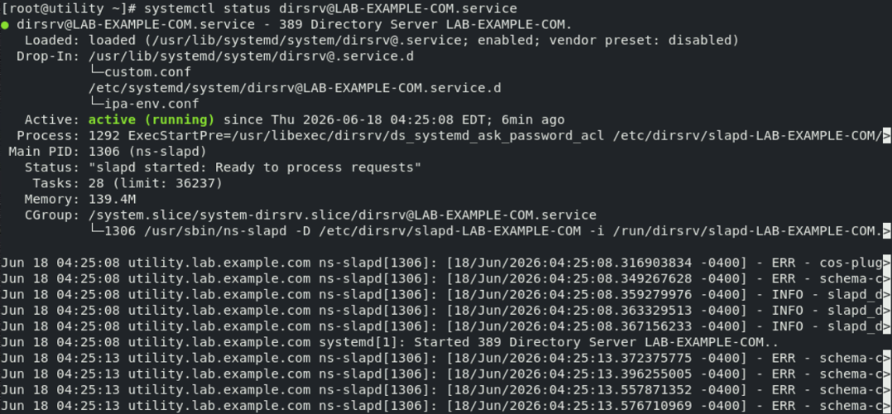
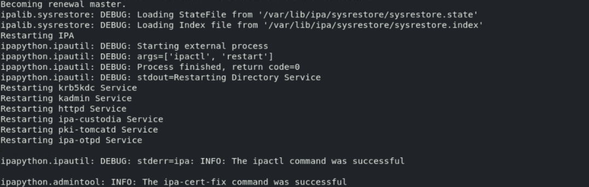
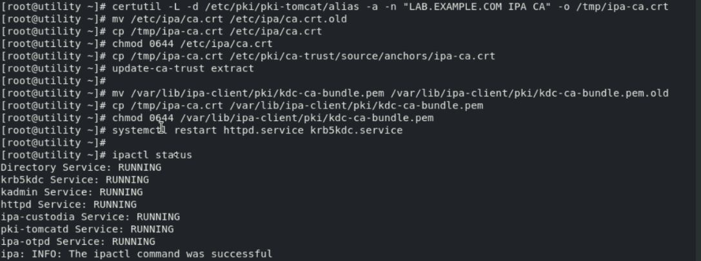
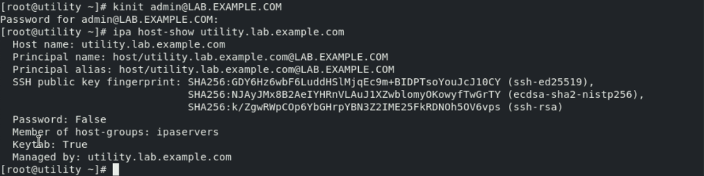
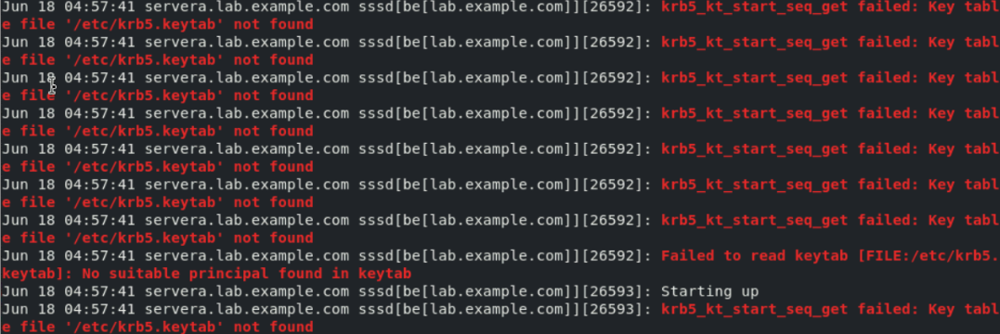

# IdM 修复

- `student@workstation` 上执行 `lab start security-ldap` 报错本质是由于 IdM 证书过期导致的平台不可服务。
- 因此，登录 `root@utility` 修复 IdM：

  ```bash
  systemctl status dirsrv@LAB.EXAMPLE.COM.service    #确保服务 active
  ipa-cert-fix -v --log-file=/tmp/ipa_cert_fix.log   #输入 yes 继续

  certutil -L -d /etc/pki/pki-tomcat/alias -a -n "LAB.EXAMPLE.COM IPA CA" -o /tmp/ipa-ca.crt
  mv /etc/ipa/ca.crt /etc/ipa/ca.crt.old
  cp /tmp/ipa-ca.crt /etc/ipa/ca.crt
  chmod 0644 /etc/ipa/ca.crt
  cp /tmp/ipa-ca.crt /etc/pki/ca-trust/source/anchors/ipa-ca.crt
  update-ca-trust extract

  mv /var/lib/ipa-client/pki/kdc-ca-bundle.pem /var/lib/ipa-client/pki/kdc-ca-bundle.pem.old
  cp /tmp/ipa-ca.crt /var/lib/ipa-client/pki/kdc-ca-bundle.pem
  chmod 0644 /var/lib/ipa-client/pki/kdc-ca-bundle.pem
  systemctl restart httpd.service krb5kdc.service

  ipactl status
  kinit admin@LAB.EXAMPLE.COM    #密码：RedHat123^
  ipa host-show utility.lab.example.com    
  #可返回主机信息条目表示成功
  #同时登录 https://utility.lab.example.com， 用户名 admin，密码 RedHat123^，登录成功表示修复完成。
  ```

  

  

  

  

- 登录 `student@workstation` 执行 `lab start security-ldap` 即可成功。
- 登录 `root@servera` 修改 sssd 相关配置文件权限，否则依然无法修复 sssd 本身权限问题：

  ```bash
  chmod 0755 /etc/sssd/
  chmod 0600 /etc/sssd/sssd.conf
  scp root@utility:/etc/krb5.keytab /etc/krb5.keytab
  #如果不同步此文件，即使按照教材练习完成步骤，依然 sssd 服务重启失败，报错如下图。
  ```

  

- 按照教材放方法继续排错完成练习即可。
