# 手动更新 IdM 各类证书的方法

## 文档目录

- [手动更新 IdM 各类证书的方法](#手动更新-idm-各类证书的方法)
  - [文档目录](#文档目录)
  - [1. 手动签发修复过期的 httpd 服务器证书](#1-手动签发修复过期的-httpd-服务器证书)
    - [1.1 手动创建 httpd 的证书签名请求](#11-手动创建-httpd-的证书签名请求)
    - [1.2 手动导出 DogTog 的 NSS 数据库中的 CA 证书与 CA 私钥](#12-手动导出-dogtog-的-nss-数据库中的-ca-证书与-ca-私钥)
    - [1.3 手动创建 httpd 证书](#13-手动创建-httpd-证书)
  - [2. 手动签发修复过期的 DirSrv 服务端证书](#2-手动签发修复过期的-dirsrv-服务端证书)
    - [2.1 确认当前证书状态](#21-确认当前证书状态)
    - [2.2 生成新的 CSR](#22-生成新的-csr)
    - [2.3 用 CA 签发新证书](#23-用-ca-签发新证书)
    - [2.4 替换 NSS 数据库中的旧证书](#24-替换-nss-数据库中的旧证书)
    - [2.5 重启 dirsrv 并验证](#25-重启-dirsrv-并验证)
    - [2.6 验证证书有效期](#26-验证证书有效期)
  - [3. 手动签发修复过期的 PKI-Tomcatd 作为服务端证书](#3-手动签发修复过期的-pki-tomcatd-作为服务端证书)
  - [4. 手动签发修复过期的 PKI-Tomcatd 作为客户端证书](#4-手动签发修复过期的-pki-tomcatd-作为客户端证书)
  - [5. 更新 PKI-Tomcatd 与 DirSrv 数据库中的  IPA CA 根证书](#5-更新-pki-tomcatd-与-dirsrv-数据库中的--ipa-ca-根证书)
    - [5.1 背景说明](#51-背景说明)
    - [5.2 确认 NSS 数据库中的 IPA CA 证书指纹](#52-确认-nss-数据库中的-ipa-ca-证书指纹)
    - [5.3 更新 dirsrv NSS 数据库中的 IPA CA 根证书](#53-更新-dirsrv-nss-数据库中的-ipa-ca-根证书)

## 1. 手动签发修复过期的 httpd 服务器证书

### 1.1 手动创建 httpd 的证书签名请求

```bash
$ sudo ipa-getcert list
# 获取 certmonger 追踪管理的证书信息，输出中包含 pinfile 文件路径。

$ sudo openssl req -new \
  -key /var/lib/ipa/private/httpd.key \
  -out /tmp/httpd.csr \
  -passin file:/var/lib/ipa/passwds/utility.lab.example.com-443-RSA \
  -subj "/CN=utility.lab.example.com/O=LAB.EXAMPLE.COM" \
  -addext "subjectAltName=DNS:utility.lab.example.com,DNS:ipa-ca.lab.example.com"
```

### 1.2 手动导出 DogTog 的 NSS 数据库中的 CA 证书与 CA 私钥

```bash
### 1. 导出 CA 证书（公钥）
$ sudo certutil -L -d /etc/pki/pki-tomcat/alias/
# 返回 caSigningCert cert-pki-ca

$ sudo certutil -L -d /etc/pki/pki-tomcat/alias/ \
  -a -n "caSigningCert cert-pki-ca" \
  -o /var/lib/ipa/certs/ca.crt

### 2. 导出 CA 私钥
$ NSS_PASSWD=$(awk -F'=' '$1 == "internal" { print $2 }' /etc/pki/pki-tomcat/password.conf)
$ echo $NSS_PASSWD
# 返回 DogTog 的 NSS 数据库密码
$ sudo pk12util -d /etc/pki/pki-tomcat/alias/ -n "caSigningCert cert-pki-ca" -o /tmp/ca.p12
Enter Password or Pin for "NSS Certificate DB": <NSS_PASSWD>    # 输入上述 NSS 数据库密码
Enter password for PKSC12 file: <customized_by_yourself>        # 自定义密码（如 redhat2026）
Re-enter password: <customized_by_yourself>
pk12util: PKCS12 EXPORT SUCCESSFUL

$ sudo openssl pkcs12 -in /tmp/ca.p12 -nocerts -nodes -out /var/lib/ipa/private/ca.key
Enter Import Password: <customized_by_yourself>    # 自定义密码（如 redhat2026）

$ sudo chown root:root /var/lib/ipa/private/ca.key
$ sudo chmod 0600 /var/lib/ipa/private/ca.key
```

### 1.3 手动创建 httpd 证书

```bash
$ sudo openssl x509 -req \
  -in /tmp/httpd.csr \
  -CA /var/lib/ipa/certs/ca.crt \
  -CAkey /var/lib/ipa/private/ca.key \
  -CAcreateserial \
  -out /var/lib/ipa/certs/httpd.crt \
  -days 365 \
  -sha256 \
  -extfile <(printf "subjectAltName=DNS:utility.lab.example.com,DNS:ipa-ca.lab.example.com")
# 使用 /var/lib/ipa/private/ca.key 签发新证书

$ sudo openssl verify -CAfile /var/lib/ipa/certs/ca.crt /var/lib/ipa/certs/httpd.crt
/var/lib/ipa/certs/httpd.crt: OK
# 验证证书间的证书链

$ sudo cp /var/lib/ipa/certs/ca.crt /etc/ipa/ca.crt
$ sudo chmod 0644 /etc/ipa/ca.crt
$ sudo cp /var/lib/ipa/certs/ca.crt /etc/pki/ca-trust/source/anchors/ipa-ca.crt
$ sudo update-ca-trust extract
# 更新系统级客户端 CA 根证书信任锚

$ sudo systemctl restart httpd.service    # 重启 httpd 服务使证书生效
$ sudo kinit admin@LAB.EXAMPLE.COM    # 更新 Ticket 票据
$ sudo ipa host-find utility.lab.example.com
$ sudo ipa ping
# 验证与 IdM 的连通性
# 注意：ipa 命令使用系统 CA 信任库 /etc/pki/ca-trust/source/anchors/ipa-ca.crt
```

## 2. 手动签发修复过期的 DirSrv 服务端证书

### 2.1 确认当前证书状态

```bash
$ sudo certutil -L -d /etc/dirsrv/slapd-LAB-EXAMPLE-COM/
# 查看 dirsrv NSS 数据库中的证书

$ sudo certutil -L -d /etc/dirsrv/slapd-LAB-EXAMPLE-COM/ -a -n "Server-Cert" | openssl x509 -noout -dates
# 查看 Server-Cert 对应证书的有效时间
```

### 2.2 生成新的 CSR

```bash
$ sudo openssl rand -out /tmp/noise.bin 60
# 生成 60 位随机种子二进制数据文件（位数是 CSR 的强制要求）
# certutil 生成 dirsrv CSR 文件所需

$ sudo certutil -R -d /etc/dirsrv/slapd-LAB-EXAMPLE-COM/ \
  -s "CN=utility.lab.example.com,O=LAB.EXAMPLE.COM" \
  -a \
  -o /tmp/dirsrv.csr \
  -g 2048 \
  -z /tmp/noise.bin
# 使用前文生成的随机种子文件生成 CSR（从 NSS 数据库中的现有私钥）
# NSS 数据库密码来自于 /etc/dirsrv/slapd-LAB-EXAMPLE-COM/pwdfile.txt
```

> 注意：若不生成随机种子文件则需要手动输入 60 位随机种子才能生成 CSR 文件（如下图所示），此处不采用此方法。
>
> 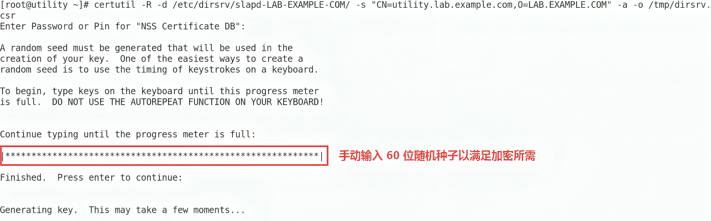

### 2.3 用 CA 签发新证书

```bash
$ sudo openssl x509 -req \
  -in /tmp/dirsrv.csr \
  -CA /var/lib/ipa/certs/ca.crt \
  -CAkey /var/lib/ipa/private/ca.key \
  -CAcreateserial \
  -out /tmp/dirsrv.crt \
  -days 365 \
  -sha256 \
  -extfile <(printf "subjectAltName=DNS:utility.lab.example.com")
# 使用已有的 CA 证书和私钥签发
```

### 2.4 替换 NSS 数据库中的旧证书

```bash
# 1. 先删除旧证书（保留私钥）
$ sudo certutil -D -d /etc/dirsrv/slapd-LAB-EXAMPLE-COM/ -n "Server-Cert"

# 2. 导入新证书
$ sudo certutil -A -d /etc/dirsrv/slapd-LAB-EXAMPLE-COM/ \
  -n "Server-Cert" \
  -t "u,u,u" \
  -i /tmp/dirsrv.crt

# 3. 验证导入成功
$ sudo certutil -L -d /etc/dirsrv/slapd-LAB-EXAMPLE-COM/ -n "Server-Cert"
```

### 2.5 重启 dirsrv 并验证

```bash
# 重启 dirsrv
$ sudo systemctl restart dirsrv@LAB-EXAMPLE-COM.service

# 检查状态
$ sudo systemctl status dirsrv@LAB-EXAMPLE-COM.service

# 测试 LDAPS 连接
$ sudo ldapsearch -x -H ldaps://utility.lab.example.com -b "" -s base

# 或本地测试
$ sudo ldapsearch -x -H ldaps://localhost:636 -b "cn=config" -s base
```

### 2.6 验证证书有效期

```bash
# 从 NSS 数据库导出验证
$ sudo certutil -L -d /etc/dirsrv/slapd-LAB-EXAMPLE-COM/ -n "Server-Cert" -a | \
  openssl x509 -noout -dates -subject
```

修复完成后，继续执行 `ipa-getcert list` 发现依然出现如下报错，提示 pki-tomcatd 端证书也存在过期失效问题。

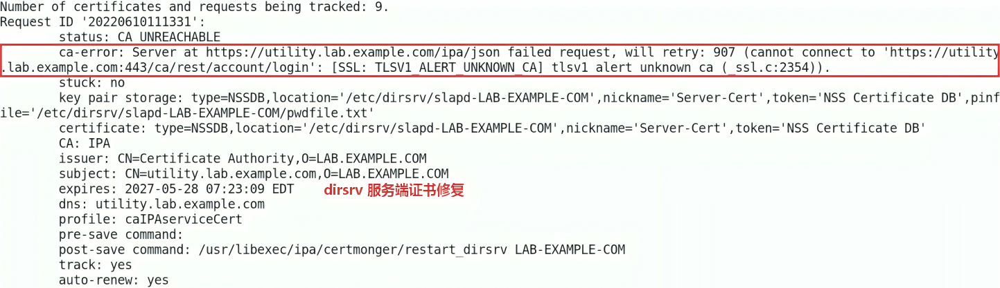

## 3. 手动签发修复过期的 PKI-Tomcatd 作为服务端证书

```bash
# 1. 确认过期
$ sudo certutil -L -d /etc/pki/pki-tomcat/alias/ -a -n "Server-Cert cert-pki-ca" | openssl x509 -noout -dates

# 2. 生成 CSR
$ sudo openssl rand -out /tmp/noise-pki-server.bin 60

$ NSS_PASSWD=$(awk -F'=' '$1 == "internal" { print $2 }' /etc/pki/pki-tomcat/password.conf)
$ echo $NSS_PASSWD
# 返回 DogTog 的 NSS 数据库密码
$ sudo certutil -R -d /etc/pki/pki-tomcat/alias \
  -s "CN=utility.lab.example.com,O=LAB.EXAMPLE.COM" \
  -a \
  -o /tmp/pki-server.csr \
  -z /tmp/noise-pki-server.bin
# 输入以上返回的 NSS 数据库密码完成 CSR 创建

# 3. 用 CA 签发
$ sudo openssl x509 -req \
  -in /tmp/pki-server.csr \
  -CA /var/lib/ipa/certs/ca.crt \
  -CAkey /var/lib/ipa/private/ca.key \
  -CAcreateserial \
  -out /tmp/pki-server.crt \
  -days 365 \
  -sha256 \
  -extfile <(printf "subjectAltName=DNS:utility.lab.example.com")

# 4. 删除旧证书，导入新证书
$ sudo certutil -D -d /etc/pki/pki-tomcat/alias/ -n "Server-Cert cert-pki-ca"
$ sudo certutil -A -d /etc/pki/pki-tomcat/alias/ \
  -n "Server-Cert cert-pki-ca" \
  -t "u,u,u" \
  -i /tmp/pki-server.crt

# 5. 重启 certmonger 服务同步证书信息
$ sudo systemctl restart certmonger.service
```

修复完成后，继续执行 `systemctl restart pki-tomcatd@pki-comcat.service` 重启服务，在等待若干分钟后依然返回 journal 报错，再次执行 `journalctl -xef -u pki-tomcatd@pki-comcat.service` 追踪服务报错日志（如下图所示），报错提示此服务在对接 dirsrv 服务时验证失败而无法连接，可排查此服务的作为客户端的证书有效期。

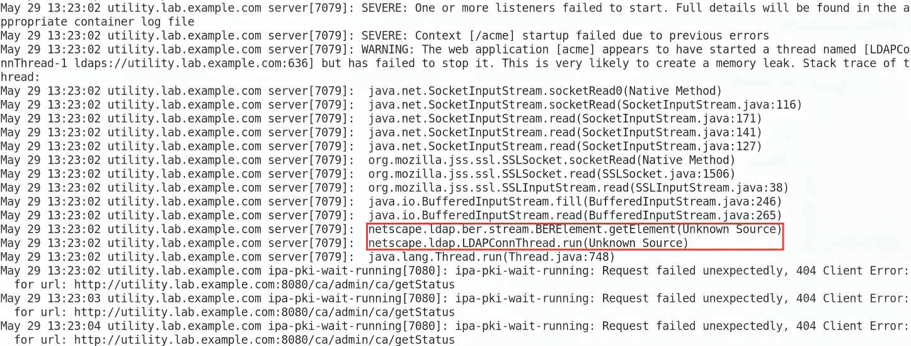

## 4. 手动签发修复过期的 PKI-Tomcatd 作为客户端证书

❌ 报错示例1：pki-tomcatd 的 Java 进程在尝试通过 SSL/TLS 连接 LDAP 时卡住，然后 getStatus 返回 404。这说明：Tomcat 启动了（8080 能响应 404），但 PKI 应用（CA WAR）未正确部署，因为 LDAP SSL 连接失败，所以 /ca/admin/ca/getStatus 找不到对应的 Servlet。此场景中重新生成客户端证书可解除以下 `404 Client Error` 报错。

```plain
java.net.SocketInputStream.socketRead0
org.mozilla.jss.ssl.SSLSocket.socketRead
netscape.ldap.LDAPConnThread.run
```

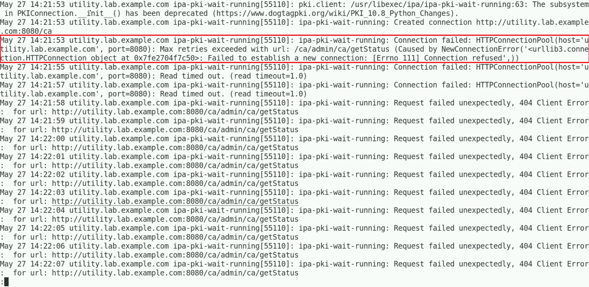

❌ 报错示例2：pki-tomcatd 与 dirsrv 采用双向认证（mTLS）的方式完成 TLS 握手后，通过 SASL External 认证机制在 LDAP 中认证失败而无法建立连接。

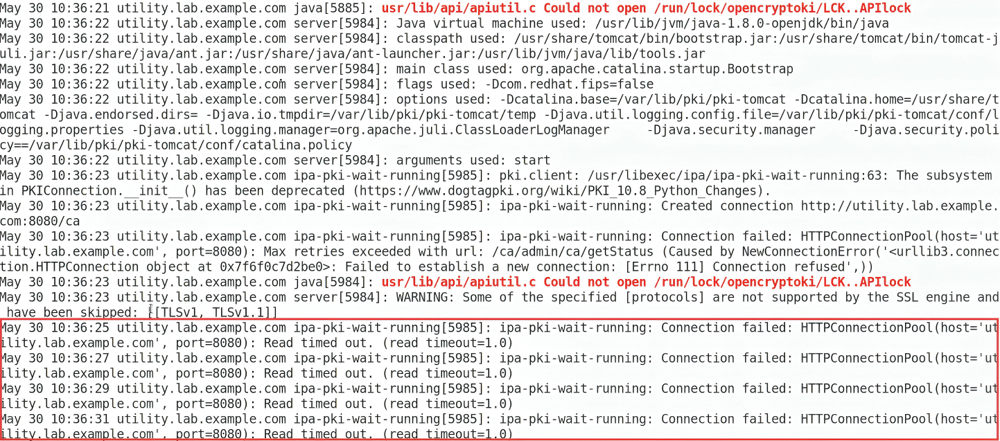

> 注意：执行 `journalctl -xe -u pki-tomcatd@pki-tomcat.service | grep -E "wait-running|getStatus|404" | less` 动态追踪 pki-tomcatd 服务报错日志信息。

```bash
# 1. 生成 CSR
$ sudo openssl rand -out /tmp/noise-subsystem.bin 60
$ sudo certutil -R -d /etc/pki/pki-tomcat/alias/ \
  -s "CN=CA Subsystem,O=LAB.EXAMPLE.COM" \
  -o /tmp/subsystem.csr \
  -a \
  -g 2048 \
  -z /tmp/noise-subsystem.bin
# 输入以上返回的 NSS 数据库密码完成 CSR 创建

# 2. 用 CA 签发
$ sudo openssl x509 -req -in /tmp/subsystem.csr \
  -CA /var/lib/ipa/certs/ca.crt \
  -CAkey /var/lib/ipa/private/ca.key \
  -CAcreateserial \
  -out /tmp/subsystem.crt \
  -days 365 \
  -sha256

# 3. 替换
$ sudo certutil -D -d /etc/pki/pki-tomcat/alias/ -n "subsystemCert cert-pki-ca"
$ sudo certutil -A -d /etc/pki/pki-tomcat/alias/ \
  -n "subsystemCert cert-pki-ca" \
  -t "u,u,u" \
  -i /tmp/subsystem.crt

# 4. 重启 certmonger 服务同步证书信息
$ sudo systemctl restart pki-tomcatd@pki-tomcat.service
```

重启 pki-tomcatd 服务后，依然继续报错 "报错示例2" 中的错误信息，提示与 LDAP 连接认证故障可追踪 /var/log/dirsrv/slapd-LAB-EXAMPLE-COM/access

```bash
$ sudo certutil -d /etc/pki/pki-tomcat/alias -O -n "Server-Cert cert-pki-ca"
# 返回指定证书的证书链
$ sudo certutil -d /etc/pki/pki-tomcat/alias -K
# 返回 NSS 数据库中的密钥 ID
$ sudo certutil -L -d /etc/pki/pki-tomcat/alias
```

## 5. 更新 PKI-Tomcatd 与 DirSrv 数据库中的  IPA CA 根证书

### 5.1 背景说明

通过 **/var/log/dirsrv/slap-LAB-EXAMPLE-COM/access** 中的日志可知（如下所示），说明 pki-tomcatd 客户端（subSystem）与 dirsrv 服务端（Server-Cert）认证不匹配造成，两者通过双向认证（mTLS），Server-Cert 与  subSystem 都由 pki-tomcatd 中的 IPA CA 证书签发。因此，进行 mTLS 认证时，双方数据库中都要同步 pki-tomcatd 中的 IPA CA 证书。

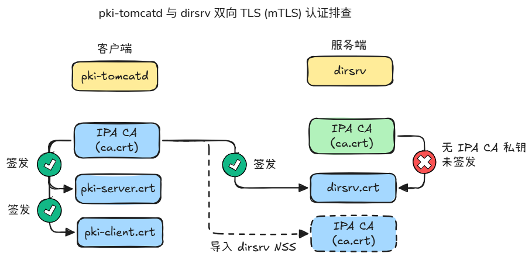

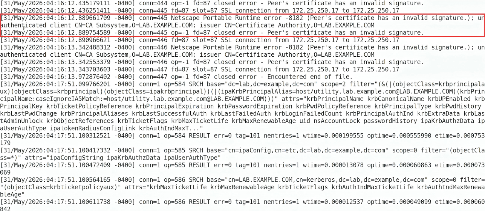

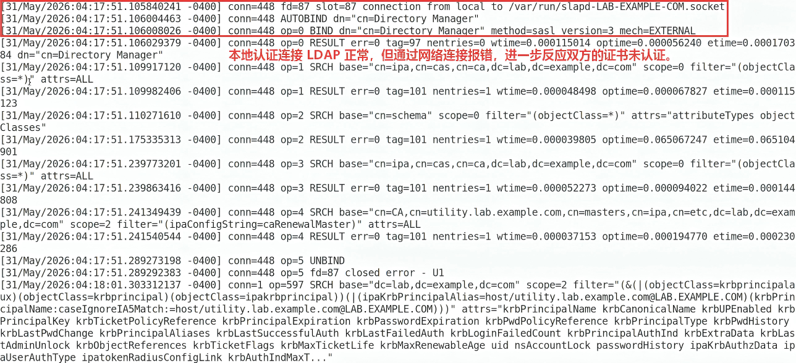

从另一台运行正常的 IdM 节点上访问 **/var/log/dirsrv/slap-LAB-EXAMPLE-COM/access** 日志文件，如下图显示，双方认证成功，并通过 SASL EXTERNAL 最终将客户端证书映射至 LDAP 中的 pkidbuser 用户，此用户的以下属性要满足：

- **客户端证书中的 subject 必须与其 seeAlso 属性相同：cn=CA Subsystem**（前文步骤中已设置）
- **证书本身要与 userCertificate 属性相同**

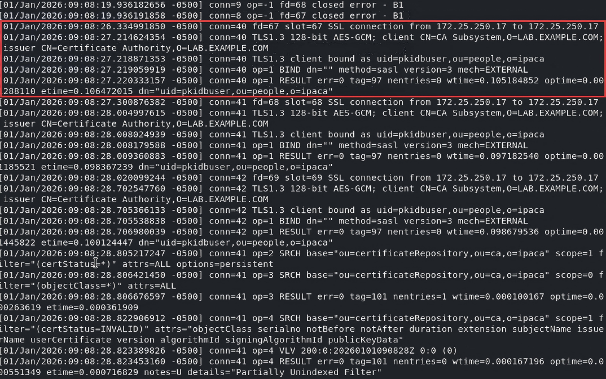

### 5.2 确认 NSS 数据库中的 IPA CA 证书指纹

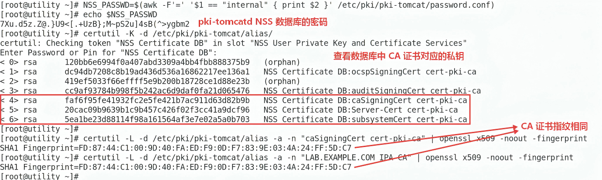

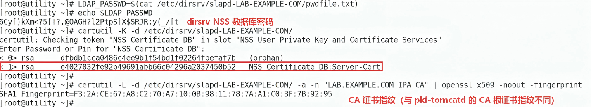

### 5.3 更新 dirsrv NSS 数据库中的 IPA CA 根证书

使用 pki-tomcatd NSS 数据库中的 IPA CA 根证书同步更新 dirsrv NSS 数据库中的 IPA CA 根证书。

```bash
$ sudo certutil -L -d /etc/pki/pki-tomcat/alias -a -n "LAB.EXAMPLE.COM IPA CA" -o /tmp/ipaca.crt
# 导出 IPA CA 根证书
# 如果有多个证书的话，需清除后只保留最近一次（一般为顶部第一个）。

$ sudo certutil -D -d /etc/dirsrv/slapd-LAB-EXAMPLE-COM -n "LAB.EXAMPLE.COM IPA CA"
$ sudo certutil -A -d /etc/dirsrv/slapd-LAB-EXAMPLE-COM \
  -n "LAB.EXAMPLE.COM IPA CA" \
  -t "CTu,Cu,Cu" \
  -i /tmp/ipaca.crt
```
