# FreeIPA 原理与常用配置管理

## 文档说明

- OS 版本：CentOS Linux release 7.7.1908 (Core)
- FreeIPA 相关软件包版本：  
  - ipa-server-4.6.8-5.el7.centos.x86_64 
  - ipa-server-dns-4.6.8-5.el7.centos.noarch 
  - ipa-client-4.6.8-5.el7.centos.x86_64

## 文档目录

- FreeIPA 基础概要
- FreeIPA 节点角色与逻辑架构
- FreeIPA 安装部署
- 部署后登录验证
- 添加 FreeIPA 客户端主机
- 添加域用户与设置策略
- 参考链接

## FreeIPA 基础概要

- Red Hat Identity Management（`IdM`）身份验证解决方案，基于上游开源项目 `FreeIPA`。
- FreeIPA 是用于 Linux/Unix 环境的开源身份管理系统，它提供集中式帐户管理和身份验证，类似于 `Microsoft Active Directory` 或 `OpenLDAP`。
- FreeIPA 本身不提供具体功能，而是整合了以下组件：
  - 👉 `389-ds-base` 软件包：389 目录服务器（LDAP）作为数据存储后端
  - 👉 `krb5-server` 软件包：MIT Kerberos KDC 作为前端验证服务
  - 👉 `dogtag` 相关软件包：CA 证书系统
  - ipa-server-dns 软件包：服务端、副本端、客户端的主机识别
  - Apache 与 Tomcat 相关软件包：提供 Web UI 管理界面
  - 👉 `sssd` 相关软件包：系统安全服务（system security service）守护进程
  - ntp 或 chrony 相关软件包：网络时间同步服务
  - ipa 统一的命令行管理身份验证系统
- 该身份验证系统存储的是主机名（域名）、IP 地址、用户名、密码等，以读为主，因此非常适合LDAP 的特性。
- 其主要功能包括：
  - 身份识别与验证：机器、用户、虚拟机、组、身份验证凭据
  - 策略：配置设置、访问控制信息
  - 审计跟踪：事件、日志、分析

## FreeIPA 节点角色与逻辑架构

- FreeIPA 中具有 3 种节点角色：
  - 服务端（server）：管理域成员使用的所有服务
  - 副本端（replica）：服务端的拷贝，一旦安装部署其功能与服务端相同。
  - 客户端（client）：属于 Kerberos 域，接收服务端发布的证书与 `ticket`，并且可使用集中的验证与授权服务。
- 服务端与副本端之间的通信：
  
  <center>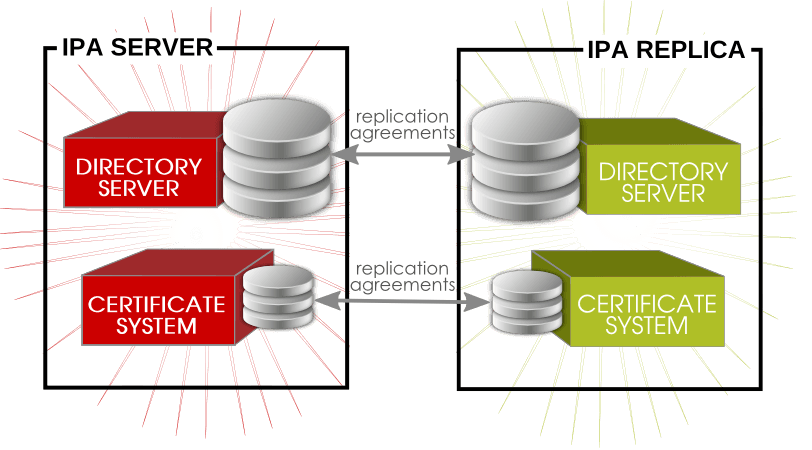</center>

- 客户端与服务端之间的通信：
  
  <center>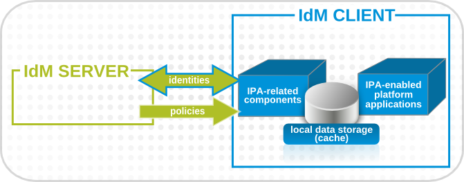</center>

- FreeIPA 的逻辑架构与组件：
  
  <center>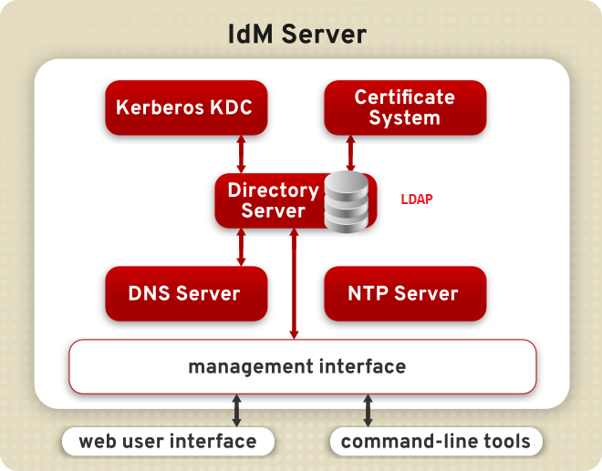</center>
  
  <center>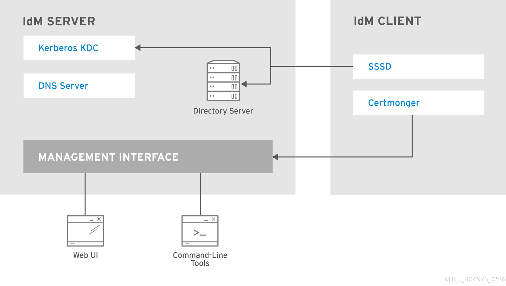</center>

## FreeIPA 的安装部署

- 各服务器节点角色分布：此次部署中未部署 `replica` 节点
  - `ipa-server` 节点角色：
    - 主机域名：ipa-server.lab.example.com
    - IP 地址：10.197.11.223/24
  - `ipa-client` 节点角色：
    - 主机域名：ipa-client.lab.example.com
    - IP 地址：10.197.11.224/24
- FreeIPA 安装可直接使用 `ipa-server-install` 命令以交互式安装，也可使用非交互式命令行安装。
- 此次部署使用交互式命令行安装，但也给出非交互式安装过程，如下所示：
  
  <center>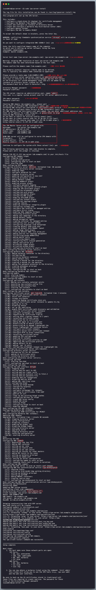</center>

- 非交互式安装部署 IPA Server：
  
  ```bash
  $ sudo yum install -y ipa-server ipa-server-dns
  # 安装 ipa-server 与 ipa-server-dns 软件包
  
  $ sudo ipa-server-install \
    --hostname <fqdn> \
    --ip-address <ipa_server_ip_address> \
    --setup-dns \
    --no-forwarders \
    --reverse-zone <reverse_dns_zone> \
    --realm <kerberos_realm_name> \
    --domain <primary_dns_domain_name> \
    --no-ntp \
    --unattended \
    --ds-password <directory_manager_password> \
    --admin-password <kerberos_admin_password>
  # 非交互式安装部署 ipa-server
  ```
  
  <center>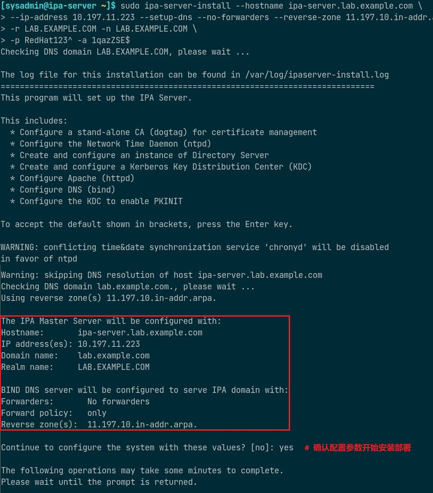</center>

- 查看与调试安装部署过程中的问题：
  - 若指定 DNS forwarder，该 `forwarder` 不可配置有相同域名的 zone 区域数据，否则安装将报错失败！
    
    <center>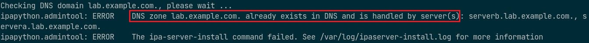</center>
  
  - 若 ipa-server-install 命令安装时卡住或被中断，重新执行该命令时将报错，需先执行卸载操作，再重新安装！
    
    <center>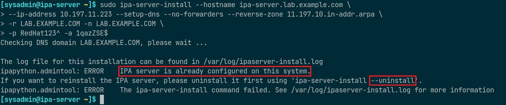</center>
  
  - 卸载 ipa-server：
    
    ```bash
    $ sudo ipa-server-install --uninstall
    ```
    
    <center>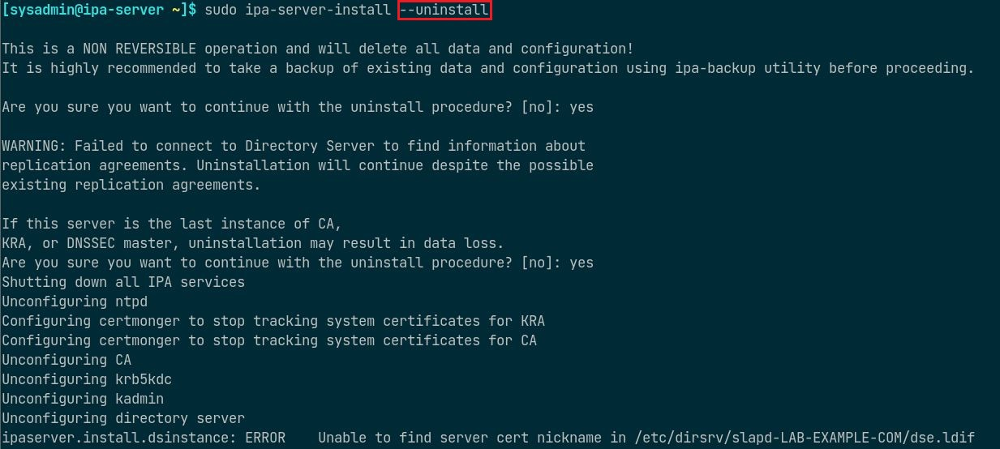</center>
  
  - 查看 DNS 静态与动态解析文件：
    
    ```bash
    $ sudo cat /etc/hosts
    $ sudo cat /etc/resolv.conf
    ```
    
    <center>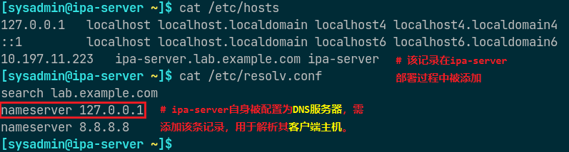</center>
  
  - ipa 命令使用示例：
    
    ```bash
    $ sudo ipactl status
    # 查看 ipa-server 的各服务组件的运行状态
    # 也可使用 start、stop、restart 子命令以控制 ipa-server 各服务
    
    $ sudo kinit admin
    # 部署完成后，测试部署是否成功。
    # 获取 IPA admin 的认证 token，以执行相关 ipa 命令。
    
    $ sudo ipa user-find admin
    # 查看 admin 域用户的概要信息
    ```
    
    <center>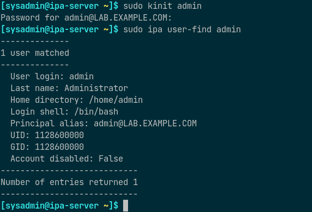</center>
    
    ```bash
    $ sudo firewall-cmd --permanent \
      --add-port={80/tcp,443/tcp,389/tcp,636/tcp,88/tcp,464/tcp,53/tcp,
      88/udp,464/udp,53/udp,123/udp}
    $ sudo firewall-cmd --reload
    # 添加 ipa-server 所需放行的端口并重载 firewall 规则
    ```

## 部署后登录验证

- 在浏览器地址栏中输入 ipa-server 的 IP 地址，将自动转换为域名并返回登录界面。
- 用户名为 `admin`，密码为 `1qazZSE$`。
  
  <center>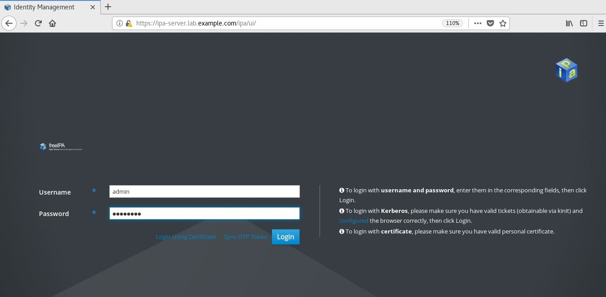</center>

- 有时浏览器由于之前登陆过相同域名的主机获取过 CA 证书，再次登录相同域名的主机将无法认证通过新的 CA 证书，此时需清理浏览器缓存中 CA 证书，将其删除后即可访问。
  
  <center>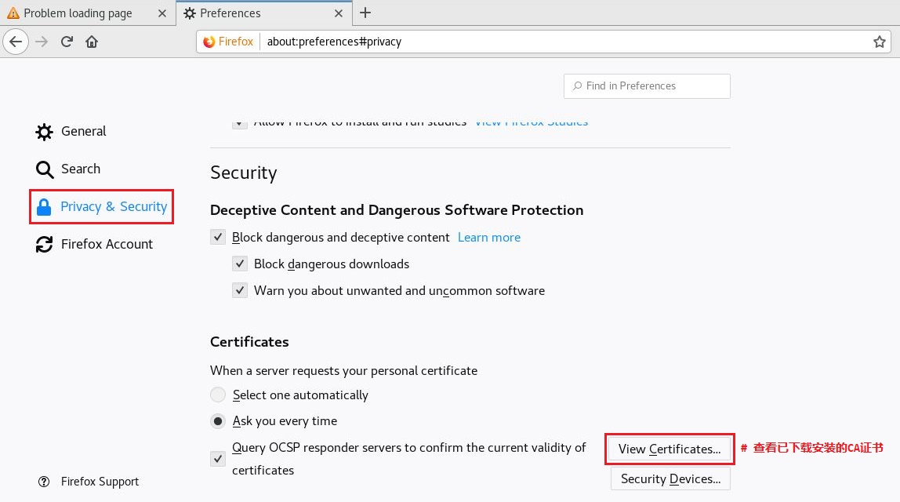</center>
  
  <center>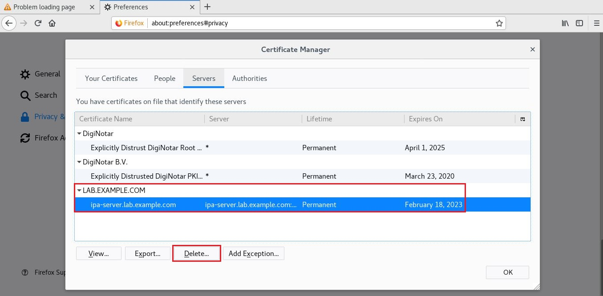</center>

## 添加 FreeIPA 客户端主机

```bash
$ sudo yum install -y ipa-client
$ sudo cat /etc/resolv.conf
# 配置 ipa-client 主机的 DNS 为 ipa-server 的 IP 地址
```

<center>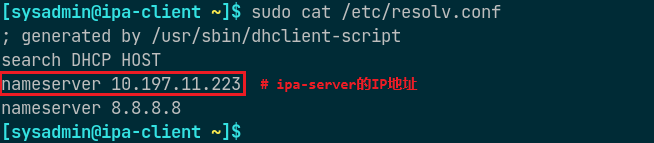</center>

```bash
$ sudo ipa-client-install \
  --domain=<primary_dns_domain_name> \
  --realm=<kerberos_realm_name> \
  --no-ntp \
  --mkhomedir
# 添加 ipa-client 主机被 ipa-server 接管
# --no-ntp 选项为不配置时间同步，--mkhomedir 选项为首次登录主机时创建家目录。
```

<center>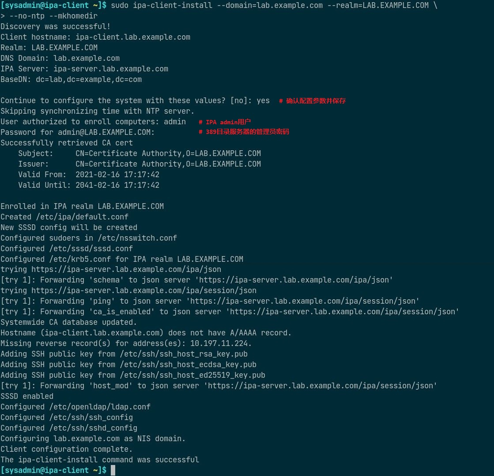</center>

ipa-client 主机添加成功后，在浏览器中可查看该客户端主机。

<center>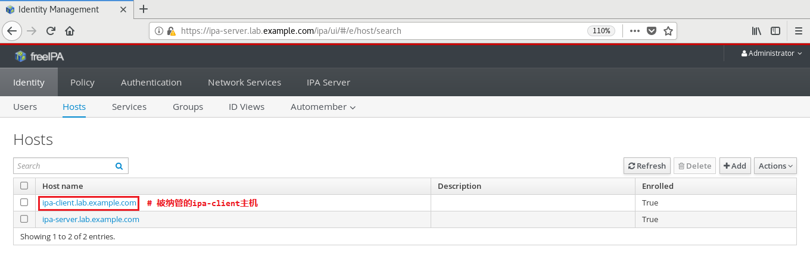</center>

## 添加域用户与设置策略

- 打开浏览器点击 "Identity" -> "Users"，再点击 "+Add" 创建新的域用户。
  
  <center>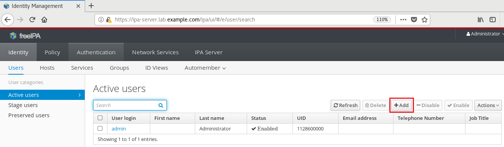</center>
  
  <center>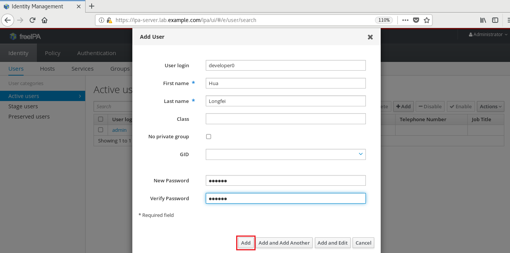</center>
  
  <center>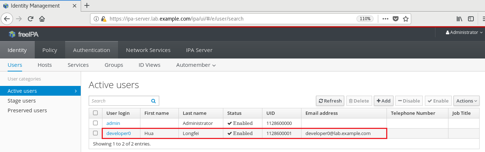</center>

- 点击 "Policy" -> "Host-Based Access Control"，再点击需要设置的 `HBAC` 规则名称或创建新的 `HBAC` 规则。
  
  <center>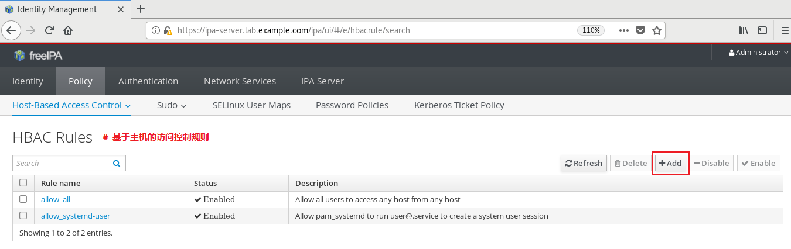</center>
  
  <center>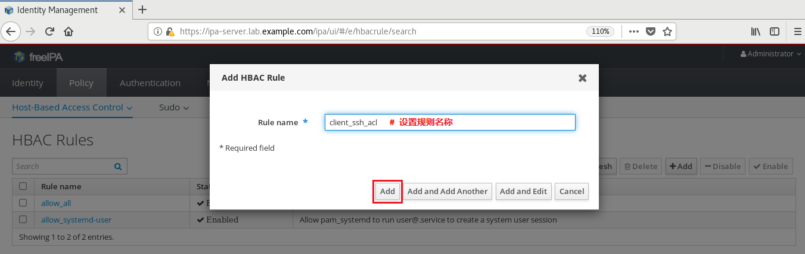</center>

- 再点击新创建的 HBAC 规则定义各规则项。
  
  <center>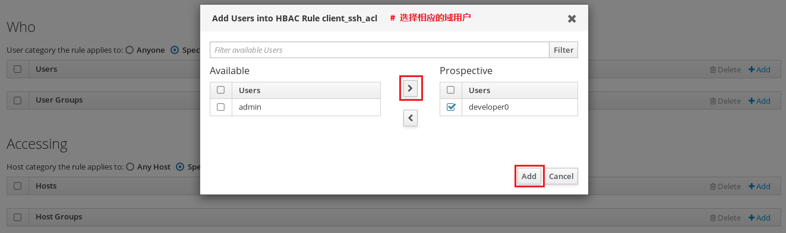</center>
  
  <center>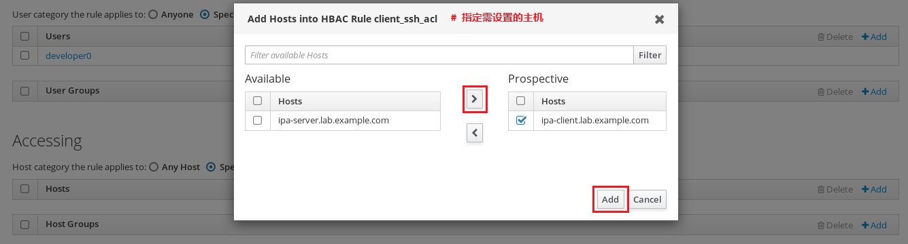</center>
  
  <center>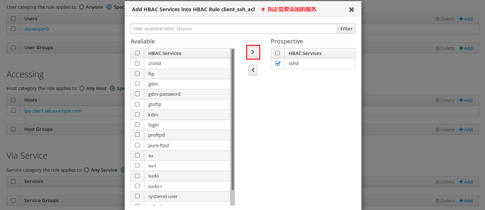</center>

- 可使用该域用户 SSH 登录设置的节点，如下所示：
  
  <center>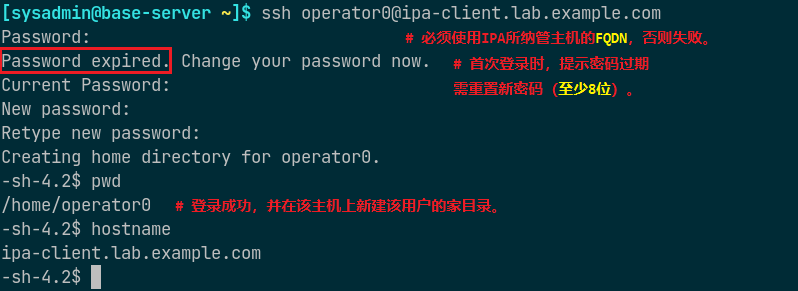</center>

## 参考链接

- [AD user unable to login with error : pam_sss(sshd:auth): authentication failure - Red Hat Customer Portal](https://access.redhat.com/solutions/7004011)
- [Active Directory User failed to login with Error: pam_sss(sshd:account): Access denied - Red Hat Customer Portal](https://access.redhat.com/solutions/2187581)

## 待解决问题

- 如何将主机作为客户端被 ipa 服务端管理？
- 如何使用主机上的 sssd 服务以 ipa 用户远程登录客户端主机？
