# Kerberos 基本原理与集成

## 文档说明

- 实验环境：
  - OS 版本：`Red Hat Enterprise Linux release 8.4 (Ootpa)`
  - Kerberos 版本：
    - krb5-workstation-1.18.2-8.el8.x86_64
    - krb5-server-1.18.2-8.el8.x86_64
    - krb5-libs-1.18.2-8.el8.x86_64
- 实验节点：
  
  | Hostname | Role | Other Services |
  | ----- | ----- | ----- |
  | servera.lab.example.com | Kerberos Server (KDC) | N/A |
  | serverb.lab.example.com | Kerberos Client | Apache HTTPD (GSS-Proxy) & Nginx (Reverse Proxy) |
  | workstation.lab.example.com | Kerberos Client | N/A |

## 文档目录

- [Kerberos 基本原理与集成](#kerberos-基本原理与集成)
  - [文档说明](#文档说明)
  - [文档目录](#文档目录)
  - [Kerberos 核心概念](#kerberos-核心概念)
  - [Kerberos 认证原理](#kerberos-认证原理)
  - [管理 Kerberos Principals](#管理-kerberos-principals)
  - [Kerberos Server (KDC) 部署](#kerberos-server-kdc-部署)
  - [Kerberos 客户端对接 KDC 与 SSO 验证](#kerberos-客户端对接-kdc-与-sso-验证)
  - [实现访问 Kerberos SSO 认证的 Web 服务方式](#实现访问-kerberos-sso-认证的-web-服务方式)
  - [Nginx + Apache + Kerberos 实现 SSO 访问](#nginx--apache--kerberos-实现-sso-访问)
    - [Nginx 反向代理配置](#nginx-反向代理配置)
    - [安装与配置 mod\_auth\_gssapi 模块](#安装与配置-mod_auth_gssapi-模块)
    - [安装与配置 GSS-Proxy](#安装与配置-gss-proxy)


## Kerberos 核心概念

- Kerberos Principals（主体）：
  - Kerberos principals 是 Kerberos 认证系统中用于唯一标识实体（如用户、服务或主机）的名称。它通常采用 `primary[/instance]@REALM` 的格式，其中 ‌primary‌ 表示主体的基本名称（如用户名或 host），‌instance‌ 是可选的实例部分用于进一步区分（例如 admin），‌REALM‌ 是大写的 Kerberos 领域名称，类似于域名。‌
  - Kerberos 里只有两种 principal 类型，区别完全体现在 **命名格式** 和 **用途**，协议本身没有额外的类型字段。

  | 名称 | 格式 | 作用 | 示例 |
  | ----- | ----- | ----- | ----- |
  | **User Principal（UPN）**  | `用户名@REALM` | 代表 **人**（用户、管理员、机器人） | `alice@LAB.EXAMPLE.COM` |
  | **Service Principal（SPN）** | `服务/主机@REALM` | 代表 **服务实例**（HTTP、LDAP、SSH、CIFS 等） | `HTTP/serverb.example.com@LAB.EXAMPLE.COM` |

  - 常见的 SPN 前缀：

  | 前缀 | 服务 | 典型 SPN |
  | ----- | ----- | ----- |
  | `HTTP/` | Web 服务器 | `HTTP/www.lab.example.com@LAB.EXAMPLE.COM` |
  | `ldap/` | 目录服务器 | `ldap/dc.lab.example.com@LAB.EXAMPLE.COM` |
  | `host/` | 主机通用 | `host/serverb.lab.example.com@LAB.EXAMPLE.COM` |
  | `nfs/` | NFS 服务器 | `nfs/nfs.lab.example.com@LAB.EXAMPLE.COM` |
  | `postgres/` | PostgreSQL | `postgres/db.lab.example.com@LAB.EXAMPLE.COM` |

## Kerberos 认证原理

- Kerberos 认证过程与密钥加密过程：
  - 图1：客户端请求 TGT、TGS 与服务的过程中密钥加密的变化
  - 图2：客户端请求 TGT、TGS 与服务的过程中请求与响应

  <center></center>

- Kerberos 认证过程中 principal 类型的变化：

```mermaid
graph LR
    subgraph User
        U["用户身份 alice@lab.example.com"]
        UPN["用户主体 UPN alice@LAB.EXAMPLE.COM：若本地不存在 UPN 的有效 TGT 缓存，那么需要先请求 KDC AS 服务获取 TGT；若本地存在有效 TGT 缓存，那么继续执行。"]
        TGT["用户票据 TGT krbtgt/LAB.EXAMPLE.COM@LAB.EXAMPLE.COM"]
    end

    subgraph KDC Server
        K["KDC (TGS 服务)"]
    end

    subgraph Service
        S["服务身份 HTTP/serverb.lab.example.com@LAB.EXAMPLE.COM"]
        SPN["服务主体 SPN HTTP/serverb.lab.example.com@LAB.EXAMPLE.COM"]
        KEYTAB["keytab"]
        ST["服务票据 ST HTTP/serverb.lab.example.com@LAB.EXAMPLE.COM"]
    end

    U -- 认证 --> UPN
    UPN -- 获取 --> TGT
    TGT -- 换票 --> K
    K -- 颁发 --> ST
    ST -- 解密 --> KEYTAB
    KEYTAB -- 验证 --> S
```



- 💥 注意：为什么通过 kadmin.local 命令行创建 principal 后，依然无法在 Web 页面上显示用户已创建？
  - FreeIPA/IdM/OpenLDAP 中的用户与 Kerberos principal 强绑定（一一对应），通过创建用户将同时创建对应的 principal。
  - 而纯命令行 kadmin.local add_principal 只生成 Kerberos principal，不会在 FreeIPA/IdM/OpenLDAP 里创建 posixAccount（即 uid、gid、home 等系统账号属性）。
  - 因此，即使在客户端使用 kinit demo@LAB.EXAMPLE.COM 此类命令保存了 principal 的 TGT 缓存，但是 SSSD 在枚举用户时根本无法感知这个新建的 principal，自然也不会把它缓存到 /var/lib/sss/db/ 中。
  - 要让 “裸 principal” 也能被 sssctl 显示并用于 SSH 登录，必须手动补录一条同名的 posixAccount 到 LDAP，让 SSSD 有账可查。
  - 所以，kadmin.local add_principal 命令新建 principal 不能在 Web 页面查看。

## 管理 Kerberos Principals

创建新的 principal：

```bash
##Kerberos 认证服务节点/FreeIPA/IdM
$ sudo kadmin.local -x ipa-setup-override-restrictions add_principal -pw <password> <username>@REALM
$ sudo kadmin.local -x ipa-setup-override-restrictions add_principal -pw demotest123 demo@LAB.EXAMPLE.COM
#创建指定名称的 UPN 并设置密码，覆盖默认的严格的 IdM 认证限制。
```

删除已创建的 principal：

```bash
##Kerberos 认证服务节点/FreeIPA/IdM
$ sudo kadmin.local -x ipa-setup-override-restrictions delete_principal <username>
$ sudo kadmin.local -x ipa-setup-override-restrictions delete_principal demo
```

## Kerberos Server (KDC) 部署

```bash
###servera.lab.example.com
$ sudo dnf install -y krb5-server krb5-workstation krb5-libs
#安装 Kerberos 的 KDC 服务端与 Kerberos 管理工具

$ sudo vim /etc/krb5.conf  #Kerberos 配置文件（KDC 与 Kerberos 客户端都应存在）
# To opt out of the system crypto-policies configuration of krb5, remove the
# symlink at /etc/krb5.conf.d/crypto-policies which will not be recreated.
includedir /etc/krb5.conf.d/

[logging]
    default = FILE:/var/log/krb5libs.log
    kdc = FILE:/var/log/krb5kdc.log
    admin_server = FILE:/var/log/kadmind.log

[libdefaults]
    dns_lookup_realm = false
    dns_lookup_kdc = true
    ticket_lifetime = 24h
    renew_lifetime = 7d
    forwardable = true
    rdns = false
    pkinit_anchors = FILE:/etc/pki/tls/certs/ca-bundle.crt
    spake_preauth_groups = edwards25519
#    default_realm = EXAMPLE.COM
    default_realm = LAB.EXAMPLE.COM  #自定义 realm 名称
    default_ccache_name = KEYRING:persistent:%{uid}

[realms]
# EXAMPLE.COM = {
#     kdc = kerberos.example.com
#     admin_server = kerberos.example.com
# }
 LAB.EXAMPLE.COM = {
   kdc = servera.lab.example.com:88
   admin_server = servera.lab.example.com:749
   default_domain = lab.example.com
 }
#自定义具体的 realm

[domain_realm]
# .example.com = EXAMPLE.COM
# example.com = EXAMPLE.COM
 .lab.example.com = LAB.EXAMPLE.COM
 lab.example.com = LAB.EXAMPLE.COM
 servera.lab.example.com = LAB.EXAMPLE.COM


$ sudo vim /var/kerberos/krb5kdc/kdc.conf  #krb5kdc 服务器配置文件
[kdcdefaults]
    kdc_ports = 88  #krb5kdc 服务监听的端口
    kdc_tcp_ports = 88
    spake_preauth_kdc_challenge = edwards25519

[realms]
LAB.EXAMPLE.COM = {  
     master_key_type = aes256-cts
     acl_file = /var/kerberos/krb5kdc/kadm5.acl
     dict_file = /usr/share/dict/words
     #admin_keytab = /var/kerberos/krb5kdc/kadm5.keytab
     supported_enctypes = aes256-cts:normal aes128-cts:normal arcfour-hmac:normal camellia256-cts:normal camellia128-cts:normal
}
#指定的 realm，realm 的名称必须与 /etc/krb5.conf 中的名称保持一致。


$ sudo kdb5_util create -r -s LAB.EXAMPLE.COM
#初始化 KDC 数据库
#启动 krb5kdc 与 kadmin 服务前，需先完成配置文件的编辑，再创建 KDC 数据库，否则在启动服务时将报错。
$ sudo systemctl enable --now krb5kdc.service kadmin.service
#启动 krb5kdc 与 kadmin 服务

$ sudo kadmin.local -q "addprinc -randkey HTTP/serverb.lab.example.com@LAB.EXAMPLE.COM"
#创建 HTTP 类型票据用于 Web 服务类型认证
$ sudo kadmin.local -q "ktadd -k ./http.keytab HTTP/serverb.lab.example.com@LAB.EXAMPLE.COM"
#导出创建的票据为 keytab 文件
$ ls -lh ./http.keytab
$ scp ./http.keytab root@serverb.lab.example.com:/opt/http.keytab  #同步 keytab 文件至 Kerberos 客户端
$ scp /etc/krb5.conf root@serverb.lab.example.com:/etc/krb5.conf  #同步 Kerberos 配置文件至客户端
```

## Kerberos 客户端对接 KDC 与 SSO 验证

本示例中使用 HTTP 类型票据（SPN）进行 Kerberos 客户端连接，完成 SSO 验证。

```bash
###serverb.lab.example.com
$ sudo dnf install -y krb5-workstation krb5-libs
$ kinit -kt /path/to/http.keytab HTTP/serverb.lab.example.com@LAB.EXAMPLE.COM
#使用 SPN 以及指定的 keytab 文件连接 KDC 完成认证（SSO 验证）
# 💥 注意：
#   1. keytab 文件每次在 KDC 节点新生成或者导出后都要在 Kerberos 更新一次，否则将认证失败。
#   2. 若上述命令运行返回成功，则无任何输出。
#   3. 若运行报错 "Could not find ..."，则表明 KDC 中 SPN 对应的 keytab 与指定的 keytab 不一致，
#      或者客户端不存在 /etc/krb5.conf，或者 /etc/krb5.conf 中的配置存在错误，需进行更正。

$ sudo klist -A  #列举 Kerberos 缓存中的票据（SPN 条目）
$ sudo kdestroy  #清除所有缓存的票据（SPN 条目）
```

## 实现访问 Kerberos SSO 认证的 Web 服务方式

- 1️⃣方法1：Nginx 作为反向代理（Reverse Proxy），Apache HTTPD 接收流量并调用 `mod_auth_gssapi` 模块，此模块通过 `/run/gssproxy/http.sock` 套接字与 gssproxy 守护进程通信，使用 keytab 文件完成服务主体 `HTTP/serverb.lab.example.com@LAB.EXAMPLE.COM` 的解密，最终实现 SSO 认证。

```mermaid
%% 时序图：浏览器/curl → Nginx → Apache → GSS-Proxy → KDC → Nginx
sequenceDiagram
    participant Client  as 浏览器/curl
    participant Nginx   as Nginx(8880)
    participant Apache  as Apache(8080)
    participant GSSProxy as GSS-Proxy
    participant KDC      as KDC
    participant Backend  as Nginx(8081)

    %% 第一次请求：无票据
    Client->>Nginx: GET / (无 Authorization)
    Nginx->>Apache: 转发 GET /
    Apache->>GSSProxy: gss_accept_sec_context(空)
    GSSProxy-->>Apache: 返回 401 + WWW-Authenticate: Negotiate
    Apache-->>Nginx: 401 Unauthorized
    Nginx-->>Client: 401 WWW-Authenticate: Negotiate

    %% 客户端拿 TGT → 换 ST
    Client->>KDC: TGT + 目标 SPN=HTTP/serverb.lab.example.com@LAB.EXAMPLE.COM
    KDC-->>Client: ST(HTTP/serverb.lab.example.com@LAB.EXAMPLE.COM)

    %% 第二次请求：带 ST
    Client->>Nginx: GET / + Authorization: Negotiate <ST>
    Nginx->>Apache: 转发 GET / + Negotiate <ST>
    Apache->>GSSProxy: gss_accept_sec_context(ST)
    GSSProxy->>KDC: 验证票据
    KDC-->>GSSProxy: OK
    GSSProxy-->>Apache: 成功 + REMOTE_USER=webuser
    Apache->>Backend: Proxy GET / + X-Remote-User=webuser
    Backend-->>Apache: 200 OK
    Apache-->>Nginx: 200 OK
    Nginx-->>Client: 200 OK
```



- 2️⃣ 方法2：Nginx 直接接收客户端流量，由于其自身不支持 GSS 认证，需要额外编译 `ngx_http_auth_gssapi` 模块，让 GSS-Proxy 提供 `SPNEGO` 认证套接字，Nginx 通过 `ngx_http_auth_gssapi` 模块（动态加载）与之通信，实现 Kerberos SSO。

## Nginx + Apache + Kerberos 实现 SSO 访问

此处以 `方式1` 为例，实现 Kerberos SSO 认证。

### Nginx 反向代理配置

```bash
###serverb.lab.example.com
$ sudo dnf install -y nginx

$ sudo vim /etc/nginx/conf.d/reverse.conf  #编辑 Nginx 反向代理配置文件
server {
    listen 8880;  #监听本地 8880/tcp 端口
    server_name serverb.lab.example.com;

    location / {
        proxy_pass http://127.0.0.1:8080;  #反向代理至本地 8080/tcp 端口（Apache HTTPD 服务的端口）
        proxy_set_header Host $host;
        proxy_set_header X-Real-IP $remote_addr;
    }
}

$ sudo vim /etc/nginx/conf.d/webserver.conf  #编辑 Nginx 的 Web 服务配置
server {
    listen 127.0.0.1:8081;  #监听本地 8081/tcp 端口
    root /usr/share/nginx/html;  #Nginx 根目录
    index index.html;
}
```

### 安装与配置 mod_auth_gssapi 模块

Apache HTTPD 在 mod_auth_gssapi 模块安装过程中也将一并安装，配置过程如下所示：

```bash
###serverb.lab.example.com
$ sudo dnf install -y mod_auth_gssapi  #安装 GSSAPI 模块

$ sudo vim /etc/httpd/conf.d/gssproxy.conf  #编辑 Apache HTTPD 配置文件
Listen 127.0.0.1:8080  #由于 Nginx 与 Apache 部署在同一节点上，且 Nginx 用作反向代理，因此，Nginx 监听回环口 8080/tcp 端口。
<VirtualHost 127.0.0.1:8080>
  ServerName serverb.lab.example.com

  <Location />
    AuthType GSSAPI  #指定认证类型
    AuthName "Kerberos via SSO"
    #GssapiUseGssProxy On  #此参数已弃用
    GssapiAllowedMech krb5  #GSSAPI 允许的认证机制
    GssapiCredStore keytab:/etc/gssproxy/http.keytab  #GSSAPI 认证凭据存储路径
    Require valid-user
    #RequestHeader set X-Remote-User %{REMOTE_USER}s
  </Location>

  ProxyPreserveHost On  #启用反向代理
  ProxyPass  / http://127.0.0.1:8081/
  ProxyPassReverse  / http://127.0.0.1:8081/
</VirtualHost>

$ sudo systemctl enable --now httpd.service
```

### 安装与配置 GSS-Proxy

Apache HTTPD 与 GSS-Proxy 服务之间的关系如下所示：

| 组件 | 作用 |
| ----- | ----- |
| `mod_auth_gssapi` | Apache HTTPD 的 GSSAPI 认证模块（取代旧 `mod_auth_kerb`）|
| `gssproxy` | 让 **非 root 的 httpd 用户** 安全读取 keytab |
| Apache HTTPD | 监听端口，触发 GSSAPI → GSS-Proxy → Kerberos |
| KDC | 颁发 TGT / ST，验证票据。|

```bash
###serverb.lab.example.com
$ sudo vim /etc/gssproxy/80-http.conf 
[service/http]
  mechs = krb5  #指定认证的机制
  #cred_store = keytab:/etc/gssproxy/testuser.keytab
  cred_store = ccache:/var/lib/gssproxy/clients/krb5cc_%U
  socket = /run/gssproxy/http.sock
  trusted = yes
  kernel_nfsd = no
  euid = apache
```
